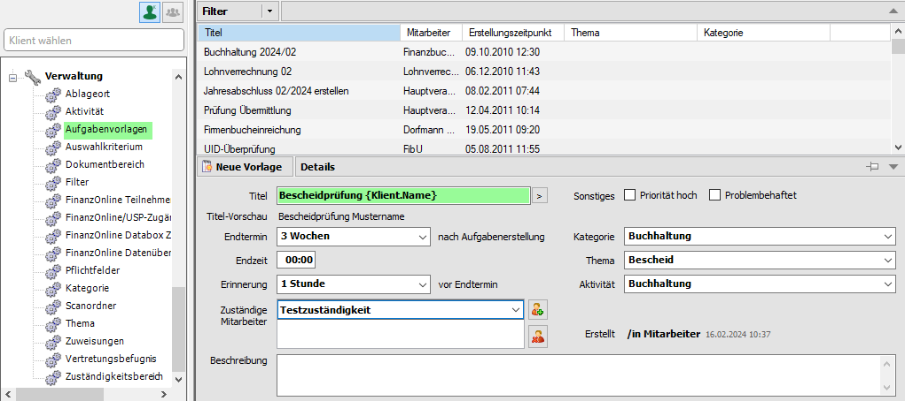
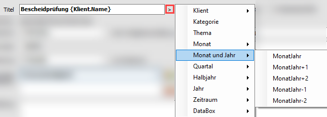

## Arbeiten mit Aufgabenvorlagen

Sie können sich die Anlage von Aufgaben durch die Erstellung von
Aufgabenvorlagen erleichtern. Die Anlage von Aufgabenvorlagen finden Sie
im Bereich Verwaltung nach Anwahl des Eintrags *Aufgabenvorlagen*.

Abb. 4‑17 Anlage einer Aufgabenvorlage

Die Felder für das Erstellen einer Aufgabenvorlage unterscheiden sich
nicht zur normalen Aufgabe.

Allerdings kann im Feld *Titel* mit sogenannten Platzhaltern gearbeitet
werden. Das heißt, dass Sie den Titel nicht händisch eintippen müssen,
sondern die Bezeichnung automatisch vorgeschlagen wird.

Abb. 4‑18 Aufgabenvorlagen - Platzhalter

Die Eintragungen von Zeiträumen und Endtermin bezieht sich immer auf den
*Zeitpunkt der Aufgabenerstellung*.

Im Bereich der zuständigen Mitarbeiter können nicht nur – wie bei einer
normalen Aufgabe – Mitarbeiter zugeordnet werden, sondern auch
Zuständigkeiten. Wenn in der Verwaltung im Zuständigkeitsbereich (vgl.
Kap. 11.14 Zuständigkeitsbereich) beispielsweise eine Zuständigkeit
*Jahresabschluss* definiert ist, kann dieser Eintrag im Feld
*Zuständiger Mitarbeiter* zugeordnet werden. Wenn Sie nun diese
Aufgabevorlage verwenden, wird automatisch der beim jeweiligen
Klienten - als Verantwortlicher für den Jahresabschluss - zugeordnete
Mitarbeiter vorgeschlagen.