Der RZL Klientenspiegel bietet eine aktuelle Übersicht über Ihre
offenen, in Arbeit befindlichen, überfälligen und erledigten Leistungen.
Der Klientenspiegel wird im Bereich der Aufgaben (Mein Arbeitsplatz,
Klientenaufgaben, Kanzleiaufgaben) aufgerufen.

Im Bereich *Mein Arbeitsplatz* werden die Informationen des
Klientenspiegels pro Mitarbeiter angezeigt. Im Klientenbereich sehen Sie
die Daten zum ausgewählten Klienten und schließlich im Kanzleibereich
sämtliche Eintragungen.

Abb. 4‑27 Klientenspiegel – Kanzleibereich

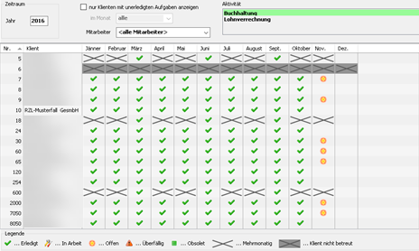

Der Klientenspiegel umfasst die Aktivitäten der Kanzlei für die
Klienten. Im monatlichen Klientenspiegel werden die Aufgaben pro Monat
angezeigt. Im jährlichen Klientenspiegel erfolgt die Darstellung pro
Jahr. Die Aktivitäten werden in der Verwaltung angelegt und können in
den Stammdaten des Klienten und bei den Aufgaben zugeordnet werden.

### Anlage der Aktivitäten

Die Anlage der Aktivitäten erfolgt in der Verwaltung durch Anwahl des
Eintrags *Neue* *Aktivität*.

Abb. 4‑28 Anlage der Aktivitäten

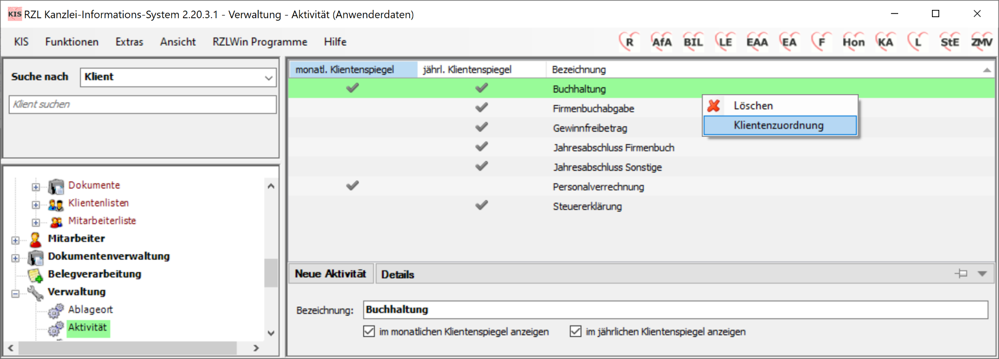

Die angelegte Aktivität kann im monatlichen oder jährlichen
Klientenspiegel angezeigt werden (vgl. Kap. 11.3 Aktivität).

Durch Anwahl der rechten Maustaste und des Eintrags Klientenzuordnung
kann die Aktivität den Klienten inklusive Zyklus zugeordnet werden.

Abb. 4‑29 Klientenauswahl Aktivitäten

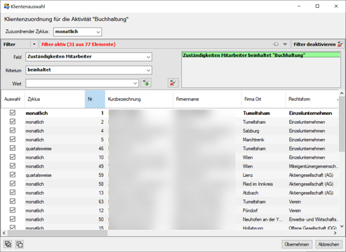

Zunächst wählen Sie oben links den Zyklus der Aktivität aus (monatlich,
vierteljährlich, halbjährlich, jährlich). Anschließend werden die
Klienten durch ein Hakerl ins Kästchen gekennzeichnet und durch Anwahl
der Schaltfläche *Übernehmen* zugeordnet.

Tipp

Sie können sich die Auswahl innerhalb der Klientenliste erleichtern,
indem Sie einen temporären Filter auf die Zuständigkeit (hier:
Buchhaltung) setzen.

### Zuordnung der Aktivitäten in den Klientenstammdaten

Die Zuordnung der angelegten *Aktivitäten/Fachbereiche* kann auch
innerhalb der Klientenstammdaten im Bereich *Zuordnungen* (vgl. Kap.
9.3.1 Zuordnungen) erfolgen.

Abb. 4‑30 Anlage der Aktivitäten

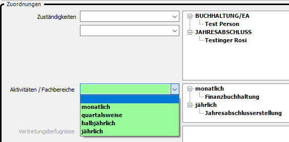

Die Auswahl des Zeitraums für die einzelnen Aktivitäten (monatlich,
quartalsweise, halbjährlich, jährlich) wirkt sich auf die Darstellung
innerhalb des Klientenspiegels aus.

Abb. 4‑31 Klientenspiegel nach Zuordnung im Klientenstamm

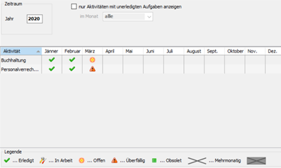

Wenn die Zuordnung in den Stammdaten des Klienten vorgenommen wurde,
werden die Aktivitäten im Klientenspiegel anzeigt. Das Beispiel oben
zeigt den monatlichen Klientenspiegel eines Klienten mit den Aktivitäten
Buchhaltung und Personalverrechnung. Auch die Zeiträume *quartalsweise*
und *halbjährlich* werden im monatlichen Klientenspiegel ausgewiesen
(mit dem Symbol mehrmonatiger Zyklus). Die Aktivitäten denen der
Zeitraum *jährlich* zugeordnet wird (z.B.: Jahresabschluss) werden im
jährlichen Klientenspiegel ausgewiesen.

### Zuordnung der Aktivitäten innerhalb der Aufgaben

Damit im Klientenspiegel die Aufgaben und deren Status (Erledigt, In
Arbeit, usw.) angezeigt werden, ist es notwendig innerhalb der
Erstellung der Aufgaben die *Aktivität* und den *Zeitraum* zuzuordnen.

Abb. 4‑32 Aufgabe – Ausweis im Klientenspiegel

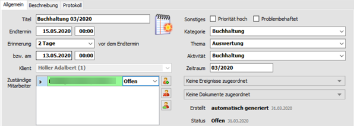

Wenn innerhalb der Eigenschaften der Aufgabe die Felder *Aktivität* und
*Zeitraum* ausgefüllt werden, wird die Aufgabe in den Klientenspiegel
übernommen. Die Anlage der oben angeführten Aufgabe führt zum Ausweis
der (offenen) Aufgabe Buchhaltung 03/2020 im monatlichen
Klientenspiegel.

Abb. 4‑33 Ausweis der (offenen) Aufgabe im monatlichen Klientenspiegel

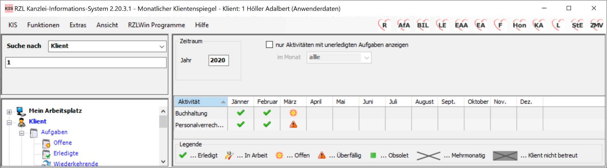

Die Anlage von Aufgaben – mit Aktivität und Zeitraum als Eintrag für den
Klientenspiegel – kann manuell, mit Aufgabenvorlagen oder als
wiederkehrende Aufgaben erfolgen.

Im Zusammenhang mit der Anlage und Verwaltung von Aufgaben erhalten Sie
im Kap. 4.1 *Anlegen und Bearbeiten von Aufgaben*, im Kap. *4.2 Arbeiten
mit Aufgabenvorlagen* und im Kap. 4.3 *Wiederkehrende Aufgaben*
ausführliche Informationen.

### Monatlicher Klientenspiegel

#### Im Klientenbereich

Unten angeführt der monatliche Klientenspiegel für einen bestimmten
Klienten. Die Aktivitäten sind in den Zeilen und die einzelnen Monate in
den Spalten eingetragen.

Abb. 4‑34 monatlicher Klientenspiegel – Klientenbezogen

Im oberen Bereich des Klientenspiegels können Sie im Bereich *Zeitraum*
das Jahr eintragen, das dargestellt werden soll. Vorgeschlagen wird das
aktuelle Jahr. Das Programm zeigt alle Monate des Jahres von Jänner bis
Dezember an, egal ob Einträge vorhanden sind oder nicht.

Abb. 4‑35 Klientenspiegel – Einschränkung auf unerledigte Aufgaben

Wenn das Feld *nur Aktivitäten mit unerledigten Aufgaben anzeigen*
aktiviert wird, werden nur Aktivitäten mit noch nicht erledigten
Aufgaben angezeigt. Zusätzlich kann die Darstellung auf bestimmte Monate
eingeschränkt werden.

#### Im Kanzleibereich/Mein Arbeitsplatz

Im Klientenspiegel der Kanzlei bzw. auf der Ebene Mein Arbeitsplatz sind
in den Zeilen die Klienten mit Nummer und Bezeichnung und in den Spalten
die Monate eingetragen.

Abb. 4‑36 Klientenspiegel – Kanzleibereich

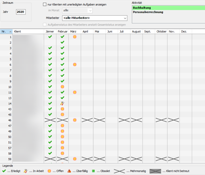

Die Darstellung erfolgt für den im rechten oberen Bereich *Aktivität*
angewählten Eintrag (hier: Buchhaltung).

Abb. 4‑37 monatlicher Kanzlei-Klientenspiegel eingeschränkt

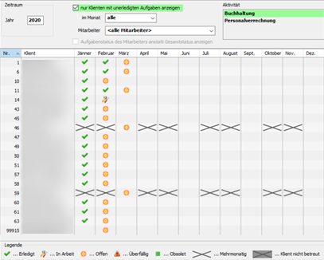

Wenn das Feld *nur Klienten mit unerledigten Aufgaben anzeigen*
aktiviert wird, werden nur Klienten mit noch nicht erledigten Aufgaben
angezeigt. Zusätzlich kann die Darstellung auf bestimmte Monate
eingeschränkt werden.

Im Kanzleibereich kann die Einschränkung auf Monate mit unerledigten
Aufgaben sehr wesentlich zur übersichtlichen Darstellung der noch
offenen Aktivitäten beitragen.

Im oben angeführten Beispiel werden für die Aktivität *Buchhaltung* die
noch nicht erledigten Aufgaben ohne Einschränkung auf einen bestimmten
Monat angezeigt.

Grundsätzlich sehen Sie die Aufgaben aller Mitarbeiter. Im oberen
Bereich des Bildschirms können Sie die Aufgaben auf einzelne Mitarbeiter
einschränken.

### Jährlicher Klientenspiegel

Im jährlichen Klientenspiegel sind jene Aktivitäten eingetragen, bei
denen innerhalb der Klientenstammdaten im Bereich *Zuordnungen* die
Aktivität mit dem Zeitraum jährlich verknüpft ist (vgl. Kap. 9.3.1
*Zuordnungen*).

Abb. 4‑38 Jährlicher Kanzlei-Klientenspiegel

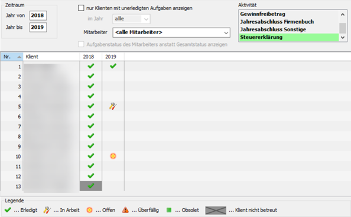

Die Darstellung und Bedienung der jährlichen Klientenspiegel ist ident
mit den oben beschriebenen monatlichen Spiegeln. Mit einer Ausnahme
allerdings. Im Bereich *Zeitraum* können Sie in den Felder *Jahr von* …
*Jahr bis* eintragen, welche Jahre dargestellt werden sollen.

### Detaillierte Darstellung der Aufgaben im Klientenspiegel

Wenn Sie sich innerhalb des Klientenspiegels mit der Maustaste über
einem bestimmten Eintrag befinden, wird eine Kurzinformation für die
Aufgabe angezeigt.

Abb. 4‑39 Klientenspiegel - Tooltipp

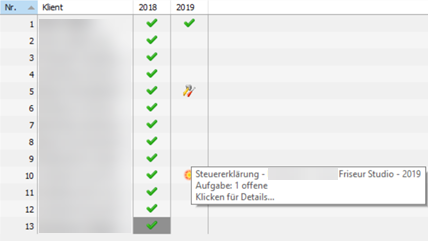

Wenn innerhalb der Klientenspiegel ein Eintrag mit der linken Maustaste
angewählt wird, wird die Aufgabe im Detail angezeigt.

Abb. 4‑40 Klientenspiegel – Aufgabe im Detail

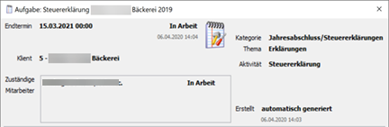

Das hier anzeigte Aufgabendetail betrifft die Erstellung der
Steuererklärung für das Jahr 2019 des Klienten 5.