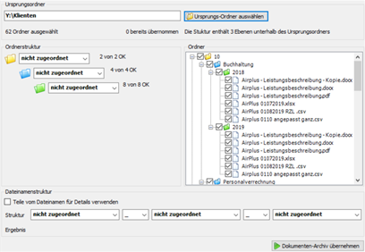
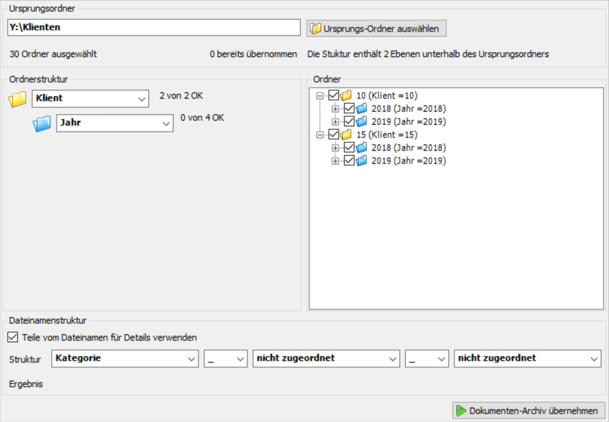

## Archiv-Import

### Archiv-Import aufgrund der Ordnerstruktur

Das Kanzlei-Informations-System bietet die Möglichkeit
Dokumenten-Archive, die strukturiert gespeichert sind, automatisiert in
die Dokumentenverwaltung zu übernehmen.

Diese Übernahme erfolgt durch Anwahl des Programmteils *Extras /
Strukturiertes Dokumentenarchiv* übernehmen.

Abb. 8‑33 Auswahl des Ursprungs-Ordners

Als nächsten Schritt müssen Sie die Schaltfläche *Ursprungs-Ordner
auswählen* anklicken. Sie wählen bitte den Ordner aus, in dem Ihre
Dokumente in strukturierter Form abgespeichert sind.

Der Ursprungordner in diesem Beispiel liegt am Laufwerk *Y* und heißt
*Klienten*. Das Kanzlei-Informations-System zeigt Ihnen an, wie viele
Ordner ausgewählt sind (hier 14 Ordner) und wie viele Ebenen unterhalb
des Ursprungsordners vorhanden sind (hier drei Ebenen).

Im Bereich *Ordner* sehen Sie die einzelnen Ordner innerhalb der
vorhandenen Ebenen. Die Häkchen im Kästchen bedeuten, dass eine
Übernahme der Dokumente, die in den Ordnern abgelegt sind, grundsätzlich
möglich ist. Wenn mit den obigen Eintragungen der Import bereits
durchgeführt wird, werden die Dokumente im Kanzleibereich abgelegt,
allerdings ohne Klientenzuordnung, ohne Eintragung von Kategorie/Thema
oder Zeitraum in den Details zum jeweiligen Dokument.

Um eine *strukturierte* Übernahme zu erreichen, müssen Sie im Bereich
*Ordnerstruktur* die Struktur Ihrer Dokumentenablage für die Übernahme
in das Kanzlei-Informations-System übersetzen.

Im oben angeführten Beispiel liegt folgende – im unten angeführten
Bildschirm – abgebildete Ordnerstruktur vor.

Abb. 8‑34 Archiv-Import – Beispiel: Ordnerstruktur

Unterhalb des Ursprungsordners mit der Bezeichnung *Klienten* wird
als 1. Ebene die Klientennummer geführt. Die zweite Ebene bezieht sich
auf die jeweilige Leistung wie Buchhaltung oder Personalverrechnung (im
Kanzlei-Informations-System als *Kategorie* bezeichnet). Die dritte
Ebene sorgt für die Aufteilung der Dokumente auf die einzelnen
Kalenderjahre.

Abb. 8‑35 Dokumenten-Archiv übernehmen

Für die strukturierte Übernahme der Dokumente in diesem Beispiel muss in
der ersten Ebene der Eintrag *Klient*, in der zweiten Ebene der Eintrag
*Kategorie* und in der dritten Ebene der Eintrag *Jahr* angewählt
werden.

Somit werden die Dokumente im Zuge der Übernahme sofort den richtigen
Klienten zugeordnet. In den Details wird der Bezeichnung der zweiten
Ebene (Personalverrechnung, Buchhaltung) als *Kategorie* eingetragen und
die Gültigkeitsdauer des Dokuments leitet sich aus der dritten Ebene –
dem *Jahr* – ab.

Wichtig sind im Bereich *Ordner* die Häkchen in den Kästchen können die
Inhalte dieser Ordner übernommen werden.

Nach Anwahl der Schaltfläche *Dokumenten-Archiv übernehmen* werden die
Inhalte der Ordner, die ein Häkchen aufweisen, aufgrund der Eintragungen
in der Ordnerstruktur (hier: Klient, Kategorie, Jahr) importiert. Die
Dokumente, die übernommen werden, werden als bereits übernommen
gekennzeichnet (automatische Änderung des Dateinamens) und können nicht
nochmals übernommen werden.

### Archiv-Import aufgrund der Ordnerstruktur und des Dateinamens

Im Zuge des Archiv-Imports können Sie auch den Dateinamen für die
automatische Ein­tragung der Details zum Dokument verwenden. Vorrang
haben immer die Einstellungen in der Ordnerstruktur.

Den Bereich *Dateinamenstruktur* können Sie nützen, wenn sich im
Dateinamen Informationen finden, die in der Ordnerstruktur nicht
enthalten sind.

Abb. 8‑36 Archiv-Import – Dateinamenstruktur I

Wenn Sie beispielsweise eine Ordnerstruktur angelegt haben, wo eine
Unterteilung nach Klienten und Jahr stattfindet, fehlt in dieser
Struktur die Kategorie bzw. das Thema (z. B. Finanzbuchhaltung,
Personalverrechnung). Wenn diese Begriffe allerdings im Dateinamen
vorkommen, können Sie den Dateinamen nützen, um diese Informationen in
den Details automatisch einzutragen. In diesem Fall ist es ausreichend,
im Bereich *Dateinamenstruktur* im ersten Feld den Eintrag *Kategorie*
anzuwählen (siehe oben).

Abb. 8‑37 Archiv-Import – Dateinamenstruktur II

Ein weiteres Beispiel ist die Ablage der Dokumente getrennt nach
Klientennummern. Die Dateibezeichnungen enthalten die Kategorie und das
Jahr (z.B.: Jahresabschluss_2019)
