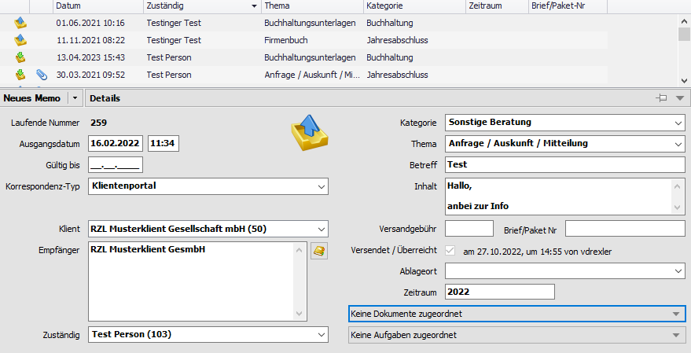
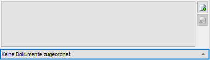
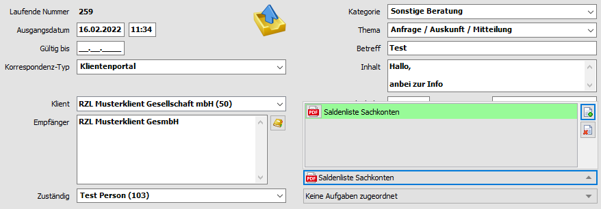
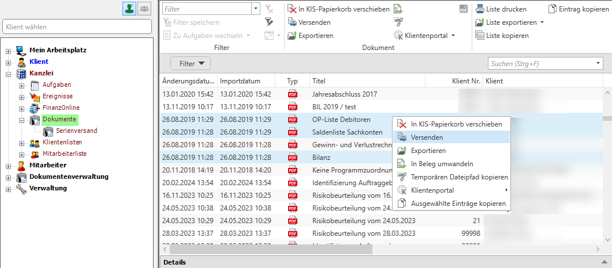

## Verknüpfung von Dokumenten mit Ereignissen

Die vorhandenen Dokumente können Sie sehr einfach mit Ereignissen
verknüpfen. Bitte beachten Sie dass sich die Verknüpfungen in der Regel
durch die Arbeitsabläufe selbst ergeben (vgl. Kap. 13 *Abläufe*). Die
Beschreibung der Ereignisse finden Sie im Kapitel 5.2 Ereignisse.

Nachfolgend erhalten Sie eine Beschreibung der Verknüpfung eines
Dokuments mit einem Memo.

Abb. 8‑29 Verknüpfung von Dokumenten mit Ereignissen (Postausgang)

Innerhalb eines Ereignisses haben Sie die Möglichkeit Dokumente
zuzuordnen. Zunächst wählen Sie bitte die Schaltfläche *Keine Dokumente
zugeordnet* an.

Anschließend klicken Sie für die Zuordnung auf
. Sie erhalten die
Dokumentenliste mit einem automatischen Filter auf den Klienten der im
Ereignis zugeordnet ist. Informationen zum Setzen von Filtern finden Sie
im Kapitel 3.5 *Filterfunktionen*.

Abb. 8‑30 Dokumentenliste gefiltert

Sie markieren bitte das oder die gewünschten Dokumente. Sie können auch
mehrere Dokumente gleichzeitig auswählen, durch Anwahl der
UMSCHALT-Taste (Bereichsauswahl) oder STRG-Taste (Einzelauswahl) und der
Maustaste.

Nach dem Setzen der Markierung klicken Sie auf die Schaltfläche
*Hinzufügen*.

Abb. 8‑31 Zuordnung von Dokumenten zu Ereignissen

Im Ereignis werden der Name des Dokuments und das Dokumentensymbol
eingefügt. Durch einen Klick mit der Maus können Sie das Dokument in der
Liste aufrufen.

Wenn Sie die Zuordnung des Dokuments zum Ereignis wieder löschen wollen,
markieren Sie einfach das bzw. die Dokumente (Mehrfachauswahl ebenfalls
möglich) und wählen das Symbol für das Löschen der Zuordnung des
Dokuments zum Ereignis an .

## Versenden von Dokumenten

Dokumente, die Sie im Kanzlei-Informations-System hinzugefügt haben,
können Sie sehr einfach per E-Mail versenden.

Abb. 8‑32 Dokumentenverwaltung - Versenden von Dokumenten per E-Mail

Sie markieren das Dokument (Mehrfachauswahl ist möglich – siehe oben),
dass Sie per E-Mail senden wollen, wählen die rechte Maustaste an und
klicken auf den Eintrag *Versenden*.

Nachfolgend können Sie aus den innerhalb der Stammdaten der Klienten
gespeicherten E-Mail-Adressen auswählen oder das E-Mail ohne Eintragung
einer Empfänger E-Mail-Adresse öffnen.

Wenn Sie die E-Mail versendet haben, können Sie dieses sehr einfach als
Postausgang erfassen (vgl. Kap. 13.3 E-Mails schreiben).

Die nachfolgend beschriebenen Funktionen der Dokumentenliste stehen
Ihnen sowohl per Rechtsklick sowie auch im Header unter dem Reiter
Dokumente zur Verfügung.

## Dokument-Kopien speichern oder verschieben

Mittels Drag & Drop können ab Windows Vista einzelne oder mehrere
Dokumente kopiert werden (z.B.: in eine bereits geöffnete E-Mail
Nachricht).

Sie können einzelne oder mehrere Dokumente aber auch durch Drücken der
rechten Maustaste und Anwahl des Eintrags *Exportieren* im Explorer
abspeichern.

## In Beleg umwandeln

Möchten Sie ein im KIS abgespeichertes Dokument in die RZL
Belegverarbeitung importieren, können Sie dies mithilfe des Eintrags *In
Beleg umwandeln* erreichen.

## Temporären Dateipfad kopieren

Der (interne und temporäre) Ablageort eines Dokuments kann im
Kontextmenü der Dokumentenliste in die Zwischenablage kopiert und somit
weiteren Kanzleimitarbeitern zum Weiterbearbeiten eines Dokuments
mitgeteilt werden.

## Zum RZL Klientenportal (mit Nachricht) hochladen

Um Dokumente an Ihre Klienten über das RZL Klientenportal zur Verfügung
zu stellen, können ein oder mehrere Dokumente ausgewählt werden und über
den Eintrag *auf das RZL Klientenportal hochgeladen* der Upload
gestartet werden. Dabei kann mithilfe der Option *Zum Klientenportal mit
Nachricht hochladen* auch eine Nachricht über die erfolgte
Bereitstellung des Dokumentes an den Klienten übermittelt werden.