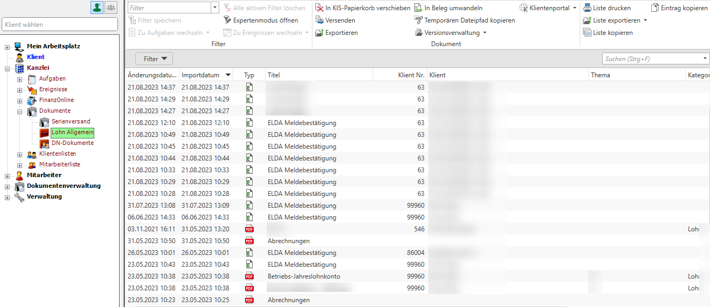
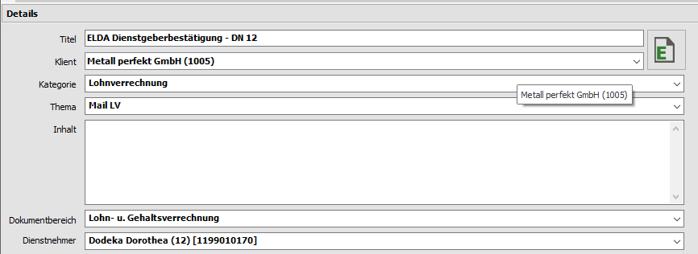
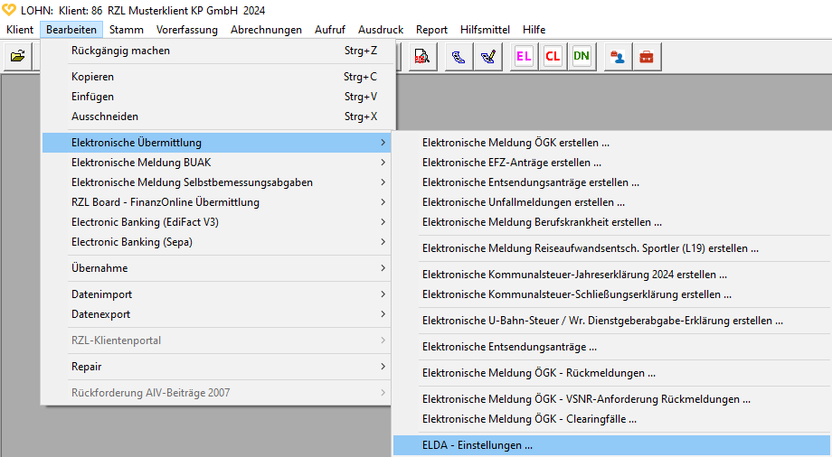
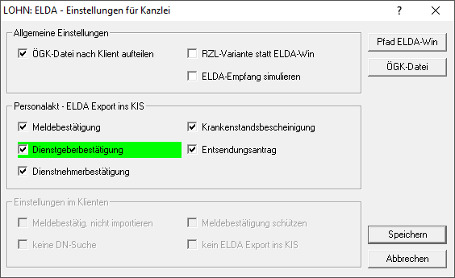
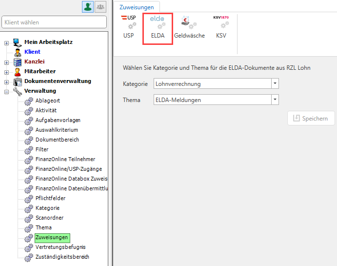
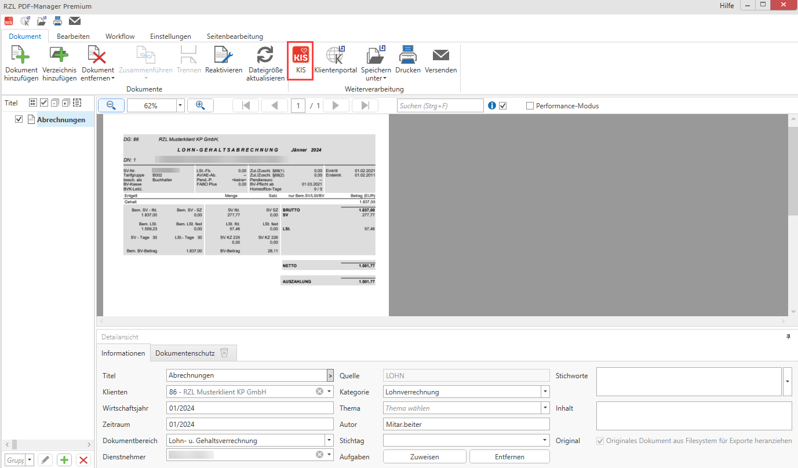
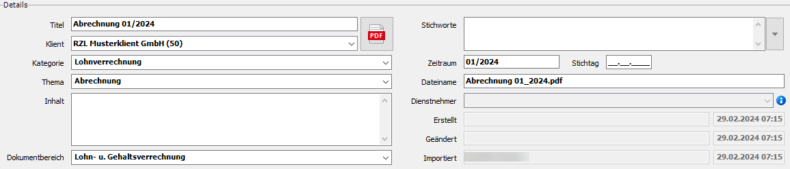
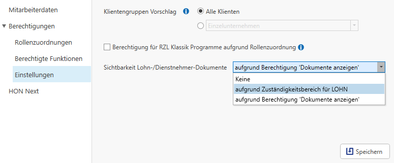

## Hinzufügen von Dokumenten aus dem RZL Lohn (digitaler Personalakt)

Haben Sie den digitalen Personalakt innerhalb des RZL
Kanzleiinformationssystems lizensiert, erscheinen in allen drei Ebenen
(Mein Arbeitsplatz, Klient und Kanzlei) unter dem Punkt *Dokumente* die
Menüpunkte *Lohn Allgemein* sowie *DN-Dokumente.* Je nachdem auf welcher
Ebene Sie sich befinden, finden Sie unter *Lohn-Allgemein* alle
Lohn-spezifischen Dokumente und unter *DN-Dokumente*
(Dienstnehmer-Dokumente) alle Dokumente mit Bezug zu einem Dienstnehmer
Ihres Klienten.

Die Funktionen innerhalb dieser Liste sind mit den Funktionen der
„Standard“ Dokumentenliste ident. (Vgl. Kapitel 8.1 Allgemeines Seite
[127](#allgemeines-1)).

Abb. 8‑14 Digitaler Personalakt in allen drei Ebenen

Im Detail der Dokumente erkennen Sie die Lohn-Dokumente stets am
Dokumentbereich: *Lohn- u. Gehaltsverrechnung.*

Abb. 8‑15 Dokumentbereich: Lohn- u. Gehaltsverrechnung

Innerhalb der Liste der *Dienstnehmer-Dokumente* haben Sie die
Möglichkeit einen Filter auf einen Dienstnehmer zu setzen um sich alle
Lohn relevanten Dokumente für diesen Dienstnehmer anzuzeigen.

Abb. 8‑16 Digitaler Personalakt DN-Dokumente

### ELDA-Dokumente aus RZL Lohn hinzufügen

Im RZL-Lohn können Sie unter *Klient / Elektronische Übermittlung /
ELDA-Einstellungen* im folgenden Dialog unter *Personalakt – ELDA Export
ins KIS* festlegen welche ELDA-Dokumente Sie automatisiert ins KIS
abspeichern möchten.

Abb. 8‑17 ELDA-Export KIS I

Abb. 8‑18 ELDA-Export KIS II

Im Kanzleiinformationssystem kann unter *Verwaltung/ELDA-Zuweisungen*
festgelegt werden unter welcher Kategorie und mit welchem Thema die
ELDA-Dokumente abgelegt werden sollen.

Abb. 8‑19 ELDA-Zuweisungen Kanzleiinformationssystem

### Andere Dokumente aus RZL Lohn hinzufügen

Alle anderen Dokumente aus dem RZL Lohn können über den RZL
PDF-Manager-Premium bzw. den RZL PDF-Drucker in das RZL
Kanzleiinformationssystem (**1**) hinzugefügt werden. Der
Dokumentbereich *Lohn- u. Gehaltsverrechnung* zur korrekten Zuordnung
unter die Lohn-Dokumente wird hier bereits automatisch vorgeschlagen.

Abb. 8‑20 Dokumente aus dem PDF-Manager/Drucker hinzufügen

### Lohn Dokumente aus dem Explorer/MS-Office Programmen hinzufügen

Möchten Sie Lohn-Dokumente aus dem Explorer bzw. den MS-Office
Programmen in den digitalen Personalakt des RZL
Kanzleiinformationssystems hinzufügen müssen Sie den vorhandenen
Dokumentbereich *Lohn- u. Gehaltsverrechnung* (**1**) auswählen.

Abb. 8‑21 Dokumente aus dem Explorer/MS-Office Programmen hinzufügen

### Lohn Dokumente aus Klientenportal hinzufügen

Dokumente können eingeschränkt auf einen Dokumentbereich aus dem
Klientenportal in das KIS hinzugefügt werden. Beim Dokumentbereich Lohn-
und Gehaltsverrechnung wird auch automatisch der Dienstnehmer
übernommen, insofern dieser im Klientenportal vom Klienten hinterlegt
wurde.

### Sichtbarkeit der Lohn- bzw. Dienstnehmer-Dokumente

In den Mitarbeiterstammdaten im Board können Sie die Sichtbarkeit der
Lohn- bzw. der Dienstnehmer-Dokumente einschränken.

Abb. 8‑22 Sichtbarkeiten der Lohn-bzw. Dienstnehmer-Dokumente

<table>
<colgroup>
<col style="width: 24%" />
<col style="width: 75%" />
</colgroup>
<thead>
<tr>
<th>Keine</th>
<th>Der Mitarbeiter hat keinen Zugriff auf Lohn- bzw.
Dienstnehmer-Dokumente</th>
</tr>
</thead>
<tbody>
<tr>
<td>Aufgrund Zuständigkeits-bereich für LOHN</td>
<td>
Der Mitarbeiter hat Zugriff auf die Lohn- bzw.
Dienstnehmer-Dokumente der Klienten, für die dieser laut der Zuordnung
Zuständigkeiten auch zuständig ist.

Abb. 8‑23 Sichtbarkeit aufgrund Zuständigkeitsbereich für LOHN

</td>
</tr>
<tr>
<td>Aufgrund Berechtigung ‘Dokumente anzeigen’</td>
<td>Der Mitarbeiter hat Zugriff auf die Lohn- bzw.
Dienstnehmer-Dokumente der Klienten, für die dieser die Berechtigung
<em>Dokumente anzeigen</em> (KIS/Dokumente) besitzt.</td>
</tr>
</tbody>
</table>
