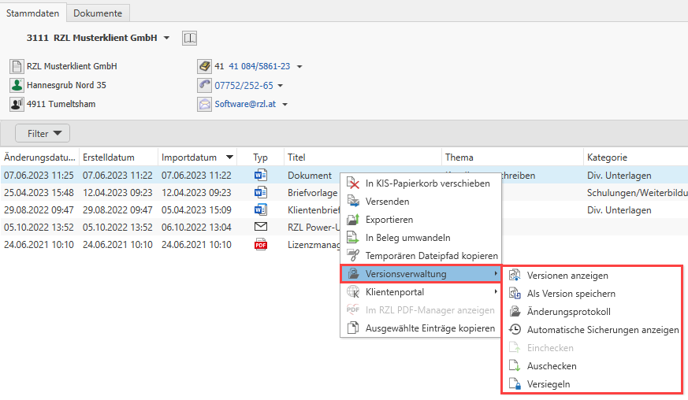
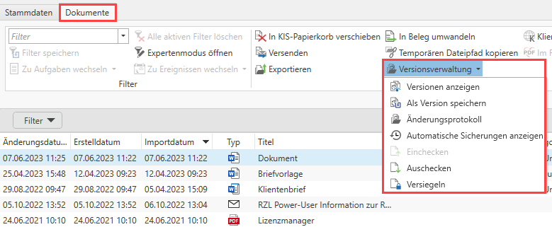
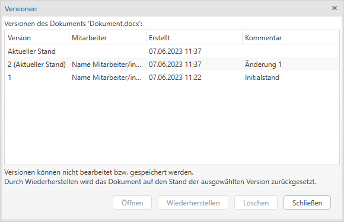
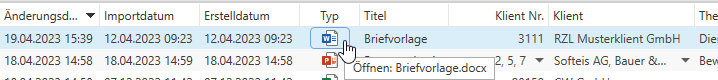
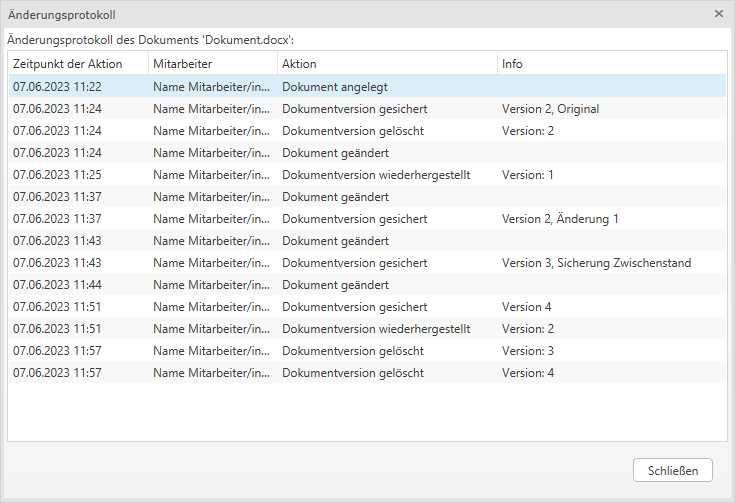

## Versionsverwaltung

Die Versionsverwaltung im RZL Kanzlei-Informationssystem bietet Ihnen
die Möglichkeit die Versionen von Dokumenten zu öffnen, löschen und
wiederherzustellen, Dokumente ein- und auszuchecken, Dokumente zu
versiegeln und ein Änderungsprotokoll auszugeben.

Voraussetzung für eine funktionierende Versionsverwaltung ist die
**Dokumentenverwaltung Plus**.

Die Versionsverwaltung befindet sich im Klienten- und Kanzleibereich bei
den Dokumenten. Mit einem Rechtsklick auf einen Eintrag können Sie über
das Kontextmenü die Funktionen der Versionsverwaltung nutzen.

Abb. 8‑24 Versionsverwaltung - Kontextmenü

Oder Sie verwenden die Funktion in der Menüleiste, um die
Versionsverwaltung nutzen zu können.

Abb. 8‑25 Versionsverwaltung - Menüleiste

**Versionen anzeigen**

Unter *Versionen anzeigen* finden Sie die gespeicherten Versionen sowie
die aktuelle Version des Dokuments. Die in der Liste befindlichen
gespeicherten Versionen können Sie öffnen, löschen und wiederherstellen.

Abb. 8‑26 Versionen anzeigen

Beim Öffnen gespeicherter Versionen ist keine Bearbeitung möglich bzw.
können Sie die Änderungen nicht speichern. Möchten Sie eine Version
bearbeiten, müssen Sie diese zuerst wiederherstellen. Durch die
Wiederherstellung wird die ursprünglich aktuelle Version durch die
ausgewählte Version ersetzt. Somit ist die Version, die Sie
wiederhergestellt haben nun die aktuelle Version.

**HINWEIS**

Die als Initialstand gekennzeichnete Version ist die Ursprungs-Datei.
Diese Version müssen Sie nicht speichern, denn das geschieht mit dem
Hinzufügen der Datei automatisch.

**Als Version speichern**

Soll die aktuelle Version als Version gespeichert werden, können Sie
dies mit der Funktion *Als Version speichern* durchführen. Sie können
hierzu auch einen Kommentar erfassen.

Die aktuelle Version ist nicht zwingend zu speichern. Sie wird unter
*Versionen anzeigen* als (Aktueller Stand) gekennzeichnet.

**HINWEIS**

Wenn die durch eine gespeicherte Version ersetzte aktuelle Version
ebenso als Version gespeichert wurde, kann auch diese Version
wiederhergestellt werden.

Beim standardmäßigen Öffnen eines Dokuments wird selbstverständlich
immer die aktuelle Version geöffnet.

Abb. 8‑27 Öffnen der aktuellen Version

**Änderungsprotokoll**

Im Änderungsprotokoll wird aufgezeichnet wann ein Mitarbeiter welche
Aktion für dieses Dokument durchgeführt hat. Für die Aktion
*Dokumentversion wiederhergestellt* wird zusätzlich als Info angezeigt,
welche Version hergestellt wurde.

Es stehen Ihnen auch im Änderungsprotokoll die RZL typischen
Listenfunktionen zur Verfügung.

Abb. 8‑28 Änderungsprotokoll

**Automatische Sicherungen**

Die Funktion Automatische Sicherungen steht Ihnen bereits seit der
Programmversion 2.22.9 zu Verfügung.

Automatische Sicherungen stehen für eine gewisse Zeitspanne zur
Verfügung, um Dokumentenversionen, die überschrieben wurden
wiederherzustellen.

Von RZL voreingestellt ist ein Zeitraum von 1 Tag, dieser kann jedoch
individuell abgeändert werden. Nach dieser Zeit werden die Sicherungen
automatisch gelöscht.

**HINWEIS**

Ein nicht als Version abgespeichertes Dokument wird bearbeitet und
gespeichert – ob es als Version gespeichert wird ist nicht wesentlich.
Die vorige Version scheint somit nicht unter Versionen anzeigen auf, da
das Dokument nicht als Version gespeichert wurde. Das Dokument ist
jedoch in den automatischen Sicherungen wiederherstellbar.

**Dokumente ein- und auschecken**

Um sicherzustellen, dass ein Dokument von keinem anderen Benutzer
bearbeitet oder gelöscht wird, kann dieses über die Funktion Auschecken
für die Bearbeitung gesperrt werden.

Soll ein Dokument wieder zur Bearbeitung für andere Benutzer
freigeschalten werden, ist dies mit der Funktion Einchecken möglich.

Dokumente einchecken kann nur der Benutzer, der das Dokument ausgecheckt
hat und Mitarbeiter mit dem Recht von anderen Benutzern ausgecheckte
Dokumente wieder einzuchecken.

**Dokumente versiegeln**

Sollen Dokumente dauerhaft für weitere Bearbeitungen gesperrt werden,
dann können diese versiegelt werden. Das Versiegeln betrifft nur das
Dokument selbst. Die KIS Metadaten wie z.B. Titel, Thema, Kategorie,
Dokumentbereich, … sind davon nicht betroffen.

Nachdem Sie ein Dokument versiegelt haben ist das Wiederherstellen von
Versionen bzw. automatischen Sicherungen, das Bearbeiten des
Dateiinhaltes und das Umwandeln in Belege nicht mehr möglich.

Ein Dokument kann nicht versiegelt werden, wenn das Dokument ausgecheckt
ist. Dieses muss zuerst eingecheckt werden, damit es versiegelt werden
kann.
