## Allgemeines

Ereignisse sind Vorgänge innerhalb der Kanzlei und zwischen Kanzlei und
Klienten und umgekehrt. Die Verwaltung dieser Ereignisse erlaubt bessere
Organisation, Wiederfinden und Nachverfolgen von Auswertungen und
ähnlichem.

*Ereignisse* sind ein Überbegriff für die Vorgänge *Posteingang*,
*Postausgang*, *Telefonprotokolle, Sonstige Memos* und *Klientenportal*.
Diese insgesamt 5 speziellen Ausprägungen von Ereignissen bieten Ihrer
Kanzlei die Möglichkeit den Informationsfluss zwischen Ihrer Kanzlei und
Ihren Klienten in übersichtliche Bahnen zu lenken.

Ereignisse können im Kanzlei-Informations-System mit Datum, Uhrzeit und
dem zuständigen Mitarbeiter gespeichert werden. Sie können dem Ereignis
ein Thema und/oder eine Kategorie zuordnen. Diese Felder können bei der
Auswertung der Ereignisse als Filterkriterien verwendet werden.
Dokumente - die Sie erhalten und versenden - können den Ereignissen
zugeordnet werden. Ebenso kann ein Ereignis einer bereits bestehenden
Aufgabe oder einer neu erstellten Aufgabe zugeordnet werden. Damit haben
Sie bei der Erledigung Ihrer Aufgaben jederzeit die zugehörigen
Ereignisse parat.

Sie können Ereignisse am Arbeitsplatz, pro Klienten und im
Kanzleibereich aufrufen, sortieren und bearbeiten. Die Vorgehensweise
ist in allen drei Bereichen gleich.

Abb. 5‑1 Kanzlei Ereignisse

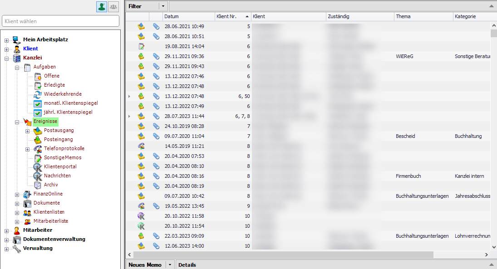

Für die Handhabung der Listen (hier Liste mit den Kanzleiereignissen)
lesen Sie bitte im Kapitel 3 *Allgemeine neue Programmbedienung* nach.
Sie finden Anleitungen in den Punkten 3.4 *Möglichkeiten der
Listengestaltung* und 3.5 *Filterfunktionen*.

Abb. 5‑2 Ereignisliste drucken

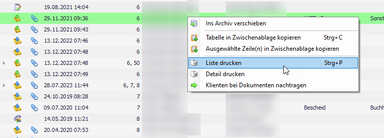

Wenn Sie innerhalb der Ereignisliste die rechte Maustaste anwählen, wird
ein Kontextmenü aufgerufen, das Ihnen die Kopie der Liste in die
Zwischenablage bzw. den Ausdruck der Liste ermöglicht.

Ältere Einträge können markiert und ins Archiv verschoben werden.
Archivierte Einträge scheinen in den Ereignislisten nicht mehr auf,
können aber immer durch Anwahl des Eintrags *Archiv* aufgerufen werden.

Innerhalb der Klientenzuordnung bei den Ereignissen kann eine
Mehrfachzuordnung zu mehreren Klienten erfolgen.

Wenn Sie innerhalb der Ereignisdetails die rechte Maustaste anwählen,
können Sie aus dem Ereignisheraus eine Aufgabe erstellen (vgl. Kap. 4
*Aufgaben/Klientenspiegel*).

Die Erfassung der Ereignisse ergibt sich in den meisten Fällen aus dem
laufenden Arbeiten (vgl. Kap. 13 *Abläufe*). Nachfolgend finden Sie eine
Beschreibung der Felder der Ereignisse ohne die Einbindung in einen
bestimmten Ablauf.

## Postausgang

Wählen Sie im Navigator über den Eintrag *Ereignisse* die Zeile
*Postausgang* an und Sie erhalten die bereits erfassten Postausgänge
angezeigt. Um einen neuen Postausgang zu erfassen, klicken Sie bitte auf
die Schaltfläche *Neuer Postausgang*.

Abb. 5‑3 Erfassung eines Postausgangs

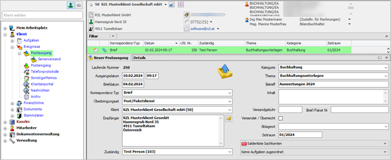

Hinweis

Wie Sie einen Brief bzw. ein E-Mail automatisch als Postausgang erfassen
können, lesen in den Kapiteln 13.1 *Briefe schreib*en bzw. 13.3 *E-Mails
schreiben*.

Im unteren rechten Bereich des Bildschirms können die Details für den
Postausgang ausgefüllt werden.

#### Laufende Nummer

Die Nummernvergabe erfolgt automatisch nach dem Speichern des neuen
Postausgangs. Ein gespeicherter Postausgang kann nicht mehr gelöscht
werden.

#### Ausgangsdatum

Das Ausgangsdatum wird vorgeschlagen (Tagesdatum). Die aktuelle Uhrzeit
wird ebenfalls vorgeschlagen.

#### Briefdatum

Wenn Sie als Korrespondenz-Typ (siehe unten) einen Brief speichern,
können Sie abweichend zum Ausgangsdatum das Datum des Dokuments
zusätzlich abspeichern. Die Eintragung Eingangsdatum ist gleich
Briefdatum ist natürlich genauso möglich.

#### Korrespondenz-Typ

Im Bereich Korrespondenz-Typ können Sie zwischen den Einträgen *Belege,*
*Brief*, *E-Mail*, *Fax*, *Klientenportal, Klientenunterlagen,* *Paket,
Serienbrief, Serien-E-Mail* und *Übermittlung* wählen. Die Auswahl des
Korrespondenztyps hat Auswirkung auf die zur Verfügung stehenden Felder.

#### Überbringungsart

Wenn Sie als Korrespondenz-Typ *Brief* eingestellt haben, können Sie
hier zwischen den Einträgen *Post/Paketdienst*, *Elektronisch* und
*Persönlich* auswählen.

Beim Korrespondenz-Typ *Paket* kann zwischen *Post/Paketdienst* und
*Persönlich* bei persönlicher Überbringung ausgewählt werden.

#### Klient

Postausgänge können einem oder mehreren Klienten zugeordnet werden.

Ein einzelner Klient kann durch Klick auf die Klientennummer oder den
Klientennamen in der Auswahlliste, durch Eingabe der Klientennummer und
Eingabe-Taste (beim Textblock) oder durch Eintippen der
Anfangsbuchstaben des Klientennamens, Detailauswahl mit Pfeil
Auf/Ab-Tasten und Eingabe-Taste (beim Textblock), ausgewählt werden.

Bezüglich **Klientenmehrfachzuordnung** vgl. Kap. 5.7 *Zuordnung von
Ereignissen zu Klienten – Klientenmehrfachzuordnung.*

#### Empfänger

Als Empfänger wird der eingetragene Klient mit den gespeicherten
Stammdaten vorgeschlagen.

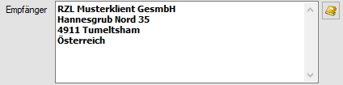

Durch Anwahl des kleinen Symbols neben dem Bereich *Empfänger* können
die beim Klienten gespeicherten Adressen aufgerufen und ausgewählt
werden.

#### Zuständig

Hier können Sie den Mitarbeiter, der für den Postausgang zuständig ist,
eintragen. Vom Programm wird der Mitarbeiter der den Postausgang aktuell
bearbeitet vorgeschlagen.

#### Kategorie

In diesem Bereich wählen Sie zwischen den in der Verwaltung (vgl. Kap.
11.10 Kategorie) angelegten Kategorien aus. Die Kategorie ist ein
wichtiger Eintrag für die strukturierte Ablage und für die Suche
innerhalb der Postausgänge bzw. Ereignisse (Filter).

#### Thema

Im Bereich *Thema* wählen Sie zwischen den in der Verwaltung (vgl. Kap.
11.12 Thema) angelegten Themen aus. Das Thema ist ebenfalls ein
wichtiger Eintrag für die strukturierte Ablage und für die Suche
innerhalb der Postausgänge bzw. Ereignisse (Filter).

#### Betreff

Hier kann ein Betreff der den Postausgang kurz beschreibt eintragen
werden. Wird ein E-Mail automatisch übernommen (vgl. die Kapitel 13.3
E-Mails schreiben und 13.4 Erhalt einer E-Mail) wird der Betreff
automatisch übernommen und kann nicht geändert werden.

#### Inhalt

Im Bereich *Inhalt* erhalten Sie die Möglichkeit, den Postausgang mit
freiem Text näher zu erläutern.

#### Versandgebühr

Die Eintragung der Versandgebühr ermöglicht Ihnen einen Kostennachweis
für jeden einzelnen Postausgang.

#### Brief/Paketnummer

In diesem Feld tragen Sie die Brief- oder Paketnummer ein.

#### Versendet/Überreicht

Mit dem Aktivieren dieses Feldes können Sie dokumentieren ob der
Postausgang bereits Ihren Machtbereich verlassen hat.

#### Ablageort

Hier können Sie zwischen den – in der Verwaltung (vgl. Kap. 11.2
Ablageort) angelegten – Ablageorten auswählen oder einen händischen
Eintrag machen.

#### Zeitraum

In diesem Feld kann ein Zeitraum eingetragen werden. Unten sind einige
Möglichkeiten der Eingabe angeführt.

Tab. 5‑1Möglichkeiten der Eingabe des Zeitraums

| **Eingabe** | **Ergebnis (Beispiel)** | **Beschreibung**                |
| ----------- | ----------------------- | ------------------------------- |
| JJ          | 2020                    | Jahr in zweistelliger Form      |
| JJJJ        | 2020                    | Jahr in vierstelliger Form      |
| JJJJJJJJ    | 2019-2020               | von Jahr bis Jahr               |
| MMJJ        | 01/2020                 | im Monat des Jahres             |
| MMJJJJ      | 01/2020                 | im Monat des Jahres             |
| MMMMJJ      | 01-04/2020              | von Monat bis Monat im Jahr     |
| MMJJMMJJ    | 01/2019-05/2020         | von Monat, Jahr bis Monat, Jahr |

#### Dokumentenzuordnung/Aufgabenzuordnung

Im rechten unteren Bereich Ihres Postausgangs werden bereits bestehende
Verknüpfungen zu Dokumenten und oder Aufgaben angezeigt. Wenn
beispielsweise ein Brief oder ein E-Mail aus dem KIS geschrieben wurde
(vgl. Kap. 13.1 *Briefe schreiben* bzw. Kap. 13.3 *E-Mails schreiben*).

Abb. 5‑4 Verknüpfung Postausgang - Dokument

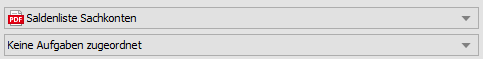

Die Beschreibung der Verknüpfung von Dokumenten mit Ereignissen finden
Sie im Kap. 7.8 *Verknüpfung von Dokumenten mit Ereignissen*.

Wenn Sie ein mit einem Postausgang verknüpftes Dokument markieren und
die rechte Maustaste anwählen können Sie das Dokument per E-Mail
versenden.

Abb. 5‑5 Dokumente per E-Mail versenden

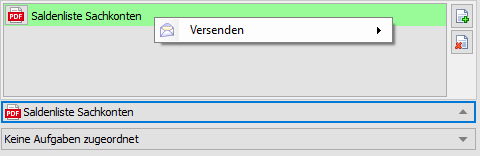

Durch Anwahl des Eintrags *Versenden* werden die beim Klienten
gespeicherten E-Mail-Adressen vorgeschlagen.

## Posteingang

Wählen Sie über den Navigator über den Eintrag *Ereignisse* die Zeile
*Posteingang* an. Sie erhalten die bereits erfassten Posteingänge
angezeigt. Um einen neuen Posteingang zu erfassen, klicken Sie bitte auf
die Schaltfläche *Neuer Posteingang*.

Die Erfassung der Posteingänge ergibt sich in den meisten Fällen aus dem
laufenden Arbeiten (vgl. Kap. 13 *Abläufe*). Nachfolgend finden Sie eine
Beschreibung der Felder des Posteingangs ohne die Einbindung in einen
bestimmten Ablauf.

Abb. 5‑6 Erfassung eines Posteingangs

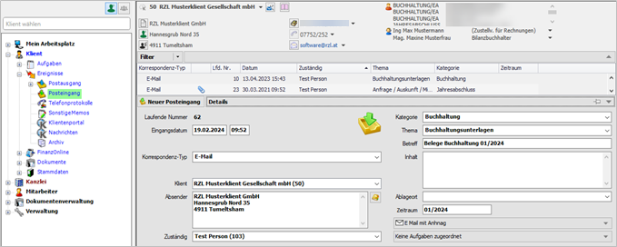

#### Laufende Nummer

Die Nummernvergabe erfolgt automatisch nach dem Speichern des neuen
Posteingangs. Ein gespeicherter Posteingang kann nicht mehr gelöscht
werden.

#### Eingangsdatum

Das Eingangsdatum wird vorgeschlagen (Tagesdatum). Die aktuelle Uhrzeit
wird ebenfalls vorgeschlagen.

#### Briefdatum

Wenn Sie als Korrespondenz-Typ (siehe unten) einen Brief als Posteingang
speichern, können Sie abweichend zum Eingangsdatum das Datum des
Dokuments zusätzlich abspeichern. Die Eintragung Eingangsdatum ist
gleich Briefdatum ist natürlich genauso möglich.

Beachten Sie im Zusammenhang mit erhaltenen Briefen die Möglichkeit,
diese durch Einscannen in das RZL Kanzlei-Informations-System zu
übernehmen (vgl. Kap. 13.2 Erhalt eines Dokuments (Briefes)/Einscannen).

#### Korrespondenz-Typ

Im Bereich Korrespondenz-Typ können Sie zwischen den Einträgen *Belege,
Brief*, *E-Mail*, *Fax*, *Klientenportal, Klientenunterlagen, Paket,
Serienbrief, Serien-E-Mail* und *Übermittlung* wählen. Die Auswahl des
Korrespondenztyps hat Auswirkung auf die zur Verfügung stehenden Felder.

#### Überbringungsart

Wenn Sie als Korrespondenz-Typ *Brief* eingestellt haben, können Sie
hier zwischen den Einträgen *Post/Paketdient*, *Elektronisch* und
*Persönlich* auswählen.

Beim Korrespondenz-Typ *Paket* kann zwischen *Post/Paketdienst* und
*Persönlich* ausgewählt werden.

#### Klient

Posteingänge können einem oder mehreren Klienten zugeordnet werden.

Ein einzelner Klient kann durch Klick auf die Klientennummer oder den
Klientennamen in der Auswahlliste, durch Eingabe der Klientennummer und
Eingabe-Taste (beim Textblock) oder durch Eintippen der
Anfangsbuchstaben des Klientennamens, Detailauswahl mit Pfeil
Auf/Ab-Tasten und Eingabe-Taste (beim Textblock), ausgewählt werden.

Bezüglich **Klientenmehrfachzuordnung** vgl. Kap. 5.7 *Zuordnung von
Ereignissen zu Klienten – Klientenmehrfachzuordnung.*

#### Absender

Als Absender wird der eingetragene Klient mit den gespeicherten
Stammdaten vorge­schlagen.

Abb. 5‑7 Adressen auswählen

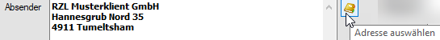

Durch Anwahl des kleinen Symbols neben dem Bereich *Absender* können die
beim Klienten gespeicherten Adressen aufgerufen und ausgewählt werden.

#### Zuständig

Hier können Sie den Mitarbeiter, der für den Posteingang zuständig ist,
eintragen. Vom Programm wird der Mitarbeiter der den Posteingang aktuell
bearbeitet vorgeschlagen.

#### Kategorie

In diesem Bereich wählen Sie zwischen den in der Verwaltung (vgl. Kap.
11.10 Kategorie) angelegten Kategorien aus. Die Kategorie ist ein
wichtiger Eintrag für die strukturierte Ablage und für die Suche
innerhalb der Posteingänge bzw. Ereignisse (Filter).

#### Thema

Im Bereich *Thema* wählen Sie zwischen den in der Verwaltung (vgl. Kap.
11.12 Thema) angelegten Themen aus. Das Thema ist ebenfalls ein
wichtiger Eintrag für die strukturierte Ablage und für die Suche
innerhalb der Posteingänge bzw. Ereignisse (Filter).

#### Betreff

Hier kann ein Betreff – der den Posteingang kurz beschreibt – eintragen
werden. Wird ein E-Mail automatisch übernommen (vgl. die Kapitel 13.3
*E-Mails schreiben* und 13.4 *Erhalt einer E-Mail*) wird der Betreff
automatisch übernommen und kann nicht geändert werden.

#### Inhalt

Im Bereich *Inhalt* erhalten Sie die Möglichkeit den Posteingang mit
freiem Text näher zu erläutern.

#### Ablageort

Hier können Sie zwischen den in der Verwaltung (vgl. Kap. 11.2
Ablageort) angelegten Ablageorten auswählen oder einen händischen
Eintrag machen.

#### Zeitraum

In diesem Feld kann ein Zeitraum eingetragen werden. Unten sind einige
Möglichkeiten der Eingabe angeführt.

Tab. 5‑2Möglichkeiten der Eingabe des Zeitraums

| **Eingabe** | **Ergebnis (Beispiel)** | **Beschreibung**                |
| ----------- | ----------------------- | ------------------------------- |
| JJ          | 2020                    | Jahr in zweistelliger Form      |
| JJJJ        | 2020                    | Jahr in vierstelliger Form      |
| JJJJJJJJ    | 2019-2020               | von Jahr bis Jahr               |
| MMJJ        | 01/2020                 | im Monat des Jahres             |
| MMJJJJ      | 01/2020                 | im Monat des Jahres             |
| MMMMJJ      | 01-04/2020              | von Monat bis Monat im Jahr     |
| MMJJMMJJ    | 01/2019-05/2020         | von Monat, Jahr bis Monat, Jahr |

#### Dokumentenzuordnung/Aufgabenzuordnung

Im rechten unteren Bereich Ihres Posteingangs werden bereits bestehende
Verknüpfungen zu Dokumenten und oder Aufgaben angezeigt. Wenn
beispielsweise Dokumente eingescannt und ins KIS übernommen wurden oder
ein E-Mail aus dem Posteingang von Outlook übernommen wurde (vgl. Kap.
7.5 *Hinzufügen von Dokumenten als Postausgang/Posteingang* bzw. Kap.
13.4 *Erhalt eines E-Mails*).

Abb. 5‑8 Verknüpfung Postausgang - Dokument

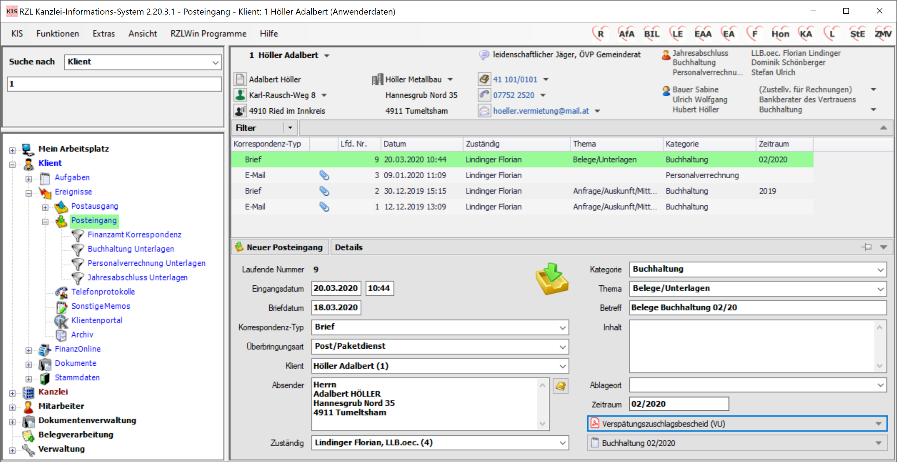

Die Beschreibung der Verknüpfung von Dokumenten mit Ereignissen finden
Sie im Kap. 7.8 *Verknüpfung von Dokumenten mit Ereignissen*.

Wenn Sie ein mit einem Posteingang verknüpftes Dokument markieren und
die rechte Maustaste anwählen können Sie das Dokument per E-Mail
versenden.

Abb. 5‑9 Dokumente per E-Mail versenden

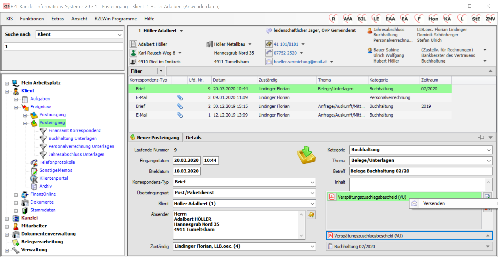

Durch Anwahl des Eintrags *Versenden* werden die beim Klienten
gespeicherten E-Mail-Adressen vorgeschlagen.

## Telefonprotokoll

Die Telefonate, die in Ihrer Kanzlei geführt werden, können Sie im
Telefonprotokoll erfassen. Dieser Programmteil ermöglicht Ihnen die
vollständige Erfassung der relevanten Telefonate der Kanzlei und die
Zuordnung zu den jeweiligen Klienten.

Wählen Sie über den Navigator über den Eintrag *Ereignisse* die Zeile
*Telefonprotokoll* an. Sie erhalten die bereits erfassten
Telefonprotokolle angezeigt. Um ein neues Telefonprotokoll zu erfassen,
klicken Sie bitte auf die Schaltfläche *Neues Telefonprotokoll*.

Abb. 5‑10 Erfassung eines Telefonprotokolls

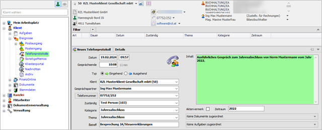

TIpp

Wenn ein Telefonprotokoll markiert ist, kann durch Anwahl der rechten
Maustaste und des Eintrags *Detail drucken* das Protokoll ausgedruckt
werden.

#### Datum

Sie erhalten das aktuelle Datum und die aktuelle Uhrzeit vorgeschlagen.
Diese Vorschläge können Sie wenn notwendig ändern.

#### Gesprächsende

In diesem Feld besteht die Möglichkeit das Gesprächsende einzutragen.
Sie sehen dann automatisch die Gesamtdauer des Telefonats neben dem
Gesprächsende angezeigt.

#### Typ

Im Bereich Typ können Sie auswählen, ob das Telefonat *Eingehend* oder
*Ausgehend* war.

#### Klient

Telefonprotokolle können einem oder mehreren Klienten zugeordnet werden.

Ein einzelner Klient kann durch Klick auf die Klientennummer oder den
Klientennamen in der Auswahlliste, durch Eingabe der Klientennummer und
Eingabe-Taste (beim Textblock) oder durch Eintippen der
Anfangsbuchstaben des Klientennamens, Detailauswahl mit Pfeil
Auf/Ab-Tasten und Eingabe-Taste (beim Textblock) ausgewählt werden.

Bezüglich **Klientenmehrfachzuordnung** vgl. Kap. 5.7 *Zuordnung von
Ereignissen zu Klienten – Klientenmehrfachzuordnung.*

#### Gesprächspartner

Als Gesprächspartner erhalten Sie Vorschläge vom Programm (persönliche
Daten, Kontaktpersonen), die ausgewählt werden können. Zusätzlich können
Sie in diesem Feld selbst Einträge vornehmen.

#### Telefonnummer

Als Telefonnummer werden die in den Klientendaten eingetragenen Nummern
vorge­schlagen. Wenn Sie die Telefonanbindung lizensiert haben und die
technischen Einstellungen passen, können Sie durch Anwahl der
Schaltfläche *Telefonnummer* den Gesprächsteilnehmer direkt anrufen.

#### Zuständig

Hier wird der zuständige Mitarbeiter ausgewählt und eingetragen. Das
Programm schlägt den aktuellen Benutzer des KIS vor.

#### Kategorie

In diesem Bereich wählen Sie zwischen den in der Verwaltung (vgl. Kap.
11.10 Kategorie) angelegten Kategorien aus. Die Kategorie ist ein
wichtiger Eintrag für die strukturierte Ablage und für die Suche
innerhalb der Telefonate bzw. Ereignisse (Filter).

#### Thema

Im Bereich *Thema* wählen Sie zwischen den in der Verwaltung (vgl. Kap.
11.12 Thema) angelegten Themen aus. Das Thema ist ebenfalls ein
wichtiger Eintrag für die strukturierte Ablage und für die Suche
innerhalb der Telefonate bzw. Ereignisse (Filter).

#### Betreff

Hier kann ein Betreff – der das Telefonat kurz beschreibt – eintragen
werden.

#### Inhalt

Im Feld *Inhalt* beschreiben Sie das geführte Telefonat mit freiem Text
genauer.

#### Aktenvermerk

Dieses Feld können Sie verwenden, um zu dokumentieren, dass ein
Aktenvermerk über dieses Telefonat angelegt wurde oder anzulegen ist.

Das Feld Aktenvermerk kann verwendet werden, um die Wichtigkeit des
Telefonats hervorzuheben.

#### Zeitraum

In diesem Feld kann ein Zeitraum eingetragen werden. Unten sind einige
Möglichkeiten der Eingabe angeführt.

Tab. 5‑3 Möglichkeiten der eingabe des Zeitraums

| **Eingabe** | **Ergebnis (Beispiel)** | **Beschreibung**                |
| ----------- | ----------------------- | ------------------------------- |
| JJ          | 2020                    | Jahr in zweistelliger Form      |
| JJJJ        | 2020                    | Jahr in vierstelliger Form      |
| JJJJJJJJ    | 2019-2020               | von Jahr bis Jahr               |
| MMJJ        | 01/2020                 | im Monat des Jahres             |
| MMJJJJ      | 01/2020                 | im Monat des Jahres             |
| MMMMJJ      | 01-04/2020              | von Monat bis Monat im Jahr     |
| MMJJMMJJ    | 01/2019-05/2019         | von Monat, Jahr bis Monat, Jahr |

#### Dokumentenzuordnung 

Im rechten unteren Bereich Ihres Telefonprotokolls können Sie Dokumente,
die bereits in das Kanzlei-Informations-System übernommen worden sind,
dem Telefonprotokoll zuordnen.

Abb. 5‑11 Verknüpfung Telefonprotokoll – Dokument

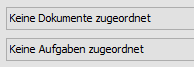

Sie klicken zunächst auf die Schaltfläche *Keine Dokumente zugeordnet*.

Abb. 5‑12 Dokumente zuordnen

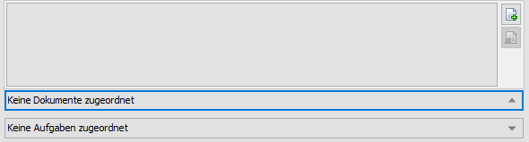

Wenn Sie das Symbol mit dem **+**-Zeichen anwählen, können Sie Dokumente
hinzufügen. Das Symbol mit dem roten Kreuz löscht die Zuordnung des
markierten Dokuments zum Telefonprotokoll.

Die Beschreibung der Verknüpfung von Dokumenten mit Ereignissen finden
Sie im Kap. 7.8 Verknüpfung von Dokumenten mit Ereignissen.

Wenn Sie ein mit einem Telefonprotokoll verknüpftes Dokument markieren
und die rechte Maustaste anwählen können Sie das Dokument per E-Mail
versenden.

### RZL Telefon Anbindung

In Kombination mit einer TAPI-fähigen Telefonanlage wählt das
Kanzlei-Informations-System direkt die beim Klienten hinterlegte
Telefonnummer, indem die Telefonnummer mit der Maus angeklickt wird.

Abb. 5‑13 Erfassung eines Telefonats im Kanzleibereich

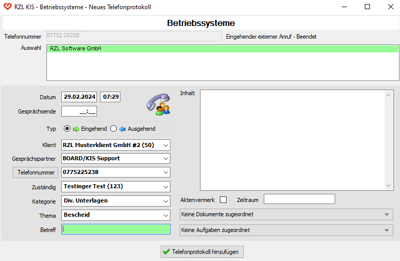

Anschließend wird der oben angeführten Bildschirm geöffnet.
Gesprächsbeginn und Ende werden automatisch protokolliert. Nach Vornahme
der notwendigen Ergänzungen wird das Protokoll durch Anwahl der
Schaltfläche *Telefonprotokoll hinzufügen* automatisch ins
Kanzlei-Informationssystem eingetragen.

Bei eingehenden Anrufen wird der Anrufer automatisch identifiziert und
der jeweilige Klient wird geöffnet. Die Erfassung des Telefonprotokolls
ist gleich wie oben beschrieben.

## Sonstige Memos

Eine weitere Möglichkeit Vorgänge der Kanzlei zu erfassen, ist die
Erfassung als Memo.

Wählen Sie über den Navigator über den Eintrag *Ereignisse* die Zeile
*Sonstige Memos* an. Sie erhalten die bereits erfassten Memos angezeigt.
Um ein neues Memo zu erfassen, klicken Sie bitte auf die Schaltfläche
*Neues Memo*.

Abb. 5‑14 Erfassung eines Memos

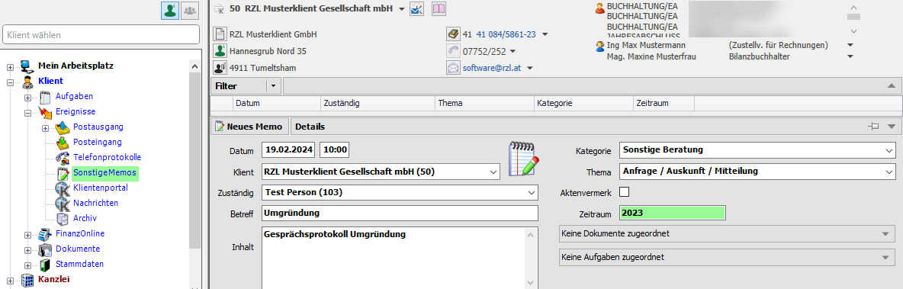

#### Datum

Sie erhalten das aktuelle Datum und die aktuelle Uhrzeit vorgeschlagen.
Diese Vorschläge können Sie wenn notwendig ändern.

#### Klient

Memos können einem oder mehreren Klienten zugeordnet werden.

Ein einzelner Klient kann durch Klick auf die Klientennummer oder den
Klientennamen in der Auswahlliste, durch Eingabe der Klientennummer und
Eingabe-Taste (beim Textblock) oder durch Eintippen der
Anfangsbuchstaben des Klientennamens, Detailauswahl mit Pfeil
Auf/Ab-Tasten und Eingabe-Taste (beim Textblock) ausgewählt werden.

Bezüglich **Klientenmehrfachzuordnung** vgl. Kap. 5.7 *Zuordnung von
Ereignissen zu Klienten – Klientenmehrfachzuordnung.*

#### Zuständig

Hier wird der zuständige Mitarbeiter ausgewählt und eingetragen. Das
Programm schlägt den aktuellen Benutzer des KIS vor.

#### Betreff

Hier kann ein Betreff – der den Inhalt kurz beschreibt – eintragen
werden.

#### Inhalt

Im Feld *Inhalt* beschreiben Sie den Gegenstand des Memos mit freiem
Text genauer.

#### Kategorie

In diesem Bereich wählen Sie zwischen den in der Verwaltung (vgl. Kap.
11.10 Kategorie) angelegten Kategorien aus. Die Kategorie ist ein
wichtiger Eintrag für die strukturierte Ablage und für die Suche
innerhalb der Memos bzw. Ereignisse (Filter).

#### Thema

Im Bereich *Thema* wählen Sie zwischen den in der Verwaltung (vgl. Kap.
11.12 Thema) angelegten Themen aus. Das Thema ist ein wichtiger Eintrag
für die strukturierte Ablage und für die Suche innerhalb der Memos bzw.
Ereignisse (Filter).

#### Aktenvermerk

Dieses Feld können Sie verwenden, um zu dokumentieren, dass ein
Aktenvermerk über dieses Memo angelegt wurde oder anzulegen ist.

Das Feld Aktenvermerk kann auch verwendet werden, um die Wichtigkeit des
Memos hervorzuheben.

#### Zeitraum

In diesem Feld kann ein Zeitraum eingetragen werden. Unten sind einige
Möglichkeiten der Eingabe angeführt.

Tab. 5‑4 Möglichkeiten der Eingabe des Zeitraums

| **Eingabe** | **Ergebnis (Beispiel)** | **Beschreibung**                |
| ----------- | ----------------------- | ------------------------------- |
| JJ          | 2020                    | Jahr in zweistelliger Form      |
| JJJJ        | 2020                    | Jahr in vierstelliger Form      |
| JJJJJJJJ    | 2019-2020               | von Jahr bis Jahr               |
| MMJJ        | 01/2020                 | im Monat des Jahres             |
| MMJJJJ      | 01/2020                 | im Monat des Jahres             |
| MMMMJJ      | 01-04/2020              | von Monat bis Monat im Jahr     |
| MMJJMMJJ    | 01/2019-05/2020         | von Monat, Jahr bis Monat, Jahr |

#### Dokumentenzuordnung 

Im rechten unteren Bereich Ihres Memos können Sie Dokumente, die bereits
in das Kanzlei-Informations-System übernommen worden sind, dem
Telefonprotokoll zuordnen.

Abb. 5‑15 Verknüpfung Memo – Dokument

Sie klicken zunächst auf die Schaltfläche *Keine Dokumente zugeordnet*.

Abb. 5‑16 Dokumente zuordnen

Wenn Sie das Symbol mit dem **+**-Zeichen anwählen, können Sie Dokumente
hinzufügen. Das Symbol mit dem roten Kreuz löscht die Zuordnung des
markierten Dokuments zum Telefonprotokoll.

Die Beschreibung der Verknüpfung von Dokumenten mit Ereignissen finden
Sie im Kap. 7.8 Verknüpfung von Dokumenten mit Ereignissen.

Wenn Sie ein mit einem Telefonprotokoll verknüpftes Dokument markieren
und die rechte Maustaste anwählen können Sie das Dokument per E-Mail
versenden.

## Archivierung von Ereignissen

Sie können innerhalb der Ereignislisten ältere Einträge archivieren. Sie
können die Liste bequem mit Hilfe eines Filters auf die gewünschten
Einträge einschränken (vgl. Kap. 3.5 Filterfunktionen).

Abb. 5‑17 Archivierung von Ereignissen

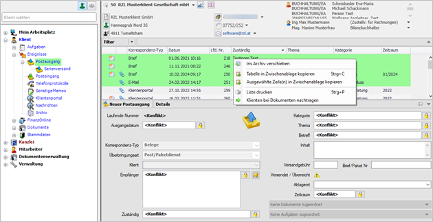

Zunächst markieren Sie die Einträge die archiviert werden sollen und
wählen anschließend die rechte Maustaste und den Eintrag *Ins Archiv
verschieben* an. Die archivierten Ereignisse finden Sie innerhalb der
Ereignisse im letzten Eintrag *Archiv*.

Da gespeicherte Ereignisse nicht mehr gelöscht werden können, kann die
Archivierung auch für einzelne Fehleinträge in den Listen verwendet
werden.

#### Rückgängigmachung der Archivierung

Abb. 5‑18 Aus dem Archiv wiederherstellen

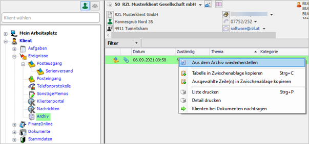

Die im Eintrag *Archiv* gespeicherten Einträge können einzeln markiert
und durch Anwahl der rechten Maustaste und des Eintrags *Aus dem Archiv
wiederherstellen* wieder in die jeweilige Ereignisliste eingetragen
werden.

## Zuordnung von Ereignissen zu Klienten – Klientenmehrfachzuordnung

Ereignisse können einem oder mehreren Klienten zugeordnet werden.

#### Auswahlfeld

Im Auswahlfeld werden die zugeordneten Klienten aneinandergereiht
dargestellt. Wenn mehrere Klienten zugeordnet sind, als in der Breite
des Auswahlfeldes angezeigt werden kann, so wird am Ende „…“ angezeigt.

Abb. 5‑19 Mehrfachzuordnung Klienten

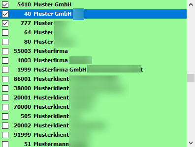

#### Listenansicht

In der Listenansicht werden Klientennummer und Klientenname
aneinandergereiht in den jeweiligen Spalten dargestellt.

Abb. 5‑20 Klientenzuordnung - Listenansicht

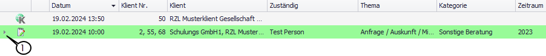

Mittels des kleinen Dreiecks (**1**) am Beginn der Zeile gibt es die
Möglichkeit, die Zeile aufzuklappen. Die zugeordneten Klienten werden
untereinander dargestellt.

Abb. 5‑21 Klientenzuordnung - Listenansicht

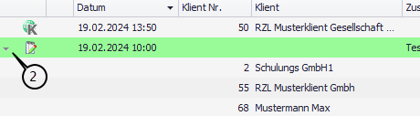

Umgekehrt kann mit (**2**) die Zeile wieder zugeklappt werden.

#### Auswahl löschen

Die Auswahl kann gelöscht werden in dem Sie das Auswahlfeld aufklappen
und die erste „leere“ Zeile (**3**) auswählen.

Abb. 5‑22 Klientenmehrfachzuordnung – Auswahl löschen

#### Auswahl erweitern/beschränken

Wenn Sie die Auswahl der Klienten erweitern oder beschränken wollen,
können Sie mit der Maus beim jeweiligen Klienten das Hakerl setzen bzw.
entfernen oder mit der Tastatur (wenn die Auswahlzeile über dem Klienten
ist) die Leertaste betätigen, um das Hakerl umzuschalten.
