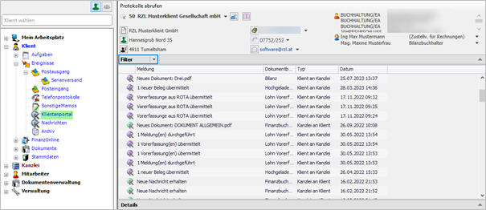
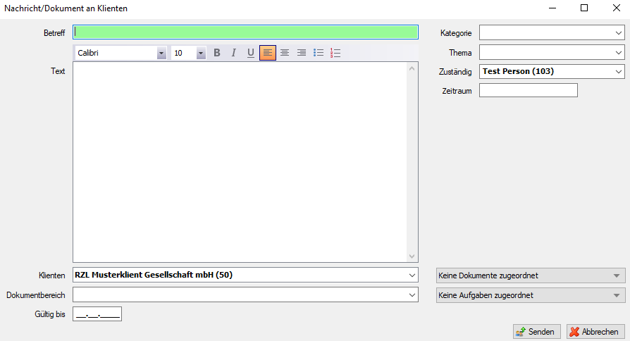
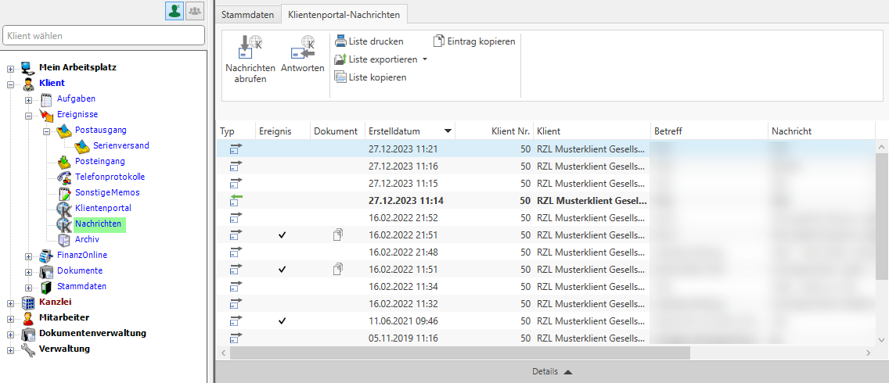
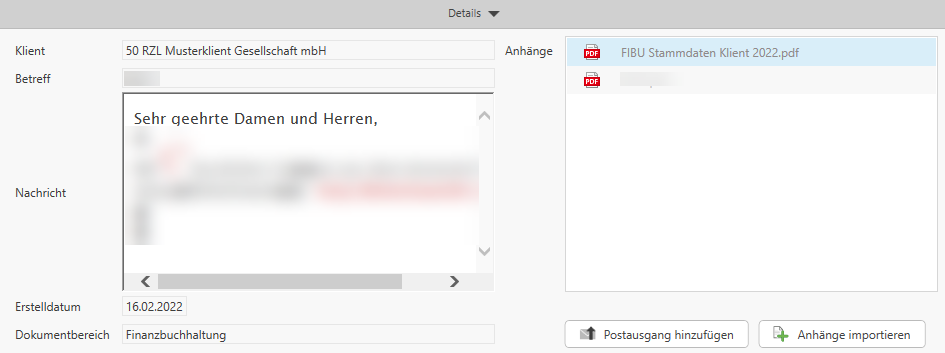
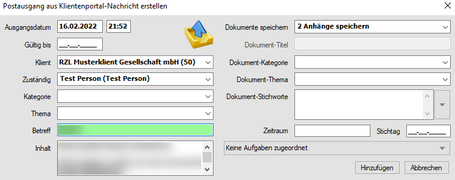
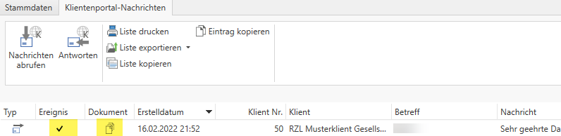
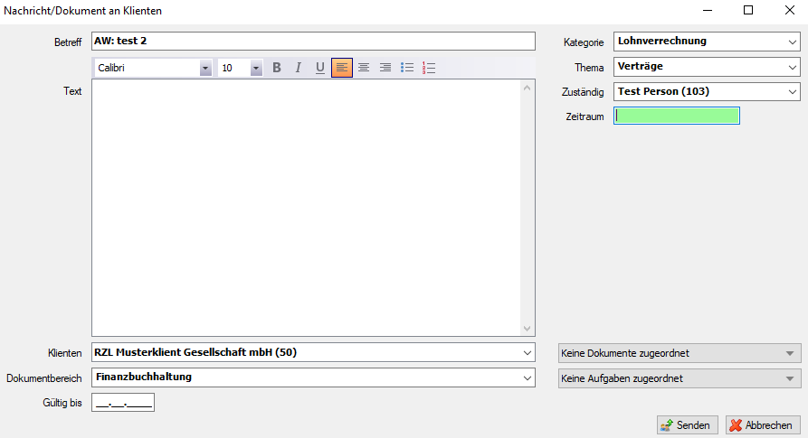

## Klientenportal

### Allgemein

Im Bereich Klientenportal finden Sie die Korrespondenz zwischen Kanzlei
und Klienten die mit Hilfe des RZL Klientenportals durchgeführt wurde.
Im RZL Klientenportal können für die Lohnverrechnung beispielsweise
Mindestangabenanmeldungen und Lohnvorerfassungen gemacht werden, für die
Buchhaltung Kassa/Bankbücher gebucht werden. Der Klient kann Belege
einscannen und diese über das RZL-Klientenportal hochladen. Weiters
können beliebige Dokumente über diese gesicherte Verbindung hochgeladen
werden.

Im Header dieser Ansicht können Sie auch direkt aus dem KIS eine
Nachricht an Ihren Klienten über das RZL Klientenportal übermitteln.
Hierzu klicken Sie auf , das Sie neben der
Klientenbezeichnung finden.

Abb. 5‑23 Verknüpfung Klientenportal

Anschließend öffnet sich der Dialog zum übermitteln einer Nachricht über
das RZL Klientenportal.

Abb. 5‑24 Nachricht zum Klientenportal übermitteln

###  Klientenportal Nachrichten

Sowohl im Kanzleibereich sowie in der Klientenansicht können die
Klientenportal-Nachrichten über *Ereignisse / Klientenportal /
Nachrichten* aufgerufen werden. Mit einem Klick auf die Schaltfläche
Nachrichten abrufen wird eine manuelle Synchronisation zwischen dem
Kanzleiinformationssystem und dem Klientenportal angestoßen. Eine
automatische Synchronisation wird alle sieben Minuten vorgenommen.

Abb. 5‑25 Aufruf der Klientenportal Nachrichten

Wählen Sie einen Posteingang/Postausgang aus, können Sie mithilfe der
Schaltfläche *Posteingang bzw. Postausgang hinzufügen* (**1**) aus jeder
Nachricht ein Ereignis erstellen.

Abb. 5‑26 Ereignis aus Nachricht erstellen 1

Dabei wird der Text der Nachricht in die Inhaltsbeschreibung des
Ereignisses übernommen.

Abb. 5‑27 Ereignis aus Nachricht erstellen 2

Wollen Sie lediglich den Anhang in die Dokumentenverwaltung des RZL
Kanzleiinformationssystems übernehmen, wählen Sie bei der Nachricht die
Funktion *Anhang importieren* aus.

Im Register *Ereignisse / Klientenportal / Nachrichten* zeigt Ihnen die
Spalte Ereignis (**1**) an welche Nachrichten bereits hinzugefügt
wurden. In der Spalte Dokument (**2**) werden die bereits hinzugefügten
Dokumente dargestellt.

Abb. 5‑28 Anzeige im Register Klientenportal Nachrichten

Möchten Sie auf eine erhaltene Nachricht einer Ihrer Klienten antworten,
können Sie dies über das Kontextmenü der rechten Maustaste oder aber
auch über die Schaltfläche *Antworten* im Ribbon erreichen. Dabei werden
die bereits in der Nachracht hinterlegte Kategorie und das hinterlegte
Thema automatisch vorgeschlagen. Für gesendete Nachrichten wird
automatisiert ein Postausgang (Ereignis) im Kanzleiinformationssystem
erstellt.

Abb. 5‑29 Antwort auf erhaltene Klientenportalnachricht

