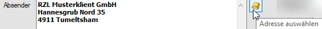
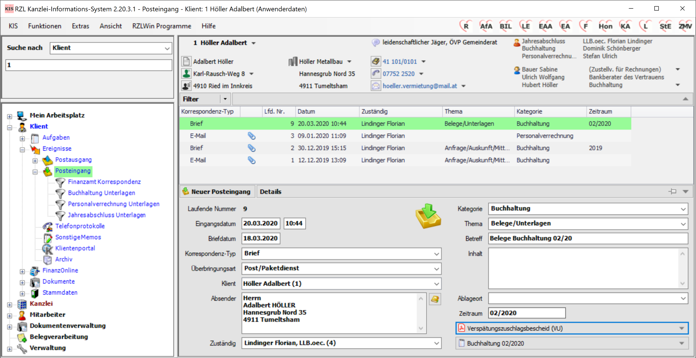
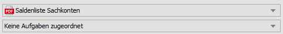
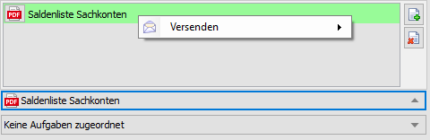

## Posteingang

Wählen Sie über den Navigator über den Eintrag *Ereignisse* die Zeile
*Posteingang* an. Sie erhalten die bereits erfassten Posteingänge
angezeigt. Um einen neuen Posteingang zu erfassen, klicken Sie bitte auf
die Schaltfläche *Neuer Posteingang*.

Die Erfassung der Posteingänge ergibt sich in den meisten Fällen aus dem
laufenden Arbeiten (vgl. Kap. 13 *Abläufe*). Nachfolgend finden Sie eine
Beschreibung der Felder des Posteingangs ohne die Einbindung in einen
bestimmten Ablauf.

Abb. 5‑6 Erfassung eines Posteingangs

#### Laufende Nummer

Die Nummernvergabe erfolgt automatisch nach dem Speichern des neuen
Posteingangs. Ein gespeicherter Posteingang kann nicht mehr gelöscht
werden.

#### Eingangsdatum

Das Eingangsdatum wird vorgeschlagen (Tagesdatum). Die aktuelle Uhrzeit
wird ebenfalls vorgeschlagen.

#### Briefdatum

Wenn Sie als Korrespondenz-Typ (siehe unten) einen Brief als Posteingang
speichern, können Sie abweichend zum Eingangsdatum das Datum des
Dokuments zusätzlich abspeichern. Die Eintragung Eingangsdatum ist
gleich Briefdatum ist natürlich genauso möglich.

Beachten Sie im Zusammenhang mit erhaltenen Briefen die Möglichkeit,
diese durch Einscannen in das RZL Kanzlei-Informations-System zu
übernehmen (vgl. Kap. 13.2 Erhalt eines Dokuments (Briefes)/Einscannen).

#### Korrespondenz-Typ

Im Bereich Korrespondenz-Typ können Sie zwischen den Einträgen *Belege,
Brief*, *E-Mail*, *Fax*, *Klientenportal, Klientenunterlagen, Paket,
Serienbrief, Serien-E-Mail* und *Übermittlung* wählen. Die Auswahl des
Korrespondenztyps hat Auswirkung auf die zur Verfügung stehenden Felder.

#### Überbringungsart

Wenn Sie als Korrespondenz-Typ *Brief* eingestellt haben, können Sie
hier zwischen den Einträgen *Post/Paketdient*, *Elektronisch* und
*Persönlich* auswählen.

Beim Korrespondenz-Typ *Paket* kann zwischen *Post/Paketdienst* und
*Persönlich* ausgewählt werden.

#### Klient

Posteingänge können einem oder mehreren Klienten zugeordnet werden.

Ein einzelner Klient kann durch Klick auf die Klientennummer oder den
Klientennamen in der Auswahlliste, durch Eingabe der Klientennummer und
Eingabe-Taste (beim Textblock) oder durch Eintippen der
Anfangsbuchstaben des Klientennamens, Detailauswahl mit Pfeil
Auf/Ab-Tasten und Eingabe-Taste (beim Textblock), ausgewählt werden.

Bezüglich **Klientenmehrfachzuordnung** vgl. Kap. 5.7 *Zuordnung von
Ereignissen zu Klienten – Klientenmehrfachzuordnung.*

#### Absender

Als Absender wird der eingetragene Klient mit den gespeicherten
Stammdaten vorge­schlagen.

Abb. 5‑7 Adressen auswählen

Durch Anwahl des kleinen Symbols neben dem Bereich *Absender* können die
beim Klienten gespeicherten Adressen aufgerufen und ausgewählt werden.

#### Zuständig

Hier können Sie den Mitarbeiter, der für den Posteingang zuständig ist,
eintragen. Vom Programm wird der Mitarbeiter der den Posteingang aktuell
bearbeitet vorgeschlagen.

#### Kategorie

In diesem Bereich wählen Sie zwischen den in der Verwaltung (vgl. Kap.
11.10 Kategorie) angelegten Kategorien aus. Die Kategorie ist ein
wichtiger Eintrag für die strukturierte Ablage und für die Suche
innerhalb der Posteingänge bzw. Ereignisse (Filter).

#### Thema

Im Bereich *Thema* wählen Sie zwischen den in der Verwaltung (vgl. Kap.
11.12 Thema) angelegten Themen aus. Das Thema ist ebenfalls ein
wichtiger Eintrag für die strukturierte Ablage und für die Suche
innerhalb der Posteingänge bzw. Ereignisse (Filter).

#### Betreff

Hier kann ein Betreff – der den Posteingang kurz beschreibt – eintragen
werden. Wird ein E-Mail automatisch übernommen (vgl. die Kapitel 13.3
*E-Mails schreiben* und 13.4 *Erhalt einer E-Mail*) wird der Betreff
automatisch übernommen und kann nicht geändert werden.

#### Inhalt

Im Bereich *Inhalt* erhalten Sie die Möglichkeit den Posteingang mit
freiem Text näher zu erläutern.

#### Ablageort

Hier können Sie zwischen den in der Verwaltung (vgl. Kap. 11.2
Ablageort) angelegten Ablageorten auswählen oder einen händischen
Eintrag machen.

#### Zeitraum

In diesem Feld kann ein Zeitraum eingetragen werden. Unten sind einige
Möglichkeiten der Eingabe angeführt.

Tab. 5‑2Möglichkeiten der Eingabe des Zeitraums

| **Eingabe** | **Ergebnis (Beispiel)** | **Beschreibung**                |
| ----------- | ----------------------- | ------------------------------- |
| JJ          | 2020                    | Jahr in zweistelliger Form      |
| JJJJ        | 2020                    | Jahr in vierstelliger Form      |
| JJJJJJJJ    | 2019-2020               | von Jahr bis Jahr               |
| MMJJ        | 01/2020                 | im Monat des Jahres             |
| MMJJJJ      | 01/2020                 | im Monat des Jahres             |
| MMMMJJ      | 01-04/2020              | von Monat bis Monat im Jahr     |
| MMJJMMJJ    | 01/2019-05/2020         | von Monat, Jahr bis Monat, Jahr |

#### Dokumentenzuordnung/Aufgabenzuordnung

Im rechten unteren Bereich Ihres Posteingangs werden bereits bestehende
Verknüpfungen zu Dokumenten und oder Aufgaben angezeigt. Wenn
beispielsweise Dokumente eingescannt und ins KIS übernommen wurden oder
ein E-Mail aus dem Posteingang von Outlook übernommen wurde (vgl. Kap.
7.5 *Hinzufügen von Dokumenten als Postausgang/Posteingang* bzw. Kap.
13.4 *Erhalt eines E-Mails*).

Abb. 5‑8 Verknüpfung Postausgang - Dokument

Die Beschreibung der Verknüpfung von Dokumenten mit Ereignissen finden
Sie im Kap. 7.8 *Verknüpfung von Dokumenten mit Ereignissen*.

Wenn Sie ein mit einem Posteingang verknüpftes Dokument markieren und
die rechte Maustaste anwählen können Sie das Dokument per E-Mail
versenden.

Abb. 5‑9 Dokumente per E-Mail versenden

Durch Anwahl des Eintrags *Versenden* werden die beim Klienten
gespeicherten E-Mail-Adressen vorgeschlagen.

## Postausgang

Wählen Sie im Navigator über den Eintrag *Ereignisse* die Zeile
*Postausgang* an und Sie erhalten die bereits erfassten Postausgänge
angezeigt. Um einen neuen Postausgang zu erfassen, klicken Sie bitte auf
die Schaltfläche *Neuer Postausgang*.

Abb. 5‑3 Erfassung eines Postausgangs

Hinweis

Wie Sie einen Brief bzw. ein E-Mail automatisch als Postausgang erfassen
können, lesen in den Kapiteln 13.1 *Briefe schreib*en bzw. 13.3 *E-Mails
schreiben*.

Im unteren rechten Bereich des Bildschirms können die Details für den
Postausgang ausgefüllt werden.

#### Laufende Nummer

Die Nummernvergabe erfolgt automatisch nach dem Speichern des neuen
Postausgangs. Ein gespeicherter Postausgang kann nicht mehr gelöscht
werden.

#### Ausgangsdatum

Das Ausgangsdatum wird vorgeschlagen (Tagesdatum). Die aktuelle Uhrzeit
wird ebenfalls vorgeschlagen.

#### Briefdatum

Wenn Sie als Korrespondenz-Typ (siehe unten) einen Brief speichern,
können Sie abweichend zum Ausgangsdatum das Datum des Dokuments
zusätzlich abspeichern. Die Eintragung Eingangsdatum ist gleich
Briefdatum ist natürlich genauso möglich.

#### Korrespondenz-Typ

Im Bereich Korrespondenz-Typ können Sie zwischen den Einträgen *Belege,*
*Brief*, *E-Mail*, *Fax*, *Klientenportal, Klientenunterlagen,* *Paket,
Serienbrief, Serien-E-Mail* und *Übermittlung* wählen. Die Auswahl des
Korrespondenztyps hat Auswirkung auf die zur Verfügung stehenden Felder.

#### Überbringungsart

Wenn Sie als Korrespondenz-Typ *Brief* eingestellt haben, können Sie
hier zwischen den Einträgen *Post/Paketdienst*, *Elektronisch* und
*Persönlich* auswählen.

Beim Korrespondenz-Typ *Paket* kann zwischen *Post/Paketdienst* und
*Persönlich* bei persönlicher Überbringung ausgewählt werden.

#### Klient

Postausgänge können einem oder mehreren Klienten zugeordnet werden.

Ein einzelner Klient kann durch Klick auf die Klientennummer oder den
Klientennamen in der Auswahlliste, durch Eingabe der Klientennummer und
Eingabe-Taste (beim Textblock) oder durch Eintippen der
Anfangsbuchstaben des Klientennamens, Detailauswahl mit Pfeil
Auf/Ab-Tasten und Eingabe-Taste (beim Textblock), ausgewählt werden.

Bezüglich **Klientenmehrfachzuordnung** vgl. Kap. 5.7 *Zuordnung von
Ereignissen zu Klienten – Klientenmehrfachzuordnung.*

#### Empfänger

Als Empfänger wird der eingetragene Klient mit den gespeicherten
Stammdaten vorgeschlagen.

Durch Anwahl des kleinen Symbols neben dem Bereich *Empfänger* können
die beim Klienten gespeicherten Adressen aufgerufen und ausgewählt
werden.

#### Zuständig

Hier können Sie den Mitarbeiter, der für den Postausgang zuständig ist,
eintragen. Vom Programm wird der Mitarbeiter der den Postausgang aktuell
bearbeitet vorgeschlagen.

#### Kategorie

In diesem Bereich wählen Sie zwischen den in der Verwaltung (vgl. Kap.
11.10 Kategorie) angelegten Kategorien aus. Die Kategorie ist ein
wichtiger Eintrag für die strukturierte Ablage und für die Suche
innerhalb der Postausgänge bzw. Ereignisse (Filter).

#### Thema

Im Bereich *Thema* wählen Sie zwischen den in der Verwaltung (vgl. Kap.
11.12 Thema) angelegten Themen aus. Das Thema ist ebenfalls ein
wichtiger Eintrag für die strukturierte Ablage und für die Suche
innerhalb der Postausgänge bzw. Ereignisse (Filter).

#### Betreff

Hier kann ein Betreff der den Postausgang kurz beschreibt eintragen
werden. Wird ein E-Mail automatisch übernommen (vgl. die Kapitel 13.3
E-Mails schreiben und 13.4 Erhalt einer E-Mail) wird der Betreff
automatisch übernommen und kann nicht geändert werden.

#### Inhalt

Im Bereich *Inhalt* erhalten Sie die Möglichkeit, den Postausgang mit
freiem Text näher zu erläutern.

#### Versandgebühr

Die Eintragung der Versandgebühr ermöglicht Ihnen einen Kostennachweis
für jeden einzelnen Postausgang.

#### Brief/Paketnummer

In diesem Feld tragen Sie die Brief- oder Paketnummer ein.

#### Versendet/Überreicht

Mit dem Aktivieren dieses Feldes können Sie dokumentieren ob der
Postausgang bereits Ihren Machtbereich verlassen hat.

#### Ablageort

Hier können Sie zwischen den – in der Verwaltung (vgl. Kap. 11.2
Ablageort) angelegten – Ablageorten auswählen oder einen händischen
Eintrag machen.

#### Zeitraum

In diesem Feld kann ein Zeitraum eingetragen werden. Unten sind einige
Möglichkeiten der Eingabe angeführt.

Tab. 5‑1Möglichkeiten der Eingabe des Zeitraums

| **Eingabe** | **Ergebnis (Beispiel)** | **Beschreibung**                |
| ----------- | ----------------------- | ------------------------------- |
| JJ          | 2020                    | Jahr in zweistelliger Form      |
| JJJJ        | 2020                    | Jahr in vierstelliger Form      |
| JJJJJJJJ    | 2019-2020               | von Jahr bis Jahr               |
| MMJJ        | 01/2020                 | im Monat des Jahres             |
| MMJJJJ      | 01/2020                 | im Monat des Jahres             |
| MMMMJJ      | 01-04/2020              | von Monat bis Monat im Jahr     |
| MMJJMMJJ    | 01/2019-05/2020         | von Monat, Jahr bis Monat, Jahr |

#### Dokumentenzuordnung/Aufgabenzuordnung

Im rechten unteren Bereich Ihres Postausgangs werden bereits bestehende
Verknüpfungen zu Dokumenten und oder Aufgaben angezeigt. Wenn
beispielsweise ein Brief oder ein E-Mail aus dem KIS geschrieben wurde
(vgl. Kap. 13.1 *Briefe schreiben* bzw. Kap. 13.3 *E-Mails schreiben*).

Abb. 5‑4 Verknüpfung Postausgang - Dokument

Die Beschreibung der Verknüpfung von Dokumenten mit Ereignissen finden
Sie im Kap. 7.8 *Verknüpfung von Dokumenten mit Ereignissen*.

Wenn Sie ein mit einem Postausgang verknüpftes Dokument markieren und
die rechte Maustaste anwählen können Sie das Dokument per E-Mail
versenden.

Abb. 5‑5 Dokumente per E-Mail versenden

Durch Anwahl des Eintrags *Versenden* werden die beim Klienten
gespeicherten E-Mail-Adressen vorgeschlagen.
