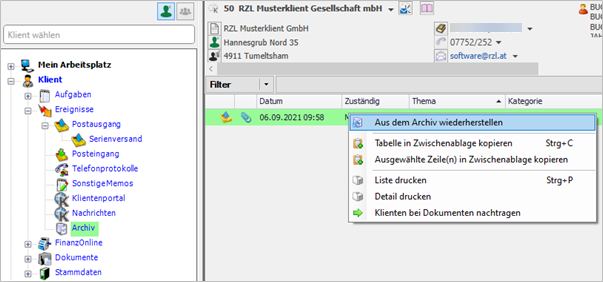

## Zuordnung von Ereignissen zu Klienten – Klientenmehrfachzuordnung

Ereignisse können einem oder mehreren Klienten zugeordnet werden.

#### Auswahlfeld

Im Auswahlfeld werden die zugeordneten Klienten aneinandergereiht
dargestellt. Wenn mehrere Klienten zugeordnet sind, als in der Breite
des Auswahlfeldes angezeigt werden kann, so wird am Ende „…“ angezeigt.

Abb. 5‑19 Mehrfachzuordnung Klienten

#### Listenansicht

In der Listenansicht werden Klientennummer und Klientenname
aneinandergereiht in den jeweiligen Spalten dargestellt.

Abb. 5‑20 Klientenzuordnung - Listenansicht

Mittels des kleinen Dreiecks (**1**) am Beginn der Zeile gibt es die
Möglichkeit, die Zeile aufzuklappen. Die zugeordneten Klienten werden
untereinander dargestellt.

Abb. 5‑21 Klientenzuordnung - Listenansicht

Umgekehrt kann mit (**2**) die Zeile wieder zugeklappt werden.

#### Auswahl löschen

Die Auswahl kann gelöscht werden in dem Sie das Auswahlfeld aufklappen
und die erste „leere“ Zeile (**3**) auswählen.

Abb. 5‑22 Klientenmehrfachzuordnung – Auswahl löschen

#### Auswahl erweitern/beschränken

Wenn Sie die Auswahl der Klienten erweitern oder beschränken wollen,
können Sie mit der Maus beim jeweiligen Klienten das Hakerl setzen bzw.
entfernen oder mit der Tastatur (wenn die Auswahlzeile über dem Klienten
ist) die Leertaste betätigen, um das Hakerl umzuschalten.

## Archivierung von Ereignissen

Sie können innerhalb der Ereignislisten ältere Einträge archivieren. Sie
können die Liste bequem mit Hilfe eines Filters auf die gewünschten
Einträge einschränken (vgl. Kap. 3.5 Filterfunktionen).

Abb. 5‑17 Archivierung von Ereignissen

Zunächst markieren Sie die Einträge die archiviert werden sollen und
wählen anschließend die rechte Maustaste und den Eintrag *Ins Archiv
verschieben* an. Die archivierten Ereignisse finden Sie innerhalb der
Ereignisse im letzten Eintrag *Archiv*.

Da gespeicherte Ereignisse nicht mehr gelöscht werden können, kann die
Archivierung auch für einzelne Fehleinträge in den Listen verwendet
werden.

#### Rückgängigmachung der Archivierung

Abb. 5‑18 Aus dem Archiv wiederherstellen

Die im Eintrag *Archiv* gespeicherten Einträge können einzeln markiert
und durch Anwahl der rechten Maustaste und des Eintrags *Aus dem Archiv
wiederherstellen* wieder in die jeweilige Ereignisliste eingetragen
werden.