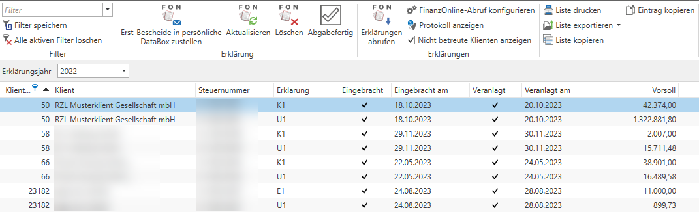

## Aufruf Erklärungen

Im Kanzleibereich und im Klientenbereich können innerhalb des Eintrags
*FinanzOnline* die Steuererklärungen der Klienten aufgerufen werden.
Innerhalb des Arbeitsplatzes des Mitarbeiters werden die Erklärungen
aufgrund der quotenrelevanten Zuständigkeit angezeigt.

Abb. 6‑36 Aufruf Erklärungen

Im linken oberen Bereich können Sie das Erklärungsjahr auswählen. Die
dargestellten Informationen werden automatisch über FinanzOnline
ausgelesen und können nicht bearbeitet werden. Allerdings können Sie die
Liste filtern (vgl. 3.5 Filterfunktionen).