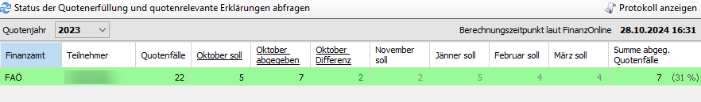
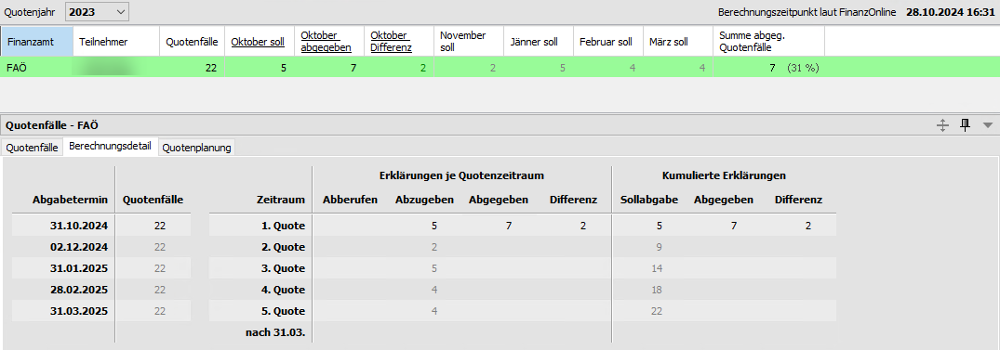
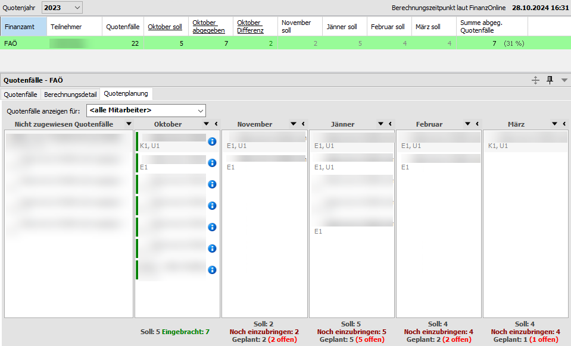
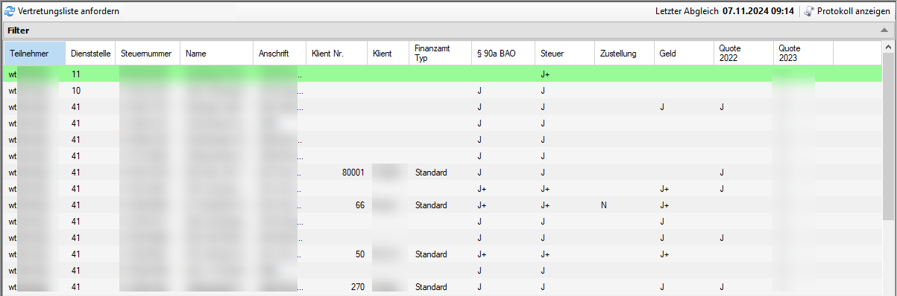

## Aufruf Status der Quotenerfüllung 

HINWEIS: Der Abruf Status der Quotenerfüllung wird von FinanzOnline per
3. April 2024 deaktiviert. Deswegen können im KIS Erklärungen/Updates zu
den Quotenfällen auch nicht mehr automatisch abgerufen werden. Es wird
dann der Stand zum 2. April 2024 angezeigt. Erklärungen können weiterhin
im Kanzleibereich über das Kontextmenü / die Schaltfläche
Aktualisieren und im Klientenbereich über die Schaltflächen
Aktualisieren bzw. Erklärungen abrufen manuell abgerufen werden.  
  
Nach Umstellung der Quotenverwaltung in FinanzOnline können wir die
Funktionen auch im RZL KIS wieder anbieten. Bitte beachten Sie dazu auch
die News auf FinanzOnline. Wir bitten um Verständnis, dass wir hier von
den Veröffentlichungen des BMF abhängig sind.

Im Bereich der Quotenerfüllung des FinanzOnline Moduls erhalten Sie
täglich die aktuellen Quoten pro Finanzamt für die 1. bis zur 5. Quote.

Abb. 6‑37 Status der Quotenerfüllung

Diese Informationen werden täglich automatisch aktualisiert und können
nicht bearbeitet werden.

Abb. 6‑38 Quotenfälle

#### Quotenvollmachten

Durch einen Doppelklick mit der Maus auf das jeweilige Finanzamt werden
zunächst die *Quotenvollmachten* – das sind die Klienten mit Ihren
jeweiligen Steuererklärungen - angezeigt. Sie können die fixen Filter
*Alle* (Erklärungen), *Offene*, *vor 30.9*, *Oktober* usw. nützen. Wenn
Sie die Schaltfläche *Filter* (ganz rechts) anwählen, stehen zusätzlich
die Filtermöglichkeiten *Abberufen*, *Abgabefertig* und *Nicht
abgabefertig* zur Verfügung.

#### Berechnungsdetails

Abb. 6‑39 Berechnungsdetails

Im Registerblatt *Berechnungsdetails* werden pro Quote die Anzahl der
Quotenfälle, die Erklärungen je Quotenzeitraum und die kumulierten
Erklärungen mit Ausweis der Sollabgabe angezeigt.

#### Quotenplanung 

Im Registerblatt *Quotenplanung* können die einzelnen Quotenfälle mit
Drag & Drop in den jeweiligen Quotenzeitraum gezogen werden. In den
wiederkehrenden Aufgaben kann bei einem jährlichen Endtermin auf das
Ende des geplanten Quotenzeitraums zugegriffen werden. Somit können
aufgrund der in der Quotenplanung vorgenommenen Zuweisungen automatisch
Aufgaben erstellt werden.

Abb. 6‑40 Quotenplanung

Die einzelnen Arbeitsschritte der Quotenplanung werden im Kapitel 6.9
*Quotenplanung* im Detail beschrieben.

#### Aufruf Vertretungsliste

Innerhalb des Kanzleibereichs nach Anwahl des Eintrags *FinanzOnline*
als letzte Auswahl die Vertretungsliste aufrufen.

Abb. 6‑41 Ansicht Vertretungsliste

Sie erhalten eine Ansicht der Klienten die Sie vertreten mit den
Vollmachten im Detail. Durch den Abruf der Vertretungsliste werden auch
innerhalb der Klientenstammdaten im RZL-Board im Bereich Finanzamt die
Vollmachtsdaten automatisch abgeglichen.

Wenn Sie die Schaltfläche *Protokoll* (rechts oben im Bildschirm)
anzeigen anwählen, wird aufgelistet welche Klientendaten bearbeitet
wurden.