## Aufruf Steuerkonten/Jahresaufstellung

Die Steuerkonten der Klienten können im Klientenbereich einzeln
abgerufen werden. Wenn Sie innerhalb von FinanzOnline im Programmteil
*Eingaben / Zustellung* das Feld *Ich möchte eine Kontoinformation bei
der Erstellung einer Buchungsmitteilung für meine Klienten in die
DataBox erhalten* aktivieren, werden die Steuerkonten aktualisiert, wenn
von Seiten der Finanzverwaltung eine Buchungsmitteilung erstellt wird.

Hinweis

Da seitens der Finanzverwaltung nur in unregelmäßigen Abständen
Buchungsmitteilungen erstellt werden, kann es sein das die Ansicht des
Steuerkontos im **Kanzleibereich** nicht aktuell ist. Das Datum der
letzten Abfrage wird in der Spalte *Letzte Aktualisierung* angezeigt.
Sie können das Steuerkonto innerhalb der Kanzleiansicht nach Anwahl der
rechten Maustaste und des Eintrags *Neue Buchungen abrufen*
aktualisieren. Wenn Sie das Steuerkonto im Detail (Klientenbereich)
aufrufen, wird dieses automatisch aktualisiert.

### Aufruf/Funktionen Steuerkonten Kanzlei

Die Abfrage des Steuerkontos und der Steuererklärungen kann für einzelne
Klienten in den Finanzamt-Stammdaten im RZL-Board deaktiviert werden. In
der unten angeführten Ansicht können Sie nach Anwahl des Eintrags
*Abfrage konfigurieren* (rechts oben) die Zuordnungen innerhalb der
Klientenliste vornehmen.

Abb. 6‑25 Steuerkontenübersicht – Kanzleibereich

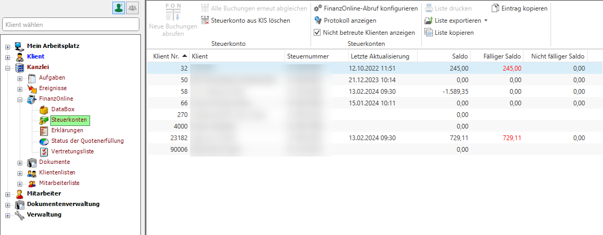

Innerhalb des Kanzleibereichs wird durch Anwahl des Eintrags
*FinanzOnline / Steuerkonten* die Steuerkonten-Übersicht angezeigt.
Durch einen Doppelklick mit der Maus wird das Steuerkonto im Detail für
den ausgewählten Klienten angezeigt und zeitgleich automatisch
aktualisiert. Die Funktionen im Bereich *Mein Arbeitsplatz* sind ident
zu denen im Kanzleibereich.

Tipp

Wenn Sie das Steuerkonto eines Klienten aufrufen – egal ob direkt im
Klienten oder aus der Kanzleiliste mit einem Doppelklick – wird dieses
automatisch aktualisiert. D.h. das Steuerkonto im Detail ist immer
aktuell.

**Neue Buchungen abrufen**

Mit einem Klick auf den Button *Neue Buchungen abrufen* werden neue
Buchungen der ausgewählten Zeile in der Liste abgerufen.

**Alle Buchungen erneut abgleichen**

Mit einem Klick auf den Button *Alle Buchungen erneut abgleichen* werden
alle bisherigen Buchungen (zurück bis zum definierten Abrufzeitraum)
nochmals abgerufen.

**Steuerkonto aus KIS löschen**

Wählen Sie die Schaltfläche *Steuerkonto aus KIS löschen* an und
bestätigen die anschließende Abfrage mit *Ja* wird das bisher abgerufene
Steuerkonto aus dem KIS gelöscht.

Abb. 6‑26 Steuerkonto Kanzleibereich – Steuerkonto aus KIS löschen I

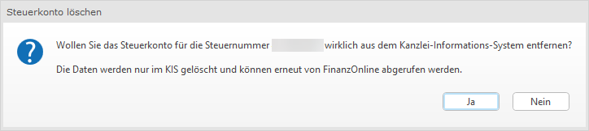

Im Anschluss erhalten Sie die Abfrage ob die Steuerkonto-Abfrage für
diesen Klienten deaktiviert werden soll. Bestätigen Sie dies mit *Ja*
wird das Steuerkonto dieses Klienten nicht mehr abgerufen. Den Abruf
können Sie im RZL Board pro Klient (Siehe Handbuch Board) bzw. über die
Option *Abruf konfigurieren* wieder aktivieren. Bestätigen Sie dies mit
Nein wird bloß das bisher abgerufene Steuerkonto aus dem KIS gelöscht
und Sie können dieses mit Auswahl beim jeweiligen Klienten erneut
abrufen.

Abb. 6‑27 Steuerkonto Kanzleibereich – Steuerkonto aus KIS löschen II

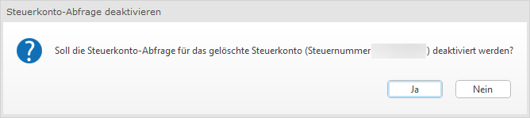

**FinanzOnline-Abruf konfigurieren**

Mit einem Klick auf den Button *Abruf konfigurieren* öffnet sich die
Klientenauswahl und Sie können festlegen, für welche Klienten das
Steuerkonto beim Aufruf in der Klientenebene bzw. beim Aufruf per
Auswahl über die Kanzleiebene abgerufen werden soll.

Abb. 6‑28 Steuerkonto Kanzleibereich – Abruf konfigurieren

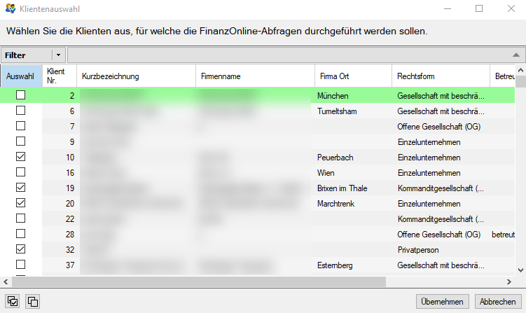

**Protokoll anzeigen**

Wählen Sie die Schaltfläche *Protokoll anzeigen* an erhalten Sie das
FinanzOnline Protokoll. Darin werden Sie informiert, welcher Mitarbeiter
zu welchem Zeitpunkt die Steuerkonto-Abfrage durchgeführt hat bzw. ob
die Abfrage erfolgreich war.

Abb. 6‑29 Steuerkonto Kanzleibereich – Protokoll anzeigen

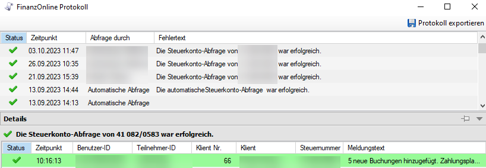

TIPP

Beim Abfragen von Steuerkonten kann es während der Wartungsarbeiten von
FinanzOnline zu Problemen kommen. Versuchen Sie den Abruf nach Abschluss
der Wartungsarbeiten erneut durchzuführen.

**Nicht betreute Klienten anzeigen**

Mit einem Klick auf den Button *Nicht betreute Klienten anzeigen* wird
die unten angezeigte Liste um die als nicht betreute Klienten
gekennzeichneten Klienten erweitert.

### Aufruf/Funktionen Steuerkonten Klient

Das Steuerkonto auf der Klientenebene kann unter dem Menüpunkt *Klient /
FinanzOnline / Steuerkonto* aufgerufen werden. Mit dem Aufruf des
Steuerkontos wird dieses automatisch aktualisiert.

Abb. 6‑30 Steuerkonto Klient

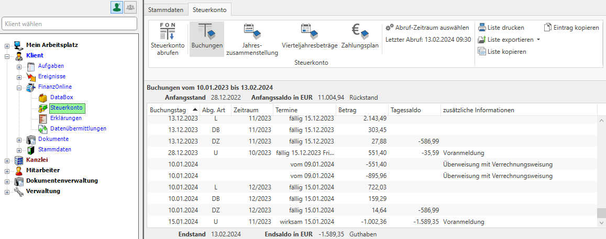

**Buchungen**

Beim Aufruf des Steuerkontos landet man standardmäßig in der Ansicht zu
den Buchungen des Kontos. Darin kann Mithilfe der Menüpunkte rechts oben
die Liste gedruckt, exportiert und kopiert werden. Werden einzelne
Buchungen ausgewählt können diese Einträge mit der Funktion *Ausgewählte
Einträge kopieren* kopiert werden.

**Jahreszusammenstellung**

Wird der Menüpunkt *Jahreszusammenstellung* angewählt werden die am
Steuerkonto gebuchten Abgabenarten für den ausgewählten Zeitraum
dargestellt. Hier können Sie die Abgabenarten nach Kalenderjahr
(Zeitraum oder Buchungstag) oder nach Wirtschaftsjahr (Zeitraum oder
Buchungstag) für das jeweilige Jahr darstellen.

Abb. 6‑31 Jahreszusammenstellung Klient

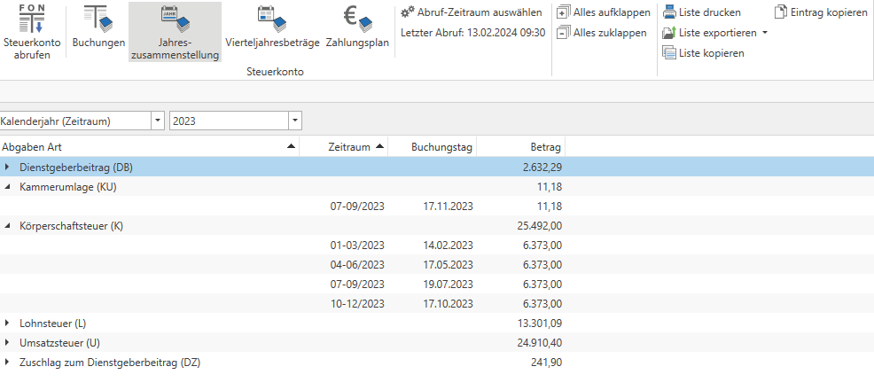

**Vierteljahresbeträge**

Wird der Menüpunkt *Vierteljahresbeträge* angewählt werden die
vorgeschriebenen Abgabenarten für den ausgewählten Zeitraum dargestellt.
Weiters erhalten Sie hier die Information ob eine Vorauszahlung noch
offen ist.

Abb. 6‑32 Vierteljahresbeträge Klient

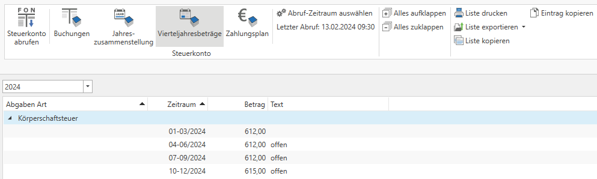

**Zahlungsplan**

Wird der Menüpunkt *Zahlungsplan* angewählt erhalten Sie die Information
zu welchem Zeitpunkt eine Abgabenart fällig ist.

Abb. 6‑33 Zahlungsplan Klient

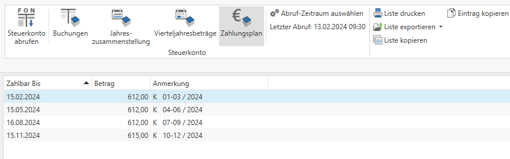

**Abruf-Zeitraum auswählen**

Mit einem Klick auf den Button *Abruf konfigurieren* kann festgelegt
werden bis zu welchem Zeitraum zurück das Steuerkonto des Klienten
abgerufen werden soll.

Abb. 6‑34 Abruf-Zeitraum auswählen Klient

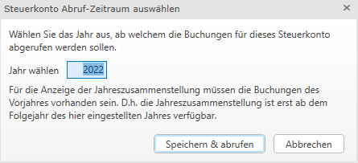

**Filterfunktionen**

Mit einem Klick auf das blaue Filtersymbol in den Spaltenüberschriften
kann ein Filter auf einen bestimmten Wert gelegt werden bzw. eine
Filterregel angelegt werden. Für detailliertere Informationen zu den
Filterfunktionen Siehe **Kapitel 3.6 Filterfunktionen Dokumentenliste
neu** auf **Seite [23](#filterfunktionen-dokumentenliste-neu)**.

Wird ein Filter in der Spalte Buchungstag gesetzt, passt sich der
Anfangs- und Endsaldo des Steuerkontos automatisch an.

Abb. 6‑35 Steuerkonto Filter - Buchungstag

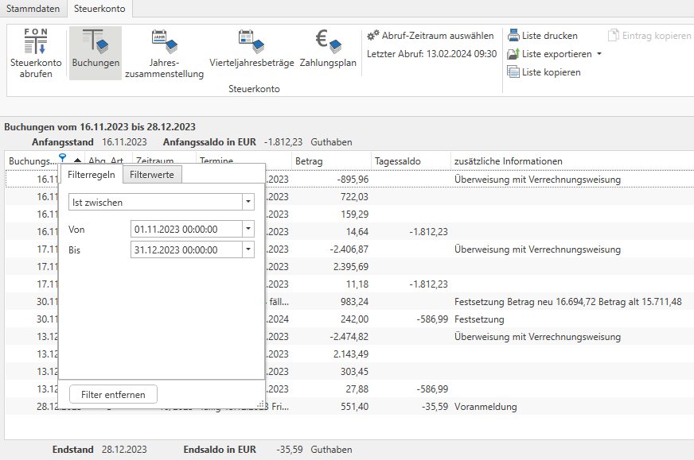