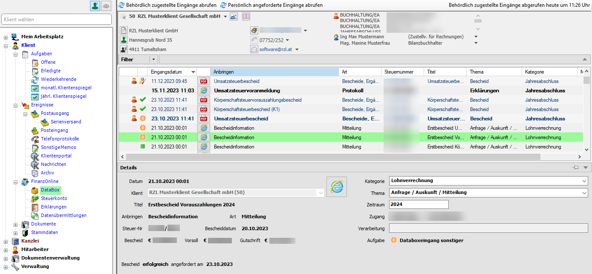
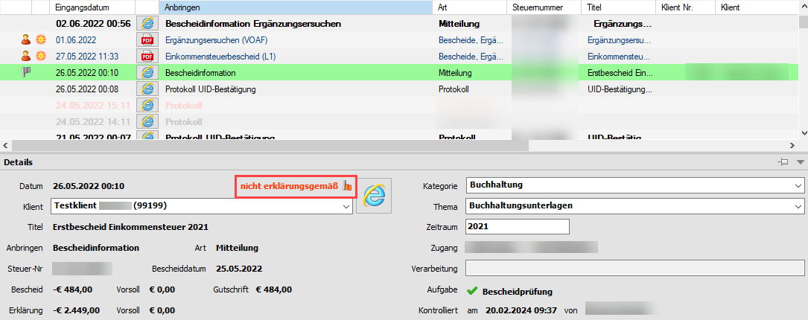
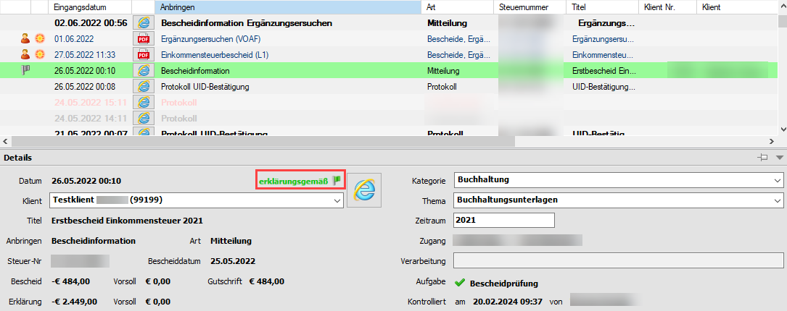
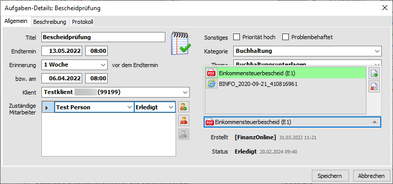
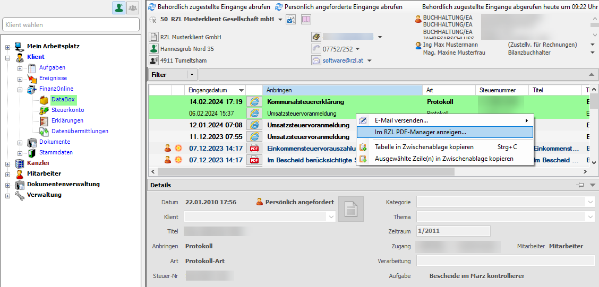

## Databox Eingänge

Die Databox-Eingänge können wie jedes Ereignis klienten- oder
kanzleibezogen aufgerufen werden.

Abb. 6‑18 FinanzOnline Eingang – neuer Screenshot

Innerhalb der Details werden die Informationen die von FinanzOnline
geliefert werden angezeigt. Zusätzlich können die „RZL-Felder“ erfasst
bzw. bearbeitet werden. Im rechten unteren Bereich werden häufig
verknüpfte Aufgaben angezeigt. Durch einen Klick auf den Aufgabentitel
erhalten Sie die Details der Aufgabe angezeigt.

Wenn Sie das Symbol in der Mitte der Detaildarstellung anwählen,
erhalten Sie einen Aufruf der jeweils heruntergeladenen Datei. Im
rechten unteren Bereich wird – wenn vorhanden – eine Aufgabe mit dem
jeweiligen Status angezeigt und diese kann durch einen Doppelklick mit
der Maus aufgerufen werden.

### Bescheidvorprüfung

Für die Bescheidvorprüfung muss innerhalb von FinanzOnline bei Ihrem
Web-Service-Benutzer im Bereich *Zustellung* das Feld *Ich möchte eine
Verständigung bei der Erstellung von Veranlagungs­bescheiden für meine
Klienten in die Databox erhalten* aktiviert sein.

Eine weitere Voraussetzung für die Bescheidvorprüfung ist die
Übermittlung der Steuererklärungen mit dem
RZLWin-Steuererklärungsprogramm mittels der elektronischen Übermittlung
entweder über das RZL Board oder manuell über die FinanzOnline-Website.
Wenn beispielsweise die Daten der Steuererklärung im FinanzOnline
händisch eingetragen werden, kann keine Bescheidvorprüfung erfolgen.

Mit den in der Bescheidinformation gespeicherten Informationen kann die
Bescheid­vorprüfung durchgeführt werden. Sie erhalten in der Databoxliste
einen Eintrag der ­– wenn nicht erklärungsgemäß veranlagt wurde - rot
dargestellt ist. Im Detail sehen Sie in roter Schrift neben dem
Eingangsdatum den Text nicht erklärungsgemäß.

Abb. 6‑19 Bescheidvorprüfung nicht erfolreich

Erfolgt die Veranlagung erklärungsgemäß erhalten Sie diese Information
in grüner Schrift.

Abb. 6‑20 Bescheidvorprüfung erfolgreich

Wenn innerhalb der FinanzOnline Zuweisungen (vgl. Kap. 6.3 *Zuordnung
von Thema/Kategorie/Aufgabenvorlage*) in den Mitteilungen für die
Bescheidinformation die gleiche Aufgabenvorlage verankert ist wie im
Bereich der *Bescheide/Ergänzungs­ansuchen/Bescheinigungen,* dann wird
nur eine Aufgabe (z.B.: Bescheidprüfung) erstellt.

Abb. 6‑21 Bescheidvorprüfung – Aufgabenerstellung

Innerhalb dieser „einen“ Aufgabe ist die Bescheidinformation und der
Bescheid zusammengefasst.

Abb. 6‑22 Aufgabenbeschreibung – Bescheidvorprüfung nicht erfolgreich

In der Aufgabenbeschreibung ist vermerkt (mit der Benutzerkennzeichnung
\[FinanzOnline\]) ob die automatische Bescheidvorprüfung erfolgreich war
oder nicht. Das Feld Beschreibungen kann in der Aufgabenliste durch
Anwahl der rechten Maustaste eingeblendet werden.

### Databoxliste – Sonderfunktionen

Wenn Sie innerhalb der Liste einen oder mehrere Einträge markieren und
die rechte Maustaste anwählen, erhalten Sie das Kontextmenü mit den
Sonderfunktionen.

Abb. 6‑23 Databoxliste – Sonderfunktionen

Sie können die markierten Einträge per E-Mail versenden. Das Programm
schlägt Ihnen die in den Stammdaten des Klienten gespeicherten
E-Mail-Adressen vor. Das E-Mail kann auch ohne Empfänger geöffnet
werden. Durch Anwahl des Eintrags *Im PDF-Drucker anzeigen* bzw. *im RZL
PDF-Manager Premium anzeigen* können Dokumenten an mehrere Klienten
gleichzeitig per E-Mail versendet werden (siehe Kapitel unterhalb).

Zusätzlich können Sie die gesamte Tabelle bzw. ausgewählte Zeilen in die
Zwischenablage kopieren und sich die Databoxliste im RZL PDF Drucker
bzw. dem RZL PDF-Manager Premium anzeigen lassen.

### Versenden von Databoxeingängen mit Hilfe des RZL PDF-Druckers bzw. RZL PDF-Manager Premium 

Abb. 6‑24 Versenden von Databox-Eingängen mit Hilfe des RZL PDF-Druckers
bzw. RZL PDF-Manager Premium

Wenn Sie Databoxeingänge – unabhängig ob es sich im XML oder PDF-Dateien
handelt - als PDF per E-Mail versenden möchten, wählen Sie zunächst die
gewünschten Zeilen aus. Nach Anwahl der rechten Maustaste klicken Sie im
Kontextmenü auf den Eintrag *Im PDF-Drucker anzeigen* bzw. *Im RZL
PDF-Manager Premium anzeigen.*

Innerhalb des RZL-PDF-Druckers bzw. RZL PDF-Manager Premium können Sie
das PDF sofort per E-Mail versenden und in einem Arbeitsschritt den
Postausgang mit MS Outlook unter gesendete Objekte ins KIS speichern.