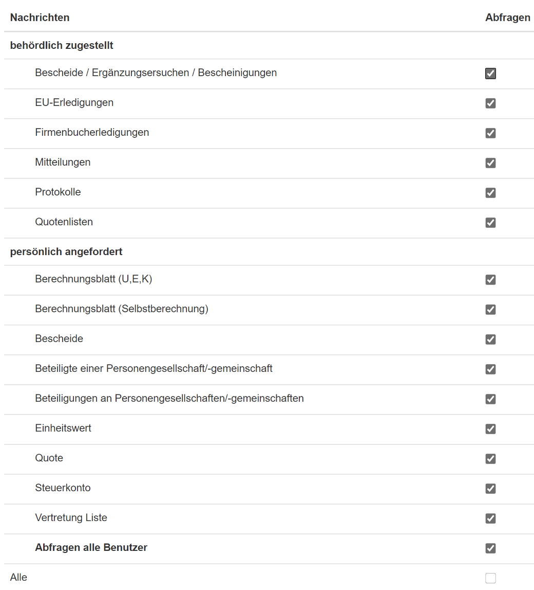

## Eintragung der Zugangskennung(en) 

Abb. 6‑3 FinanzOnline Zugänge

### WebService 

Voraussetzung für das automatisierte Auslesen der Databox ist, dass
innerhalb von FinanzOnline ein Benutzer für **WebService** angelegt ist.
Für die Anlage eines Web-Service-Benutzers vgl. Kap. 6.8 *Exkurs: Anlage
eines WebService-Benutzers*. Mit diesem Zugang werden die in die
FinanzOnline Databox behördlich zugestellten Eingänge automatisch
ausgelesen und zugeordnet.

Abb. 6‑4 Databox Synchronisation

Nach Anwahl des Eintrags *Neuer Zugang* sind die Zugangskennungen für
den im Finanz­Online angelegten WebService-Benutzer (Teilnehmer ID,
Benutzer ID und Passwort) einzugeben.

Im Bereich *Zuordnung* müssen Sie den Eintrag *WebService* anwählen. Der
Benutzer kann durch Anwahl des Felds *Aktiv* deaktiviert werden. Der
aktuellste Databox Eintrag wird mit Datum angezeigt.

Innerhalb von FinanzOnline sollten Sie im Bereich *Zustellung* die
Verständigung für Veranlagungsbescheide und die Übermittlung von
Buchungsmitteilungen aktivieren.

### Steuerkonto-, Quoten (Steuererklärungen) und Vertretungslistenabfrage 

Für die Steuerkontoabfrage, die Abfrage der Quoten, Steuererklärungen
und der Vertretungsliste wird **kein Web-Service-Benutzer** Zugang
verwendet. Hier ist ein „normaler“ FinanzOnline-Zugang der Kanzlei
einzutragen, d.h. ein Zugang der es ermöglicht ins FinanzOnline
einzusteigen um Steuerkonten, Quoten, Steuererklärungen und
Vertretungslistenabfragen usw. herunterzuladen.

Sie sollten hier allerdings keinen im Kanzlei-Informations-System
gespeicherten Mitarbeiter-Zugang eintragen, sondern einen allgemeinen
Zugang den kein Mitarbeiter verwendet. Dies hat den Hintergrund, dass
somit differenziert werden kann, welche Abfragen durch das KIS
automatisch durchgeführt wurden und welche vom jeweiligen Mitarbeiter.
Für die Vergabe der Berechtigungen lesen Sie bitte das Kapitel *Anlage
des Zugangs im Detail (siehe unten)*.

Abb. 6‑5 Automatische Steuerkontoabfrage

Im Bereich *Zuordnung* wählen Sie den Eintrag *Steuerkonto-, Quoten- und
Vertretungslistenabfrage* an. Dieser Benutzer kann durch Anwahl des
Felds *Aktiv* deaktiviert werden. Daneben wird im Feld *Aktuellster
DataBox-Eingang* das Datum des letzten persönlichen Eingangs angezeigt.

Die Abfrage der Steuerkonten und der Erklärungen kann für einzelne
Klienten in den Finanzamt-Stammdaten im RZL-Board deaktiviert werden.
Damit Steuererklärungen und Steuerkonto eines Klienten grundsätzlich
abgefragt werden können, muss für den Klienten innerhalb von
FinanzOnline Akteneinsicht gemäß § 90a BAO aktiviert sein.

#### FinanzOnline Bereich Zustellung

Innerhalb von FinanzOnline gibt es im Bereich *Zustellung* das Feld
*Zustellung*, welches zusätzliche Informationen in die DataBox der
Kanzlei bereitstellt. Die bereits bestehenden Einstellungen im Bereich
der Zustellung können unverändert beibehalten werden.

Abb. 6‑6 Finanz Online – Zustellung

#### Verständigung bei der Erstellung von Veranlagungsbescheiden

Wenn Sie dieses Feld aktivieren, erhalten Sie eine Verständigung wenn
für Ihre Klienten Veranlagungsbescheide erstellt werden. Diese
Verständigung erhalten Sie unabhängig von der tatsächlichen
Bescheidzustellung (z.B.: der Bescheid wird dem Klienten mit der Post
zugeschickt).

Zusätzlich zum Eintrag der Verständigung in die Databox werden
Bescheidinformationen beim Aufruf der **Erklärungen** im
Kanzlei-Informations-System dargestellt. Sie erhalten für Ihre
Veranlagungsbescheide das Vorsoll, den Spruchbetrag und die Gutschrift
oder Nachforderung angezeigt (vgl. Kap. 6.6 *Aufruf Erklärungen*). Mit
Hilfe dieser Informationen findet eine Bescheidvorprüfung statt.

Hinweis

Wenn Sie die automatische Bescheidvorprüfung verwenden wollen muss
dieses Feld aktiviert werden.

#### Kontoinformation bei der Erstellung einer Buchungsmitteilung

Wenn von der Finanzverwaltung eine Buchungsmitteilung erstellt wird,
können Sie sich diese Buchungsmitteilung durch Anwahl dieses Feldes in
die DataBox zustellen lassen. Immer wenn eine Buchungsmitteilung in die
DataBox geladen wird, wird gleichzeitig das Steuerkonto des Klienten
aktualisiert.

#### Anlage des Zugangs im Detail

Der Zugang für die Steuerkonto-, Quoten und Vertretungslistenabfrage
sollte nur die notwendigen Rechte besitzen. Sie sollten keinen
Supervisor-Zugang verwenden. Bei der Anlage dieses Benutzers sollten nur
nachfolgende Felder aktiviert werden. Dieser Zugang muss alle Klienten
einsehen können. D.h. es darf keine Beschränkungen durch eine ev.
Teamverwaltung geben.

Abb. 6‑7 Benutzerdaten – Übersicht

Abb. 6‑8 Benutzerkennung

Nur in den Bereichen *Abfragen, Databox* und *Admin* müssen nachfolgende
Aktivierungen vorgenommen werden.

Abb. 6‑9 Benutzerzugang – *Abfragen*

Abb. 6‑10 Benutzerzugang – *Nachrichten*

Abb. 6‑11 Benutzerzugang

### Mitarbeiter

> FinanzOnline-Zugänge können mit der Zuordnung Mitarbeiter oder
> Mitarbeiter – Login mit Benutzername gespeichert werden.

Abb. 6‑12 Mitarbeiterzugang

> Nach Eintragung der Zugangskennungen ist im Bereich *Zuordnung* der
> Eintrag *Mitarbeiter* bzw. *Mitarbeiter – Login mit Benutzername*
> auszuwählen. Im Bereich *Mitarbeiter* wählen Sie den entsprechenden
> Mitarbeiter aus. Aktivieren Sie den Mitarbeiterzugang indem Sie das
> Hakerl bei *Aktiv* setzen, um diesen wie vorgesehen verwenden zu
> können.
>
> Wenn Sie das Hakerl im Feld *Persönliche Databox abrufen* setzen, dann
> können Einträge in der persönlichen DataBox im
> Kanzlei-Informations-System abgerufen werden. Das Feld *Letzter
> DataBox-Eingang* zeigt Ihnen den aktuellsten Eingang an.
>
> Für persönliche angeforderte Bescheide welche älter als 2 Monate sind,
> werden aufgrund der Aufgabenvorlagen innerhalb der
> FinanzOnline-Zuweisungen keine Aufgaben mehr generiert (vgl. Kap. 6.3
> *Zuordnung von Thema/Kategorie/Aufgabenvorlage*). Im Programmteil
> *Extras / Einstellungen* können Sie im Registerblatt *FinanzOnline*
> die Aufgabenerstellung für persönlich angeforderte Bescheide
> deaktivieren.
>
> Wenn mehrere Vollmachten (Teilnehmer-IDs) vorhanden sind, muss pro
> Mitarbeiter für jede Vollmacht ein Zugang angelegt werden.

#### Automatischer Einstieg in FinanzOnline

> Im Stammdatenbereich des Kanzlei-Informations-Systems erfolgt der
> Einstieg ins FinanzOnline durch Anwahl der Steuernummer. Die
> Steuernummer kann innerhalb von FinanzOnline durch Anwahl der
> Tastenkombination STRG + V eingefügt werden.

Abb. 6‑13 Direkteinstieg – FinanzOnline - Steuernummer

> Wenn für den Mitarbeiter ein Zugang mit Mitarbeiterzuordnung angelegt
> ist, erfolgt der Einstieg ins FinanzOnline direkt ohne die Eintragung
> der Zugangskennungen. Gibt es für den Mitarbeiter keinen
> Mitarbeiterzugang – kann dieser die Steuernummer trotzdem anwählen –
> muss aber die Zugangskennungen eintippen.

**HINWEIS**

Vergessen Sie nicht das Hakerl bei *Aktiv* zu setzten. Nur wenn der
Zugang auch als Aktiv gekennzeichnet wurde, können Sie den automatischen
Login in FinanzOnline nutzen.

### Grundeinstellungen für die FinanzOnline-Abfragen

> Die Grundeinstellungen für die Abfragen über FinanzOnline finden Sie
> im Programmteil *Extras / Einstellungen* im Registerblatt
> *FinanzOnline*.

Abb. 6‑14 Allgemeine FinanzOnline Einstellungen

#### Behördliche DataBox

In diesem Feld tragen Sie ein in welchen Intervallen die behördliche
DataBox abgefragt werden soll (vgl. Kap. 6.4 *Databox Eingänge*).

#### Persönliche Databox

Hier tragen Sie das Intervall ein, indem die persönliche DataBox
automatisch abgefragt werden soll. Für Klienten wo keine
Zustellvollmacht auf Papier oder in die DataBox vorliegt, können die
Bescheide und Ergänzungsersuchen automatisch nach Eingang einer
Bescheidinformation (persönlich) abgefragt werden. Diese Einstellung
kann über die Schaltfläche *Konfigurieren* pro Klient vorgenommen
werden.

In der folgenden Liste können Sie die Klienten auswählen, wo keine
Zustellvollmacht vorliegt, um zu garantieren, dass auch bei diesen
Klienten die Bescheide und Ergänzungsersuchen automatisch nach Eingang
einer Bescheidinformation (persönlich) abgefragt werden.

Abb. 6‑15 Klientenauswahl Abruf Veranlagungsbescheide

Für Bescheide die persönlich heruntergeladen werden, werden durch Anwahl
des Felds *Aufgaben für persönlich angeforderte Bescheide erstellen,
welche weniger als zwei Monate alt sind* Aufgaben erstellt, wenn die
Bescheide weniger als 2 Monate alt sind. Wird dieses Feld nicht
aktiviert, werden für persönliche heruntergeladene Bescheide keine
Aufgaben erstellt.

#### Vertretungsliste

Die Vertretungsliste kann täglich oder wöchentlich angefordert werden
(vgl. Kap. 0 *Aufruf Vertretungsliste*)

#### Quotenerfüllung und Erklärungen

Die Quotenerfüllungen und Erklärungen werden täglich einmal zu der von
Ihnen festgelegten Uhrzeit aktualisiert.

#### Steuerkonten

Damit Buchungsmitteilungen in die DataBox geladen werden, müssen Sie
innerhalb von FinanzOnline die entsprechenden Einstellungen vornehmen.
Nach dem Eingang einer Buchungsmitteilung erfolgt die automatische
Aktualisierung der Steuerkonten der Klienten.

Die Steuerkonten werden immer aktualisiert, wenn Sie in den
Klientendaten im Bereich FinanzOnline den Eintrag *Steuerkonto*
anklicken oder in den Kanzleidaten ebenfalls im Bereich FinanzOnline die
Zeile des Klienten doppelt anklicken.

#### Dokumente

Damit die von FinanzOnline übermittelten Dokumente neben den
Databoxlisten auch in den Dokumentenlisten im KIS angezeigt werden,
müssen Sie die Option *FinanzOnline-Dokumente in den Dokumentenansichten
anzeigen* aktivieren.