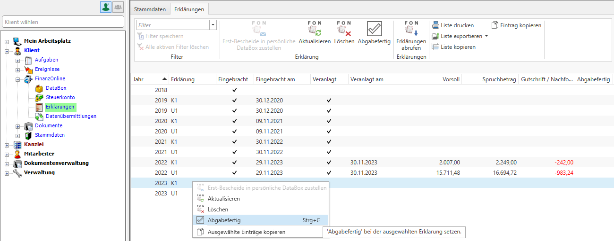
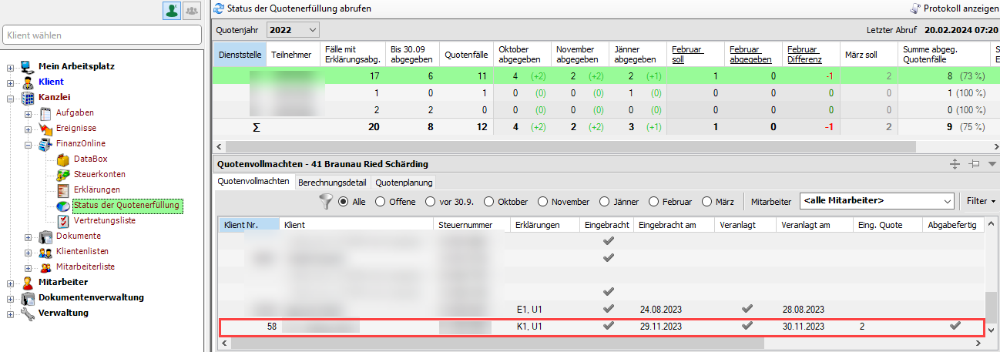
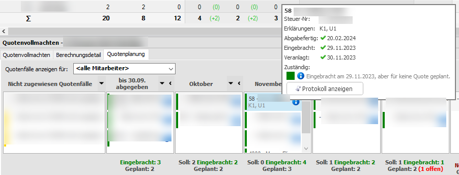
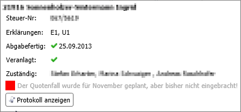
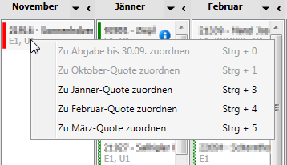
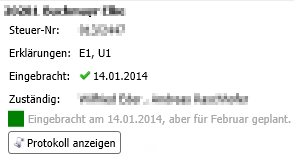
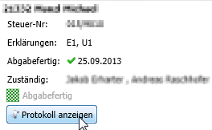
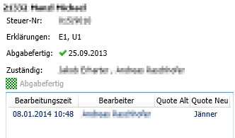
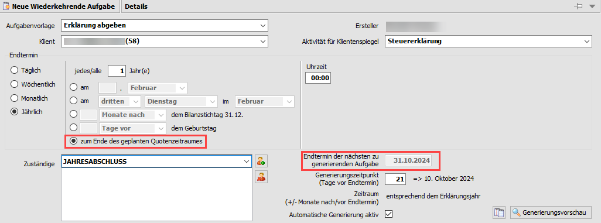
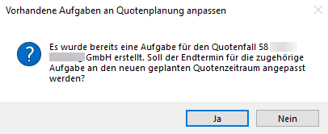

## Quotenplanung 

### Erklärungen als „abgabefertig“ markieren

Um die Erklärungen als abgabefertig zu markieren, wechseln Sie im RZL
KIS in den Menüpunkt *Mein Arbeitsplatz / Erklärungen* (**1**). Dort
markieren Sie den gewünschten Klienten (**2**) über das *Kontextmenü*
(rechter Mausklick) als *Abgabefertig* (**3**). Genauso können die
Erklärungen auch im Bereich *FinanzOnline* der Klientenansicht und der
Kanzleiansicht als Abgabefertig gekennzeichnet werden.

Abb. 6‑47 Quotenplanung - Abgabefertig

Im Menüpunkt *Kanzlei / FinanzOnline / Status der Quotenerfüllung* muss
die *Abgabefertig*-Markierung in den Registerblättern
*Quotenvollmachten* und *Quotenplanung* sichtbar sein.

Abb. 6‑48 Registerblatt Quotenvollmachten - Abgabefertig

Abb. 6‑49 Registerblatt Quotenplanung - Abgabefertig

### Quotenplanung bearbeiten

Die Quotenplanung ist nur für Mitarbeiter zugänglich, die auch das Recht
*FinanzOnline Quotenplanung* besitzen. Mitarbeiter mit der Berechtigung
FinanzOnline Quotenerfüllung hingegen können lediglich die *Details* zu
den einzelnen Quotenfällen einsehen.

Die (abgabefertigen) Quotenfälle werden aus dem Pool der *Nicht
zugewiesenen Quotenfälle* mittels *„Drag & Drop“* in den entsprechenden
zukünftigen Quotenzeitraum gezogen.

Wird ein Quotenfall für einen Quotenzeitraum geplant, aber bis zu dessen
Ende nicht abgegeben, so wird er als Überfällig gekennzeichnet.

Abb. 6‑50 Quotenplanung - Überfällig

Vergangene Quotenzeiträume können nicht mehr bearbeitet werden, außer um
überfällige Quotenfälle zu entfernen. Dazu zieht man diese entweder per
*„Drag & Drop“* in einen noch nicht vergangenen Quotenzeitraum oder man
kann im Kontextmenü (Aufruf mit einem rechten Mausklick) den
überfälligen Quotenfall neu zuordnen.

Abb. 6‑51 Quotenplanung - Neuzuordnung

Wird ein Quotenfall anders (z.B. Jänner) als *„geplant“* (z.B. Februar)
eingebracht, so wird er in dem Quotenzeitraum (Jänner) angezeigt, in dem
er tatsächlich eingebracht wurde. Im Infokasten zu diesem Quotenfall
wird dann ein entsprechender Hinweis angezeigt.

Abb. 6‑52 Quotenplanung – Anders als geplant

Nach dem 31. März eingebrachte Quotenfälle werden in einer eigenen
Spalte angezeigt, welche nicht bearbeitet werden kann.

Generell werden alle Änderungen, die an einem Quotenfall vorgenommen
werden, beim Speichern protokolliert. Dieses Protokoll ist über den
Infokasten *Protokoll anzeigen* beim einzelnen Quotenfall einsehbar.

### Aufgaben für geplante Quotenfälle generieren

Um eine Aufgabe für einen geplanten Quotenfall zu generieren, wählen Sie
den Menüpunkt *Wiederkehrende Aufgaben.* Nach Auswahl einer
Aufgabenvorlage, bei der *Endtermin jährlich* gesetzt wurde, lässt sich
die Option *zum Ende eines geplanten Quotenzeitraumes* aktivieren.

Danach muss noch der *Generierungszeitpunkt* eingegeben werden. Das Ende
des geplanten Quotenzeitraums bzw. der Generierungszeitpunkt sind bei
der *wiederkehrenden Aufgabe* erst ersichtlich, wenn der Quotenfall in
der Quotenplanung einem Zeitraum zugeordnet wurde.

Abb. 6‑53 Quotenplanung – Wiederkehrende Aufgabe

Wenn bereits eine Aufgabe generiert wurde und der Quotenfall in der
Planung abgeändert wird, erscheint beim Verlassen der Quotenplanung eine
Abfrage, ob auch der Endtermin der Aufgabe angepasst werden soll.

Abb. 6‑54 Quotenplanung – Anpassung Endtermin

