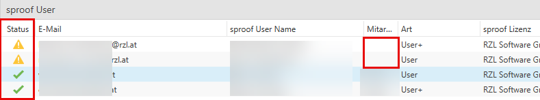

# RZLSign mit sproof 

## Verknüpfung sproof mit RZL

Um Dokumente von RZL zu sproof hochladen und signieren zu können, ist die Einrichtung der sproof Lizenz und sproof User notwendig. Diese Daten können im RZL Board unter Portale und RZLSign hinterlegt werden.

### sproof Lizenz

Die sproof Lizenz ist im RZL Board unter **Portale / RZLSign** und **Lizenz** zu hinterlegen.
Mithilfe **Neue sproof Lizenz** im Ribbon oder im Detail kann die sproof Lizenz angelegt werden. Den API Token erhalten Sie direkt von sproof und dieser ist hier einzutragen. 
Bei einer Multilizenz im RZL ist der entsprechende Lizenznehmer zuzuordnen.

Die sproof Lizenz kann hier auch gelöscht werden. Mit **sproof Lizenz löschen** wird lediglich die Verknüpfung zu RZL gelöscht.

!!! info "Hinweis"
    Sofern Sie keine Fehlermeldung beim Speichern der sproof Lizenz erhalten, ist die Verbindung aufrecht. Der API-Token wird beim Speichern mit sproof verglichen und geprüft.

### sproof User

Mit **neuer sproof User** im Ribbon/bei Details legen Sie Ihre sproof User an. Unter Mitarbeiter wählen Sie einen Mitarbeiter aus, welchem der sproof User zugeordnet werden soll. Die angezeigten Mitarbeiter im Drop-Down Feld sind jene, die bereits im Board als Mitarbeiter angelegt wurden.
In dieser Übersicht werden nicht nur von RZL angelegte User angezeigt, sondern auch User direkt von sproof. Wenn die sproof User Ansicht geöffnet wird, wird RZL und sproof synchronisiert. Welche Art für welchen sproof User vorliegt, ist im sproof festgelegt und wird synchronisiert und rein als Information im RZL angezeigt.

Der Unterschied von Users und User+ ist im sproof relevant. Für das Signieren von Dokumenten ist die Zuordnung zum Mitarbeiter notwendig.

!!! info "Hinweis"
    Einem sproof User können mehere Mitarbeiter zugeordnet werden. So können alle zugeordneten Mitarbeiter mit einem sproof User z.B. einem allgemeinen Kanzlei-User Dokumente zum Signieren an sproof hochladen.

Der Status gibt an, ob ein sproof User bereits einem Mitarbeiter zugeordnet wurde oder nicht. Ohne Zuordnung zum Mitarbeiter können von diesem Mitarbeiter keine Dokumente zum Signieren an sproof hochgeladen werden.

## Signierprozess

Die sproof Funktionen sind im RZL Kanzlei-Informations-System in den Bereichen *Mein Arbeitsplatz, Klient und Kanzlei* jeweils unter *Dokumente* zu finden. Sie können diese entweder über das Kontextmenü  (rechte Maustaste auf Dokument) oder im Ribbon aufrufen.

Soll ein Dokument signiert werden, wählen Sie **mit sproof signieren**.
Befinden sich in den Stammdaten des Klienten eine oder mehrere E-Mail-Adressen, werden diese Empfänger vor Weiterleitung des Dokuments an sproof angezeigt und Sie können jetzt bereits einen oder mehrere Empfänger wählen.

Sie werden anschließend auf die Website von sproof weitergeleitet, wo Ihnen neben dem Weiterleiten an Empfänger zur Signatur weitere Möglichkeiten zur Verfügung stehen.

### Möglichkeiten in sproof
#### Selbst unterschreiben

Sie können das Dokument vor Weiterleitung an den/die Empfänger selbst unterschreiben. 

Wählen Sie hier die Art der Signatur aus. Diese kann bereits im sproof für den User vordefiniert werden.

Als nächsten Schritt wählen Sie den Signatur-Stil aus. Einen Signatur-Stil können Sie auch neu erstellen.

Zusätzlich können Sie separate Formularfelder im Dokument platzieren wie z.B. Checkboxen, Textfelder, vordefiniertes Textfeld für den IBAN.

Damit Sie schlussendlich unterschreiben können, ist das Signaturfeld auf das Dokument an die gewünschte Stelle zu platzieren. Das führen Sie mittels Drag&Drop aus.

#### Empfänger:innen

Klicken Sie auf den Bereich *Empfänger:innen*, um die Einstellungen zum Signieren des Empfängers zu treffen.

Bei **1 Empfänger:innen** fügen Sie entweder den Empfänger bzw. die Empfänger-E-Mail-Adresse ein.

!!! info "Tipp"
    Wurde bereits beim Hochladen im RZL KIS der Empfänger gewählt, ist der Empfänger inkl. seiner/ihrer E-Mail-Adresse bereits angeführt.

Wenn Sie die Option **Signaturart des Dokuments festlegen** aktivieren, bestimmen Sie mit welcher Signaturart der Empfänger unterzeichnen muss.

!!! warning "Exkurs: Signaturarten"
    EES: Die einfache elektronische Signatur (EES) wird nicht näher bestimmt, da sie der niedrigsten Sicherheitsstufe entspricht, für welche keine besonderen Anforderungen gelten.
    
    FES: Eine fortgeschrittene elektronische Signatur (FES) ist eine digitale Unterschrift, die bestimmte Sicherheitsanforderungen erfüllt. Unterschriften dieser Art sind so angelegt, dass sie (eindeutig) einem Unterzeichner bzw. einer Unterzeichnerin zuzuordnen sind und so die Identifizierung der unterzeichnenden Person ermöglichen sollen.
    
    QES: Eine qualifizierte elektronische Signatur (QES) hat im Wesentlichen die gleiche Wertigkeit wie die handschriftliche Unterschrift und kann damit zur Unterzeichnung im elektronischen Datenverkehr eingesetzt werden. Es handelt sich dabei um die sicherste Form einer digitalen Signatur. Darunter fällt unter anderem die ID-Austria.
    
    Quelle: https://www.a-trust.at/de/

Im unteren Bereich werden jeweils die Empfänger angzeigt. Sie können mit dem Pfeil-Symbol in die Detail-Bearbeitung des Empfängers einsteigen. Sie können hier die Rolle des Empfängers definieren:

* Unterzeichner:in
* Genehmiger:in
* Betrachter:in

Die Rollen Unterzeichner:in und Genehmiger:in setzen ein Handeln des Empfängers voraus, also ein Unterzeichnen oder Genehmigen.

Da ein Dokument an mehrere Empfänger gesendet werden kann, können Sie pro Empfänger eine **individuelle Signaturart** festgelegen.
Soll einer der Empfänger wieder entfernt werden, können Sie das ebenso direkt im sproof durchführen und ggf. einen anderen Empfänger hinzufügen.

Im Schritt **2 Signaturoptionen** platzieren Sie das Signaturfeld per Drag&Drop auf die gewünschte Stelle im Dokument. Wie auch beim **Selbst unterschreiben** können Sie hier separate Formularfelder im Dokument platzieren.
Bei mehreren Empfängern muss in diesem Schritt allerdings pro Empfänger das Signaturfeld am Dokument platziert werden.

Im Schritt **3 E-Mail Einladung** kann entweder die vordefinierte E-Mail Einladung von sproof, eine selbst vordefinierte und im sproof gespeicherte Einladung oder eine in diesem Schritt eigens definierte Einladung verwendet werden.
Außerdem kann bei z.B. mehreren Empfängern eine Einzelnachricht verfasst werden.

Im Schritt **4 Weitere Einstellungen** können zusätzliche Optionen wie das Festlegen eines Fälligkeitsdatums oder das Zulassen einer Weitereitung.

Ist das Dokument schlussendlich bereit zum Unterschreiben versendet zu werden, führen Sie das mit **Einladung senden** durch.

#### Dokument bearbeiten
Über diese Option können Sie ebenso Formularfelder zum Dokument hinzufügen. 

### Was  nach dem Versenden der Einladung zur Signatur passiert
Das Dokument wurde zu sproof hochgeladen, der Empfänger und individuelle Einstellungen dazu wurden getätigt, die benötigten Formularfelder wurden auf das Dokument platziert und die Einladung wurde gesendet.
Im RZL KIS wird als Signierstatus *Ausstehend* angezeigt.
Der Klient erhält eine E-Mail, welche den Einladungslink enthält und den Betreff + Text welchen Sie im sproof beim Schritt **3 E-Mail Einladung** unter Empfänger:innen definiert haben.

Der Klient kann entweder auf **Dokument anzeigen** klicken und wird somit automatisch auf die sproof Website zum Unterzeichnen weitergeleitet oder der unten angeführte Link (URL) wird kopiert und im Internet Browser eingefügt. 

Die Art der Signatur kann der Klient nur ändern, wenn Sie bei Schritt 1 bei Empfänger:innen *freie Wahl der Signaturart* gewählt haben. Den Signatur-Stil kann der Klient selbst wählen.
Als Klient kann in dieser Ansicht unterschrieben werden oder im oberen Bereich abgelehnt werden. Außerdem kann der Klient das Dokument herunterladen. Nach **Jetzt unterschreiben** erscheint allerdings nochmal der Hinweis zum Herunterladen des Dokuments:

Nachdem der Klient unterschrieben hat wird im KIS der Signaturstatus *Abgeschlossen* angezeigt.
Wenn gewünscht kann im KIS eine Zuweisung durchgeführt werden, wodurch Sie nach Unterzeichnung (oder Ablehnung) eine Aufgabe erhalten.

### Aufgabe

Im RZL KIS unter Verwaltung / Zuweisungen können Sie unter sproof eine Aufgabenvorlage hinterlegen.

Wird das Dokument von allen Empfängern unterzeichnet, wird automatisch eine Aufgabe generiert, welche lautet *Aufgabentitel* **(Abgeschlossen)**. Wird das Dokument von einem Empfänger abgelehnt, wird ebenfalls eine Aufgabe generiert mit *Aufgabentitel* **(Abgelehnt)**.

!!! info "Hinweis"
    Die Aufgabe erhält jener Mitarbeiter, der in der Aufgabenvorlage definiert wird.

Das Dokument wird außerdem direkt zur Aufgabe zugeordnet.

!!! info "Hinweis"
    Diese Funktion wird mit der Programmversion 2.25.11 integriert.

## Dokumentenliste im KIS
Auf der sproof Website ist je Dokument auch der Dokumentenstatus ersichtlich. Damit Sie sich einen schnellen Überblick über den akutellen Status verschaffen können, gibt es den **Signierstatus** auch in den Dokumentlisten im KIS.

| Signierstatus laut KIS | Dokumentenstatus / Aktion in sproof                     |
| ---------------------- | ------------------------------------------------------- |
| Entwurf                | Entwurf / als Vorlage gespeichert                       |
| Ausstehend             | Ausstehend / Einladung zur Signatur gesendet            |
| Abgeschlossen          | Abgeschlossen / alle Empfänger haben signiert/genehmigt |
| Abgelehnt              | ein Empfänger hat das Dokument nicht signiert           |
| Abgebrochen            | der Signierprozess wurde abgebrochen                    |
| auf sproof gelöscht    | Dokument wurde auf sproof gelöscht                      |

Außerdem neu zusätzlich zum Signierstatus ist die Spalte **zu sproof hochgeladen von** in welcher der Mitarbeiter angezeigt wird, welcher das Dokument zu sproof zum Signieren geladen hat.

Der Signierstatus wird automatisch im 30 Minuten Abstand mit sproof synchronisiert. Sie können allerdings eine manuelle Synchronisation über das Ribbon unter **Signatur** durchführen. 

Außerdem gibt es für bereits auf sproof geladene Dokumente bzw. für signierte Dokumente folgende Funktionen, die Sie über das Kontextmenü bzw. über das Ribbon aufrufen können:

- **Audit Trail anzeigen** -> für signierte Dokumente
- **Dokument auf sproof anzeigen** -> möglich bei hochgeladenen Dokumenten, welche als Entwurf gespeichert wurden oder den Status *Ausstehend* besitzen; wurden Dokumente signiert oder wird der Signaturprozess abgebrochen, werden die Dokumente auf sproof gelöscht
- **Signaturprozess abbrechen** -> möglich bei hochgeladenen Dokumenten, welche als Entwurf gespeichert wurden oder den Status *Ausstehend* besitzen; auch hier wird das Dokument auf sproof gelöscht
  
!!! info "Hinweis"
    Werden Dokumente direkt im sproof oder im Zuge von *Signaturprozess abbrechen* gelöscht, kann das Dokument über *mit sproof signieren* wieder hochgeladen werden. Signierte Dokumente können nicht mehr zum Signieren auf sproof geladen werden.

## Audit Trail
Ein Audit-Trail ist eine lückenlose, chronologische Aufzeichnung, die detailliert dokumentiert, wer wann welche Aktionen an Daten oder Dokumenten vorgenommen hat, um Transparenz, Rechenschaftspflicht und Datenintegrität sicherzustellen. Den Audit Trail können Sie separat je signiertes Dokument aufrufen.

## Relevante Hinweise

Passwortgeschützte Dokumente können nicht zu sproof hochgeladen werden. 
Wird ein zu signierendes Dokument in den RZL PDF Manager gedruckt, der Dokumentenschutz aktiviert bzw. nicht deaktiviert und wird in das übernommen, so kann es nicht zu sproof zum Signieren hochgeladen werden. 
Der Dokumentenschutz muss demnach gelöscht werden.

Ein bereits signiertes Dokument darf beim Drucken in den RZL PDF Manager nicht mit einem Dokumentenschutz versehen werden, da dies die Rechtsgültigkeit der digitalen Signatur aufhebt.

!!! info "Tipp"
    Soll das Dokument dennoch passwortgeschützt versendet werden, muss es zuvor in ein ZIP-Archiv gepackt und dieses verschlüsselt werden.