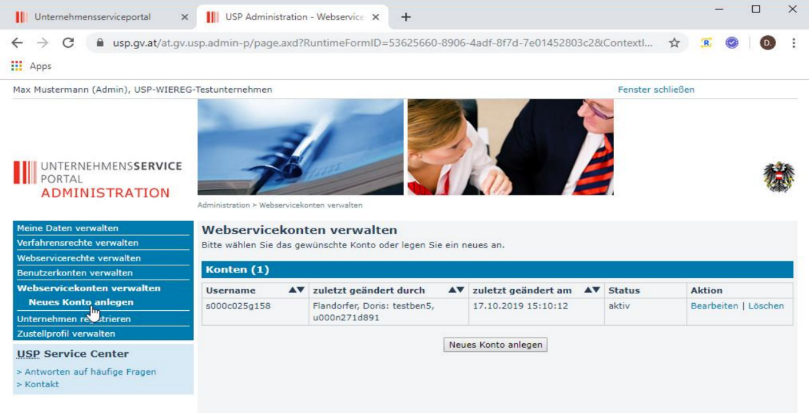

# WiEReG-Anbindung

Mit diesem Modul kann eine Verlinkung zum Einmeldeformular auf der
USP-Website hergestellt werden. Ebenso besteht die Möglichkeit
WiEReG-Auszüge in einem gewissen Intervall bzw. bei erfolgter Änderung
automatisiert abzurufen.

Damit im Zusammenhang stehend können Sie Mithilfe einer Aufgabenvorlage
definieren ob und welche Aufgabe für den jeweilig zuständigen
Mitarbeiter generiert werden soll.

## USP WebService Zugang

Voraussetzung für das automatisierte Auslesen der WiEReG-Meldungen bzw.
das Abrufen von WiEReG-Auszügen ist, dass innerhalb von USP ein Benutzer
für **WebService** angelegt ist.

Abb. 7‑1 USP WebService Zugang

Nach Anwahl des Eintrags Neuer Zugang sind die Zugangskennungen für den
im USP angelegten WebService-Benutzer (Benutzer ID und Passwort)
einzugeben.

Im Bereich Zuordnung müssen Sie den Eintrag Web-Service USP anwählen.
Der Benutzer kann durch Anwahl des Felds aktiv deaktiviert werden.

Inhalte © 2022  
RZL Software GmbH

## Exkurs: Anlage eines WebService-Benutzers

In der Administratorverwaltung des USP ist der Menüpunkt zu finden mit
dem WebServicekontos angelegt werden können. Das Anlegen funktioniert
ähnlich wie die Anlage von Benutzern mit dem Unterschied, dass keine
Personifizierung erforderlich ist.

Abb. 7‑2 Anlage WebService im USP

Nachdem ein WebService-Konto angelegt wurde, kann man über den Menüpunkt
„WebService-Rechte verwalten“ die entsprechende Berechtigung vergeben.
Der WebService-Benutzer für das RZL KIS/Board benötigt folgende
Berechtigungen:

- WiEReG - WebService Datenabgleich: Zum Abruf von Auszügen und
  XML-Dateien

- WiEReG - Änderungsdienst: Zur Information über Änderungen bei den
  gemeldeten wirtschaftlichen Eigentümern ihrer Kunden

Eine ausführliche Dokumentation zur Anlage eines Webservicebenutzers
finden Sie in der Anwendungshilfe des BMF:

<https://www.google.at/url?sa=t&rct=j&q=&esrc=s&source=web&cd=&ved=2ahUKEwiQ08LfmqrvAhViAWMBHVsfAg4QFjAEegQIARAD&url=https%3A%2F%2Fwww.bmf.gv.at%2Fdam%2Fjcr%3A8395916a-aefd-446b-803c-904ab3456020%2FAnwendungshilfe_Einrichtung_Webservice_USP.pdf&usg=AOvVaw2SfRPx1Kq3aRIARXUPwMBk>