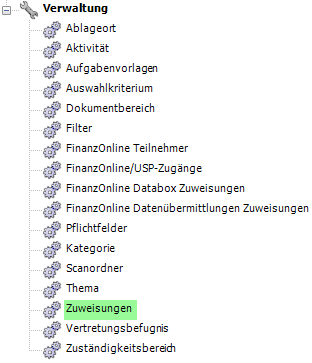
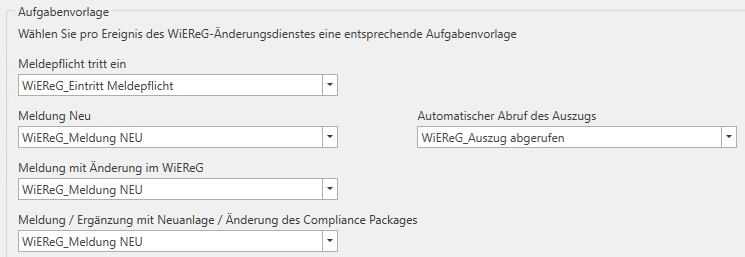

##  USP Zuweisungen

Die Zuweisungen zu den Unternehmensserviceportal Eingängen können im
KIS-Navigator unter *Verwaltung / USP – Zuweisungen* vorgenommen werden.

Abb. 7‑3 Zuweisungen

### Ablage der Auszüge

Innerhalb der USP-Zuweisungen können Sie festlegen mit welcher Kategorie
und welchem Thema die jeweiligen Auszüge strukturiert im KIS abgelegt
werden sollen. Über die Schaltflächen Thema bzw. Kategorie übernehmen
können diese Einstellungen von den Zuweisungen für den einfachen Auszug
auf alle anderen Auszüge übernommen werden.

Abb. 7‑4 Zuweisungen – Kategorie & Thema

### Aufgabenvorlage

Unter den USP-Zuweisungen / Aufgabenvorlagen können Sie definieren
welche Aufgabe bei Eintritt der Meldepflicht, bei einer durchgeführten
Meldung sowie bei einem automatischen Abruf des Auszuges erstellt werden
soll. Voraussetzung hierfür ist die Anlage einer entsprechenden
Aufgabenvorlage

Abb. 7‑5 Zuweisungen – Aufgabenvorlagen

