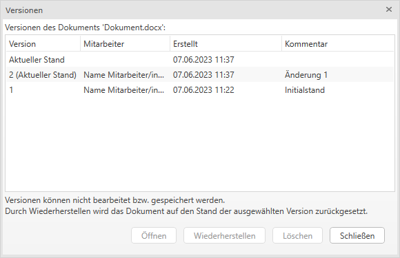

Handbuch & Dokumentation zum RZL Kanzlei-Informations-System

**Impressum**

Herausgeber

RZL Software GmbH

Hannesgrub Nord 35, 4911 Tumeltsham

Telefon 07752/252-38

E-Mail kis@rzl.at

rzlSoftware.at

Handbuch Kanzlei-Informations-System

Version A27

Alle Rechte an diesem Handbuch vorbehalten. Jede Verwertung ohne
ausdrückliche schriftliche Zustimmung des Herausgebers ist untersagt.
Vervielfältigungen sind nur im Rahmen der mit uns abgeschlossenen
Lizenz- und Wartungsverträge für den lizenzierten Standort erlaubt.

© RZL-Software, Tumeltsham

# 

# Inhaltsverzeichnis

[1 Willkommen [9](#willkommen)](#willkommen)

[2 Was ist das Kanzlei-Informations-System (was ist es nicht)
[10](#was-ist-das-kanzlei-informations-system-was-ist-es-nicht)](#was-ist-das-kanzlei-informations-system-was-ist-es-nicht)

[3 Allgemeine Programmbedienung
[11](#allgemeine-programmbedienung)](#allgemeine-programmbedienung)

[3.1 Programmstart [11](#programmstart)](#programmstart)

[3.2 Navigation [14](#navigation)](#navigation)

[3.3 Menü [15](#menü)](#menü)

[3.4 Möglichkeiten der Listengestaltung
[18](#möglichkeiten-der-listengestaltung)](#möglichkeiten-der-listengestaltung)

[3.4.1 Sortierung der Listen
[18](#sortierung-der-listen)](#sortierung-der-listen)

[3.4.2 Bearbeiten der Listen – Spalten auswählen/Spalten verschieben
[19](#bearbeiten-der-listen-spalten-auswählenspalten-verschieben)](#bearbeiten-der-listen-spalten-auswählenspalten-verschieben)

[3.4.3 Bearbeiten der Listen – Funktionen
[20](#bearbeiten-der-listen-funktionen)](#bearbeiten-der-listen-funktionen)

[3.4.4 Bearbeiten der Listen – Mehrfachauswahl
[21](#bearbeiten-der-listen-mehrfachauswahl)](#bearbeiten-der-listen-mehrfachauswahl)

[3.5 Filterfunktionen [22](#filterfunktionen)](#filterfunktionen)

[3.6 Filterfunktionen Dokumentenliste neu
[23](#filterfunktionen-dokumentenliste-neu)](#filterfunktionen-dokumentenliste-neu)

[3.7 Expertenmodus (Dokumentenliste)
[25](#expertenmodus-dokumentenliste)](#expertenmodus-dokumentenliste)

[3.8 Suche nach Klienten/Mitarbeitern/
[27](#suche-nach-klientenmitarbeitern)](#suche-nach-klientenmitarbeitern)

[3.9 Automatisches Speichern der Daten
[28](#automatisches-speichern-der-daten)](#automatisches-speichern-der-daten)

[3.10 ESC-Taste - Nicht speichern
[29](#esc-taste---nicht-speichern)](#esc-taste---nicht-speichern)

[4 Aufgaben/Klientenspiegel
[31](#aufgabenklientenspiegel)](#aufgabenklientenspiegel)

[4.1 Anlegen und Bearbeiten von Aufgaben
[33](#anlegen-und-bearbeiten-von-aufgaben)](#anlegen-und-bearbeiten-von-aufgaben)

[4.1.1 Registerblatt Allgemein
[33](#registerblatt-allgemein)](#registerblatt-allgemein)

[4.1.2 Registerblatt Beschreibung
[37](#registerblatt-beschreibung)](#registerblatt-beschreibung)

[4.1.3 Registerblatt Protokoll
[38](#registerblatt-protokoll)](#registerblatt-protokoll)

[4.1.4 Verwaltung der Aufgaben
[39](#verwaltung-der-aufgaben)](#verwaltung-der-aufgaben)

[4.2 Arbeiten mit Aufgabenvorlagen
[41](#arbeiten-mit-aufgabenvorlagen)](#arbeiten-mit-aufgabenvorlagen)

[4.3 Wiederkehrende Aufgaben
[41](#wiederkehrende-aufgaben)](#wiederkehrende-aufgaben)

[4.4 Zuständigkeiten: Auffang-Zuständigkeitsbereich –
Auffang-Mitarbeiter
[47](#zuständigkeiten-auffang-zuständigkeitsbereich-auffang-mitarbeiter)](#zuständigkeiten-auffang-zuständigkeitsbereich-auffang-mitarbeiter)

[4.5 Klientenspiegel [47](#klientenspiegel)](#klientenspiegel)

[4.5.1 Anlage der Aktivitäten
[48](#anlage-der-aktivitäten)](#anlage-der-aktivitäten)

[4.5.2 Zuordnung der Aktivitäten in den Klientenstammdaten
[49](#zuordnung-der-aktivitäten-in-den-klientenstammdaten)](#zuordnung-der-aktivitäten-in-den-klientenstammdaten)

[4.5.3 Zuordnung der Aktivitäten innerhalb der Aufgaben
[50](#zuordnung-der-aktivitäten-innerhalb-der-aufgaben)](#zuordnung-der-aktivitäten-innerhalb-der-aufgaben)

[4.5.4 Monatlicher Klientenspiegel
[51](#monatlicher-klientenspiegel)](#monatlicher-klientenspiegel)

[4.5.5 Jährlicher Klientenspiegel
[54](#jährlicher-klientenspiegel)](#jährlicher-klientenspiegel)

[4.5.6 Detaillierte Darstellung der Aufgaben im Klientenspiegel
[54](#detaillierte-darstellung-der-aufgaben-im-klientenspiegel)](#detaillierte-darstellung-der-aufgaben-im-klientenspiegel)

[5 Ereignisse [56](#ereignisse-1)](#ereignisse-1)

[5.1 Allgemeines [56](#allgemeines)](#allgemeines)

[5.2 Postausgang [57](#postausgang)](#postausgang)

[5.3 Posteingang [61](#posteingang)](#posteingang)

[5.4 Telefonprotokoll [63](#telefonprotokoll)](#telefonprotokoll)

[5.4.1 RZL Telefon Anbindung
[66](#rzl-telefon-anbindung)](#rzl-telefon-anbindung)

[5.5 Sonstige Memos [66](#sonstige-memos)](#sonstige-memos)

[5.6 Archivierung von Ereignissen
[69](#archivierung-von-ereignissen)](#archivierung-von-ereignissen)

[5.7 Zuordnung von Ereignissen zu Klienten – Klientenmehrfachzuordnung
[70](#zuordnung-von-ereignissen-zu-klienten-klientenmehrfachzuordnung)](#zuordnung-von-ereignissen-zu-klienten-klientenmehrfachzuordnung)

[5.8 Klientenportal [71](#klientenportal)](#klientenportal)

[5.8.1 Allgemein [71](#allgemein)](#allgemein)

[5.8.2 Klientenportal Nachrichten
[73](#klientenportal-nachrichten)](#klientenportal-nachrichten)

[6 FinanzOnline [75](#finanzonline)](#finanzonline)

[6.1 FinanzOnline Teilnehmer
[76](#finanzonline-teilnehmer)](#finanzonline-teilnehmer)

[6.2 Eintragung der Zugangskennung(en)
[77](#eintragung-der-zugangskennungen)](#eintragung-der-zugangskennungen)

[6.2.1 WebService [77](#webservice)](#webservice)

[6.2.2 Steuerkonto-, Quoten (Steuererklärungen) und
Vertretungslistenabfrage
[77](#steuerkonto--quoten-steuererklärungen-und-vertretungslistenabfrage)](#steuerkonto--quoten-steuererklärungen-und-vertretungslistenabfrage)

[6.2.3 Mitarbeiter [84](#mitarbeiter)](#mitarbeiter)

[6.2.4 Grundeinstellungen für die FinanzOnline-Abfragen
[84](#grundeinstellungen-für-die-finanzonline-abfragen)](#grundeinstellungen-für-die-finanzonline-abfragen)

[6.3 Zuordnung von Thema/Kategorie/Aufgabenvorlage
[86](#zuordnung-von-themakategorieaufgabenvorlage)](#zuordnung-von-themakategorieaufgabenvorlage)

[6.4 Databox Eingänge [88](#databox-eingänge)](#databox-eingänge)

[6.4.1 Bescheidvorprüfung
[88](#bescheidvorprüfung)](#bescheidvorprüfung)

[6.4.2 Databoxliste – Sonderfunktionen
[90](#databoxliste-sonderfunktionen)](#databoxliste-sonderfunktionen)

[6.4.3 Versenden von Databoxeingängen mit Hilfe des RZL PDF-Druckers
bzw. RZL PDF-Manager Premium
[91](#versenden-von-databoxeingängen-mit-hilfe-des-rzl-pdf-druckers-bzw.-rzl-pdf-manager-premium)](#versenden-von-databoxeingängen-mit-hilfe-des-rzl-pdf-druckers-bzw.-rzl-pdf-manager-premium)

[6.5 Aufruf Steuerkonten/Jahresaufstellung
[91](#aufruf-steuerkontenjahresaufstellung)](#aufruf-steuerkontenjahresaufstellung)

[6.5.1 Aufruf/Funktionen Steuerkonten Kanzlei
[91](#aufruffunktionen-steuerkonten-kanzlei)](#aufruffunktionen-steuerkonten-kanzlei)

[6.5.2 Aufruf/Funktionen Steuerkonten Klient
[94](#aufruffunktionen-steuerkonten-klient)](#aufruffunktionen-steuerkonten-klient)

[6.6 Aufruf Erklärungen [96](#aufruf-erklärungen)](#aufruf-erklärungen)

[6.7 Aufruf Status der Quotenerfüllung
[97](#aufruf-status-der-quotenerfüllung)](#aufruf-status-der-quotenerfüllung)

[6.8 Anlage eines WebService-Benutzers
[99](#anlage-eines-webservice-benutzers)](#anlage-eines-webservice-benutzers)

[6.9 Quotenplanung [103](#quotenplanung-1)](#quotenplanung-1)

[6.9.1 Erklärungen als „abgabefertig“ markieren
[103](#erklärungen-als-abgabefertig-markieren)](#erklärungen-als-abgabefertig-markieren)

[6.9.2 Quotenplanung bearbeiten
[105](#quotenplanung-bearbeiten)](#quotenplanung-bearbeiten)

[6.9.3 Aufgaben für geplante Quotenfälle generieren
[106](#aufgaben-für-geplante-quotenfälle-generieren)](#aufgaben-für-geplante-quotenfälle-generieren)

[6.10 FinanzOnline-Admin-Protokoll
[107](#finanzonline-admin-protokoll)](#finanzonline-admin-protokoll)

[7 WiEReG-Anbindung [108](#wiereg-anbindung)](#wiereg-anbindung)

[7.1 USP WebService Zugang
[108](#usp-webservice-zugang)](#usp-webservice-zugang)

[7.2 Exkurs: Anlage eines WebService-Benutzers
[108](#exkurs-anlage-eines-webservice-benutzers)](#exkurs-anlage-eines-webservice-benutzers)

[7.3 USP Zuweisungen [110](#usp-zuweisungen)](#usp-zuweisungen)

[7.3.1 Ablage der Auszüge
[110](#ablage-der-auszüge)](#ablage-der-auszüge)

[7.3.2 Aufgabenvorlage [110](#aufgabenvorlage-1)](#aufgabenvorlage-1)

[7.4 Überprüfung durchführen
[111](#überprüfung-durchführen)](#überprüfung-durchführen)

[7.5 Meldung durchführen
[112](#meldung-durchführen)](#meldung-durchführen)

[7.5.1 Neue Meldung über USP
[112](#neue-meldung-über-usp)](#neue-meldung-über-usp)

[7.5.2 Dokumentation zur Meldung
[113](#dokumentation-zur-meldung)](#dokumentation-zur-meldung)

[7.6 Auszüge anfordern [114](#auszüge-anfordern)](#auszüge-anfordern)

[7.6.1 Auszüge manuell anfordern
[114](#auszüge-manuell-anfordern)](#auszüge-manuell-anfordern)

[7.6.2 Auszüge automatisch anfordern
[116](#auszüge-automatisch-anfordern)](#auszüge-automatisch-anfordern)

[7.6.3 Protokoll Abruf Auszüge
[119](#protokoll-abruf-auszüge)](#protokoll-abruf-auszüge)

[7.7 Geldwäsche-Bedienung im RZL Board
[119](#geldwäsche-bedienung-im-rzl-board)](#geldwäsche-bedienung-im-rzl-board)

[8 Dokumentenverwaltung
[127](#dokumentenverwaltung)](#dokumentenverwaltung)

[8.1 Allgemeines [127](#allgemeines-1)](#allgemeines-1)

[8.2 Dokumentenverwaltung - Beschreibung der Eingabefelder
[127](#dokumentenverwaltung---beschreibung-der-eingabefelder)](#dokumentenverwaltung---beschreibung-der-eingabefelder)

[8.3 Hinzufügen von Dokumenten
[130](#hinzufügen-von-dokumenten)](#hinzufügen-von-dokumenten)

[8.4 Dokumente auf das Klientenportal hochladen
[133](#dokumente-auf-das-klientenportal-hochladen)](#dokumente-auf-das-klientenportal-hochladen)

[8.5 Hinzufügen von Dokumenten als Posteingang/Postausgang
[133](#hinzufügen-von-dokumenten-als-posteingangpostausgang)](#hinzufügen-von-dokumenten-als-posteingangpostausgang)

[8.6 Hinzufügen von Dokumenten über den RZL PDF-Manager Premium
[135](#hinzufügen-von-dokumenten-über-den-rzl-pdf-manager-premium)](#hinzufügen-von-dokumenten-über-den-rzl-pdf-manager-premium)

[8.7 Hinzufügen von Dokumenten aus dem RZL Lohn (digitaler Personalakt)
[136](#hinzufügen-von-dokumenten-aus-dem-rzl-lohn-digitaler-personalakt)](#hinzufügen-von-dokumenten-aus-dem-rzl-lohn-digitaler-personalakt)

[8.7.1 ELDA-Dokumente aus RZL Lohn hinzufügen
[137](#elda-dokumente-aus-rzl-lohn-hinzufügen)](#elda-dokumente-aus-rzl-lohn-hinzufügen)

[8.7.2 Andere Dokumente aus RZL Lohn hinzufügen
[138](#andere-dokumente-aus-rzl-lohn-hinzufügen)](#andere-dokumente-aus-rzl-lohn-hinzufügen)

[8.7.3 Lohn Dokumente aus dem Explorer/MS-Office Programmen hinzufügen
[139](#lohn-dokumente-aus-dem-explorerms-office-programmen-hinzufügen)](#lohn-dokumente-aus-dem-explorerms-office-programmen-hinzufügen)

[8.7.4 Lohn Dokumente aus Klientenportal hinzufügen
[139](#lohn-dokumente-aus-klientenportal-hinzufügen)](#lohn-dokumente-aus-klientenportal-hinzufügen)

[8.7.5 Sichtbarkeit der Lohn- bzw. Dienstnehmer-Dokumente
[140](#sichtbarkeit-der-lohn--bzw.-dienstnehmer-dokumente)](#sichtbarkeit-der-lohn--bzw.-dienstnehmer-dokumente)

[8.8 Versionsverwaltung [141](#versionsverwaltung)](#versionsverwaltung)

[8.9 Verknüpfung von Dokumenten mit Ereignissen
[144](#verknüpfung-von-dokumenten-mit-ereignissen)](#verknüpfung-von-dokumenten-mit-ereignissen)

[8.10 Versenden von Dokumenten
[146](#versenden-von-dokumenten)](#versenden-von-dokumenten)

[8.11 Dokument-Kopien speichern oder verschieben
[146](#dokument-kopien-speichern-oder-verschieben)](#dokument-kopien-speichern-oder-verschieben)

[8.12 In Beleg umwandeln
[146](#in-beleg-umwandeln)](#in-beleg-umwandeln)

[8.13 Temporären Dateipfad kopieren
[146](#temporären-dateipfad-kopieren)](#temporären-dateipfad-kopieren)

[8.14 Zum RZL Klientenportal (mit Nachricht) hochladen
[147](#zum-rzl-klientenportal-mit-nachricht-hochladen)](#zum-rzl-klientenportal-mit-nachricht-hochladen)

[8.15 Löschen von Dokumenten
[147](#löschen-von-dokumenten)](#löschen-von-dokumenten)

[8.16 Archiv-Import [147](#archiv-import)](#archiv-import)

[8.16.1 Archiv-Import aufgrund der Ordnerstruktur
[147](#archiv-import-aufgrund-der-ordnerstruktur)](#archiv-import-aufgrund-der-ordnerstruktur)

[8.16.2 Archiv-Import aufgrund der Ordnerstruktur und des Dateinamens
[149](#archiv-import-aufgrund-der-ordnerstruktur-und-des-dateinamens)](#archiv-import-aufgrund-der-ordnerstruktur-und-des-dateinamens)

[8.17 Nicht verwaltete Dokumente
[151](#nicht-verwaltete-dokumente)](#nicht-verwaltete-dokumente)

[8.18 Papierkorb für Dokumente
[151](#papierkorb-für-dokumente)](#papierkorb-für-dokumente)

[9 Klientenstammdaten im KIS
[152](#klientenstammdaten-im-kis)](#klientenstammdaten-im-kis)

[9.1 Neuanlage eines Klienten
[152](#neuanlage-eines-klienten)](#neuanlage-eines-klienten)

[9.2 Stammdatenpflege im Kanzlei-Informationssystem
[153](#stammdatenpflege-im-kanzlei-informationssystem)](#stammdatenpflege-im-kanzlei-informationssystem)

[9.3 Beschreibung der Eingabefelder
[154](#beschreibung-der-eingabefelder)](#beschreibung-der-eingabefelder)

[9.3.1 Zuordnungen [154](#zuordnungen)](#zuordnungen)

[9.3.2 Zuordnung der Lizenzen
[155](#zuordnung-der-lizenzen)](#zuordnung-der-lizenzen)

[9.4 Klientenliste [155](#klientenliste)](#klientenliste)

[9.5 Abgleich der Stammdaten mit Microsoft Outlook
[156](#abgleich-der-stammdaten-mit-microsoft-outlook)](#abgleich-der-stammdaten-mit-microsoft-outlook)

[10 Mitarbeiterstammdaten
[159](#mitarbeiterstammdaten)](#mitarbeiterstammdaten)

[10.1 Eingabebereich Zuordnungen
[160](#eingabebereich-zuordnungen)](#eingabebereich-zuordnungen)

[10.1.1 Eingabebereich Mitarbeiter-Rechte
[160](#eingabebereich-mitarbeiter-rechte)](#eingabebereich-mitarbeiter-rechte)

[10.2 Mitarbeiterliste [161](#mitarbeiterliste)](#mitarbeiterliste)

[11 Sonstige Stammdaten
[162](#sonstige-stammdaten)](#sonstige-stammdaten)

[11.1 Anlage/Bearbeitung sonstiger Stammdaten
[162](#anlagebearbeitung-sonstiger-stammdaten)](#anlagebearbeitung-sonstiger-stammdaten)

[11.1.1 Anlage von sonstigen Stammdaten
[163](#anlage-von-sonstigen-stammdaten)](#anlage-von-sonstigen-stammdaten)

[11.1.2 Bearbeiten/Löschen der sonstigen Stammdaten
[163](#bearbeitenlöschen-der-sonstigen-stammdaten)](#bearbeitenlöschen-der-sonstigen-stammdaten)

[11.2 Ablageort [163](#ablageort-2)](#ablageort-2)

[11.3 Aktivität [164](#aktivität)](#aktivität)

[11.4 Aufgabenvorlagen [165](#aufgabenvorlagen)](#aufgabenvorlagen)

[11.5 Auswahlkriterium [165](#auswahlkriterium)](#auswahlkriterium)

[11.6 Dokumentbereich [165](#dokumentbereich-1)](#dokumentbereich-1)

[11.7 Filter [167](#filter)](#filter)

[11.8 Pflichtfelder [169](#pflichtfelder)](#pflichtfelder)

[11.9 FinanzOnline Teilnehmer/Zugänge/Zuweisungen
[170](#finanzonline-teilnehmerzugängezuweisungen)](#finanzonline-teilnehmerzugängezuweisungen)

[11.10 Kategorie [171](#kategorie-6)](#kategorie-6)

[11.11 Scanordner [171](#scanordner)](#scanordner)

[11.12 Thema [172](#thema-6)](#thema-6)

[11.13 Vertretungsbefugnis
[172](#vertretungsbefugnis)](#vertretungsbefugnis)

[11.14 Zuständigkeitsbereich
[173](#zuständigkeitsbereich)](#zuständigkeitsbereich)

[12 Office Integration [175](#office-integration)](#office-integration)

[12.1 Add-Ins [175](#add-ins)](#add-ins)

[12.1.1 Outlook 2013/2016/2019/Office365
[176](#outlook-201320162019office365)](#outlook-201320162019office365)

[12.1.2 Word 2013/2016/2019/Office365 Add-Ins
[180](#word-201320162019office365-add-ins)](#word-201320162019office365-add-ins)

[12.1.3 Excel 2013/2016/2019/Office365 Add-Ins
[180](#excel-201320162019office365-add-ins)](#excel-201320162019office365-add-ins)

[12.1.4 Powerpoint 2013/2016/2019/Office365 Add-Ins
[180](#powerpoint-201320162019office365-add-ins)](#powerpoint-201320162019office365-add-ins)

[12.2 Word-Vorlagen [181](#word-vorlagen)](#word-vorlagen)

[12.2.1 Platzhalter für Briefvorlage einfügen
[181](#platzhalter-für-briefvorlage-einfügen)](#platzhalter-für-briefvorlage-einfügen)

[12.2.2 Eigenschaften für KIS Dokumentenimport vorauswählen
[189](#eigenschaften-für-kis-dokumentenimport-vorauswählen)](#eigenschaften-für-kis-dokumentenimport-vorauswählen)

[12.3 Excel/Powerpoint-Vorlagen
[189](#excelpowerpoint-vorlagen)](#excelpowerpoint-vorlagen)

[13 Abläufe [191](#abläufe)](#abläufe)

[13.1 Briefe schreiben [191](#briefe-schreiben-1)](#briefe-schreiben-1)

[13.2 Erhalt eines Dokuments (Briefes)/Einscannen
[194](#erhalt-eines-dokuments-briefeseinscannen)](#erhalt-eines-dokuments-briefeseinscannen)

[13.3 E-Mails schreiben
[195](#e-mails-schreiben-1)](#e-mails-schreiben-1)

[13.3.1 E-Mail aus dem KIS schreiben
[195](#e-mail-aus-dem-kis-schreiben)](#e-mail-aus-dem-kis-schreiben)

[13.3.2 Speichern von Anhängen
[196](#speichern-von-anhängen)](#speichern-von-anhängen)

[13.3.3 Verknüpfung zur Aufgabenverwaltung
[196](#verknüpfung-zur-aufgabenverwaltung)](#verknüpfung-zur-aufgabenverwaltung)

[13.3.4 Übernahme eines gesendeten E-Mails im Nachhinein
[197](#übernahme-eines-gesendeten-e-mails-im-nachhinein)](#übernahme-eines-gesendeten-e-mails-im-nachhinein)

[13.4 Erhalt einer E-Mail
[197](#erhalt-einer-e-mail)](#erhalt-einer-e-mail)

[13.5 Übernommene E-Mails nachtragen und markieren
[198](#übernommene-e-mails-nachtragen-und-markieren)](#übernommene-e-mails-nachtragen-und-markieren)

[13.6 Serienversand [199](#serienversand)](#serienversand)

[13.6.1 Empfängerlisten verwalten
[199](#empfängerlisten-verwalten)](#empfängerlisten-verwalten)

[13.6.2 Listenfunktionen [204](#listenfunktionen)](#listenfunktionen)

[13.6.3 Wordvorlagen erstellen
[206](#wordvorlagen-erstellen)](#wordvorlagen-erstellen)

[13.6.4 Serienbrief [208](#serienbrief)](#serienbrief)

[13.6.5 Serien-E-Mail [210](#serien-e-mail)](#serien-e-mail)

[14 Programmeinstellungen
[214](#programmeinstellungen)](#programmeinstellungen)

[14.1 KIS [214](#kis)](#kis)

[14.1.1 Klient bereinigen [214](#klient-bereinigen)](#klient-bereinigen)

[14.1.2 Beenden [215](#beenden)](#beenden)

[14.2 Funktionen [215](#funktionen)](#funktionen)

[14.2.1 Klienten auf RZL Klientenportal exportieren
[215](#klienten-auf-rzl-klientenportal-exportieren)](#klienten-auf-rzl-klientenportal-exportieren)

[14.2.2 Zuständigkeiten-Zuordnungen aus CSV-Datei importieren
[215](#zuständigkeiten-zuordnungen-aus-csv-datei-importieren)](#zuständigkeiten-zuordnungen-aus-csv-datei-importieren)

[14.2.3 KIS-Einrichtung [215](#kis-einrichtung)](#kis-einrichtung)

[14.2.4 FinanzOnline-Admin-Protokoll
[215](#finanzonline-admin-protokoll-1)](#finanzonline-admin-protokoll-1)

[14.3 Extras [215](#extras)](#extras)

[14.3.1 Strukturiertes Dokumenten-Archiv übernehmen
[215](#strukturiertes-dokumenten-archiv-übernehmen)](#strukturiertes-dokumenten-archiv-übernehmen)

[14.3.2 RZL Plugin-Manager (Klientenportal, OCR)
[215](#rzl-plugin-manager-klientenportal-ocr)](#rzl-plugin-manager-klientenportal-ocr)

[14.3.3 Microsoft Office Add-Ins
[215](#microsoft-office-add-ins)](#microsoft-office-add-ins)

[14.3.4 Briefe schreiben mit OpenXml
[215](#briefe-schreiben-mit-openxml)](#briefe-schreiben-mit-openxml)

[14.3.5 Telefonnummer ändern
[215](#telefonnummer-ändern)](#telefonnummer-ändern)

[14.3.6 Einstellungen [216](#einstellungen)](#einstellungen)

[14.4 Ansicht [216](#ansicht)](#ansicht)

[14.4.1 Auf Standardlayout zurücksetzen
[216](#auf-standardlayout-zurücksetzen)](#auf-standardlayout-zurücksetzen)

[14.5 RZL Klassik Programme
[216](#rzl-klassik-programme)](#rzl-klassik-programme)

[14.5.1 Verwaltung [216](#verwaltung)](#verwaltung)

[14.5.2 Dokumentenablage [216](#dokumentenablage)](#dokumentenablage)

[14.6 Hilfe [217](#hilfe)](#hilfe)

[15 Basisarbeit [220](#basisarbeit)](#basisarbeit)

[15.1 Übernahme der Klientendaten aus der Zentralen Mandantenverwaltung
[220](#übernahme-der-klientendaten-aus-der-zentralen-mandantenverwaltung)](#übernahme-der-klientendaten-aus-der-zentralen-mandantenverwaltung)

[15.2 Anlage der Mitarbeiter
[224](#anlage-der-mitarbeiter)](#anlage-der-mitarbeiter)

[15.3 Anlage Themen/Kategorien
[224](#anlage-themenkategorien)](#anlage-themenkategorien)

[15.4 Exkurs: notwendige Vorarbeiten in der ZMV
[224](#exkurs-notwendige-vorarbeiten-in-der-zmv)](#exkurs-notwendige-vorarbeiten-in-der-zmv)

[15.4.1 Zentrale Mandantenverwaltung (ZMV) - Vorgangsweise für die
klientenübergreifende Korrektur der Rechtsformen
[224](#zentrale-mandantenverwaltung-zmv---vorgangsweise-für-die-klientenübergreifende-korrektur-der-rechtsformen)](#zentrale-mandantenverwaltung-zmv---vorgangsweise-für-die-klientenübergreifende-korrektur-der-rechtsformen)

[15.4.2 Zentrale Mandantenverwaltung (ZMV) - Vorgangsweise für das
klientenübergreifende Aufteilen der Rechtsformen
[225](#zentrale-mandantenverwaltung-zmv---vorgangsweise-für-das-klientenübergreifende-aufteilen-der-rechtsformen)](#zentrale-mandantenverwaltung-zmv---vorgangsweise-für-das-klientenübergreifende-aufteilen-der-rechtsformen)

# Willkommen

Vielen Dank für Ihre Wahl dieses Programmes und Ihr Vertrauen in RZL
Software.

Mit diesem neuen RZL Programm erhalten Sie eine auf
Wirtschaftstreuhand-Kanzleien abgestimmte Lösung für die
Kanzlei-Organisation.

Der erste Vertreter der neuen Programmgeneration – das
Kanzlei-Informations-System – verwaltet klientenbezogene Daten und
Vorgänge. Wie auch die bestehenden RZL-Programme basiert dieses Programm
auf der mittlerweile jahrzehntelangen Erfahrung des Softwarehauses RZL
in der Unterstützung der Kanzleien.

Diese sechste Generation der RZL-Programme ist sowohl eine konsequente
Weiterentwicklung früherer Versionen, als auch ein bedeutender Schritt
in eine neue Welt. Die Programmlinie basiert auf Microsoft .net
Technologie (ausgesprochen: *dot net*).

Wichtigster Begleiter bei diesem großen Um- bzw. Neubau sind die
bestehenden Qualitäts- und Sicherheitsstandards der RZL-Lösungen. Die
Messlatte liegt hier sehr hoch. Die geschätzte Qualität und der bisher
gewohnte Bedienungskomfort sind die Maßstäbe, die gehalten bzw.
übertroffen werden wollen.

Die Programmbedienung ist um eine große Annehmlichkeit erweitert worden.
Das Programm speichert selbständig. Das will heißen, dass der Benutzer
nicht ständig Speichern-Buttons drücken muss, sondern das Programm im
Hintergrund automatisch speichert. Zu Beginn vielleicht ein bisschen
ungewohnt, wird diese Neuerung sehr bald den Komfort bei der
Programmbedienung wesentlich erhöhen.

Die Installation des Programms ist im Handbuch SETUP) beschrieben. Nach
der erfolgreichen Installation des Programms sollten Sie unbedingt das
**Kapitel 15 Basisarbeit** lesen bzw. die notwendigen Basisarbeiten
erledigen. Die ersten Schritte im Programm haben sehr großen Einfluss
auf die späteren Nutzungsmöglichkeiten und die Programmbedienung.

# Was ist das Kanzlei-Informations-System (was ist es nicht)

Das RZL Kanzlei-Informations-System unterstützt die Organisation einer
Wirtschafts­treuhand-Kanzlei. Das Programm bietet die Möglichkeit, die
Kommunikation mit den Klienten strukturiert abzuspeichern.

Sie können Postein- und Postausgänge inklusive der Dokumente zu
einzelnen Klienten zuordnen und beschlagworten. Für die geführten ein-
und ausgehenden Telefonate können Telefonprotokolle gespeichert werden.
Der Rest der Kommunikation kann über die sonstigen Memos gespeichert
werden. Das FinanzOnline-Modul ermöglicht das automatische Auslesen der
Databox, der Steuerkonten, der Quoten, der Steuererklärungen, der
Vertretungsliste und die Zuordnung/Ablage der Protokolle, Bescheide usw.
mit automatischer Aufgabenerstellung.

Im Kanzlei-Informations-System können aufgrund von Vorlagen Briefe
geschrieben werden, Sie können E-Mails schreiben und diese Dokumente
werden mit Hilfe von Add-Ins direkt aus den MS Office Programmen
(Outlook, Word, Excel) in der Dokumentenverwaltung – natürlich mit
Klientenzuordnung – gespeichert.

E-Mails die Sie erhalten können ebenfalls mit Klientenzuordnung
abgespeichert werden. Auch für eingescannte Dokumente besteht diese
Möglichkeit.

Die große Anzahl von Einträgen (Ereignisse und Dokumente) kann ganz
einfach mithilfe von Filterfunktionen übersichtlicher dargestellt
werden.

Das Kanzlei-Informations-System beinhaltet eine mitarbeiterbezogene
Aufgabenverwaltung. Sie haben die Möglichkeit Offene Aufgaben anzulegen,
diese an Mitarbeiter weiterzuleiten sowie End- und Erinnerungstermine zu
setzen. Die Aufgaben können genau beschrieben werden. Ein
Aufgabenprotokoll sorgt für Nachvollziehbarkeit. Für regelmäßig
wiederkehrende Aufgaben können Aufgabenvorlagen angelegt werden, die vom
Programm automatisch zu bestimmten Zeitpunkten erstellt werden.

Der aktuelle Status der Aufgaben kann sehr übersichtlich in dem
zugehörigen Klientenspiegel aufgerufen werden. Die Klientenspiegel
können monatlich bzw. jährlich betrachtet werden.

Das Kanzlei-Informations-System im Zusammenhang mit dem RZL Board
ersetzt mit der Stammdatenverwaltung Ihrer Klienten die Zentrale
Mandantenverwaltung. D.h. eine Neuanlage von Klienten bzw. die
Bearbeitung der Stammdaten der Klienten ist in der Zentralen
Mandantenverwaltung nicht mehr möglich. Das Ändern der Klientennummern
bzw. das Löschen von Klienten erfolgt derzeit noch über die ZMV.

In Kombination mit einer TAPI-fähigen Telefonanlage wählt das
Kanzlei-Informations-System direkt die beim Klienten hinterlegte
Telefonnummer. Bei eingehenden Anrufen erfolgt eine automatische
Identifizierung des Anrufers und der jeweilige Klient wird geöffnet. Es
erfolgt eine automatische Protokollierung des Zeitpunkts des Telefonats
und der Gesprächsdauer. Der Protokolleintrag muss lediglich um
Stichwörter oder einer Aktennotiz über den Inhalt des Gesprächs ergänzt
werden.

Das RZL Kanzlei-Informations-System wird aber – abgesehen von der ZMV –
keine anderen RZL-Programme ersetzen, sondern lediglich ergänzen. Die
Aufgaben der „alten“ Programme bleiben natürlich erhalten.

Die RZL Win Programme können im Menü des Kanzlei-Informations-Systems
gestartet werden. Die Klienten – wenn angelegt – werden automatisch mit
dem aktuellen Jahr geöffnet.

# Allgemeine Programmbedienung

## Programmstart

Abb. 3‑1 Ansicht KIS nach Programmstart

Unmittelbar nach dem Start des Programmes werden die *Menüeinträge*
(KIS, Funktionen, usw.), das Suchfeld - voreingestellt auf *Suche nach
Klient* - und im linken unteren Bereich die *Navigation* angezeigt. Im
rechten Bereich sehen Sie automatisch die offenen Aufgaben des
Mitarbeiters.

Wenn Sie im Suchfeld eine bestehende Klientennummer eintragen, werden
standardmäßig die Ereignisse des Klienten in Listenform zeitlich gereiht
angezeigt. Unter *Extras/Einstellungen* kann die Erstansicht beim Öffnen
eines Klienten pro Mitarbeiter verändert werden.

Abb. 3‑2 Erstansicht beim Öffnen des Klienten

Abb. 3‑3 Eintragung einer bestehenden Klientennummer

Nach dem Eintragen der Klientennummer im Suchfeld können Sie die
*TABULATOR-Taste* und/oder die *RETURN*-Taste bzw. ENTER*-*Taste
verwenden, um sich den Klienten anzeigen zu lassen.

Wenn Sie im Suchfeld nicht den *Suche nach Klient* Button
 anwählen, sondern auf *Suche
nach Mitarbeiter*  umschalten, können Sie nach
Mitarbeitern suchen bzw. neue Mitarbeiter anlegen.

Abb. 3‑4 Auswahl eines Mitarbeiters

Die Anlage der Mitarbeiterstammdaten erfolgt im RZL Board. Im KIS
erfolgt die Vergabe von Sichtbarkeitsrechten und die Zuteilung des
Mitarbeiters zu den Zuständigkeitsbereichen bei den Klienten, die dieser
Mitarbeiter bearbeitet.

## Navigation

Innerhalb der einzelnen Programmpunkte des RZL
Kanzlei-Informations-Systems bewegen Sie sich in der *Navigation*. Im
Bereich der Navigation verwenden Sie die Maus.

Abb. 3‑5 Ansicht der Navigation I

Um auf die einzelnen Programmteile zugreifen zu können, klicken Sie
entweder auf den Eintrag selbst oder auf das **+** Symbol vor dem
Eintrag.

 Abb. 3‑6 Ansicht der
Navigation II

Der Klientenbereich ist aufgeteilt in Aufgaben, Ereignisse,
FinanzOnline, Dokumente und Stammdaten. Beim soeben geöffneten Klienten
werden stets die Stammdaten des Klienten angezeigt.

Die Bewegung innerhalb der Navigation ist einfach und selbsterklärend.
Wenn bestimmte Einträge angewählt werden, kann es allerdings sein, dass
Sie vom Programm aufgefordert werden eine Eingabe zu machen
(Klientennummer, Mitarbeiternummer).

Im Klientenbereich und im Bereich der Mitarbeiter können Einträge nur
dann gemacht werden, wenn Sie vorher eine Klienten- oder eine
Mitarbeiternummer eintragen.

## Menü

Die Anwahl der Programmteile in der Menüleiste entspricht dem
Windowsstandard.

#### Anzeige der Klientendaten

Wenn Sie im Kanzlei-Informationssystem im *Suchfeld* mit der Einstellung
*Klient* eine gültige Klientennummer eintragen, wird im rechten Bereich
des Bildschirms eine Zusammenfassung der Stammdaten des Klienten
angezeigt. Im unteren Bereich sehen Sie die zu diesem Klienten erfassten
Ereignisse.

Abb. 3‑7 Beschreibung der Anzeige der Klientendaten I

Mit dem Buchsymbol neben der Klientenbezeichnung können Notizen zu
diesem Klienten erfasst werden. Die Notiz kann bzgl. Schriftart,
Schriftgröße usw. beliebig formatiert werden. Wählt man die Option
*Notiz beim Öffnen des Klienten anzeigen* an, wird die Notiz beim Öffnen
des Klienten angezeigt.

Abb. 3‑8 Notizen

Abb. 3‑9 Beschreibung der Anzeige der Klientenstammdaten III

Im linken Bereich der Klientenstammdaten werden der Name und die
Adressen des Klienten angezeigt.

Im mittleren Bereich sehen Sie die Anmerkungen, die Steuernummer des
Klienten, zusammengefasst die UID-Nummer, die Firmenbuchnummer und die
SV-Nummer des Klienten, die allgemeinen Telefonnummern des Klienten und
die Firmen E-Mail-Adressen. Diese Daten kommen aus der
Stammdatenverwaltung im RZL Board.

Der rechte Bereich zeigt Ihnen zunächst die Zuständigkeiten innerhalb
der Kanzlei (vgl. Kap. 9.3.1 Zuordnungen) an. Die Reihenfolge der
Anzeige wird in der Verwaltung festgelegt (vgl. Kap. 11.14
Zuständigkeitsbereich). Unterhalb sehen Sie die Kontaktpersonen des
Klienten. Die Anlage von Personen erfolgt ebenso im RZL-Board.

#### Briefe schreiben

Abb. 3‑10 Briefe schreiben

Wenn Sie das Brief-Symbol anwählen, können Sie direkt aus dem
Kanzlei-Informations-System einen Brief (mit Hilfe von Vorlagen)
erstellen und automatisch als Postausgang speichern. Die genaue
Vorgehensweise ist im Kapitel 13 *Abläufe* im Punkt 13.1 *Briefe
schreiben* erläutert.

#### Einstieg in FinanzOnline – Kopieren der Steuernummer

Wenn Sie auf die Finanzamt-Steuernummer klicken, wird automatisch die
Homepage von FinanzOnline geöffnet. Wenn in der Verwaltung für
FinanzOnline ein Mitarbeiterzugang angelegt ist (vgl. 6.2 Eintragung der
Zugangskennungen), ersparen Sie sich das Eintippen der Zugangskennungen
und kommen sofort ins FinanzOnline (**Direkteinstieg**).

Das Kanzlei-Informations-System kopiert die Steuernummer in die
Windows-Zwischenablage. Wenn Sie innerhalb von FinanzOnline nachfolgend
für Abfragen wie z. B.: den Steuerakt des Klienten die Steuernummer
eintragen müssen, geben Sie bitte **NUR** die Tasten­kombination STRG + V
ein.

Somit wird die Steuernummer automatisch eingetragen und Sie ersparen
sich das Eintippen.

#### Kopieren von UID-Nummer, Firmenbuchnummer, Sozialversicherungsnummer

Abb. 3‑11 Nummern kopieren

Die UID-Nummer, die Firmenbuchnummer und die Sozialversicherungsnummer
können durch Anwahl der rechten Maustaste kopiert werden. Wenn bei der
natürlichen Person eine Sozialversicherungsnummer eingetragen ist, wird
durch einen Einfachklick mit der Maus (linke Maustaste) das Portal der
österreichischen Sozialversicherung geöffnet. Mit einem Klick auf die
Schaltfläche Unternehmensserviceportal werden Sie automatisch über den
in der Verwaltung hinterlegten FinanzOnline Mitarbeiterzugang im USP
angemeldet. Aufgrund der fehlenden Zwei-Faktor-Authentifizierung
(Handy-Signatur, Bürgerkarte) stehen Ihnen dabei aber nur eingeschränkte
Funktionen zur Verfügung.

#### Anruf des Kunden übers KIS

Wenn eine Anbindung an eine Telefonanlage existiert und diese
Telefonanbindung im Kanzlei-Informations-System lizensiert ist, können
Sie durch Anwahl des Telefonsymbols  Ihren Kunden direkt aus dem
KIS heraus anrufen.

Zusätzlich öffnet sich automatisch ein Telefonprotokoll, das die
Gesprächsdauer protokolliert (vgl. Kap. 5.4.1 RZL Telefon Anbindung).

#### E-Mails schreiben

Durch einen Klick auf das Briefsymbol  wird automatisch ein E-Mail
mit der hinterlegten E-Mail-Adresse als Empfänger-Adresse geöffnet.
Dieses E-Mail kann automatisch als Postausgang gespeichert werden.

Die genaue Vorgehensweise finden Sie im Kapitel 13 *Abläufe* im Punkt
13.3 *E-Mails schreiben*.

Tipp

Wenn Sie nach einem Eintrag das  Symbol anwählen können,
lassen sich zusätzliche Informationen (weitere Telefonnummern,
E-Mail-Adressen) aufrufen und verwenden.

#### Kontaktpersonen

Abb. 3‑12 Kontaktpersonen

Die Kontaktpersonen werden im rechten Bereich angeführt. Durch Anwahl
des kleinen Pfeils rechts werden Detaildaten zur Kontaktperson
angezeigt. Sie können ein E-Mail an die Kontaktperson schicken (vgl.
Kap. 13.3.1 *E-Mail aus dem KIS schreiben*) und erhalten die
Telefonnummer der Kontaktperson angezeigt.

Wenn Sie die RZL Telefon-Anbindung verwenden, können Sie durch Anwahl
der Telefonverbindung die Kontaktperson direkt anrufen. Zusätzlich
öffnet sich automatisch ein Telefonprotokoll, das die Gesprächsdauer
protokolliert (vgl. Kap. 5.4.1 *RZL Telefon Anbindung*).

## Möglichkeiten der Listengestaltung

Sie erhalten nachfolgend eine Beschreibung der Funktionen der Listen
innerhalb des Kanzlei-Informations-Systems anhand der Ereignisliste
erklärt.

### Sortierung der Listen

Die Listen des Kanzlei-Informations-Systems werden nach
unterschiedlichen Kriterien vor­sortiert. Die Liste der Ereignisse ist
grundsätzlich nach Datum sortiert. Der aktuellste Eintrag steht ganz
oben.

Abb. 3‑13 Änderung der Sortierung der Listen

Sie können die Sortierung der Listen jederzeit ändern, indem Sie einfach
auf die gewünschte Spaltenüberschrift – nach der sortiert werden soll –
klicken. Wenn Sie auf die Spaltenüberschrift *Datum* klicken, ändern Sie
die Sortierung der zeitlichen Darstellung und das älteste Ereignis wird
ganz oben dargestellt. Ebenso können Sie die Sortierung nach den
Texteinträgen (*Zuständig, Thema; Kategorie*) alphabetisch auf- oder
absteigend ändern.

### Bearbeiten der Listen – Spalten auswählen/Spalten verschieben

Sie können selbst festlegen, welche Spalten in den Listen geführt werden
sollen. Die Vorgehensweise ist sehr einfach. Sie müssen sich mit dem
Cursor auf der Zeile mit der Spaltenbeschriftung befinden und wählen die
rechte Maustaste an.

Abb. 3‑14 Bearbeiten von Listen - Spaltenauswahl

Sie erhalten ein Kontextmenü mit den möglichen Spalten angezeigt. Wenn
Sie auf einen Eintrag mit der Maus klicken wird die Anzeige deaktiviert
bzw. auch wieder aktiviert. Wenn Sie eine Spalte mit der linken
Maustaste anwählen und diese gedrückt halten, können Sie die Position
der Spalte nach links oder rechts verschieben.

Gibt es innerhalb einer Liste sehr viele Felder und somit
Auswahlmöglichkeiten, wird das Kontextmenü etwas verändert dargestellt.
Wenn Sie innerhalb der Klientenliste im Kanzleibereich die rechte
Maustaste drücken, erhalten Sie folgende Ansicht.

Abb. 3‑15 Klientenliste - Spaltenauswahl

Da innerhalb dieser Liste sehr viele Felder ein- und ausgeblendet werden
können, ist das Kontextmenü für die Spaltenauswahl in mehrere Bereiche
untergliedert (*Klientendaten, Finanzamt, Finanzamt für Gebühren,
Finanzamt für MOSS, Sonstige Stammdaten, Firmendaten, Natürliche Person,
Zuordnungen, Sonstige Einstellungen*). Sie müssen einen dieser Bereiche
anwählen und können in der Liste die aufgeschlagen wird, die Felder
aktivieren und deaktivieren.

### Bearbeiten der Listen – Funktionen

Wenn sich der Cursor innerhalb der Liste befindet, erhalten Sie durch
Anwahl der rechten Maustaste ein Kontextmenü mit den möglichen
Funktionen.

Abb. 3‑16 Bearbeiten von Listen - Funktionen

In der oben dargestellten Liste kann die Tabelle in die Zwischenablage
kopiert werden (Strg + C) und die Liste ausgedruckt werden.

Sie haben zwei Möglichkeiten Ihre Listen zu kopieren. Entweder Sie
wählen innerhalb der Liste die Sie kopieren wollen die Tastenkombination
STRG + C an oder Sie drücken die rechte Maustaste und klicken auf den
Eintrag *Tabelle in Zwischenablage kopieren*.

Nach dem Kopieren öffnen Sie das Programm, in das Sie die Liste kopieren
wollen (sehr häufig MS Excel) und wählen die Tastenkombination STRG + V
zum Einfügen an.

Eine Beschreibung der Funktion *Ins Archiv verschieben* finden Sie im
Kapitel 5.6 *Archivierung von Ereignissen*.

Mit der Funktion *Klienten bei Dokumenten nachtragen* wird bei zu diesem
Ereignis zugeordneten Dokumenten der bei dem Ereignis hinterlegte Klient
beim Dokument eingetragen.

### Bearbeiten der Listen – Mehrfachauswahl

Innerhalb der Ereignis- und Dokumentenlisten haben Sie die Möglichkeit
mehrere Ereignisse/Dokumente gleichzeitig auszuwählen. Die
Mehrfachauswahl erfolgt entweder durch Anwahl der UMSCHALT-Taste
(Bereichsauswahl) oder STRG-Taste (Einzelauswahl) und der Maustaste.

Abb. 3‑17 Bearbeiten von Listen - Funktionen

Die Funktionen in den Listen (z. B.: das Versenden von Dokumenten per
E-Mail) können natürlich auch für die Mehrfachauswahl verwendet werden.
Zusätzlich haben Sie die Möglichkeit die Details zu den
Ereignissen/Dokumenten für mehrere Einträge gleichzeitig zu bearbeiten.

Wie oben im Kontextmenü ersichtlich können Sie das Feld – indem sich
gerade der Maus-Cursor befindet – freischalten. Die Freischaltung
ermöglicht die Eingabe im freigeschalteten Feld. Diese Einträge werden
für alle markierte Ereignisse/Dokumente gleichzeitig gespeichert.

Diese Möglichkeiten bestehen in allen drei Bereichen (Mein Arbeitsplatz,
Klientenebene, Kanzleiebene). Lediglich innerhalb der gesamten
Ereignisliste kann die Mehrfachauswahl nicht verwendet werden.

## Filterfunktionen

Abb. 3‑18 Filterfunktionen

Wenn Sie sich in Programmteilen mit Listendarstellung befinden, (hier
die Liste der Ereignisse im Klientenbereich) sehen Sie im oberen Bereich
des Bildschirms einen Balken mit der Bezeichnung *Filter*.

Wenn Sie mit der Maus auf den Filter-Balken klicken, können Sie einen
temporären Filter anlegen oder einen gespeicherten Filter öffnen. Filter
können in der Verwaltung der sonstigen Stammdaten fix gespeichert
werden. Fixe Filter können in den Navigator gezogen werden (vgl. Kap.
11.7 *Filter*) .

Die Bedienung der Filterfunktion ist unabhängig von der Liste, die Sie
gerade bearbeiten, immer gleich. Im unten angeführten Bildschirm wird
ein temporärer Filter erstellt.

Abb. 3‑19 Anzeige der Filterfunktion

Im Bereich *Feld* tragen Sie ein, in welchem Feld der Liste der Filter
gesetzt werden soll. Die Auswahlmöglichkeiten im Bereich *Kriterium*
hängen vom ausgewählten Feld ab. Im Feld *Wert* bestimmen Sie den von
Ihnen gesuchten Wert.

Durch Anwahl des Symbols  wird der Filter gesetzt.

Abb. 3‑20 Anzeige des Filters

Im rechten Bereich der Filterfunktion wird der gesetzte Filter
angezeigt. Im oberen Balken wird angezeigt, aus welcher Gesamtanzahl von
Elementen wie viele in diesem Beispiel Ereignisse gefiltert wurden.

Sie können mehrere Filter gleichzeitig setzen, in dem Sie die oben
beschriebene Vorgehensweise wiederholen.

Abb. 3‑21 Setzen mehrerer Filter

Das bedeutet, Sie können innerhalb Ihrer umfangreichen Listen
(Ereignisse, Klienten usw.) sehr gezielt Informationen herausfiltern und
so die Datenflut innerhalb der Kanzlei bewältigen.

Solange Sie das Kanzlei-Informations-System nicht schließen, bleiben die
temporären Filter erhalten. Ein Wechsel zwischen den verschiedenen
Bereichen des Programms löscht die temporären Filter ebenfalls nicht.

Durch Anwahl der Schaltfläche *Filter deaktivieren* werden alle
gesetzten Filter gelöscht. Möchten Sie nur einen der Filter löschen,
können Sie das mithilfe von 

Abb. 3‑22 Filter löschen

Wenn Sie das Kanzlei-Informations-System schließen, werden die
temporären Filter automatisch gelöscht. Die innerhalb der Verwaltung
(vgl. Kap. 11.7 *Filter*) gespeicherten Filter bleiben natürlich
erhalten.

 Abb. 3‑23 Volltextsuche

Mit dem Shortcut STRG + F innerhalb von Dokumentenlisten kann die
Volltextsuche aufgerufen werden. Nach dem eingegebenen Suchkriterium
wird in allen eingeblendeten Spalten gesucht und die gefundenen
Ergebnisse werden gelb hinterlegt.

## Filterfunktionen Dokumentenliste neu 

Innerhalb der neuen Dokumentenliste wurde die Ansicht der Filterfunktion
modernisiert. Die Funktionalität bleibt dabei gänzlich erhalten und
wurde um den Expertenmodus (vgl. Kap. 3.7 *Expertenmodus
(Dokumentenliste)*) erweitert. Durch Auswahl des Dropdownfeldes können
die Bedingungen für den Filter gesetzt werden. Neben dem Eintrag *Feld*
kann wie bereits erläutert ein bestimmtes Kriterium ausgewählt werden,
nachdem gefiltert werden soll. (vgl. Kap. 3.5 *Filterfunktionen*)

Abb. 3‑24 Filter anlegen I

Im Register *Filter Werte* können mittels Aktivierung der Checkbox
gleich mehrere Filterbediungen gesetzt werden.

Abb. 3‑25 Filter anlegen II

Mit einem Klick auf das Filtersymbol  wird der Filter aktiviert.
Die erstellten Filter können Sie mit einem Klick auf den Button *Filter
speichern* direkt aus dieser Liste nach Vergabe einer Bezeichnung
speichern.

Abb. 3‑26 Filter speichern

## Expertenmodus (Dokumentenliste) 

Innerhalb der Dokumentenlisten können noch viel differenziertere Filter
im sogenannten Expertenmodus erstellt werden. Durch einen Klick auf
*Expertenmodus öffnen* im Ribbon kann der Expertenmodus aufgerufen
werden.

Abb. 3‑27 Expertenmodus öffnen

Im Expertenmodus können beliebig viele Und, Oder, Nicht Und und Nicht
Oder Bedigungen erstellt werden. Durch einen Klick auf das Dropdownfeld
können die Bedigungen ausgewählt werden. Mit einem Klick auf das
Plus-Symbol können mehrere Verknüpfungen für den zu erstellenden Filter
ausgewählt werden.

Abb. 3‑28 Filter bearbeiten I

#### Und – Verknüpfung 

Mit dem logischen Und wird geprüft ob mehrere Bedingungen erfüllt sind.

#### Oder – Verknüpfung 

Muss nur eine von mehreren Bedingungen erfüllt sein verwendet man die
Oder Verknüpfung

#### Nicht Und – Verknüpfung 

Eine oder mehrere Bedingungen, welche durch UND verknüpft sind, sollen
ausgeschlossen werden.

#### Nicht Oder – Verknüpfung 

Eine oder mehrere Bedingungen, welche durch ODER verknüpft sind, sollen
ausgeschlossen werden.

Über das Plus-Symbol können dem Filter noch weitere Bedingungen
hinzugefügt werden. Im unten angeführten Beispiel filtert der angelegte
Expertenfilter alle Dokumente im Zeitraum 2019, welche das Thema
Korrespondenz Finanzamt betreffen.

Abb. 3‑29 Filter bearbeiten II

Mit einem Klick auf den Übernehmen-Button wird der Filter auf die
Dokumentenliste angewandt. Einen aktiven Filter erkennt man an der
grauen Leiste unterhalb des Ribbons. Der im Expertenmodus angelegte
Filter kann mit einem Klick auf *Filter speichern* gespeichert werden.
Durch einen Klick auf *Alle aktiven Filter löschen* werden die
angelegten Filterbedingungen wieder gelöscht. (vgl. Kap. 11.6 *Filter*).

Abb. 3‑30 Aktiver Filter innerhalb der Dokumentenliste

Haben Sie einen Filter innerhalb Ihrer Dokumentenliste aktiv gesetzt
können Sie mithilfe der linken Maustaste auf das Dropdownfeld neben *Zu
Aufgaben wechseln* innerhalb der festgelegten Filterkriterien zu den
Offenen bzw. Erledigten Aufgaben wechseln.

Abb. 3‑31 Wechsel zu Aufgaben

Anschließend erhalten Sie eine gefilterte Liste der Aufgaben mit den von
Ihnen innerhalb der Dokumentenliste festgelegten Filterkriterien. Mit
einem Klick auf *Zu Ereignissen wechseln* können Sie ebenso den Filter
direkt aus der Dokumentenliste auf die Ereignisliste anwenden. Mit der
Auswahl des Dropdownfelds können Sie noch gezielter innerhalb der
Ereignislisten differenzieren.

Abb. 3‑32 Wechsel zu Ereignissen

## Suche nach Klienten/Mitarbeitern/

Sie können im KIS nicht nur nach Klienten, sondern auch nach
Mitarbeitern suchen. Die Symbole orientieren sich nach jenen im Board.
Die Klientensuche aktivieren Sie mit Klick auf
. Die Mitarbeitersuche
aktivieren Sie mit Klick auf .

Standardmäßig ist die Suche nach Klienten hinterlegt, daher steht im
Suchfeld auch *Klient wählen*. Beim Wechsel auf Mitarbeiter steht im
Suchfeld *Mitarbeiter wählen*.

Nachfolgend erhalten Sie eine Beschreibung für die *Suche nach
Klienten*. Die Suche nach Mitarbeitern erfolgt von der Vorgehensweise
gleich und wird nicht extra beschrieben.

#### Listensuche

Wenn Sie mit Hilfe der Klientenliste den gewünschten Klienten auswählen
wollen, tragen Sie im Suchfeld nichts ein und drücken entweder die
ENTER-Taste oder die Leerzeichen-Taste.

Abb. 3‑33 Suche mit Klientenliste

Sie erhalten die Klientenliste angezeigt und können sich innerhalb der
Liste mit dem Scroll-Balken oder den Pfeil-Tasten bewegen. Sie markieren
den gewünschten Klienten entweder mit den Pfeil-Tasten oder der Maus.

Anschließend können Sie den Klienten entweder durch einen Doppelklick
mit der Maus öffnen oder Sie drücken die TABULATOR- oder ENTER-Taste.

#### Suche nach Namen – Match-Code

Sie können im Suchfeld nicht nur Klientennummern eintragen. Sie können
auch durch Eintragung von Wortbestandteilen suchen.

Abb. 3‑34 Suche nach Klientennamen

Wenn Sie den Namen oder Teile des Namens des Klienten eintragen,
erhalten Sie vom Programm eine Liste mit Vorschlägen. Diese Suche ist
eine Suche nach Wortbestandteilen. Das bedeutet, dass das eingetragene
Wort nicht unbedingt an erster Stelle stehen muss.

Die Buchstabensuche erfolgt in den Feldern *Kurzbezeichnung* und
*Synonym* in den Klientendaten.

## Automatisches Speichern der Daten

Sie werden im RZL Kanzlei-Informations-System bis auf wenige Ausnahmen
keine Speicher-Buttons finden. Es gibt keine Möglichkeit dem Programm zu
sagen, Sie wollen gerade jetzt speichern.

Das ist für die laufende Arbeit kein Nachteil, da das Programm
selbständig speichert. Ihre Eintragungen können nicht verloren gehen.
Wie gehen Sie vor, wenn Sie versehentlich etwas gespeichert haben? Sie
gehen einfach wieder in den Programmteil hinein und ändern oder löschen
die versehentlich gespeicherten Daten.

Wenn Sie sich in den Klientenstammdaten befinden und Änderungen oder
Ergänzungen vornehmen, erfolgt die Speicherung der Daten automatisch im
Hintergrund, wenn Sie den Klienten wechseln, auf einen anderen
Programmteil (z. B.: von den Dokumenten in zu den Ereignissen) klicken
oder einfach das Programm gesamt schließen.

Wir sind der Überzeugung, dass die von Ihnen eingegebenen Daten in den
meisten Fällen richtig und wertvoll sind, deshalb speichert das Programm
automatisch.

## ESC-Taste - Nicht speichern

Sie befinden Sie in einem Programmteil wie beispielsweise dem
Posteingang und haben bereits Daten erfasst. Wenn Sie den Posteingang
verlassen wird automatisch gespeichert. Wenn Sie die Eintragungen nicht
speichern wollen, drücken Sie einfach die ESC-Taste.

Abb. 3‑35 Änderungen verwerfen

Sie erhalten die Möglichkeit die noch nicht gespeicherten Änderungen zu
verwerfen. Wenn Sie die oben abgebildete Anfrage mit *JA* beantworten,
wird nicht gespeichert. Beantworten Sie diese Frage mit *Nein* kommen
Sie wieder in den ursprünglichen Programmteil hinein und können
weiterarbeiten.

# 

# Aufgaben/Klientenspiegel

Das Modul Aufgabenverwaltung bietet Ihnen die Möglichkeit Offene
Aufgaben anzulegen und zu beschreiben. Die Offenen Aufgaben kann der
Mitarbeiter für sich selbst anlegen und/oder anderen Mitarbeiter
zuweisen (weiterleiten). Die Aufgaben können händisch, mit
Aufgabenvorlagen oder automatisch als wiederkehrende Aufgaben angelegt
werden.

Wenn eine Aufgabe einem anderen Mitarbeiter zugeordnet wird, spricht man
von weitergeleiteten Aufgaben, die im Bereich *Mein Arbeitsplatz*
gesondert abgelegt werden. Erledigte Aufgaben werden ebenfalls in einem
eigenen Programmteil aufgelistet.

Die Aufgaben werden je nach Eigenschaft unterschiedlich ausgewiesen bzw.
der Status der Aufgabe wird durch verschiedene Symbole dargestellt. Die
Aufgaben können von verschiedenen Mitarbeitern detailliert und
nachvollziehbar beschrieben werden. Ein Aufgabenprotokoll stellt sicher,
dass sämtliche Änderungen der Aufgabe aufgelistet werden.

Tipp

Was einzelne Mitarbeiter im Zusammenhang mit der Aufgabenverwaltung
dürfen oder nicht kann gezielt im RZL Board unter Stamm/Berechtigungen
angepasst werden.

Abb. 4‑1 Aufgaben

In der Navigation werden die Aufgaben im Bereich *Mein Arbeitsplatz* (an
erster Stelle) *mitarbeiterbezogen* aufgelistet. Den Eintrag
*Weitergeleitete* Aufgaben finden Sie nur im Bereich *Mein
Arbeitsplatz*. Der Mitarbeiter erhält in diesem Bereich durch Anwahl des
Eintrags *Klienten* jene Klienten angezeigt, in deren Stammdaten der
Mitarbeiter als Zuständiger hinterlegt ist (vgl. 9.3.1 *Zuordnungen*).

Im Bereich der Klienten werden die Aufgaben nach Klienten geordnet
angezeigt und im Kanzleibereich finden Sie eine Liste der Aufgaben der
gesamten Kanzlei.

 Abb. 4‑2 Ansicht der Aufgaben
innerhalb der Navigation

Offene Aufgaben können in jedem Bereich des Kanzlei-Informations-Systems
angelegt werden. Wenn die Aufgabe im Klientenbereich angelegt wird, ist
die neue Aufgabe bereits dem ausgewählten Klienten zugeordnet.

##  Anlegen und Bearbeiten von Aufgaben

Neue Aufgaben werden durch Anwahl des Felds
 angelegt. Der
Detailbildschirm wird aufgerufen und Sie können die Eingabefelder der
Aufgaben ausfüllen. Wenn Aufgabenvorlagen (vgl. Kap. 4.2 Arbeiten mit
Aufgabenvorlagen) angelegt sind, können diese ebenfalls ausgewählt
werden.

Die Aufgabenverwaltung bietet rechts oben die Liste mit den Aufgaben,
unterhalb befindet sich der Detailbildschirm mit 3 Registerblättern.
Nachfolgend erhalten Sie eine Beschreibung der Eingabefelder der
einzelnen Registerblätter.

### Registerblatt Allgemein

#### Titel

Im Feld *Titel* bezeichnen Sie auf Aufgabe.

#### Endtermin

Der *Endtermin* für eine Aufgabe wird mit Datum und Uhrzeit eingetragen.
Beginnend mit dem Tag des Endtermins wird die Aufgabe in der Liste mit
roter Schrift angezeigt und zusätzlich mit rotem Warndreieck
gekennzeichnet, damit Sie auf den Termin aufmerksam werden.

#### Erinnerung

Sie können sich durch Eintragung eines Erinnerungsdatums vor Ablauf der
Frist an die Aufgabe erinnern lassen. Im Bereich Erinnerung können Sie
den Erinnerungstermin anhand einer vorgegebenen Liste automatisch
eintragen lassen. Eine Aufgabe die bereits in die Erinnerungsfrist fällt
wird in Ihren offenen Aufgaben mit  gekennzeichnet.

Erinnerungen an fällige Aufgaben und Benachrichtigung über neue Aufgaben
werden mittels Einblendungen dargestellt. Diese Einblendungen erhalten
Sie meist beim Start des Kanzlei-Informations-System, da in diesem
Zusammenhang die Aufgabenverwaltung im Hintergrund aktualisiert wird
(gilt für wiederkehrende Aufgaben – nicht für aus FinanzOnline oder
manuell erstellte Aufgaben).

Abb. 4‑3 Erinnerung an
fällige Aufgabe

Abb. 4‑4 Benachrichtigung über neue Aufgabe

#### Klient

Hier kann die Aufgabe einem Klienten zugeordnet werden. Sie können die
Liste aufschlagen und die Klienten aus der Liste auswählen. Sie können
aber auch die Klientennummer direkt eintippen bzw. durch Eintragung von
Buchstaben nach dem Namen suchen.

Wenn Sie die Eingabe der neuen Aufgabe im Klientenbereich durchführen,
ist die Klienten­nummer fix eingetragen.

#### Zuständige Mitarbeiter – Status der Aufgabe

In diesem Bereich wählen Sie die zuständigen Mitarbeiter aus. Die
Auswahl kann mit Hilfe der Liste erfolgen bzw. durch Eintippen der
Anfangsbuchstaben des Mitarbeiters.

Sie können beim zuständigen Mitarbeiter eine Aufgabe mit *Offen,
Erledigt, In Arbeit* und *Obsolet* kennzeichnen. Nach diesen
unterschiedlichen Eigenschaften einer Aufgabe können Sie filtern. Eine
Aufgabe kann in der Aufgabenliste durch Anwahl der Tastenkombination
STRG + T als Erledigt gekennzeichnet werden.

Abb. 4‑5 Status der noch nicht erledigten Aufgaben

Im Bereich der offenen Aufgaben (**1**) bedeutet kein Eintrag in der
Spalte *Status,* dass die Aufgabe noch offen ist. Wenn die Aufgabe als
*In Arbeit* gekennzeichnet ist, wird diese Eigenschaft in der Spalte
*Status* durch *Werkzeug* symbolisiert.

Aufgaben die als *Erledigt* bzw. *Obsolet* gekennzeichnet sind, werden
nicht mehr im Bereich *Offene Aufgaben* angezeigt, sondern wandern in
den Bereich *Erledigte*.

Abb. 4‑6 Erledigte/Obsolete Aufgaben

Wenn Aufgaben als *Erledigt* gekennzeichnet werden, wird in der Spalte
*Status* ein grünes Häkchen angezeigt. Obsolete Aufgaben werden mit
einem Quadrat gekennzeichnet (**2**).

Wenn ein zuständiger
Mitarbeiter eingetragen und gespeichert ist, kann die Zuordnung nicht
mehr geändert werden, sprich das Feld *Mitarbeiter* kann nicht mehr
bearbeitet werden. Die Anwahl des Kreuz-Symbols löscht eine bestehende
Zuordnung als Ganzes.

TIpp

Soll eine Aufgabe einem anderen Mitarbeiter nachvollziehbar zugeordnet
werden, markieren Sie bitte den Mitarbeiter durch einen Mausklick.
Anschließend wählen Sie bitte das Pfeil-Symbol
 an und Sie haben die
Möglichkeit die Aufgabe einem anderen Mitarbeiter weiterzuleiten.

#### Zuständigkeit \[FinanzOnline\]

Wenn Sie in den FinanzOnline-Zuweisungen (vgl. Kap. 6.3 *Zuordnung von
Thema/Kategorie/Aufgabenvorlage*) innerhalb der Protokolle in der Spalte
*Aufgabenvorlage für zu erledigende Aufgabe* eine Aufgabevorlage (z. B.:
Buchhaltung) verankern, wird diese Aufgabe automatisch geschlossen, wenn
die Übermittlung der XML-Datei (UVA-Datei) funktioniert hat. D.h. der
Mitarbeiter muss die Aufgabe nicht mehr selbst auf erledigt setzen.

#### Sonstiges

Eine Aufgabe kann mit der Eigenschaft *Priorität hoch* und/oder
*Problembehaftet* versehen werden. (vgl. Kap. 3.5 Filterfunktionen).

#### Kategorie

In diesem Bereich wählen Sie zwischen den in der Verwaltung (vgl. Kap.
11.10 Kategorie) angelegten Kategorien aus. Die Kategorie ist ein
wichtiger Eintrag für die strukturierte Ablage und für die Suche
innerhalb der Aufgaben (vgl. Kap. 3.5 Filterfunktionen).

#### Thema

Im Bereich *Thema* wählen Sie zwischen den in der Verwaltung (vgl. Kap.
11.12 Thema) angelegten Themen aus. Das Thema ist ebenfalls ein
wichtiger Eintrag für die strukturierte Ablage und für die Suche
innerhalb der Aufgaben (vgl. Kap. 3.5 Filterfunktionen).

#### Aktivität/Zeitraum

Wenn Sie die Felder *Aktivität* und *Zeitraum* bei einer Aufgabe
zuordnen, wird die Aufgabe in den Klientenspiegel übernommen und dem
aktuellen Status entsprechend dargestellt (nähere Informationen erhalten
Sie im Kapitel 4.5 *Klientenspiegel*).

#### Ereignisse

Wenn keine Ereignisse zugeordnet sind, kann eine Zuordnung durch Anwahl
der Schaltfläche *Keine Ereignisse zugeordnet* erfolgen.

Abb. 4‑7 Ereignisse einer Aufgabe zuordnen

In diesem Bereich kann die Aufgabe mit einem oder mehreren bereits
bestehenden Ereignissen (vgl. Kap. 5 Ereignisse) verknüpft werden.

Abb. 4‑8 Auswahl der Ereignisse

Das oder die Ereignisse die verknüpft werden sollen, werden mit der Maus
markiert und anschließend wird die Schaltfläche hinzufügen angewählt.

Innerhalb der Aufgabe kann die Verknüpfung mit
 wieder entfernt werden.

Der Aufgabe können Sie mit  ebenso ein neues Ereignis
zuordnen.

Aufgrund von Databoxeingängen (vgl. Kap. 6 *FinanzOnline*) werden häufig
Ereignisse automatisch zugeordnet (siehe unten *Bescheide,
Ergänzungsersuchen und Bescheinigungen*) und können mit einem
Doppelklick geöffnet werden.

Abb. 4‑9 Ereignisdetail – in der Aufgabe aufgerufen

#### Exkurs:

Sie können innerhalb eines Ereignisses durch Anwahl der rechten
Maustaste eine neue Aufgabe mit oder ohne Aufgabenvorlage erstellen.

Abb. 4‑10Erstellung einer Aufgabe innerhalb von Ereignissen

#### Dokumente

In diesem Bereich kann die Aufgabe mit einem oder mehreren Dokumenten
verknüpft werden.

Sind keine Dokumente zugeordnet kann eine Zuordnung vorgenommen werden.
Diese Vorgehensweise ist ident mit der den Ereignissen betreffend.

Tipp

Die Beschreibung der Übernahme von Dokumenten in das
Kanzlei-Informations-System finden Sie im Kapitel 8.3 *Hinzufügen von
Dokumenten*.

Dokumente die einer Aufgabe zugeordnet sind, können Sie sehr einfach
durch Anwahl der rechten Maustaste per E-Mail versenden.

Abb. 4‑11 Dokumente per E-Mail versenden

Wenn Sie den Eintrag *Versenden* anwählen, werden die beim Klienten
gespeicherten E-Mail-Adressen angezeigt und können ausgewählt werden.

### Registerblatt Beschreibung

Im Registerblatt *Beschreibung* kann die Aufgabe erläutert werden.

Abb. 4‑12 Beschreibung einer Aufgabe

Die Beschreibungen werden im unteren Teil des Bildschirms im Bereich
*Beschreibung hinzufügen* erfasst und im oberen Bereich angezeigt.

Die einzelnen Einträge werden getrennt angezeigt. Im rechten Bereich
sehen Sie den Ersteller der Einträge und das Datum und die Uhrzeit der
Einträge.

### Registerblatt Protokoll

Abb. 4‑13 Protokollierung einer Aufgabe

Das Registerblatt *Protokoll* zeigt Ihnen alle Arbeitsschritte an, die
im Zusammenhang mit der ausgewählten Aufgabe durchgeführt worden sind.

### Verwaltung der Aufgaben

Abb. 4‑14 Verwaltung der Aufgaben

Innerhalb der Aufgabenlisten können Sie durch Anwahl der rechten
Maustaste die Bearbeitungsmöglichkeiten aufrufen. Die Aufgaben können
einzeln oder auch mehrere gleichzeitig *gelöscht*, als *erledigt*
markiert, *weitergeleitet* und die (Aufgaben-)*Liste* gedruckt werden.
Die Details können nur jeweils von der aktuell markierten Aufgabe
(einzeln) gedruckt werden. Weiters kann die Aufgabenliste vollständig
oder nur die jeweils ausgewählten Zeilen in die Zwischenablage kopiert
werden und beispielsweise im Excel eingefügt werden.

#### Aufgabe löschen

Grundsätzlich können Sie nur die eigenen Aufgaben löschen. Aufgaben die
nicht die eigene Zuständigkeit betreffen, können nur mit den
entsprechenden Rechten (KIS/Aufgabenverwaltung) gelöscht werden. Das
Löschen einer Aufgabe ist unwiderruflich und wird auch nicht
protokolliert.

#### Aufgabe als „von mir erledigt“ markieren (STRG + T)

Damit Sie eine Aufgabe als erledigt markieren können, müssen Sie nicht
unbedingt in das Detail der Aufgabe klicken. Sie können innerhalb der
Aufgabenliste einzelne oder mehrere (eigene) Aufgaben durch Anwahl der
Tastenkombination STRG + T oder der rechten Maustaste als „von mir
erledigt“ kennzeichnen.

#### Aufgabe weiterleiten

Wenn Sie den Eintrag *Aufgabe weiterleiten* anwählen, erhalten Sie
folgenden Bildschirm angezeigt.

Abb. 4‑15 Aufgaben weiterleiten

Hier kann die Aufgabe einem neuen zuständigen Mitarbeiter weitergeleitet
werden. Weitergeleitet werden kann allerdings nur dann, wenn der Status
der Aufgabe „offen“ oder „in Arbeit“ ist.

#### Aufgaben drucken

Aufgaben können einzeln mit Details ausgedruckt werden. Die
Listenansicht der Aufgaben kann ebenfalls ausgedruckt werden.

#### Mehrere Aufgaben gleichzeitig bearbeiten

Wenn Sie in der Aufgabeliste mehrere Aufgaben gleichzeitig bearbeiten
möchte, müssen Sie diese Aufgabe markieren und anschließend wieder die
rechte Maustaste drücken.

Abb. 4‑16 mehrere Aufgaben gleichzeitig bearbeiten

Im Kontextmenü scheint die Anzahl der Aufgaben die bearbeitet werden
können auf. Der Detaildruck ist nur für einzelne Aufgaben möglich und
deshalb in der Liste ausgegraut.

#### Liste drucken

Dieser Programmteil ermöglicht den Ausdruck der gesamten Aufgabenliste.

#### Tabelle in Zwischenablage kopieren/Ausgewählte Zeile(n) in Zwischenablage kopieren

Durch Anwahl des Eintrags *Tabelle in Zwischenablage kopieren* oder der
Tastenkombination STRG + C wird die gesamte Tabelle in den
Zwischenablage kopiert und kann beispielsweise im Excel durch Anwahl der
Tastenkombination STRG + V eingefügt werden.

Wenn Sie in der Liste einzelne Einträge markieren, können Sie diese
durch Anwahl des Eintrags *Ausgewählte Zeile(n) in Zwischenablage*
kopieren ebenfalls kopieren.

## Arbeiten mit Aufgabenvorlagen

Sie können sich die Anlage von Aufgaben durch die Erstellung von
Aufgabenvorlagen erleichtern. Die Anlage von Aufgabenvorlagen finden Sie
im Bereich Verwaltung nach Anwahl des Eintrags *Aufgabenvorlagen*.

Abb. 4‑17 Anlage einer Aufgabenvorlage

Die Felder für das Erstellen einer Aufgabenvorlage unterscheiden sich
nicht zur normalen Aufgabe.

Allerdings kann im Feld *Titel* mit sogenannten Platzhaltern gearbeitet
werden. Das heißt, dass Sie den Titel nicht händisch eintippen müssen,
sondern die Bezeichnung automatisch vorgeschlagen wird.

Abb. 4‑18 Aufgabenvorlagen - Platzhalter

Die Eintragungen von Zeiträumen und Endtermin bezieht sich immer auf den
*Zeitpunkt der Aufgabenerstellung*.

Im Bereich der zuständigen Mitarbeiter können nicht nur – wie bei einer
normalen Aufgabe – Mitarbeiter zugeordnet werden, sondern auch
Zuständigkeiten. Wenn in der Verwaltung im Zuständigkeitsbereich (vgl.
Kap. 11.14 Zuständigkeitsbereich) beispielsweise eine Zuständigkeit
*Jahresabschluss* definiert ist, kann dieser Eintrag im Feld
*Zuständiger Mitarbeiter* zugeordnet werden. Wenn Sie nun diese
Aufgabevorlage verwenden, wird automatisch der beim jeweiligen
Klienten - als Verantwortlicher für den Jahresabschluss - zugeordnete
Mitarbeiter vorgeschlagen.

## Wiederkehrende Aufgaben

Ausgehend von einer Aufgabevorlage kann eine Aufgabe als wiederkehrend
definiert werden. Wiederkehrende Aufgaben werden bei jedem Neustart des
Kanzlei-Informations-Systems erstellt. Sie können in der Ansicht des
Klienten als auch in der Kanzleiansicht erstellt werden.

Abb. 4‑19 Wiederkehrende Aufgaben

Abb. 4‑20 Neue Wiederkehrende Aufgaben

Die wiederkehrende Aufgabe bietet Ihnen zusätzlich die Möglichkeit
festzulegen, wann die Aufgabe erstellt werden soll. Der aus der
Aufgabenvorlage übernommene Endtermin kann abgeändert werden und
übersteuert letztendlich die Eintragung in der Aufgabenvorlage. Dieses
Prinzip gilt auch für die Uhrzeit und die zuständigen Mitarbeiter.

#### Aufgabenvorlage

Hier wählen Sie aus den in der Verwaltung angelegten Aufgabenvorlagen
die zutreffende Aufgabenvorlage aus.

#### Klient

Wird die wiederkehrende Aufgabe im Klientenbereich angelegt, wird der
vorher ausgewählte Klient automatisch eingetragen. Erfolgt die Anlage im
Kanzleibereich muss der Klient aus der Liste ausgewählt werden.
Wiederkehrende Aufgaben können auf andere Klienten übertragen
(dupliziert) werden.

Tipp

Die Erstellung von wiederkehrenden Aufgaben (zB.: laufende Buchhaltung)
sollte bei einem Klienten begonnen werden, dessen eingestellte Parameter
auf die meisten anderen Klienten zutreffen. Anschließend kann diese
wiederkehrende Aufgabe auf die anderen Klienten dupliziert werden. Bei
Klienten, für die diese Parameter nicht zutreffen können diese manuell
abgeändert werden.

#### Aktivität für Klientenspiegel

Innerhalb der Klienten-Stammdaten können *Aktivitäten* (vgl. Kap. 9.3.1
Zuordnungen) zugeordnet werden. Die Aktivitäten werden mit Zeiträumen
verknüpft (monatlich, vierteljährlich, halbjährlich, jährlich).

Der zugeordnete Zeitraum wird innerhalb der wiederkehrenden Aufgabe
automatisch im Bereich *Endtermin* eingetragen. Das heißt, dass im
Bereich *Endtermin* (siehe Abbildung oben) die Felder *Täglich*,
*Wöchentlich*, *Monatlich*, *Jährlich* und *Jeden/Alle ….* ausgegraut
sind.

#### Endtermin

Im Bereich *Endtermin* wählen Sie aus wie oft (täglich, wöchentlich,
monatlich, jährlich) und wann (Uhrzeit) die Aufgaben erstellt werden
sollen. Für den Zeitpunkt der Aufgabenerstellung wird das Feld
*Generierungszeitpunkt (Tage vor Endtermin)* verwendet. Das Programm
nimmt die eingetragenen Daten im Bereich Endtermin, zieht die Tage im
Feld *Generierungszeitpunkt (Tage vor Endtermin)* ab und stellt die
Aufgabe automatisch bei jedem Neustart des Kanzlei-Informations-Systems
hinein.

Wenn die Felder *Wöchentlich*, *Monatlich*, *Jährlich* und *Jeden/Alle*
**nicht** angewählt werden können (ausgegraut), liegt das an der in den
Klientenstammdaten zugeordneten „Aktivität für den Klientenspiegel“

Abb. 4‑21 Zuordnungen – Aktivitäten/Fachbereiche

Innerhalb der Stammdaten des Klienten (vgl. Kap. 9.3.1 Zuordnungen)
können die in der Verwaltung (vgl. Kap. 11.3 Aktivität) angelegten
*Aktivitäten/Fachbereiche* mit den Zeiträumen *monatlich*,
*quartalsweise*, *halbjährlich* und *jährlich* zugeordnet werden. Diese
Zuordnung wird automatisch in den Bereich *Endtermin* übertragen und die
Eintragungsmöglichkeiten sind grau dargestellt.

Wenn Sie im Bereich des Endtermins den Eintrag *Jährlich* auswählen,
kann das Programm automatisch auf den in den Klientenstammdaten im
RZL-Board eingetragenen Bilanzstichtag zugreifen.

Abb. 4‑22 Zuordnungen – Aktivitäten/Fachbereiche

Wenn Sie in den Klientenstammdaten keinen Bilanzstichtag eingetragen
haben, nimmt das Kanzlei-Informations-System automatisch den 31.12. als
Bilanzstichtag.

Wiederkehrende Aufgaben mit einem jährlichen Endtermin können auch das
Geburtsdatum des Unternehmers oder das Ende des geplanten
Quotenzeitraumes abfragen.

Das Feld zum Ende des geplanten Quotenzeitraums wird für die
Quotenplanung benötigt (vgl. Kap. 6.7 *Aufruf Status der
Quotenerfüllung/Unterkapitel Quotenplanung*).

#### Uhrzeit

Festlegung der Uhrzeit des Endtermins. Die Uhrzeit wird aus der
Aufgabenvorlage übernommen, kann jedoch abgeändert werden.

#### Zuständige

In diesem Bereich wählen Sie die zuständigen Mitarbeiter oder
Zuständigkeiten aus. Die Auswahl kann mit Hilfe der Liste erfolgen bzw.
durch Eintippen der Anfangsbuchstaben des Mitarbeiters.

Abb. 4‑23 Zuordnungen – Aktivitäten/Fachbereiche

Durch Anwahl des erstens Symbols (**1**) können Sie neue *Zuständige*
hinzufügen. Die Anwahl des zweiten Symbols bewirkt, dass der innerhalb
der Liste markierte Zuständige gelöscht wird.

Im Bereich der zuständigen Mitarbeiter können nicht nur – wie bei einer
normalen Aufgabe – Mitarbeiter zugeordnet werden, sondern auch
Zuständigkeiten. Wenn in der Verwaltung im Zuständigkeitsbereich (vgl.
Kap. 11.14 Zuständigkeitsbereich) beispielsweise ein
Hauptverantwortlicher definiert ist, kann dieser Eintrag im Feld
*Zuständiger Mitarbeiter* zugeordnet werden. Wenn Sie nun diese
Aufgabevorlage verwenden, wird automatisch der beim jeweiligen
Klienten - als Hauptverantwortlicher - zugeordnete Mitarbeiter
vorgeschlagen. Sie können hier auch mehr als eine Zuständigkeit
zuordnen.

#### Endtermin der nächsten zu generierenden Aufgabe

Damit die wiederkehrende Einstellung der Aufgabe gestartet werden kann,
muss dieses Feld ausgefüllt werden. Hier tragen Sie den Zeitpunkt des
ersten Endtermins ein.

#### Generierungszeitpunkt (Tage vor Endtermin)

Dieses Feld ist verantwortlich für den Zeitpunkt der Aufgabenerstellung.
Die Daten des Bereichs *Endtermin der nächsten zu generierenden Aufgabe*
(siehe oben) werden um die Eintragung in diesem Feld gekürzt und die
Aufgabe wird erstellt. Das Ergebnis der Eintragung wird rechts neben dem
Feld angezeigt.

#### Zeitraum (+/- Monate nach/vor Endtermin)

In diesem Feld tragen Sie den Monat ein, für das die Arbeit erledigt
werden muss. Die Eintragung bezieht sich auf den Endtermin (siehe oben)
und erfolgt durch die Eintragung von positiven oder negativen Zahlen.
Das Ergebnis der Eintragung wird rechts neben dem Feld angezeigt.

#### Automatische Generierung aktiv

Dieses Feld können Sie verwenden um eine wiederkehrende Aufgabe zu
deaktivieren, ohne die Aufgaben löschen zu müssen.

#### Duplizieren von wiederkehrenden Aufgaben - 

Innerhalb der Details (Aufruf
mit einem Rechtsklick) einer wiederkehrenden Aufgabe kann durch Anwahl
des Duplizieren-Symbols die Aufgabe auf weitere Klienten übertragen
werden.

Abb. 4‑24 Duplizieren von Aufgabenvorlagen

In der Klientenliste können Sie die Klienten, für welche die
wiederkehrende Aufgabe dupliziert werden soll, einzeln auswählen. Wenn
alle Klienten in der Liste markiert werden sollen, kann das *Alle
auswählen* Symbol  im linken unteren Eck
ausgewählt werden. Die Hakerl können gesamt durch Anwahl des Symbols
rechts daneben wieder gelöscht werden. Natürlich können Sie die
aufgerufene Liste filtern (vgl. Kap. 3.5 Filterfunktionen).

In der Spalte bereits vorhanden wird Ihnen angezeigt, bei welchen
Klienten diese wiederkehrende Aufgabe bereits angelegt wurde.

Nach Anwahl der Schaltfläche *Duplizieren* wird die wiederkehrende
Aufgabe auf die aktivierten Klienten übertragen.

Tipp

Innerhalb der Liste der wiederkehrenden Aufgaben
(Klienten/Kanzleibereich) können einzelne Aufgaben markiert und nach
Anwahl der rechten Maustaste ebenfalls – Vorgehensweise wie oben
beschrieben – dupliziert werden.

#### Generierungsvorschau

Innerhalb der wiederkehrenden Aufgaben können Sie durch Anwahl der
Schaltfläche *Generierungsvorschau* die nächsten zu generierenden
Aufgaben ansehen.

Abb. 4‑25 Generierungsvorschau – Ausgewählte Aufgaben sofort generieren

Dieser Programmteil ermöglicht vorab die händische Generierung einer
Aufgabe. Zunächst muss die Aufgabe durch ein Hakerl im Kästchen
aktiviert werden und anschließend die Schaltfläche *Ausgewählte Aufgaben
sofort generieren* angewählt werden.

Ein möglicher Anwendungsfall ist das beispielsweise ein Klient atypisch
die Buchhaltung sofort nach Ablauf des Monats bringt und diese gleich
erledigt wird. Somit kann die Aufgabe – die zu diesem Zeitpunkt noch
nicht automatisch erzeugt wurde – händisch erzeugt und auf *Erledigt*
gesetzt werden und es ist nicht notwendig auf die automatische
Generierung zu warten. Für die Aktivität *Jahresabschluss* könnte man
einen möglichst späten Endtermin wählen, damit die Liste der Offenen
Ausgaben nicht unübersichtlich wird. Wenn der Klient die Unterlagen
bereitstellt bzw. wenn der Sachbearbeiter mit der Erstellung beginnt,
wird die Aufgabe in der Generierungsvorschau angelegt.

## Zuständigkeiten: Auffang-Zuständigkeitsbereich – Auffang-Mitarbeiter

Sie können im Programmteil *Extras / Einstellungen* im Registerblatt
*Aufgabenverwaltung* bei fehlenden Zuständigkeiten in den
Klientenstammdaten einen Auffang-Zuständigkeitsbereich und einen
Auffang-Mitarbeiter anlegen.

Abb. 4‑26 automatische Generierung von Aufgaben

Mit Hilfe dieser Zuordnungen wird verhindert, dass automatisch
generierte Aufgaben ohne Zuständigkeit erstellt werden.

## Klientenspiegel

Der RZL Klientenspiegel bietet eine aktuelle Übersicht über Ihre
offenen, in Arbeit befindlichen, überfälligen und erledigten Leistungen.
Der Klientenspiegel wird im Bereich der Aufgaben (Mein Arbeitsplatz,
Klientenaufgaben, Kanzleiaufgaben) aufgerufen.

Im Bereich *Mein Arbeitsplatz* werden die Informationen des
Klientenspiegels pro Mitarbeiter angezeigt. Im Klientenbereich sehen Sie
die Daten zum ausgewählten Klienten und schließlich im Kanzleibereich
sämtliche Eintragungen.

Abb. 4‑27 Klientenspiegel – Kanzleibereich

Der Klientenspiegel umfasst die Aktivitäten der Kanzlei für die
Klienten. Im monatlichen Klientenspiegel werden die Aufgaben pro Monat
angezeigt. Im jährlichen Klientenspiegel erfolgt die Darstellung pro
Jahr. Die Aktivitäten werden in der Verwaltung angelegt und können in
den Stammdaten des Klienten und bei den Aufgaben zugeordnet werden.

### Anlage der Aktivitäten

Die Anlage der Aktivitäten erfolgt in der Verwaltung durch Anwahl des
Eintrags *Neue* *Aktivität*.

Abb. 4‑28 Anlage der Aktivitäten

Die angelegte Aktivität kann im monatlichen oder jährlichen
Klientenspiegel angezeigt werden (vgl. Kap. 11.3 Aktivität).

Durch Anwahl der rechten Maustaste und des Eintrags Klientenzuordnung
kann die Aktivität den Klienten inklusive Zyklus zugeordnet werden.

Abb. 4‑29 Klientenauswahl Aktivitäten

Zunächst wählen Sie oben links den Zyklus der Aktivität aus (monatlich,
vierteljährlich, halbjährlich, jährlich). Anschließend werden die
Klienten durch ein Hakerl ins Kästchen gekennzeichnet und durch Anwahl
der Schaltfläche *Übernehmen* zugeordnet.

Tipp

Sie können sich die Auswahl innerhalb der Klientenliste erleichtern,
indem Sie einen temporären Filter auf die Zuständigkeit (hier:
Buchhaltung) setzen.

### Zuordnung der Aktivitäten in den Klientenstammdaten

Die Zuordnung der angelegten *Aktivitäten/Fachbereiche* kann auch
innerhalb der Klientenstammdaten im Bereich *Zuordnungen* (vgl. Kap.
9.3.1 Zuordnungen) erfolgen.

Abb. 4‑30 Anlage der Aktivitäten

Die Auswahl des Zeitraums für die einzelnen Aktivitäten (monatlich,
quartalsweise, halbjährlich, jährlich) wirkt sich auf die Darstellung
innerhalb des Klientenspiegels aus.

Abb. 4‑31 Klientenspiegel nach Zuordnung im Klientenstamm

Wenn die Zuordnung in den Stammdaten des Klienten vorgenommen wurde,
werden die Aktivitäten im Klientenspiegel anzeigt. Das Beispiel oben
zeigt den monatlichen Klientenspiegel eines Klienten mit den Aktivitäten
Buchhaltung und Personalverrechnung. Auch die Zeiträume *quartalsweise*
und *halbjährlich* werden im monatlichen Klientenspiegel ausgewiesen
(mit dem Symbol mehrmonatiger Zyklus). Die Aktivitäten denen der
Zeitraum *jährlich* zugeordnet wird (z.B.: Jahresabschluss) werden im
jährlichen Klientenspiegel ausgewiesen.

### Zuordnung der Aktivitäten innerhalb der Aufgaben

Damit im Klientenspiegel die Aufgaben und deren Status (Erledigt, In
Arbeit, usw.) angezeigt werden, ist es notwendig innerhalb der
Erstellung der Aufgaben die *Aktivität* und den *Zeitraum* zuzuordnen.

Abb. 4‑32 Aufgabe – Ausweis im Klientenspiegel

Wenn innerhalb der Eigenschaften der Aufgabe die Felder *Aktivität* und
*Zeitraum* ausgefüllt werden, wird die Aufgabe in den Klientenspiegel
übernommen. Die Anlage der oben angeführten Aufgabe führt zum Ausweis
der (offenen) Aufgabe Buchhaltung 03/2020 im monatlichen
Klientenspiegel.

Abb. 4‑33 Ausweis der (offenen) Aufgabe im monatlichen Klientenspiegel

Die Anlage von Aufgaben – mit Aktivität und Zeitraum als Eintrag für den
Klientenspiegel – kann manuell, mit Aufgabenvorlagen oder als
wiederkehrende Aufgaben erfolgen.

Im Zusammenhang mit der Anlage und Verwaltung von Aufgaben erhalten Sie
im Kap. 4.1 *Anlegen und Bearbeiten von Aufgaben*, im Kap. *4.2 Arbeiten
mit Aufgabenvorlagen* und im Kap. 4.3 *Wiederkehrende Aufgaben*
ausführliche Informationen.

### Monatlicher Klientenspiegel

#### Im Klientenbereich

Unten angeführt der monatliche Klientenspiegel für einen bestimmten
Klienten. Die Aktivitäten sind in den Zeilen und die einzelnen Monate in
den Spalten eingetragen.

Abb. 4‑34 monatlicher Klientenspiegel – Klientenbezogen

Im oberen Bereich des Klientenspiegels können Sie im Bereich *Zeitraum*
das Jahr eintragen, das dargestellt werden soll. Vorgeschlagen wird das
aktuelle Jahr. Das Programm zeigt alle Monate des Jahres von Jänner bis
Dezember an, egal ob Einträge vorhanden sind oder nicht.

Abb. 4‑35 Klientenspiegel – Einschränkung auf unerledigte Aufgaben

Wenn das Feld *nur Aktivitäten mit unerledigten Aufgaben anzeigen*
aktiviert wird, werden nur Aktivitäten mit noch nicht erledigten
Aufgaben angezeigt. Zusätzlich kann die Darstellung auf bestimmte Monate
eingeschränkt werden.

#### Im Kanzleibereich/Mein Arbeitsplatz

Im Klientenspiegel der Kanzlei bzw. auf der Ebene Mein Arbeitsplatz sind
in den Zeilen die Klienten mit Nummer und Bezeichnung und in den Spalten
die Monate eingetragen.

Abb. 4‑36 Klientenspiegel – Kanzleibereich

Die Darstellung erfolgt für den im rechten oberen Bereich *Aktivität*
angewählten Eintrag (hier: Buchhaltung).

Abb. 4‑37 monatlicher Kanzlei-Klientenspiegel eingeschränkt

Wenn das Feld *nur Klienten mit unerledigten Aufgaben anzeigen*
aktiviert wird, werden nur Klienten mit noch nicht erledigten Aufgaben
angezeigt. Zusätzlich kann die Darstellung auf bestimmte Monate
eingeschränkt werden.

Im Kanzleibereich kann die Einschränkung auf Monate mit unerledigten
Aufgaben sehr wesentlich zur übersichtlichen Darstellung der noch
offenen Aktivitäten beitragen.

Im oben angeführten Beispiel werden für die Aktivität *Buchhaltung* die
noch nicht erledigten Aufgaben ohne Einschränkung auf einen bestimmten
Monat angezeigt.

Grundsätzlich sehen Sie die Aufgaben aller Mitarbeiter. Im oberen
Bereich des Bildschirms können Sie die Aufgaben auf einzelne Mitarbeiter
einschränken.

### Jährlicher Klientenspiegel

Im jährlichen Klientenspiegel sind jene Aktivitäten eingetragen, bei
denen innerhalb der Klientenstammdaten im Bereich *Zuordnungen* die
Aktivität mit dem Zeitraum jährlich verknüpft ist (vgl. Kap. 9.3.1
*Zuordnungen*).

Abb. 4‑38 Jährlicher Kanzlei-Klientenspiegel

Die Darstellung und Bedienung der jährlichen Klientenspiegel ist ident
mit den oben beschriebenen monatlichen Spiegeln. Mit einer Ausnahme
allerdings. Im Bereich *Zeitraum* können Sie in den Felder *Jahr von* …
*Jahr bis* eintragen, welche Jahre dargestellt werden sollen.

### Detaillierte Darstellung der Aufgaben im Klientenspiegel

Wenn Sie sich innerhalb des Klientenspiegels mit der Maustaste über
einem bestimmten Eintrag befinden, wird eine Kurzinformation für die
Aufgabe angezeigt.

Abb. 4‑39 Klientenspiegel - Tooltipp

Wenn innerhalb der Klientenspiegel ein Eintrag mit der linken Maustaste
angewählt wird, wird die Aufgabe im Detail angezeigt.

Abb. 4‑40 Klientenspiegel – Aufgabe im Detail

Das hier anzeigte Aufgabendetail betrifft die Erstellung der
Steuererklärung für das Jahr 2019 des Klienten 5.

# Ereignisse

## Allgemeines

Ereignisse sind Vorgänge innerhalb der Kanzlei und zwischen Kanzlei und
Klienten und umgekehrt. Die Verwaltung dieser Ereignisse erlaubt bessere
Organisation, Wiederfinden und Nachverfolgen von Auswertungen und
ähnlichem.

*Ereignisse* sind ein Überbegriff für die Vorgänge *Posteingang*,
*Postausgang*, *Telefonprotokolle, Sonstige Memos* und *Klientenportal*.
Diese insgesamt 5 speziellen Ausprägungen von Ereignissen bieten Ihrer
Kanzlei die Möglichkeit den Informationsfluss zwischen Ihrer Kanzlei und
Ihren Klienten in übersichtliche Bahnen zu lenken.

Ereignisse können im Kanzlei-Informations-System mit Datum, Uhrzeit und
dem zuständigen Mitarbeiter gespeichert werden. Sie können dem Ereignis
ein Thema und/oder eine Kategorie zuordnen. Diese Felder können bei der
Auswertung der Ereignisse als Filterkriterien verwendet werden.
Dokumente - die Sie erhalten und versenden - können den Ereignissen
zugeordnet werden. Ebenso kann ein Ereignis einer bereits bestehenden
Aufgabe oder einer neu erstellten Aufgabe zugeordnet werden. Damit haben
Sie bei der Erledigung Ihrer Aufgaben jederzeit die zugehörigen
Ereignisse parat.

Sie können Ereignisse am Arbeitsplatz, pro Klienten und im
Kanzleibereich aufrufen, sortieren und bearbeiten. Die Vorgehensweise
ist in allen drei Bereichen gleich.

Abb. 5‑1 Kanzlei Ereignisse

Für die Handhabung der Listen (hier Liste mit den Kanzleiereignissen)
lesen Sie bitte im Kapitel 3 *Allgemeine neue Programmbedienung* nach.
Sie finden Anleitungen in den Punkten 3.4 *Möglichkeiten der
Listengestaltung* und 3.5 *Filterfunktionen*.

Abb. 5‑2 Ereignisliste drucken

Wenn Sie innerhalb der Ereignisliste die rechte Maustaste anwählen, wird
ein Kontextmenü aufgerufen, das Ihnen die Kopie der Liste in die
Zwischenablage bzw. den Ausdruck der Liste ermöglicht.

Ältere Einträge können markiert und ins Archiv verschoben werden.
Archivierte Einträge scheinen in den Ereignislisten nicht mehr auf,
können aber immer durch Anwahl des Eintrags *Archiv* aufgerufen werden.

Innerhalb der Klientenzuordnung bei den Ereignissen kann eine
Mehrfachzuordnung zu mehreren Klienten erfolgen.

Wenn Sie innerhalb der Ereignisdetails die rechte Maustaste anwählen,
können Sie aus dem Ereignisheraus eine Aufgabe erstellen (vgl. Kap. 4
*Aufgaben/Klientenspiegel*).

Die Erfassung der Ereignisse ergibt sich in den meisten Fällen aus dem
laufenden Arbeiten (vgl. Kap. 13 *Abläufe*). Nachfolgend finden Sie eine
Beschreibung der Felder der Ereignisse ohne die Einbindung in einen
bestimmten Ablauf.

## Postausgang

Wählen Sie im Navigator über den Eintrag *Ereignisse* die Zeile
*Postausgang* an und Sie erhalten die bereits erfassten Postausgänge
angezeigt. Um einen neuen Postausgang zu erfassen, klicken Sie bitte auf
die Schaltfläche *Neuer Postausgang*.

Abb. 5‑3 Erfassung eines Postausgangs

Hinweis

Wie Sie einen Brief bzw. ein E-Mail automatisch als Postausgang erfassen
können, lesen in den Kapiteln 13.1 *Briefe schreib*en bzw. 13.3 *E-Mails
schreiben*.

Im unteren rechten Bereich des Bildschirms können die Details für den
Postausgang ausgefüllt werden.

#### Laufende Nummer

Die Nummernvergabe erfolgt automatisch nach dem Speichern des neuen
Postausgangs. Ein gespeicherter Postausgang kann nicht mehr gelöscht
werden.

#### Ausgangsdatum

Das Ausgangsdatum wird vorgeschlagen (Tagesdatum). Die aktuelle Uhrzeit
wird ebenfalls vorgeschlagen.

#### Briefdatum

Wenn Sie als Korrespondenz-Typ (siehe unten) einen Brief speichern,
können Sie abweichend zum Ausgangsdatum das Datum des Dokuments
zusätzlich abspeichern. Die Eintragung Eingangsdatum ist gleich
Briefdatum ist natürlich genauso möglich.

#### Korrespondenz-Typ

Im Bereich Korrespondenz-Typ können Sie zwischen den Einträgen *Belege,*
*Brief*, *E-Mail*, *Fax*, *Klientenportal, Klientenunterlagen,* *Paket,
Serienbrief, Serien-E-Mail* und *Übermittlung* wählen. Die Auswahl des
Korrespondenztyps hat Auswirkung auf die zur Verfügung stehenden Felder.

#### Überbringungsart

Wenn Sie als Korrespondenz-Typ *Brief* eingestellt haben, können Sie
hier zwischen den Einträgen *Post/Paketdienst*, *Elektronisch* und
*Persönlich* auswählen.

Beim Korrespondenz-Typ *Paket* kann zwischen *Post/Paketdienst* und
*Persönlich* bei persönlicher Überbringung ausgewählt werden.

#### Klient

Postausgänge können einem oder mehreren Klienten zugeordnet werden.

Ein einzelner Klient kann durch Klick auf die Klientennummer oder den
Klientennamen in der Auswahlliste, durch Eingabe der Klientennummer und
Eingabe-Taste (beim Textblock) oder durch Eintippen der
Anfangsbuchstaben des Klientennamens, Detailauswahl mit Pfeil
Auf/Ab-Tasten und Eingabe-Taste (beim Textblock), ausgewählt werden.

Bezüglich **Klientenmehrfachzuordnung** vgl. Kap. 5.7 *Zuordnung von
Ereignissen zu Klienten – Klientenmehrfachzuordnung.*

#### Empfänger

Als Empfänger wird der eingetragene Klient mit den gespeicherten
Stammdaten vorgeschlagen.

Durch Anwahl des kleinen Symbols neben dem Bereich *Empfänger* können
die beim Klienten gespeicherten Adressen aufgerufen und ausgewählt
werden.

#### Zuständig

Hier können Sie den Mitarbeiter, der für den Postausgang zuständig ist,
eintragen. Vom Programm wird der Mitarbeiter der den Postausgang aktuell
bearbeitet vorgeschlagen.

#### Kategorie

In diesem Bereich wählen Sie zwischen den in der Verwaltung (vgl. Kap.
11.10 Kategorie) angelegten Kategorien aus. Die Kategorie ist ein
wichtiger Eintrag für die strukturierte Ablage und für die Suche
innerhalb der Postausgänge bzw. Ereignisse (Filter).

#### Thema

Im Bereich *Thema* wählen Sie zwischen den in der Verwaltung (vgl. Kap.
11.12 Thema) angelegten Themen aus. Das Thema ist ebenfalls ein
wichtiger Eintrag für die strukturierte Ablage und für die Suche
innerhalb der Postausgänge bzw. Ereignisse (Filter).

#### Betreff

Hier kann ein Betreff der den Postausgang kurz beschreibt eintragen
werden. Wird ein E-Mail automatisch übernommen (vgl. die Kapitel 13.3
E-Mails schreiben und 13.4 Erhalt einer E-Mail) wird der Betreff
automatisch übernommen und kann nicht geändert werden.

#### Inhalt

Im Bereich *Inhalt* erhalten Sie die Möglichkeit, den Postausgang mit
freiem Text näher zu erläutern.

#### Versandgebühr

Die Eintragung der Versandgebühr ermöglicht Ihnen einen Kostennachweis
für jeden einzelnen Postausgang.

#### Brief/Paketnummer

In diesem Feld tragen Sie die Brief- oder Paketnummer ein.

#### Versendet/Überreicht

Mit dem Aktivieren dieses Feldes können Sie dokumentieren ob der
Postausgang bereits Ihren Machtbereich verlassen hat.

#### Ablageort

Hier können Sie zwischen den – in der Verwaltung (vgl. Kap. 11.2
Ablageort) angelegten – Ablageorten auswählen oder einen händischen
Eintrag machen.

#### Zeitraum

In diesem Feld kann ein Zeitraum eingetragen werden. Unten sind einige
Möglichkeiten der Eingabe angeführt.

Tab. 5‑1Möglichkeiten der Eingabe des Zeitraums

| **Eingabe** | **Ergebnis (Beispiel)** | **Beschreibung**                |
| ----------- | ----------------------- | ------------------------------- |
| JJ          | 2020                    | Jahr in zweistelliger Form      |
| JJJJ        | 2020                    | Jahr in vierstelliger Form      |
| JJJJJJJJ    | 2019-2020               | von Jahr bis Jahr               |
| MMJJ        | 01/2020                 | im Monat des Jahres             |
| MMJJJJ      | 01/2020                 | im Monat des Jahres             |
| MMMMJJ      | 01-04/2020              | von Monat bis Monat im Jahr     |
| MMJJMMJJ    | 01/2019-05/2020         | von Monat, Jahr bis Monat, Jahr |

#### Dokumentenzuordnung/Aufgabenzuordnung

Im rechten unteren Bereich Ihres Postausgangs werden bereits bestehende
Verknüpfungen zu Dokumenten und oder Aufgaben angezeigt. Wenn
beispielsweise ein Brief oder ein E-Mail aus dem KIS geschrieben wurde
(vgl. Kap. 13.1 *Briefe schreiben* bzw. Kap. 13.3 *E-Mails schreiben*).

Abb. 5‑4 Verknüpfung Postausgang - Dokument

Die Beschreibung der Verknüpfung von Dokumenten mit Ereignissen finden
Sie im Kap. 7.8 *Verknüpfung von Dokumenten mit Ereignissen*.

Wenn Sie ein mit einem Postausgang verknüpftes Dokument markieren und
die rechte Maustaste anwählen können Sie das Dokument per E-Mail
versenden.

Abb. 5‑5 Dokumente per E-Mail versenden

Durch Anwahl des Eintrags *Versenden* werden die beim Klienten
gespeicherten E-Mail-Adressen vorgeschlagen.

## Posteingang

Wählen Sie über den Navigator über den Eintrag *Ereignisse* die Zeile
*Posteingang* an. Sie erhalten die bereits erfassten Posteingänge
angezeigt. Um einen neuen Posteingang zu erfassen, klicken Sie bitte auf
die Schaltfläche *Neuer Posteingang*.

Die Erfassung der Posteingänge ergibt sich in den meisten Fällen aus dem
laufenden Arbeiten (vgl. Kap. 13 *Abläufe*). Nachfolgend finden Sie eine
Beschreibung der Felder des Posteingangs ohne die Einbindung in einen
bestimmten Ablauf.

Abb. 5‑6 Erfassung eines Posteingangs

#### Laufende Nummer

Die Nummernvergabe erfolgt automatisch nach dem Speichern des neuen
Posteingangs. Ein gespeicherter Posteingang kann nicht mehr gelöscht
werden.

#### Eingangsdatum

Das Eingangsdatum wird vorgeschlagen (Tagesdatum). Die aktuelle Uhrzeit
wird ebenfalls vorgeschlagen.

#### Briefdatum

Wenn Sie als Korrespondenz-Typ (siehe unten) einen Brief als Posteingang
speichern, können Sie abweichend zum Eingangsdatum das Datum des
Dokuments zusätzlich abspeichern. Die Eintragung Eingangsdatum ist
gleich Briefdatum ist natürlich genauso möglich.

Beachten Sie im Zusammenhang mit erhaltenen Briefen die Möglichkeit,
diese durch Einscannen in das RZL Kanzlei-Informations-System zu
übernehmen (vgl. Kap. 13.2 Erhalt eines Dokuments (Briefes)/Einscannen).

#### Korrespondenz-Typ

Im Bereich Korrespondenz-Typ können Sie zwischen den Einträgen *Belege,
Brief*, *E-Mail*, *Fax*, *Klientenportal, Klientenunterlagen, Paket,
Serienbrief, Serien-E-Mail* und *Übermittlung* wählen. Die Auswahl des
Korrespondenztyps hat Auswirkung auf die zur Verfügung stehenden Felder.

#### Überbringungsart

Wenn Sie als Korrespondenz-Typ *Brief* eingestellt haben, können Sie
hier zwischen den Einträgen *Post/Paketdient*, *Elektronisch* und
*Persönlich* auswählen.

Beim Korrespondenz-Typ *Paket* kann zwischen *Post/Paketdienst* und
*Persönlich* ausgewählt werden.

#### Klient

Posteingänge können einem oder mehreren Klienten zugeordnet werden.

Ein einzelner Klient kann durch Klick auf die Klientennummer oder den
Klientennamen in der Auswahlliste, durch Eingabe der Klientennummer und
Eingabe-Taste (beim Textblock) oder durch Eintippen der
Anfangsbuchstaben des Klientennamens, Detailauswahl mit Pfeil
Auf/Ab-Tasten und Eingabe-Taste (beim Textblock), ausgewählt werden.

Bezüglich **Klientenmehrfachzuordnung** vgl. Kap. 5.7 *Zuordnung von
Ereignissen zu Klienten – Klientenmehrfachzuordnung.*

#### Absender

Als Absender wird der eingetragene Klient mit den gespeicherten
Stammdaten vorge­schlagen.

Abb. 5‑7 Adressen auswählen

Durch Anwahl des kleinen Symbols neben dem Bereich *Absender* können die
beim Klienten gespeicherten Adressen aufgerufen und ausgewählt werden.

#### Zuständig

Hier können Sie den Mitarbeiter, der für den Posteingang zuständig ist,
eintragen. Vom Programm wird der Mitarbeiter der den Posteingang aktuell
bearbeitet vorgeschlagen.

#### Kategorie

In diesem Bereich wählen Sie zwischen den in der Verwaltung (vgl. Kap.
11.10 Kategorie) angelegten Kategorien aus. Die Kategorie ist ein
wichtiger Eintrag für die strukturierte Ablage und für die Suche
innerhalb der Posteingänge bzw. Ereignisse (Filter).

#### Thema

Im Bereich *Thema* wählen Sie zwischen den in der Verwaltung (vgl. Kap.
11.12 Thema) angelegten Themen aus. Das Thema ist ebenfalls ein
wichtiger Eintrag für die strukturierte Ablage und für die Suche
innerhalb der Posteingänge bzw. Ereignisse (Filter).

#### Betreff

Hier kann ein Betreff – der den Posteingang kurz beschreibt – eintragen
werden. Wird ein E-Mail automatisch übernommen (vgl. die Kapitel 13.3
*E-Mails schreiben* und 13.4 *Erhalt einer E-Mail*) wird der Betreff
automatisch übernommen und kann nicht geändert werden.

#### Inhalt

Im Bereich *Inhalt* erhalten Sie die Möglichkeit den Posteingang mit
freiem Text näher zu erläutern.

#### Ablageort

Hier können Sie zwischen den in der Verwaltung (vgl. Kap. 11.2
Ablageort) angelegten Ablageorten auswählen oder einen händischen
Eintrag machen.

#### Zeitraum

In diesem Feld kann ein Zeitraum eingetragen werden. Unten sind einige
Möglichkeiten der Eingabe angeführt.

Tab. 5‑2Möglichkeiten der Eingabe des Zeitraums

| **Eingabe** | **Ergebnis (Beispiel)** | **Beschreibung**                |
| ----------- | ----------------------- | ------------------------------- |
| JJ          | 2020                    | Jahr in zweistelliger Form      |
| JJJJ        | 2020                    | Jahr in vierstelliger Form      |
| JJJJJJJJ    | 2019-2020               | von Jahr bis Jahr               |
| MMJJ        | 01/2020                 | im Monat des Jahres             |
| MMJJJJ      | 01/2020                 | im Monat des Jahres             |
| MMMMJJ      | 01-04/2020              | von Monat bis Monat im Jahr     |
| MMJJMMJJ    | 01/2019-05/2020         | von Monat, Jahr bis Monat, Jahr |

#### Dokumentenzuordnung/Aufgabenzuordnung

Im rechten unteren Bereich Ihres Posteingangs werden bereits bestehende
Verknüpfungen zu Dokumenten und oder Aufgaben angezeigt. Wenn
beispielsweise Dokumente eingescannt und ins KIS übernommen wurden oder
ein E-Mail aus dem Posteingang von Outlook übernommen wurde (vgl. Kap.
7.5 *Hinzufügen von Dokumenten als Postausgang/Posteingang* bzw. Kap.
13.4 *Erhalt eines E-Mails*).

Abb. 5‑8 Verknüpfung Postausgang - Dokument

Die Beschreibung der Verknüpfung von Dokumenten mit Ereignissen finden
Sie im Kap. 7.8 *Verknüpfung von Dokumenten mit Ereignissen*.

Wenn Sie ein mit einem Posteingang verknüpftes Dokument markieren und
die rechte Maustaste anwählen können Sie das Dokument per E-Mail
versenden.

Abb. 5‑9 Dokumente per E-Mail versenden

Durch Anwahl des Eintrags *Versenden* werden die beim Klienten
gespeicherten E-Mail-Adressen vorgeschlagen.

## Telefonprotokoll

Die Telefonate, die in Ihrer Kanzlei geführt werden, können Sie im
Telefonprotokoll erfassen. Dieser Programmteil ermöglicht Ihnen die
vollständige Erfassung der relevanten Telefonate der Kanzlei und die
Zuordnung zu den jeweiligen Klienten.

Wählen Sie über den Navigator über den Eintrag *Ereignisse* die Zeile
*Telefonprotokoll* an. Sie erhalten die bereits erfassten
Telefonprotokolle angezeigt. Um ein neues Telefonprotokoll zu erfassen,
klicken Sie bitte auf die Schaltfläche *Neues Telefonprotokoll*.

Abb. 5‑10 Erfassung eines Telefonprotokolls

TIpp

Wenn ein Telefonprotokoll markiert ist, kann durch Anwahl der rechten
Maustaste und des Eintrags *Detail drucken* das Protokoll ausgedruckt
werden.

#### Datum

Sie erhalten das aktuelle Datum und die aktuelle Uhrzeit vorgeschlagen.
Diese Vorschläge können Sie wenn notwendig ändern.

#### Gesprächsende

In diesem Feld besteht die Möglichkeit das Gesprächsende einzutragen.
Sie sehen dann automatisch die Gesamtdauer des Telefonats neben dem
Gesprächsende angezeigt.

#### Typ

Im Bereich Typ können Sie auswählen, ob das Telefonat *Eingehend* oder
*Ausgehend* war.

#### Klient

Telefonprotokolle können einem oder mehreren Klienten zugeordnet werden.

Ein einzelner Klient kann durch Klick auf die Klientennummer oder den
Klientennamen in der Auswahlliste, durch Eingabe der Klientennummer und
Eingabe-Taste (beim Textblock) oder durch Eintippen der
Anfangsbuchstaben des Klientennamens, Detailauswahl mit Pfeil
Auf/Ab-Tasten und Eingabe-Taste (beim Textblock) ausgewählt werden.

Bezüglich **Klientenmehrfachzuordnung** vgl. Kap. 5.7 *Zuordnung von
Ereignissen zu Klienten – Klientenmehrfachzuordnung.*

#### Gesprächspartner

Als Gesprächspartner erhalten Sie Vorschläge vom Programm (persönliche
Daten, Kontaktpersonen), die ausgewählt werden können. Zusätzlich können
Sie in diesem Feld selbst Einträge vornehmen.

#### Telefonnummer

Als Telefonnummer werden die in den Klientendaten eingetragenen Nummern
vorge­schlagen. Wenn Sie die Telefonanbindung lizensiert haben und die
technischen Einstellungen passen, können Sie durch Anwahl der
Schaltfläche *Telefonnummer* den Gesprächsteilnehmer direkt anrufen.

#### Zuständig

Hier wird der zuständige Mitarbeiter ausgewählt und eingetragen. Das
Programm schlägt den aktuellen Benutzer des KIS vor.

#### Kategorie

In diesem Bereich wählen Sie zwischen den in der Verwaltung (vgl. Kap.
11.10 Kategorie) angelegten Kategorien aus. Die Kategorie ist ein
wichtiger Eintrag für die strukturierte Ablage und für die Suche
innerhalb der Telefonate bzw. Ereignisse (Filter).

#### Thema

Im Bereich *Thema* wählen Sie zwischen den in der Verwaltung (vgl. Kap.
11.12 Thema) angelegten Themen aus. Das Thema ist ebenfalls ein
wichtiger Eintrag für die strukturierte Ablage und für die Suche
innerhalb der Telefonate bzw. Ereignisse (Filter).

#### Betreff

Hier kann ein Betreff – der das Telefonat kurz beschreibt – eintragen
werden.

#### Inhalt

Im Feld *Inhalt* beschreiben Sie das geführte Telefonat mit freiem Text
genauer.

#### Aktenvermerk

Dieses Feld können Sie verwenden, um zu dokumentieren, dass ein
Aktenvermerk über dieses Telefonat angelegt wurde oder anzulegen ist.

Das Feld Aktenvermerk kann verwendet werden, um die Wichtigkeit des
Telefonats hervorzuheben.

#### Zeitraum

In diesem Feld kann ein Zeitraum eingetragen werden. Unten sind einige
Möglichkeiten der Eingabe angeführt.

Tab. 5‑3 Möglichkeiten der eingabe des Zeitraums

| **Eingabe** | **Ergebnis (Beispiel)** | **Beschreibung**                |
| ----------- | ----------------------- | ------------------------------- |
| JJ          | 2020                    | Jahr in zweistelliger Form      |
| JJJJ        | 2020                    | Jahr in vierstelliger Form      |
| JJJJJJJJ    | 2019-2020               | von Jahr bis Jahr               |
| MMJJ        | 01/2020                 | im Monat des Jahres             |
| MMJJJJ      | 01/2020                 | im Monat des Jahres             |
| MMMMJJ      | 01-04/2020              | von Monat bis Monat im Jahr     |
| MMJJMMJJ    | 01/2019-05/2019         | von Monat, Jahr bis Monat, Jahr |

#### Dokumentenzuordnung 

Im rechten unteren Bereich Ihres Telefonprotokolls können Sie Dokumente,
die bereits in das Kanzlei-Informations-System übernommen worden sind,
dem Telefonprotokoll zuordnen.

Abb. 5‑11 Verknüpfung Telefonprotokoll – Dokument

Sie klicken zunächst auf die Schaltfläche *Keine Dokumente zugeordnet*.

Abb. 5‑12 Dokumente zuordnen

Wenn Sie das Symbol mit dem **+**-Zeichen anwählen, können Sie Dokumente
hinzufügen. Das Symbol mit dem roten Kreuz löscht die Zuordnung des
markierten Dokuments zum Telefonprotokoll.

Die Beschreibung der Verknüpfung von Dokumenten mit Ereignissen finden
Sie im Kap. 7.8 Verknüpfung von Dokumenten mit Ereignissen.

Wenn Sie ein mit einem Telefonprotokoll verknüpftes Dokument markieren
und die rechte Maustaste anwählen können Sie das Dokument per E-Mail
versenden.

### RZL Telefon Anbindung

In Kombination mit einer TAPI-fähigen Telefonanlage wählt das
Kanzlei-Informations-System direkt die beim Klienten hinterlegte
Telefonnummer, indem die Telefonnummer mit der Maus angeklickt wird.

Abb. 5‑13 Erfassung eines Telefonats im Kanzleibereich

Anschließend wird der oben angeführten Bildschirm geöffnet.
Gesprächsbeginn und Ende werden automatisch protokolliert. Nach Vornahme
der notwendigen Ergänzungen wird das Protokoll durch Anwahl der
Schaltfläche *Telefonprotokoll hinzufügen* automatisch ins
Kanzlei-Informationssystem eingetragen.

Bei eingehenden Anrufen wird der Anrufer automatisch identifiziert und
der jeweilige Klient wird geöffnet. Die Erfassung des Telefonprotokolls
ist gleich wie oben beschrieben.

## Sonstige Memos

Eine weitere Möglichkeit Vorgänge der Kanzlei zu erfassen, ist die
Erfassung als Memo.

Wählen Sie über den Navigator über den Eintrag *Ereignisse* die Zeile
*Sonstige Memos* an. Sie erhalten die bereits erfassten Memos angezeigt.
Um ein neues Memo zu erfassen, klicken Sie bitte auf die Schaltfläche
*Neues Memo*.

Abb. 5‑14 Erfassung eines Memos

#### Datum

Sie erhalten das aktuelle Datum und die aktuelle Uhrzeit vorgeschlagen.
Diese Vorschläge können Sie wenn notwendig ändern.

#### Klient

Memos können einem oder mehreren Klienten zugeordnet werden.

Ein einzelner Klient kann durch Klick auf die Klientennummer oder den
Klientennamen in der Auswahlliste, durch Eingabe der Klientennummer und
Eingabe-Taste (beim Textblock) oder durch Eintippen der
Anfangsbuchstaben des Klientennamens, Detailauswahl mit Pfeil
Auf/Ab-Tasten und Eingabe-Taste (beim Textblock) ausgewählt werden.

Bezüglich **Klientenmehrfachzuordnung** vgl. Kap. 5.7 *Zuordnung von
Ereignissen zu Klienten – Klientenmehrfachzuordnung.*

#### Zuständig

Hier wird der zuständige Mitarbeiter ausgewählt und eingetragen. Das
Programm schlägt den aktuellen Benutzer des KIS vor.

#### Betreff

Hier kann ein Betreff – der den Inhalt kurz beschreibt – eintragen
werden.

#### Inhalt

Im Feld *Inhalt* beschreiben Sie den Gegenstand des Memos mit freiem
Text genauer.

#### Kategorie

In diesem Bereich wählen Sie zwischen den in der Verwaltung (vgl. Kap.
11.10 Kategorie) angelegten Kategorien aus. Die Kategorie ist ein
wichtiger Eintrag für die strukturierte Ablage und für die Suche
innerhalb der Memos bzw. Ereignisse (Filter).

#### Thema

Im Bereich *Thema* wählen Sie zwischen den in der Verwaltung (vgl. Kap.
11.12 Thema) angelegten Themen aus. Das Thema ist ein wichtiger Eintrag
für die strukturierte Ablage und für die Suche innerhalb der Memos bzw.
Ereignisse (Filter).

#### Aktenvermerk

Dieses Feld können Sie verwenden, um zu dokumentieren, dass ein
Aktenvermerk über dieses Memo angelegt wurde oder anzulegen ist.

Das Feld Aktenvermerk kann auch verwendet werden, um die Wichtigkeit des
Memos hervorzuheben.

#### Zeitraum

In diesem Feld kann ein Zeitraum eingetragen werden. Unten sind einige
Möglichkeiten der Eingabe angeführt.

Tab. 5‑4 Möglichkeiten der Eingabe des Zeitraums

| **Eingabe** | **Ergebnis (Beispiel)** | **Beschreibung**                |
| ----------- | ----------------------- | ------------------------------- |
| JJ          | 2020                    | Jahr in zweistelliger Form      |
| JJJJ        | 2020                    | Jahr in vierstelliger Form      |
| JJJJJJJJ    | 2019-2020               | von Jahr bis Jahr               |
| MMJJ        | 01/2020                 | im Monat des Jahres             |
| MMJJJJ      | 01/2020                 | im Monat des Jahres             |
| MMMMJJ      | 01-04/2020              | von Monat bis Monat im Jahr     |
| MMJJMMJJ    | 01/2019-05/2020         | von Monat, Jahr bis Monat, Jahr |

#### Dokumentenzuordnung 

Im rechten unteren Bereich Ihres Memos können Sie Dokumente, die bereits
in das Kanzlei-Informations-System übernommen worden sind, dem
Telefonprotokoll zuordnen.

Abb. 5‑15 Verknüpfung Memo – Dokument

Sie klicken zunächst auf die Schaltfläche *Keine Dokumente zugeordnet*.

Abb. 5‑16 Dokumente zuordnen

Wenn Sie das Symbol mit dem **+**-Zeichen anwählen, können Sie Dokumente
hinzufügen. Das Symbol mit dem roten Kreuz löscht die Zuordnung des
markierten Dokuments zum Telefonprotokoll.

Die Beschreibung der Verknüpfung von Dokumenten mit Ereignissen finden
Sie im Kap. 7.8 Verknüpfung von Dokumenten mit Ereignissen.

Wenn Sie ein mit einem Telefonprotokoll verknüpftes Dokument markieren
und die rechte Maustaste anwählen können Sie das Dokument per E-Mail
versenden.

## Archivierung von Ereignissen

Sie können innerhalb der Ereignislisten ältere Einträge archivieren. Sie
können die Liste bequem mit Hilfe eines Filters auf die gewünschten
Einträge einschränken (vgl. Kap. 3.5 Filterfunktionen).

Abb. 5‑17 Archivierung von Ereignissen

Zunächst markieren Sie die Einträge die archiviert werden sollen und
wählen anschließend die rechte Maustaste und den Eintrag *Ins Archiv
verschieben* an. Die archivierten Ereignisse finden Sie innerhalb der
Ereignisse im letzten Eintrag *Archiv*.

Da gespeicherte Ereignisse nicht mehr gelöscht werden können, kann die
Archivierung auch für einzelne Fehleinträge in den Listen verwendet
werden.

#### Rückgängigmachung der Archivierung

Abb. 5‑18 Aus dem Archiv wiederherstellen

Die im Eintrag *Archiv* gespeicherten Einträge können einzeln markiert
und durch Anwahl der rechten Maustaste und des Eintrags *Aus dem Archiv
wiederherstellen* wieder in die jeweilige Ereignisliste eingetragen
werden.

## Zuordnung von Ereignissen zu Klienten – Klientenmehrfachzuordnung

Ereignisse können einem oder mehreren Klienten zugeordnet werden.

#### Auswahlfeld

Im Auswahlfeld werden die zugeordneten Klienten aneinandergereiht
dargestellt. Wenn mehrere Klienten zugeordnet sind, als in der Breite
des Auswahlfeldes angezeigt werden kann, so wird am Ende „…“ angezeigt.

Abb. 5‑19 Mehrfachzuordnung Klienten

#### Listenansicht

In der Listenansicht werden Klientennummer und Klientenname
aneinandergereiht in den jeweiligen Spalten dargestellt.

Abb. 5‑20 Klientenzuordnung - Listenansicht

Mittels des kleinen Dreiecks (**1**) am Beginn der Zeile gibt es die
Möglichkeit, die Zeile aufzuklappen. Die zugeordneten Klienten werden
untereinander dargestellt.

Abb. 5‑21 Klientenzuordnung - Listenansicht

Umgekehrt kann mit (**2**) die Zeile wieder zugeklappt werden.

#### Auswahl löschen

Die Auswahl kann gelöscht werden in dem Sie das Auswahlfeld aufklappen
und die erste „leere“ Zeile (**3**) auswählen.

Abb. 5‑22 Klientenmehrfachzuordnung – Auswahl löschen

#### Auswahl erweitern/beschränken

Wenn Sie die Auswahl der Klienten erweitern oder beschränken wollen,
können Sie mit der Maus beim jeweiligen Klienten das Hakerl setzen bzw.
entfernen oder mit der Tastatur (wenn die Auswahlzeile über dem Klienten
ist) die Leertaste betätigen, um das Hakerl umzuschalten.

## Klientenportal

### Allgemein

Im Bereich Klientenportal finden Sie die Korrespondenz zwischen Kanzlei
und Klienten die mit Hilfe des RZL Klientenportals durchgeführt wurde.
Im RZL Klientenportal können für die Lohnverrechnung beispielsweise
Mindestangabenanmeldungen und Lohnvorerfassungen gemacht werden, für die
Buchhaltung Kassa/Bankbücher gebucht werden. Der Klient kann Belege
einscannen und diese über das RZL-Klientenportal hochladen. Weiters
können beliebige Dokumente über diese gesicherte Verbindung hochgeladen
werden.

Im Header dieser Ansicht können Sie auch direkt aus dem KIS eine
Nachricht an Ihren Klienten über das RZL Klientenportal übermitteln.
Hierzu klicken Sie auf , das Sie neben der
Klientenbezeichnung finden.

Abb. 5‑23 Verknüpfung Klientenportal

Anschließend öffnet sich der Dialog zum übermitteln einer Nachricht über
das RZL Klientenportal.

Abb. 5‑24 Nachricht zum Klientenportal übermitteln

###  Klientenportal Nachrichten

Sowohl im Kanzleibereich sowie in der Klientenansicht können die
Klientenportal-Nachrichten über *Ereignisse / Klientenportal /
Nachrichten* aufgerufen werden. Mit einem Klick auf die Schaltfläche
Nachrichten abrufen wird eine manuelle Synchronisation zwischen dem
Kanzleiinformationssystem und dem Klientenportal angestoßen. Eine
automatische Synchronisation wird alle sieben Minuten vorgenommen.

Abb. 5‑25 Aufruf der Klientenportal Nachrichten

Wählen Sie einen Posteingang/Postausgang aus, können Sie mithilfe der
Schaltfläche *Posteingang bzw. Postausgang hinzufügen* (**1**) aus jeder
Nachricht ein Ereignis erstellen.

Abb. 5‑26 Ereignis aus Nachricht erstellen 1

Dabei wird der Text der Nachricht in die Inhaltsbeschreibung des
Ereignisses übernommen.

Abb. 5‑27 Ereignis aus Nachricht erstellen 2

Wollen Sie lediglich den Anhang in die Dokumentenverwaltung des RZL
Kanzleiinformationssystems übernehmen, wählen Sie bei der Nachricht die
Funktion *Anhang importieren* aus.

Im Register *Ereignisse / Klientenportal / Nachrichten* zeigt Ihnen die
Spalte Ereignis (**1**) an welche Nachrichten bereits hinzugefügt
wurden. In der Spalte Dokument (**2**) werden die bereits hinzugefügten
Dokumente dargestellt.

Abb. 5‑28 Anzeige im Register Klientenportal Nachrichten

Möchten Sie auf eine erhaltene Nachricht einer Ihrer Klienten antworten,
können Sie dies über das Kontextmenü der rechten Maustaste oder aber
auch über die Schaltfläche *Antworten* im Ribbon erreichen. Dabei werden
die bereits in der Nachracht hinterlegte Kategorie und das hinterlegte
Thema automatisch vorgeschlagen. Für gesendete Nachrichten wird
automatisiert ein Postausgang (Ereignis) im Kanzleiinformationssystem
erstellt.

Abb. 5‑29 Antwort auf erhaltene Klientenportalnachricht

# FinanzOnline

Mit diesem Modul werden die behördlich und persönlich zugestellten
Eingänge in die Databox von FinanzOnline automatisch ausgelesen und ins
KIS übernommen und über die Steuernummer dem Mandanten zugeordnet.

Sie erhalten eine täglich aktuelle Darstellung Ihrer Quotenfälle, den
Status der Steuererklärungen und die Vertretungsliste. Die
FinanzOnline-Einträge können allgemein unter *Kanzlei / FinanzOnline*
oder klientenbezogen unter *Klient / FinanzOnline* aufgerufen werden. Am
Arbeitsplatz des Mitarbeiters werden die Eingänge in die Databox, die
Erklärungen und die Steuerkonten – die in die (quotenrelevante)
Zuständigkeit des Mitarbeiters fallen – angezeigt.

Innerhalb der Quotenverwaltung können Sie eine Quotenplanung vornehmen.
Aufgrund der vorgenommenen Planung erhalten die Mitarbeiter zeitgerecht
die Aufgaben (z.B.: Steuererklärungen abgeben) zugeordnet.

Die Grundeinstellungen für die FinanzOnline-Abfragen finden Sie im
Programmteil *Extras / Einstellungen* im Registerblatt *FinanzOnline*
(vgl. Kap 6.2.4 *Grundeinstellungen für FinanzOnline-Abfragen*).

## FinanzOnline Teilnehmer 

In der Verwaltung im Bereich FinanzOnline Teilnehmer muss die Teilnehmer
ID für FinanzOnline eingetragen werden.

Abb. 6‑1 FinanzOnline Teilnehmer

Wenn mehrere Vollmachten vorhanden sind, müssen alle Teilnehmer IDs
eingetragen werden. Jene Vollmacht (Teilnehmer-ID) welche die meisten
Klienten beinhaltet, sollte als Standard-Teilnehmer gekennzeichnet
werden, da diese Teilnehmer-ID automatisch allen Klienten zugeteilt
wird.

Bei Vorliegen mehrerer Vollmachten können Sie dem Teilnehmer mit dem
Button *Klientenzuordnung* oder über das Kontextmenü (rechte Maustaste)
die jeweiligen Klienten zuordnen.

Tipp

Wenn nur eine Vollmacht vorhanden ist, ist eine Zuordnung zu den
Klienten nicht notwendig, da diese automatisch für alle Klienten gilt
(Standard-Teilnehmer).

Abb. 6‑2 FinanzOnline-Teilnehmer – Klientenzuordnung RZL Board

Die Zuordnung zur Vollmacht (Teilnehmer-ID) wird innerhalb der
Klientenstammdaten im RZL-Board im Bereich *Finanzamt* angezeigt und
kann dort abgeändert werden.

## Eintragung der Zugangskennung(en) 

Abb. 6‑3 FinanzOnline Zugänge

### WebService 

Voraussetzung für das automatisierte Auslesen der Databox ist, dass
innerhalb von FinanzOnline ein Benutzer für **WebService** angelegt ist.
Für die Anlage eines Web-Service-Benutzers vgl. Kap. 6.8 *Exkurs: Anlage
eines WebService-Benutzers*. Mit diesem Zugang werden die in die
FinanzOnline Databox behördlich zugestellten Eingänge automatisch
ausgelesen und zugeordnet.

Abb. 6‑4 Databox Synchronisation

Nach Anwahl des Eintrags *Neuer Zugang* sind die Zugangskennungen für
den im Finanz­Online angelegten WebService-Benutzer (Teilnehmer ID,
Benutzer ID und Passwort) einzugeben.

Im Bereich *Zuordnung* müssen Sie den Eintrag *WebService* anwählen. Der
Benutzer kann durch Anwahl des Felds *Aktiv* deaktiviert werden. Der
aktuellste Databox Eintrag wird mit Datum angezeigt.

Innerhalb von FinanzOnline sollten Sie im Bereich *Zustellung* die
Verständigung für Veranlagungsbescheide und die Übermittlung von
Buchungsmitteilungen aktivieren.

### Steuerkonto-, Quoten (Steuererklärungen) und Vertretungslistenabfrage 

Für die Steuerkontoabfrage, die Abfrage der Quoten, Steuererklärungen
und der Vertretungsliste wird **kein Web-Service-Benutzer** Zugang
verwendet. Hier ist ein „normaler“ FinanzOnline-Zugang der Kanzlei
einzutragen, d.h. ein Zugang der es ermöglicht ins FinanzOnline
einzusteigen um Steuerkonten, Quoten, Steuererklärungen und
Vertretungslistenabfragen usw. herunterzuladen.

Sie sollten hier allerdings keinen im Kanzlei-Informations-System
gespeicherten Mitarbeiter-Zugang eintragen, sondern einen allgemeinen
Zugang den kein Mitarbeiter verwendet. Dies hat den Hintergrund, dass
somit differenziert werden kann, welche Abfragen durch das KIS
automatisch durchgeführt wurden und welche vom jeweiligen Mitarbeiter.
Für die Vergabe der Berechtigungen lesen Sie bitte das Kapitel *Anlage
des Zugangs im Detail (siehe unten)*.

Abb. 6‑5 Automatische Steuerkontoabfrage

Im Bereich *Zuordnung* wählen Sie den Eintrag *Steuerkonto-, Quoten- und
Vertretungslistenabfrage* an. Dieser Benutzer kann durch Anwahl des
Felds *Aktiv* deaktiviert werden. Daneben wird im Feld *Aktuellster
DataBox-Eingang* das Datum des letzten persönlichen Eingangs angezeigt.

Die Abfrage der Steuerkonten und der Erklärungen kann für einzelne
Klienten in den Finanzamt-Stammdaten im RZL-Board deaktiviert werden.
Damit Steuererklärungen und Steuerkonto eines Klienten grundsätzlich
abgefragt werden können, muss für den Klienten innerhalb von
FinanzOnline Akteneinsicht gemäß § 90a BAO aktiviert sein.

#### FinanzOnline Bereich Zustellung

Innerhalb von FinanzOnline gibt es im Bereich *Zustellung* das Feld
*Zustellung*, welches zusätzliche Informationen in die DataBox der
Kanzlei bereitstellt. Die bereits bestehenden Einstellungen im Bereich
der Zustellung können unverändert beibehalten werden.

Abb. 6‑6 Finanz Online – Zustellung

#### Verständigung bei der Erstellung von Veranlagungsbescheiden

Wenn Sie dieses Feld aktivieren, erhalten Sie eine Verständigung wenn
für Ihre Klienten Veranlagungsbescheide erstellt werden. Diese
Verständigung erhalten Sie unabhängig von der tatsächlichen
Bescheidzustellung (z.B.: der Bescheid wird dem Klienten mit der Post
zugeschickt).

Zusätzlich zum Eintrag der Verständigung in die Databox werden
Bescheidinformationen beim Aufruf der **Erklärungen** im
Kanzlei-Informations-System dargestellt. Sie erhalten für Ihre
Veranlagungsbescheide das Vorsoll, den Spruchbetrag und die Gutschrift
oder Nachforderung angezeigt (vgl. Kap. 6.6 *Aufruf Erklärungen*). Mit
Hilfe dieser Informationen findet eine Bescheidvorprüfung statt.

Hinweis

Wenn Sie die automatische Bescheidvorprüfung verwenden wollen muss
dieses Feld aktiviert werden.

#### Kontoinformation bei der Erstellung einer Buchungsmitteilung

Wenn von der Finanzverwaltung eine Buchungsmitteilung erstellt wird,
können Sie sich diese Buchungsmitteilung durch Anwahl dieses Feldes in
die DataBox zustellen lassen. Immer wenn eine Buchungsmitteilung in die
DataBox geladen wird, wird gleichzeitig das Steuerkonto des Klienten
aktualisiert.

#### Anlage des Zugangs im Detail

Der Zugang für die Steuerkonto-, Quoten und Vertretungslistenabfrage
sollte nur die notwendigen Rechte besitzen. Sie sollten keinen
Supervisor-Zugang verwenden. Bei der Anlage dieses Benutzers sollten nur
nachfolgende Felder aktiviert werden. Dieser Zugang muss alle Klienten
einsehen können. D.h. es darf keine Beschränkungen durch eine ev.
Teamverwaltung geben.

Abb. 6‑7 Benutzerdaten – Übersicht

Abb. 6‑8 Benutzerkennung

Nur in den Bereichen *Abfragen, Databox* und *Admin* müssen nachfolgende
Aktivierungen vorgenommen werden.

Abb. 6‑9 Benutzerzugang – *Abfragen*

Abb. 6‑10 Benutzerzugang – *Nachrichten*

Abb. 6‑11 Benutzerzugang

### Mitarbeiter

> FinanzOnline-Zugänge können mit der Zuordnung Mitarbeiter oder
> Mitarbeiter – Login mit Benutzername gespeichert werden.

Abb. 6‑12 Mitarbeiterzugang

> Nach Eintragung der Zugangskennungen ist im Bereich *Zuordnung* der
> Eintrag *Mitarbeiter* bzw. *Mitarbeiter – Login mit Benutzername*
> auszuwählen. Im Bereich *Mitarbeiter* wählen Sie den entsprechenden
> Mitarbeiter aus. Aktivieren Sie den Mitarbeiterzugang indem Sie das
> Hakerl bei *Aktiv* setzen, um diesen wie vorgesehen verwenden zu
> können.
>
> Wenn Sie das Hakerl im Feld *Persönliche Databox abrufen* setzen, dann
> können Einträge in der persönlichen DataBox im
> Kanzlei-Informations-System abgerufen werden. Das Feld *Letzter
> DataBox-Eingang* zeigt Ihnen den aktuellsten Eingang an.
>
> Für persönliche angeforderte Bescheide welche älter als 2 Monate sind,
> werden aufgrund der Aufgabenvorlagen innerhalb der
> FinanzOnline-Zuweisungen keine Aufgaben mehr generiert (vgl. Kap. 6.3
> *Zuordnung von Thema/Kategorie/Aufgabenvorlage*). Im Programmteil
> *Extras / Einstellungen* können Sie im Registerblatt *FinanzOnline*
> die Aufgabenerstellung für persönlich angeforderte Bescheide
> deaktivieren.
>
> Wenn mehrere Vollmachten (Teilnehmer-IDs) vorhanden sind, muss pro
> Mitarbeiter für jede Vollmacht ein Zugang angelegt werden.

#### Automatischer Einstieg in FinanzOnline

> Im Stammdatenbereich des Kanzlei-Informations-Systems erfolgt der
> Einstieg ins FinanzOnline durch Anwahl der Steuernummer. Die
> Steuernummer kann innerhalb von FinanzOnline durch Anwahl der
> Tastenkombination STRG + V eingefügt werden.

Abb. 6‑13 Direkteinstieg – FinanzOnline - Steuernummer

> Wenn für den Mitarbeiter ein Zugang mit Mitarbeiterzuordnung angelegt
> ist, erfolgt der Einstieg ins FinanzOnline direkt ohne die Eintragung
> der Zugangskennungen. Gibt es für den Mitarbeiter keinen
> Mitarbeiterzugang – kann dieser die Steuernummer trotzdem anwählen –
> muss aber die Zugangskennungen eintippen.

**HINWEIS**

Vergessen Sie nicht das Hakerl bei *Aktiv* zu setzten. Nur wenn der
Zugang auch als Aktiv gekennzeichnet wurde, können Sie den automatischen
Login in FinanzOnline nutzen.

### Grundeinstellungen für die FinanzOnline-Abfragen

> Die Grundeinstellungen für die Abfragen über FinanzOnline finden Sie
> im Programmteil *Extras / Einstellungen* im Registerblatt
> *FinanzOnline*.

Abb. 6‑14 Allgemeine FinanzOnline Einstellungen

#### Behördliche DataBox

In diesem Feld tragen Sie ein in welchen Intervallen die behördliche
DataBox abgefragt werden soll (vgl. Kap. 6.4 *Databox Eingänge*).

#### Persönliche Databox

Hier tragen Sie das Intervall ein, indem die persönliche DataBox
automatisch abgefragt werden soll. Für Klienten wo keine
Zustellvollmacht auf Papier oder in die DataBox vorliegt, können die
Bescheide und Ergänzungsersuchen automatisch nach Eingang einer
Bescheidinformation (persönlich) abgefragt werden. Diese Einstellung
kann über die Schaltfläche *Konfigurieren* pro Klient vorgenommen
werden.

In der folgenden Liste können Sie die Klienten auswählen, wo keine
Zustellvollmacht vorliegt, um zu garantieren, dass auch bei diesen
Klienten die Bescheide und Ergänzungsersuchen automatisch nach Eingang
einer Bescheidinformation (persönlich) abgefragt werden.

Abb. 6‑15 Klientenauswahl Abruf Veranlagungsbescheide

Für Bescheide die persönlich heruntergeladen werden, werden durch Anwahl
des Felds *Aufgaben für persönlich angeforderte Bescheide erstellen,
welche weniger als zwei Monate alt sind* Aufgaben erstellt, wenn die
Bescheide weniger als 2 Monate alt sind. Wird dieses Feld nicht
aktiviert, werden für persönliche heruntergeladene Bescheide keine
Aufgaben erstellt.

#### Vertretungsliste

Die Vertretungsliste kann täglich oder wöchentlich angefordert werden
(vgl. Kap. 0 *Aufruf Vertretungsliste*)

#### Quotenerfüllung und Erklärungen

Die Quotenerfüllungen und Erklärungen werden täglich einmal zu der von
Ihnen festgelegten Uhrzeit aktualisiert.

#### Steuerkonten

Damit Buchungsmitteilungen in die DataBox geladen werden, müssen Sie
innerhalb von FinanzOnline die entsprechenden Einstellungen vornehmen.
Nach dem Eingang einer Buchungsmitteilung erfolgt die automatische
Aktualisierung der Steuerkonten der Klienten.

Die Steuerkonten werden immer aktualisiert, wenn Sie in den
Klientendaten im Bereich FinanzOnline den Eintrag *Steuerkonto*
anklicken oder in den Kanzleidaten ebenfalls im Bereich FinanzOnline die
Zeile des Klienten doppelt anklicken.

#### Dokumente

Damit die von FinanzOnline übermittelten Dokumente neben den
Databoxlisten auch in den Dokumentenlisten im KIS angezeigt werden,
müssen Sie die Option *FinanzOnline-Dokumente in den Dokumentenansichten
anzeigen* aktivieren.

## Zuordnung von Thema/Kategorie/Aufgabenvorlage

Die zugestellten Databox-Eingänge werden von FinanzOnline in folgende
Arten unterteilt.

Abb. 6‑16 FinanzOnline Zuweisungen I

Sie können hier jeder Art die entsprechenden Kategorien (vgl. Kap. 11.10
*Kategorie*) und Themen (vgl. Kap. 11.12 Thema) zuordnen. Zusätzlich
können Sie bei jeder Art auch eine Aufgabenvorlage (*für die zu
erstellende Aufgabe*) hinterlegen (vgl. Kap. 4.2 *Aufgabenvorlage*).
Damit wird automatisch bei einem Databox-Eingang eine Aufgabe generiert
(z.B.: Bescheidkontrolle bei Eingang eines Bescheides).

Für persönliche angeforderte Bescheide welche älter als 2 Monate sind,
werden aufgrund der Aufgabenvorlagen innerhalb der
FinanzOnline-Zuweisungen keine Aufgaben mehr generiert (vgl. Kap. 6.3
*Zuordnung von Thema/Kategorie/Aufgabenvorlage*). Im Programmteil
*Extras / Einstellungen* können Sie im Registerblatt *FinanzOnline* die
Aufgabenerstellung für persönlich angeforderte Bescheide deaktivieren.

Innerhalb der Art *Protokolle* wird die Aufgabenvorlage (*für die zu
erstellende Aufgabe*) nur dann verwendet – eine Aufgabe wird generiert –
wenn eine Übermittlung **nicht** vollständig von FinanzOnline übernommen
wurde.

Abb. 6‑17 FinanzOnline Zuweisungen II

Zu jeder Art gibt es eine bestimmte Anzahl von Anbringen. Bei jedem
Anbringen können falls gewünscht von der Art abweichende Zuordnungen
vorgenommen werden. Werden die Eintragungen in den einzelnen Anbringen
*kursiv* dargestellt, gilt der Wert der übergeordneten Art.

Die Zuständigkeit für die erstellten Aufgaben wird in der Aufgabevorlage
festgelegt (vgl. Kap. 4.2 Arbeiten mit Aufgabenvorlagen). Das bedeutet,
wenn für einzelne Anbringen unterschiedliche Zuständigkeiten vorhanden
sind, sind unterschiedliche Aufgabevorlagen notwendig.

#### Aufgabevorlage für zu erledigende Aufgaben

Innerhalb der Anbringen zu den Protokollen können Sie in der (letzten)
Spalte *Aufgaben­vorlage für zu erledigende Aufgaben* ebenfalls
Aufgabenvorlagen hinterlegen. Die aus der Aufgabenvorlage generierten
Aufgaben werden bei erfolgreicher Übermittlung und Eingang des
Protokolls in die Databox automatisch auf „Erledigt“ gesetzt. Dazu wird
vom Kanzlei-Informations-System innerhalb der betreffenden Aufgabe ein
(zusätzlicher) FinanzOnline Mitarbeiter eingetragen.

Wenn eine Aufgabevorlage in dieser Spalte verankert wird, kann bei
wiederkehrenden Aufgaben die mit dieser Aufgabevorlage arbeiten, auf die
Verankerung einer Zuständigkeit verzichtet werden. Somit kann
beispielsweise ein eigener Klientenspiegel für die abgegebenen
Umsatzsteuervoranmeldungen oder die Firmenbuchübermittlungen geführt
werden. Die Aufgaben werden mit Hilfe von wiederkehrenden Aufgaben
automatisiert erstellt und nach erfolgreicher Übermittlung über
FinanzOnline vom (automatischen) FinanzOnline-Benutzer geschlossen.

## Databox Eingänge

Die Databox-Eingänge können wie jedes Ereignis klienten- oder
kanzleibezogen aufgerufen werden.

Abb. 6‑18 FinanzOnline Eingang – neuer Screenshot

Innerhalb der Details werden die Informationen die von FinanzOnline
geliefert werden angezeigt. Zusätzlich können die „RZL-Felder“ erfasst
bzw. bearbeitet werden. Im rechten unteren Bereich werden häufig
verknüpfte Aufgaben angezeigt. Durch einen Klick auf den Aufgabentitel
erhalten Sie die Details der Aufgabe angezeigt.

Wenn Sie das Symbol in der Mitte der Detaildarstellung anwählen,
erhalten Sie einen Aufruf der jeweils heruntergeladenen Datei. Im
rechten unteren Bereich wird – wenn vorhanden – eine Aufgabe mit dem
jeweiligen Status angezeigt und diese kann durch einen Doppelklick mit
der Maus aufgerufen werden.

### Bescheidvorprüfung

Für die Bescheidvorprüfung muss innerhalb von FinanzOnline bei Ihrem
Web-Service-Benutzer im Bereich *Zustellung* das Feld *Ich möchte eine
Verständigung bei der Erstellung von Veranlagungs­bescheiden für meine
Klienten in die Databox erhalten* aktiviert sein.

Eine weitere Voraussetzung für die Bescheidvorprüfung ist die
Übermittlung der Steuererklärungen mit dem
RZLWin-Steuererklärungsprogramm mittels der elektronischen Übermittlung
entweder über das RZL Board oder manuell über die FinanzOnline-Website.
Wenn beispielsweise die Daten der Steuererklärung im FinanzOnline
händisch eingetragen werden, kann keine Bescheidvorprüfung erfolgen.

Mit den in der Bescheidinformation gespeicherten Informationen kann die
Bescheid­vorprüfung durchgeführt werden. Sie erhalten in der Databoxliste
einen Eintrag der ­– wenn nicht erklärungsgemäß veranlagt wurde - rot
dargestellt ist. Im Detail sehen Sie in roter Schrift neben dem
Eingangsdatum den Text nicht erklärungsgemäß.

Abb. 6‑19 Bescheidvorprüfung nicht erfolreich

Erfolgt die Veranlagung erklärungsgemäß erhalten Sie diese Information
in grüner Schrift.

Abb. 6‑20 Bescheidvorprüfung erfolgreich

Wenn innerhalb der FinanzOnline Zuweisungen (vgl. Kap. 6.3 *Zuordnung
von Thema/Kategorie/Aufgabenvorlage*) in den Mitteilungen für die
Bescheidinformation die gleiche Aufgabenvorlage verankert ist wie im
Bereich der *Bescheide/Ergänzungs­ansuchen/Bescheinigungen,* dann wird
nur eine Aufgabe (z.B.: Bescheidprüfung) erstellt.

Abb. 6‑21 Bescheidvorprüfung – Aufgabenerstellung

Innerhalb dieser „einen“ Aufgabe ist die Bescheidinformation und der
Bescheid zusammengefasst.

Abb. 6‑22 Aufgabenbeschreibung – Bescheidvorprüfung nicht erfolgreich

In der Aufgabenbeschreibung ist vermerkt (mit der Benutzerkennzeichnung
\[FinanzOnline\]) ob die automatische Bescheidvorprüfung erfolgreich war
oder nicht. Das Feld Beschreibungen kann in der Aufgabenliste durch
Anwahl der rechten Maustaste eingeblendet werden.

### Databoxliste – Sonderfunktionen

Wenn Sie innerhalb der Liste einen oder mehrere Einträge markieren und
die rechte Maustaste anwählen, erhalten Sie das Kontextmenü mit den
Sonderfunktionen.

Abb. 6‑23 Databoxliste – Sonderfunktionen

Sie können die markierten Einträge per E-Mail versenden. Das Programm
schlägt Ihnen die in den Stammdaten des Klienten gespeicherten
E-Mail-Adressen vor. Das E-Mail kann auch ohne Empfänger geöffnet
werden. Durch Anwahl des Eintrags *Im PDF-Drucker anzeigen* bzw. *im RZL
PDF-Manager Premium anzeigen* können Dokumenten an mehrere Klienten
gleichzeitig per E-Mail versendet werden (siehe Kapitel unterhalb).

Zusätzlich können Sie die gesamte Tabelle bzw. ausgewählte Zeilen in die
Zwischenablage kopieren und sich die Databoxliste im RZL PDF Drucker
bzw. dem RZL PDF-Manager Premium anzeigen lassen.

### Versenden von Databoxeingängen mit Hilfe des RZL PDF-Druckers bzw. RZL PDF-Manager Premium 

Abb. 6‑24 Versenden von Databox-Eingängen mit Hilfe des RZL PDF-Druckers
bzw. RZL PDF-Manager Premium

Wenn Sie Databoxeingänge – unabhängig ob es sich im XML oder PDF-Dateien
handelt - als PDF per E-Mail versenden möchten, wählen Sie zunächst die
gewünschten Zeilen aus. Nach Anwahl der rechten Maustaste klicken Sie im
Kontextmenü auf den Eintrag *Im PDF-Drucker anzeigen* bzw. *Im RZL
PDF-Manager Premium anzeigen.*

Innerhalb des RZL-PDF-Druckers bzw. RZL PDF-Manager Premium können Sie
das PDF sofort per E-Mail versenden und in einem Arbeitsschritt den
Postausgang mit MS Outlook unter gesendete Objekte ins KIS speichern.

## Aufruf Steuerkonten/Jahresaufstellung

Die Steuerkonten der Klienten können im Klientenbereich einzeln
abgerufen werden. Wenn Sie innerhalb von FinanzOnline im Programmteil
*Eingaben / Zustellung* das Feld *Ich möchte eine Kontoinformation bei
der Erstellung einer Buchungsmitteilung für meine Klienten in die
DataBox erhalten* aktivieren, werden die Steuerkonten aktualisiert, wenn
von Seiten der Finanzverwaltung eine Buchungsmitteilung erstellt wird.

Hinweis

Da seitens der Finanzverwaltung nur in unregelmäßigen Abständen
Buchungsmitteilungen erstellt werden, kann es sein das die Ansicht des
Steuerkontos im **Kanzleibereich** nicht aktuell ist. Das Datum der
letzten Abfrage wird in der Spalte *Letzte Aktualisierung* angezeigt.
Sie können das Steuerkonto innerhalb der Kanzleiansicht nach Anwahl der
rechten Maustaste und des Eintrags *Neue Buchungen abrufen*
aktualisieren. Wenn Sie das Steuerkonto im Detail (Klientenbereich)
aufrufen, wird dieses automatisch aktualisiert.

### Aufruf/Funktionen Steuerkonten Kanzlei

Die Abfrage des Steuerkontos und der Steuererklärungen kann für einzelne
Klienten in den Finanzamt-Stammdaten im RZL-Board deaktiviert werden. In
der unten angeführten Ansicht können Sie nach Anwahl des Eintrags
*Abfrage konfigurieren* (rechts oben) die Zuordnungen innerhalb der
Klientenliste vornehmen.

Abb. 6‑25 Steuerkontenübersicht – Kanzleibereich

Innerhalb des Kanzleibereichs wird durch Anwahl des Eintrags
*FinanzOnline / Steuerkonten* die Steuerkonten-Übersicht angezeigt.
Durch einen Doppelklick mit der Maus wird das Steuerkonto im Detail für
den ausgewählten Klienten angezeigt und zeitgleich automatisch
aktualisiert. Die Funktionen im Bereich *Mein Arbeitsplatz* sind ident
zu denen im Kanzleibereich.

Tipp

Wenn Sie das Steuerkonto eines Klienten aufrufen – egal ob direkt im
Klienten oder aus der Kanzleiliste mit einem Doppelklick – wird dieses
automatisch aktualisiert. D.h. das Steuerkonto im Detail ist immer
aktuell.

**Neue Buchungen abrufen**

Mit einem Klick auf den Button *Neue Buchungen abrufen* werden neue
Buchungen der ausgewählten Zeile in der Liste abgerufen.

**Alle Buchungen erneut abgleichen**

Mit einem Klick auf den Button *Alle Buchungen erneut abgleichen* werden
alle bisherigen Buchungen (zurück bis zum definierten Abrufzeitraum)
nochmals abgerufen.

**Steuerkonto aus KIS löschen**

Wählen Sie die Schaltfläche *Steuerkonto aus KIS löschen* an und
bestätigen die anschließende Abfrage mit *Ja* wird das bisher abgerufene
Steuerkonto aus dem KIS gelöscht.

Abb. 6‑26 Steuerkonto Kanzleibereich – Steuerkonto aus KIS löschen I

Im Anschluss erhalten Sie die Abfrage ob die Steuerkonto-Abfrage für
diesen Klienten deaktiviert werden soll. Bestätigen Sie dies mit *Ja*
wird das Steuerkonto dieses Klienten nicht mehr abgerufen. Den Abruf
können Sie im RZL Board pro Klient (Siehe Handbuch Board) bzw. über die
Option *Abruf konfigurieren* wieder aktivieren. Bestätigen Sie dies mit
Nein wird bloß das bisher abgerufene Steuerkonto aus dem KIS gelöscht
und Sie können dieses mit Auswahl beim jeweiligen Klienten erneut
abrufen.

Abb. 6‑27 Steuerkonto Kanzleibereich – Steuerkonto aus KIS löschen II

**FinanzOnline-Abruf konfigurieren**

Mit einem Klick auf den Button *Abruf konfigurieren* öffnet sich die
Klientenauswahl und Sie können festlegen, für welche Klienten das
Steuerkonto beim Aufruf in der Klientenebene bzw. beim Aufruf per
Auswahl über die Kanzleiebene abgerufen werden soll.

Abb. 6‑28 Steuerkonto Kanzleibereich – Abruf konfigurieren

**Protokoll anzeigen**

Wählen Sie die Schaltfläche *Protokoll anzeigen* an erhalten Sie das
FinanzOnline Protokoll. Darin werden Sie informiert, welcher Mitarbeiter
zu welchem Zeitpunkt die Steuerkonto-Abfrage durchgeführt hat bzw. ob
die Abfrage erfolgreich war.

Abb. 6‑29 Steuerkonto Kanzleibereich – Protokoll anzeigen

TIPP

Beim Abfragen von Steuerkonten kann es während der Wartungsarbeiten von
FinanzOnline zu Problemen kommen. Versuchen Sie den Abruf nach Abschluss
der Wartungsarbeiten erneut durchzuführen.

**Nicht betreute Klienten anzeigen**

Mit einem Klick auf den Button *Nicht betreute Klienten anzeigen* wird
die unten angezeigte Liste um die als nicht betreute Klienten
gekennzeichneten Klienten erweitert.

### Aufruf/Funktionen Steuerkonten Klient

Das Steuerkonto auf der Klientenebene kann unter dem Menüpunkt *Klient /
FinanzOnline / Steuerkonto* aufgerufen werden. Mit dem Aufruf des
Steuerkontos wird dieses automatisch aktualisiert.

Abb. 6‑30 Steuerkonto Klient

**Buchungen**

Beim Aufruf des Steuerkontos landet man standardmäßig in der Ansicht zu
den Buchungen des Kontos. Darin kann Mithilfe der Menüpunkte rechts oben
die Liste gedruckt, exportiert und kopiert werden. Werden einzelne
Buchungen ausgewählt können diese Einträge mit der Funktion *Ausgewählte
Einträge kopieren* kopiert werden.

**Jahreszusammenstellung**

Wird der Menüpunkt *Jahreszusammenstellung* angewählt werden die am
Steuerkonto gebuchten Abgabenarten für den ausgewählten Zeitraum
dargestellt. Hier können Sie die Abgabenarten nach Kalenderjahr
(Zeitraum oder Buchungstag) oder nach Wirtschaftsjahr (Zeitraum oder
Buchungstag) für das jeweilige Jahr darstellen.

Abb. 6‑31 Jahreszusammenstellung Klient

**Vierteljahresbeträge**

Wird der Menüpunkt *Vierteljahresbeträge* angewählt werden die
vorgeschriebenen Abgabenarten für den ausgewählten Zeitraum dargestellt.
Weiters erhalten Sie hier die Information ob eine Vorauszahlung noch
offen ist.

Abb. 6‑32 Vierteljahresbeträge Klient

**Zahlungsplan**

Wird der Menüpunkt *Zahlungsplan* angewählt erhalten Sie die Information
zu welchem Zeitpunkt eine Abgabenart fällig ist.

Abb. 6‑33 Zahlungsplan Klient

**Abruf-Zeitraum auswählen**

Mit einem Klick auf den Button *Abruf konfigurieren* kann festgelegt
werden bis zu welchem Zeitraum zurück das Steuerkonto des Klienten
abgerufen werden soll.

Abb. 6‑34 Abruf-Zeitraum auswählen Klient

**Filterfunktionen**

Mit einem Klick auf das blaue Filtersymbol in den Spaltenüberschriften
kann ein Filter auf einen bestimmten Wert gelegt werden bzw. eine
Filterregel angelegt werden. Für detailliertere Informationen zu den
Filterfunktionen Siehe **Kapitel 3.6 Filterfunktionen Dokumentenliste
neu** auf **Seite [23](#filterfunktionen-dokumentenliste-neu)**.

Wird ein Filter in der Spalte Buchungstag gesetzt, passt sich der
Anfangs- und Endsaldo des Steuerkontos automatisch an.

Abb. 6‑35 Steuerkonto Filter - Buchungstag

## Aufruf Erklärungen

Im Kanzleibereich und im Klientenbereich können innerhalb des Eintrags
*FinanzOnline* die Steuererklärungen der Klienten aufgerufen werden.
Innerhalb des Arbeitsplatzes des Mitarbeiters werden die Erklärungen
aufgrund der quotenrelevanten Zuständigkeit angezeigt.

Abb. 6‑36 Aufruf Erklärungen

Im linken oberen Bereich können Sie das Erklärungsjahr auswählen. Die
dargestellten Informationen werden automatisch über FinanzOnline
ausgelesen und können nicht bearbeitet werden. Allerdings können Sie die
Liste filtern (vgl. 3.5 Filterfunktionen).

## Aufruf Status der Quotenerfüllung 

HINWEIS: Der Abruf Status der Quotenerfüllung wird von FinanzOnline per
3. April 2024 deaktiviert. Deswegen können im KIS Erklärungen/Updates zu
den Quotenfällen auch nicht mehr automatisch abgerufen werden. Es wird
dann der Stand zum 2. April 2024 angezeigt. Erklärungen können weiterhin
im Kanzleibereich über das Kontextmenü / die Schaltfläche
Aktualisieren und im Klientenbereich über die Schaltflächen
Aktualisieren bzw. Erklärungen abrufen manuell abgerufen werden.  
  
Nach Umstellung der Quotenverwaltung in FinanzOnline können wir die
Funktionen auch im RZL KIS wieder anbieten. Bitte beachten Sie dazu auch
die News auf FinanzOnline. Wir bitten um Verständnis, dass wir hier von
den Veröffentlichungen des BMF abhängig sind.

Im Bereich der Quotenerfüllung des FinanzOnline Moduls erhalten Sie
täglich die aktuellen Quoten pro Finanzamt für die 1. bis zur 5. Quote.

Abb. 6‑37 Status der Quotenerfüllung

Diese Informationen werden täglich automatisch aktualisiert und können
nicht bearbeitet werden.

Abb. 6‑38 Quotenfälle

#### Quotenvollmachten

Durch einen Doppelklick mit der Maus auf das jeweilige Finanzamt werden
zunächst die *Quotenvollmachten* – das sind die Klienten mit Ihren
jeweiligen Steuererklärungen - angezeigt. Sie können die fixen Filter
*Alle* (Erklärungen), *Offene*, *vor 30.9*, *Oktober* usw. nützen. Wenn
Sie die Schaltfläche *Filter* (ganz rechts) anwählen, stehen zusätzlich
die Filtermöglichkeiten *Abberufen*, *Abgabefertig* und *Nicht
abgabefertig* zur Verfügung.

#### Berechnungsdetails

Abb. 6‑39 Berechnungsdetails

Im Registerblatt *Berechnungsdetails* werden pro Quote die Anzahl der
Quotenfälle, die Erklärungen je Quotenzeitraum und die kumulierten
Erklärungen mit Ausweis der Sollabgabe angezeigt.

#### Quotenplanung 

Im Registerblatt *Quotenplanung* können die einzelnen Quotenfälle mit
Drag & Drop in den jeweiligen Quotenzeitraum gezogen werden. In den
wiederkehrenden Aufgaben kann bei einem jährlichen Endtermin auf das
Ende des geplanten Quotenzeitraums zugegriffen werden. Somit können
aufgrund der in der Quotenplanung vorgenommenen Zuweisungen automatisch
Aufgaben erstellt werden.

Abb. 6‑40 Quotenplanung

Die einzelnen Arbeitsschritte der Quotenplanung werden im Kapitel 6.9
*Quotenplanung* im Detail beschrieben.

#### Aufruf Vertretungsliste

Innerhalb des Kanzleibereichs nach Anwahl des Eintrags *FinanzOnline*
als letzte Auswahl die Vertretungsliste aufrufen.

Abb. 6‑41 Ansicht Vertretungsliste

Sie erhalten eine Ansicht der Klienten die Sie vertreten mit den
Vollmachten im Detail. Durch den Abruf der Vertretungsliste werden auch
innerhalb der Klientenstammdaten im RZL-Board im Bereich Finanzamt die
Vollmachtsdaten automatisch abgeglichen.

Wenn Sie die Schaltfläche *Protokoll* (rechts oben im Bildschirm)
anzeigen anwählen, wird aufgelistet welche Klientendaten bearbeitet
wurden.

## Anlage eines WebService-Benutzers

Einen WebService-Benutzer benötigen Sie innerhalb des
Kanzlei-Informations-Systems für die Abfrage der DataBox (vgl. Kap.
6.2.1 *WebService*).

Innerhalb von FinanzOnline wählen Sie bitte den Programmteil *Admin /
Benutzer Einzeln* an.

Abb. 6‑42 Anforderung von Benutzerdaten

Tragen Sie die gewünschte Benutzer-Identifikation ein und aktivieren Sie
das Feld *Ich möchte einen neuen Benutzer hinzufügen*. Anschließend
wählen Sie bitte die Schaltfläche Anfordern an.

Abb. 6‑43 Verwaltung der Benutzerdaten I

Klicken Sie bitte auf die Schaltfläche *Benutzerkennung/Benutzerarten*
(**1**).

Abb. 6‑44 Verwaltung der Benutzerdaten II

Vergeben Sie den Benutzernamen und den PIN. Nachfolgend setzen Sie die
Einstellung *Benutzer für WebService* auf und bestätigen Sie mit der
Schaltfläche *Weiter*.

Abb. 6‑45 Daten prüfen

Klicken Sie bitte auf die Schaltfläche *Daten prüfen* im linken unteren
Bereich der Seite.

Abb. 6‑46 Datenkorb I

Überprüfen Sie Ihre Eingabe und bestätigen Sie diese durch Anwahl der
Schaltfläche *Speichern*.

Der Benutzer wurde angelegt. Ein WebService-Benutzer kann nicht für
einen händischen Einstieg in das FinanzOnline verwendet werden. Dieser
Benutzer wird innerhalb des Kanzlei-Informations-Systems für die
Datenbox-Abfrage, die UID-Prüfung und die Direkt­übermittlungen der
Steuererklärungen verwendet.

## Quotenplanung 

### Erklärungen als „abgabefertig“ markieren

Um die Erklärungen als abgabefertig zu markieren, wechseln Sie im RZL
KIS in den Menüpunkt *Mein Arbeitsplatz / Erklärungen* (**1**). Dort
markieren Sie den gewünschten Klienten (**2**) über das *Kontextmenü*
(rechter Mausklick) als *Abgabefertig* (**3**). Genauso können die
Erklärungen auch im Bereich *FinanzOnline* der Klientenansicht und der
Kanzleiansicht als Abgabefertig gekennzeichnet werden.

Abb. 6‑47 Quotenplanung - Abgabefertig

Im Menüpunkt *Kanzlei / FinanzOnline / Status der Quotenerfüllung* muss
die *Abgabefertig*-Markierung in den Registerblättern
*Quotenvollmachten* und *Quotenplanung* sichtbar sein.

Abb. 6‑48 Registerblatt Quotenvollmachten - Abgabefertig

Abb. 6‑49 Registerblatt Quotenplanung - Abgabefertig

### Quotenplanung bearbeiten

Die Quotenplanung ist nur für Mitarbeiter zugänglich, die auch das Recht
*FinanzOnline Quotenplanung* besitzen. Mitarbeiter mit der Berechtigung
FinanzOnline Quotenerfüllung hingegen können lediglich die *Details* zu
den einzelnen Quotenfällen einsehen.

Die (abgabefertigen) Quotenfälle werden aus dem Pool der *Nicht
zugewiesenen Quotenfälle* mittels *„Drag & Drop“* in den entsprechenden
zukünftigen Quotenzeitraum gezogen.

Wird ein Quotenfall für einen Quotenzeitraum geplant, aber bis zu dessen
Ende nicht abgegeben, so wird er als Überfällig gekennzeichnet.

Abb. 6‑50 Quotenplanung - Überfällig

Vergangene Quotenzeiträume können nicht mehr bearbeitet werden, außer um
überfällige Quotenfälle zu entfernen. Dazu zieht man diese entweder per
*„Drag & Drop“* in einen noch nicht vergangenen Quotenzeitraum oder man
kann im Kontextmenü (Aufruf mit einem rechten Mausklick) den
überfälligen Quotenfall neu zuordnen.

Abb. 6‑51 Quotenplanung - Neuzuordnung

Wird ein Quotenfall anders (z.B. Jänner) als *„geplant“* (z.B. Februar)
eingebracht, so wird er in dem Quotenzeitraum (Jänner) angezeigt, in dem
er tatsächlich eingebracht wurde. Im Infokasten zu diesem Quotenfall
wird dann ein entsprechender Hinweis angezeigt.

Abb. 6‑52 Quotenplanung – Anders als geplant

Nach dem 31. März eingebrachte Quotenfälle werden in einer eigenen
Spalte angezeigt, welche nicht bearbeitet werden kann.

Generell werden alle Änderungen, die an einem Quotenfall vorgenommen
werden, beim Speichern protokolliert. Dieses Protokoll ist über den
Infokasten *Protokoll anzeigen* beim einzelnen Quotenfall einsehbar.

### Aufgaben für geplante Quotenfälle generieren

Um eine Aufgabe für einen geplanten Quotenfall zu generieren, wählen Sie
den Menüpunkt *Wiederkehrende Aufgaben.* Nach Auswahl einer
Aufgabenvorlage, bei der *Endtermin jährlich* gesetzt wurde, lässt sich
die Option *zum Ende eines geplanten Quotenzeitraumes* aktivieren.

Danach muss noch der *Generierungszeitpunkt* eingegeben werden. Das Ende
des geplanten Quotenzeitraums bzw. der Generierungszeitpunkt sind bei
der *wiederkehrenden Aufgabe* erst ersichtlich, wenn der Quotenfall in
der Quotenplanung einem Zeitraum zugeordnet wurde.

Abb. 6‑53 Quotenplanung – Wiederkehrende Aufgabe

Wenn bereits eine Aufgabe generiert wurde und der Quotenfall in der
Planung abgeändert wird, erscheint beim Verlassen der Quotenplanung eine
Abfrage, ob auch der Endtermin der Aufgabe angepasst werden soll.

Abb. 6‑54 Quotenplanung – Anpassung Endtermin

## FinanzOnline-Admin-Protokoll

Beim erstmaligen Programmstart erscheint unter Umständen das unten
abgebildete FinanzOnline-Admin-Protokoll. Dieses liefert Ihnen einen
Überblick über fehlgeschlagene FinanzOnline-Abfragen der letzten Tage.

Mit einem gelben Dreieck gekennzeichnete Warnungen sind – sofern diese
nicht an mehreren hintereinander folgenden Arbeitstagen auftreten –
nicht weiter bedenklich und sind meist auf fehlende Erreichbarkeit der
FinanzOnline-Webserver zurückzuführen.

Fehler, welche als rote Kästchen mit weißen X gekennzeichnet werden
weisen auf unerwartet aufgetretene Probleme hin. Dies könnte
beispielsweise mit fehlenden Berechtigungen im FinanzOnline
zusammenhängen.

Kontaktieren Sie bitte in Zweifelsfragen unseren Support.

Abb. 6‑55 FinanzOnline-Admin-Protokoll

  

# WiEReG-Anbindung

Mit diesem Modul kann eine Verlinkung zum Einmeldeformular auf der
USP-Website hergestellt werden. Ebenso besteht die Möglichkeit
WiEReG-Auszüge in einem gewissen Intervall bzw. bei erfolgter Änderung
automatisiert abzurufen.

Damit im Zusammenhang stehend können Sie Mithilfe einer Aufgabenvorlage
definieren ob und welche Aufgabe für den jeweilig zuständigen
Mitarbeiter generiert werden soll.

## USP WebService Zugang

Voraussetzung für das automatisierte Auslesen der WiEReG-Meldungen bzw.
das Abrufen von WiEReG-Auszügen ist, dass innerhalb von USP ein Benutzer
für **WebService** angelegt ist.

Abb. 7‑1 USP WebService Zugang

Nach Anwahl des Eintrags Neuer Zugang sind die Zugangskennungen für den
im USP angelegten WebService-Benutzer (Benutzer ID und Passwort)
einzugeben.

Im Bereich Zuordnung müssen Sie den Eintrag Web-Service USP anwählen.
Der Benutzer kann durch Anwahl des Felds aktiv deaktiviert werden.

Inhalte © 2022  
RZL Software GmbH

## Exkurs: Anlage eines WebService-Benutzers

In der Administratorverwaltung des USP ist der Menüpunkt zu finden mit
dem WebServicekontos angelegt werden können. Das Anlegen funktioniert
ähnlich wie die Anlage von Benutzern mit dem Unterschied, dass keine
Personifizierung erforderlich ist.

Abb. 7‑2 Anlage WebService im USP

Nachdem ein WebService-Konto angelegt wurde, kann man über den Menüpunkt
„WebService-Rechte verwalten“ die entsprechende Berechtigung vergeben.
Der WebService-Benutzer für das RZL KIS/Board benötigt folgende
Berechtigungen:

- WiEReG - WebService Datenabgleich: Zum Abruf von Auszügen und
  XML-Dateien

- WiEReG - Änderungsdienst: Zur Information über Änderungen bei den
  gemeldeten wirtschaftlichen Eigentümern ihrer Kunden

Eine ausführliche Dokumentation zur Anlage eines Webservicebenutzers
finden Sie in der Anwendungshilfe des BMF:

<https://www.google.at/url?sa=t&rct=j&q=&esrc=s&source=web&cd=&ved=2ahUKEwiQ08LfmqrvAhViAWMBHVsfAg4QFjAEegQIARAD&url=https%3A%2F%2Fwww.bmf.gv.at%2Fdam%2Fjcr%3A8395916a-aefd-446b-803c-904ab3456020%2FAnwendungshilfe_Einrichtung_Webservice_USP.pdf&usg=AOvVaw2SfRPx1Kq3aRIARXUPwMBk>

##  USP Zuweisungen

Die Zuweisungen zu den Unternehmensserviceportal Eingängen können im
KIS-Navigator unter *Verwaltung / USP – Zuweisungen* vorgenommen werden.

Abb. 7‑3 Zuweisungen

### Ablage der Auszüge

Innerhalb der USP-Zuweisungen können Sie festlegen mit welcher Kategorie
und welchem Thema die jeweiligen Auszüge strukturiert im KIS abgelegt
werden sollen. Über die Schaltflächen Thema bzw. Kategorie übernehmen
können diese Einstellungen von den Zuweisungen für den einfachen Auszug
auf alle anderen Auszüge übernommen werden.

Abb. 7‑4 Zuweisungen – Kategorie & Thema

### Aufgabenvorlage

Unter den USP-Zuweisungen / Aufgabenvorlagen können Sie definieren
welche Aufgabe bei Eintritt der Meldepflicht, bei einer durchgeführten
Meldung sowie bei einem automatischen Abruf des Auszuges erstellt werden
soll. Voraussetzung hierfür ist die Anlage einer entsprechenden
Aufgabenvorlage

Abb. 7‑5 Zuweisungen – Aufgabenvorlagen

## Überprüfung durchführen

In den Klientenstammdaten der Stammdatenverwaltung am RZL Board im
Register *WiEReG / Überprüfung* haben Sie die Möglichkeit zu
hinterlegen, ob eine Meldung der wirtschaftlichen Eigentümer
erforderlich ist und von wem diese Meldung durchgeführt wurde. Diese
Felder werden Ihnen in den Klientenstammdaten angezeigt, sofern beim
Klienten eine juristische Person hinterlegt ist. Über die Schaltfläche
*Neue Überprüfung* **(1)** können Sie für ein bestimmtes Datum eine neue
Meldung anlegen. Da die Meldung auch vom Rechtsträger selbst erfolgen
kann, kann auch der Klient als Überprüfer vermerkt werden.

Abb. 7‑6 Neue Überprüfung

## Meldung durchführen

In den Klientenstammdaten des RZL Boards unter dem Register Meldung
haben Sie die Möglichkeit WiEReG-Meldungen durchzuführen sowie die
Dokumentation zu einer Meldung hinzuzufügen.

Bei Mitarbeitern mit dem Recht zur Durchführung von WiEReG-Meldungen ist
die entsprechende Berechtigung seitens USP/FinanzOnline für die
Mitarbeiter notwendig.

### Neue Meldung über USP

In den Klientenstammdaten der Stammdatenverwaltung am RZL Board im
Register *WiEReG / Meldung* haben Sie die Möglichkeit mit einem Klick
auf den Button *Neue Meldung / Neue Meldung über USP* **(1)** eine neue
WiEReG-Meldung durchzuführen.

Abb. 7‑7 Neue Meldung über USP

Dabei werden Sie automatisch mit Ihrem KIS-Mitarbeiterzugang zum
Anmeldeformular auf der USP-Website verlinkt und können anschließend die
Meldung durchführen. Für die Anmeldung auf der USP-Website wird der im
KIS unter *Verwaltung / FinanzOnline/USP-Zugänge* hinterlegte
Mitarbeiterbenutzer verwendet. Dieser benötigt die entsprechende
Berechtigung seitens USP/FinanzOnline um WiEReG-Meldungen durchführen zu
können.

Abb. 7‑8 USP

Haben Sie die Meldung auf dem USP-Portal durchgeführt und wechseln
zurück in das RZL Board können Sie mit einem Klick auf den Button
*Durchgeführt* die Durchführung der WiEReG-Meldung bestätigen. Weiters
erhalten Sie die Information, dass ein manueller Abruf des Auszuges mit
5 Minuten Verzögerung erfolgen kann sowie, dass bei einer automatischen
Abfrage diese am Folgetag durchgeführt wird.

Abb. 7‑9 Abfrage nach WiEReG Meldung

### Dokumentation zur Meldung

Führen Sie die WiEReG Meldung nicht über das Board durch oder wollen Sie
vergangene Meldungen eintragen, haben Sie die Möglichkeit mit einem
Klick auf den Button *Neue Meldung / Dokumentation zur Meldung über USP*
**(1)** eine ausführliche Dokumentation zur erfolgten Meldung
hinzuzufügen.

Abb. 7‑10 Dokumentation zur Meldung

Mit einem Klick auf das Dokumentensymbol
 können Sie noch etwaige
Dokumente (z.B. Auszüge) zu dieser Meldung hinterlegen.

## Auszüge anfordern

Auszüge aus dem Melderegister können entweder manuell oder automatisch
(in einem vordefinierten Zeitintervall oder bei Signal des
Änderungsdienstes) über das RZL Board angefordert werden. Dabei ist es
wie bei der Durchführung einer Meldung erforderlich, dass der
Mitarbeiter, der den Auszug anfordert die entsprechende Berechtigung von
USP/FinanzOnline hat.

Die Anforderung von WiEReG-Auszügen können Sie über den Menüpunkt
*PORTALE* im RZL Board vornehmen.

Abb. 7‑11 Portale - USP

### Auszüge manuell anfordern

Mit einem Klick auf den Button Auszug anfordern haben Sie die
Möglichkeit manuell vier verschiedene Arten von Auszügen anzufordern.

Abb. 7‑12 Portale – Auszug anfordern

**  
**

**Einfacher Auszug**

Bietet eine solide Übersicht über die wirtschaftlichen Eigentümer einer
juristischen Person. Beinhaltet allgemeine Informationen wie Name und
Rechtsform sowie Adressen und Stammregisternummern (z.B.
Firmenbuchnummer) und ermöglichen die Feststellung der wirtschaftlichen
Aktivität anhand der ÖNACE Branchenkennzahl. Darüber hinaus sind alle
Daten über direkte und indirekte Eigentümer inklusive der Art und dem
Umfang des wirtschaftlichen Interesses enthalten.

**Erweiterter Auszug**

Enthalten über die in den einfachen Auszügen enthaltenen Daten hinaus
noch die folgenden Informationen:

- Die Angabe, ob es sich um einen vollständigen erweiterten Auszug
  handelt.

- Darstellung der relevanten Beteiligungsstruktur, die auf Basis der
  Daten des Firmenbuchs errechnet wird.

- Den errechneten wirtschaftlichen Eigentümer und oberste Rechtsträger,
  die auf Basis der Daten des Firmenbuchs, des Vereinsregisters und des
  Ergänzungsregisters errechnet werden.

Nach Auswahl des gewünschten Auszuges müssen Sie die Stammzahl
(Firmenbuchnummer, ZVR-Zahl oder Ordnungsnummer des Ergänzungsregisters)
des jeweiligen Klienten eintragen und können den Auszug mit einem Klick
auf den Button *Auszug abrufen* abrufen.

Abb. 7‑13 Eingabe Stammzahl

In den Klientenstammdaten unter dem Register *WiEReG* haben Sie über die
Schaltfläche *Auszug anfordern* ebenso die Möglichkeit einen Auszug für
den ausgewählten Klienten anzufordern. Hier ist keine Eingabe der
Stammzahl erforderlich.

Abb. 7‑14 Klientenstamm – Auszug anfordern

Die angeforderten Auszüge sind anschließend im Board unter den
Klientenstammdaten im Register *WiEReG* mit einem Klick auf den Button
*WiEReG Dokumente* verfügbar.

Ebenso können Sie angeforderte WiEReG-Dokumente in den Dokumentenlisten
auf den Ebenen Mein Arbeitsplatz, Klient oder Kanzlei des
Kanzleiinformationssystems aufrufen.

Abb. 7‑15 KIS – Auszüge in Dokumente

### Auszüge automatisch anfordern

Mithilfe der Schaltfläche Klienten erhalten Sie eine Liste aller Ihrer
Klienten wo bereits eine Zuordnung zur automatischen Abfrage vorgenommen
wurde.

In dieser Liste können Sie erkennen, welche Art von Auszügen entweder
bei Signal des Änderungsdienstes, jährlich zu einem bestimmten Datum
oder stets bei Signal des Änderungsdienstes und jährlich zu einem
bestimmten Datum abgefragt wird. Weiters enthält diese Übersicht die von
Ihnen vorgenommene Risikoeinstufung, die Information ob eine Meldung
erforderlich ist und den Zeitpunkt der letztmalig durchgeführten
Meldung.

Abb. 7‑16 Portale – WiEReG Klienten

Über einen Klick auf den Button *Klienten zuordnen* kommen Sie in die
Zuordnung der Klienten für den automatischen Abruf des Auszuges.

Abb. 7‑17 Klienten für den automatischen Abruf des Auszugs zuordnen

Wählen Sie einen Klienten in der Liste aus können Sie mit Hilfe der
Schaltfläche *Auszugsart wählen* festlegen welche Art von Auszug bei
diesem Klienten abgerufen werden soll bzw. die bereits ausgewählte Art
wieder entfernen.

Abb. 7‑18 Auszugsart wählen

Über den Button *Bei Signal des Änderungsdienstes* können Sie bei dem
jeweilig ausgewählten Klienten definieren, ob ein Auszug bei einer
Änderung im WiEReG-Meldeportal automatisiert abgerufen bzw. ein
gesetzter Abruf aufgehoben werden soll.

Abb. 7‑19 Bei Signal des Änderungsdienstes

Mit einem Klick auf die Schaltfläche *Jährlich zu einem bestimmten Datum
/ Datum setzen* kann unabhängig von der Einstellung beim Abruf bei
Signal des Änderungsdienstes ein Tag definiert werden an dem jährlich
automatisch ein Auszug abgerufen wird. Somit haben Sie die Möglichkeit
jährlich einen Auszug abzurufen, auch ohne, dass eine Änderung erfolgt.
Über den Punkt Datum löschen kann der eingetragene Tag wieder entfernt
werden.

Abb. 7‑20 Jährlich zu einem bestimmten Datum

Im folgenden Dialog kann der jeweilige Tag definiert werden.

Abb. 7‑21 Tag und Monat definieren

Die oben beschriebenen Einstellungen zur Festlegung der Art des Auszuges
und der Aktivierung der Abfrage des Auszuges bei Signal des
Änderungsdienstes bzw. der Abfrage zu einem bestimmten Datum können im
RZL Board unter *Stamm / Klienten* nach Auswahl eines Klienten im
Register *WiEReG / Einstellungen* ebenso individuell pro Klient
vorgenommen werden.

Abb. 7‑22 Klientenstamm – Art des Auszugs hinterlegen

### Protokoll Abruf Auszüge

Über den Button *Protokoll Abruf Auszüge* im Bereich Portale im RZL
Board öffnet sich das Abrufprotokoll zu allen bisher durchgeführten
Abrufen von Auszügen aus dem RZL Board. Hier wird aufgelistet welcher
Mitarbeiter zu welchem Zeitpunkt welche Art von Auszug abgefragt hat.
Weiters werden die Kosten pro Auszug mitprotokolliert und für welchen
Klienten incl. Stammzahl die Abfrage erfolgt ist.

## Geldwäsche-Bedienung im RZL Board

Im Zuge der Umsetzung der 4. Geldwäsche-Richtlinie in Österreich wurde
unter anderem ein Augenmerk auf das Prinzip „Know your customer“ gelegt.
Dies hat zur Folge, dass Sie bei Ihren neuen Klienten eine
Identifizierung bereits vor Abschluss der Geschäftsbeziehung durchführen
müssen. Von der KSW wurde hierfür eine Muster-Checkliste zur
Identifizierung eines Auftraggebers zur Verfügung gestellt.

#### Identifizierung Auftraggeber im RZL Board

Im RZL Board unter dem Punkt *Geldwäscheprävention / Identifizierung
Auftraggeber* haben Sie die Möglichkeit, über die Schaltfläche *Neue
Identifizierung* **(1)** im Header bzw. rechts unten eine
Identifizierung des Auftraggebers zur Verhinderung der Geldwäsche und
Terrorismusfinanzierung durchzuführen.

Abb. 7‑23 Identifizierung Auftraggeber

Weiters stehen Ihnen noch die Register *Gesellschaft oder Stiftung*
sowie *Wirtschaftlicher Eigentümer des Auftraggebers*, welche an die
Checkliste zur Identifizierung des Auftraggebers der KSW angelehnt sind,
zur Verfügung. Je nach Rechtsform stehen andere Registerblätter zur
Verfügung: Einzelunternehmer haben „Natürliche Person“, juristische
Personen die oben genannten.

Haben Sie alle notwendigen Punkte der Checkliste ausgefüllt kann
Mithilfe der Schaltfläche *Identifizierung* *abschließen* die
Identifizierung als abgeschlossen gekennzeichnet werden. Nach Abschluss
der Identifizierung erhalten Sie die Checkliste im PDF-Format. Diese
wird automatisch im KIS bei dem jeweiligen Klienten abgespeichert und
kann von dort aus genauso wie aus dem Board jederzeit aufgerufen werden.

Im Kanzleiinformationssystem unter *Verwaltung / Zuweisungen* mit einem
Klick auf die Schaltfläche *Geldwäsche-Zuweisungen* im Header können Sie
die Kategorie und das Thema festlegen mit dem die Dokumente im
Zusammenhang mit der Geldwäscheprävention automatisiert abgelegt werden
sollen.

Abb. 7‑24 Geldwäsche-Zuweisungen

#### Risikobeurteilung im RZL Board

Im RZL Board in den Klientenstammdaten unter dem Punkt
*Geldwäscheprävention / Risikobeurteilung* haben Sie die Möglichkeit,
über die Schaltfläche *Neue Risikobeurteilung* **(1)** im Header bzw.
rechts unten eine neue Risikobeurteilung zur Verhinderung der Geldwäsche
und Terrorismusfinanzierung durchzuführen.

Abb. 7‑25 Risikobeurteilung

Hier stehen Ihnen noch die zusätzlichen Register, welche an die
Checkliste zur Risikobeurteilung der KSW angelehnt sind, zur Verfügung.
Im Register *Risikogesamteinschätzung* können Sie definieren, ob
insgesamt ein geringes, normales bzw. hohes Risiko besteht und ob von
Ihnen eine Verdachtsmeldung abgegeben wurde. Ebenso können hier
Anmerkungen hinzugefügt werden.

Abb. 7‑26 Risikobeurteilung - Risikogesamteinschätzung

Haben Sie alle notwendigen Punkte der Checkliste ausgefüllt, kann
Mithilfe der Schaltfläche *Risikobeurteilung abschließen* die
Beurteilung als abgeschlossen gekennzeichnet werden. Nach Abschluss der
Risikobeurteilung erhalten Sie die Checkliste im PDF-Format. Diese wird
automatisch im KIS bei dem jeweiligen Klienten abgespeichert und kann
von dort aus genauso wie aus dem Board jederzeit aufgerufen werden.

Im Kanzleiinformationssystem unter *Verwaltung / Zuweisungen* mit einem
Klick auf die Schaltfläche *Geldwäsche-Zuweisungen* im Header können Sie
eine Aufgabenvorlage für eine durchzuführende Risikobeurteilung
hinterlegen. Diese erinnert Sie daran, erneut die Risikobeurteilung
durchzuführen, indem – je nach Risikoeinstufung – jährlich oder alle 2
bzw. 3 Jahre eine Aufgabe erstellt wird.

Hinweis

Wurde bei Risikobeurteilungen bevor Sie das WiEReG/Geldwäsche Modul
erworben haben, keine Risikogesamteinschätzung eingetragen, wird keine
Aufgabe automatisch erstellt. Tragen Sie hier die
Risikogesamteinschätzung nach bzw. erstellen Sie eine erneute
Risikobeurteilung nach Erwerb des WiEReG/Geldwäsche Moduls.

Abb. 7‑27 Aufgabenvorlage Risikobeurteilung

Hinweis

Haben Sie vor den Neuerungen zur Geldwäscheprävention bereits
Risikobeurteilungen angelegt, wird auf Basis der hinterlegten
Aufgabenvorlage trotzdem eine Aufgabe erstellt, sofern drei Jahre seit
der letzten Beurteilung noch nicht verstrichen sind. Das könnte
bedeuten, dass in der Anfangsphase manche Aufgaben doppelt vorhanden
sind: Automatisch erzeugte Aufgaben sowie jene, die bereits zuvor
manuell erstellt wurden.

#### Verwaltung der Dokumente im Zusammenhang mit der Geldwäscheprävention

Dokumente, die im Rahmen der Identifizierung Auftraggeber bzw. der
Risikobeurteilung automatisch erzeugt werden, werden im
Kanzleiinformationssystem mit der unter den Geldwäsche-Zuweisungen
hinterlegten Kategorie und dem hinterlegten Thema abgelegt. Dabei werden
die Dokumente ebenso automatisch dem Dokumentbereich
Geldwäscheprävention zugeordnet.

Abb. 7‑28 Dokumentbereich Geldwäscheprävention

Die Dokumente, die den Dokumentbereich Geldwäscheprävention betreffen,
können Sie ebenso im RZL Board in den Klientenstammdaten im Register
*Geldwäscheprävention* über die Schaltfläche *Dokumente* im Header
aufrufen.

Abb. 7‑29 Dokumente aus dem Dokumentbereich „Geldwäscheprävention“

#### Klientenlisten Geldwäscheprävention/Risikobeurteilung

Aktivieren Sie in den Mitarbeiterstammdaten im Board im Register
Mitarbeiterdaten die Option *Geldwäscheprävention,* erteilen Sie die
Berechtigung, für diesen Mitarbeiter die Klientenliste für die
Kanzleirisikobeurteilung sowie die Klientenliste für die Identifizierung
Auftraggeber einzusehen.

Abb. 7‑30 Berechtigung „Geldwäscheprävention“ für Mitarbeiter

Wählen Sie in den Board Stammdaten den Pfeil bei der Schaltfläche
*Klienten* an können Sie auswählen welche der Geldwäsche-Listen
angezeigt werden soll. Diese Listen sind nur für Mitarbeiter sichtbar,
welche die Berechtigung für Geldwäscheprävention in den
Mitarbeiterstammdaten im RZL Board (Siehe Oben) erhalten haben.

Abb. 7‑31 Geldwäsche Klientenlisten

In der Klientenliste *Geldwäsche Identifizierung Auftraggeber* erhalten
Sie detaillierte Informationen darüber, welcher Mitarbeiter wann für
welchen Klienten eine Identifizierung durchgeführt hat. Weiters enthält
die Liste Informationen darüber in welchem Status sich die
Identifizierung befindet, ob eine Identifizierung erforderlich war oder
nicht, ob eine WiEReG-Abfrage durchgeführt wurde, usw.

Abb. 7‑32 Klienten Identifizierung Auftraggeber

In der Klientenliste *Geldwäsche Risikobeurteilung* erhalten Sie
detaillierte Informationen darüber, welcher Mitarbeiter wann für welchen
Klienten die Beurteilung durchgeführt hat. Weiters enthält die Liste
Informationen darüber, in welchem Status sich die Risikobeurteilung
befindet, welche Risikogesamteinschätzung vergeben wurde, usw.

Abb. 7‑33 Klienten Risikobeurteilung

# Dokumentenverwaltung

## Allgemeines

Abb. 8‑1 Dokumentenverwaltung - Kanzleiliste

Die neue Dokumentenliste kann mit großen Datenmengen umgehen und wurde
vom User-Interface her an das RZL Board angepasst.

Die Dokumentenverwaltung bietet die Möglichkeit Ihre Dokumente (ein- und
ausgehend) zu Klienten bzw. Ereignissen zuzuordnen. Die RZL
Dokumentenverwaltung übernimmt einige Funktionen eines
Dokumenten-Management-Systems.

Sie können Dokumente (Briefe) einscannen und Ihren Klienten zuordnen
(vgl. Kap. 13.2 Erhalt eines Dokuments (Briefes)/Einscannen). Der
RZL-PDF-Manager Premium bzw. RZL PDF-Drucker bietet Ihnen die
Möglichkeit, die Ausdrucke in die Dokumentenverwaltung zu übernehmen
(vgl. Kap. 7.6 Hinzufügen von Dokumenten über den RZL PDF-Manager
Premium bzw. Kap. 7.7 Hinzufügen von Dokumenten über den RZL
PDF-Drucker). E-Mails – unabhängig ob gesendet oder erhalten – können
übernommen werden. Briefe die Sie im Word schreiben (vgl. Kap. 13.1
Briefe schreiben) können ebenfalls übernommen werden. Gespeicherte
Dokumente können mit E-Mail versendet werden (vgl. Kap. 7.9 *Versenden
von Dokumenten*).

Die gespeicherten Dokumente können mitarbeiterbezogen (für die Klienten,
für die der jeweilige Mitarbeiter zuständig ist), klientenbezogen oder
kanzleibezogen aufgerufen und bearbeitet werden.

Wenn Sie alle Dokumente ansehen wollen, klicken Sie in der Navigation im
Bereich *Kanzlei* auf den Eintrag *Dokumente* und Sie erhalten eine
Liste mit allen gespeicherten Dokumenten (siehe Bildschirm oben).

Wenn Sie die Dokumente pro Klient aufrufen möchten, wählen Sie im
Bereich *Suche nach* den Eintrag *Klient* an und geben im Feld darunter
die *Klientennummer* ein. In der Navigation klicken Sie im Bereich
*Klient* auf den Eintrag *Dokumente*. Sie erhalten eine Liste mit den
zum eingetragenen Klienten gespeicherten Dokumenten. Wenn Sie die
Details zu einem Dokument sehen wollen, machen Sie einen Doppelklick mit
der Maus auf den Eintrag oder Sie markieren in der Liste die
entsprechende Zeile und klicken im unteren Bereich des Bildschirms auf
den Eintrag *Detail Ansicht* (siehe Bildschirm unten).

## Dokumentenverwaltung - Beschreibung der Eingabefelder

Abb. 8‑2 Dokumentenverwaltung – Liste klientenbezogen

#### Titel

Im ersten Feld wird der *Titel* des Dokuments angezeigt. Der Titel wird
aufgrund der Bezeichnung des Dokuments vorgeschlagen. Sie können den
Vorschlag abändern.

#### Klient

Die Dokumente können Ihren Klienten zugeordnet werden. Die Zuordnung ist
kein Muss. Wenn die Dokumente klientenbezogen (siehe Bildschirm oben)
angezeigt werden, kann das Feld Klient nicht bearbeitet werden. Wenn Sie
die Dokumente im Kanzleibereich aufrufen, kann auch die Zuordnung zum
Klienten bearbeitet werden.

Hinweis

Das Dokument kann in der *Detail Ansicht* jederzeit durch einen Klick
mit der Maus auf das Dokumentensymbol rechts neben den Feldern *Titel*
und *Klient* aufgerufen, ausgedruckt und – wenn technisch möglich – auch
bearbeitet werden.

#### Kategorie

In diesem Bereich wählen Sie zwischen den in der Verwaltung (vgl. Kap.
11.10 Kategorie) angelegten Kategorien aus. Die Kategorie ist ebenfalls
ein wichtiger Eintrag für die strukturierte Ablage und für die Suche
innerhalb der Dokumente (Filter).

#### Thema

Im Bereich *Thema* wählen Sie zwischen den in der Verwaltung (vgl. Kap.
11.12 Thema) angelegten Themen aus. Das Thema ist ein wichtiger Eintrag
für die strukturierte Ablage und für die Suche innerhalb der Dokumente
(Filter).

#### Inhalt

Das Feld *Inhalt* bietet Ihnen die Möglichkeit den Gegenstand des
Dokuments näher zu erläutern.

#### Dokumentbereich

Im Bereich *Dokumentbereich* können Sie das im KIS abgelegte Dokument
mit dem Klientenportal synchronisieren. Somit hat Ihr Klient über das
Klientenportal Zugriff auf dieses Dokument.

#### Stichworte

Sie können die gespeicherten Dokumente mit Stichwörtern versehen. Bitte
wählen Sie die Stichwörter sorgfältig und systematisch. Die
eingetragenen Stichwörter können Sie derzeit im Rahmen des Filterns von
Dokumenten verwenden.

#### Zeitraum

Das Feld *Zeitraum* bietet die Möglichkeit den Bezugszeitraum der
Dokumente einzutragen (z.B. Jahresabschluss für 2019). Diese Eintragung
kann über die Filterfunktionen (vgl. Kap. 3.5 *Filterfunktionen*)
angesprochen werden.

#### Stichtag

Nach dem hier eingetragenen Stichtags-Datum können Sie ebenfalls die
Listen filtern.

#### Dateiname

Der Dateiname wird im Zuge des Hinzufügens des Dokuments automatisch
eingetragen und kann, wenn notwendig geändert werden.

#### Erstellt

Anzeige des Erstellers des Dokuments (wenn die Information vorhanden
ist) und Datum und Uhrzeit der Erstellung.

#### Geändert

Wird das Dokument geändert, wird hier angezeigt, wer die Änderung
vorgenommen hat (wenn die Information vorhanden ist) und wann die
Änderung erfolgt ist.

#### Importiert

Dieses Feld zeigt Ihnen, wer das Dokument in die Dokumentenverwaltung
übernommen hat und wann die Übernahme erfolgt ist.

#### Aufgaben/Ereignis-Zuordnung

Abb. 8‑3 Dokumentenverwaltung Aufgaben/Ereignis-Zuordnung

In der Detailansicht der Dokumente rechts unten wird angezeigt ob
Aufgaben oder Ereignisse zuordnet sind. Diese Zuordnungen erfolgen in
erster Linie durch das Arbeiten mit dem Kanzlei-Informations-System
(vgl. Kap. 13 *Abläufe*). Wenn eine Zuordnung vorhanden ist und die
Schaltfläche angewählt wird, wird das zugeordnete Ereignis oder die
zugeordnete Aufgabe aufgerufen.

Abb. 8‑4 Dokumentenverwaltung – Aufruf zugeordnetes Ereignis

Durch Anwahl der Zeile wird das Ereignis oder die Aufgabe geöffnet. Wenn
Sie auf  klicken, können Sie bereits
angelegte Ereignisse hinzufügen. Wenn Sie auf
 klicken, wird die Zuordnung
gelöscht. Durch Klick auf  können Sie ein Ereignis
**neu** anlegen.

Innerhalb der Aufgabenzuordnung finden Sie dieselben Möglichkeiten wie
oberhalb bei den Ereignissen beschrieben.

## Hinzufügen von Dokumenten

Wie können Sie bereits bestehende Dokumente in die Dokumentenverwaltung
übernehmen? Sie wählen in der Navigation den Eintrag
*Dokumentenverwaltung* an und klicken anschließend auf das Feld
*Dokumente hinzufügen*. Wenn das Dokument zu einem
Postausgang/Posteingang gespeichert werden soll, verwenden Sie bitte die
Einträge *Dokument als Postausgang hinzufügen* bzw. *Dokument als
Posteingang hinzufügen*.

Nachfolgend wird zunächst die Übernahme eines Dokuments unabhängig von
einem Ereignis beschrieben. Die zusätzlichen Möglichkeiten ein Dokument
bereits zu einem Postausgang bzw. Posteingang hinzuzufügen werden im
Kapitel 8.55 *Hinzufügen von Dokumenten als Posteingang/Postausgang*
beschrieben.

Abb. 8‑5 Dokumentenverwaltung – Dokumente hinzufügen

Sie können sich hier innerhalb Ihrer Ordnerstruktur wie vom Windows
Explorer gewohnt bewegen. Zusätzlich können Sie auf sogenannte
Scanordner zugreifen (vgl. Kap. 11.11 *Scanordner*).

Abb. 8‑6 Hinzufügen per Drag&Drop

Wenn Sie das Dokument gefunden haben das hinzugefügt werden soll, können
Sie dieses durch einen Doppelklick mit der Maus oder durch Drag & Drop
in den Bereich *Hinzugefügte Dokumente* übertragen.

Durch das Hinzufügen des Dokuments wird der Dateiname der ursprünglichen
Datei geändert. Als Zusatztext wird *ins KIS übernommen* … angefügt. Die
Änderung des Dateinamens soll verhindern, dass das Dokument (das bereits
in das Kanzlei-Informations-System übernommen wurde) außerhalb des
Kanzlei-Informations-Systems noch einmal geändert wird.

Wenn die Dokumente aus einem Scanordner übernommen werden, werden die
Dokumente nach Übernahme nicht umbenannt, sondern gelöscht (vgl. unten
Kap. *Übernahme der Dokumente aus einem Scanordner*)

In den Details können Sie die Metadaten zum hinzugefügten Dokument
hinterlegen bzw. eintragen. Die Felder die Sie hier ansprechen können,
sind bereits im Kapitel 8.2 *Dokumentenverwaltung – Beschreibung der
Eingabefelder* beschrieben.

Wenn Sie die Schaltfläche *Ausgewählte Dokumente* bzw. *Alle Dokumente*
anwählen, wird das markierte Dokument in das Kanzlei-Informations-System
übernommen und aus dem Bereich Hinzugefügte Dokumente entfernt.

#### Entfernen von hinzugefügten Dokumenten

Abb. 8‑7 Hinzugefügte Dokumente wieder entfernen

Wenn das Dokument nicht ins KIS übernommen werden soll, können Sie die
rechte Maustaste oder die Entf-Taste anwählen. Nachfolgend erhalten Sie
folgende Abfrage.

Abb. 8‑8 Hinzugefügte Dokumente – Ursprungszustand wiederherstellen

Wenn Sie diese Abfrage mit *Ja* bestätigen wird die Änderung des
Dateinamens (ins KIS übernommen) wieder rückgängig gemacht.

#### Mehrere Dokumente gleichzeitig auswählen bzw. übernehmen

Wenn Sie im Bereich Hinzugefügte Dokumente mehrere Dokumente markieren,
können diese gleichzeitig bearbeitet werden. Sie können im unteren
Bereich bei der Eingabe der Details durch Anwahl der rechten Maustaste
die ganze Ansicht freischalten und Erfassungen vornehmen bzw. es können
auch nur einzelne Felder freigeschaltet werden.

Es werden nur jene Felder gesperrt und müssen freigeschaltet werden, die
abweichende Einträge aufweisen.

#### Übernahme der Dokumente aus einem Scanordner

Innerhalb der Dokumentenübernahme finden Sie im oberen Bereich den
Eintrag *Scanordner auswählen*.

Abb. 8‑9 Dokumenten-Übernahme Scan-Ordner

Dokumente die Sie aus diesen – in der Verwaltung festgelegten –
Scanordner übernommen werden, werden bei der Übernahme nicht umbenannt,
sondern gelöscht. Das bedeutet, wenn alle auf den Scanordner
eingescannten Dokumente in das Kanzlei-Informations-System übernommen
worden sind, ist der Scanordner leer.

## Dokumente auf das Klientenportal hochladen 

Wollen Sie Dokumente aus dem KIS Ihren Klienten über das RZL
Klientenportal zur Verfügung stellen können Sie innerhalb der
Dokumentenlisten mit einem Rechtsklick das Kontextmenü aufrufen und ein
oder mehrere Dokumente zum Klientenportal hochladen. Mit Auswahl der
Option *Zum Klientenportal mit Nachricht hochladen* können Sie Ihrem
Klienten im Zuge des Hochladens eine Nachricht mit übermitteln.

Abb. 8‑10 Dokumente auf das Klientenportal hochladen

## Hinzufügen von Dokumenten als Posteingang/Postausgang

Sollen Dokumente mit den Ereignissen Posteingang/Postausgang verknüpft
werden, wählen Sie bitte „gleich“ die Programmteile *Dokumente als
Postausgang hinzufügen* oder *Dokumente als Posteingang hinzufügen* an.

Innerhalb dieses Programmteils werden die Dokumente genau wie im Kapitel
oben beschrieben hinzugefügt.

Allerdings können Sie nicht nur die Felder für die Dokumentenverwaltung
ausfüllen, sondern auch die Felder für die Ereignisse *Posteingang* und
*Postausgang*.

Abb. 8‑11 Dokumente als Postausgang/Posteingang hinzufügen

Der Vorteil dieser Vorgehensweise liegt darin, dass die Felder für den
Postausgang bzw. Posteingang sofort ausgefüllt werden können und das
Dokument nicht wie in Kap. 7.8*Verknüpfung von Dokumenten mit
Ereignissen* beschrieben in einem zweiten Arbeitsschritt zu einem
Ereignis hinzugefügt werden muss.

#### Erstellen einer Aufgabe

Abb. 8‑12 Dokumente als Postausgang/Posteingang hinzufügen

Wenn Sie innerhalb der Details die rechte Maustaste anwählen, können Sie
innerhalb der Dokumentendetails eine Aufgabe erstellen (vgl. Kap. 4
*Aufgaben/Klientenspiegel*).

## Hinzufügen von Dokumenten über den RZL PDF-Manager Premium 

Haben Sie den RZL PDF-Manager Premium lizensiert können Sie diesen
nutzen um Dokumente hinzufügen. Dieser Programmteil bietet Ihnen die
Möglichkeit Ausdrucke als PDF zu speichern, per Mail zu versenden, auf
das Klientenportal hochzuladen sowie den Import in die
Dokumentenverwaltung durchzuführen.

Darüber hinaus bietet Ihnen der RZL PDF-Manager Premium die Möglichkeit
sogenannte Workflows (vgl. Handbuch PDF-Manager Premium, Kapitel 5
*Registerblatt „Workflow“*) zu erstellen. Damit können von Ihnen zB.
wiederkehrende Ausdrucke automatisiert zusammengeführt, per Mail
versendet und in die Dokumentenverwaltung importiert werden.

Abb. 8‑13 RZL PDF-Manager Premium – Dokument hinzufügen

Sie können mithilfe des RZL PDF-Manager Premium die für den
Dokumentenimport in die Dokumentenverwaltung im KIS notwendigen Felder
pauschal über alle ausgewählten Dokumente vergeben. Mit einem Klick auf
die Schaltfläche KIS im Header öffnet sich der Exportdialog.

Beim Export in das KIS kann hier noch zusätzlich ein KIS Posteingang
erfasst werden.

## Hinzufügen von Dokumenten aus dem RZL Lohn (digitaler Personalakt)

Haben Sie den digitalen Personalakt innerhalb des RZL
Kanzleiinformationssystems lizensiert, erscheinen in allen drei Ebenen
(Mein Arbeitsplatz, Klient und Kanzlei) unter dem Punkt *Dokumente* die
Menüpunkte *Lohn Allgemein* sowie *DN-Dokumente.* Je nachdem auf welcher
Ebene Sie sich befinden, finden Sie unter *Lohn-Allgemein* alle
Lohn-spezifischen Dokumente und unter *DN-Dokumente*
(Dienstnehmer-Dokumente) alle Dokumente mit Bezug zu einem Dienstnehmer
Ihres Klienten.

Die Funktionen innerhalb dieser Liste sind mit den Funktionen der
„Standard“ Dokumentenliste ident. (Vgl. Kapitel 8.1 Allgemeines Seite
[127](#allgemeines-1)).

Abb. 8‑14 Digitaler Personalakt in allen drei Ebenen

Im Detail der Dokumente erkennen Sie die Lohn-Dokumente stets am
Dokumentbereich: *Lohn- u. Gehaltsverrechnung.*

Abb. 8‑15 Dokumentbereich: Lohn- u. Gehaltsverrechnung

Innerhalb der Liste der *Dienstnehmer-Dokumente* haben Sie die
Möglichkeit einen Filter auf einen Dienstnehmer zu setzen um sich alle
Lohn relevanten Dokumente für diesen Dienstnehmer anzuzeigen.

Abb. 8‑16 Digitaler Personalakt DN-Dokumente

### ELDA-Dokumente aus RZL Lohn hinzufügen

Im RZL-Lohn können Sie unter *Klient / Elektronische Übermittlung /
ELDA-Einstellungen* im folgenden Dialog unter *Personalakt – ELDA Export
ins KIS* festlegen welche ELDA-Dokumente Sie automatisiert ins KIS
abspeichern möchten.

Abb. 8‑17 ELDA-Export KIS I

Abb. 8‑18 ELDA-Export KIS II

Im Kanzleiinformationssystem kann unter *Verwaltung/ELDA-Zuweisungen*
festgelegt werden unter welcher Kategorie und mit welchem Thema die
ELDA-Dokumente abgelegt werden sollen.

Abb. 8‑19 ELDA-Zuweisungen Kanzleiinformationssystem

### Andere Dokumente aus RZL Lohn hinzufügen

Alle anderen Dokumente aus dem RZL Lohn können über den RZL
PDF-Manager-Premium bzw. den RZL PDF-Drucker in das RZL
Kanzleiinformationssystem (**1**) hinzugefügt werden. Der
Dokumentbereich *Lohn- u. Gehaltsverrechnung* zur korrekten Zuordnung
unter die Lohn-Dokumente wird hier bereits automatisch vorgeschlagen.

Abb. 8‑20 Dokumente aus dem PDF-Manager/Drucker hinzufügen

### Lohn Dokumente aus dem Explorer/MS-Office Programmen hinzufügen

Möchten Sie Lohn-Dokumente aus dem Explorer bzw. den MS-Office
Programmen in den digitalen Personalakt des RZL
Kanzleiinformationssystems hinzufügen müssen Sie den vorhandenen
Dokumentbereich *Lohn- u. Gehaltsverrechnung* (**1**) auswählen.

Abb. 8‑21 Dokumente aus dem Explorer/MS-Office Programmen hinzufügen

### Lohn Dokumente aus Klientenportal hinzufügen

Dokumente können eingeschränkt auf einen Dokumentbereich aus dem
Klientenportal in das KIS hinzugefügt werden. Beim Dokumentbereich Lohn-
und Gehaltsverrechnung wird auch automatisch der Dienstnehmer
übernommen, insofern dieser im Klientenportal vom Klienten hinterlegt
wurde.

### Sichtbarkeit der Lohn- bzw. Dienstnehmer-Dokumente

In den Mitarbeiterstammdaten im Board können Sie die Sichtbarkeit der
Lohn- bzw. der Dienstnehmer-Dokumente einschränken.

Abb. 8‑22 Sichtbarkeiten der Lohn-bzw. Dienstnehmer-Dokumente

<table>
<colgroup>
<col style="width: 24%" />
<col style="width: 75%" />
</colgroup>
<thead>
<tr>
<th>Keine</th>
<th>Der Mitarbeiter hat keinen Zugriff auf Lohn- bzw.
Dienstnehmer-Dokumente</th>
</tr>
</thead>
<tbody>
<tr>
<td>Aufgrund Zuständigkeits-bereich für LOHN</td>
<td>
Der Mitarbeiter hat Zugriff auf die Lohn- bzw.
Dienstnehmer-Dokumente der Klienten, für die dieser laut der Zuordnung
Zuständigkeiten auch zuständig ist.

Abb. 8‑23 Sichtbarkeit aufgrund Zuständigkeitsbereich für LOHN

</td>
</tr>
<tr>
<td>Aufgrund Berechtigung ‘Dokumente anzeigen’</td>
<td>Der Mitarbeiter hat Zugriff auf die Lohn- bzw.
Dienstnehmer-Dokumente der Klienten, für die dieser die Berechtigung
<em>Dokumente anzeigen</em> (KIS/Dokumente) besitzt.</td>
</tr>
</tbody>
</table>

## Versionsverwaltung

Die Versionsverwaltung im RZL Kanzlei-Informationssystem bietet Ihnen
die Möglichkeit die Versionen von Dokumenten zu öffnen, löschen und
wiederherzustellen, Dokumente ein- und auszuchecken, Dokumente zu
versiegeln und ein Änderungsprotokoll auszugeben.

Voraussetzung für eine funktionierende Versionsverwaltung ist die
**Dokumentenverwaltung Plus**.

Die Versionsverwaltung befindet sich im Klienten- und Kanzleibereich bei
den Dokumenten. Mit einem Rechtsklick auf einen Eintrag können Sie über
das Kontextmenü die Funktionen der Versionsverwaltung nutzen.

Abb. 8‑24 Versionsverwaltung - Kontextmenü

Oder Sie verwenden die Funktion in der Menüleiste, um die
Versionsverwaltung nutzen zu können.

Abb. 8‑25 Versionsverwaltung - Menüleiste

**Versionen anzeigen**

Unter *Versionen anzeigen* finden Sie die gespeicherten Versionen sowie
die aktuelle Version des Dokuments. Die in der Liste befindlichen
gespeicherten Versionen können Sie öffnen, löschen und wiederherstellen.

Abb. 8‑26 Versionen anzeigen

Beim Öffnen gespeicherter Versionen ist keine Bearbeitung möglich bzw.
können Sie die Änderungen nicht speichern. Möchten Sie eine Version
bearbeiten, müssen Sie diese zuerst wiederherstellen. Durch die
Wiederherstellung wird die ursprünglich aktuelle Version durch die
ausgewählte Version ersetzt. Somit ist die Version, die Sie
wiederhergestellt haben nun die aktuelle Version.

**HINWEIS**

Die als Initialstand gekennzeichnete Version ist die Ursprungs-Datei.
Diese Version müssen Sie nicht speichern, denn das geschieht mit dem
Hinzufügen der Datei automatisch.

**Als Version speichern**

Soll die aktuelle Version als Version gespeichert werden, können Sie
dies mit der Funktion *Als Version speichern* durchführen. Sie können
hierzu auch einen Kommentar erfassen.

Die aktuelle Version ist nicht zwingend zu speichern. Sie wird unter
*Versionen anzeigen* als (Aktueller Stand) gekennzeichnet.

**HINWEIS**

Wenn die durch eine gespeicherte Version ersetzte aktuelle Version
ebenso als Version gespeichert wurde, kann auch diese Version
wiederhergestellt werden.

Beim standardmäßigen Öffnen eines Dokuments wird selbstverständlich
immer die aktuelle Version geöffnet.

Abb. 8‑27 Öffnen der aktuellen Version

**Änderungsprotokoll**

Im Änderungsprotokoll wird aufgezeichnet wann ein Mitarbeiter welche
Aktion für dieses Dokument durchgeführt hat. Für die Aktion
*Dokumentversion wiederhergestellt* wird zusätzlich als Info angezeigt,
welche Version hergestellt wurde.

Es stehen Ihnen auch im Änderungsprotokoll die RZL typischen
Listenfunktionen zur Verfügung.

Abb. 8‑28 Änderungsprotokoll

**Automatische Sicherungen**

Die Funktion Automatische Sicherungen steht Ihnen bereits seit der
Programmversion 2.22.9 zu Verfügung.

Automatische Sicherungen stehen für eine gewisse Zeitspanne zur
Verfügung, um Dokumentenversionen, die überschrieben wurden
wiederherzustellen.

Von RZL voreingestellt ist ein Zeitraum von 1 Tag, dieser kann jedoch
individuell abgeändert werden. Nach dieser Zeit werden die Sicherungen
automatisch gelöscht.

**HINWEIS**

Ein nicht als Version abgespeichertes Dokument wird bearbeitet und
gespeichert – ob es als Version gespeichert wird ist nicht wesentlich.
Die vorige Version scheint somit nicht unter Versionen anzeigen auf, da
das Dokument nicht als Version gespeichert wurde. Das Dokument ist
jedoch in den automatischen Sicherungen wiederherstellbar.

**Dokumente ein- und auschecken**

Um sicherzustellen, dass ein Dokument von keinem anderen Benutzer
bearbeitet oder gelöscht wird, kann dieses über die Funktion Auschecken
für die Bearbeitung gesperrt werden.

Soll ein Dokument wieder zur Bearbeitung für andere Benutzer
freigeschalten werden, ist dies mit der Funktion Einchecken möglich.

Dokumente einchecken kann nur der Benutzer, der das Dokument ausgecheckt
hat und Mitarbeiter mit dem Recht von anderen Benutzern ausgecheckte
Dokumente wieder einzuchecken.

**Dokumente versiegeln**

Sollen Dokumente dauerhaft für weitere Bearbeitungen gesperrt werden,
dann können diese versiegelt werden. Das Versiegeln betrifft nur das
Dokument selbst. Die KIS Metadaten wie z.B. Titel, Thema, Kategorie,
Dokumentbereich, … sind davon nicht betroffen.

Nachdem Sie ein Dokument versiegelt haben ist das Wiederherstellen von
Versionen bzw. automatischen Sicherungen, das Bearbeiten des
Dateiinhaltes und das Umwandeln in Belege nicht mehr möglich.

Ein Dokument kann nicht versiegelt werden, wenn das Dokument ausgecheckt
ist. Dieses muss zuerst eingecheckt werden, damit es versiegelt werden
kann.

## Verknüpfung von Dokumenten mit Ereignissen

Die vorhandenen Dokumente können Sie sehr einfach mit Ereignissen
verknüpfen. Bitte beachten Sie dass sich die Verknüpfungen in der Regel
durch die Arbeitsabläufe selbst ergeben (vgl. Kap. 13 *Abläufe*). Die
Beschreibung der Ereignisse finden Sie im Kapitel 5.2 Ereignisse.

Nachfolgend erhalten Sie eine Beschreibung der Verknüpfung eines
Dokuments mit einem Memo.

Abb. 8‑29 Verknüpfung von Dokumenten mit Ereignissen (Postausgang)

Innerhalb eines Ereignisses haben Sie die Möglichkeit Dokumente
zuzuordnen. Zunächst wählen Sie bitte die Schaltfläche *Keine Dokumente
zugeordnet* an.

Anschließend klicken Sie für die Zuordnung auf
. Sie erhalten die
Dokumentenliste mit einem automatischen Filter auf den Klienten der im
Ereignis zugeordnet ist. Informationen zum Setzen von Filtern finden Sie
im Kapitel 3.5 *Filterfunktionen*.

Abb. 8‑30 Dokumentenliste gefiltert

Sie markieren bitte das oder die gewünschten Dokumente. Sie können auch
mehrere Dokumente gleichzeitig auswählen, durch Anwahl der
UMSCHALT-Taste (Bereichsauswahl) oder STRG-Taste (Einzelauswahl) und der
Maustaste.

Nach dem Setzen der Markierung klicken Sie auf die Schaltfläche
*Hinzufügen*.

Abb. 8‑31 Zuordnung von Dokumenten zu Ereignissen

Im Ereignis werden der Name des Dokuments und das Dokumentensymbol
eingefügt. Durch einen Klick mit der Maus können Sie das Dokument in der
Liste aufrufen.

Wenn Sie die Zuordnung des Dokuments zum Ereignis wieder löschen wollen,
markieren Sie einfach das bzw. die Dokumente (Mehrfachauswahl ebenfalls
möglich) und wählen das Symbol für das Löschen der Zuordnung des
Dokuments zum Ereignis an .

## Versenden von Dokumenten

Dokumente, die Sie im Kanzlei-Informations-System hinzugefügt haben,
können Sie sehr einfach per E-Mail versenden.

Abb. 8‑32 Dokumentenverwaltung - Versenden von Dokumenten per E-Mail

Sie markieren das Dokument (Mehrfachauswahl ist möglich – siehe oben),
dass Sie per E-Mail senden wollen, wählen die rechte Maustaste an und
klicken auf den Eintrag *Versenden*.

Nachfolgend können Sie aus den innerhalb der Stammdaten der Klienten
gespeicherten E-Mail-Adressen auswählen oder das E-Mail ohne Eintragung
einer Empfänger E-Mail-Adresse öffnen.

Wenn Sie die E-Mail versendet haben, können Sie dieses sehr einfach als
Postausgang erfassen (vgl. Kap. 13.3 E-Mails schreiben).

Die nachfolgend beschriebenen Funktionen der Dokumentenliste stehen
Ihnen sowohl per Rechtsklick sowie auch im Header unter dem Reiter
Dokumente zur Verfügung.

## Dokument-Kopien speichern oder verschieben

Mittels Drag & Drop können ab Windows Vista einzelne oder mehrere
Dokumente kopiert werden (z.B.: in eine bereits geöffnete E-Mail
Nachricht).

Sie können einzelne oder mehrere Dokumente aber auch durch Drücken der
rechten Maustaste und Anwahl des Eintrags *Exportieren* im Explorer
abspeichern.

## In Beleg umwandeln

Möchten Sie ein im KIS abgespeichertes Dokument in die RZL
Belegverarbeitung importieren, können Sie dies mithilfe des Eintrags *In
Beleg umwandeln* erreichen.

## Temporären Dateipfad kopieren

Der (interne und temporäre) Ablageort eines Dokuments kann im
Kontextmenü der Dokumentenliste in die Zwischenablage kopiert und somit
weiteren Kanzleimitarbeitern zum Weiterbearbeiten eines Dokuments
mitgeteilt werden.

## Zum RZL Klientenportal (mit Nachricht) hochladen

Um Dokumente an Ihre Klienten über das RZL Klientenportal zur Verfügung
zu stellen, können ein oder mehrere Dokumente ausgewählt werden und über
den Eintrag *auf das RZL Klientenportal hochgeladen* der Upload
gestartet werden. Dabei kann mithilfe der Option *Zum Klientenportal mit
Nachricht hochladen* auch eine Nachricht über die erfolgte
Bereitstellung des Dokumentes an den Klienten übermittelt werden.

## Löschen von Dokumenten

Um Dokumente aus der Dokumentenverwaltung zu entfernen, muss die
entsprechende Zeile mit der Maus markiert werden. Wenn Sie anschließend
die ENTF-Taste drücken, wird das Dokument mit den dazu gespeicherten
Informationen gelöscht.

Ebenso kann ein Dokument mithilfe der *Löschen* Schaltfläche im Header
gelöscht werden.

Wenn Sie eine Zeile markiert haben, können Sie auch die rechte Maustaste
anwählen. Sie erhalten ein Kontextmenü angezeigt. Wenn Sie den Eintrag
L*öschen* anwählen, wird das Dokument ebenfalls gelöscht.

Sie können auch mehrere Dokumente gleichzeitig löschen.

**EXKURS**: Haben Sie die Dokumentenverwaltung Plus lizenziert, gibt es
im Kontextmenü eine zusätzliche Funktion *Automatische Sicherungen
anzeigen*. Falls also Änderungen an einem Dokument vorgenommen wurden,
die zurückgesetzt werden sollen, kann mit dieser Funktion eine
automatisch erstellte Sicherung wiederhergestellt werden. Für weitere
Informationen dient Ihnen das Setup Handbuch im Kapitel

## Archiv-Import

### Archiv-Import aufgrund der Ordnerstruktur

Das Kanzlei-Informations-System bietet die Möglichkeit
Dokumenten-Archive, die strukturiert gespeichert sind, automatisiert in
die Dokumentenverwaltung zu übernehmen.

Diese Übernahme erfolgt durch Anwahl des Programmteils *Extras /
Strukturiertes Dokumentenarchiv* übernehmen.

Abb. 8‑33 Auswahl des Ursprungs-Ordners

Als nächsten Schritt müssen Sie die Schaltfläche *Ursprungs-Ordner
auswählen* anklicken. Sie wählen bitte den Ordner aus, in dem Ihre
Dokumente in strukturierter Form abgespeichert sind.

Der Ursprungordner in diesem Beispiel liegt am Laufwerk *Y* und heißt
*Klienten*. Das Kanzlei-Informations-System zeigt Ihnen an, wie viele
Ordner ausgewählt sind (hier 14 Ordner) und wie viele Ebenen unterhalb
des Ursprungsordners vorhanden sind (hier drei Ebenen).

Im Bereich *Ordner* sehen Sie die einzelnen Ordner innerhalb der
vorhandenen Ebenen. Die Häkchen im Kästchen bedeuten, dass eine
Übernahme der Dokumente, die in den Ordnern abgelegt sind, grundsätzlich
möglich ist. Wenn mit den obigen Eintragungen der Import bereits
durchgeführt wird, werden die Dokumente im Kanzleibereich abgelegt,
allerdings ohne Klientenzuordnung, ohne Eintragung von Kategorie/Thema
oder Zeitraum in den Details zum jeweiligen Dokument.

Um eine *strukturierte* Übernahme zu erreichen, müssen Sie im Bereich
*Ordnerstruktur* die Struktur Ihrer Dokumentenablage für die Übernahme
in das Kanzlei-Informations-System übersetzen.

Im oben angeführten Beispiel liegt folgende – im unten angeführten
Bildschirm – abgebildete Ordnerstruktur vor.

Abb. 8‑34 Archiv-Import – Beispiel: Ordnerstruktur

Unterhalb des Ursprungsordners mit der Bezeichnung *Klienten* wird
als 1. Ebene die Klientennummer geführt. Die zweite Ebene bezieht sich
auf die jeweilige Leistung wie Buchhaltung oder Personalverrechnung (im
Kanzlei-Informations-System als *Kategorie* bezeichnet). Die dritte
Ebene sorgt für die Aufteilung der Dokumente auf die einzelnen
Kalenderjahre.

Abb. 8‑35 Dokumenten-Archiv übernehmen

Für die strukturierte Übernahme der Dokumente in diesem Beispiel muss in
der ersten Ebene der Eintrag *Klient*, in der zweiten Ebene der Eintrag
*Kategorie* und in der dritten Ebene der Eintrag *Jahr* angewählt
werden.

Somit werden die Dokumente im Zuge der Übernahme sofort den richtigen
Klienten zugeordnet. In den Details wird der Bezeichnung der zweiten
Ebene (Personalverrechnung, Buchhaltung) als *Kategorie* eingetragen und
die Gültigkeitsdauer des Dokuments leitet sich aus der dritten Ebene –
dem *Jahr* – ab.

Wichtig sind im Bereich *Ordner* die Häkchen in den Kästchen können die
Inhalte dieser Ordner übernommen werden.

Nach Anwahl der Schaltfläche *Dokumenten-Archiv übernehmen* werden die
Inhalte der Ordner, die ein Häkchen aufweisen, aufgrund der Eintragungen
in der Ordnerstruktur (hier: Klient, Kategorie, Jahr) importiert. Die
Dokumente, die übernommen werden, werden als bereits übernommen
gekennzeichnet (automatische Änderung des Dateinamens) und können nicht
nochmals übernommen werden.

### Archiv-Import aufgrund der Ordnerstruktur und des Dateinamens

Im Zuge des Archiv-Imports können Sie auch den Dateinamen für die
automatische Ein­tragung der Details zum Dokument verwenden. Vorrang
haben immer die Einstellungen in der Ordnerstruktur.

Den Bereich *Dateinamenstruktur* können Sie nützen, wenn sich im
Dateinamen Informationen finden, die in der Ordnerstruktur nicht
enthalten sind.

Abb. 8‑36 Archiv-Import – Dateinamenstruktur I

Wenn Sie beispielsweise eine Ordnerstruktur angelegt haben, wo eine
Unterteilung nach Klienten und Jahr stattfindet, fehlt in dieser
Struktur die Kategorie bzw. das Thema (z. B. Finanzbuchhaltung,
Personalverrechnung). Wenn diese Begriffe allerdings im Dateinamen
vorkommen, können Sie den Dateinamen nützen, um diese Informationen in
den Details automatisch einzutragen. In diesem Fall ist es ausreichend,
im Bereich *Dateinamenstruktur* im ersten Feld den Eintrag *Kategorie*
anzuwählen (siehe oben).

Abb. 8‑37 Archiv-Import – Dateinamenstruktur II

Ein weiteres Beispiel ist die Ablage der Dokumente getrennt nach
Klientennummern. Die Dateibezeichnungen enthalten die Kategorie und das
Jahr (z.B.: Jahresabschluss_2019)

## Nicht verwaltete Dokumente

Wenn Sie im Bereich *Dokumentenverwaltung* den Eintrag *Nicht verwaltete
Dokumente* anwählen, finden Sie eine „Repair-Funktion“ für bestimmte
Dokumente.

Abb. 8‑38 Nicht verwaltete Dokumente

In diesem Programmteil werden Dokumente angezeigt, die im
DMS-Datenspeicher vorhanden sind, aber nicht in der Dokumentenliste der
Kanzleidokumente aufscheinen.

Sie können die verlorene Verknüpfung wiederherstellen, indem Sie das
(die) Dokument(e) durch ein Häkchen ins Kästchen aktivieren und die
Schaltfläche *Hinzufügen* anwählen. Sie können mehrere Dokumente
gleichzeitig aktivieren und durch Anwahl der Schaltfläche *Gewählte
Dokumente hinzufügen* übernehmen.

Sollten Dokumente angezeigt werden, die Sie nicht benötigen, können Sie
diese durch Anwahl der Schaltfläche *Datenmüll unwiderruflich löschen*
entfernen.

## Papierkorb für Dokumente

Sie können innerhalb der Dokumentenverwaltung des
Kanzlei-Informations-Systems die Funktionen des Papierkorbs nützen.
Innerhalb dieses Papierkorbs finden Sie die gelöschten Dokumente.

Abb. 8‑39 Papierkorb – Gelöschte Dokumente

Sie können durch Anwahl der Schaltfläche *Gewählte Dokumente
wiederherstellen* die aktivierten Einträge (Hakerl im Kästchen)
wiederherstellen. Die Schaltfläche *Gewählte Dokumente löschen* entfernt
die aktivierten Dokumente aus dem Papierkorb. Die Schaltfläche
*Papierkorb leeren* entfernt alle Dokumente.

# Klientenstammdaten im KIS

## Neuanlage eines Klienten

Die Neuanlage eines Klienten erfolgt nicht im
Kanzlei-Informations-System, sondern im RZL-Board in der
Stammdatenverwaltung.

Abb. 9‑1 Aufruf des Handbuchs im RZL-Board durch Anwahl der Hilfe
Schaltfläche

Die Neuanlage von Klienten und Personen wird im Handbuch des RZL Board
beschrieben. Dieses Handbuch kann innerhalb des Boards wie oben
dargestellt aufgerufen werden.

## Stammdatenpflege im Kanzlei-Informationssystem

Für die Bearbeitung der KIS Stammdaten bestehender Klienten verwenden
Sie bitte die Navigation.

Abb. 9‑2 Stammdatenpflege

Sie tragen im Suchfeld die Klientennummer ein und klicken innerhalb der
Navigation im Bereich *Klient* auf den Eintrag *Stammdaten*.
Anschließend wird der Bereich der Klientendaten geöffnet und Sie können
sich über die Navigation oder die Bildlaufliste zwischen den einzelnen
Stammdatenbereichen bewegen.

Für die Suche nach bestehenden Klienten bzw. Klientennummern lesen Sie
bitte im Kapitel 3.8 *Suche nach Klienten/Mitarbeitern*. Die
Beschreibung der (automatischen) Speicherung der Daten erhalten Sie im
Kapitel 3.9 *Automatisches Speichern der Daten*. Die Beschreibung der
Eingabefelder erfolgt im Kapitel 9.3 *Beschreibung der Eingabefelder*.

Innerhalb der einzelnen Stammdatenbildschirme können Sie sich über den
Navigator bewegen oder durch Anwahl der Tasten *Bild nach oben* bzw.
*Bild nach unten*.

## Beschreibung der Eingabefelder

### Zuordnungen

Die Einträge die Sie hier zuordnen können, müssen in der Verwaltung
angelegt werden (vgl. Kap. 11 Sonstige Stammdaten).

Abb. 9‑3 Zuordnungen

Diese Eingabegruppe ist verantwortlich für die Zuordnung der Mitarbeiter
der Kanzlei und deren Tätigkeiten zum Klienten (*Zuständigkeiten*). Die
Zuordnung von *Aktivitäten­/Fachbereich* zum Klienten wird für den
Klientenspiegel (vgl. Kap. 4.5 *Klientenspiegel*) verwendet, zusätzlich
kann innerhalb der Klientenliste danach gefiltert werden.
*Vertretungsbefugnisse* konnten in früheren Programmversionen
klientenbezogen zugeordnet werden. Dies ist allerdings nicht mehr
notwendig, da die Vertretungsliste über das FinanzOnline-Modul
allerdings automatisiert heruntergeladen werden kann. Die Hinterlegung
von *Auswahl­kriterien* dient der Organisation der Klienten und diese
sind in den Stammdaten der Klienten im Board einzutragen.

Zunächst wählen Sie bitte mit Hilfe der Pfeil-nach-unten Taste oder der
Maus den gewünschten Eintrag aus. Wenn Sie anschließend die TABULATOR-
oder die ENTER-Taste drücken, wird die Zuordnung eingetragen. Wenn Sie
keine Einträge anwählen, kommen Sie mit der TABULATOR- und der
ENTER-Taste ein Feld nach unten bzw. durch Anwahl der UMSCHALT-TABULATOR
oder der +-Taste am Ziffernblock ein Feld nach oben.

Bestehende Einträge werden einfach markiert und mit Hilfe der rechten
Maustaste oder der ENTF-Taste gelöscht.

#### Zuständigkeiten

Im Bereich der *Zuständigkeiten* werden dem Klienten die für die
jeweiligen Teilbereiche zuständigen Mitarbeiter zugeordnet. Unter
Zuständigkeiten werden die grundlegenden Tätigkeiten von
Wirtschaftstreuhändern verstanden (Finanzbuchhaltung,
Personalverrechnung, Jahresabschluss, Steuerberatung,
Wirtschaftsprüfung, usw.).

Die erstmalige Zuordnung der Zuständigkeiten erfolgt am besten über die
Stammdaten der Mitarbeiter, da hier mehrere Klienten gleichzeitig
zugeordnet werden können (vgl. Kap. 10.2 *Eingabebereich Zuordnungen*).
Die händische Anlage der Zuständigkeiten und deren Reihenfolge erfolgt
in der Verwaltung (vgl. Kap. 11.14 *Zuständigkeitsbereich*).

Die Zuständigkeiten können bei der Anlage von Aufgabenvorlagen (vgl.
Kap. 4.2 *Arbeiten mit Aufgabenvorlagen*) und wiederkehrenden Aufgaben
(vgl. Kap. 4.3 *Wiederkehrende Aufgaben*) zugeordnet werden.

#### Aktivitäten/Fachbereiche

Wenn Sie eine Tätigkeit (Buchhaltung, Personalverrechnun, Firmenbuch,
usw.) in einem Klientenspiegel abbilden möchten, müssen Sie diese
Tätigkeiten als Aktivitäten anlegen und den Klienten zuordnen (vgl. Kap.
4.5 *Klientenspiegel*).

Die Aktivitäten können insgesamt 4 Perioden (monatlich, quartalweise,
halbjährlich, jährlich) zugeordnet werden. Innerhalb der wiederkehrenden
Aufgaben können die Aktivitäten hinterlegt werden und die Eintragungen
für den Endtermin werden automatisch aufgrund der ausgewählten Periode
übernommen.

#### Vertretungsbefugnisse

Der Bereich Vertretungsbefugnisse diente in früheren Programmversionen
der Zuordnung der Befugnisse, die die Kanzlei gegenüber diesem Klienten
hat. Über das FinanzOnline-Modul kann die Vertretungsliste täglich
aktuell heruntergeladen werden.

#### Auswahlkriterien

Die Auswahlkriterien dienen der Organisation der Klienten. Bestimmte
Vorgänge betreffen nur eine ausgewählte Gruppe von Klienten, nur
Klienten mit einem bestimmten Merkmal. Auswahlkriterien sind im KIS
unter *Verwaltung / Auswahlkriterium* anzulegen und anschließend in den
Klientendaten im Board zu hinterlegen.

### Zuordnung der Lizenzen

Wenn eine Kanzlei über mehrere Lizenzen verfügt, ordnen Sie hier den
Klienten der jeweiligen Lizenz zu. Die Zuordnung kann gesamt für alle
Programme, aber auch als Einzelauswahl vorgenommen werden.

Abb. 9‑4 Zuordnung der Lizenzen

## Klientenliste

Die Klientenliste ist ein sehr brauchbares Instrument um den Überblick
über die derzeit gespeicherten Klienten zu behalten. Die Klientenliste
können Sie aufrufen, bearbeiten und filtern, wenn Sie in der Navigation
auf den Bereich *Kanzlei* klicken. Anschließend wählen Sie den Eintrag
*Klientenlisten* an.

Abb. 9‑5 Klientenliste

Die Klientenliste zeigt zunächst alle betreuten Klienten an. Sie können
die Klientenliste nach unterschiedlichen Kriterien filtern (vgl. Kap.
3.5 Filterfunktionen).

Sie können die Spalten die angezeigt werden selbst festlegen. D. h. Sie
entscheiden welche Spalten die Klientenliste enthält (vgl. Kap. 3.4
Möglichkeiten der Listengestaltung).

Die Klientenliste die Sie Ihren Bedürfnissen anpassen können, kann sehr
einfach über die Zwischenablage in ein anderes Programm kopiert werden.
Sie können entweder die gesamte Tabelle oder einzelne ausgewählte Zeilen
per Rechtsklick und Auswahl der Option *Tabelle in Zwischenablage
kopieren* oder Mithilfe des Shortcuts *Strg+C* in die Zwischenablage
kopieren.

## Abgleich der Stammdaten mit Microsoft Outlook 

Sie können Personen aus dem RZL Board in Microsoft Outlook exportieren
und von Microsoft Outlook in das RZL Board importieren. Dazu benötigen
Sie einen im Outlook angelegten Ordner für den Kontaktabgleich.

Im KIS sollten Sie über *Extras – Einstellungen* den Ordner für den
Outlook-Kontakt-Abgleich einstellen.

Aus der Ansicht *Personen und Firmen* können Sie über das Kontextmenü
(**1**) eine Person in Microsoft Outlook hinzufügen, bzw. eine
bestehende Person in Microsoft Outlook aktualisieren, wenn diese bereits
exportiert wurde.

**1**

Das gleiche Ergebnis erreichen Sie wenn Sie den Abgleich der
Kontaktdaten (**1**) mit Microsoft Outlook aus den Personenstammdaten
anstoßen.

In der Personenansicht in Microsoft Outlook können Sie über *RZL – Mit
Personen abgleichen* die Person in das RZL Board übernehmen.

Sollte die Person im RZL Board bereits vorhanden sein, wird der Eintrag
aktualisiert. Falls die Person noch nicht im RZL Board vorhanden ist,
wird eine Neuanlage einer Person eingeleitet. Es muss (wie immer bei
einer Neuanlage einer Person) die Rechtsform ausgewählt werden.

Anschließend werden die übernommenen Daten angezeigt und können vor dem
Abspeichern noch bearbeitet werden.

# Mitarbeiterstammdaten

Die Neuanlage eines Mitarbeiters erfolgt nicht im
Kanzlei-Informations-System, sondern im RZL-Board in der
Stammdatenverwaltung.

Die Neuanlage von Klienten, Mitarbeitern und Personen wird im Handbuch
des RZL Boards beschrieben, welches im Board unter Hilfe / Handbuch
aufrufbar ist.

Für die Bearbeitung der KIS Stammdaten bestehender Mitarbeiter verwenden
Sie bitte die Navigation.

Abb. 10‑1 Stammdatenpflege

Im Feld Suche nach rechts oben in der Navigation schalten Sie auf
Mitarbeiter um. Sie tragen im Suchfeld die Mitarbeiternummer ein und
klicken innerhalb der Navigation im Bereich *Mitarbeiter* auf den
Eintrag *Stammdaten*. Anschließend wird der Bereich der Mitarbeiterdaten
geöffnet und Sie können sich über die Navigation oder die Bildlaufliste
zwischen den einzelnen Stammdatenbereichen bewegen.

Für die Suche nach bestehenden Mitarbeitern bzw. Mitarbeiternummern
lesen Sie bitte im Kapitel 3.8 *Suche nach Klienten/Mitarbeitern*. Die
Beschreibung der (automatischen) Speicherung der Daten erhalten Sie im
Kapitel 3.9 *Automatisches Speichern der Daten*.

Innerhalb der einzelnen Stammdatenbildschirme können Sie sich über den
Navigator bewegen oder durch Anwahl der Tasten *Bild nach oben* bzw.
*Bild nach unten*.

## Eingabebereich Zuordnungen

Abb. 10‑2 Eingabebereich Zuordnungen

Wenn Sie die Zuordnung der Zuständigkeiten zum Mitarbeiter für mehrere
Klienten gleichzeitig durchführen wollen, wählen Sie bitte den Eintrag
*MEHRERE Klienten zuordnen* und drücken die ENTER oder die
TABULATOR-Taste. Anschließend können Sie mehrere Klienten – mit der
Möglichkeit Filter zu setzen – gleichzeitig zuordnen.

Wenn die Klienten einzeln zuordnen wollen, wählen Sie zunächst bitte mit
Hilfe der Pfeil-nach-unten Taste oder der Maus die Zuständigkeit und den
Klienten aus. Wenn Sie anschließend die TABULATOR- oder die ENTER-Taste
drücken, wird die Zuordnung eingetragen. Wenn Sie keine Einträge
anwählen, kommen Sie mit der TABULATOR - und der ENTER-Taste ein Feld
nach unten bzw. durch Anwahl der UMSCHALT-TABULATOR oder der +-Taste am
Ziffernblock nach oben.

Bestehende Einträge werden einfach markiert und mit Hilfe der rechten
Maustaste oder der ENTF-Taste gelöscht.

Im Eingabebereich *Zuordnungen* ordnen Sie den Mitarbeiter den Klienten
zu und zwar nach den jeweiligen Zuständigkeiten. Die Anlage der
*Zuständigkeiten* erfolgt im Bereich Verwaltung und wird im Kap. 11.14
*Zuständigkeitsbereich* beschrieben.

Die Zuordnungen, die hier vorgenommen werden, sind in den Stammdaten der
jeweiligen Klienten sofort ersichtlich (vgl. Kap. 9.3.1 Zuordnungen) und
können auch dort bearbeitet werden.

### Eingabebereich Mitarbeiter-Rechte

Abb. 10‑3 Mitarbeiter-Rechte

Im Bereich Klienten-Sichtbarkeit werden die Klienten angewählt, die der
Mitarbeiter im KIS bearbeiten darf.

## Mitarbeiterliste

Sie können eine Liste Ihrer bestehenden Mitarbeiter aufrufen, wenn Sie
innerhalb der Navigation im Bereich *Kanzlei* den Eintrag
*Mitarbeiterliste* anwählen.

Abb. 10‑4 Aufruf Mitarbeiterliste

Diese Liste bietet einen Aufruf der bestehenden Mitarbeiter. Weiter
unten in der Navigation haben Sie noch die Möglichkeit eine Liste über
alle Mitarbeiter sowie eine Liste mit allen ausgetretenen Mitarbeitern
aufzurufen. Möchten Sie einen Mitarbeiter bearbeiten, löschen, bzw. als
ausgetreten kennzeichnen klicken Sie in der Mitarbeiterliste doppelt auf
den jeweiligen Mitarbeiter. Anschließend öffnen sich die
Mitarbeiter-Stammdaten im KIS.

Abb. 10‑6 Mitarbeiter bearbeiten/löschen

Durch Anwahl der Felder *Mitarbeiter-Stammdaten bearbeiten* bzw.
*Personen-Stammdaten bearbeiten* wechseln Sie in das RZL Board und
können die Stammdaten (zB.: bei Austritt des Mitarbeiters,
Adressänderung, etc.) bearbeiten.

#  Sonstige Stammdaten

Die Anlage der sonstigen Stammdaten findet im RZL
Kanzlei-Informations-System im Bereich der Verwaltung statt.

Abb. 11‑1 Verwaltung – Sonstige Stammdaten

Die folgenden Arbeitsschritte sind für alle Punkte der Verwaltung gleich
und werden nur einmal im nachfolgenden Kapitel beschrieben.

## Anlage/Bearbeitung sonstiger Stammdaten

Die sonstigen Stammdaten werden bearbeitet bzw. neu angelegt, wenn Sie
in der Navigation auf den Bereich *Verwaltung* klicken und anschließend
auf den gewünschten Eintrag.

Die Anlage bzw. Bearbeitung sonstiger Stammdaten wird hier anhand der
*Aktivitäten* für Klientenspiegel beschrieben.

### Anlage von sonstigen Stammdaten

Abb. 11‑2 Anlage von sonstigen Stammdaten I - Aktivitäten

Für die Anlage klicken Sie auf den Eintrag *Neue Aktivität* und tragen
im Feld Bezeichnung eine neue Aktivität ein.

### Bearbeiten/Löschen der sonstigen Stammdaten

Abb. 11‑3 Bearbeiten von sonstigen Stammdaten

Einträge, die bereits gespeichert sind, können Sie löschen, in dem Sie
die Zeile markieren und anschließend die rechte Maustaste anwählen. Mit
Hilfe des Kontextmenüs kann der Eintrag gelöscht werden. Wenn Sie die
ENTF-Taste auf der Tastatur anwählen, wird der Eintrag ebenfalls
gelöscht.

Bitte beachten Sie, dass das Löschen von Einträgen im Bereich der
sonstigen Stammdaten sehr oft nicht mehr möglich ist, wenn im Rest das
Kanzlei-Informations-System bereits Zuordnungen gemacht worden sind.

## Ablageort

Der *Ablageort* ist ein Eintrag, der bei den Ereignissen (vgl. Kap. 5
Ereignisse) angewählt werden kann. Der Ablageort kann keinesfalls die
Dokumentenverwaltung (vgl. Kap. 7 Dokumentenverwaltung) ersetzen,
sondern ergänzt in bestimmten Fällen die Information beim jeweiligen
Ereignis. Mit dem Ablageort kann bei dem elektronisch abgelegten
Dokument vermerkt werden, wo dieses physisch abgelegt wurde.

## Aktivität

Der Begriff Aktivität bezieht sich auf die konkreten detaillierten
Arbeiten der Kanzlei für Ihre Klienten. Die Eintragungen sind ein
möglicher Filter innerhalb Ihrer Klientenliste (vgl. Kap. 9.4
Klientenliste) und sind notwendig für die Darstellung im Klientenspiegel
(vgl. Kap. 4.5 *Klientenspiegel*).

Abb. 11‑4 Anlage der Aktivitäten

Damit die Aktivität im Klientenspiegel aufscheint, ist es notwendig
entweder das Feld *im monatlichen Klientenspiegel anzeigen* oder *im
jährlichen Klientenspiegel anzeigen* zu aktivieren.

Die Zuordnung zu den einzelnen Klienten erfolgt entweder innerhalb der
Klientenstammdaten im Bereich *Zuordnungen* (vgl. Kap. 9.3.1
Zuordnungen) oder durch Anwahl der rechten Maustaste und Auswahl des
Eintrags *Klientenzuordnung*.

Abb. 11‑5 Klientenauswahl Aktivitäten

Zunächst wählen Sie oben links den Zyklus der Aktivität aus (monatlich,
vierteljährlich, halbjährlich, jährlich). Anschließend werden die
Klienten durch ein Hakerl ins Kästchen gekennzeichnet und durch Anwahl
der Schaltfläche *Übernehmen* zugeordnet.

## Aufgabenvorlagen

Abb. 11‑6 Aufgabevorlage

Die Anlage von Aufgabevorlagen erfolgt abweichend zu den anderen
Stammdaten und wird im Kapitel 4.2 *Arbeiten mit Aufgabenvorlagen* genau
beschrieben.

## Auswahlkriterium

Die Auswahlkriterien dienen der Organisation der Klienten. Bestimmte
Eigenschaften oder Vorgänge betreffen nur eine ausgewählte Gruppe von
Klienten, nur Klienten mit einem bestimmten Merkmal (zB
Branchenmerkmale).

## Dokumentbereich

Mit der Version 2.21.4 werden die Dokumentbereiche (Kategorien) aus dem
Klientenportal in das RZL Kanzleiinformationssystem übernommen. Die RZL
Standard Dokumentbereiche können nicht gelöscht werden, jedoch kann hier
die Bezeichnung angepasst werden.

Der Dokumentbereich dient am Klientenportal zur eindeutigen Zuordnung
und Kategorisierung von Dokumenten welche vom Klienten für Sie zur
Verfügung gestellt werden.

Abb. 11‑7 Standard Dokumentbereich

Im KIS können neben den von uns vorgegebenen Standard Dokumentbereichen
noch zusätzliche Dokumentbereiche mit einem Klick auf den Button *Neuer
Dokumentbereich* angelegt werden. Zusätzlich angelegte Dokumentbereiche
können nur dann mit einem Klick auf den Button *Dokumentbereich löschen*
wieder entfernt werden, wenn keine Zuordnung zu einem Dokument oder
einer Klientenportal-Nachricht im KIS vorgenommen wurde.

Wollen Sie einen Dokumentbereich entfernen, wo bereits eine Zuordnung zu
einem Dokument oder einer Klientenportal-Nachricht vorgenommen wurde
können Sie mithilfe des Buttons *Dokumentbereich übertragen* alle
bisherigen Zuordnungen auf einen anderen Dokumentbereich übertragen.
Anschließend haben Sie die Möglichkeit den Dokumentbereich ohne
Zuordnungen zu löschen.

Abb. 11‑8 Dokumentbereich übertragen

Mit einem Klick auf den Button *Zum Klientenportal hochladen* wird der
im KIS angelegte Dokumentbereich mit dem Klientenportal synchronisiert
und dort für die Zuordnung von übermittelten Dokumenten verfügbar.

##  Filter

Die Anlage von Filtern ist im Kap. 3.5 Filterfunktionen detailliert
beschrieben.

Abb. 11‑9 Anlage von Filtern

In der Verwaltung können fixe Filter angelegt werden. Je nach Filterart
(Dokumentenfilter, Databoxfilter, Aufgabenfilter, …) können diese Filter
in den jeweiligen Listen aufgerufen werden.

Abb. 11‑10 Fixe Filter in den Listen (Dokumentenliste)

Zusätzlich können diese fixen Filter durch Anwahl des Symbols vor der
Bezeichnung und Ziehen mit der Maus in die Navigation übernommen werden.

Abb. 11‑11 Fixer Filter in der Navigation

Nach Anwahl der rechten Maustaste können Filter für alle Mitarbeiter
(kanzleiweit) gesetzt werden. Filter die kanzleiweit gesetzt wurden,
können nur Mitarbeitern mit der Funktion Filter/Kanzleiweite Filter
entfernt werden. Wenn ein Benutzer ohne Rechte betreffend Filter einen
fixen Filter in seine KIS-Navigation zieht, kann er diesen durch Anwahl
der rechten Maustaste auch wieder entfernen.

> Die Möglichkeit Filter in der Verwaltung, im Navigator und in den
> Listen anzulegen, verändern, etc. hängt von den Berechtigungen des
> jeweiligen Mitarbeiters ab.

## Pflichtfelder

Der Bereich *Pflichtfelder* bietet Ihnen die Möglichkeit die Felder
Kategorie, Thema und/oder Zeitraum als Pflichtfeld zu definieren.

Abb. 11‑12 Pflichtfelder

Die orange Hinweismeldung bei der Auswahl von Kategorie und Thema für
das Modul Aufgaben zeigt an, bei welchen Aufgabenvorlagen die Felder
nicht befüllt sind. Wird das Pflichtfeld in der Aufgabenvorlage befüllt,
wird dies nicht nur für die künftigen Aufgaben übernommen, sondern auch
für alle bereits im KIS befindlichen Aufgaben. Ohne Eintrag im
Pflichtfeld können Aufgaben(-vorlagen) nicht angelegt werden.

Dasselbe gilt auch bei der Auswahl von Kategorie und Thema für das Modul
Dokumente. Hier werden die fehlenden Eingaben bei den Zuweisungen (z.B.
USP, FinanzOnline Datenübermittlungen Zuweisungen, …) geprüft. Das
Befüllen des Pflichtfeldes wird ebenso für alle bereits im KIS
befindlichen Dokumente – die zur entsprechenden Zuweisung gehören -
übernommen. Ein Hinzufügen von Dokumenten ohne die Pflichtfelder zu
befüllen ist nicht möglich.

Sollen Dokumente über den RZL PDF-Manager in das RZL
Kanzlei-Informations-System hinzugefügt werden, greift die im KIS
hinterlegte Einstellung für die Pflichtfelder **nicht**. Das Dokument
kann ohne Pflichtfeld übernommen werden. Es gibt weder einen Hinweis
noch eine orange Kennzeichnung.

**  
**

**AUSNAHME:** Das Dokument soll vom RZL PDF-Manager über den Button
*KIS* in das RZL KIS übernommen werden und wird im folgenden Dialog als
KIS Postausgang *manuell über Dialog hinzufügen* hinzugefügt.

Abb. 11‑13 Export in das KIS

Die definierten Pflichtfelder für das Modul Ereignisse greifen nur bei
zukünftigen Ereignissen. Jedes Ereignis wurde in der Vergangenheit
einzeln angelegt, daher würde jedes Ereignis einzeln in der
Hinweismeldung aufgeführt werden. Ein Hinweis ist aufgrund dessen nicht
sinnvoll. Ohne Eintrag im Pflichtfeld können Ereignisse nicht angelegt
werden.

Wird Zeitraum als Pflichtfeld definiert, gibt es ebenfalls keine
Hinweismeldung. Der Zeitraum wird individuell vergeben und kann meist in
keiner Voreinstellung getroffen werden.

Ohne Eintrag im Pflichtfeld können Aufgaben(-vorlagen) und Ereignisse
nicht angelegt werden bzw. ist ein Hinzufügen von Dokumenten ohne die
Pflichtfelder zu befüllen nicht möglich. Die Pflichtfelder werden orange
gekennzeichnet und folgender Hinweis erscheint:

Abb. 11‑14 Kennzeichnung Pflichtfelder

## FinanzOnline Teilnehmer/Zugänge/Zuweisungen

Vgl. [Kapitel 6 FinanzOnline](#finanzonline)

*  
*

## Kategorie

Abb. 11‑15 Kategorie

Der Bereich *Kategorie* ist genau wie der Bereich *Thema* ein sehr
wichtiger Bereich für die Organisation der Ereignisse, Aufgaben,
Dokumente und FinanzOnline-Anbindung. Ebenso wie die Themen sollten auch
die Kategorien vor der laufenden Nutzung des
Kanzlei-Informations-Systems als Basisarbeit angelegt werden. Die
Bedeutung der Kategorien wird ebenfalls im Kapitel *Basisarbeit* im
Punkt 15.3 *Anlage Themen/Kategorien* beschrieben.

## Scanordner

Abb. 11‑16 Scanordner

Die Eintragungen im Bereich *Scanordner* sind für die
Dokumentenverwaltung und Belegverwaltung von großer Bedeutung. Sie
scannen die Dokumente mit Hilfe Ihres Kanzleidruckers ein und legen
diese auf den im Kanzlei-Informations-System eingetragenen Scanordner
ab.

Innerhalb des Kanzlei-Informations-Systems kann die Dokumentenverwaltung
auf die Dokumente des Scanordners zugreifen und diese Dokumente können
hinzugefügt werden. Dokumente die aus einem Scanordner in das
Kanzlei-Informations-System übernommen worden sind, werden aus dem
Scan-Ordner automatisch herausgelöscht. Für das Hinzufügen von
Dokumenten lesen Sie bitte im Kapitel 7 *Dokumentenverwaltung* den Punkt
8.3 *Hinzufügen von Dokumenten*.

## Thema

Abb. 11‑17 Themen-Liste

Der Bereich *Thema* ist ein sehr wichtiger Bereich für die Organisation
der Ereignisse, Aufgaben, Dokumente und FinanzOnline-Anbindung. Die
Anlage der Themen ist eine der wichtigsten Arbeiten, die vor der
laufenden Nutzung des Kanzlei-Informations-Systems als Basisarbeit
gemacht werden sollte. Die Bedeutung der Themen wird im Kapitel
*Basisarbeit* im Punkt 15.3 *Anlage Themen/Kategorien* beschrieben.

## Vertretungsbefugnis

Der Bereich *Vertretungsbefugnis* kann im Kanzlei-Informations-System
als Filter für den Klientenbereich verwendet werden. Die
Vertretungsliste kann allerdings täglich mit Hilfe des
FinanzOnline-Moduls heruntergeladen werden.

## Zuständigkeitsbereich

Abb. 11‑18 Zuständigkeitsbereiche

Die Zuordnung der Zuständigkeiten im KIS erfolgt am besten über die
Stammdaten der Mitarbeiter, da hier mehrere Klienten gleichzeitig
zugeordnet werden können (vgl. Kap. 10.2 *Eingabebereich Zuordnungen*)

In den Stammdaten des Klienten kann die Zuordnung der Mitarbeiter
einzeln vorgenommen werden (vgl. Kap. 9.3.1 Zuordnungen).

Diese Verknüpfung der Mitarbeiter-Zuständigkeit zum Klienten, wird –
wenn Sie im Kanzlei-Informations-System einen Klienten geöffnet haben –
im oberen rechten Bereich immer angezeigt. Man sieht somit auf einen
Blick, welcher Kanzleimitarbeiter für welche Tätigkeit beim jeweiligen
Klienten zuständig ist.

Die Reihenfolge der Zuständigkeiten können Sie durch Anwahl der
Pfeil-Tasten recht oben ändern. Die Reihenfolge die Sie hier in der
Verwaltung festlegen gilt auch für die Darstellung im Rest des
Kanzlei-Informations-Systems.

Die Felder im Bereich *Relevant für* beziehen sich auf die Darstellung
innerhalb des Bereichs FinanzOnline am Arbeitsplatz des jeweiligen
Mitarbeiters basierend auf die beim Mitarbeiter zugeordneten
Zuständigkeiten.

Im Bereich Programme können die Klienten-Sichtbarkeiten für die
klassischen RZL Win Programme eingeschränkt werden. Diese Einstellungen
werden allerdings erst wirksam, wenn innerhalb der
Mitarbeiter-Stammdaten im Bereich *Benutzerrechte* das Feld
*Klienten-Sichtbarkeit für RZLWin-Programme aufgrund Zuordnung
Zuständigkeiten* aktiviert ist.

# 

# Office Integration

E-Mails, Word-Dokumente, Excel-Tabellen und Powerpoint-Präsentation
können durch sogenannte Add-Ins sehr einfach in das
Kanzlei-Informations-System übernommen werden. Sie können Word-Vorlagen
verwenden, um aus dem Kanzlei-Informations-System Briefe zu schreiben,
wo die wesentlichen Daten (z.B.: Empfängerdaten, Finanzamt-Steuernummer,
Klientenname) bereits eingetragen sind (vgl. Kap. 13 Abläufe).

Die Office Integration ist möglich für das Microsoft Outlook, Microsoft
Word, Microsoft Excel, Microsoft Powerpoint in den Versionen
2013/2016/2019/Office 365. Vorgängerversionen dieser Programme werden
nicht unterstützt.

## Add-Ins

Wenn Sie beispielsweise E-Mails schreiben bzw. erhalten oder
Word-Dokumente schreiben bzw. erhalten, können Sie sogenannte Add-Ins
für das Zusammenspiel mit dem RZL Kanzlei-Informations-System verwenden.

Damit diese Add-Ins zur Verfügung stehen, müssen Sie im
Kanzlei-Informations-System den Punkt *Extras* anwählen. Klicken Sie
anschließend auf den Eintrag *Microsoft Office Add-Ins*.

Anschließend erhalten Sie nachfolgende Anleitung zur Installation der
*Microsoft Office Add-Ins.*

*  
*

### Outlook 2013/2016/2019/Office365

#### Outlook Add-Ins

Abb. 12‑1 Outlook Add-In

Nachdem Sie im Kanzlei-Informations-System – wie oben beschrieben – das
Outlook Add-In eingerichtet haben, haben Sie neben dem Standardregister
*Nachricht* ein zusätzliches Registerblatt mit der Bezeichnung *RZL*.

#### Postausgang – Gesendete Objekte

Abb. 12‑2 Outlook Add-In – Gesendete Objekte (Postausgang)

Wenn Sie im Outlook eine E-Mail öffnen, das im Ordner *Gesendete
Objekte* gespeichert ist, wird im Register *RZL* die Möglichkeit
angeboten, das E-Mail als *Postausgang hinzuzufügen.*

Zur Übernahme von gesendeten Objekten als Postausgang in die
Korrespondenzverwaltung lesen Sie bitte das Kapitel 13.3 *E-Mails
schreiben*.

#### Posteingang

Abb. 12‑3 Outlook Add-In – Posteingang

E-Mails, die im Outlook im Posteingang gespeichert sind, bieten Ihnen im
Register *RZL* die Möglichkeit, die E-Mail *Als Posteingang zur RZL
Korrespondenzverwaltung hinzuzufügen*.

Zur Übernahme von Posteingängen im Outlook als Posteingang im
Kanzlei-Informations-System lesen Sie bitte das Kapitel 13.4 *Erhalt
einer E-Mail*.

#### Gelöschte Objekte

Wenn Sie E-Mails im Ordner *Gelöschte Objekte* aufrufen, haben Sie beide
der oben angeführten Möglichkeiten.

Abb. 12‑4 Gelöschte Objekte – Add-Ins

#### Outlook-Kategorien

Jedem ins Kanzlei-Informations-System übernommenen E-Mail wird eine
Outlook-Kategorie mit dem Text „ins KIS übernommen“ zugewiesen, wodurch
sofort ersichtlich ist, ob eine E-Mail bereits ins KIS übernommen wurde.

Abb. 12‑5Outlook-Kategorie

#### Nachträgliche Übernahme

Bereits übernommene E-Mails ohne Zuweisung können Sie übernehmen, in dem
Sie das E-Mail-Konto (Postfach) anwählen und *RZL übernommene E-Mails
markieren* anklicken.

Die nachträgliche Übernahme ist auch für öffentliche Ordner möglich und
muss in diesem Fall nur einmal gemacht werden

Abb. 12‑6Übernommene E-Mails markieren I

Im nachfolgenden Bildschirm wählen Sie die Schaltfläche *Start* an.

Abb. 12‑7 Übernommene E-Mail markieren II

Nach dem erfolgreichen Markieren der bereits ins KIS übernommenen
E-Mails erhalten diese die unten abgebildete Kategorie zuwiesen.

Abb. 12‑8 Outlook-Kategorie

#### Kategorie eine Farbe zuweisen

Dieser Kategorie *ins KIS übernommen* (siehe oben) können Sie eine Farbe
zuweisen. Wählen Sie zuerst eine bereits ins KIS übernommene E-Mail aus.
Anschließend wählen Sie im Menüpunkt *Kategorisieren* den Eintrag *Alle
Kategorien* an.

Abb. 12‑9 Outlook 2016 – Alle Kategorien

Nach Anwahl dieses Eintrags werden die Farbkategorie inklusive des
Eintrags *ins KIS übernommen* angezeigt.

Abb. 12‑10 Outlook-Kategorie – Auswahl einer Farbe I

Nach Anwahl der Schaltfläche *Neu* kann für die Kategorie eine Farbe
ausgewählt werden.

Abb. 12‑11 Outlook-Kategorie – Auswahl einer Farbe II

Wählen Sie die gewünschte Farbe und schließen Sie die Dialoge mit OK.
Anschließend werden alle *ins KIS übernommenen E-Mails* mit der
ausgewählten Farbe dargestellt.

Die oberhalb beschriebenen Arbeitsschritte müssen für jeden
Outlook-Benutzer (Arbeitsplatz) vorgenommen werden.

### Word 2013/2016/2019/Office365 Add-Ins

Abb. 12‑12 Word Add-Ins

Die Einrichtung des Word Add-Ins über das Kanzlei-Informations-System
ermöglicht Ihnen, ein geöffnetes Word-Dokument im Register *RZL* als
*Dokument hinzuzufügen*, als *Posteingang hinzuzufügen* und als
*Postausgang hinzuzufügen*.

Die Punkte *Dokument* *hinzufügen/Dokument als PDF hinzufügen*
ermöglicht die Aufnahme des Dokuments nur in die Dokumentenverwaltung.
Wenn Sie das Dokument als Ereignis (Posteingang/Postausgang) hinzufügen,
wird das Dokument gleichzeitig zur Dokumenten­verwaltung hinzugefügt. Das
Word-Dokument kann auch in die Belegverwaltung gespeichert werden.

Den Ablauf im Kanzlei-Informations-System beim Schreiben von Briefen
finden Sie im Kapitel 13.1 *Briefe schreiben*. Die Beschreibung der
Vorgehensweise beim Erhalt von Word-Dokumenten finden Sie im Kapitel
13.2 *Erhalt eines Dokuments (Briefes)*.

Die Programmteile *Platzhalter für Briefvorlage einfügen* und
*Eigenschaften für KIS Dokumentenimport vorauswählen* werden bei der
Anlage von Word-Vorlagen verwendet (vgl. Kap. 12.2 *Word-Vorlagen*)

### Excel 2013/2016/2019/Office365 Add-Ins

Abb. 12‑13 Excel Add-In

Excel-Tabellen können im Register *RZL* zum KIS als *Dokument
hinzugefügt* werden. Der Programmteil Eigenschaften für KIS
Dokumentenimport vorauswählen, kann für die Anlage von Excel-Vorlagen
verwendet werden.

### Powerpoint 2013/2016/2019/Office365 Add-Ins

Abb. 12‑14 Powerpoint Add-Ins

Powerpoint-Präsentationen werden im Register *RZL* ebenfalls zur RZL
Dokumentverwaltung hinzugefügt. Der Programmteil Eigenschaften für KIS
Dokumentenimport vorauswählen, kann für die Anlage von
Powerpoint-Vorlagen verwendet werden.

## Word-Vorlagen

Sie können direkt aus dem Kanzlei-Informations-System Microsoft Word
2013/2016/2019/Office365 starten und einen Brief an Ihren Klienten
(Kontaktpersonen) oder dessen Finanzamt schreiben. Die Beschreibung der
Vorgehensweise finden Sie im Kapitel 13.1 *Briefe schreiben.*

Für die Erstellung von Wordvorlagen nutzen Sie bitte das Register *RZL*
im MS Word.

Abb. 12‑15 Word-Vorlagen erstellen

In diesem Register können Sie einerseits Platzhalter für die
Briefvorlage einfügen und Eigenschaften für KIS Dokumentenimport
vorauswählen. Beide Schritte werden nachfolgend beschrieben.

### Platzhalter für Briefvorlage einfügen

Damit das geöffnete Word-Dokument bereits die Empfängerdaten und weitere
Daten wie Briefanrede, Adressanrede usw. enthält, müssen in der
Word-Vorlage – die für diese Zwecke verwendet wird – die Felder
(Platzhalter) enthalten sein.

Sie können eine neue Word-Vorlage aufbauen oder auch bestehende Vorlagen
verwenden und die Platzhalter einfach einfügen.

Abb. 12‑16 Briefvorlage – Einfügen der Platzhalter

Die Platzhalter können direkt im Word-Dokument durch Anwahl des Eintrags
*Platzhalter für Briefvorlage einfügen* in die Vorlage übernommen
werden.

#### Felder mit variabler Bedeutung/Zuordnung

Nachfolgend sehen Sie die Felder mit variabler Bedeutung bzw. Zuordnung.
Wenn Sie eine Word-Vorlage mit diesen Feldern verwenden, erhalten Sie
beim Erstellen eines Briefes aus dem Kanzlei-Informations-System die
Abfrage, welche Adressdaten in den Brief eingefügt werden sollen.

Abb. 12‑17 Variable Felder einfügen

Abb. 12‑18 Briefvorlage – Variable Empfänger-Adressdaten

Sie sehen im Beispiel oben die Eintragung der variablen Platzhalter im
Empfängerfeld der Vorlage. Die Verwendung von variablen Empfängerdaten
bietet die Möglichkeit vor dem Erstellen des Briefes auszuwählen, welche
Adressdaten verwendet werden sollen (Natürliche Person, Firmendaten,
Finanzamtsadresse).

#### Felder mit fixer Bedeutung/Zuordnung

Wenn Sie eine Word-Vorlage mit Feldern mit fixer Zuordnung verwenden,
erfolgt vom Programm beim Erstellen eines Briefes (vgl. Kap. 13.1
*Briefe schreiben*) keine Abfrage, welche Empfängerdaten ausgewählt
werden sollen, sondern die Word-Vorlage wird sofort geöffnet.

Für die Briefe an das Finanzamt Ihrer Klienten bietet sich eine eigene
Vorlage mit fixen Feldern an, da der Empfänger hier immer nur das
jeweilige Finanzamt ist. Auf dieser Vorlage kann im Betreff auch der
Klientenname und die Steuernummer Ihres Klienten automatisch eingefügt
werden.

Abb. 12‑19 Briefvorlage Finanzamt – Fixe Empfängerdaten

#### Klientendaten

Abb. 12‑20 Platzhalter Klientendaten einfügen

#### Natürliche Person

Abb. 12‑21 Platzhalter Natürliche Person einfügen

#### Firmendaten

Abb. 12‑22 Platzhalter Firmendaten einfügen

#### Firmendaten oder natürliche Person

Abb. 12‑23 Firmendaten oder natürliche Person

Bei Auswahl dieses Eintrags erfolgt je nach Rechtsform des Klienten -
wenn vorhanden der Eintrag der Firmendaten - ansonsten die Daten der
natürlichen Person.

#### Finanzamtdaten

Abb. 12‑24 Platzhalter Finanzamtdaten einfügen

####  Finanzamtdaten - Dienstelle

Abb. 12‑25 Platzhalter Finanzamtdaten - Dienstelle einfügen

Mit der generellen Umstellung auf das Finanzamt Österreich haben Sie
ebenso die Möglichkeit einen Platzhalter für die Bezeichnung der
jeweiligen Dienststelle einzufügen. Optional können Sie mit einem
Rechtsklick auf den eingefügten Platzhalter *Standard Finanzamt
Dienststelle* die Option Feld bearbeiten auswählen.

Abb. 12‑26 Text vor Platzhalter einfügen 1

Anschließend können Sie in den Feldoptionen rechts einen Text festlegen,
welcher vor dem Platzhalter (zB Dienststelle) eingefügt werden soll.
Diese Einstellung bewirkt, dass vor dem Platzhalter für die Dienstelle
der Begriff der Dienstelle eingefügt wird. Dies würde zB wie folgt
aussehen:

Dienstelle Braunau Ried Schärding

Abb. 12‑27 Text vor Platzhalter einfügen 2

#### Finanzamt Bankverbindung

Abb. 12‑28 Platzhalter Finanzamt Bankverbindung

#### Sonstige Daten

Abb. 12‑29 Platzhalter Sonstige Daten Zustelladresse

#### Zuständige Mitarbeiter

Abb. 12‑30 Platzhalter – Zuständige Mitarbeiter

Mit diesem Platzhalter können die Mitarbeiternamen oder die
Kurzbezeichnung der Mitarbeiter für die einzelnen Zuständigkeiten
automatisch übernommen werden.

### Eigenschaften für KIS Dokumentenimport vorauswählen

Wenn Sie eine Word-Vorlage für regelmäßige Schreiben erstellen, für die
immer bestimmte Eigenschaften gelten (Thema, Kategorie, usw.), können
Sie beim Erstellen der Vorlage diese Daten bereits vorab fix eintragen.

Abb. 12‑31 Word-Vorlagen erstellen

Sie wählen bitte bei der Vorlagen-Erstellung innerhalb von MS Word nach
Anwahl des Registers *RZL* den Eintrag *Eigenschaften für KIS
Dokumentenimport vorauswählen* an.

Abb. 12‑32 Eigenschaften für KIS Dokumentenimport festlegen

Innerhalb dieses Programmteils können Sie Titel, Kategorie, Thema usw.
bereits in der Vorlage fix vergeben. Wenn Sie nach der Anlage solcher
Vorlagen Briefe aus dem Kanzlei-Informations-System schreiben (vgl. Kap
13.1 *Briefe schreiben*), sind bei der Übernahme des Dokuments diese
Felder bereits ausgefüllt und Sie ersparen sich bei jeder Übernahme
Zeit.

## Excel/Powerpoint-Vorlagen

Wenn Sie mit Excel oder Powerpoint-Vorlagen arbeiten können Sie in
diesen Programmen ebenfalls durch Anwahl des Registers RZL die
Eigenschaften für den KIS Dokumentenimport vorauswählen.

Abb. 12‑33 Excel – Eigenschaften vorauswählen

Abb. 12‑34 Power-Point – Eigenschaften vorauswählen

Abb. 12‑35 Excel/Powerpoint – Eigenschaft für KIS Dokumentimport
festlegen

Die Eigenschaften bereits innerhalb eines Dokuments festzulegen ist
nicht nur für die Erstellung von Vorlagen nützlich, sondern kann bei
jedem Dokumentenimport verwendet werden. Bei der Übernahme ohne
Vorlagenverwendung ist es Geschmackssache ob die oben angeführten Felder
bereits innerhalb des Dokuments gespeichert werden oder erst bei der
Übernahme ins Kanzlei-Informations-Systems eingetragen werden.

# Abläufe

Dieses Kapitel beschreibt verschiedene Arbeitsschritte im Zusammenhang
mit Ihrer Korrespondenz innerhalb des Kanzlei-Informations-Systems.
Konkret geht es um die effiziente Übernahme Ihrer Korrespondenz in das
Kanzlei-Informations-System während der Erstellung bzw. Versendung des
Dokuments.

## Briefe schreiben

Für die Anlage der notwendigen Word-Vorlage lesen Sie bitte das Kapitel
12.2 *Word-Vorlagen*.

Das RZL Kanzlei-Informations-System unterstützt Sie beim Schreiben Ihrer
Korrespondenz an Ihre Klienten bzw. an die Finanzämter Ihrer Klienten
bestmöglich.

Sie können den Brief direkt über das Kanzlei-Informations-System
innerhalb der Anzeige der Klienten­stammdaten durch Klick auf
 öffnen und hier die
Word-Vorlage auswählen.

Abb. 13‑1 Aktivierung der Word-Vorlage

Abb. 13‑2 Anwahl der Word-Vorlage – Word starten

Wenn Sie das quadratische Symbol mit den Punkten rechts außen anwählen,
können Sie – wenn vorhanden – zwischen mehreren Vorlagen (vgl. Kap. 12.2
Word-Vorlagen) auswählen.

Ist die passende Word-Vorlage eingetragen, klicken Sie bitte auf die
Schaltfläche *Word starten*. Wenn Sie eine Word-Vorlage mit *variablen*
Adressdaten verwenden, erhalten Sie nachfolgende Abfrage.

Abb. 13‑3 Auswahl der Empfängerdaten I

Bevor sich Microsoft Word 2007/2010/2013/2016 öffnet, sind in diesem
Fall noch die Empfängerdaten auszuwählen.

Im Bereich *Empfänger Name* können Sie rechtsformabhängig zwischen den
Daten der *natürlichen Person*, den *Firmendaten*, den *Finanzamtsdaten*
und den *Kontaktpersonen* auswählen (vgl. Kap. 9 *Klientenstammdaten*
*im KIS*).

Der Bereich *Empfänger Adresse* ermöglicht die Auswahl der Adressdaten
der natürlichen Person (rechtsformabhängig), der Firma und des
Finanzamtes.

Der Bereich *Zustellanweisung* bietet die Kontaktpersonen zur Auswahl
an.

Abb. 13‑4 Auswahl der Empfängerdaten II

Nach Anwahl der gewünschten Daten klicken Sie auf die Schaltfläche *Word
starten*. Microsoft Word wird geöffnet und die ausgewählten Daten sind
eingetragen.

Wenn Sie eine Vorlage verwenden, die fixe Adressdaten gespeichert hat,
kommt die obige Abfrage nach *Empfänger Name*, *Empfänger Adresse* und
*Zustellanweisung* nicht (vgl. Kap. 12.2 *Word-Vorlagen*).

Nachdem Sie das Dokument fertiggestellt haben, können Sie den Brief
automatisch als Postausgang und/oder in die Dokumentenverwaltung
übernehmen.

Abb. 13‑5 Brief als Postausgang bzw. zur RZL Dokumentenverwaltung
hinzufügen

Damit der Brief automatisch übernommen werden kann, müssen Sie den
Reiter RZL (siehe oben – ganz rechts außen) anwählen. Damit das Register
*RZL* innerhalb des Word-Dokuments zur Verfügung steht, lesen Sie bitte
das Kapitel 12.1 *Add-Ins*.

Wenn Sie den Brief als Word-Dokument zur RZL Dokumentenverwaltung
hinzufügen wollen, wählen Sie bitte den Eintrag *Dokument hinzufügen*
an.

Der Eintrag *Dokument als PDF hinzufügen* speichert das Word-Dokument
als PDF in die Dokumentenverwaltung. In der Dokumentenverwaltung kann
das PDF-Dokument nach Anwahl der rechten Maustaste mit einem
Unterschriften-PAD (signotec) signiert werden.

Soll der Brief aber als Postausgang erfasst und zur RZL
Dokumentenverwaltung hinzugefügt werden, wählen Sie bitte den Eintrag
*Postausgang hinzufügen* an.

Abb. 13‑6 Brief als Postausgang bzw. in die Dokumentenverwaltung
übernehmen

Im oben angezeigten Bildschirm sehen Sie die Felder für die Eintragung
des Briefs als Postausgang bzw. für die Übernahme in die RZL
Dokumentenverwaltung. Nach Eintragung der notwendigen Felder wird der
Brief durch Anwahl der Schalfläche *Hinzufügen* als Postausgang
eingetragen und in die Dokumentenverwaltung übernommen.

Die Felder für die Eintragung als Postausgang werden im Kap. 5.2
*Postausgang* beschrieben. Viele Felder können automatisch aus der
Word-Vorlage übernommen werden, wenn diese in den erweiterten
Eigenschaften der Vorlage gespeichert sind (vgl. Kap. 12.2.2
*Eigenschaften für KIS Dokumentenimport vorauswählen*).

Die Beschreibung der Eingabefelder im Zusammenhang mit der Übernahme in
die RZL Dokumentenverwaltung (Dokument-Titel, Dokument-Thema, usw.)
erhalten Sie im Kapitel 8.2 *Dokumentenverwaltung – Beschreibung der
Eingabefelder*.

#### Öffnen eines bereits im KIS gespeicherten Dokuments

Wenn Sie ein Word Dokument das bereits im KIS gespeichert ist erneut
öffnen, haben Sie im Registerblatt *RZL* zusätzliche Möglichkeit der
Ablage.

Abb. 13‑7 Speichern von bereits übernommenen Dokumenten

Wenn Sie bei einer neuerlichen Übernahme eines Dokuments ins
Kanzlei-Informations-System den Eintrag *Bestehendes Dokument speichern*
anwählen, wird das bereits bestehende Dokument überschrieben.

Die Anwahl der Option *als neues Dokument hinzufügen* bedeutet, dass das
bereits gespeicherte Dokument nicht geändert und ein zusätzliches neues
Dokument ins KIS abgelegt wird.

Der Eintrag als neuen Postausgang hinzufügen bedeutet, dass nicht nur
das Dokument zusätzlich abgelegt, sondern auch, dass ein neuer
Postausgang gespeichert wird.

## Erhalt eines Dokuments (Briefes)/Einscannen

Wenn Sie einen Brief erhalten, bzw. ein Dokument dem
Kanzlei-Informations-System hinzufügen wollen, müssen Sie dieses
Dokument einscannen. Sie haben im Kanzlei-Informations-System die
Möglichkeit auf eingescannte Dokumente zuzugreifen.

In diesem Zusammenhang ist die Anlage des Scanordners von entscheidender
Bedeutung. Der *Scan-Ordner* wird in der Verwaltung angelegt. Es können
auch mehrere Scanordner angelegt werden. Dokumente die aus einem
Scan-Ordner in das Kanzlei-Informations-System übernommen werden, werden
noch erfolgreicher Übernahme aus dem Scan-Ordner herausgelöscht.

Abb. 13‑8 Verankerung der Scanordner

Die Anlage der Scan-Ordner wird im Kap. 11.11 *Scanordner* bzw. im Kap.
11.1 *Anlage /Bearbeitung sonstige Stammdaten* beschrieben. Auf diese
Scanordner kann in der Dokumentenverwaltung des
Kanzlei-Informations-System zugegriffen werden.

Abb. 13‑9 Zugriff auf eingescannte Dokumente

Für die Übernahme der Dokumente vom Scanordner in die
Dokumentenverwaltung lesen Sie bitte das Kapitel 8.3 *Hinzufügen von
Dokumenten*.

Tipp

Wenn Sie aus dem oben angeführten Bildschirm durch Anwahl der
Schaltfläche *Neue Dokumente einscannen* die Dokumente übernehmen,
werden die Dokumente sofort in den Bereich *Hinzugefügte Dokumente*
abgelegt und müssen nicht vorher beispielsweise in einen Scan-Ordner
abgelegt werden.

## E-Mails schreiben

### E-Mail aus dem KIS schreiben

Wenn Sie an einen Klienten eine E-Mail schreiben wollen, klicken Sie
einfach auf das Brief-Symbol neben der E-Mail-Adresse Ihres Klienten.

Abb. 13‑10 Aktivierung des E-Mails

Nach Anwahl dieses Brief-Symbols  öffnet sich automatisch eine
E-Mail und die Empfänger-E-Mail-Adresse wird eingetragen.

Auch an die Kontaktpersonen kann direkt aus dem
Kanzlei-Informations-System eine E-Mail versendet werden.

Abb. 13‑11 Kontaktpersonen

Sie öffnen über das Dropdown-Feld einfach die Kontaktdaten der
Kontaktperson und klicken auf die E-Mail-Adresse.

Wenn Sie die E-Mail fertig geschrieben und abgesendet haben, wird
automatisch der nach­folgende Eingabebildschirm geöffnet.

Abb. 13‑12 E-Mail als Postausgang erfassen und in die
Dokumentenverwaltung übernehmen

Wenn Sie die notwendigen Daten (Kategorie, Thema, usw.) eingetragen
haben, wählen Sie die Schaltfläche *Hinzufügen* an und die E-Mail wird
als Postausgang gespeichert und in die Dokumentenverwaltung übernommen.

Wenn ein E-Mail noch im Postausgang von Outlook „hängt“, wird es noch
nicht innerhalb des Postausgangs des Kanzlei-Informations-Systems als
Anhang gespeichert. Erst wenn das E-Mail tatsächlich gesendet wurde,
erfolgt die Zuordnung zum Postausgang im KIS. Damit wird sichergestellt,
dass das E-Mail nicht noch verändert werden kann.

Die Felder für die Eintragung als Postausgang werden im Kap. 5.2
*Postausgang* beschrieben.

Die Beschreibung der Eingabefelder im Zusammenhang mit der Übernahme in
die RZL Dokumentenverwaltung (Dokument-Titel, Dokument-Thema, usw.)
erhalten Sie im Kapitel 8.2 *Dokumentenverwaltung – Beschreibung der
Eingabefelder*.

### Speichern von Anhängen

Wenn Sie E-Mails in das Kanzlei-Informations-System übernehmen, haben
Sie unter­schiedliche Möglichkeiten, die Dokumente, die im E-Mail
mitgeführt werden, abzuspeichern

Abb. 13‑13Speichern von E-Mail Dokumenten - Anhänge

Für das Abspeichern der Dokumente, die in einem E-Mail enthalten sind,
stehen Ihnen drei Möglichkeiten zur Verfügung.

#### E-Mail nicht speichern

Wenn Sie die E-Mail als Ereignis im Kanzlei-Informations-System erfassen
wollen, die E-Mail selbst aber nicht speichern wollen, wählen Sie bitte
diese Option. Die E-Mail inklusive Dokumente wird nicht gespeichert.

#### E-Mail als ein Dokument speichern

Wenn Sie diese Option auswählen, wird die E-Mail im Originalzustand
abgespeichert. D.h. Sie können, wenn Sie das Ereignis aufrufen, die
E-Mail mit einem Doppelklick öffnen,

Abb. 13‑14 E-Mail als 1 Dokument speichern

Sie sehen oberhalb den Eintrag beim Ereignis. Das E-Mail wird inklusive
des Dokuments nur einmal angezeigt.

#### E-Mail und Anhänge separat speichern

Wenn Sie diese Option anwählen, werden die E-Mail und die darin
enthaltenen Anhänge beim Ereignis und in der Dokumentenverwaltung
getrennt gespeichert.

### Verknüpfung zur Aufgabenverwaltung

Im rechten unteren Bereich des Detaildialogs finden Sie die Verknüpfung
zur Aufgabenverwaltung.

Abb. 13‑15 Aufgaben zuordnen/Zuordnung entfernen/Aufgaben anlegen

Sie können bestehende Aufgaben zuordnen, die Zuordnung von Aufgaben
wieder löschen und neue Aufgaben anlegen.

### Übernahme eines gesendeten E-Mails im Nachhinein

Wenn Sie eine E-Mail außerhalb des Kanzlei-Informations-Systems erstellt
und gesendet haben, können Sie im Microsoft Outlook den Eintrag
gesendete Objekte anwählen und die E-Mail mit einem Doppelklick öffnen.

Abb. 13‑16 Aufruf des gesendeten E-Mails

Im oberen Bereich der E-Mail klicken Sie auf das Register *RZL*.

Abb. 13‑17 E-Mail als Postausgang erfassen.

Sie müssen jetzt nur mehr den Eintrag *Postausgang hinzufügen* anwählen
und können das E-Mail ebenfalls als Postausgang erfassen.

## Erhalt einer E-Mail

Wenn Sie einen Posteingang im Outlook durch einen Doppelklick mit der
Maus öffnen, können Sie über das Register RZL das E-Mail als Posteingang
zur RZL Korrespondenzverwaltung hinzufügen.

Abb. 13‑18 E-Mail als Postausgang speichern

Wenn Sie den Eintrag *Posteingang hinzufügen* anwählen, können Sie
weitere Details für die Korrespondenzverwaltung festlegen.

Wenn Sie das E-Mail nicht öffnen, können Sie – für die Übernahme ins KIS
– nach Anwahl der rechten Maustaste im Kontextmenü den Eintrag *RZL –*
*als Posteingang zu KIS hinzufügen* anwählen.

Abb. 13‑19Posteingang hinzufügen - Kontextmenü

Tipp

Wenn Sie ein erhaltenes E-Mail als Posteingang ins
Kanzlei-Informations-Systems übernommen haben, wird beim Senden der
Antworten auf das E-Mail automatisch der Eingabedialog für die Übernahme
dieser E-Mail ins KIS geöffnet.

## Übernommene E-Mails nachtragen und markieren

Wurden E-Mails mit oder ohne Anhängen nicht vollständig in das
Kanzleiinformationssystem hinzugefügt (E-Mail befindet sich noch im
Postausgang, Programmabsturz beim Hinzufügen des Ereignisses), ist zwar
ein ausgegrauter Eintrag im KIS für dieses E-Mail bzw. die Anhänge
verfügbar, jedoch erscheint beim Öffnen folgende Meldung.

Klicken Sie im Microsoft Outlook unter den gesendeten Mails mit der
rechten Maustaste auf die Funktion RZL – Übernommene E-Mails nachtragen
und markieren können Sie das Hinzufügen des E-Mails mit oder ohne
Anhängen abschließen.

## Serienversand

Der Serienversand befindet sich im RZL BOARD im Menüpunkt KIS. Durch
Anwahl des Menüpunktes *KIS* gelangen Sie in den Bereich des
Kanzlei-Informations-Systems.

Über den Menüpunkt *KIS öffnen* können Sie das
Kanzlei-Informations-System öffnen. Neben der Schaltfläche zur
Programmöffnung des KIS finden Sie hier auch den Serienversand, der in
die Bereiche *Empfängerlisten verwalten*, *Serienbrief erstellen* und
*Serien-E-Mail erstellen* unterteilt ist.

Abb. 13‑20 KIS - Serienversand

### Empfängerlisten verwalten 

Um einen Serienbrief zu erstellen, muss im ersten Schritt eine
Empfängerliste angelegt werden.

Über *Empfängerlisten verwalten* rufen Sie die Übersicht über die
bestehenden Empfängerlisten auf. Die Kurzbezeichnung, die Art der
Empfängerliste, die Beschreibung einer Empfängerliste und die Anzahl der
Empfänger werden Ihnen jeweils in einer eigenen Spalte dargestellt.
Außerdem können Sie sich durch einen Rechtsklick auf einer der
Spaltenüberschriften das Kontextmenü aufrufen, wo Sie sich zusätzlich
die Spalten *Zuletzt bearbeitet* und Ä*nderungsdatum* anzeigen lassen
können. In der Spalte *Zuletzt bearbeitet* wird Ihnen der Mitarbeiter
angezeigt, der zuletzt die Empfängerliste bearbeitet hat. Das
Änderungsdatum zeigt Ihnen Datum und Uhrzeit der letzten Änderung.

 Abb.
13‑21 Empfängerlisten verwalten

Mit einem Doppelklick auf eine Liste kann in die entsprechende
Empfängerliste gewechselt werden. Über die Schaltfläche *Neue
Empfängerliste* **(1)** gelangen Sie in die Neuanlage einer
Empfängerliste.

Sie haben hier auch die Möglichkeit eine Empfängerliste zu duplizieren,
in dem Sie die gewünschte Empfängerliste markieren und die Schaltfläche
*Ausgewählte Empfängerliste duplizieren* betätigen. Die Empfängerliste
können Sie jedoch auch über das Kontextmenü duplizieren.

> **Anlegen** **einer** **neuen** **Empfängerliste**

Wird eine Empfängerliste neu angelegt, so ist im ersten Schritt zu
entscheiden, um welche Art der Empfängerliste es sich handelt. Bei der
Art der Empfängerliste wird in Brief und E-Mail unterschieden. Je
nachdem ob Sie einen Serienbrief bzw. Serien-E-Mail erstellen möchten,
werden Ihnen jeweils die Empfängerlisten der entsprechenden Art zur
Auswahl angezeigt.

Abb. 13‑22 Auswahl Art der Empfängerliste

Nach Auswahl der Art der Empfängerliste wird der Erstellungsdialog der
Empfängerliste geöffnet.

Abb. 13‑23 Erstellungsdialog einer Empfängerliste

Das Feld *Kurzbezeichnung* ist ein Pflichtfeld und gibt der
Empfängerliste ihren Namen. Optional können Sie eine Be*schreibung*
eintragen.

Die Anlage einer Empfängerliste ist in den Bereich Klienten- und
Personenliste und in die Empfängerlist unterteilt. Über die
Dropdown-Auswahlliste kann auf die Personenliste gewechselt werden.

In der Klientenliste erscheinen Ihnen alle betreuten Klienten. Zu jedem
Klienten werden weiters auch sämtliche Personen angezeigt, die bei
diesem Klienten verwendet werden (Kontaktpersonen, Gesellschafter,
gesetzl. Vertreter) und die eine Adresse/E-Mail Adresse in den
Stammdaten hinterlegt haben. Durch die Auswahl *Alle Klienten
aufklappen* können Sie sich sämtliche Adressen und zugeordnete Personen
zu den Klienten ansehen. Für einzelne Klienten ist dies auch mit der
Pfeiltaste direkt beim Eintrag möglich.

Abb. 13‑24 Emfpängerliste erstellen/bearbeiten

In dieser Liste sehen Sie nun sämtliche Adressen des Klienten, der
Kontaktpersonen, der Gesellschafter und der gesetzlichen Vertreter. Aus
dieser Liste können Sie nun Ihren gewünschten Empfänger für diesen
Klienten wählen und anschließend mit dem großen Pfeil zur Empfängerliste
hinzufügen. Dabei ist es möglich, gleich mehrere Klienten/Personen auf
einmal zu markieren und gleichzeitig hinzuzufügen. So können Sie
beispielsweise Ihre Klientenliste nach bestimmten Informationen wie
Klient Auswahlkriterium „Metallgewerbe“ und Verwendung Auswahlkriterium
„Allg. Ansprechpartner“ filtern. Haben Sie sämtliche Filter gesetzt, die
zum gewünschten Ergebnis führen, können Sie alle Einträge mit STRG + A
auswählen und mit dem Pfeil zur Empfängerliste hinzufügen. Eine genauere
Beschreibung zu den Filtern finden Sie unter Kapitel 2.1.2
Listenfunktionen. Das Hinzufügen zur Empfängerliste ist auch über Drag &
Drop möglich.

Markieren Sie eine Person/Firma in der Empfängerliste, springt das Board
automatisch in der Klienten- bzw. Personenliste auf die markierte
Person/Firma. Sind Sie mit der Bearbeitung der Empfängerliste zufrieden,
schließen Sie diese durch die Schaltfläche *Speichern* ab.

Die Adresse, die Ihnen in der Klientenliste bei den Kontaktpersonen,
gesetzlichen Vertretern und Gesellschaftern angezeigt wird, ist jeweils
die direkt hinterlegte Adresse in den Stammdaten des Klienten.

Abb. 13‑25 Hinterlegung einer Adresse bei Kontaktperson

Ist bei einer Kontaktperson in den Personenstammdaten keine eigene
Adresse hinterlegt, so wird standardmäßig die Adresse der Person bzw.
die Firmenadresse eingetragen.

#### Ansicht Personenliste

Wählen Sie die Ansicht Personenliste, so erscheinen zunächst sämtliche
Personen ohne Klientenbezug. Personen mit Klientenbezug können Sie sich
durch die Option *Alle Personen inkl. Klientenbezogene anzeigen*
anzeigen lassen. Wie auch in der Klientenliste sehen Sie durch *Alle
Personen aufklappen* sämtliche Adressen dieser Person.

#### 

#### Stammdaten ändern

Durch Doppelklick auf eine Person/einen Klienten gelangen Sie in die
Stammdaten und können dort die eingetragenen Daten ändern bzw. neue
ergänzen. Nach der Bearbeitung der Stammdaten wird die
Klienten-/Personenliste automatisch aktualisiert.

#### Hinzufügen eines Klienten/Person zu einer Empfängerliste in den Stammdaten

Sie können neben der Erstellung/Bearbeitung einer Empfängerliste im
Bereich Serienversand einen Klienten auch aus den Stammdaten zu einer
bestehenden Empfängerliste hinzufügen. Wählen Sie dazu in den
Klientenstammdaten die Schaltfläche *Klient zu Empfängerliste
hinzufügen* **(1)**. Im ersten Schritt muss hierbei die gewünschte
Empfängerliste ausgewählt werden. Im Anschluss gelangen Sie in die
Verwaltung der Empfängerliste. Dort ersichtlich sind nun im Bereich der
Klientenliste nur der Klient samt den dazugehörigen Personen bzw.
Adressen. Dort können Sie den gewünschten Empfänger auswählen und mit
der Pfeiltaste wie gewohnt zur Empfängerliste hinzufügen.

Abb. 13‑26 Hinzufügen eines Klienten zu einer Empfängerliste aus den
Stammdaten

In den Klientenstammdaten wird weiters angezeigt, wer für diesen
Klienten in welcher Empfängerliste vertreten ist **(2)**.

Abb. 13‑27 Ansicht Empfängerlisten in den Klientenstammdaten

Weiters können einzelne Personen auch aus den Personenstammdaten heraus
zu einer Empfängerliste hinzugefügt werden **(1)**. Unter den
Verwendungen sieht man bei einer Person auch die Zuordnung zu einer
Empfängerliste **(2)**.

Abb. 13‑28 Person/Firma zu einer Empfängerliste hinzufügen

### Listenfunktionen

Für die erstmalige Erstellung einer Empfängerliste empfehlen wir Ihnen
zur Unterstützung mit den Listenfunktionen zu arbeiten. Sie können in
den Listen beispielsweise nach einem Klienten bzw. einer Person suchen
oder nach bestimmten Daten filtern. Es werden bei der Suche auch ähnlich
klingende Suchergebnisse miteinbezogen und der Suchbegriff wird in allen
Spalten gesucht.

> **Liste** **sortieren** **und** **filtern**

Durch Klicken auf eine Spaltenüberschrift können Sie die Sortierung der
Liste jederzeit ändern. Grundsätzlich ist die Liste nach dem Namen
alphabetisch sortiert. Durch Klicken mit der rechten Maustaste auf eine
Spaltenüberschrift erreichen Sie das Kontextmenü. Hier können Sie
weitere Einstellungen zur Sortierung treffen. Ebenfalls gelangen Sie
durch dieses Menü in den Spalteneditor und die Breite der Spalten kann
angepasst werden. Weiters können Sie über dieses Kontextmenü auch den
Filter Editor öffnen.

Durch Klicken auf das Trichtersymbol in der Spaltenüberschrift gelangen
Sie in den Filter der jeweiligen Spalte. Hier können Sie das Kriterium
auswählen, nach dem die Liste gefiltert werden soll. So kann
beispielsweise nach dem Auswahlkriterium (Beispiel „Ärzte und
Apotheker“) – dass in den Stammdaten eines Klienten hinterlegt werden
kann – gefiltert werden, um auf dieser Basis eine Empfängerliste zu
erstellen. Sie können weiters auch in den Stammdaten bei jeder
Kontaktperson, jedem gesetzlichen Vertreter, Gesellschafter (Verwendung
Auswahlkriterium) bzw. jeder Person (Person Auswahlkriterium) ein
Auswahlkriterium hinterlegen, um mit diesen Informationen bei der
Erstellung einer Empfängerliste arbeiten zu können.

Abb. 13‑29 Listenfunktionen

#### 

#### **Filter** Editor

Wählen Sie den Filter mit dem Bleistiftsymbol in der Klientenliste, so
gelangen Sie in den Filter Editor. Hier können eigene Filter erstellt
werden, die bei der Suche bzw. Auswahl der Klienten/Personen helfen.
Standardmäßig wird ein Und-Filter erstellt. Durch Klicken auf *Und* kann
diese Einstellung geändert werden. Somit können zum Beispiel mehrere
Filter durch *Und* oder *Oder* verknüpft werden.

Abb. 13‑30 Filter Editor

Durch Klicken auf das Plus **(3)** kann eine neue Regel angelegt werden.
Durch Klicken auf *Nummer* kann das gewünschte Feld – nach dem gefiltert
werden soll – ausgewählt werden.

Standardmäßig ist die Filter-Regel *Beinhaltet* ausgewählt. Durch Anwahl
dieser Regel kann diese geändert werden. Hier stehen gleich mehrere
Filter zur Auswahl.

#### **Export** der Liste als CSV Datei

In der Empfängerliste können Sie über das Kontextmenü, das mit der
rechten Maustaste aufgerufen wird, den ausgewählten Eintrag als CSV
Datei exportieren – wollen Sie allerdings die gesamte Empfängerliste als
CSV Datei exportieren, wählen Sie die Schaltfläche über der
Empfängerliste. Zusätzlich können Sie auch ausgewählte Einträge löschen,
die Liste drucken oder kopieren und ausgewählte Einträge kopieren.

### Wordvorlagen erstellen 

Um einen Serienbrief bzw. Serien-E-Mail erstellen zu können, ist im MS
Word zunächst eine Wordvorlage zu erstellen. Für die Erstellung einer
Wordvorlage nutzen Sie das Register *RZL* **(1)** im MS Word. Bitte
beachten Sie, dass hierfür das Word Add-In im KIS eingerichtet sein
muss.

Damit die Stammdaten aus dem RZL Board in das Word-Dokument übernommen
werden können, müssen in der Wordvorlage für das gewünschte Feld
Platzhalter eingefügt werden **(2)**.

Abb. 13‑31 RZL Platzhalter in MS Word

#### **Platzhalter**

Die Platzhalter sind in verschiedene Rubriken unterteilt. Die erste
Rubrik *Empfänger* beinhaltet die Platzhalter für den ausgewählten
Empfänger aus der Empfängerliste. Soll daher das Anschreiben direkt an
den Empfänger ausgerichtet werden, so sind diese Platzhalter im
Schreiben zu platzieren. Die Platzhalter können direkt im Word-Dokument
durch Anwahl des jeweiligen Eintrags in die Vorlage übernommen werden.

Abb. 13‑32 RZL Platzhalter

#### Platzhalter mit fixer Bedeutung/Zuordnung

Weiters haben Sie noch die Möglichkeit, Platzhalter für Stammdaten des
Klienten selbst im Schreiben einzufügen, um diese automatisch im Rahmen
des Serienversands mit Daten aus dem RZL Board befüllen zu lassen.

Über die Rubrik „Zuständige Mitarbeiter“ können Sie sich für die
einzelnen Zuständigkeiten den Mitarbeiternamen, die Kurzbezeichnung, die
Mitarbeiter E-Mail-Adresse und die Mitarbeiter Telefonnummer über einen
Platzhalter in Ihr Schreiben einfügen.

Die Platzhalter, die für die Briefvorlagen im KIS zur Verfügung standen,
funktionieren grundsätzlich auch im Serienversand. Die variablen
Platzhalter werden dabei mit den Daten des ausgewählten Empfängers in
der Empfängerliste befüllt. Wenn Sie sich eine neue Wordvorlage anlegen,
würden wir Ihnen jedoch empfehlen, mit den neuen Platzhaltern (beginnend
mit RZL) zu arbeiten.

> **Hinweise** **für** **die** **Erstellung** **von** **Wordvorlagen**

Möchten Sie eine Seitennummerierung je Serienbrief, müssen Sie in der
Wordvorlage das Format der Seitennummerierung anpassen. Die
Einstellungen zum Seitenzeilenformat können Sie über das Kontextmenü
einer Seitennummer öffnen (Seitenzahlen formatieren). Standardmäßig ist
bei der Seitennummerierung das *Fortsetzen vom vorherigen Abschnitt*
eingestellt – dies müssen Sie auf *Beginnen bei* ändern.

Abb. 13‑33 Einstellung Seitennummerierung

Achten Sie darauf, dass Sie die Wordvorlage nach Fertigstellung auch als
Wordvorlage (.dotx) abspeichern.

Tipp

Wenn Sie beim Abspeichern den Dateityp Wordvorlage (.dotx) gewählt
haben, wird Ihnen automatisch der Speicherort „Benutzerdefinierte
Office-Vorlagen“ ausgewählt, auch wenn Sie zuvor bereits einen anderen
Speicherort ausgewählt hatten. Wählen Sie daher am besten zuerst den
Dateityp aus und dann den gewünschten Speicherort.

#### Wordvorlagen für Serien-E-Mails

Wenn Sie ein Serien-E-Mail im RZL Board erstellen, können Sie ebenfalls
mit einer Wordvorlage arbeiten. Sie haben dadurch beispielsweise die
Möglichkeit, Ihre E-Mail Nachrichten für den jeweiligen Empfänger zu
personalisieren. Sie können Ihren Empfänger durch den Platzhalter
„Briefanrede“ direkt ansprechen. Weiters haben Sie die Möglichkeit, in
der Wordvorlage das Logo Ihrer Kanzlei zu hinterlegen. Wird mit einer
Wordvorlage gearbeitet die den Platzhalter „Serien-E-Mail - Nachricht“
beinhaltet, wird dieser durch den Text im Feld *Nachricht* ersetzt.
Ebenso wird für den eingefügten Text die Formatierung des Platzhalters
übernommen. Wenn Sie mit der direkten Texteingabe im Serien-E-Mail
arbeiten, empfehlen wir Ihnen, eine allgemeine Wordvorlage für
Serien-E-Mails zu erstellen, um dadurch ein durchgängiges Design Ihrer
Serien-E-Mails zu schaffen. Alternativ dazu können Sie den Text
natürlich auch bereits in der Wordvorlage selbst schreiben – auch dieser
wird in das Serien-E-Mail als Nachricht übernommen.

Beispiel für eine einfache Wordvorlage für Serien-E-Mails

Abb. 13‑34 Beispiel Wordvorlage für Serien E-Mail

Bitte beachten Sie, dass bei einer Wordvorlage, die für Serien-E-Mails
verwendet wird, Kopf-und Fußzeilen nicht übernommen werden können.

### Serienbrief 

> **Erstellung** **Serienbrief**

Über die Schaltfläche *Serienbrief erstellen* kann ein neuer Serienbrief
auf Basis einer zuvor angelegten Empfängerliste erstellt werden*.*

Abb. 13‑35 Erstellung Serienbrief

Im ersten Schritt muss im Bereich *Empfängerliste* **(1)** die
gewünschte Empfängerliste für den Serienbrief ausgewählt werden.

Als zweiten Schritt muss eine *Wordvorlage* **(2)** aus Ihrem
Dateisystem über ausgewählt werden. Die zuletzt verwendeten Vorlagen
werden Ihnen in der Auswahl vorgeschlagen.

Über *Vorschau Seriendruck* **(3)** können Sie sich die Daten aus der
Empfängerliste anzeigen lassen. Über die Pfeiltasten im Menüband können
Sie zwischen den Datensätzen aus der gewählten Empfängerliste hin und
her springen.

Weiters können Sie bereits hier die Einstellung für die Zuordnung des
Serienbriefs in KIS **(4)** treffen. Die hinterlegten Werte bei Thema,
Kategorie und Zeitraum werden Ihnen beim Hinzufügen als
Postausgang/Dokument in KIS aus dem MS Word vorgeschlagen.

Durch die Schaltfläche *Serienbrief in Word öffnen* **(5)** kann der
Brief in Word geöffnet werden, individuell adaptiert und anschließend
gedruckt oder als PDF-Datei gespeichert werden.

> **Serienbrief** **als** **Dokument** **bzw**. **Postausgang** **in**
> **KIS** **hinzufügen**

Wenn Sie den Brief als Word-Dokument zur RZL Dokumentenverwaltung
hinzufügen wollen, wählen Sie im Microsoft Word im Register RZL den
Eintrag *Dokument hinzufügen* aus.

Der Eintrag *Dokument als PDF hinzufügen* speichert das Word-Dokument
als PDF in die Dokumentenverwaltung. In der Dokumentenverwaltung kann
das PDF-Dokument nach Anwahl der rechten Maustaste mit einem
Unterschriften-PAD (signotec) signiert werden.

Soll der Brief aber als Postausgang erfasst und zur RZL
Dokumentenverwaltung hinzugefügt werden, wählen Sie bitte den Eintrag
*Postausgang hinzufügen* aus.

Abb. 13‑36 Serienbrief als Postausgang zu KIS hinzufügen

In der Abbildung 4-18 sehen Sie die Felder für die Eintragung des Briefs
als Postausgang bzw. für die Übernahme in die RZL Dokumentenverwaltung.
Im Feld *Klient* **(1)** sind sämtliche Klienten bereits ausgewählt, die
in der Empfängerliste aus dem RZL Board enthalten sind. Haben Sie
bereits im RZL Board im Rahmen der Erstellung des Serienbriefs
Kategorie, Thema und Zeitraum ausgewählt, so werden Ihnen diese
Informationen auch hier bereits vorgeschlagen.

Die Felder für die Eintragung als Postausgang werden im Handbuch KIS
beschrieben. Viele Felder können automatisch aus der Wordvorlage
übernommen werden, wenn diese in den erweiterten Eigenschaften der
Vorlage gespeichert sind.

Die Beschreibung der Eingabefelder im Zusammenhang mit der Übernahme in
die RZL Dokumentenverwaltung (Dokument-Titel, Dokument-Thema, usw.)
erhalten Sie im Handbuch KIS unter Kapitel 8.2 Dokumentenverwaltung –
Beschreibung der Eingabefelder.

Nach Eintragung der notwendigen Felder wird der Brief durch Anwahl der
Schalfläche *Hinzufügen* als Postausgang eingetragen und in die
Dokumentenverwaltung übernommen. Die einzelnen Serienbriefe werden in
KIS je Klient unter dem Korrespondenz-Typ „Serienbrief“ abgespeichert.
Die Serienbriefe sowie auch die Serien-E-Mails werden im KIS im
Kanzleibereich beim Postausgang in einem eigenen Unterpunkt
Serienversand angezeigt.

### Serien-E-Mail 

Über die Schaltfläche *Serien-E-Mail erstellen* können Sie ein
Serien-E-Mail auf Basis einer zuvor angelegten Empfängerliste erstellen.
Beim Versenden eines Serien-E-Mails wird je Empfänger ein separates
E-Mail erstellt

Abb. 13‑37 Erstellung Serien E-Mail

#### **Empfängerliste (1)**

Auswahl der Empfängerliste für das Serien-E-Mail.

#### Von (2)

Anzeige des E-Mail-Kontos aus den Kontoeinstellungen für Outlook. Falls
Sie mehrere E-Mail-Konten in Outlook hinterlegt haben sollten, können
Sie hier das gewünschte Konto, von dem aus Sie das Serienmail versenden
möchten, auswählen.

#### Betreff (3)

Eingabe des Betreffs. Der hier eingegebene Betreff wird Ihnen in
sämtlichen Serien-E-Mails übernommen.

#### Nachricht (4)

Im Feld Nachricht können Sie Ihren Nachrichtentext für den Serienversand
eingeben. Möchten Sie den hier eingegebenen Text formatieren, so müssen
Sie zusätzlich mit einer Wordvorlage arbeiten. Dazu müssen Sie in der
Wordvorlage den Platzhalter „Serien-E-Mail – Nachricht“ einfügen und
diesen Platzhalter wie gewünscht formatieren. Der eingegebene Text im
Feld *Nachricht* (**4**) wird in der *Vorschau Nachricht* (**9**) an der
Platzierung des Platzhalters eingefügt. Gleichzeitig wird die
Formatierung des Platzhalters auf den eingegebenen Text im Feld
*Nachricht* (**4**) übernommen.

#### Signatur (5)

Hier können Sie aus den hinterlegten Signaturen in MS Outlook wählen.

#### Als Postausgang im KIS hinzufügen (6)

Sofern die Auswahl „Als Postausgang im KIS hinzufügen“ ausgewählt ist,
wird Ihnen beim Versenden des Serien-E-Mails automatisch ein Postausgang
in KIS erstellt. Das Serien-E-Mail wird im KIS unter dem
Korrespondenz-Typ „Serien-E-Mail“ automatisch hinzugefügt. Im
Kanzleibereich sind die versendeten Serien-E-Mails unter Ereignisse –
Postausgang – Serienversand zu finden.

#### Keine Einzelbestätigung (7)

Durch Auswahl dieser Option wird der Serienversand der E-Mails
automatisch ab Auswahl der Schaltfläche „Serien-E-Mails versenden“
durchgeführt. Haben Sie mehr als 30 Empfänger in Ihrer Empfängerliste,
so empfehlen wir Ihnen den Versand ohne Einzelbestätigung, da es
aufgrund der Erstellung einer Vielzahl an Einzelnachrichten zu Problemen
bei MS Outlook kommen kann. Sie können das Verhalten dieser Einstellung
auch mit dem Test-E-Mail testen.

#### Wordvorlage (8)

Durch Auswahl der Option *Wordvorlage* können Sie eine Wordvorlage
auswählen. Der Inhalt der ausgewählten Wordvorlage wird als
Nachrichtentext in Ihr Serien-E-Mail übernommen. Sie können in Ihrer
Wordvorlage mit Platzhaltern arbeiten, um sich so die Stammdaten Ihrer
Empfänger bzw. der jeweiligen Person/Firma in das Serien-E-Mail
einzufügen. Dadurch können sie beispielsweise eine individuelle
Briefanrede in jedes Serien-E-Mail einfügen. Weiters werden Ihnen auch
Bilder (wie z.B. Ihr Kanzlei-Logo) in das Serien-E-Mail übernommen.

Möchten Sie den unter **(4)** Nachricht eingegebenen Text formatieren,
so müssen Sie ebenfalls in Kombination mit einer Wordvorlage arbeiten.
Sie haben in MS Word die Möglichkeit, sich in Ihrer Wordvorlage den
Platzhalter „Serien-E-Mail-Nachricht“ einzufügen. Diesen Platzhalter
können Sie in Ihrer Wordvorlage wie gewünscht formatieren. Die
Formatierung wird in der Erstellung der Serien-E-Mails auf Ihren
Nachrichtentext übernommen. Sie können sich in der Vorschau **(9)** des
Serien-E-Mails Ihren formatierten Text ansehen.

#### Vorschau Nachricht (9)

Wenn Sie mit einer Wordvorlage arbeiten, wird Ihnen in der Vorschau die
ausgewählte Wordvorlage angezeigt.

#### Vorschau Seriendruck (10)

Über *Vorschau Seriendruck* können Sie sich die Datensätze für die
entsprechenden Platzhalter einblenden lassen.

#### Pfeiltasten (11)

Über die Pfeiltasten im oberen Menüband können Sie zwischen den
Datensätzen aus der gewählten Empfängerliste hin und her springen. Die
Darstellung der E-Mail Nachricht in der Vorschau kann abweichen – wir
empfehlen Ihnen daher, vor dem Versand der Serien-E-Mails ein
Test-E-Mail **(15)** zu erstellen.

#### Anhang hinzufügen (12)

Über die Schaltfläche *Anhang hinzufügen* können Sie ein beliebiges
Dokument zu jedem Serien-E-Mail als Anhang hinzufügen. Die angehängten
Dokumente werden Ihnen nach Auswahl im unteren Dialog angezeigt. Über
das Kontextmenü in der Anzeige der Anhänge können Sie die Anhänge
jederzeit öffnen oder wieder löschen.

#### Personalisierter Anhang hinzufügen (13)

Über die Schaltfläche *Personalisierter Anhang hinzufügen* haben Sie die
Möglichkeit, einen Anhang auf Basis einer vorab erstellten Wordvorlage
zu erstellen. Dadurch können Sie auch im Anhang mit Platzhaltern
arbeiten und den Anhang individuell an Ihren Empfänger anpassen. Durch
Klick auf das Symbol öffnet sich ein weiteres Fenster, in dem die
Wordvorlage auszuwählen und ein Dateiname für den Anhang zu vergeben
ist. Im unteren Bereich sehen Sie die Vorschau zum personalisierten
Anhang.

Abb. 13‑38 Erstellung personalisierten Anhang

Wenn Sie in den Einstellungen zum Serien-E-Mail zum nächsten Datensatz
gehen, ändert sich auch die Vorschau des Anhangs. Über die Schaltfläche
*Hinzufügen* können Sie Ihren personalisierten Anhang zum Serien-E-Mail
hinzufügen. Dort wird Ihnen der personalisierte Anhang mit diesem Symbol
 angezeigt.

Mit Doppelklick auf das Symbol (bzw. über das Kontextmenü) können Sie
Ihren personalisierten Anhang nochmals öffnen und ändern.

Weiters können Sie über das Kontextmenü den personalisierten Anhang
wieder löschen.

#### **Im Auftrag von … (14)**

Möchten Sie den Serien-E-Mail Versand im Auftrag einer anderen
E-Mail-Adresse versenden, so können Sie dies über die Schaltfläche *Im
Auftrag von…* festlegen. Es öffnet sich das Adressbuch von Outlook, aus
dem Sie die gewünscht E-Mail-Adresse auswählen können. Die ausgewählte
E-Mail-Adresse erscheint Ihnen anschließend unter dem Feld Betreff (3).
Über das Kontextmenü kann diese Einstellung jederzeit wieder gelöscht
werden.

#### Test E-Mail senden (15)

Über diese Funktion können Sie sich vor dem eigentlichen Versenden eine
Test-E-Mail an Ihre eigene E-Mail-Adresse senden, um sich das fertig
erstelle E-Mail nochmals anzusehen. Das Test-E-Mail wird an die vorhin
im Feld Von (**2**) gewählte E-Mail-Adresse gesendet. Die Platzhalter
werden mit den aktuell sichtbaren Daten eines Empfängers in der Vorschau
befüllt. Weiters können Sie durch die Test-E-Mail auch das Verhalten der
Einstellung *Keine Einzelbestätigung* testen.

#### Serien-E-Mail senden (16)

Nach Fertigstellung des Serien-E-Mails kann dieses über die Schaltfläche
*Serien-E-Mail versenden* versendet werden. Je nachdem, ob Sie mit oder
ohne Einzelbestätigung das Serien-E-Mail versenden möchten, öffnen sich
nun im MS Outlook die einzelnen Nachrichten oder werden direkt
versenden. Versenden Sie das Serien-E-Mail mit Einzelbestätigung, kann
dies bei einer Anzahl von mehr als 30 Empfängern zu Problemen bei MS
Outlook führen. Um diese Probleme zu verhindern, sollten Sie in diesem
Fall *Keine Einzelbestätigung* für das Versenden wählen.

# Programmeinstellungen

In der oberen Menüleiste im Programm können Sie erweiterte Einstellungen
betreffend des Kanzlei-Informations-Systems treffen.

Abb. 14.1 Menüleiste im KIS

## KIS

### Klient bereinigen

Die *Klient bereinigen – Funktion* dient hauptsächlich dazu, alle
Aufgaben, Ereignisse, Dokumente usw. von Klienten im KIS zu löschen und
somit eine vollständige Löschung von Klienten in der ZMV zu ermöglichen.

Abb. 14.2 Klient bereinigen

Wählen Sie einen Klienten – oder mehrere – aus und wählen Sie
Klientendaten ermitteln (**1**). Nun ist ersichtlich, wie viele Einträge
für den Klienten im KIS und auch im Board existieren. Für jeden Eintrag
ist das Löschen möglich. Bei den Aufgaben, Ereignissen und Dokumenten
haben Sie zusätzlich die Möglichkeit die Klientenzuordnung zu ändern
bzw. zu entfernen.

Um die Klientenzuordnung zu ändern ist es notwendig die Option *Klient
ändern* (**2**) zu aktiveren und im Drop-Down-Feld den entsprechenden
Klienten auszuwählen.

Mit Aktivierung der Option Alle KIS Daten bereinigen (**3**) werden alle
Einträge aktiviert. Hier kann je nach Eintrag entschieden werden, welche
Aktion durchgeführt werden soll.

Mit Bereinigen (**4**) schließen Sie den Vorgang ab.

### Beenden

Mit Beenden schließen Sie das RZL Kanzlei-Informations-System.

## Funktionen

### Klienten auf RZL Klientenportal exportieren

Alle bereits ins Board/KIS übernommenen Klienten werden auf das
Klientenportal exportiert. Die Klienten können nun im Klientenportal
angelegt werden.

### Zuständigkeiten-Zuordnungen aus CSV-Datei importieren

Sie können mithilfe dieser Funktion die Zuständigkeiten je Mitarbeiter
per Importdatei importieren bzw. zuordnen. Mit Klick auf den Button
Hilfe erhalten Sie die nötigen Informationen zum Aufbau der Importdatei.

### KIS-Einrichtung

Die Funktion KIS-Einrichtung kann nur bei der Ersteinrichtung verwendet
werden. Wenn bereits Themen, Kategorien, Aufgabenvorlagen, usw. angelegt
wurden, werden die Optionen ausgegraut.

### FinanzOnline-Admin-Protokoll

Dieses öffnet sich beim erstmaligen Start des
Kanzlei-Informations-System automatisch. Hier können Sie das
FinanzOnline-Admin-Protokoll noch einmal aufrufen ohne das KIS zu
schließen und erneut zu öffnen. Im Kapitel [6.10.
FinanzOnline-Admin-Protokoll](#finanzonline-admin-protokoll) erhalten
Sie zusätzliche Informationen dazu.

## Extras

### Strukturiertes Dokumenten-Archiv übernehmen

Diese Funktion wurde bereits im Kapitel 8.16 Archiv-Import behandelt.

### RZL Plugin-Manager (Klientenportal, OCR)

Mithilfe des RZL Plugin-Managers erfolgt – unter Eingabe der URL,
Benutzername und Passwort – die Anbindung zum RZL Klientenportal. Wie
genau der Web-Service eingerichtet werden muss entnehmen Sie bitte dem
Handbuch RZL Klientenportal.

### Microsoft Office Add-Ins

Hier finden Sie eine Schritt-für-Schritt Anleitung zur Durchführung der
Installation – mehr dazu im Kapitel 12.1 Add-Ins.

### Briefe schreiben mit OpenXml

RZL empfiehlt die neuere Technologie „OpenXml“ für die Erzeugung der
Word-Dokumente zu verwenden. Sollten Sie nicht zwingend Dokumente im
veralteten Dateiformat (\*.doc) benötigen, empfehlen wir Ihnen diese
Einstellung zu treffen.

### Telefonnummer ändern

Im Falle einer neuen Telefonnummer, ist diese hier zu hinterlegen und
mit Konfiguration eintragen zu bestätigen.

### Einstellungen

Sie finden hier die Einstellungen für verschiedenste Funktionen im RZL
Kanzlei-Informationssystem.

## Ansicht

### Auf Standardlayout zurücksetzen

Die Ansicht wird auf das Standardlayout zurückgesetzt.

## RZL Klassik Programme

Unter diesem Menüpunkt können Sie verschiedenste RZL Programme, wie z.B.
Board, BIL, FIBU, Lohn, … öffnen. Möglich ist dies jedoch auch mit einem
Klick auf die Icons auf der rechten Seite der oberen Menüleiste.

### Verwaltung

Unter Verwaltung öffnen Sie den RZL Admin.

### Dokumentenablage

Mithilfe der Dokumentenablage können Sie per Drag & Drop Dokumente oder
Postein- und Postausgänge in das KIS hinzufügen.

Abb. 14‑1 Dokumentenablage

Fügen Sie beispielsweise ein Dokument per Drag & Drop hinzu, öffnet sich
nach loslassen der Maustaste der Hinzufügen-Dialog und Sie können die
nötigen Metadaten einfügen.

## Hilfe

Mit dem Menüpunkt Hilfe erhalten Sie Hilfestellungen zum
Kanzlei-Informations-System und mehr.

Abb. 14‑2 Hilfe

##### **Handbuch KIS**

Wenn Sie Hilfe im Kanzlei-Informations-System benötigen, können Sie hier
das KIS Handbuch aufrufen.

##### **Handbuch Klientenportal**

Sie können hier das Klientenportal Handbuch aufrufen – entweder das
Handbuch für Kanzleien oder für Klienten.

##### **Handbuch Setup Installation**

Das Setup Handbuch enthält Informationen bezüglich Installation der RZL
Programme.

##### **RZL Knowledge Base**

> Hier finden Sie technische Hilfestellungen zum RZL Lizenzstecker, zu
> den RZL Programmen, zum RZL PDF-Drucker, zum RZL PDF-Manager Premium
> usw.

##### **Kurzanleitungen**

Hier können Sie aktuelle Kurzanleitungen je RZL Programm als
PDF-Dokument aufrufen.

##### **Lernvideos**

Hier können Sie aktuelle Lernvideos zu den RZL Programmen aufrufen.

##### **RZL Support**

Sie werden auf die Homepage weitergeleitet. Sie erhalten hier
Informationen über die Erreichbarkeit unseres Supports.

##### **Fernwartung**

Der RZL Support kann Sie – nach vorheriger Absprache – bei der
Programmbedienung bzw. bei der Aufklärung von Problemen mittels
TeamViewer unterstützen. Über den Menüpunkt *Fernwartung* können Sie den
TeamViewer starten.

Abb. 14‑3 Fernwartung

##### **An Meeting teilnehmen**

Über diesen Menüpunkt können Sie – nach vorheriger Absprache – an einem
vom RZL Support initiierten TeamViewer-Meeting teilnehmen.

##### **RZL Software – YouTube Channel**

Sie werden auf unseren YouTube Channel weitergeleitet.

##### **Rechner** 

Hier können Sie den RZL Rechner starten. (Alternativ mit STRG + R)

##### **Info**

Unter Info sind die verwendete Programmversion und Ihre Anwendernummer
ersichtlich.

Abb. 14‑4 Info

##### **Aktuelle Änderungen**

Die aktuellen Neuerungen informieren Sie über die Neuerungen und
Änderungen im Zusammenhang mit den zur Verfügung gestellten
Programmaktualisierungen.

##### **Programmaktualisierung**

Steht eine neue RZL Programmaktualisierung zur Verfügung, können Sie
diese hiermit manuell starten.

# Basisarbeit

Die Arbeiten die in diesem Kapitel beschrieben sind, sollten Sie nach
der Installation des Programms in Angriff nehmen.

Die Klientendaten werden im RZL Board aus der ZMV übernommen. Im Kapitel
15.4 *Exkurs: notwendige Vorarbeiten in der ZMV* finden Sie eine
Anleitung zu den in der Zentralen Mandantenverwaltung notwendigen
Vorbereitungsarbeiten.

Die Anlage bestimmter Programmteile (Thema, Kategorie, Aktivität) hat
sehr starken Einfluss auf die Auswertungsmöglichkeiten und die Bedienung
des Programms.

## Übernahme der Klientendaten aus der Zentralen Mandantenverwaltung

Tipp

Nicht mehr betreute Klienten sollten nicht in das RZL Board übernommen
werden. Klienten die ins Board übernommen worden sind, können aus dem
Board nicht mehr herausgelöscht werden.

Die Übernahme der Stammdaten der Klienten findet im RZL Board statt.

Abb. 15‑1 ZMV-Klientenübernahme

Innerhalb des RZL Board wählen Sie im linken Bereich den Eintrag STAMM
**(1)** aus. Die ZMV-Klienten-Übernahme wird durch Auswahl des Icons
*ZMV Klienten-Übernahme* **(2)** aufgerufen.

tipp

Nicht mehr betreute Klienten sollten nicht in das RZL Board übernommen
werden.

Abb. 15‑2 Kompatibilität prüfen

Es wird eine Liste mit den noch nicht ins RZL Board übernommen Klienten
angezeigt. Die Klienten können Sie am schnellsten durch betätigen der
Leertaste mit einem Häkchen versehen. Natürlich kann das Häkchen im
Kästchen auch mit einem Mausklick gesetzt werden. Innerhalb der Liste
können Sie sich mit den Pfeiltasten nach oben und nach unten bewegen.

Wenn Sie mehrere Klienten gleichzeitig markieren möchten, können Sie mit
den Windows-Funktionen (STRG-Taste – Mehrfachauswahl, UMSCHALT-Taste –
Bereichsauswahl) mehrere Zeilen gleichzeitig markieren. Durch Setzen
eines Häkchens in einer markierten Zeile werden automatisch auch Häkchen
in den restlichen Zeilen – die Sie anschließend markieren – gesetzt.

Nach Auswahl der Klienten, die übernommen werden sollen, wählen Sie
bitte das Icon *Kompatibilität prüfen* **(3)** an.

Abb. 15‑3 Status nach Prüfung

Die Daten der Klienten werden überprüft und zwischen den Kästchen und
der Nummer des Klienten wird der Status für die Übernahme angezeigt.

| Symbol                                                  | Beschreibung                                                                                                                                                                            |
| ------------------------------------------------------- | --------------------------------------------------------------------------------------------------------------------------------------------------------------------------------------- |
|      | Die Daten des Klienten werden unverändert aus der ZMV übernommen.                                                                                                                       |
|      | Bestimmte allgemeine Daten (z.B.: Kontonummer und Bankleitzahl werden nicht übernommen                                                                                                  |
|  | Bezogen auf die Rechtsform des Klienten können bestimmte Daten nicht übernommen werden (z. B. bei Personengesellschaften gespeicherte Kinder, Firmendaten bei Rechtsform Privatperson). |
|    | Übernahme ohne Korrektur nicht möglich (z. B. Rechtsform alt: Kapitalgesellschaft statt GmbH)                                                                                           |

Nähere Informationen zum jeweiligen Status erhalten Sie, in dem Sie auf
die kleinen Pfeile **(5)** klicken.

Abb. 15‑4 Statusinformation

Damit Sie nicht jede Zeile einzeln aufklappen oder zuklappen müssen,
können Sie im oberen Bereich aus vier Optionen **(6)** auswählen.

Abb. 15‑5 Klienten übernehmen

Abschließend wählen Sie bitte das Icon *Klienten übernehmen* aus
**(7)**. Es können nur Klienten übernommen werden, deren Status KEIN
rotes Warndreieck darstellt. Wurde ein Häkchen bei einem Klienten mit
rotem Warndreieck gesetzt, kann das Icon *Klienten übernehmen* nicht
gewählt werden bzw. ist dieses Icon grau hinterlegt.

## Anlage der Mitarbeiter

Damit das Kanzlei-Informations-System gestartet werden kann, muss vorher
zumindest 1 Mitarbeiter mit mindestens der Rolle Benutzerverwaltung
angelegt werden. Die Anlage der Mitarbeiter erfolgt im RZL Board.

## Anlage Themen/Kategorien

Themen und Kategorien können nicht importiert werden, sondern werden im
Kanzlei-Informations-System angelegt. Die Anlage dieser beiden Bereiche
ist entscheidend für die späteren Auswertungsmöglichkeiten innerhalb des
Kanzlei-Informations-Systems.

Die Themen und Kategorien werden beim Abspeichern der Ereignisse,
Dokumente, Aufgaben etc. verwendet und organisieren diese. D. h. der
Katalog an Themen und Kategorien sollte bereits vor dem Beginn der
täglichen Arbeit mit dem Kanzlei-Informations-System stehen.

Die Themen und Kategorien sind die zentralen Filter innerhalb der Listen
des Kanzlei-Informations-Systems.

Die Anlage der Themen bzw. Kategorien wird im Kapitel [11 Sonstige
Stammdaten](#sonstige-stammdaten) beschrieben. Wenn Sie das
Kanzlei-Informations-System erworben haben erhalten Sie vor der ersten
Schulung per E-Mail Vorschläge für die Anlage der Themen und Kategorien.

## Exkurs: notwendige Vorarbeiten in der ZMV

### Zentrale Mandantenverwaltung (ZMV) - Vorgangsweise für die klientenübergreifende Korrektur der Rechtsformen 

Gehen Sie bitte wie folgt vor:

Rufen Sie in der ZMV den Menüpunkt *ZMV / Spezialfunktionen / Korrektur
Rechtsformen* auf und wählen Sie die Klienten aus.

Durch Aktivierung der Option

Klicken Sie auf *Durchführen*

Es erscheint der erste Klient, dessen Rechtsform umgestellt werden muss.
Wählen Sie für diesen Klienten die zutreffende Rechtsform aus. Falls
möglich wird vom Programm eine neue Rechtsform bereits vorgeschlagen.

Über die Schaltfläche *Ändern* können Sie die bestehende Rechtsform auf
die neue Rechtsform ändern. Die Änderung kann anschließend mit Speichern
gespeichert werden. Mit der Schaltfläche Abbrechen wird die Rechtsform
nicht geändert und sie gelangen zum nächsten Klienten. Über Beenden
können Sie die Korrektur Rechtsformen jederzeit Beenden.

Nach der Korrektur der Rechtsformen wird ein Korrekturprotokoll
ausgedruckt.

### Zentrale Mandantenverwaltung (ZMV) - Vorgangsweise für das klientenübergreifende Aufteilen der Rechtsformen 

Rufen Sie in der ZMV den Menüpunkt *ZMV / Spezialfunktionen /
Rechtsformen aufteilen* auf und wählen Sie die Klienten aus. Über die
Option *nur KIS-Klienten* können Sie die Aufteilung auf die im KIS
angelegten Klienten beschränken. Grundsätzlich muss nur bei KIS-Klienten
eine Aufteilung der Rechtsformen erfolgen, da reine ZMV-Klienten nicht
über die Stammdatenverwaltung im RZL Board verwaltet werden.

Klicken Sie auf *Durchführen.*

Es erscheint der erste Klient mit einem ungültigen Rechtsformwechsel.
Ein ungültiger Rechtsformwechsel liegt dann vor, wenn in mindestens
einem Fall über Generationen ein Wechsel von einer natürlichen Person
auf eine juristische Person oder umgekehrt vorgenommen wurde (z. B.
Wechsel von Einzelunternehmen auf Gesellschaft mit beschränkter Haftung
(GmbH)).

Es sind daher jene Daten, die innerhalb einer Generation liegen, so auf
eine oder mehrere Klientennummern aufzuteilen, dass es zu keinem
ungültigen Rechtsformwechsel mehr kommt. Wir empfehlen die Änderung der
Nummer bei den Generationen aus Vorjahren durchzuführen, damit für die
tägliche Arbeit die aktuelle Klientennummer erhalten bleibt.

Wählen Sie die betreffenden Daten (im betreffenden Fall alle Vorjahre
bis inkl. dem Jahr 2012) aus und geben Sie im Feld *neue Nummer* die
neue Klientennummer ein.

Über die Schaltfläche *Durchführen* wird die Klientennummer auf die neue
Nummer geändert.

Hinweis

Beim Aufteilen der Rechtsformen entstehen durch die Auslagerung einer
Generation auf neue Nummern neu entstandene Klienten. Diese müssen
anschließend im KIS über die Klienten-Datenübernahme ins KIS übernommen
werden, um anschließend im RZL Board als Klienten aufzuscheinen. Sie
können dies aber auch anschließend nach der Installation der Version
1.53 in der Stammdatenverwaltung im RZL Board nachholen.

Anschließend müssen Sie über die Schaltfläche *Löschen* jene Generation
bzw. Generationen löschen, in denen nun bei dem betreffenden Klienten
keine Daten mehr vorhanden sind (im betreffenden Fall die Generation
gültig ab 01.01.2005).

Sollten in der alten Generation keine Datendateien vorhanden sein,
genügt es die alte Generation zu löschen.

Falls der Generationswechsel schon vor vielen Jahren erfolgte und die
Informationen der alten Generation nicht mehr benötigt werden, kann auch
nur die alte Generation gelöscht werden, ohne eine neue Klientennummer
zu vergeben. In diesem Fall werden dann die alten Jahre mit Stammdaten
der aktuellen Generation und somit auch der aktuellen Rechtsform
geöffnet.

Mit der Schaltfläche *Weiter* gelangen zum nächsten Klienten. Über
*Beenden* können Sie das Aufteilen der Rechtsformen jederzeit beenden.

# 

**Stichwortverzeichnis**

# A

Abgleich Stammdaten 156

Ablageort 163

Add-Ins 175

Aktivität 164

Aktivitäten 48, 155

Aufgaben 50

Klientenstammdaten 49

Allgemeine Bedienung

Hilfe

Aktuelle Neuerungen 219

An Meeting teilnehmen 218

Fernwartung 218

Info 219

Anhänge speichern 196

Archiv-Import 147

Aufgaben 31

Aktivitäten 50

Aufgabenvorlagen 41

Benachrichtigung 33

Beschreibung 37

Dokumentenverknüpfung 37

Drucken 39

Duplizieren 44

Endtermin 33

Erinnerung 33

Erinnerungsdialog 33

Kopieren 44

Liste drucken 39

Löschen 39

mehrere Aufgaben bearbeiten 39

Protokoll 38

Verknüpfung mit Ereignis 35

Weiterleiten 39

wiederkehrend 41

Zuständigkeit 34

Aufgabenvorlagen 165

Aufruf

Quotenliste 96

Auswahlkriterium 165

# B

Bearbeiten der Listen 18

Bedienung des Programms 11

Benutzer Steuerkonto-, Quoten und Vertretungslistenabfrage 77

Benutzer WebService 77

Bescheid

Bescheidvorprüfung 88

Brief

Domumentenverwaltung 192

Postausgang 192

Schreiben 16, 191

# D

Databox

Bescheidvorprüfung 88

Daten

Nicht Speichern 29

Speichern 28

Dokumentbereich 165

Dokumente

Drag&Drop 146

Einscannen 194

Hinzufügen 130

Kopieren 146

Löschen 147

Dokumentenliste neu 23

Dokumentenverwaltung 127

Archiv-Import 147

Dokumente hinzufügen 130

Eingabefelder 128

Löschen von Dokumenten 147

Papierkorb 151

Repair 151

RZL PDF-Manager Premium 135

Versenden von Dokumenten 146

Duplizieren

Aufgaben 44

# E

Eingabefelder

Dokumentenverwaltung 128

Memos 67

Postausgang 58

Posteingang 61

Telefonprotokoll 64

Einscannen 194

E-Mail

Anhänge speichern 196

Dokumentenverwaltung 195

Kontaktpersonen 18

Postausgang 195

Schreiben 18, 195

Ereignis

Erstellung von Aufgaben 37

Ereignisse 56

Excel

Add-In 175

Expertenmodus 25

# F

Filter 167

fix 167

Filtern 22

Fixe Filter 22

FinanzOnline

Aufruf Steuerkonto 91

Bescheidvorprüfung 88

Databox 75

Direkteinstieg 17

Einfügen Steuernummer 17

Quotenliste 96

Vertretungsliste 99

Zugangskennung 77

Zuordnung 86

FinanzOnline Teilnehmer 76

# I

Import

Dokumenten-Archiv 147

# K

Kategorie 171

Klienten

Betreut 155

Liste 155

Neuanlage 152

Stammdaten 152

Suche 27

Klientenliste 19

Klientenportal

Dokumente Klientenportal 133

Klientenportal-Nachrichten 73

Klientenspiegel 31, 47

Aktivitäten 48

jährlich 54

monatlich 51

Kontaktpersonen 18

# L

Listen 18

Drucken 20

Excel 20

Filtern 22

Funktionen 20

Klienten 155

Klientenliste 19

Kopieren 20

Mehrfachauswahl 21

Sortierung 18

Spaltenauswahl 19

Lizenzzuordnung 155

# M

Match-Code 28

Memo 66

Mircosoft Office 175

Mitarbeiter

Anlage 224

Liste 161

Suche 27

# N

Navigation 14

Neuer Postausgang 57

Neuer Posteingang 61

Neues Memo 66

Neues Telefonprotokoll 63

Nicht Oder - Verknüpfung 25

Nicht Und - Verknüpfung 25

# O

Oder - Verknüpfung 25

Office Integration

Add-Ins 175

Word-Vorlagen 181

Outlook

Add-In 175

Kategorien 177

# P

Papierkorb 151

Dokumente 151

PDF-Manager Premium 135

Platzhalter Finanzamt - Dienststelle 186

Postausgang 57

Ausgangsdatum 58

Eingabefelder 58

Posteingang 61

Powerpoint

Add-In 175

Programmbedienung 11

# Q

Quotenerfüllung

Status der Quotenerfüllung 97

Quotenplanung 98, 103

# R

Rechner 218

Repair 151

# S

Scanordner 171, 194

Serienversand

Empfängerlisten verwalten 199

Serienbrief 208

Serien-E-Mail 210

Wordvorlage erstellen 206

Sonstige Stammdaten 162

Speichern

Daten 28

Stammdaten

Klienten 152

Sonstige 162

Verwaltung 162

Stammdatenabgleich 156

Steuerkonto 91

Steuernummer

Einfügen FinanzOnline 17

Kopieren 17

Suche

Klienten 27

Mitarbeiter 27

# T

Telefonanbindung 66

Telefonanlage

Tapi 66

Telefonprotokoll 63

Thema 172

# U

Und - Verknüpfung 25

# V

Vertretungsbefugnis 172

Verwaltung 162

Verwaltung von Dokumenten 127

Vorlagen für Aufgaben 41

# W

Weiterleiten

mehrere Aufgaben gleichzeitig 39

wiederkehrende Aufgaben 41

WiEReG 108

Word

Add-In 175

# Z

Zuordnungen 154

Lizenzen 155

Zuständigkeitsbereich 173
