{width="8.249577865266842in"
height="11.666129702537184in"}

Handbuch & Dokumentation zum RZL Klientenportal-Programm

**Impressum**

Herausgeber\
RZL Software GmbH\
Hannesgrub Nord 35, 4911 Tumeltsham

Support Hotline 07752/252-34\
E-Mail klientenportal@rzl.at

rzlSoftware.at

Handbuch Klientenportal

Version A25

Alle Rechte an diesem Handbuch vorbehalten. Jede Verwertung ohne
ausdrückliche schriftliche Zustimmung des Herausgebers ist untersagt.
Vervielfältigungen sind nur im Rahmen der mit uns abgeschlossenen
Lizenz- und Wartungsverträge für den lizenzierten Standort erlaubt.

© RZL-Software, Tumeltsham

# Inhaltsverzeichnis {#inhaltsverzeichnis .TOC-Heading}

[1 Einrichtung des RZL Klientenportals
[5](#einrichtung-des-rzl-klientenportals)](#einrichtung-des-rzl-klientenportals)

[1.1 Anmeldung am RZL Klientenportal
[5](#anmeldung-am-rzl-klientenportal)](#anmeldung-am-rzl-klientenportal)

[1.1.1 Internet Start-Adresse
[5](#internet-start-adresse)](#internet-start-adresse)

[1.1.2 Anmeldung als Administrator
[5](#anmeldung-als-administrator)](#anmeldung-als-administrator)

[1.1.3 Änderung des Passworts
[5](#änderung-des-passworts)](#änderung-des-passworts)

[1.2 WEB-Service für RZL-Programme einrichten
[6](#web-service-für-rzl-programme-einrichten)](#web-service-für-rzl-programme-einrichten)

[1.3 Login-Formular auf Ihre Kanzlei-Homepage
[8](#login-formular-auf-ihre-kanzlei-homepage)](#login-formular-auf-ihre-kanzlei-homepage)

[2 Stammdatenverwaltung
[9](#stammdatenverwaltung)](#stammdatenverwaltung)

[2.1 Stammdaten der Kanzlei
[9](#stammdaten-der-kanzlei)](#stammdaten-der-kanzlei)

[2.2 Klientenstammdaten [9](#klientenstammdaten)](#klientenstammdaten)

[2.2.1 Übernahme der Klienten aus dem Board
[9](#übernahme-der-klienten-aus-dem-board)](#übernahme-der-klienten-aus-dem-board)

[2.2.2 Übernahme der Klienten aus der ZMV
[10](#übernahme-der-klienten-aus-der-zmv)](#übernahme-der-klienten-aus-der-zmv)

[2.2.3 Klientenstammdaten am RZL Klientenportal
[11](#klientenstammdaten-am-rzl-klientenportal)](#klientenstammdaten-am-rzl-klientenportal)

[2.2.4 Benutzerdaten und Berechtigungen
[16](#benutzerdaten-und-berechtigungen)](#benutzerdaten-und-berechtigungen)

[2.2.5 Klienten aus dem RZL Klientenportal löschen
[19](#klienten-aus-dem-rzl-klientenportal-löschen)](#klienten-aus-dem-rzl-klientenportal-löschen)

[2.3 Stammdaten der Kanzleibenutzer
[21](#stammdaten-der-kanzleibenutzer)](#stammdaten-der-kanzleibenutzer)

[2.4 Stammdaten des Portals
[22](#stammdaten-des-portals)](#stammdaten-des-portals)

[2.4.1 E-Mail Texte [22](#e-mail-texte)](#e-mail-texte)

[2.4.2 E-Mail Einstellungen
[23](#e-mail-einstellungen)](#e-mail-einstellungen)

[2.4.3 Passwort Einstellungen
[24](#passwort-einstellungen)](#passwort-einstellungen)

[2.4.4 Farben [25](#farben)](#farben)

[2.4.5 Logo [26](#logo)](#logo)

[2.4.6 Sonstige Einstellungen
[27](#sonstige-einstellungen)](#sonstige-einstellungen)

[2.5 Mein Profil [28](#mein-profil)](#mein-profil)

[3 Informationsaustausch
[29](#informationsaustausch)](#informationsaustausch)

[3.1 Allgemeine Listenfunktionen
[29](#allgemeine-listenfunktionen)](#allgemeine-listenfunktionen)

[3.2 Dokumente bereitstellen
[30](#dokumente-bereitstellen)](#dokumente-bereitstellen)

[3.2.1 Dokumente für einzelne Klienten bereitstellen
[30](#dokumente-für-einzelne-klienten-bereitstellen)](#dokumente-für-einzelne-klienten-bereitstellen)

[3.2.2 Informationen an alle Klienten übermitteln
[31](#informationen-an-alle-klienten-übermitteln)](#informationen-an-alle-klienten-übermitteln)

[3.2.3 Dokumente an einen Dienstnehmer übermitteln
[32](#dokumente-an-einen-dienstnehmer-übermitteln)](#dokumente-an-einen-dienstnehmer-übermitteln)

[3.2.4 Dokumentenübermittlung aus dem RZL KIS
[32](#dokumentenübermittlung-aus-dem-rzl-kis)](#dokumentenübermittlung-aus-dem-rzl-kis)

[3.2.5 Dokumentenübermittlung aus dem RZL PDF-Manager Premium
[33](#dokumentenübermittlung-aus-dem-rzl-pdf-manager-premium)](#dokumentenübermittlung-aus-dem-rzl-pdf-manager-premium)

[3.2.6 Dokumentenübermittlung aus dem RZL PDF Drucker
[33](#dokumentenübermittlung-aus-dem-rzl-pdf-drucker)](#dokumentenübermittlung-aus-dem-rzl-pdf-drucker)

[3.2.7 Dokumentenlisten [33](#dokumentenlisten)](#dokumentenlisten)

[3.3 Nachrichtenübermittlung
[35](#nachrichtenübermittlung)](#nachrichtenübermittlung)

[3.3.1 Nachrichten an einen Klienten übermitteln
[35](#nachrichten-an-einen-klienten-übermitteln)](#nachrichten-an-einen-klienten-übermitteln)

[3.3.2 Nachrichten an alle Klienten übermitteln
[37](#nachrichten-an-alle-klienten-übermitteln)](#nachrichten-an-alle-klienten-übermitteln)

[3.3.3 Nachrichten an einen Dienstnehmer übermitteln
[37](#nachrichten-an-einen-dienstnehmer-übermitteln)](#nachrichten-an-einen-dienstnehmer-übermitteln)

[3.3.4 Nachrichten über das RZL KIS bei Dokumentenübermittlung senden
[37](#nachrichten-über-das-rzl-kis-bei-dokumentenübermittlung-senden)](#nachrichten-über-das-rzl-kis-bei-dokumentenübermittlung-senden)

[3.3.5 Nachrichten über den RZL PDF-Manager Premium senden
[37](#nachrichten-über-den-rzl-pdf-manager-premium-senden)](#nachrichten-über-den-rzl-pdf-manager-premium-senden)

[3.3.6 Gesendete Nachrichten
[37](#gesendete-nachrichten)](#gesendete-nachrichten)

[3.3.7 Empfangene Nachrichten
[38](#empfangene-nachrichten)](#empfangene-nachrichten)

[3.4 Datenverbrauch [39](#datenverbrauch)](#datenverbrauch)

[3.5 Benutzerdefinierte Dokumentbereiche ohne RZL KIS/ BOARD
[39](#benutzerdefinierte-dokumentbereiche-ohne-rzl-kis-board)](#benutzerdefinierte-dokumentbereiche-ohne-rzl-kis-board)

[3.6 Benutzerdefinierte Dokumentbereiche mit RZL KIS/ BOARD
[42](#benutzerdefinierte-dokumentbereiche-mit-rzl-kis-board)](#benutzerdefinierte-dokumentbereiche-mit-rzl-kis-board)

[4 Lohnverrechnung [43](#lohnverrechnung-2)](#lohnverrechnung-2)

[4.1 Klientendaten aus der RZL Lohnverrechnung exportieren
[43](#klientendaten-aus-der-rzl-lohnverrechnung-exportieren)](#klientendaten-aus-der-rzl-lohnverrechnung-exportieren)

[4.2 Eingabemasken für Klienten konfigurieren
[43](#eingabemasken-für-klienten-konfigurieren)](#eingabemasken-für-klienten-konfigurieren)

[4.2.1 Eingabemasken (Vorerfassungen gesamt)
[43](#eingabemasken-vorerfassungen-gesamt)](#eingabemasken-vorerfassungen-gesamt)

[4.2.2 Eingabemasken für die Tabellenerfassung (laufende Änderungen)
[46](#eingabemasken-für-die-tabellenerfassung-laufende-änderungen)](#eingabemasken-für-die-tabellenerfassung-laufende-änderungen)

[4.3 Vom Klienten freigegebene Daten der Vorerfassung
[47](#vom-klienten-freigegebene-daten-der-vorerfassung)](#vom-klienten-freigegebene-daten-der-vorerfassung)

[4.3.1 Import in die RZL Lohnverrechnung
[47](#import-in-die-rzl-lohnverrechnung)](#import-in-die-rzl-lohnverrechnung)

[4.3.2 Abruf am RZL Klientenportal
[47](#abruf-am-rzl-klientenportal)](#abruf-am-rzl-klientenportal)

[4.4 ÖGK-Anmeldungen / Stornomeldungen
[48](#ögk-anmeldungen-stornomeldungen)](#ögk-anmeldungen-stornomeldungen)

[4.5 Anbindung zur rota-Schnittstelle
[49](#anbindung-zur-rota-schnittstelle)](#anbindung-zur-rota-schnittstelle)

[5 Finanzbuchhaltung [51](#finanzbuchhaltung-2)](#finanzbuchhaltung-2)

[5.1 Bereitstellen des Kontenplans in der Fibu/EA-Rechnung
[51](#bereitstellen-des-kontenplans-in-der-fibuea-rechnung)](#bereitstellen-des-kontenplans-in-der-fibuea-rechnung)

[5.2 Anlage des Kassa/Bankbuchs am RZL Klientenportal
[51](#anlage-des-kassabankbuchs-am-rzl-klientenportal)](#anlage-des-kassabankbuchs-am-rzl-klientenportal)

[5.3 Vorerfassung Kostenstellen
[54](#vorerfassung-kostenstellen)](#vorerfassung-kostenstellen)

[5.4 Anlage der Registrierkassen
[55](#anlage-der-registrierkassen)](#anlage-der-registrierkassen)

[5.5 Anlage von Buchungsregeln
[55](#anlage-von-buchungsregeln)](#anlage-von-buchungsregeln)

[5.5.1 Buchungsregeln - Individuell beim Klienten
[55](#buchungsregeln---individuell-beim-klienten)](#buchungsregeln---individuell-beim-klienten)

[5.5.2 Vorlagen Buchungsregeln (kanzleiweit)
[57](#vorlagen-buchungsregeln-kanzleiweit)](#vorlagen-buchungsregeln-kanzleiweit)

[5.6 Darstellung der Daten des Klienten
[58](#darstellung-der-daten-des-klienten)](#darstellung-der-daten-des-klienten)

[5.7 Bereitstellen von Auswertungen aus der RZL Fibu bzw. EA-Rechnung
[60](#bereitstellen-von-auswertungen-aus-der-rzl-fibu-bzw.-ea-rechnung)](#bereitstellen-von-auswertungen-aus-der-rzl-fibu-bzw.-ea-rechnung)

[5.7.1 Auswertungen löschen
[61](#auswertungen-löschen)](#auswertungen-löschen)

[6 Dienstnehmerbereich [62](#dienstnehmerbereich)](#dienstnehmerbereich)

[6.1 Anlage der Dienstnehmer für das RZL Klientenportal im
Lohnverrechnungsprogramm
[62](#anlage-der-dienstnehmer-für-das-rzl-klientenportal-im-lohnverrechnungsprogramm)](#anlage-der-dienstnehmer-für-das-rzl-klientenportal-im-lohnverrechnungsprogramm)

[6.2 Stammdaten Dienstnehmer im RZL Klientenportal
[63](#stammdaten-dienstnehmer-im-rzl-klientenportal)](#stammdaten-dienstnehmer-im-rzl-klientenportal)

[6.3 Bereitstellen der Abrechnungen mittels RZL PDF-Manager Premium
[64](#bereitstellen-der-abrechnungen-mittels-rzl-pdf-manager-premium)](#bereitstellen-der-abrechnungen-mittels-rzl-pdf-manager-premium)

[6.4 Bereitstellen der Abrechnungen mittels RZL PDF-Drucker
[65](#bereitstellen-der-abrechnungen-mittels-rzl-pdf-drucker)](#bereitstellen-der-abrechnungen-mittels-rzl-pdf-drucker)

[6.5 Hochladen von Dokumenten für den Dienstnehmer
[66](#hochladen-von-dokumenten-für-den-dienstnehmer)](#hochladen-von-dokumenten-für-den-dienstnehmer)

[7 Belegbox [68](#belegbox-2)](#belegbox-2)

[7.1 Für Klienten bereitgestellte Belege (Belegarchiv)
[68](#für-klienten-bereitgestellte-belege-belegarchiv)](#für-klienten-bereitgestellte-belege-belegarchiv)

[7.2 Von Klienten hochgeladene Belege
[70](#von-klienten-hochgeladene-belege)](#von-klienten-hochgeladene-belege)

# Einrichtung des RZL Klientenportals

Dieses Kapitel beschreibt die technischen Voraussetzungen und
Installationsarbeiten zur Inbetriebnahme des RZL Klientenportals.

## Anmeldung am RZL Klientenportal

### Internet Start-Adresse

Geben Sie im Internet Browser Ihre Internet Start-Adresse (anfangend mit
**https://klientenportal.at/**) ein. **Diese Adresse finden Sie in einem
separaten RZL Schreiben mit Ihren individuellen Zugangsdaten.** Falls
Ihnen dieses Schreiben nicht vorliegt, kontaktieren Sie RZL:

[**vertrieb@rzl.at**](mailto:vertrieb@rzl.at) oder Tel. 07752/252-65

### Anmeldung als Administrator

Zum erstmaligen Einstieg in das RZL Klientenportal geben Sie bitte
folgende von RZL vorgegebenen Daten (Benutzername und Passwort) ein.

Klicken Sie auf *Anmelden*.

Daten zum erstmaligen Einstieg in das RZL Klientenportal:

-   Benutzername: admin

-   Passwort: admin

Abb. ‑ Erstmalige Zugangsdaten eingeben

{width="2.263779527559055in"
height="2.3188976377952755in"}

### Änderung des Passworts

Im nächsten Fenster vergeben Sie Ihr *individuelles* Passwort. Tragen
Sie zunächst bei *Altes Passwort* das vorgegebene RZL Passwort *admin*
ein. Anschließend vergeben Sie darunter Ihr individuelles Passwort. Um
eventuelle Schreibfehler auszuschließen, geben Sie Ihr Passwort im
untersten Feld erneut ein.

Abb. ‑ Vergabe eines individuellen Passworts

{width="5.71259842519685in"
height="3.232283464566929in"}

Klicken Sie anschließend auf *Speichern*.

Tipp

Verwahren Sie Ihr Passwort bitte sorgfältig. Sollte Ihnen Ihr Passwort
nicht mehr bekannt sein, senden Sie bitte ein E-Mail an
<klientenportal@rzl.at>. Wir setzten Ihr Passwort nach telefonischer
Rücksprache wieder auf admin zurück. Anschließend ist erneut ein
individuelles Passwort zu vergeben.

## WEB-Service für RZL-Programme einrichten

Auf den Arbeitsplatzrechnern, auf denen das RZL Klientenportal genutzt
werden soll, ist der WEB-Service je Benutzer zu konfigurieren.

Um aus den RZL-Win-Programmen Zugriff auf das RZL Klientenportal zu
erhalten, werden je Benutzer die Kanzleibenutzer-Anmeldedaten (Kapitel
2.3, Seite [21](#stammdaten-der-kanzleibenutzer)) für das RZL
Klientenportal benötigt. Entsprechend der dem Kanzleibenutzer
zugewiesenen Berechtigungen können aus den RZL-Programmen bestimmte, das
RZL Klientenportal betreffende, Funktionen aufgerufen werden.

Öffnen Sie zunächst das Kanzlei-informations-System KIS (bzw. die
Zentrale Mandantenverwaltung ZMV). Anschließend können Sie im KIS unter
*Extras / RZL Plugin-Manager* (bzw. in der ZMV unter *Hilfsmittel /
Plug-Ins*) das RZL Klientenportal anwählen und mit einem Doppelklick auf
die Auswahl die Einstellungen öffnen.

Abb. ‑ WEB-Service einrichten

{width="3.811023622047244in"
height="3.2755905511811023in"}

Tragen Sie anstelle der dargestellten XXX Ihre RZL-Anwendernummer ein.
Als Benutzer wird der separat angelegte Kanzleibenutzer mit dem
entsprechenden Passwort hinterlegt. Die Anlage ist im Kapitel 2.3, Seite
[21](#stammdaten-der-kanzleibenutzer) beschrieben.

Abb. ‑ WEB-Service einrichten

{width="3.9763779527559056in"
height="1.8346456692913387in"}

Tipp

Wenn die Schaltfläche *Testen* angewählt wird, sollte eine positive
Rückmeldung erfolgen.

HInweis

Hinweis für den EDV-Verantwortlichen: Wenn trotz korrekter Eingaben eine
Fehlermeldung angezeigt wird, sind die Proxy- und Firewall-Einstellungen
des Systems zu prüfen.

## Login-Formular auf Ihre Kanzlei-Homepage

Sie können auf der Kanzlei-Homepage ein Login Formular für das
Klientenportal platzieren.

Dieses Formular muss die Daten mittels HTTP-POST übertragen und die
beiden Felder UserName und Passwort enthalten. Als Ziel (action) muss
bei der Nutzung am RZL Webserver
<https://klientenportal.at/XXX/Login.aspx> eingetragen werden. XXX ist
durch Ihre Anwendernummer zu ersetzen.

Im einfachsten Fall sieht das dann so aus:

\<form action=\"<https://klientenportal.at/XXX/Login.aspx>\"
method=\"post\"\>

                \<div\>Benutzername: \<input type=\"text\"
name=\"UserName\" /\>\</div\>

                \<div\>Kennwort: \<input type=\"password\"
name=\"Password\" /\>\</div\>

                \<div\>\<input type=\"checkbox\" name=\"ResetPw\"
value=\"true\" /\>Passwort zur&uuml;cksetzen\</div\>

                \<div\>\<input type=\"submit\" name=\"LoginFull\"
value=\"Login\" /\>\</div\>

                \<div\>\<input type=\"submit\" name=\"LoginMobile\"
value=\"Login (Mobile Version)\" /\>\</div\>

> \</form\>

# Stammdatenverwaltung

## Stammdaten der Kanzlei

Im Menü *Stammdaten / Kanzlei / Kanzleistammdaten* können Sie die
Stammdaten der Kanzlei hinterlegen.

Abb. ‑ Stammdaten der Kanzlei

{width="5.7444444444444445in"
height="3.177165354330709in"}

Diese Eingaben werden als Absenderstammdaten für die GKK-Übermittlungen
verwendet, wenn die Klienten für die Übermittlung nicht die eigene
Verarbeitungsnummer bei der GKK und den eigenen Lizenzschlüssel
verwenden. Die Felder in diesem Programmteil müssen zur korrekten
Nutzung vollständig ausgefüllt werden.

## Klientenstammdaten

Die Klientenstammdaten müssen am Portal nicht neu angelegt werden. Sie
werden aus den Programmen RZL-Board oder ZMV hochgeladen.

### Übernahme der Klienten aus dem Board 

Prüfen Sie vor der Übernahme der Klienten die Stammdateneinstellungen im
RZL Board. Für Klienten am RZL Klientenportal aktivieren Sie im Bereich
*Klientenportal* die Option *Klient am eigenen Klientenportal .....
anlegen.*

*\
*

Abb. ‑ RZL Klientenportal -- Board Stammdaten

{width="6.575in" height="2.2666666666666666in"}

Die Stammdatensynchronisation ins Klientenportal wird automatisch
durchgeführt. Ebenfalls im BOARD-STAMM können im Register
*Einstellungen* den Eintrag *Klientenstammdaten synchronisieren*
anwählen.

{width="5.692913385826771in"
height="2.0511811023622046in"}

In oben abgebildeten Programmteil kann die Klientenstammdaten
Synchronisation händisch angewählt werden. Die im Klientenportal
angelegten Klienten finden Sie unterhalb in Listenform dargestellt.

Tipp

Eine genaue Beschreibung der Belegsynchronisation finden Sie im Board im
Programmteil *Hilfe / Kurzanleitungen* im Bereich *RZL
Belegverarbeitung*.

### Übernahme der Klienten aus der ZMV 

Prüfen Sie zunächst die Stammdaten der Klienten bezüglich der
Freischaltung für das RZL Klientenportal. Sie finden die Markierung
*Ausgabe für RZL Klientenportal* im Programmteil *Klient / Stammdaten*
im Register\
blatt *Klient.*

Abb. ‑ RZL Klientenportal -- ZMV Stammdaten

{width="3.937007874015748in"
height="1.7407338145231845in"}

Im Programmteil *Export/Klientenliste für RZL Klientenportal* können
Sie die Klienten aus der ZMV für die Übernahme in das RZL Klientenportal
bereitstellen.

Abb. ‑ Export Klientenliste für RZL Klientenportal (ZMV)

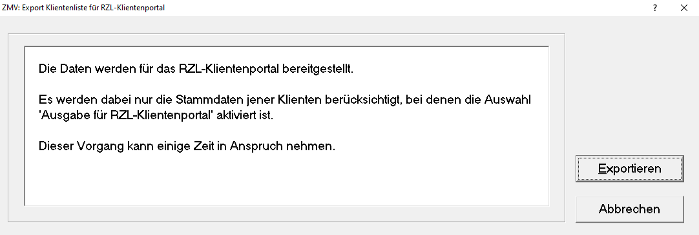{width="6.003937007874016in"
height="2.0236220472440944in"}

Es werden nur jene Klienten im RZL Klientenportal bereitgestellt, in
deren Stammdaten die Markierung *Ausgabe für RZL Klientenportal* gesetzt
ist.

### Klientenstammdaten am RZL Klientenportal

Im RZL Klientenportal können Sie im Programmteil *Stammdaten / Klienten
/ Klientenstammdaten* die im RZL Board bzw. in der ZMV angelegten und
freigegebenen Klienten übernehmen.

Abb. ‑ Verwaltung der Klientenstammdaten

{width="6.609300087489064in"
height="1.6929133858267718in"}

**1**

#### Klientenliste verwenden {#klientenliste-verwenden .Überschrift-4---VG}

Hier legen Sie fest, welche Klientenliste(n) angezeigt werden sollen.
Sie können mehrere Listen gleichzeitig auswählen. Die Klientenliste wird
durch Anwahl des Pfeilsymbols (**1**) aufgeschlagen.

Die Klienten können in drei unterschiedliche Listen aufscheinen.

Abb. ‑ Klientenstammdaten -- Anlegen von Klienten

{width="6.5078740157480315in"
height="2.893700787401575in"}

**4**

**3**

**2**

Klienten, die in der dritten Spalte (**2**) als *Portal*-Klienten
(**2**) bezeichnet sind, sind bereits im RZL Klientenportal angelegt.
Das bedeutet, dass es zumindest einen Klientenbenutzer mit bestimmten
Berechtigungen gibt.

Die Eigenschaft *Board* (**3**) im Bereich *Klientenliste verwenden*
zeigt jene Klienten, die für das RZL Klientenportal bereitgestellt
worden sind. Diese Kennzeichnung erfolgt wie vorher beschrieben im RZL
Board oder in der ZMV. Diese Klienten sind im RZL Klientenportal noch
nicht angelegt und können nach Auswahl aus der Liste angelegt und
gespeichert werden.

Für Klienten mit der Eigenschaft *Inaktiv* (**4**) sind im
Klientenportal (noch) Daten gespeichert. Der Klient ist allerdings nicht
(mehr) im Portal aktiv bzw. in Verwendung. Konkret bedeutet das, dass
die Kennzeichnung als Klientenportal-Klient in der ZMV oder im RZL Board
entfernt wurde.

Der Name des Klienten wird aus dem RZL Board bzw. der ZMV übernommen und
kann im RZL Klientenportal nicht geändert werden.

#### 2.2.4.1 Buchungsvorerfassung 

Abb. ‑ Verwaltung der Klientendaten Buchungsvorerfassung

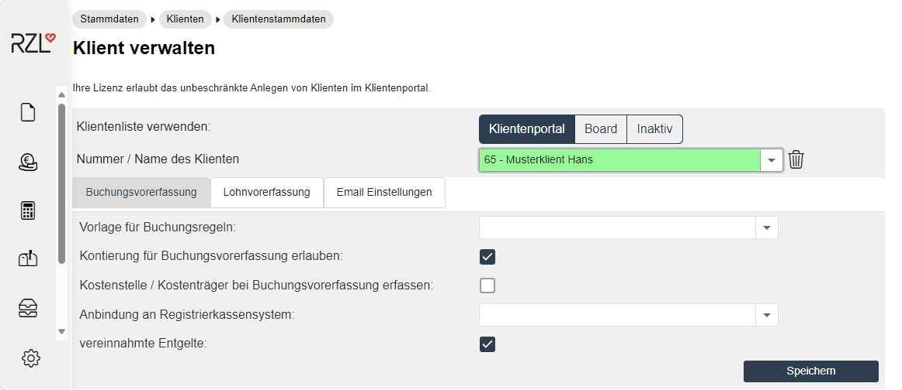{width="6.074803149606299in"
height="2.6338582677165356in"}

##### Vorlage für Buchungsregeln

Für die Buchungsvorerfassung können Buchungsregeln angelegt werden. Sie
können Buchungsregeln auch in einer allgemeinen Vorlage speichern, die
bei mehreren Klienten verankert werden kann. Die Zuordnung erfolgt in
den Klientenstammdaten durch Anwahl der benötigten Vorlage (Kapitel 5.5,
Seite [55](#anlage-von-buchungsregeln)).

##### Kontierung für Buchungsvorerfassung erlauben

Wenn Sie dieses Feld aktivieren, kann Ihr Klient im Rahmen der
Vorerfassung Kontonummern eintragen. Wird dieses Feld nicht aktiviert,
kann der Klient nur Ausgaben und Einnahmen erfassen und die
Vorkontierung kann nur mehr über Buchungstexte erfolgen (Kapitel 5.5,
Seite [55](#anlage-von-buchungsregeln)).

##### Kostenstelle/Kostenträger bei Buchungsvorerfassung erfassen

Wenn Sie diese Option aktivieren, kann der Klient bei der Vorerfassung
der Buchungszeilen auch Kostenstellen und Kostenträger miterfassen
(Kapitel 5.3, Seite [54](#vorerfassung-kostenstellen)).

##### Anbindung an Registrierkassensystem

Im Bereich *Anbindung an Registrierkassen* können Sie den Eintrag
*Kassandro* auswählen. Anschließend öffnet sich das Feld *Kassandro
API-Key*. Hier können Sie den im my.kassandro.at generierten API-Key
eintragen.

##### vereinnahmte Entgelte

Wenn der Klient nach vereinnahmten Entgelten (Ist-Versteuerung) gebucht
wird, ist dieses Feld zu aktivieren. Diese Einstellung wird -- wenn
zutreffend -- für die Buchungsvorerfassung benötigt.

#### 2.2.4.2 Lohnvorerfassung

Abb. ‑8 Verwaltung der Klientendaten Lohnvorerfassung

{width="6.1846686351706035in" height="4.0in"}

##### Darstellung der Basis bei freien Lohnarten

Für die Erfassung der freien Lohnarten kann hier festgelegt werden, ob
die Basis der freien Lohnarten nur angezeigt, eingeblendet oder
ausgeblendet werden soll. Wird die Basis eingeblendet, kann sie während
der Eingabe geändert werden.

##### Spalte Betrag bei freien Lohnarten nach Einheiten einblenden

Sie können hier für die Lohnvorerfassungen festlegen, ob bei freien
Lohnarten nach Einheiten die Betragsspalte (Summenspalte) eingeblendet
wird.

##### Betrag bei Abrechnung nach Stunden/Schlechtwetter einblenden

Sie können hier für die Lohnvorerfassungen festlegen, ob bei der
Abrechnung nach Stunden bzw. bei der Abrechnung von Schlechtwetter die
Betragsspalte (Summenspalte) eingeblendet werden soll.

##### Wert der Basis bei freien Lohnarten vorschlagen, wenn diese Lohnart schon einmal zugewiesen wurde

Bei der Erfassung von Lohnarten nach Einheiten wird die bereits einmal
erfasste Basis bei der nächsten Erfassung vorgeschlagen, wenn Sie dieses
Feld aktivieren.

Abb. ‑ Vorschlag des Wertes der Basis

{width="6.65748031496063in"
height="1.4173228346456692in"}

##### Daten für Lohnvorerfassung übertragen

Wenn Sie dieses Feld deaktivieren, werden keine Daten aus der
Lohnverrechnung des Klienten auf das Klienten-Portal hochgeladen.

Dieses Feld sollte nur dann deaktiviert werden, wenn Sie lediglich die
Abrechnungen der Dienstnehmer ins Klienten-Portal hochladen wollen
(Kapitel 6, Seite [62](#dienstnehmerbereich)).

##### Korrektur der letzten Abrechnung erlauben

Hier legen Sie fest, ob für einzelne Dienstnehmer pro Monat mehr als
einmal Daten an die Lohnverrechnung freigegeben werden können.

##### Behandlung mehrerer Mindestangaben-Anmeldungen pro Monat für fallweise Beschäftigte

Die Mindestangaben-Anmeldungen eines Monats für fallweise Beschäftigten
können innerhalb einer Abrechnung eines Monat gespeichert werden. Wenn
innerhalb eines Monats beispielsweise drei Tage gemeldet werden, sind in
diesem Monat die drei Tage innerhalb nur einer Abrechnung gespeichert.
Diese Variante wird von RZL empfohlen.

Wahlweise könnten Sie auch pro Mindestangaben-Anmeldung eine Abrechnung
speichern. Für drei Mindestangaben-Anmeldungen sind das drei
Abrechnungen in einem Monat.

##### Daten der ÖGK-Meldungen an die WT-Kanzlei als Eintritte weiterleiten

Für die Weiterleitung der Daten der Versichertenmeldung/Meldung
fallweise Beschäftigte an die ÖGK an den Wirtschaftstreuhänder stehen
folgende Optionen zur Verfügung:

*Erfassung zusätzlicher Stammdaten händisch anwählen*

Nach der Erfassung und Übermittlung der Anmeldung hat der Klient die
Möglichkeit unter *Lohnverrechnung / Vorerfassung / Eintritte* weitere
Stammdaten des Dienstnehmers zu erfassen und freizugeben. Der
Programmteil muss händisch angewählt werden.

*Automatische Erfassung zusätzlicher Stammdaten*

Wird diese Option gewählt, öffnet sich direkt nach der Übermittlung der
Anmeldung eines Dienstnehmers die Oberfläche mit den weiteren Stammdaten
und der Klient erfasst die benötigten Angaben und gibt diese an den
Wirtschaftstreuhänder frei.

*Nur Anmeldedaten werden an den Wirtschaftstreuhänder übermittelt*

Bei dieser Option werden vom Klienten die benötigten Angaben für die
Anmeldung erfasst und an die ÖGK und den Wirtschaftstreuhänder
übermittelt. Die Übermittlung von zusätzlichen Daten ist nicht möglich.

**TIPP**

Beim Menüpunkt steht Ihnen die Kurzanleitung mit weiteren Informationen
zu den verschiedenen Optionen und der jeweiligen Darstellung beim
Klienten zur Verfügung. Diese kann über das Informations-Icon, rechts
neben dem Text der Option, aufgerufen werden.

##### Dienstnehmerliste ausblenden

Wenn Sie diese Einstellung treffen, so können die Benutzer des
ausgewählten Klienten im Bereich *Lohnverrechnung / Übersicht* die
Dienstnehmerliste nicht öffnen.

##### Eigene Übertragungseinstellungen für Mindestangaben-Anmeldungen / Versichertenmeldung reduziert

Aktivieren Sie dieses Feld, damit der Klient die Übertragung der
Meldungen an ELDA mit seiner eigenen ELDA-Lizensierung durchführen kann.
Die Absender-Stammdaten werden vom Programm ausgefüllt. Sie müssen
anschließend die Verarbeitungsnummer der GKK (DVR-Nummer), die ELDA
Seriennummer und das ELDA Passwort (Kundenpasswort) für die
ELDA-Übertragung eintragen.

Wenn Sie dieses Feld nicht aktivieren, wird die Übertragung mit der
ELDA-Lizenz des Wirtschaftstreuhänders durchgeführt (Kapitel 2.1, Seite
[9](#stammdaten-der-kanzlei)).

#### 2.2.4.3 Email Einstellungen

##### Klienten E-Mail 

Hier kann die E-Mail- Adresse des Klienten eingetragen werden. Werden
Dokumente hochgeladen, erhält der Klient an diese E-Mail- Adresse eine
Information. Es wird jedoch empfohlen, die E-Mail- Adresse direkt beim
Benutzer zu hinterlegen, da in diesem Fall die Zusendung der E-Mails auf
die zugeordneten Berechtigungen beim Benutzer eingeschränkt werden kann.

##### Kanzlei-Sachbearbeiter E-Mail

Hier können Sie die E-Mail- Adresse des Kanzlei-Sachbearbeiters
eintragen, der für diesen Klienten zuständig ist. Werden aus dem
Klientenbereich Daten gesendet bzw. Dokumente hochgeladen, werden an
diese Mail-Adresse Benachrichtigungen versendet.

Eine Eintragung ist auch hier nicht unbedingt notwendig, da die E-Mail-
Adresse auch beim WT-Mitarbeiter (Benutzer) eingetragen werden kann. Der
WT-Benutzer erhält E-Mails nur aufgrund der in den eigenen Stammdaten
aktivierten Berechtigungen.

Tipp

Sie können in den E-Mail Feldern auch mehrere E-Mail-Adressen --
getrennt durch einen Beistrich - eintragen.

### Benutzerdaten und Berechtigungen 

#### Benutzerdaten {#benutzerdaten .Überschrift-4---VG}

Abb. ‑ Klientenstammdaten -- Benutzerdaten

{width="6.440298556430446in"
height="2.20792760279965in"}

In diesem Bereich vergeben Sie die Berechtigungen für einen oder mehrere
Benutzer des ausgewählten Klienten. Zuerst bezeichnen Sie den Benutzer
im Feld Benutzername. Anschließend vergeben Sie das Passwort für den
Einstieg des Benutzers ins RZL Klientenportal. Ist das Feld *Benutzer
muss Passwort ändern* aktiviert, muss der Benutzer beim erstmaligen
Einstieg in das RZL Klientenportal das Passwort zwingend abändern. Wird
das Feld nicht aktiviert, bleibt das hier eingetragene Passwort
bestehen.

Die E-Mail- Adresse kann benutzerbezogen eingetragen werden. Auf diese
E-Mail- Adresse werden Nachrichten gesendet, wenn im Kanzleibereich
Dokumente für den Klienten hochgeladen werden. Der Benutzer erhält nur
dann ein E-Mail, wenn die Berechtigung *E-Mail Benachrichtigung
aktivieren* in den Stammdaten unter *Stammdaten / Portal / E-Mail
Einstellungen* aktiviert ist (Kapitel 2.4.2, Seite
[23](#e-mail-einstellungen)).

Wenn Sie bei einem Benutzer das Feld *Inaktiv* aktivieren, kann der
Benutzer nicht mehr in das RZL Klientenportal einsteigen und ist somit
gesperrt.

#### Stammdaten {#stammdaten .Überschrift-4---VG}

*Benutzerverwaltung*

Wird bei der Anlage des Benutzers dieses Feld aktiviert, kann dieser
Benutzer im Klientenbereich selbst Benutzer anlegen, Benutzer löschen,
Passwörter ändern und Berechtigungen vergeben.

*Dienstnehmerverwaltung*

Sie können die Klientenportal Dienstnehmer-Stammdaten im Kanzleibereich
des Portals im Programmteil *Stammdaten / Klienten / Dienstnehmer*
bearbeiten bzw. löschen (Kapitel 6.2, Seite
[63](#stammdaten-dienstnehmer-im-rzl-klientenportal)). Wenn Sie das Feld
*Dienstnehmerverwaltung* aktivieren, kann der Klientenbenutzer die
Klientenportal Dienstnehmer-Stammdaten ebenfalls bearbeiten.

Wenn Sie die Info-Schaltfläche rechts neben der ausgewählten Option
drücken, erhalten Sie eine detaillierte Beschreibung der Möglichkeiten
innerhalb der Dienstnehmerverwaltung.

#### Benutzer löschen {#benutzer-löschen .Überschrift-4---VG}

Abb. ‑ Benutzer löschen

{width="6.529850174978128in"
height="1.6897145669291338in"}

Wenn bei einem Klienten mehr als ein Benutzer angelegt ist, kann ein
Benutzer durch Anwahl des Papierkorbs gelöscht werden. Existiert nur ein
Benutzer kann dieser *Inaktiv* geschaltet werden oder der Klient
vollständig aus dem RZL Klientenportal herausgelöscht werden.

#### Berechtigungen  {#berechtigungen .Überschrift-4---VG}

Im unteren Bereich legen Sie die Berechtigungen des jeweiligen Benutzers
fest.

Abb. ‑ Benutzer - Berechtigungen

{width="5.380597112860892in"
height="3.1653565179352583in"}

#### Dokumente {#dokumente .Überschrift-4---VG}

Die Felder im Bereich *Dokumentbereiche* werden verwendet, damit der
Benutzer Dokumente für unterschiedliche Bereiche hochladen kann. Der
Benutzer im Klientenbereich kann auch nur Dokumente einsehen, die mit
einer Berechtigung versendet worden sind, über die er verfügt.

Wenn zB. ein Kanzleimitarbeiter ein Dokument mit der Berechtigung
*Bilanz* bereitgestellt hat und beim Benutzer im Klientenbereich diese
Berechtigung nicht aktiviert ist, kann der Benutzer im Klientenbereich
das Dokument nicht sehen. Aus dem Kanzleibereich können keine Dokumente
an Klienten übermittelt werden, die beim Klienten kein Benutzer einsehen
kann.

#### Lohnverrechnung {#lohnverrechnung .Überschrift-4---VG}

*Mindestangaben Anmeldung / Versichertenmeldung reduziert*

Durch Anwahl der Option hat der Benutzer des Klientenbereichs die
Möglichkeit, die ÖGK-Meldungen über ELDA zu übermitteln.

*Lohn Vorerfassung*

Die Berechtigung Lohn Vorerfassung ermöglicht Dienstnehmerdaten zu
erfassen und in den Kanzleibereich zu laden (Kapitel 4, Seite
[43](#lohnverrechnung-2)).

Sie können hier für die Lohn Vorerfassung festlegen, welche Eingabemaske
für den Benutzer zur Verfügung gestellt wird. Sie können diese
Eingabemasken bearbeiten bzw. auch neue Masken definieren (Kapitel 4.2,
Seite [43](#eingabemasken-für-klienten-konfigurieren)).

*Lohn Vorerfassung in Tabellenform*

Die Berechtigung *Lohn Vorerfassung in Tabellenform* ermöglicht die
Erfassung von bestimmten Lohnarten (Fixe und freie Lohnarten, Über- und
Mehrstunden, Abzüge, Lohnsteuertage) in Tabellenform. Die Dienstnehmer
werden in den Zeilen dargestellt. Für diese Form der Erfassung müssen
eigene Eingabemasken je Klient eingerichtet werden (Kap. 4.2.2, Seite
[46](#eingabemasken-für-die-tabellenerfassung-laufende-änderungen)).

#### Finanzbuchhaltung {#finanzbuchhaltung .Überschrift-4---VG}

*FIBU Auswertungen*

Aus der RZL FIBU bzw. EA-Rechnung können Auswertungen (Saldenliste,
Konten, Journal) zur Verfügung gestellt werden. Durch Aktivierung dieser
Berechtigung kann der Benutzer auf diese Auswertungen zugreifen.

*FIBU Vorerfassung*

Wenn Sie dieses Feld aktivieren, können im Klientenbereich des RZL
Klientenportals die Bewegungen der Kassa/Bankbücher vorerfasst werden.
Diese Einnahmen-Ausgaben werden vom Benutzer erfasst und freigegeben.
Anschließend kann eine Übernahme in die Finanzbuchhaltung oder
EA-Rechnung erfolgen).

#### Belegbox {#belegbox .Überschrift-4---VG}

*Hochgeladene Belege*

Dieses Feld ermöglicht das Hochladen von Belegen (Rechnungen) im
Klientenbereich des Portals. Diese Belege können nach Freigabe im RZL
Board in der Finanzbuchhaltung bzw. EA-Rechnung mit den Buchungssätzen
verknüpft werden. Zusätzlich steht im Klientenbereich des Portals der
Belegscanmanager zum Download bereit. Mit Hilfe dieses Managers kann der
Klient Belege einscannen, bearbeiten und hochladen.

*Verbuchte Belege / Belegsynchronisation*

Durch diese Einstellung hat der Benutzer die Berechtigung, auf die
verbuchten Belege zuzugreifen. Diese Berechtigung ist auch notwendig,
wenn die Buchhaltung/EA-Rechnung inklusive Belege mit der
Steuerberatungskanzlei synchronisiert werden soll.

#### Datenaustausch {#datenaustausch .Überschrift-4---VG}

Die Option *Klientensicherungen austauschen* ist für den Datenaustausch
von FIBU/EA-Dateien zwischen Klienten und Kanzlei notwendig.

#### Ein Benutzer für mehrere Klienten {#ein-benutzer-für-mehrere-klienten .Überschrift-4---VG}

Sie haben die Möglichkeit einen Benutzer anzulegen, der mit dem gleichen
Login mehrere Klienten bearbeiten kann. Zunächst muss der Benutzer --
wie oberhalb beschrieben -- mit Name, Passwort und Berechtigungen bei
einem Klienten angelegt werden.

Damit dieser Benutzer auch bei anderen Klienten mit denselben
Login-Daten einsteigen kann (gleichzeitige Anzeige der Klienten im
Klientenbereich des Portals), muss der Benutzer beim nächsten Klienten
mit der **Nummer** des ersten Klienten und dem ursprünglichen
**Benutzernamen** eingetragen werden.

Abb. ‑ Ein Benutzer für mehrere Klienten

{width="6.58955271216098in"
height="2.09300634295713in"}

{width="6.597015529308837in"
height="1.8706102362204724in"}

Im Beispiel oben wird beim Klienten mit der Nummer 86, der bereits beim
Klienten mit der Nummer 50 gespeicherte Benutzer eingetragen. Wenn der
Benutzer 50.muster mit seinem Passwort in den Klientenbereich des
Portals einsteigt, kann er alle Klienten anwählen und bearbeiten, bei
denen sein Benutzer eingetragen ist. Es ist ausreichend den Benutzername
einzutragen, das Passwort und die E-Mail Adresse werden automatisch
ergänzt.

Abb. ‑ Anwahl mehrerer Klienten durch einen Benutzer

{width="6.596281714785651in"
height="0.9798611111111111in"}

### Klienten aus dem RZL Klientenportal löschen

Wenn Sie Klienten aus dem RZL Klientenportal löschen wollen, tragen Sie
zunächst die Klientennummer ein und wählen anschließend das
Papierkorb-Symbol neben dem Feld *Klientennummer* an.

Abb. ‑ Klienten aus dem Portal löschen

{width="6.066929133858268in"
height="1.4409448818897639in"}

Nach Anwahl des Papierkorb-Symbols erhalten Sie noch folgende Abfrage
vom Programm:

Abb. ‑ Klienten löschen

{width="3.937007874015748in"
height="1.7024890638670167in"}

Wenn Sie die Schaltfläche OK anwählen, wird der Klient im RZL
Klientenportal gelöscht. Im Board, KIS und im Rest der RZL-Programme
bleiben die Daten natürlich erhalten.

## Stammdaten der Kanzleibenutzer

Im Programmteil *Stammdaten / Kanzlei / Benutzer* werden Kanzleibenutzer
angelegt und verwaltet.

Abb. ‑ Kanzleibenutzer anlegen und verwalten

{width="6.165354330708661in"
height="5.937007874015748in"}

#### Mitarbeiterdaten {#mitarbeiterdaten .Überschrift-4---VG}

Für die Anlage eines Kanzleibenutzers im RZL Klientenportal sind
zwingend Benutzername und Passwort zu vergeben.

Im Feld *E-Mail* sollte die E-Mail Adresse des Kanzleimitarbeiters
eingetragen werden. Eine Benachrichtigung an diese E-Mail Adresse
erfolgt beim Absenden von Daten bzw. Bereitstellen von Dokumenten aus
dem\
Klientenbereich des Portals. Der Kanzleimitarbeiter erhält nur E-Mails
bezüglich Klienten - die mit den entsprechenden Berechtigungen -
zugeordnet sind.

#### Dokumentbereiche {#dokumentbereiche .Überschrift-4---VG}

Die Dokumentbereiche werden für die Bereitstellung von Dokumenten
benötigt. Der Kanzleimitarbeiter erhält eine E-Mail-Benachrichtigung,
wenn die -- beim Versenden - vom Klienten ausgewählte Berechtigung, beim
Kanzleimitarbeiter aktiviert ist.

#### Stammdaten {#stammdaten-1 .Überschrift-4---VG}

*WT-Mitarbeiter verwalten*

Wird bei einem Kanzleimitarbeiter die Option *Keine* gesetzt, ist für
diesen Benutzer der Programmteil *Stammdaten / Kanzlei / Benutzer*
ausgeblendet. Mit der Option *Nur sich selbst* kann der Mitarbeiter die
eigenen Einstellungen und Zuweisungen bearbeiten. Die Option *Alle*
ermöglich die Anlage und Bearbeitung von Kanzleibenutzern ohne
Einschränkungen.

*Klienten verwalten*

Dieses Feld ermöglicht dem Kanzleimitarbeiter die Stammdaten der
Klienten und Dienstnehmer zu bearbeiten.

#### Lohnverrechnung {#lohnverrechnung-1 .Überschrift-4---VG}

Wurden im Klientenbereich Erfassungen für die Lohnverrechnung oder GKK
Meldungen gemacht, erhält der Kanzleimitarbeiter eine
E-Mail-Benachrichtigung und kann die Daten in das
Lohnverrechnungsprogramm übernehmen.

Die Berechtigung *Lohnvorerfassung in Tabellenform* ermöglicht die
Anlage bzw. Bearbeitung der Eingabemaske für die Tabellenerfassung.

#### Finanzbuchhaltung {#finanzbuchhaltung-1 .Überschrift-4---VG}

*FIBU Auswertungen*

Sie können Ihren Klienten aus der RZL FIBU bzw. EA-Rechnung Auswertungen
zur Verfügung stellen. Durch diese Einstellung erhält der
Kanzleibenutzer die Berechtigung, die Auswertungen für die zugeordneten
Klienten hochzuladen.

*FIBU Vorerfassung*

Werden im Klientenbereich FIBU bzw. EA-Vorerfassungen freigegeben, dann
erhält der Kanzleimitarbeiter eine E-Mail, wenn dieses Feld aktiviert
und der Klient zugeordnet ist. Weiters kann ein Kanzleimitarbeiter mit
dieser Berechtigung Kassa- und Bankbücher, Buchungsregeln, Vorlagen für
Buchungsregeln anlegen und die Vorerfassungen aufrufen.

#### Belegbox {#belegbox-1 .Überschrift-4---VG}

*Hochgeladene Belege*

Im Klientenbereich des Portals können die Benutzer Belege einscannen
und/oder hochladen. Diese Belege können im RZL-Board abgeholt werden.
Wenn bei einem Kanzleimitarbeiter dieses Feld nicht aktiviert ist, kann
dieser Mitarbeiter keine Belege vom Klientenportal herunterladen.

*Verbuchte Belege / Belegsynchronisation*

Durch diese Einstellung hat der Benutzer die Berechtigung, auf die
verbuchten (automatische synchronisierten) Belege zuzugreifen.

#### Klientensicherungen austauschen {#klientensicherungen-austauschen .Überschrift-4---VG}

Die Berechtigung ermöglicht die Datenaustausch der FIBU bzw. EA-Daten
über das RZL-Klientenportal.

#### Mehrfachzuweisung {#mehrfachzuweisung .Überschrift-4---VG}

In der Übersicht können im linken Feld die gewünschten Klienten und im
Feld *Berechtigungen wählen* die benötigte Dokumentbereiche und
Berechtigungen zugeordnet werden. Mit den Schaltflächen *Hinzufügen* und
*Entfernen* werden die ausgewählten Klienten und Berechtigungen in den
darunter angeführten Dokumentbereichen und Berechtigungen angefügt bzw.
gelöscht.

## Stammdaten des Portals

### E-Mail Texte

Im Programmteil *Stammdaten / Portal / E-Mail Texte* können Sie die
Texte der automatisch generierten E-Mails bearbeiten und formatieren. Es
können auch Bilder eingefügt werden.

Abb. ‑ E-Mail-Textbausteine

{width="6.480314960629921in"
height="5.2047244094488185in"}

**5**

**4**

**1**

**3**

**2**

Die Texte werden je nach Thema (**1**) in unterschiedlichen
Registerblättern dargestellt. Ein E-Mail-Text enthält den Betreff
(**2**) und den Textkörper (**3**) bearbeiten wollen. Nach Anwahl der
gewünschten Schaltfläche können Sie die Texte bearbeiten, formatieren,
Bilder einfügen und vieles mehr.

Die Schaltfläche *RZL Vorgabe* (**4**) holt den Original RZL Text
zurück. Die Anzahl der Platzhalter wird links unten (**5**) angezeigt
und kann nicht bearbeitet werden. Die Platzhalter werden durch
eingeklammerte Nummern dargestellt. Sie können Platzhalter {KNA} für den
Klientennamen und {KNR} für die Klientennummer vergeben.

### E-Mail Einstellungen

Im Programmteil *Stammdaten / Portal /E-Mail Einstellungen* können Sie
allgemeine Einstellungen zu den E-Mail Benachrichtigungen treffen.

Abb. ‑ Einstellungen für E-Mail Benachrichtigungen

{width="6.578740157480315in"
height="2.393700787401575in"}

**1**

#### Allgemeine Absenderadresse {#allgemeine-absenderadresse .Überschrift-4---VG}

Die hier eingetragene Absenderadresse wird bei einer E-Mail
Benachrichtigung als Absenderadresse herangezogen.

#### Absendername {#absendername .Überschrift-4---VG}

Der Name der Kanzlei wird im Mailprogramm als Absender angezeigt. Damit
für den Klienten einfach ersichtlich ist, von wem das E-Mail kommt,
sollte dieses Feld unbedingt ausgefüllt werden.

#### Allgemeine Antwortadresse {#allgemeine-antwortadresse .Überschrift-4---VG}

Wenn auf eine E-Mail Benachrichtigung geantwortet wird, so wird --
sofern keine E-Mail Adresse beim Kanzleimitarbeiter bzw. Klienten
Benutzer hinterlegt ist -- diese Adresse vorgeschlagen. Durch die
allgemeine Antwortadresse sollen jene Fälle abgedeckt werden, für die
keine E-Mail Adresse für die Antwort aus den Stammdaten gefunden wurde.

#### E-Mail Benachrichtigung aktivieren {#e-mail-benachrichtigung-aktivieren .Überschrift-4---VG}

Durch diese Auswahl können Sie die E-Mail Benachrichtigungen aktivieren.
Nur wenn diese Option (*E-Mail Benachrichtigungen aktivieren* (**1**))
aktiviert ist, werden E-Mails an die in der Verwaltung eingetragenen
E-Mail Adressen versendet.

### Passwort Einstellungen

Am RZL Klientenportal können Sie selbst die Sicherheitsstufe für die zu
vergebenden Passwörter am RZL Klientenportal definieren. Die
Einstellungen dazu finden Sie unter *Stammdaten / Portal / Passwort
Einstellungen.* Wählen Sie hier Stufe 3, können Sie selbst festlegen,
wie viele Zeichen Ihr Passwort haben soll und welche Eigenschaften die
Passwörter aufweisen sollen. Im Gegensatz dazu, wird Ihnen dies bei
Stufe 2 vorgegeben.

Abb. ‑ Passwort Einstellungen

{width="6.417322834645669in"
height="4.838582677165355in"}

**1**

### Farben

Am RZL Klientenportal können Sie die Farben der Menüpunkte, des
Hintergrundes usw. ändern. Diese Möglichkeiten finden Sie im
Programmteil *Stammdaten / Portal / Farben*.

Abb. ‑ Passwort Einstellungen

{width="6.381889763779528in"
height="2.4173228346456694in"}

**2**

**1**

Das Farbschema *Standard* (**1**) ist das voreingestellte Farbschema.
Sie können dieses Farbschema weder löschen noch bearbeiten. Wenn Sie ein
neues Schema anlegen wollen, vergeben Sie im Feld *Name* (**2**) eine
Bezeichnung und wählen die Schaltfläche *Erstellen* an.

Abb. ‑ Neues Farbschema erstellen II

{width="6.503937007874016in"
height="2.5236220472440944in"}

**3**

**4**

Nach Anwahl des Eintrags *Editieren* (**3**) können Sie das neue
Farbschema bearbeiten. Das neu angelegte Farbschema können Sie durch
Anwahl des Icons *auswählen* (**4**) aktivieren.

Abb. ‑ Bearbeiten der Farben

{width="6.169291338582677in"
height="1.6338582677165354in"}

Für den jeweiligen Bereich des RZL Klientenportals werden die Farbe, der
Farbcode und die Darstellung angezeigt. Die gewünschte Farbe kann aus
der Liste -- durch einen Klick auf das Pfeil-Symbol -- ausgewählt
werden. Durch Anklicken der Schaltfläche *Speichern* -- ganz unten im
Dialog -- werden die vorgenommenen Änderungen gespeichert.

### Logo

Im Programmteil *Stammdaten / Portal / Logo* können Sie ein
individuelles Logo für das RZL Klientenportal hochladen.

Abb. ‑ Logo hochladen

{width="6.255905511811024in"
height="2.645669291338583in"}

Nach Anwahl der Schaltfläche *Datei auswählen* öffnet sich ein Dialog
zur Auswahl einer Bilddatei auf ihrem Computer. Hier ist das gewünschte
Logo auszuwählen.

Das Logo sollte maximal 500 Pixel breit und 500 Pixel hoch sowie 1024kB
groß sein. Durch Anwahl der Schaltfläche *Hochladen* wird das Logo im
Klientenportal hochgeladen. Die Schaltfläche *Zurücksetzen* entfernt das
neu hinterlegte Logo wieder.

### Sonstige Einstellungen

#### Externe Login-Seite definieren {#externe-login-seite-definieren .Überschrift-4---VG}

Über das Menü *Stammdaten / Portal / Sonstige Einstellungen* können Sie
eine Externe Login-Seite definieren.

Abb. ‑ Externe Login Seite

{width="6.488188976377953in"
height="2.405511811023622in"}

Wenn Sie auf Ihrer Kanzlei-Homepage ein Login zum RZL Klientenportal
eingerichtet haben, können Sie hier durch Eintragung der Adresse Ihrer
Homepage bewirken, dass der Klient nach dem Ausstieg aus dem RZL
Klientenportal zurück auf Ihre Login-Seite fällt (Kapitel 1.3, Seite
[8](#login-formular-auf-ihre-kanzlei-homepage)).

Hinweis

Bitte stellen Sie zuvor sicher, dass das Login-Formular auf Ihrer
Kanzlei-Homepage korrekt funktioniert, da beim Aufruf der Klientenportal
URL -- welchen Sie von uns erhalten haben -- nicht mehr das
Login-Formular des Klientenportals angezeigt wird, sondern Ihre hier
eingetragene Adresse.

#### Service-Account Passwort {#service-account-passwort .Überschrift-4---VG}

Hier ist das Service-Account Passwort für die Belegsynchronisation
einzutragen.

Tipp

Eine genaue Beschreibung der Belegsynchronisation finden Sie im Board im
Programmteil *Hilfe / Kurzanleitungen* im Bereich *RZL
Belegverarbeitung*.

## Mein Profil

Abb. ‑ Mein Profil

{width="6.4727274715660545in"
height="3.6222222222222222in"}

**2**

**3**

**1**

Sie können innerhalb des eigenen Profils im Bereich *Allgemeine
Einstellungen* zwischen 4 verschiedenen Darstellungen des Menüs (**1**)
auswählen. Der Menü Modus *Standard* zeigt links zunächst nur die
Symbole für die einzelnen Programmteile an. Wenn Sie mit der Maus auf
die Leiste fahren, werden die Symbole und der Text der einzelnen
Programmteile angezeigt. Der Menü Modus *Fixiert groß* blendet die
Symbole und den Text dauerhaft ein. *Fixiert klein* zeigt auf der ersten
Ebene nur mehr die Symbole ohne Text für die Programmteile, *Fixiert
Klein mit Text* zeigt die Symbole mit dem Text der Programmteile in
kleiner Schrift unterhalb des Symbols.

Im Bereich *Passwort ändern* können Sie ihr aktuelles Passwort abändern.
Mit dem Button Sicherheitseinstellung kommen Sie in die Einstellungen
für das Passwort. Weitere Informationen finden Sie unter 2.4.3 Passwort
Einstellungen.

Die E-Mail Adresse, die bei Ihrem Kanzlei-Benutzer hinterlegt ist,
können Sie im Bereich *Meine E-Mail Adresse* (**3**) ändern.

# Informationsaustausch

Das RZL Basismodul inkludiert einen sicheren und schnellen Austausch von
Dokumenten und Nachrichten zwischen Wirtschaftstreuhänder, Klienten und
Dienstnehmern.

## Allgemeine Listenfunktionen

Am Beginn dieses Kapitels 3 *Informationsaustausch* werden die
allgemeinen Listenfunktionen anhand des Programmteils
*Informationsaustausch / Dokumentenlisten / An Klienten übermittelte
Dokumente* erläutert. Diese Funktionen finden sich auch in den Listen
des Programmteils *Belegbox*.

{width="6.515748031496063in"
height="4.311023622047244in"}

**4**

**5**

**6**

**3**

**2**

**1**

**8**

**7**

1.  Durch Anwahl der Spaltenbezeichnung wird die Liste auf- oder
    absteigend sortiert.

2.  Das kleine Symbol neben der Spaltenbezeichnung zeigt an, dass die
    Liste nach dieser Eigenschaft sortiert ist (hier die Spalte
    *Bereitgestellt*).

3.  In den Textfeldern können Suchbegriffe eintragen werden. Die Liste
    wird nach dem eingetragenen Suchbegriff gefiltert.

4.  Nach Anwahl des kleinen Filtersymbols können Sie im oberen Bereich
    ebenfalls durch Texteingabe - filtern. Zusätzlich werden die in der
    Spalte verwendeten Eigenschaften angezeigt, nach denen Sie - durch
    Setzen von Hackerln und Anwahl der Schaltfläche *Anwenden* - filtern
    können.

{width="1.6653543307086613in"
height="2.2283464566929134in"}

5.  Eine Gruppierung nach Spalten ist möglich, indem Sie mit der Maus
    die gewünschte Spalte in den Bereich links oben ziehen.

6.  Nach Anwahl der Schaltfläche *Tabelleneinstellungen* können zwischen
    nachfolgenden Einträgen auswählen.

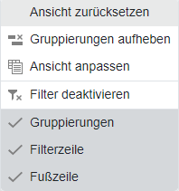{width="1.4448818897637796in"
height="1.5393700787401574in"}

> *Ansicht zurücksetzen* macht Änderungen innerhalb der Tabelle
> rückgängig. *Gruppierungen aufheben* beseitigt bestehende
> Gruppierungen. Nach Anwahl des Eintrags *Ansicht anpassen* können Sie
> Spalten aus- und einblenden. Bestehende Filter werden nach Anwahl des
> Eintrags *Filter deaktivieren* entfernt. Im unteren Bereich können Sie
> den Bereich *Gruppierungen*, die *Filter*- und die *Fußzeile* aus- und
> einblenden.

7.  Im rechten unteren Bereich legen Sie fest, wie viele Einträge pro
    Seite angezeigt werden sollen.

8.  Im linken Bereich sehen die Anzahl der Seiten und die Anzahl der
    Elemente. Mit Direktanwahl mit der Maus können Sie zwischen den
    Seiten navigieren.

## Dokumente bereitstellen

Innerhalb des Kanzleibereichs des RZL Klientenportals können Sie
Dokumente für die Klienten oder die Dienstnehmer Ihrer Klienten über
eine gesicherte Verbindung bereitstellen. Diese Funktion ist auch über
das RZL KIS bzw. im RZL PDF-Drucker/PDF-Manager Premium aufrufbar.

### Dokumente für einzelne Klienten bereitstellen

Der Programmteil *Informationsaustausch / Dokumente an einen Klienten
übermitteln* ermöglicht Ihnen das Hochladen von Dokumenten für einzelne
im RZL Klientenportal angelegte Klienten.

Abb. ‑ Dokumente für einzelnen Klienten bereitstellen

{width="5.25984251968504in"
height="1.1299212598425197in"}

Klicken Sie nach Anwahl des gewünschten Klienten und Auswahl des
Dokumentbereichs auf die Schaltfläche *Dateien auswählen*.

Abb. ‑ Datei auswählen

{width="4.643478783902013in"
height="1.9430522747156604in"}

Im Dialogfenster können Sie ein bestimmtes Dokument suchen und
auswählen. Durch einen Doppelklick auf das Dokument oder nach Anwahl der
Schaltfläche *Öffnen* wechselt das Programm in den Ausgangsbildschirm
zurück und die angewählten Dokumente werden ins Klientenportal
hochgeladen.

Tipp

Sie können auch mehrere Dokumente gleichzeitig übermittteln. Halten Sie
hierfür die STRG-Taste gedrückt und wählen Sie die gewünschten Dokumente
aus.

Abb. ‑ Anzeige des hochgeladenen Dokuments

{width="6.12924978127734in"
height="2.6968503937007875in"}

> Im unteren Bereich des Programmteils sehen Sie die Dokumente, die
> bereits hochgeladen wurden. Angezeigt werden der jeweilige
> Dokumentbereich und wann das Dokument bereitgestellt und gelesen
> wurde.

### Informationen an alle Klienten übermitteln

Unter *Informationsaustausch / Informationen an alle Klienten
übermitteln* können Sie Informationen (Dokumente) allen im
Klientenportal angelegten Klienten zur Verfügung stellen.

Abb. ‑ Informationen für alle Klienten bereitstellen

{width="6.15748031496063in"
height="2.078740157480315in"}

Die Arbeitsschritte sind ident mit der Versendung einzelner Dokumentes
an einen Klienten (Kapitel 3.2.1, Seite
[30](#dokumente-für-einzelne-klienten-bereitstellen)).

### Dokumente an einen Dienstnehmer übermitteln 

Die notwendigen Schritte zur Anlage der Dienstnehmer für das
Bereitstellen der Daten werden im Kapitel 6, Seite
[62](#dienstnehmerbereich) beschrieben.

Zur Übermittlung von Dokumenten wählen Sie den Menüpunkt
*Informationsaustausch / Dokumente an einen Dienstnehmer übermitteln*
aus.

Abb. ‑ Dokumente für einen Dienstnehmer bereitstellen

{width="6.05511811023622in"
height="1.6456692913385826in"}

Hier können Sie nach Anwahl des Klienten aus den im RZL Klientenportal
angelegten Dienstnehmern auswählen. Nach Anwahl der Schaltfläche
*Dateien auswählen* markieren Sie das gewünschte Dokument aus und
klicken anschließend auf die Schaltfläche *Öffnen.*

Anschließend wird dem Dienstnehmer das Dokument im Klientenportal zur
Verfügung gestellt. Bereitgestellte Dokumente werden im unteren Bereich
des Bildschirms angezeigt.

### Dokumentenübermittlung aus dem RZL KIS

Im KIS gespeicherte Dokument können im Header oder in der
Dokumentenliste mit der rechten Maustaste und den Optionen *Zum
Klientenportal hochladen* oder *Zum Klientenportal mit Nachricht
hochladen* sofort dem Klienten zur Verfügung gestellt werden. Abb. ‑
Dokumente aus dem RZL KIS übermitteln

{width="6.330708661417323in"
height="1.2598425196850394in"}

### Dokumentenübermittlung aus dem RZL PDF-Manager Premium

Ein im RZL PDF-Manager-Premium erstelltes Dokument kann in der
Dokumentenansicht über die Schaltfläche *Klientenportal* dem Klienten
zur Verfügung gestellt werden. Gleichzeitig ist die Ablage im RZL KIS
(Postausgang) und die Übermittlung einer Nachricht möglich.

Abb. ‑ Dokumente aus dem RZL PDF-Manager Premium bereitstellen

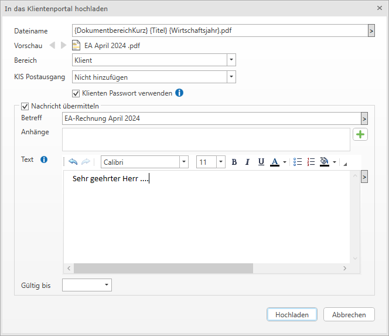{width="3.8031496062992125in"
height="3.283464566929134in"}

Eine detaillierte Beschreibung des Programmteils finden Sie im Handbuch
RZL PDF-Manager Premium.

### Dokumentenübermittlung aus dem RZL PDF Drucker

Im RZL PDF-Drucker erstellte Dokumente können über die Schaltfläche
*Export* ins RZL Klientenportal hochgeladen werden.

Abb. ‑ Dokumente aus dem RZL PDF Drucker bereitstellen

{width="4.268657042869641in"
height="2.302899168853893in"}

Wählen Sie dazu die Option *Exportieren nach: RZL Klientenportal* an.
Nach Eingabe des gewünschten Dateinamens und der Zuordnung im
Klientenportal können Sie optional noch das Passwort des Klienten
zuordnen. Nach Anwahl der Schaltfläche *Exportieren* wird das Dokument
hochgeladen.

### Dokumentenlisten

#### Empfangene Dokumente {#empfangene-dokumente .Überschrift-4---VG}

Der Programmteil *Informationsaustausch / Dokumentenlisten /Empfangene
Dokumente* zeigt die Dokumente, die von den Klienten zur Verfügung
gestellt worden sind. Sie können zwischen den Registerblättern
*Klientendokumente* und *Dienstnehmerdokumente* auswählen. Durch einen
Doppelklick auf den Dateinamen wird das Dokument aufgerufen.

Abb. ‑ Dokumente von Klienten

{width="6.322834645669292in"
height="3.1102362204724407in"}

Sie können die Ansicht auf einzelne Klienten einschränken oder die
Dokumente aller Klienten auflisten.

#### An Klienten übermittelte Dokumente {#an-klienten-übermittelte-dokumente .Überschrift-4---VG}

Im Programmteil *Informationsaustausch / Dokumentenlisten / An Klienten
übermittelte Dokumente finden Sie* die an die Klienten übermittelten
Dokumente. Durch einen Doppelklick auf den Dateinamen wird das Dokument
aufgerufen.

Abb. ‑ Übermittelte Dokumente

{width="6.515748031496063in"
height="4.311023622047244in"}

#### An Dienstnehmer übermittelte Dokumente {#an-dienstnehmer-übermittelte-dokumente .Überschrift-4---VG}

Im Programmteil *Informationsaustausch /* *Dokumentenlisten / An
Dienstnehmer übermittelte Dokumente* werden an Dienstnehmer übermittelte
Informationen angezeigt.

#### Gelöschte Dokumente {#gelöschte-dokumente .Überschrift-4---VG}

Im Programmteil *Informationsaustausch* / *Dokumentenlisten / Gelöschte
Dokumente* sehen Sie eine Liste mit den bereits gelöschten Dokumenten.

Abb. ‑ Gelöschte Dokumente

{width="6.464566929133858in"
height="2.7401574803149606in"}

In dieser Liste können die Dokumente nicht mehr aufgerufen werden.
Sichtbar sind der Name der Datei und der Benutzer, der die Datei
gelöscht hat sowie das Datum der Löschung. Ins KIS gespeicherte
Dokumente werden automatisch gelöscht und erhalten in der Spalte *Im KIS
gespeichert* ein Hakerl.

## Nachrichtenübermittlung

Die Nachrichtenübermittlung im RZL Klientenportal bietet Ihnen die
Möglichkeit, Nachrichten an Ihre Klienten verschlüsselt über die
https-gesicherte Verbindung zu senden bzw. von Ihrem Klienten zu
empfangen. Dieses Feature steht Ihnen auch im Zuge des Hochladens von
Dokumenten aus dem Kanzleiinformationssystem bzw. PDF-Manager Premium
zur Verfügung. Sie können dabei einzelne/individuelle Nachrichten
erstellen bzw. erhalten oder ganze Newsletter an alle im Klientenportal
angelegten Klienten übermitteln.

### Nachrichten an einen Klienten übermitteln

Im Programmteil *Informationsaustausch / Nachricht an einen Klienten
übermitteln* können Sie Nachrichten mit Anhängen an den gewünschten
Klienten versenden. Nach Auswahl des Klienten gelangen Sie in folgende
Ansicht.

Abb. ‑ Nachricht an einen Klienten übermitteln

{width="4.771653543307087in"
height="6.086614173228346in"}

#### Dokumentbereich {#dokumentbereich .Überschrift-4---VG}

Wählen Sie den benötigten Dokumentbereich im Drop-Down Menü an. Nur
Klientenbenutzer, die in den Stammdaten diesem Dokumentbereich
zugeordnet sind, können diese Nachricht lesen (Kapitel 2.2.4, Seite
[16](#benutzerdaten-und-berechtigungen)).

#### Gültig Bis {#gültig-bis .Überschrift-4---VG}

Nach Auswahl des Dokumentbereichs können Sie im Feld *Gültig Bis* ein
Enddatum der Nachricht hinterlegen. Die Nachricht wird nach diesem Datum
automatisch vom Portal gelöscht.

#### Betreff {#betreff .Überschrift-4---VG}

Geben Sie hier einen kurzen Nachrichtenbetreff ein.

#### Nachricht {#nachricht .Überschrift-4---VG}

Hier geben Sie die gewünschte Nachricht an Ihren Klienten ein. Die
Tastenkombination STRG+RETURN fügt einen Zeilenumbruch ein.

#### Dokumente {#dokumente-1 .Überschrift-4---VG}

Sie können optional ein Dokument an die Nachricht anhängen. Diese werden
dann nicht nur in der Nachricht, sondern auch in der Dokumentenansicht
angezeigt.

Wählen Sie über die Schaltfläche *Durchsuchen* das gewünschte Dokument
aus.

Mit der Schaltfläche *Nachricht* *senden* wird die Nachricht an den
Klienten übermittelt. Der Klient erhält bei korrekter Einstellung in den
Benutzerstammdaten eine automatische E-Mail Benachrichtigung über den
Nachrichteneingang. Nach dem Einstieg ins Klientenportal ist die
Benachrichtigung auch im Protokoll ersichtlich.

Die versendeten Nachrichten können jederzeit über *Informationsaustausch
/ Nachrichtenlisten / Gesendete Nachrichten* eingesehen werden (Kapitel
3.3.6, Seite [37](#gesendete-nachrichten)).

### Nachrichten an alle Klienten übermitteln

Als Kanzleisachbearbeiter können Sie im Programmteil
*Informationsaustausch / Nachricht an alle Klienten übermitteln*
Nachrichten an alle Klienten im Klientenportal zustellen:

Auch hier kann die Gültigkeitsdauer der Nachricht eingeschränkt werden.
Nach der Eingabe eines Betreffes und der Nachricht ist auch hier das
Hochladen eines Dokumentes möglich (vgl. Kapitel 3.3.1, Seite
[35](#nachrichten-an-einen-klienten-übermitteln)). Mit *Nachricht
senden* wird die Nachricht an alle aktiven Klienten am Klientenportal
übermittelt.

### Nachrichten an einen Dienstnehmer übermitteln

Als Klientensachbearbeiter können Sie im Programmteil
*Informationsaustausch / Nachricht an einen Dienstnehmer übermitteln*
auch Nachrichten mit Dokumentenanhang an einen gewünschten Dienstnehmer
übermitteln. Nach Anwahl des Klienten können Sie ebenfalls den
gewünschten Dienstnehmer anwählen und die Nachricht erstellen. Dieser
erhält wiederum ein E-Mail als Information über den Nachrichteneingang.

### Nachrichten über das RZL KIS bei Dokumentenübermittlung senden

Eines beim Klienten abgelegte Dokument im RZL KIS kann durch Anwahl in
der Dokumentenliste mit der rechten Maustaste und der Option *zum
Klientenportal mit Nachricht hochladen* sofort inklusive Nachricht an
den Klienten übermittelt werden.

### Nachrichten über den RZL PDF-Manager Premium senden

Im RZL PDF-Manager Premium kann im Zuge einer Dokumentenübermittlung
auch gleichzeitig eine Nachricht angehängt werden. Die Beschreibung dazu
finden Sie im Kapitel 3.2.4, Seite
[32](#dokumentenübermittlung-aus-dem-rzl-kis).

### Gesendete Nachrichten

Im Programmteil *Informationsaustausch / Nachrichtenlisten / Gesendete
Nachrichten* kann der eingeloggte Kanzleisachbearbeiter die versendeten
Nachrichten einsehen.

Abb. ‑ Gesendete Nachrichten

{width="6.636107830271216in"
height="4.515748031496063in"}

Durch Anwahl des \>-Symbols in der ersten Spalte öffnet sich die
Detailansicht der Nachricht. Zur besseren Sortierung stehen Ihnen
verschiedene Filter zur Verfügung. In den Spalten *gelesen, gelesen von
und gelesen am* sehen Sie, ob und wann der Klient die Nachricht gelesen
hat.

#### Tabelleneinstellungen {#tabelleneinstellungen .Überschrift-4---VG}

Vgl. Kap. 3.1 Allgemeine Listenfunktionen

**Vorhergehende Nachricht aufrufen / Antwort aufrufen**

Stehen bei der angewählten Nachricht zugehörige Nachrichten zur
Verfügung, kann über die Schaltflächen *Vorhergehende Nachricht
aufrufen* und *Antwort aufrufen* direkt in die Liste der empfangenen
Nachrichten gewechselt werden. Die vorhergehende Nachricht bzw.
nachfolgende Nachricht werden automatisch geöffnet.

**Anhänge herunterladen**

Beinhaltet die Nachricht einen Anhang kann dieser über den *Menüpunkt
Anhänge herunterladen* geöffnet und gespeichert werden.

#### Nachrichten löschen {#nachrichten-löschen .Überschrift-4---VG}

Wählen Sie dazu die gewünschte Nachricht in der letzten Spalte durch
Setzen des Häkchens an. Mit *Nachricht löschen* werden die markierten
Nachrichten nicht nur in der Kanzleisachbearbeiter-Ansicht, sondern auch
bei den betroffenen Klienten gelöscht.

### Empfangene Nachrichten

Wenn der Klient eine Nachricht an den Kanzleisachbearbeiter übermittelt,
erscheint diese beim nächsten Login des Kanzleisachbearbeiters am
Klientenportal in der Protokollansicht. Diese kann auch jederzeit im
Menü *Informationsaustausch / Nachrichtenlisten / Empfangene
Nachrichte*n aufgerufen werden.

## Datenverbrauch

Der Programmpunkts *Informationsaustausch / Sonstiges* bietet die
Möglichkeit, Ihren Datenverbrauch aufzurufen. Die Aktualisierung des
Datenverbrauchs erfolgt einmal pro Tag. Die Darstellung des
Datenverbrauchs erfolgt monatlich pro Klient.

Abb. ‑ Datenverbrauchsstatistik

{width="5.573470034995625in"
height="4.559055118110236in"}

## Benutzerdefinierte Dokumentbereiche ohne RZL KIS/ BOARD

Im Programmpunkt *Informationsaustausch / Sonstiges* können unter dem
gleichnamigen Menüpunkt *benutzerdefinierte Dokumentbereiche* angelegt
werden. Diese stehen dann ebenfalls im Auswahldialog neben den Standard-
Dokumentbereichen (entspricht den lizensierten Programmen) zur
Verfügung.

Tragen Sie im Bereich *Neuer Name* die Bezeichnung des Dokumentbereichs
ein und klicken Sie nachfolgend auf den Punkt *Erstellen*. Im oberen
Bereich werden alle Dokumentbereiche, die benutzerdefiniert angelegt
wurden, angezeigt. Noch nicht verwendete benutzerdefinierte
Dokumentbereiche können gelöscht werden.

Abb. ‑ Benutzerdefinierte Dokumentbereiche anlegen

{width="6.322834645669292in"
height="2.1692913385826773in"}

Nach Anlegen eines Dokumentbereichs können Sie die neue Berechtigung den
Klienten und Kanzleibenutzern zuweisen. Im nachfolgenden Bildschirm ist
die Zuweisung zu einem Kanzlei-Mitarbeiter abgebildet.

Abb. ‑ Berechtigung für benutzerdefinierte Kategorie erteilen -- Kanzlei
Mitarbeiter

{width="6.452755905511811in"
height="5.358267716535433in"}

Wählen Sie hier den neu angelegten Dokumentbereich und die gewünschten
Klienten aus und bestätigen Sie die Eingabe mit *Speichern*. Durch diese
Auswahl können Sie nun, wenn Sie Dokumente an einen Klienten
übermitteln, den neu angelegten Dokumentbereich verwenden.

Abb. ‑ Darstellung der benutzerdefinierten Dokumentbereiche in der
Auswahl

{width="5.874015748031496in"
height="3.374015748031496in"}

Damit Ihr Klient auch diesen neuen Dokumentbereich verwenden kann, ist
dieser in den Benutzerstammdaten des Klienten zu aktivieren. Gehen Sie
hierfür unter *Stammdaten / Klienten / Klientenstammdaten* und wählen
Sie die betreffenden Klienten aus. Anschließend sind bei den
Berechtigungen die Dokumentbereiche beim gewünschten Benutzer anzuwählen
und mit *Speichern* zu bestätigen.

Abb. ‑ Berechtigung für benutzerdefinierte Dokumentbereiche erteilen --
Klient Benutzer

{width="6.15748031496063in"
height="4.440944881889764in"}

## Benutzerdefinierte Dokumentbereiche mit RZL KIS/ BOARD

Wird das KIS/ Board verwendet, sind die benutzerdefinierten
Dokumentbereiche im KIS/ BOARD unter *Verwaltung / Dokumentbereich*
anzulegen und zu bearbeiten.

In der Übersicht werden alle vom Anwender lizensierten Programme als RZL
Standard Dokumentbereich mit einem Hackerl versehen angeführt. Diese
Dokumentbereiche können vom Anwender nicht verändert oder gelöscht
werden.

Abb. ‑21 Ansicht Dokumentbereich im RZL KIS

{width="6.5236220472440944in"
height="3.893700787401575in"}

> Unter gleichnamigen Menüpunkt kann ein *neuer Dokumentbereich*
> angelegt werden. Dafür ist im Feld *Bezeichnung* der gewünschte Name
> einzugeben und mit *Speichern* zu bestätigen.
>
> Sollen bestehende Dokumentbereiche zusammengelegt werden, kann das
> unter dem Menüpunkt *Dokumentbereich übertragen* vorgenommen werden.
> Mit dieser Funktion werden die mit diesem Dokumentbereich verknüpften
> Nachrichten und Dokumente dem neuen Dokumentbereich zugeordnet.
>
> Benutzerdefinierte Dokumentbereiche, die nicht verwendet werden,
> können über *Dokumentbereich löschen* gelöscht werden.
>
> Im KIS/ BOARD vorgenommene Änderungen werden automatisch zum
> Klientenportal hochgeladen und stehen da zur Verfügung. Über den
> Menüpunkt *Zum Klientenportal* *hochladen* kann der Datenaustausch mit
> dem Klientenportal manuell angestoßen werden.
>
> Anschließend sind bei dem Kanzleibenutzer und Klientenbenutzer die
> Berechtigung für den neu angelegten Dokumentbereich zu hinterlegen.
> (vgl. Kapitel 3.5 Benutzerdefinierte Dokumentbereiche ohne KIS / BOARD
> Abb. 3.18 und 3.20 Berechtigung für benutzerdefinierten
> Dokumentbereich erteilen)

# Lohnverrechnung

> Das Modul Lohn Vorerfassung ermöglicht die Vorerfassung von
> lohnverrechnungsbezogenen Daten durch den Klienten und anschließenden
> Direktimport in die RZL Lohnverrechnung. ÖGK Meldungen können direkt
> am Portal erstellt und übermittelt werden.

## Klientendaten aus der RZL Lohnverrechnung exportieren

HInweis

Stellen Sie vor dem Export der Lohnverrechnungsdaten Ihres Klienten
sicher, dass das Klientenportal korrekt eingerichtet und die notwenigen
Einstellungen in den Klientenstammdaten vorgenommen wurden (Kapitel 2.2,
Seite [9](#klientenstammdaten)).

Öffnen Sie den gewünschten Klienten in der RZL Lohnverrechnung. Unter
dem Programmpunkt *Bearbeiten / RZL Klientenportal / Daten
bereitstellen* können Sie die Dienstnehmerstammdaten aus der RZL
Lohnverrechnung auf das RZL Klientenportal exportieren.

## Eingabemasken für Klienten konfigurieren

Im Klientenbereich des Portals können die Benutzer Daten für die
Lohnverrechnung vorerfassen und der Lohnverrechnung zur Verfügung
stellen. Die Felder (Lohnarten, Überstunden, Homeoffice-Tage, usw.)
werden im Kanzleibereich festgelegt.

### Eingabemasken (Vorerfassungen gesamt)

Die in diesem Kapitel beschriebenen Eingabemasken werden für die
Vorerfassungen *laufende Änderungen*, *Eintritte* und *Austritte*
verwendet. Die Eingabemasken können bei mehreren Benutzern gleichzeitig
verwendet werden. Sie können die passende Eingabemaske in den Stammdaten
des Klienten (*Stammdaten / Klienten*) pro Benutzer zuordnen.

Hinweis

Beachten Sie, dass die Eingabemasken nur von Kanzleibenutzern mit der
Berechtigung *Lohnvorerfassung* erstellt und verändert werden können.
Diese Änderungen gelten für den gesamten Kanzleibereich.

Wählen Sie das Menü *Lohnverrechnung / Eingabemasken verwalten* aus.

Abb. ‑ Liste der Eingabemasken I

{width="5.988188976377953in"
height="2.220472440944882in"}

Sie können hier für *Eintritte*, *Austritte* und *Laufende Änderungen*
Eingabemasken bearbeiten bzw. neue Eingabemasken erstellen. Drei
Vorschläge „Maximal", „Minimal" und „Standard" stehen im RZL
Klientenportal bereits zur Verfügung. Diese Vorschläge können jederzeit
abgeändert und angepasst werden.

#### Bestehende Eingabemaske ändern {#bestehende-eingabemaske-ändern .Überschrift-4---VG}

Wählen Sie dazu im jeweiligen Set die gewünschte Maske durch Anwahl der
Maskenbezeichnung aus. Sie gelangen anschließend in den
Bearbeitungsdialog.

#### Neue Eingabemaske anlegen {#neue-eingabemaske-anlegen .Überschrift-4---VG}

Wenn Sie die Schaltfläche *Neue Maske erstellen* (**1**) anwählen, wird
nachfolgender Dialog geöffnet.

Abb. ‑ Liste der Eingabemasken II

{width="6.196850393700787in"
height="2.220472440944882in"}

**4**

**3**

**2**

**1**

Im Feld Maske (**2**) wählen Sie den gewünschten Eintrag aus. Vergeben
Sie einen Namen (**3**) für die neue Eingabemaske und klicken Sie auf
die Schaltfläche *Erstellen* (**4**).

Sie können jetzt die neue Eingabemaske bearbeiten und innerhalb der
Klientenbenutzer zuordnen.

#### Bearbeiten der Eingabemasken {#bearbeiten-der-eingabemasken .Überschrift-4---VG}

Im Änderungsmodus sind die Eingabefelder zunächst zu Gruppen
zusammengefasst.

Abb. ‑ Eingabemasken - Überschriften

{width="6.484251968503937in"
height="3.4803149606299213in"}

**3**

**4**

**2**

**1**

**5**

Im rechten Bereich werden die verfügbaren Elemente (**1**) als
Überschriften angezeigt. Diese Gruppen entsprechen den
Abrechnungsbildschirmen im Lohnverrechnungsprogramm. Im linken Bereich
sehen Sie die Elemente (**2**), die der Klientenbenutzer in der
Eingabemaske verwenden kann. Die Elemente im linken Bereich können durch
Drag&Drop nach oben oder unten verschoben werden.\
In dem Sie ein Hackerl (**3**) vor die Überschrift setzen, können Sie
eine Gruppe aktivieren. Sie können eine Gruppe auch durch Drag&Drop nach
rechts verschieben.\
Die Gruppen können durch Entfernen des Hackerls bei der Überschrift
(**3**), durch Anwahl des Papierkorb-Symbols (**4**) und durch Drag&Drop
wieder deaktiviert und nach rechts verschoben werden.\
Sie erhalten einen genauen Überblick über die verwendeten Felder durch
Anwahl der Schaltfläche *Vorschau* (**5**) rechts oben.

Abb. ‑ Eingabemasken - Details

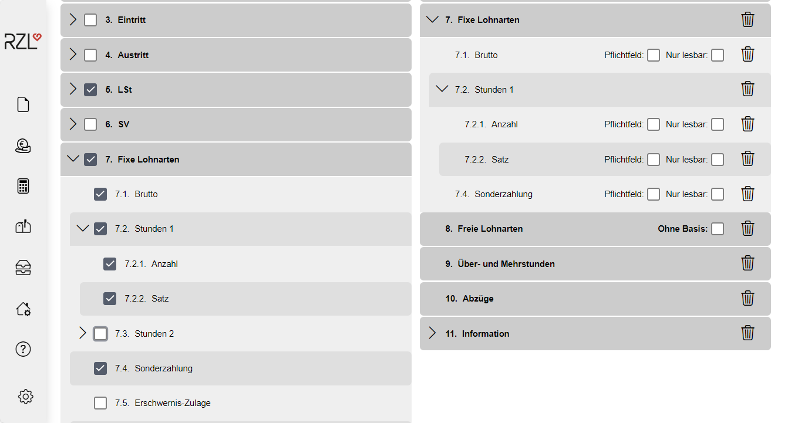{width="6.34251968503937in"
height="3.409448818897638in"}

**7**

**6**

Innerhalb der Gruppen können die Felder wie die Überschriften aktiviert
und deaktiviert werden. Im linken Bereich können die Felder mit
Drag&Drop nach oben oder unten verschoben werden.\
Einzelne Datenfelder können als *Pflichtfelder* (**6**) oder als *Nur
lesbar* (**7**) definiert werden. Ein Pflichtfeld muss zwingend
ausgefüllt werden. Nur lesbar bedeutet, dass das Feld angezeigt aber
nicht bearbeitet werden kann.

#### Zuteilung der Eingabemasken zu den Klientenbenutzern {#zuteilung-der-eingabemasken-zu-den-klientenbenutzern .Überschrift-4---VG}

Die gewünschten Eingabemasken werden in den Klientenstammdaten in den
Berechtigungen der Benutzer mit der Option *Lohn Vorerfassung* zugeteilt
(Kapitel 2.2.4, Seite [16](#benutzerdaten-und-berechtigungen)).

### Eingabemasken für die Tabellenerfassung (laufende Änderungen)

Im Klientenbereich besteht die Möglichkeit laufende Änderungen nur für
bestimmte Lohnarten (Fixe Lohnarten, freie Lohnarten, Über- und
Mehrstunden, Abzüge, Lohnsteuertage) in Tabellenform zu erfassen.

Innerhalb dieser Form der Vorerfassung werden die freien Lohnarten
direkt in der Eingabemaske zugeordnet. Die Eingabemaske für die
Tabellenerfassung wird für jeden Klienten einzeln angelegt.

Die Erstellung und Bearbeitung von Eingabemasken für die
Tabellenerfassung ist nur mit der Berechtigung *Lohnvorerfassung in
Tabellenform* möglich.

Wählen Sie das Menü *Lohnverrechnung / Eingabemasken für
Tabellenerfassung verwalten* aus.

Abb. 4‑5 Eingabemasken Tabellenerfassung

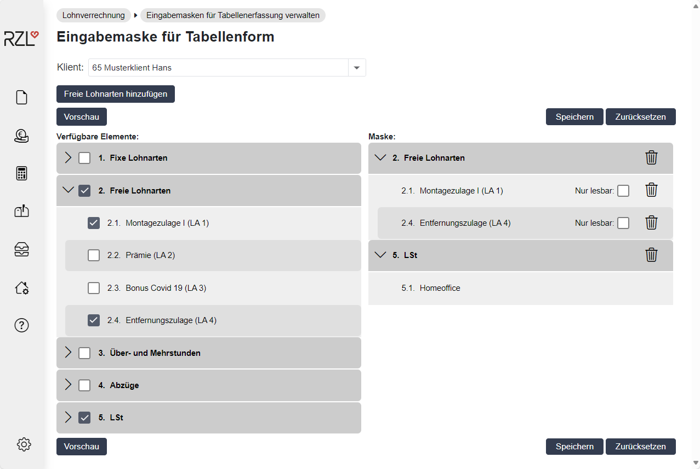{width="5.881889763779528in"
height="4.019685039370079in"}

**2**

**1**

Die allgemeine Bedienung dieser Eingabemaske entspricht der Beschreibung
im vorhergehenden Kapitel mit zwei Ausnahmen:

1.  Eingabemasken für die Tabellenerfassung werden für jeden Klienten
    (**1**) einzeln angelegt. Ist der Klient nicht in der Liste
    enthalten -- aber im Klientenportal angelegt, fehlt Ihnen als
    Kanzleibenutzer vermutlich die Berechtigung *Lohnvorerfassung in
    Tabellenform* (vgl. Kap 1 Einstellungen in den Stammdaten eines
    Kanzleimitarbeiters). „Normale" Eingabemasken können bei
    verschiedenen Klienten verwendet werden.

2.  Die freien Lohnarten können nach Anwahl der Schaltfläche *Freie
    Lohnarten hinzufügen* (**2**) durch ein Hackerl ins Kästchen und
    *Hinzufügen* in die Eingabemaske übernommen werden.

Abb. 4‑6 Eingabemasken Tabellenerfassung -- Auswahl der freien Lohnarten

{width="2.925196850393701in"
height="2.122047244094488in"}

## Vom Klienten freigegebene Daten der Vorerfassung

Im Klientenbereich werden vom Klientenbenutzer Daten für die
Lohnverrechnung vorerfasst. Je nach Einstellung in den
Klientenstammdaten des Klientenportals können
Mindestangaben-Anmeldungen/Versichertenmeldungen reduziert als Eintritte
an den Wirtschaftstreuhänder übermittelt werden. Ebenfalls ist die
Erfassung von Austritten, laufenden Änderungen, Urlauben, Krankenständen
und Zeitausgleich durch den Klienten im Portal möglich.

### Import in die RZL Lohnverrechnung

Der in den Stammdaten hinterlegte Klientensachbearbeiter erhält nach der
Freigabe durch den Klienten zunächst eine E-Mail-Benachrichtigung.
Voraussetzung für die E-Mail-Benachrichtigung ist die Aktivierung im
Programmteil *Stammdaten / Portal / E-Mail Einstellungen* Wird der
Klient anschließend in der RZL Lohnverrechnung geöffnet, können die
Vorerfassungen automatisch übernommen werden. Eine detaillierte
Beschreibung dazu finden Sie im Handbuch RZL Lohn-/Gehaltsverrechnung.

### Abruf am RZL Klientenportal

Beim nächsten Login in das Klientenportal werden die Erfassungen auch im
Startbildschirm (Protokoll) des Kanzleisachbearbeiters angedruckt. Die
Vorerfassungen können auch jederzeit im Programmteil *Lohnverrechnung /
Vom Klienten freigegebene Daten* abgerufen werden.

Abb. ‑ Vom Klienten freigegebene Daten

{width="5.952755905511811in"
height="2.783464566929134in"}

Wählen Sie im Drop-Down Menü den gewünschten Klienten aus. Im Bereich
*Zeitraum wählen* können Sie einzelne Monate auswählen oder nach dem Typ
der Meldung (Eintritt, Laufende Änderung, usw.) filtern. Wenn Sie den
Eintrag *Alle Erfassungen* anwählen, erhalten Sie eine vollständige
Liste der freigegebenen Daten. Durch Klick auf eine Vorerfassung werden
die Details angezeigt.

## ÖGK-Anmeldungen / Stornomeldungen

Nachdem der Klient die ÖGK-Meldungen übermittelt hat, können Sie als
Kanzleisachbearbeiter diese Meldungen über den Menüpunkt
*Lohnverrechnung / Übermittelte Anmeldungen* prüfen.

Abb. ‑ Übersicht -- Übermittelte ÖGK-Meldungen

{width="5.940944881889764in"
height="3.338582677165354in"}

Wählen Sie dazu den gewünschten Klienten, Zeitraum und Typ in den
Drop-Down Menüs aus. Durch Anwahl in der folgenden Auflistung werden die
Details aufgerufen.

**ÖGK-Protokolle aufrufen und ausgeben**

Der Programmteil *Lohnverrechnung / Protokolle der Anmeldungen* bietet
Ihnen die Möglichkeit die ÖGK-Protokolle der Meldungen aufzurufen und
auszudrucken.

Abb. ‑ Protokolle der Versichertenmeldung reduziert / Anmeldung
fallweise Beschäftigter

{width="6.437007874015748in"
height="5.358267716535433in"}

In der Spalte Datei können Sie durch Anwahl des Dateinamens die
ÖGK-Protokolle aufrufen und mit der Schaltfläche *Druckvorschau*
ausdrucken.

**ÖGK-Protokolle archivieren**

Die Eintragungen in dieser Liste können archiviert werden. Sie können
die Archivierung für Meldungen die älter als sieben bzw. 30 Tage sind
durchführen, in dem Sie die Schaltfläche *Archivierung starten*
anwählen. Die archivierten Protokolle lassen sich jederzeit durch Anwahl
des Eintrags *Archivierte Protokolle* anzeigen aufrufen.

**Ausgewählte Protokolle zusammenführen**

Nach Anwahl der Schaltfläche *Ausgewählte Protokolle zusammenführen*
werden die Protokolle - die mit einem Hackerl gekennzeichnet sind - in
eine PDF-Datei ausgegeben.

## Anbindung zur rota-Schnittstelle

Mit dem Klientenportal **Modul rota Schnittstelle** können Sie die von
Ihrem Klienten erfassten Daten in der rota-Software direkt in das RZL
Lohn-Programm importieren.

Legen Sie zunächst den Klienten am Klientenportal an und stellen Sie die
Stammdaten aus der Lohnverrechnung am RZL Klientenportal bereit (Kapitel
2.2, Seite [9](#klientenstammdaten)).

Zur Nutzung der Schnittstelle müssen Sie im RZL Klientenportal in den
Klientenstammdaten unter *Stammdaten / Klienten / Klientenstammdaten*
die Option *Daten für Lohnvorerfassung aktivieren* anwählen. Legen Sie
anschließend einen separaten Benutzer mit der Berechtigung *Lohn
Vorerfassung* an und stellen Sie sicher, dass der angelegte
Klientenzugang funktioniert, indem Sie den Login kurz testen. Leiten Sie
diese Benutzerdaten mit Passwort an die Firma rota zur weiteren
Einrichtung weiter.

> 

# Finanzbuchhaltung

Im RZL Klientenportal können im Klientenbereich Buchungen wahlweise mit
oder ohne Vorkontierung vorerfasst werden. In den Klientenstammdaten
wird festgelegt, ob eine Vorkontierung möglich ist. Die Vorerfassungen
können in die Finanzbuchhaltung bzw. EA-Rechnung der Kanzlei übernommen
werden.

## Bereitstellen des Kontenplans in der Fibu/EA-Rechnung

Bei der Anlage der Kassa/Bankbücher und der Verbuchungsregeln kann im
RZL Klientenportal auf den Kontenplan der Fibu bzw. EA-Rechnung
zugegriffen werden. Deshalb müssen Sie vorab in der Fibu bzw.
EA-Rechnung den Programmteil *Bearbeiten / Klientenportal / Daten
bereitstellen* anwählen und über diesen Menüpunkt den Kontenplan
bereitstellen.

Abb. ‑ Bereitstellen des Kontenplans für das RZL Klientenportal

{width="4.196850393700787in"
height="0.9803149606299213in"}

## Anlage des Kassa/Bankbuchs am RZL Klientenportal

Kassa/Bankbücher werden im Programmteil *Finanzbuchhaltung / Stammdaten
Kassa/Bankbuch* für die einzelnen Klienten angelegt.

Im Bereich *Klient wählen* klicken Sie auf die kleine Pfeiltaste und
wählen den gewünschten Klienten aus.

Nach der Auswahl der Klienten können Sie in den unten angeführten
Feldern die Kassa/Bankbücher anlegen.

Abb. ‑ Anlage Kassa-/Bankbuch

{width="6.649606299212598in"
height="3.7283464566929134in"}

**1**

Durch Anwahl der Schaltfläche NEU können Sie ein neues Kassa/Bankbuch
anlegen.

Im Feld *Bezeichnung* wird ein Name für das Kassa/Bankbuch vergeben.

Im Feld *Belegkreis* tragen Sie bitte den Belegkreis ein, der in der
Buchhaltung bzw. EA-Rechnung für das Kassa/Bankbuch verwendet wird.

Wenn Sie im Feld *Konto* die STRG-Taste anwählen, wird der Kontenplan
der Fibu bzw. EA-Rechnung aufgerufen und Sie können das Kassa oder
Bankkonto auswählen. Auf diese Kontonummer werden die Vorerfassungen in
der Fibu bzw. EA-Rechnung gebucht.

Damit der Benutzer im Klientenbereich beim Vorerfassen die richtigen
Anfangs- und Endsalden angezeigt bekommt, erfassen Sie den *Saldo* des
eingetragenen Kontos zu einem bestimmten *Stichtag.*

Beim Kassabuch müssen Sie darüber hinaus noch den Merker setzten
(**1**), dass es sich um ein Kassabuch handelt. Ein Kassabuch mit einem
negativen Kassasaldo (Kassaminus) kann nicht freigegeben werden.

#### Einschränken auf bestimmte Benutzer {#einschränken-auf-bestimmte-benutzer .Überschrift-4---VG}

Im rechten Bereich des Dialogs unterhalb der Bezeichnung *Erlaubt für
Benutzer* steht zunächst der Eintrag *alle*. Somit können alle beim
Klienten angelegten Benutzer das Kassa- oder Bankbuch bearbeiten.

Abb. ‑ Benutzer pro Kassa/Bankbuch bearbeiten/einschränken

{width="6.239583333333333in"
height="3.9659722222222222in"}

Wenn Sie rechts das Bearbeiten- Symbol anwählen, können die berechtigen
Benutzer ausgewählt werden.

Im oben angezeigten Dialog werden die berechtigen Benutzer durch ein
Hackerl ins Kästchen ausgewählt und durch Anwahl der Schaltfläche
*Übernehmen* gespeichert.

Abb. ‑ Benutzer bearbeiten

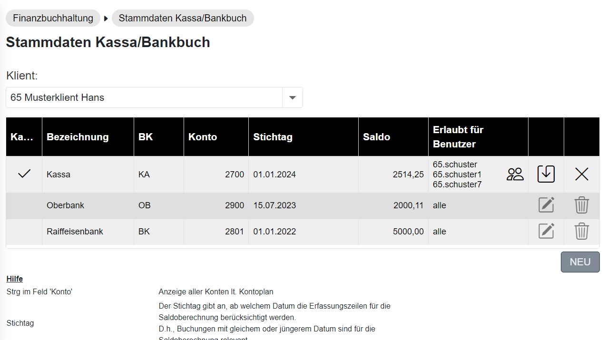{width="5.984251968503937in"
height="3.3503937007874014in"}

Im abgebildeten Beispiel (Abb. 5.5) darf das Kassabuch von den Benutzern
65.schuster, 65.schuster1 und 65.schuster7 bearbeitet werden.

#### Löschen von Kassa/Bankbüchern {#löschen-von-kassabankbüchern .Überschrift-4---VG}

Angelegte Kassa/Bankbücher können durch Anwahl des Papierkorbes ganz
rechts im Dialog gelöscht werden.

Nach Anwahl des Papierkorbsymbols erhalten Sie nachfolgende Abfrage.

Abb. ‑ Kassa/Bankbücher löschen II

{width="3.937007874015748in"
height="1.065721784776903in"}

Wenn Sie die oben angezeigte Abfrage mit OK beantworten, wird das
jeweilige Kassa/Bankbuch gelöscht. Sind bereits Vorerfassungen vorhanden
ist ein Löschen nicht möglich.

Abb. ‑ Kassa/Bankbücher löschen -- Vorerfassungen vorhanden

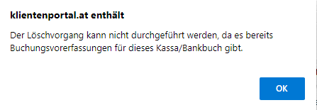{width="3.937007874015748in"
height="1.3651804461942256in"}

## Vorerfassung Kostenstellen

Wenn im Buchhaltungsklienten eine Kostenstellen und/oder eine
Kostenträgerrechnung gebucht wird, kann im RZL Klientenportal im
Programmteil *Finanzbuchhaltung / Stammdaten KORE* den Benutzern eine
Kostenstelle und ein Kostenträger zugeordnet werden.

Abb. ‑ Kostenstellen einzelnen Benutzern zuordnen

{width="6.503937007874016in"
height="2.4960629921259843in"}

Die Anwendung der in diesem Bereich definierten Werte hängt von der
Einstellung ab, ob für diesen Klienten die Erfassung der Kostenstelle /
Kostenträger bei der Buchungsvorerfassung aktiviert ist (siehe
Klientenstammdaten).\
\
Ist die Erfassung der Kostenstelle / Kostenträger bei der
Buchungsvorerfassung nicht aktiviert, so gilt:\
Die für einen Benutzer festgelegte Kostenstelle / Kostenträger werden
bei der Freigabe der Vorerfassungen für die Buchungszeilen automatisch
gesetzt. Somit sind die in diesem Abschnitt definierten Werte erst zum
Zeitpunkt der Freigabe relevant - nicht zum Zeitpunkt der Erfassung.

Ist die Erfassung der Kostenstelle / Kostenträger bei der
Buchungsvorerfassung aktiviert, so gilt:\
Die für einen Benutzer festgelegte Kostenstelle / Kostenträger werden
bei der Vorerfassung der Buchungszeilen automatisch vorgeschlagen.

## Anlage der Registrierkassen

Nach Anlage der Kassa/Bankbücher (*Finanzbuchhaltung / Stammdaten
Kassa/Bankbuch*; siehe Kapitel 5.2) sind über den Menüpunkt
*Finanzbuchhaltung / Stammdaten Registrierkassen* die Einstellungen zu
den Registrierkassen durchzuführen.

Abb. ‑ Anlegen Kassa/Bankbuch für Kassandro

{width="6.100659448818898in"
height="1.6368055555555556in"}

Abb. ‑ Anlegen der Stammdaten Registrierkassen

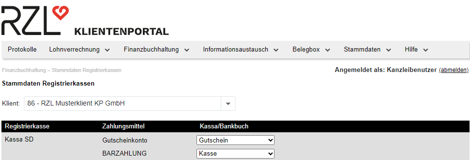{width="6.081975065616798in"
height="1.0965277777777778in"}

Unter *Finanzbuchhaltung / Stammdaten Registrierkassen* können Sie
anschließend die Einstellungen zu den Registrierkassen durchführen. Das
RZL Klientenportal greift dabei auf die unter *my.kassandro.at*
hinterlegten Daten zu. Ordnen Sie hier das jeweilige Zahlungsmittel dem
jeweiligen Kassa/Bankbuch zu. Mit *Speichern* werden die Einstellungen
gesichert.

Somit sind alle erforderlichen Stammdaten für die Registrierkassa
angelegt und der Klient kann dem Steuerberater die Daten der
Registrierkassen über die FIBU-Vorerfassung am RZL Klientenportal zur
Verfügung stellen.

## Anlage von Buchungsregeln

### Buchungsregeln - Individuell beim Klienten

Im Programmteil *Finanzbuchhaltung / Stammdaten Buchungsregeln* können
Buchungsregel für bestimmte Klienten erfasst werden. Ganz oben im
Programmteil wird der Klient ausgewählt.

In dieser Ansicht können Sie unterhalb der Klientenauswahl erkennen, ob
für diesen Klienten bereits eine allgemeine Vorlage (**1**) für
Buchungsregeln verankert wurde. Buchungsregeln-Vorlagen (kanzleiweit)
werden im Programmteil *Finanzbuchhaltung / Vorlagen Buchungsregeln
(kanzleiweit)* (vgl. Kap. 5.5.2 *Vorlagen Buchungsregeln kanzleiweit*)
angelegt und werden in den Klientenstammdaten zugeordnet. Im zweiten
Bereich kann eine allgemeine Vorlage (**2**), zum Kopieren (**3**) von
einzelnen Buchungsregeln, verankert werden.

Wenn der Benutzer im Klientenbereich bei der Vorerfassung bestimmte
(Erfassungs)-Texte verwendet, werden die Erfassungen automatisch
vorkontiert. Die *Erfassungstexte* (**4**) werden in diesem Programmteil
eingetragen und dem gewünschten *Konto* und *Steuersatz* zugeordnet.
Nach der Eintragung des Erfassungstextes können Sie im Feld *Konto* mit
der STRG-Taste den Kontenplan aus der Fibu bzw. EA-Rechnung aufrufen und
die gewünschten Konten übernehmen.

Abb. ‑ Buchungsregel -- Textvergabe und Kontierung

{width="6.157132545931758in"
height="4.346456692913386in"}

**4**

**5**

**6**

**3**

**2**

**1**

Das Feld *fix* (**5**) enthält zwingend ein Hackerl, wenn der Steuersatz
nicht geändert werden kann (Umsatzsteuerkonten, ig. Erwerbe, keine
Steuerverankerung). Auch für Konten mit Vorsteuerverankerung (z.B.
Wareneinsatz), kann durch Setzen des Häkchens der Steuersatz fix
verankert werden.

Sie können Buchungsregeln auch aus allgemeinen Vorlagen (**2**) durch
Anwahl des plus-Symbols (**3**) in den Klientenbereich kopieren. Die
beim Klienten gespeicherten bzw. zugeordneten Buchungsregeln können im
**PDF** oder **Excel**-Format (**6**) ausgegeben werden.

Wenn der Benutzer im **Klientenbereich** im Rahmen der Vorerfassung die
ersten Buchstaben des (Erfassungs)-Textes einträgt, werden die möglichen
Buchungsregeln angezeigt (siehe Abbildung 5.14).

Abb. ‑ Vorerfassung im Klientenbereich - Texteingabe

{width="6.291666666666667in"
height="1.4177482502187226in"}

Der Dialog oberhalb zeigt einen Teil der Erfassung im Klientenbereich.
Wenn der Benutzer einen Text eingibt, der als Buchungsregel hinterlegt
ist, werden die möglichen Buchungsregeln aufgelistet.

#### Verdeckte Erfassungstexte {#verdeckte-erfassungstexte .Überschrift-4---VG}

Wenn Sie betimmte Texte z.B. 10%, in eine eckige Klammer setzen \[10%\],
wird dieser Teil des Textes bei der Vorerfassung im Klientenbereich
angezeigt. Dieser Text wird allerdings nicht in die Fibu bzw.
EA-Rechnung übernommen.

Mit diesen eckigen Klammern können Sie somit für die Vorerfassung des
Benutzers im Klientenbereich mehr Text für die Auswahl der richtigen
Buchungsregel zur Verfügung stellen, als in das Textfeld der Fibu bzw.
EA-Rechnung übernommen wird.

#### Benutzerverwaltung Buchungsregeln {#benutzerverwaltung-buchungsregeln .Überschrift-4---VG}

Die Buchungsregeln können auf einzelne beim Klienten angelegte Benutzer
eingeschränkt werden.

Abb. ‑ Benutzerverwaltung Buchungsregeln

{width="6.267716535433071in"
height="1.6732283464566928in"}

Die Bearbeitung der Benutzer ist bereits im Kap. 5.2 *Anlage des
Kassa/Bankbuchs im RZL Klientenportal* beschrieben. Nach Auswahl des
Benutzers muss die Hinterlegung mit dem Speichersymbol gesichert werden.

### Vorlagen Buchungsregeln (kanzleiweit)

Damit Sie Buchungsregeln, die für mehrere Klienten verwendet werden
können, nicht bei jedem Klienten einzeln anlegen müssen, können Sie im
Programmteil *Finanzbuchhaltung / Vorlagen Buchungsregeln (kanzleiweit)*
allgemeine Vorlagen anlegen. Die Kontonummer und Kontostammdaten, die in
der Vorlage verwendet werden, müssen bei den Klienten - die diese
Vorlage gemeinsam verwenden - übereinstimmen.

Abb. ‑ Vorlagen Buchungsregeln

{width="6.251968503937008in"
height="1.921259842519685in"}

**1**

Nach Anwahl der Schaltfläche NEU vergeben Sie eine Bezeichnung für die
Vorlage, ordnen einen Referenzklienten zu und speichern (**1**) die
Vorlage ab.

Abb. ‑ Bearbeiten Vorlagen Buchungsregeln

{width="6.251968503937008in"
height="1.9173228346456692in"}

**3**

**2**

Nach Anwahl des Bearbeiten-Symbols (**2**) öffnet sich der Dialog für
die Anlage und Bearbeitung der Verbuchungsregeln. Vorlagen können durch
Anwahl des Papierkorb-Symbols (**3**) gelöscht werden.

Abb. ‑ Anlage von Buchungsregeln innerhalb einer Vorlage

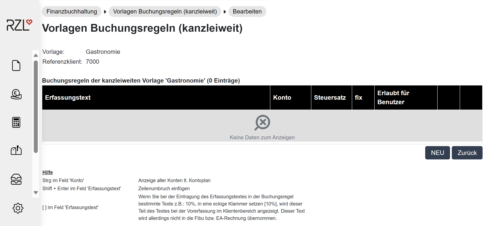{width="6.251968503937008in"
height="2.8661417322834644in"}

Die Anlage von Buchungsregeln ist im Kap. 5.5.1 *Buchungsregeln --
Individuell beim Klienten* beschrieben.

## Darstellung der Daten des Klienten

Sie haben im Kanzleibereich des RZL Klientenportal im Programmteil
*Finanzbuchhaltung / Vom Klienten freigegebene Daten* eine Übersicht
über die Daten des Klienten.

Im Bereich *Klient wählen* tragen Sie zunächst den gewünschten Klienten
ein. Anschließend erhalten Sie vier verschiedene Bereiche angezeigt.

Abb. ‑ Status der Daten des Klienten

{width="6.275590551181103in"
height="4.322834645669292in"}

Durch Anwahl des Ansichtssymbols rechts können Sie die Buchungen im
Detail aufrufen.

Abb. ‑ Anzeige der Vorerfassungen

{width="6.303149606299213in"
height="4.015748031496063in"}

#### Saldo der Buchungen {#saldo-der-buchungen .Überschrift-4---VG}

Durch den Saldo der Buchungen wird die Differenz zwischen Anfangssaldo
und Endsaldo des betreffenden Zeitraums detailliert dargestellt. Die
Darstellung erfolgt nach dem jeweiligen Status der Buchungen:

-   *nicht freigegeben:* dies ist der Saldo der Buchungen, die vom
    Klienten noch nicht freigegeben wurden

-   *freigegeben:* dies ist der Saldo der Buchungen, welche der Klient
    bereits freigegeben hat, von Ihnen jedoch noch nicht bearbeitet
    wurden

-   *gesperrt:* dies ist der Saldo der Buchungen, die von Ihnen bereits
    bearbeitet werden

-   *übernommen:* dies ist der Saldo der Buchungen, die von Ihnen
    bereits übernommen (verbucht) wurden

Nach Anwahl der Schaltfläche *Drucken* können Sie den gewünschten
Drucker auswählen und die Ansicht ausdrucken.

#### Folgende Buchungen wurden vom Klienten für die Verarbeitung freigegeben {#folgende-buchungen-wurden-vom-klienten-für-die-verarbeitung-freigegeben .Überschrift-4---VG}

Hier erhalten Sie eine Ansicht jener Buchungen, die der Klient im
Klientenbereich erfasst und bereits freigegen hat. Durch Anwahl des
Papierkorb-Symbols kann eine Vorerfassung gelöscht werden.

Gelöschte Vorerfassungen werden in den Bereich *Folgende freigegebenen
Buchungen wurden durch einen Kanzleibenutzer gelöscht* verschoben und
können bei Bedarf reaktiviert werden.

#### Folgende Buchungen werden aktuell mit der RZL Finanzbuchhaltung bearbeitet {#folgende-buchungen-werden-aktuell-mit-der-rzl-finanzbuchhaltung-bearbeitet .Überschrift-4---VG}

Dieser Bereich zeigt jene Buchungen an, die im Moment in die
Buchhaltung/EA-Rechnung übernommen werden (Programmteil in Fibu/EA:
*Bearbeiten / Klientenportal / Buchungen importieren*).

#### Folgende Buchungen wurden bereits übernommen {#folgende-buchungen-wurden-bereits-übernommen .Überschrift-4---VG}

In diesem Bereich sehen Sie die Buchungen, die bereits in die
Fibu/EA-Rechnung übernommen worden sind. Hier können Sie - für die
Darstellung der Ansicht - im Bereich *Erfassungszeitraum auswählen* --
verschiedene Filter setzen. Der Standardfilter ist *die letzten 6
Monate*. Mögliche Filter sind noch: *die letzten 12 Monate*, *die
letzten 24 Monate* und *alle*.

In Ausnahmefällen kann eine bereits übernommene Vorerfassung durch
Anwahl des Pfeilsymbols ganz rechts wieder aktiviert werden. Das
bedeutet, dass die Buchungen wieder übernommen werden können.

**Folgende freigegebene Buchungen wurden durch einen Kanzleibenutzer
gelöscht**

Dieser Bereich zeigt, welche freigegebenen Buchungen durch welchen
Kanzleibenutzer gelöscht wurden und zu welchem Zeitpunkt die Löschung
erfolgte. Diese Vorerfassungen können durch Anwahl des Pfeil-Symbols
ganz rechts wieder aktiviert werden.

## Bereitstellen von Auswertungen aus der RZL Fibu bzw. EA-Rechnung

Sie können Ihrem Klienten aus der RZL Fibu bzw. EA-Rechnung die
Journalzeilen, die Saldenliste und die Kontenebene am RZL Klientenportal
zur Verfügung stellen.

Um Ihrem Klienten den Zugang zu diesen Daten zu ermöglichen, müssen Sie
zunächst in den Klientenstammdaten unter *Stammdaten / Klienten /
Klientenstammdaten* für den jeweiligen Benutzer des Klienten die
Berechtigung *Finanzbuchhaltung Auswertungen* aktivieren.

In der RZL FIBU können Sie über *Bearbeiten / Klientenportal / Daten
bereitstellen* die Journalzeilen und Salden bereitstellen.

Abb. ‑ Journalzeilen und Salden in der RZL FIBU bereitstellen

{width="6.45752624671916in"
height="1.5102274715660542in"}

Ihr Klient hat am RZL Klientenportal immer nur Zugriff auf den
bereitgestellten Stand der Daten. Um Ihren Klienten einen laufenden
Stand der Journalzeilen und Salden zur Verfügung zu stellen, müssen die
Daten aus der RZL Fibu bzw. EA-Rechnung laufend bereitgestellt werden.

### Auswertungen löschen

Im Kanzleibereich haben Sie die Möglichkeit, die bereitgestellten
Auswertungen je Klient wieder zu löschen. Den Menüteil dazu finden Sie
unter *Finanzbuchhaltung / Auswertungen löschen*.

Abb. ‑ Auswertungen löschen

> {width="5.874015748031496in"
> height="2.106299212598425in"}

**1**

Nach Auswahl des jeweiligen Klienten wählen Sie die Auswertung (**1**)
und das betreffende Wirtschaftsjahr an. Nach Anwahl der Schaltfläche
*Auswertungen löschen* werden die vorher gewählten Daten gelöscht.

# Dienstnehmerbereich

Die monatlichen Abrechnungen können für die Dienstnehmer im RZL
Klientenportal bereitgestellt werden. Es besteht auch die Möglichkeit
beliebige Dokumente -- nicht nur die monatlichen Abrechnungen -- für
einzelne Dienstnehmer auf das RZL Klientenportal hochzuladen.

## Anlage der Dienstnehmer für das RZL Klientenportal im Lohnverrechnungsprogramm

Die Freischaltung der Dienstnehmer erfolgt im RZL
Lohnverrechnungsprogramm im Abrechnungsbildschirm *Stammdaten
Dienstnehmer*.

Abb. ‑ Dienstnehmer - Stammdaten

{width="4.5in" height="3.952755905511811in"}

**2**

**1**

Das Feld *E-Mail Adresse* muss ausgefüllt und die Option *Dienstnehmer
am Klientenportal anlegen* (**1**) muss aktiviert werden.

Wenn die Daten aus der RZL Lohnverrechnung ins RZL Klientenportal
hochgeladen werden, erhalten die Dienstnehmer automatisch eine Mail mit
den automatisch generierten Zugangsdaten. Der Benutzername besteht aus
der Klientennummer, der Dienstnehmernummer und dem Nachnamen des
Dienstnehmers. Das Passwort wird von RZL zufällig generiert.

Die PDF-Dokument kann zusätzlich mit einem Passwort versehen werden
(**2**). Das hier eingetragene Passwort muss vom Dienstnehmer dann beim
Öffnen der Abrechnung am Klientenportal eingegeben werden.

Abb. ‑ Benachrichtigung Benutzername und Passwort

{width="5.783464566929134in"
height="2.263779527559055in"}

## Stammdaten Dienstnehmer im RZL Klientenportal

Wenn die Eintragungen in den Stammdaten im Lohnverrechnungsprogramm
vorgenommen worden sind, werden die Dienstnehmer in das RZL
Klientenportal nach Aktualisierung der Daten über *Bearbeiten /
RZL-Klientenportal / Daten aktualisieren* übernommen.

Im Programmteil *Stammdaten / Klienten / Dienstnehmer* können Sie
bestimmte Dienstnehmer-Stammdaten im RZL Klientenportal jederzeit
bearbeiten.

Abb. ‑ Dienstnehmer-Stammdaten im RZL Klientenportal

{width="6.354330708661418in"
height="2.15748031496063in"}

**3**

**2**

**1**

Durch Anwahl der Schaltfläche *Dienstnehmer bearbeiten* (**1**) können
die Datenfelder eines Dienstnehmers bearbeitet werden. Der Status eines
Dienstnehmers (**2**) wird im Lohnverrechnungsprogramm in den Stammdaten
des Dienstnehmers festgelegt und dient hier nur zur Information.

Inaktive Dienstnehmer können durch Anwahl des Papierkorbs innerhalb des
Portals (**3**) endgültig gelöscht werden. Beim Löschen eines
Dienstnehmers werden auch alle am RZL Klientenportal bereitgestellten
Dokumente gelöscht. Wird ein aktiver Dienstnehmer ohne Austrittsdatum
gelöscht, wird dieser mit der nächsten Datenbereitstellung des
Lohnprogramms wieder ins RZL Klientenportal übernommen.

{width="6.275590551181103in"
height="1.468503937007874in"}

Innerhalb der Detaildaten können die E-Mail-Adresse und das Passwort
bearbeitet werden. Wird das Feld *Passwort ändern* angewählt, muss der
Dienstnehmer beim erstmaligen Einstieg in das RZL Klientenportal das
Passwort ändern.

## Nachrichten an Dienstnehmer übermitteln.

Die direkte Nachrichtenübermittlung an einzelne Dienstnehmer über das
RZL Klientenportal finden Sie im Kapitel 3.3.3, Seite
[37](#nachrichten-an-einen-dienstnehmer-übermitteln).

## Bereitstellen der Abrechnungen mittels RZL PDF-Manager Premium

Innerhalb des Lohnverrechnungsprogramms müssen Sie im Programmteil
*Ausdruck / Abrechnungen* die Felder *Einzeldruck* und *Klientenportal*
mit der Option *angelegte DN* aktivieren.

Abb. ‑ Bereitstellen der Abrechnungen

{width="5.503937007874016in"
height="4.688976377952756in"}

Nach Anwahl der übrigen gewünschten Optionen wählen Sie die Schaltfläche
*RZL PDF-Drucker* an. Die Abrechnungen werden im RZL PDF-Manager Premium
geöffnet. Dort können Sie die Abrechnungen über die Schaltfläche
*Klientenportal* hochladen.

Abb. ‑ Abrechnungen hochladen

{width="4.2952755905511815in"
height="4.2952755905511815in"}

**3**

**2**

**1**

Der Dateiname kann manuell oder mittels Platzhalter definiert werden
(**1**). Wählen Sie im Feld *Bereich* die Option *Dienstnehmer* aus
(**2**). Mit der Option *Dienstnehmer Passwort verwenden* (**3**) wird
das beim Dienstnehmer in der Lohnverrechnung hinterlegte PDF-Passwort
gesetzt. Sie können den Dienstnehmern Nachrichten übermitteln.
Aktivieren Sie dazu die Option *Nachricht übermitteln.*

Durch Anwahl der Schaltfläche *Hochladen* werden die Abrechnungen an die
jeweiligen Dienstnehmer übermittelt.

## Bereitstellen der Abrechnungen mittels RZL PDF-Drucker

Die Abrechnungen werden mit den oberhalb beschriebenen Optionen und
ebenfalls Anwahl der Schaltfläche *RZL PDF-Drucker* in den PDF-Drucker
gestellt.

Die Ausgabe in das RZL Klientenportal im PDF-Drucker erfolgt durch
Anwahl des Programmteils *Datei / Exportieren*, oder des Eintrags
*Export* in der Symbolleiste. Beachten Sie hierbei, dass nur jene
Abrechnungen in das RZL Klientenportal exportiert werden, die im RZL PDF
Drucker markiert sind.

Abb. ‑ Export Abrechnungen ins RZL Klientenportal

{width="6.102362204724409in"
height="3.3338779527559055in"}

**3**

**5**

**4**

**1**

**2**

Im Bereich *Aufteilung in Dateien* wählen Sie den Eintrag *Jeder
Ausdruck in eine eigene Datei* (**2**) aus. Im Feld *Exportieren nach*
(**3**) muss der Eintrag *RZL Klientenportal* angewählt werden. Der
Dateiname kann händisch eingetragen, oder mittels Platzhalter (kleiner
Pfeil rechts) (**4**) automatisch vergeben werden. Im Feld
*KP-Zuordnung* (**5**) müssen Sie den Eintrag *Dienstnehmer* auswählen.
Wenn das Feld *mit Kennwort* (**1**) aktiviert ist, muss der
Dienstnehmer beim Öffnen des PDF Dokuments das Kennwort eingetragen.

Nach Anwahl der Schaltfläche *Exportieren* werden die Abrechnungen im
RZL Klientenportal bereitgestellt. Die Dienstnehmer bekommen ein E-Mail
mit einem Link auf das Portal und müssen sich mit Benutzername und
Passwort einloggen.

Abb. ‑ RZL Klientenportal - Dienstnehmerbereich

{width="6.228346456692913in"
height="2.5826771653543306in"}

Durch einen Klick auf die Datei öffnet sich die Abrechnung und kann
ausgedruckt werden. Durch Anwahl des Download Symbols kann die Datei
heruntergeladen werden. Mit Betätigen des Papierkorbs wird das Dokument
im RZL Klientenportal gelöscht.

## Hochladen von Dokumenten für den Dienstnehmer

Neben den monatlichen Abrechnungen können auch beliebige Dokumente für
einzelne Dienstnehmer auf das RZL Klientenportal hochgeladen werden.
Diese Möglichkeit finden Sie im Programmteil *Informationsaustausch /
Dokumente an einen Dienstnehmer* *übermitteln*.

Abb. ‑ Dokumente für einen Dienstnehmer bereitstellen

{width="6.732283464566929in"
height="1.9015748031496063in"}

Hier können Sie nach Anwahl des Klienten aus den -- im RZL
Klientenportal angelegten -- Dienstnehmern auswählen. Nach Anwahl der
Schaltfläche *Dateien auswählen* wird das Dokument ausgewählt und
unmittelbar an den Dienstnehmer übermittelt. Die übermittelten Dokumente
werden sofort unter dem Übermittlungsdialog unter *Bereitgestellte
Dokumente* angeführt.

Eine Übersicht über die an Dienstnehmer übermittelten Dokumente erhalten
Sie im Programmteil Informationsaustausch / *Dokumentenlisten / An
Dienstnehmer übermittelte Dokumente*.

Abb. ‑ An Dienstnehmer übermittelte Dokumente

{width="6.169291338582677in"
height="3.2874015748031495in"}

**2**

**3**

**1**

Durch Anwahl des Kästchens (1) und den Schaltflächen unterhalb der
Übersicht kann das Dokument entweder gelöscht (2) oder heruntergeladen
(3) werden.

# Belegbox

## Für Klienten bereitgestellte Belege (Belegarchiv)

Im RZL Board besteht die Möglichkeit Belege aus dem Board -- händisch
oder automatisiert ergänzt um die Buchungsdaten -- in der Belegbox des
Klienten am RZL Klientenportal bereitzustellen. Die Übersicht finden Sie
im Kanzleibereich des Klientenportals im Programmteil *Belegbox / Für
Klienten bereitgestellte Belege*.

Abb. ‑ Für Klienten Belege bereitstellen (aus dem Board)

{width="6.5236220472440944in"
height="3.12992125984252in"}

**3**

**2**

**1**

Markieren Sie hierfür die Belege im Board (auch Mehrfachauswahl
möglich). Anschließend können Sie mit der rechten Maustaste *zum
Klientenportal hochladen* (**1**) anwählen oder mit dem gleichnamigen
Menüpunkt (**2**) die Belege im Klientenportal zur Verfügung stellen.
Die Schaltfläche *Belege synchronisieren* (**3**) lädt alle Belege in
der Liste hoch. Sie können die Belegsynchronisation in den Stammdaten
des Klienten im Bereich *Belegverarbeitung* automatisieren.

**Listenfunktionen**

In der Belegbox werden die verbuchten Belege in Listenform dargestellt.
Diese Liste kann durch Klick auf die gewünschte Überschrift nach jedem
Kriterium sortiert werden. Weiters ist es möglich im Testfeld unterhalb
der Spaltenüberschriften zu filtern.

Abb. ‑ Belegbox - Filterfunktionen

{width="6.463453630796151in"
height="3.3622047244094486in"}

Sie haben die Möglichkeit, die Darstellung der Daten nach bestimmten
Spalten zu gruppieren. Dazu ist die gewünschte Spalte, nach der
gruppiert werden soll, in den oberen Bereich zu ziehen (**1**).

Zieht man beispielsweise die Spalte Lieferant/Kunde in den oberen
Bereich, so wird die Darstellung nach den jeweiligen Lieferanten/Kunden
gruppiert. Durch einen Klick auf das Symbol links scheinen sämtliche
Belege des jeweiligen Lieferanten/Kunden auf.

Abb. 7‑3 Belegbox -- Daten gruppiert nach Lieferant/Kunde

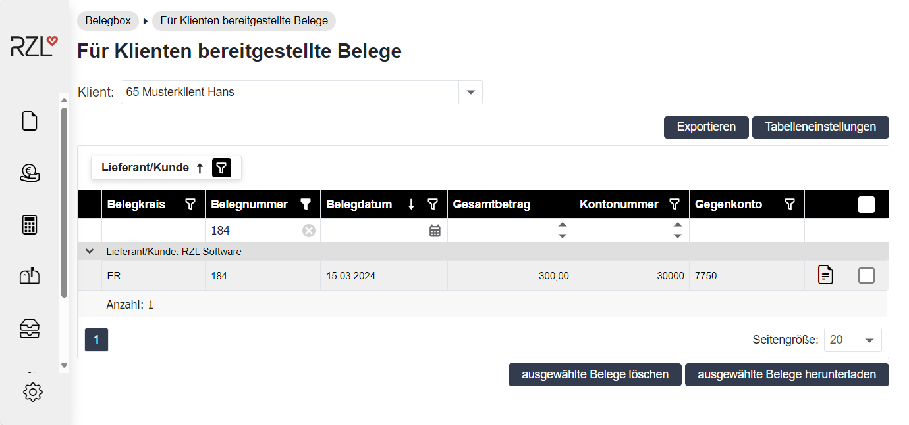{width="6.330708661417323in"
height="2.968503937007874in"}

**2**

**1**

Durch einen Klick auf das Belegsymbol kann der Beleg geöffnet werden.

Abb. 7-4 Belegbox -- Details / Ansicht Beleg

{width="6.2637795275590555in"
height="3.9330708661417324in"}

Im rechten unteren Bereich haben Sie die Möglichkeit, die ausgewählten
Belege zu löschen oder herunterzuladen. Beim Herunterladen wird im
Bereich Downloads ein ZIP-Ordner erstellt, der die ausgewählten Belege
in PDF Format beinhaltet.

#### Belegbox Export {#belegbox-export .Überschrift-4---VG}

Belege können über die Funktion *ausgewählte Belege herunterladen*
exportiert werden. Wenn Sie mehrere Belege ausgewählt haben, wird Ihnen
ein ZIP-Ordner, der die Belege beinhaltet, erstellt.

Sie haben weiters die Möglichkeit, die Belegbox als Darstellung
sämtlicher Belege in Tabellenform im PDF- oder Excel Format
(Schaltfläche *Export PDF* / *Export Excel*) zu exportieren. Ist ein
Filter aktiviert, werden nur die angezeigten Daten exportiert.

## Von Klienten hochgeladene Belege

Sie können unter diesem Menüpunkt sehen, welche Belege der Klient
hochgeladen hat. Ist im Feld *Heruntergeladen* nichts vermerkt, dann
wurden die Belege noch nicht ins KIS/ Board übertragen.

Abb. ‑ Von Klienten hochgeladene Belege

{width="6.47244094488189in"
height="3.7913385826771653in"}

Die Belege werden im Board durch Anwahl des Schaltfläche *Belege
Klientenportal* (**1**) heruntergeladen und können weiterbearbeitet bzw.
übernommen werden.

Abb. ‑ Vom Klienten hochgeladene Belege -- Herunterladen im Board

{width="6.405511811023622in"
height="3.574803149606299in"}

**1**

**Stichwortverzeichnis**

# A {#a .index-heading}

Administrator 5

Auswertungen 60

Journalzeilen 60

Kontensalden 60

Saldenliste 60

# B {#b .index-heading}

Belegbox 68

Benutzer 16

Berechtigungen 17

Buchungsregeln 12, 55, 56, 57, 58

# D {#d .index-heading}

Datenverbrauch 39

Dienstnehmer 62

Anlage 62

Dokumente hochladen 67

Nachrichten übermitteln 64

Stammdaten 63

Dokumente 30

an alle Klienten übermitteln 31

an einen Dienstnehmer übermitteln 32

aus dem KIS übermitteln 32

für einzelne Klienten bereitstellen 30

# E {#e .index-heading}

Einrichtung 5, 7, 23

Benutzer 16

Berechtigungen 17

E-Mail 15

E-Mail Adresse ändern 28

E-Mail Einstellungen 23

E-Mail Texte 23

# F {#f .index-heading}

Farben 25

Finanzbuchhaltung 51

# K {#k .index-heading}

Kanzleibenutzer 21

Kategorien 39

KIS 9

Klientenstammdaten 9

Kontenplan

bereitstellen 51

Kostenstellen 54

# L {#l .index-heading}

Logo 26

Lohnverrechnung 43

Daten bereitstellen 43

Eingabemasken 43

freigegebene Daten 47

GKK Meldungen 48

rota-Schnittstelle 49

# M {#m .index-heading}

Mein Profil 28

Menü-Modus 28

Mindestangaben-Anmeldungen 48

# N {#n .index-heading}

Nachrichtenübermittlung 36

# P {#p .index-heading}

Passwort 24

Passwort ändern 28

Plug-Ins 6

# R {#r .index-heading}

Registrierkassen

anlegen 55

Stammdaten 13

rota-Schnittstelle 49

# S {#s .index-heading}

Stammdaten

Kanzlei 9

Kanzleibenutzer 21

Klient 9

Portal 23

Start-Adresse 5

# Z {#z .index-heading}

ZMV 10
