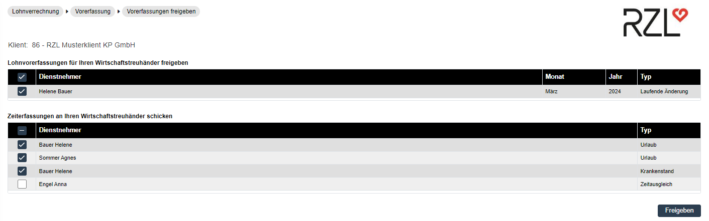
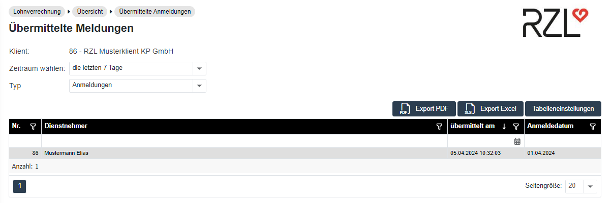

{width="8.250449475065617in"
height="11.667361111111111in"}

Handbuch & Dokumentation zum RZL Klientenportal-Programm

**Impressum**

Herausgeber\
RZL Software GmbH\
Hannesgrub Nord 35, 4911 Tumeltsham

Support Hotline 07752/252-34\
E-Mail klientenportal@rzl.at

rzlSoftware.at

Handbuch Klientenportal

Version A25

Alle Rechte an diesem Handbuch vorbehalten. Jede Verwertung ohne
ausdrückliche schriftliche Zustimmung des Herausgebers ist untersagt.
Vervielfältigungen sind nur im Rahmen der mit uns abgeschlossenen
Lizenz- und Wartungsverträge für den lizenzierten Standort erlaubt.

© RZL-Software, Tumeltsham

# Inhaltsverzeichnis {#inhaltsverzeichnis .TOC-Heading}

[1 Ersteinstieg und Einrichtung
[5](#ersteinstieg-und-einrichtung)](#ersteinstieg-und-einrichtung)

[1.1 Der RZL Klientenportal-Klientenzugang
[5](#der-rzl-klientenportal-klientenzugang)](#der-rzl-klientenportal-klientenzugang)

[1.1.1 Startinformation [5](#startinformation)](#startinformation)

[1.1.2 Einstieg ins RZL Klientenportal
[5](#einstieg-ins-rzl-klientenportal)](#einstieg-ins-rzl-klientenportal)

[1.1.3 Anmeldung [5](#anmeldung)](#anmeldung)

[1.1.4 Navigation und Abmeldung
[6](#navigation-und-abmeldung)](#navigation-und-abmeldung)

[1.2 Passwortverlust [6](#passwortverlust)](#passwortverlust)

[1.3 Mein Profil [7](#mein-profil)](#mein-profil)

[1.3.1 Spracheinstellungen
[7](#spracheinstellungen)](#spracheinstellungen)

[1.3.2 Menü Modus [7](#menü-modus)](#menü-modus)

[1.3.3 Passwort ändern [8](#passwort-ändern)](#passwort-ändern)

[1.3.4 E-Mail Adresse ändern
[8](#e-mail-adresse-ändern)](#e-mail-adresse-ändern)

[2 Informationsaustausch
[8](#informationsaustausch)](#informationsaustausch)

[2.1 Dokumente empfangen und übermitteln
[8](#dokumente-empfangen-und-übermitteln)](#dokumente-empfangen-und-übermitteln)

[2.1.1 Empfangene Dokumente aufrufen
[8](#empfangene-dokumente-aufrufen)](#empfangene-dokumente-aufrufen)

[2.1.2 Dokumente an die WT-Kanzlei übermitteln
[10](#dokumente-an-die-wt-kanzlei-übermitteln)](#dokumente-an-die-wt-kanzlei-übermitteln)

[2.1.3 Dienstnehmerdokumente an die WT- Kanzlei übermitteln
[11](#dienstnehmerdokumente-an-die-wt--kanzlei-übermitteln)](#dienstnehmerdokumente-an-die-wt--kanzlei-übermitteln)

[2.2 Nachrichtenübermittlung
[12](#nachrichtenübermittlung)](#nachrichtenübermittlung)

[2.2.1 Nachrichten empfangen
[12](#nachrichten-empfangen)](#nachrichten-empfangen)

[2.2.2 Nachrichten an die WT-Kanzlei übermitteln
[13](#nachrichten-an-die-wt-kanzlei-übermitteln)](#nachrichten-an-die-wt-kanzlei-übermitteln)

[2.2.3 Nachrichten an einen Dienstnehmer übermitteln
[14](#nachrichten-an-einen-dienstnehmer-übermitteln)](#nachrichten-an-einen-dienstnehmer-übermitteln)

[2.2.4 Gesendete Nachrichten
[15](#gesendete-nachrichten)](#gesendete-nachrichten)

[3 Lohnverrechnung [16](#lohnverrechnung)](#lohnverrechnung)

[3.1 Versichertenmeldung reduziert / Anmeldung fallweise Beschäftigte
[16](#versichertenmeldung-reduziert-anmeldung-fallweise-beschäftigte)](#versichertenmeldung-reduziert-anmeldung-fallweise-beschäftigte)

[3.1.1 Erfassen einer Versichertenmeldung reduziert / Anmeldung
fallweise Beschäftigter
[16](#erfassen-einer-versichertenmeldung-reduziert-anmeldung-fallweise-beschäftigter)](#erfassen-einer-versichertenmeldung-reduziert-anmeldung-fallweise-beschäftigter)

[3.1.2 Versenden der Meldungen
[17](#versenden-der-meldungen)](#versenden-der-meldungen)

[3.1.3 Erfassung zusätzlicher Stammdaten für den Wirtschaftstreuhänder
[18](#erfassung-zusätzlicher-stammdaten-für-den-wirtschaftstreuhänder)](#erfassung-zusätzlicher-stammdaten-für-den-wirtschaftstreuhänder)

[3.1.4 Storno einer Versichertenmeldung reduziert / Anmeldung fallweise
Beschäftigter
[19](#storno-einer-versichertenmeldung-reduziert-anmeldung-fallweise-beschäftigter)](#storno-einer-versichertenmeldung-reduziert-anmeldung-fallweise-beschäftigter)

[3.1.5 Import Anmeldungen
[20](#import-anmeldungen)](#import-anmeldungen)

[3.2 Vorerfassung [21](#vorerfassung)](#vorerfassung)

[3.2.1 Erfassen der Daten
[21](#erfassen-der-daten)](#erfassen-der-daten)

[3.2.2 Freigeben (absenden) der Daten
[26](#freigeben-absenden-der-daten)](#freigeben-absenden-der-daten)

[3.3 Übersicht [26](#übersicht)](#übersicht)

[3.3.1 Übermittelte Anmeldungen
[26](#übermittelte-anmeldungen)](#übermittelte-anmeldungen)

[3.3.2 Protokolle der reduzierten Anmeldungen
[27](#protokolle-der-reduzierten-anmeldungen)](#protokolle-der-reduzierten-anmeldungen)

[3.3.3 Freigegebene Vorerfassungen
[28](#freigegebene-vorerfassungen)](#freigegebene-vorerfassungen)

[3.3.4 Dienstnehmerliste [28](#dienstnehmerliste)](#dienstnehmerliste)

[4 Finanzbuchhaltung [29](#finanzbuchhaltung)](#finanzbuchhaltung)

[4.1 Eingabe der Vorerfassungen
[29](#eingabe-der-vorerfassungen)](#eingabe-der-vorerfassungen)

[4.1.1 Allgemeine Bedienung des Erfassungsdialogs
[30](#allgemeine-bedienung-des-erfassungsdialogs)](#allgemeine-bedienung-des-erfassungsdialogs)

[4.1.2 Bearbeitung bereits erfasster Buchungszeilen
[32](#bearbeitung-bereits-erfasster-buchungszeilen)](#bearbeitung-bereits-erfasster-buchungszeilen)

[4.2 Registrierkassendaten verarbeiten
[33](#registrierkassendaten-verarbeiten)](#registrierkassendaten-verarbeiten)

[4.3 Freigabe der Vorerfassungen
[34](#freigabe-der-vorerfassungen)](#freigabe-der-vorerfassungen)

[4.4 Übersicht -- freigegebene Vorerfassungen
[35](#übersicht-freigegebene-vorerfassungen)](#übersicht-freigegebene-vorerfassungen)

[4.5 Stammdaten [38](#stammdaten)](#stammdaten)

[4.5.1 Kassa/Bankbuch [38](#kassabankbuch)](#kassabankbuch)

[4.5.2 Erfassungstexte [39](#erfassungstexte)](#erfassungstexte)

[4.6 Auswertungen aus der RZL Fibu bzw. EA-Rechnung
[39](#auswertungen-aus-der-rzl-fibu-bzw.-ea-rechnung)](#auswertungen-aus-der-rzl-fibu-bzw.-ea-rechnung)

[4.6.1 Auswertung Journal
[42](#auswertung-journal)](#auswertung-journal)

[4.6.2 Auswertung Saldenliste
[42](#auswertung-saldenliste)](#auswertung-saldenliste)

[4.6.3 Auswertung Konto [43](#auswertung-konto)](#auswertung-konto)

[5 Belegbox [44](#belegbox)](#belegbox)

[5.1 RZL Scan-Manager [45](#rzl-scan-manager)](#rzl-scan-manager)

[5.1.1 Verbindungseinstellungen eintragen
[45](#verbindungseinstellungen-eintragen)](#verbindungseinstellungen-eintragen)

[5.1.2 Belege scannen und hochladen
[46](#belege-scannen-und-hochladen)](#belege-scannen-und-hochladen)

[5.1.3 Bereits vorhandene Belege in den RZL Scan-Manager einfügen
[48](#bereits-vorhandene-belege-in-den-rzl-scan-manager-einfügen)](#bereits-vorhandene-belege-in-den-rzl-scan-manager-einfügen)

[5.2 Belege ohne Scan-Manager übermitteln
[48](#belege-ohne-scan-manager-übermitteln)](#belege-ohne-scan-manager-übermitteln)

[5.3 Protokoll der übermittelten Belege
[49](#protokoll-der-übermittelten-belege)](#protokoll-der-übermittelten-belege)

[5.4 Noch nicht verbuchte Belege
[49](#noch-nicht-verbuchte-belege)](#noch-nicht-verbuchte-belege)

[5.5 Verbuchte Belege (Belegarchiv)
[50](#verbuchte-belege-belegarchiv)](#verbuchte-belege-belegarchiv)

[6 Mobile Version [54](#mobile-version)](#mobile-version)

[7 Allgemeine Stammdaten
[58](#allgemeine-stammdaten)](#allgemeine-stammdaten)

[7.1 Klient-Benutzer verwalten
[58](#klient-benutzer-verwalten)](#klient-benutzer-verwalten)

[7.1.1 Benutzer löschen [59](#benutzer-löschen)](#benutzer-löschen)

[7.1.2 Berechtigungen und Eingabemaskenzuordnungen
[59](#berechtigungen-und-eingabemaskenzuordnungen)](#berechtigungen-und-eingabemaskenzuordnungen)

# Ersteinstieg und Einrichtung

Dieses Kapitel befasst sich mit allgemeinen klientenbezogenen Aspekten
des RZL Klientenportals. Das sind die Browser-Bedienung, der
Klientenzugang und die Passwortänderung.

## Der RZL Klientenportal-Klientenzugang

### Startinformation

Die Wirtschaftstreuhänder-Kanzlei stellt Ihnen folgende Informationen
zur Verfügung:

-   *Allgemeine RZL Klientenportal-Startadresse*

-   *Klient-Sachbearbeiter-Zugang*

-   *Passwort des Sachbearbeiter-Zugangs*

Diese Informationen benötigen Sie beim Einstieg in das RZL
Klientenportal. Sie sind vertraulich und sollten entsprechend sicher
aufbewahrt werden. Von Ihrer Kanzlei können mehrere Zugänge mit
separaten Zugangsdaten angelegt werden.

### Einstieg ins RZL Klientenportal

Das RZL Klientenportal wird vollständig mittels Browser bedient. (z.B.
Microsoft Edge® in der aktuellsten Version). Geben Sie die von Ihrer
WT-Kanzlei zur Verfügung gestellte Startadresse ein. Sie gelangen auf
den Startbildschirm Ihres Klientenportals.

Abb. 1‑1 Anmeldung RZL Klientenportal

{width="2.1979166666666665in"
height="3.6382753718285215in"}

### Anmeldung 

Geben Sie zum Login die von Ihrer Kanzlei zur Verfügung gestellten
Benutzerdaten mit Passwort ein.

### Navigation und Abmeldung

Die Ansicht des RZL Klientenportals kann je nach Einstellungen und
lizensierten Modulen unterschiedlich sein.

Abb. 1‑2 Navigation

{width="2.2916666666666665in"
height="4.858338801399825in"}

Im unteren Bereich der Menüleiste wird Ihr Benutzername -- hier
beispielhaft *86.Klientenbenutzer* -- angezeigt.

Melden Sie sich nach Abschluss Ihrer Arbeit am Klientenportal über die
Schalfläche *Abmelden* ab.

## Passwortverlust 

Jeder Benutzer kann selbstständig ein neues Passwort anfordern, nachdem
ein falsches Passwort eingegeben wurde. Mit einem Klick auf die
Schaltfläche *Passwort zurücksetzen* wird ein neues Passwort an die beim
Benutzer hinterlegte E-Mail Adresse geschickt. Nach dem erneuten
Einloggen muss vom Benutzer ein neues Passwort vergeben werden. Weiters
kann auch von der Wirtschaftstreuhänder-Kanzlei ein neues Passwort
erbeten werden.

Abb. 1‑3 Passworteingabe

{width="2.3925054680664917in"
height="4.218222878390201in"}

## Mein Profil

Mit Betätigen des Zahnrädchens bei Ihrem Benutzernamen öffnet sich die
Profilübersicht. Hier haben Sie die Möglichkeit benutzerbezogene
Einstellungen vorzunehmen.

### Spracheinstellungen

Es besteht die Möglichkeit die Sprache des RZL Klientenportals auf
Englisch umzustellen. Betätigen Sie hierfür das Zahnrädchen neben dem
Benutzer. Unter *Mein Profil* */ Allgemeine Einstellungen* können Sie
die Sprache anpassen.

Abb. 1‑4 Spracheinstellung

{width="6.5625in"
height="1.5932425634295713in"}

### Menü Modus

Ihnen stehen 4 verschiedene Menü Modi zur Verfügung:

**Standard:** Im Menü Modus Standard öffnet sich die Sidebar sobald Sie
einen Menüpunkt anwählen. Die Icons der Menüpunkte bleiben fixiert in
der Menüleiste.

**Fixiert Groß:** Wählen Sie diesen Menü Modus bleibt die Sidebar mit
den Menüpunkten und den dazugehörigen Icons dauerhaft angezeigt.

**Fixiert Klein:** Hier werden die Icons der Menüpunkte dauerhaft in der
Sidebar angezeigt.

**Fixiert Klein mit Text:** In diesem Menü Modus werden die Icons
dauerhaft angezeigt. Die Bezeichnung der Menüpunkte wird klein darunter
angeführt.

Der Menü Modus kann jederzeit umgestellt werden und wird sofort
aktualisiert. Ein zusätzliches Speichern ist nicht notwendig.

### Passwort ändern

Hier haben Sie die Möglichkeit das eigene Passwort für den Einstieg ins
RZL Kientenportal zu ändern. Mit der Schaltfläche
*Sicherheitseinstellung* können Sie sich informieren, welche Bedingungen
für das Passwort von Ihrem Wirtschaftstreuhänder festgelegt wurden. Mit
*Übernehmen* werden die Änderungen gespeichert.

### E-Mail Adresse ändern

Unter diesem Menüpunkt kann die eigene E-Mail Adresse angepasst werden.
Die hier hinterlegte E-Mail Adresse wird vom Klientenportal für die
Benachrichtigungen verwendet. Nach zweimaliger Eingabe wird die E-Mail
Adresse mit der Schaltfläche *Übernehmen* gespeichert.

# Informationsaustausch 

## Dokumente empfangen und übermitteln 

Die Dokumentenverwaltung des RZL Klientenportals ermöglicht Ihnen eine
einfache und sichere Dokumentenübermittlung von und zu Ihrem
Wirtschaftstreuhänder sowie mit Ihren Dienstnehmern.

### Empfangene Dokumente aufrufen

Bei Erhalt eines Dokuments am Klientenportal empfangen Sie zunächst ein
Informationsmail an Ihre persönliche E-Mail-Adresse. Beim anschließenden
Login in Ihr Klientenportal wird der Eingang auch in der
Protokollansicht (Startbildschirm) angezeigt.

Sie können die von Ihrer WT-Kanzlei bzw. von Ihren Dienstnehmern
hochgeladenen Dokumente jederzeit im Programmteil *Informationsaustausch
/ Empfangene Dokumente* aufrufen. Die Anzeige der empfangenen Dokumente
ist in *Kanzleidokumente* und *Dienstnehmerdokumente* unterteilt.

Abb. 2‑1 Ansicht -- Empfangene Dokumente

{width="6.4150415573053365in"
height="4.373611111111111in"}

Hier werden in chronologischer Reihenfolge die Dokumente angezeigt, die
Ihnen Ihre WT-Kanzlei bzw. Ihre Dienstnehmer gesendet haben. Durch einen
Klick auf die Spaltenbezeichnungen *Datei*, *Dokumentbereich* oder
*Empfangen* wird die Liste sortiert. Wählen Sie den Dateinamen an, um in
die Vorschau des Dokuments zu gelangen. Von dort aus kann das Dokument
gedruckt oder gespeichert werden.

Sie haben in der Übersicht die Möglichkeit Dateien zu löschen oder
herunterzuladen. Dafür wählen Sie in der letzten Spalte die gewünschte
Datei mit einem Häkchen an und betätigen die passende Schaltfläche
unten. Im Reiter *Dienstnehmerdokumente* steht Ihnen zusätzlich die
Schaltfläche *An den WT weiterleiten* zur Verfügung. Mit dieser wird die
angewählte Datei kommentarlos an den Wirtschaftstreuhänder
weitergeleitet.

Abb. 2‑2 Ansicht -- Empfangene Dokumente -- Dienstnehmerdokumente

{width="6.411746500437445in"
height="2.84375in"}

### Dokumente an die WT-Kanzlei übermitteln 

Über den Programmteil *Informationsaustausch / Dokumente übermitteln*
können Sie Dokumente für Ihre WT-Kanzlei hochladen.

Abb. 2‑3 Dokumente der WT-Kanzlei bereitstellen

{width="6.509522090988626in"
height="3.874715660542432in"}

Je nach Einstellung in der WT-Kanzlei können Sie im Bereich
*Dokumentbereich* aus mehreren Einträgen auswählen. Nach Auswahl des
Dokumentbereichs können Sie das Dokument durch Anwahl der Schaltfläche
*Dateien auswählen* suchen. Wählen Sie im anschließenden Dialogfenster
das gewünschte Dokument aus. Mit der Schaltfläche *Öffnen* wird das
Dokument übernommen und an den Wirtschaftstreuhänder übermittelt.

TIpp

Es ist hier eine Mehrfachauswahl an Dokumenten möglich. Halten Sie
hierfür die\
STRG-Taste gedrückt und wählen Sie die gewünschten Dokumente aus. Die
ausgewählten Dokumente werden dann alle unter demselben gewählten
Dokumentbereich übermittelt.

Direkt nach dem Hochladen erhält der zuständige Sachbearbeiter in der
WT-Kanzlei ein E-Mail, dass ein Dokument bereitgestellt wurde.

Abb. 2‑4 Bereitstellen eines Dokuments

{width="6.5172014435695536in"
height="3.8333333333333335in"}

In Ihrem Portal werden die bereitgestellten Dokumente im unteren Bereich
angezeigt und können durch einen Klick auf den Dateinamen geöffnet
werden.

#### Dokument löschen {#dokument-löschen .Überschrift-4---VG}

In der Listenansicht der übermittelten Dokumente können Sie ein Dokument
löschen, indem Sie es in der letzten Spalte anwählen und anschließend
die Schaltfläche *ausgewählte Dateien löschen* betätigen. Nach dem
Löschen steht dieses Dokument der WT-Kanzlei ebenfalls nicht mehr zur
Verfügung.

### Dienstnehmerdokumente an die WT- Kanzlei übermitteln

Über den Menüpunkt *Informationsaustausch / Dienstnehmerdokumente* *an
die Kanzlei übermitteln* können Sie Ihrer WT- Kanzlei
dienstnehmerbezogene Dokumente zur Verfügung stellen.

Abb. 2‑5 Bereitstellen eines Dienstnehmerdokuments

{width="6.097045056867891in"
height="3.128383639545057in"}

Bei der Auswahl des betroffenen Dienstnehmers stehen Ihnen die Suche
nach Namen, Dienstnehmernummer sowie SV-Nummer zur Verfügung. Über die
Schaltfläche *Datei auswählen* öffnet sich ein Dialogfenster zur Auswahl
des gewünschten Dokuments. Mit *Öffnen* wird die Datei übernommen und an
den WT übermittelt.

## Nachrichtenübermittlung

Die Nachrichtenübermittlung im RZL Klientenportal bietet Ihnen die
Möglichkeit, Nachrichten an Ihre Wirtschaftstreuhänder bzw. an Ihre
Dienstnehmer verschlüsselt über die https-gesicherte Verbindung zu
senden bzw. zu empfangen.

### Nachrichten empfangen

Eingegangene Nachrichten werden beim Ersteinstieg nach Erhalt der
Nachricht im Startbildschirm unter Protokolle angezeigt. Sie können die
Nachricht sofort durch Anwahl des Textes öffnen.

Abb. 2‑6 Protokoll empfangene Nachrichten

{width="6.534503499562555in"
height="2.741663385826772in"}

Empfangene Nachrichten können Sie auch im Menü *Informationsaustausch /
Empfangene Nachrichten* abrufen.

Abb. 2‑7 Empfangene Nachrichten

{width="6.322916666666667in"
height="3.668992782152231in"}

In der Nachrichtenansicht können Sie durch Klick auf die
Überschriftenzeile Sortierungen vornehmen. Mit Anwahl des \>-Symbols in
der ersten Spalte öffnet sich die Nachricht und der Anhang kann
aufgerufen werden.

#### Antwort auf empfangene Nachrichten {#antwort-auf-empfangene-nachrichten .Überschrift-4---VG}

Durch Anwahl des Brief-Symbols können Sie sofort eine Antwort erstellen
und senden.

**Vorhergehende Nachricht aufrufen / Antwort aufrufen**

Stehen bei der angewählten Nachricht zugehörige Nachrichten zur
Verfügung, kann über die Schaltflächen *Vorhergehende Nachricht
aufrufen* und *Antwort aufrufen* direkt in die Liste der gesendeten
Nachrichten gewechselt werden. Die vorhergehende Nachricht bzw. Antwort
werden automatisch geöffnet.

**Anhänge herunterladen**

Beinhaltet die Nachricht einen Anhang kann dieser durch Anwahl des
Kästchens in der letzten Spalte und mit dem *Menüpunkt ausgewählte
Dateien herunterladen* gespeichert werden.

### Nachrichten an die WT-Kanzlei übermitteln

Über den Menüpunkt *Informationsaustausch / Nachricht übermitteln*
können Sie Nachrichten inklusive Anhang geschützt an die WT-Kanzlei
senden.

Abb. 2‑8 Nachrichten versenden

{width="6.575in" height="5.120698818897638in"}

**Dokumentbereich**

Wählen Sie den benötigten Dokumentbereich im Drop-Down Menü an. Die zur
Verfügung stehenden Dokumentbereiche werden von Ihrer WT-Kanzlei
festgelegt.

**Gültig Bis**

Nach Auswahl des Dokumentbereiches können Sie im Feld *Gültig Bis* ein
Enddatum der Nachricht hinterlegen. Die Nachricht wird nach diesem Datum
automatisch vom Portal gelöscht.

**Betreff**

Geben Sie hier einen Nachrichtenbetreff ein.

**Nachricht**

Hier geben Sie die gewünschte Nachricht an Ihren Kanzleisachbearbeiter
ein. Ihnen stehen verschiedene Formatierungsmöglichkeiten zur Verfügung.
Mit der Tastenkombination STRG+RETURN können Sie einen Zeilenumbruch
definieren.

**Dokumente**

Sie können optional ein Dokument an die Nachricht anhängen. Diese werden
dann nicht nur in der Übersicht der gesendeten Nachrichten, sondern auch
in der Dokumentenansicht angezeigt.

Wählen Sie über *Datei auswählen* das gewünschte Dokument aus.

Mit der Schaltfläche *Nachricht senden* wird die Nachricht an den
zuständigen Kanzleisachbearbeiter der WT-Kanzlei übermittelt. Dieser
erhält bei korrekter Einstellung in den Klientenstammdaten eine
automatische Email-Benachrichtigung über den Nachrichteneingang.

Die versendeten Nachrichten können jederzeit über *Informationsaustausch
/ Gesendete Nachrichten* eingesehen werden (Kapitel 2.2.4, Seite
[15](#gesendete-nachrichten)).

### Nachrichten an einen Dienstnehmer übermitteln

Zur gesicherten Übermittlung von Nachrichten inklusive eines Anhangs an
Ihre Dienstnehmer wählen Sie den Menüpunkt *Informationsaustausch /
Nachricht an einen Dienstnehmer übermitteln* an.

Abb. 2‑9 Nachrichten an Dienstnehmer versenden

{width="6.46875in"
height="5.169150262467191in"}

Nach Auswahl des gewünschten Dienstnehmers im Drop-Down Menü und Eingabe
eines Betreffs kann die Nachricht inkl. Anhang verfasst und über
*Nachricht senden* an den Dienstnehmer übermittelt werden. Dieser erhält
dann eine Benachrichtigung an die hinterlegte E-Mail-Adresse über den
Eingang der Nachricht. Sie finden diese Nachrichten ebenfalls im Menü
*Informationsaustausch / Gesendete Nachrichten.*

### Gesendete Nachrichten

Im Programmteil *Informationsaustausch / Gesendete Nachrichten* finden
Sie das Archiv der versendeten Nachrichten. Diese werden bis zum
eingegebenen Gültigkeitsdatum angezeigt bzw. gespeichert und können
jederzeit auch manuell gelöscht werden. Mit Anwahl des \>- Symbols
können Sie die Detailansicht der Nachrichten inklusive des Anhangs
öffnen.

# Lohnverrechnung

Im Bereich Lohnverrechnung stehen Ihnen umfangreiche Eingabe- und
Meldemöglichkeiten zur Verfügung. Sie können dabei nicht nur die Daten
für Ihren Wirtschaftstreuhänder vorerfassen und diese austauschen,
sondern auch Versichertenmeldungen und Anmeldungen fallweise
Beschäftigter direkt an die Gebietskrankenkasse melden. Die
Grundeinstellungen und Berechtigungen dafür werden von der Kanzlei
vordefiniert.

## Versichertenmeldung reduziert / Anmeldung fallweise Beschäftigte

### Erfassen einer Versichertenmeldung reduziert / Anmeldung fallweise Beschäftigter

Der Programmteil *Lohnverrechnung / Anmeldung/ Anmeldung erfassen*
bietet Ihnen die Möglichkeit, Ihre Dienstnehmer direkt und
zeitunabhängig bei der Gesundheitskasse anzumelden. Die Daten können
anschließend von der Kanzlei abgerufen und weiterverarbeitet werden.

Abb. 3‑1 Erfassung einer Versichertenmeldung reduziert

{width="5.40625in"
height="5.982987751531058in"}

Mit der Drop-Down Auswahl *Neuer Dienstnehmer* können Sie einen neuen
Dienstnehmer anlegen. Hier können auch bereits vorhandene Dienstnehmer
angewählt werden, die erneut eintreten.

Alle für die Anmeldung notwendigen Pflichtfelder sind mit einem
Sternchen gekennzeichnet. Nach Eingabe der Dienstnehmerdaten werden die
Eingaben mit der Schaltfläche *Speichern* übernommen.

Abb. 3‑2 Ansicht nach dem Speichern der reduzierten Anmeldung

{width="6.626376859142607in"
height="2.9791666666666665in"}

**3**

**2**

**1**

Sie können mehrere Dienstnehmer hintereinander erfassen und anschließend
gesammelt der ÖGK weiterleiten. Eine Falscherfassung kann mit Anwahl des
Namens (**1**) bearbeitet bzw. durch Anwahl des Papierkorbsymbols
(**2**) wieder gelöscht werden.

Nach Erfassung der Daten wählen Sie die Schaltfläche *Anmeldungen
übermitteln* (**3**) an.

### Versenden der Meldungen

Im Programmteil *Lohnverrechnung / Anmeldung / Anmeldungen übermitteln*
werden die Meldungen bzw. auch Stornomeldungen an die ÖGK versendet.

Abb. 3‑3 Anmeldungen an die ÖGK übermitteln

{width="6.625694444444444in"
height="2.229022309711286in"}

Wenn Sie nur Testübermittlungen durchführen wollen, müssen Sie das Feld
*Echtdaten übermitteln* deaktivieren.

Nach Anwahl der Schaltfläche *Übermitteln* werden die Daten der
aktivierten Dienstnehmer an die ÖGK übermittelt. Der zuständige
Kanzleisachbearbeiter erhält eine Nachricht über die Übermittlung und
kann diese anschließend abrufen.

Abb. 3‑4 Anzeige Übermittlungsprotokoll

{width="6.697916666666667in"
height="2.9457972440944884in"}

Nach dem Übermitteln können Sie durch Anwahl des Protokollnamens die
ÖGK-Protokolle sofort aufrufen und ausdrucken.

Abb. 3‑5 Aufruf ÖGK Übermittlungsprotokoll

{width="4.978984033245844in"
height="3.670297462817148in"}

Mit dem Eintrag *Drucken* links unten können Sie das Protokoll
ausdrucken.

### Erfassung zusätzlicher Stammdaten für den Wirtschaftstreuhänder

Für die Erfassung von zusätzlichen Stammdaten kann Ihr
Wirtschaftstreuhänder 2 verschiedene Optionen verwenden.

Die Option *Erfassung zusätzlicher Stammdaten händisch anwählen*
ermöglicht das Versenden mehrerer Anmeldungen hintereinander.
Nachfolgend wechseln Sie in den Programmteil *Lohnverrechnung /
Vorerfassung / Eintritte* und können für die einzelnen - zuvor bei der
ÖGK gemeldeten Dienstnehmer - weitere Eintrittsdaten erfassen und an den
Wirtschaftstreuhänder übermitteln.

Die Option *Automatische Erfassung zusätzlicher Stammdaten* ermöglicht
das Versenden der Meldungen und die zusätzliche Stammdatenerfassung pro
Dienstnehmer Zug um Zug. Diese Vorgehensweise wird von RZL empfohlen.

Tipp

Ihr Wirtschaftstreuhänder kann Ihnen die bei Ihnen ausgewählte Option
mitteilen und eine Beschreibung der notwendigen Eingaben zukommen
lassen.

### Storno einer Versichertenmeldung reduziert / Anmeldung fallweise Beschäftigter

An die ÖGK übermittelte Meldungen im Programmteil *Lohnverrechnung /
Anmeldung/ Anmeldung* *stornieren* storniert werden. Wählen Sie dazu den
gewünschten Dienstnehmer im Drop-Down Menü aus.

Abb. 3‑6 Storno Anmeldung

{width="6.618777340332459in"
height="6.254183070866142in"}

Die Daten der bereits gesendeten Anmeldungen werden automatisch
eingetragen und Sie müssen lediglich die Schaltfläche *Speichern*
anwählen.

Die erstellte Stornomeldung erscheint in der Auflistung und kann
anschließend an die ÖGK über den Menüpunkt *Stornomeldung übermitteln*
gesendet werden (Kapitel 3.1.2, Seite [17](#versenden-der-meldungen)).

### Import Anmeldungen

Der Programmteil *Lohnverrechnung/ Anmeldung / Anmeldungen importieren*
bietet die Möglichkeit mehrere Anmeldungen gleichzeitig ins
Klientenportal mittels Listenform zu importieren.

Abb. 3‑7 Reduzierte Anmeldung Datei-Import

{width="6.701632764654418in"
height="1.1965277777777779in"}

Nach Anwahl des gewünschten Klienten im Drop-Down Menü kann über
*Durchsuchen* die Importdatei ausgewählt und mit der Schaltfläche
*CSV-Datei verarbeiten* hochgeladen werden.

**Schnittstellenaufbau der Importdatei**

Die Importdatei muss das Datenformat .csv/.txt aufweisen. Die einzelnen
Felder werden durch Strichpunkte voneinander getrennt. Die Eingrenzung
der Felder muss durch Anführungszeichen gekennzeichnet werden.

Die zu importierende Datei muss dabei folgenden Aufbau aufweisen:

Tab. 3‑8 Feldbeschreibung Importschnittstelle Anmeldung

+---+---------------------------------+---------+---------+------------+
| N | Feld                            | M       | Pfli    | Format     |
| r |                                 | aximale | chtfeld |            |
| . |                                 |         |         |            |
|   |                                 | Fe      |         |            |
|   |                                 | ldlänge |         |            |
+===+=================================+=========+=========+============+
| 1 | Familienname                    | 70      | J       | Freitext   |
+---+---------------------------------+---------+---------+------------+
| 2 | Vorname                         | 70      | J       | Freitext   |
+---+---------------------------------+---------+---------+------------+
| 3 | Geschlecht                      | 1       | J       | m/w        |
+---+---------------------------------+---------+---------+------------+
| 4 | Geburtsdatum                    | 8       | J       | TT.MM.JJJJ |
+---+---------------------------------+---------+---------+------------+
| 5 | SV-Nummer                       | 10      | n       | numerisch  |
+---+---------------------------------+---------+---------+------------+
| 6 | Dienstgeber Beitragskontonummer | 10      | J       | Freitext   |
|   | (GKK)                           |         |         |            |
+---+---------------------------------+---------+---------+------------+
| 7 | Anmeldedatum                    | 8       | J/N     | TT.MM.JJJJ |
+---+---------------------------------+---------+---------+------------+
| 8 | Fallweise Beschäftige: Jahr     | 4       | J/N     | JJJJ       |
+---+---------------------------------+---------+---------+------------+
| 9 | Fallweise Beschäftige: Monat    | 2       | J/N     | MM         |
+---+---------------------------------+---------+---------+------------+
| 1 | Fallweise Beschäftigte: Tage    |         | J/N     | TT, TT,    |
| 0 |                                 |         |         | TT,...     |
+---+---------------------------------+---------+---------+------------+
| 1 | Freier Dienstnehmer             | 1       | J       | j / n      |
| 1 |                                 |         |         |            |
+---+---------------------------------+---------+---------+------------+
| 1 | Arbeitsstätte Postleitzahl      | 4       | N       | numerisch  |
| 2 |                                 |         |         |            |
+---+---------------------------------+---------+---------+------------+
| 1 | Arbeitsstätte Ort               | 40      | N       | Freitext   |
| 3 |                                 |         |         |            |
+---+---------------------------------+---------+---------+------------+
| 1 | Beschäftigungsbereich           | 2       | J/N     | Siehe      |
| 4 |                                 |         |         | E          |
|   |                                 |         |         | rläuterung |
+---+---------------------------------+---------+---------+------------+
| 1 | Geringfügigkeit                 | 1       | J/N     | j / n      |
| 5 |                                 |         |         |            |
+---+---------------------------------+---------+---------+------------+
| 1 | Betrieblicher Vorsorgebeitrag   | 8       | J/N     | TT.MM.JJJJ |
| 6 |                                 |         |         |            |
+---+---------------------------------+---------+---------+------------+
| 1 | Akademischer Grad (vorher)      | 30      | N       | Freitext   |
| 7 |                                 |         |         |            |
+---+---------------------------------+---------+---------+------------+
| 1 | Akademischer Grad (nachher)     | 30      | N       | Freitext   |
| 8 |                                 |         |         |            |
+---+---------------------------------+---------+---------+------------+
| 1 | Staatsangehörigkeit             | 3       | J/N     | lt.        |
| 9 |                                 |         |         | ISOA3-Code |
+---+---------------------------------+---------+---------+------------+
| 2 | Wohnort, Land                   | 3       | J/N     | lt.        |
| 0 |                                 |         |         | Inter      |
|   |                                 |         |         | nationalem |
|   |                                 |         |         | Kraf       |
|   |                                 |         |         | tfahrzeugk |
|   |                                 |         |         | ennzeichen |
+---+---------------------------------+---------+---------+------------+
| 2 | Wohnort, PLZ                    | 4       | J/N     | Numerisch  |
| 1 |                                 |         |         |            |
+---+---------------------------------+---------+---------+------------+
| 2 | Wohnort, Ort                    | 50      | J/N     | Freitext   |
| 2 |                                 |         |         |            |
+---+---------------------------------+---------+---------+------------+
| 2 | Wohnort, Straße                 | 50      | J/N     | Freitext   |
| 3 |                                 |         |         |            |
+---+---------------------------------+---------+---------+------------+
| 2 | Wohnort, Hausnummer             | 10      | J/N     | Freitext   |
| 4 |                                 |         |         |            |
+---+---------------------------------+---------+---------+------------+
| 2 | Wohnort, Stück/Tür              | 10      | J/N     | Freitext   |
| 5 |                                 |         |         |            |
+---+---------------------------------+---------+---------+------------+

*Anmeldedatum*

Dieses Feld ist grundsätzlich ein Pflichtfeld ausgenommen bei einer
fallweisen Beschäftigungsmeldung.

*Fallweise Beschäftigte Jahr / Monat / Tag*

Diese Felder sind nur bei einer fallweisen Beschäftigungsmeldung
verpflichtend.

*Beschäftigungsbereich, Geringfügigkeit und Betriebliche
Vorsorgebeitrag*

Diese Felder sind bei der Versichertenmeldung reduziert verpflichtend.

*Erläuterungen Code Beschäftigungsbereich:*

-   01 = Arbeiter

-   02 = Angestellter

-   03 = Arbeiterlehrling

-   04 = Angestelltenlehrling

-   05 = Beamte

-   06 = Asylwerber

-   07 = Zivildiener

-   08 = Umschüler, Rehabilitanden -- Arbeiter

-   09 = Umschüler, Rehabilitanden -- Angestellter

-   10 = Mindestsicherung

-   11 = Sonstige Personen ohne KV-Schutz

*Staatsangehörigkeit, Wohnort Land/PLZ/Ort/Straße/Hausnummer/Stock/Tür*

Diese Felder sind Pflichtfelder, wenn keine Sozialversicherungsnummer
angegeben wird.

## Vorerfassung

Im Rahmen der Vorerfassung können Sie *laufende Änderungen*,
*Eintritte*, *Austritte*, *Urlaube,* *Krankenstände und Zeitausgleiche*
erfassen. Voraussetzung dafür ist die Freischaltung der jeweiligen
Eingabemasken durch den Wirtschaftstreuhänder.

### Erfassen der Daten

#### Laufende Änderungen {#laufende-änderungen .Überschrift-4---VG}

Wählen Sie im Menü *Lohnverrechnung / Vorerfassung / Laufende
Änderungen* in den Drop-Down Menüs zunächst den gewünschten Monat und
den Dienstnehmer aus.

Abb. 3‑9 Erfassung von laufenden Änderungen

{width="6.61327646544182in"
height="4.447916666666667in"}

**2**

**3**

**1**

Nach Auswahl des gewünschten Dienstnehmers erhalten Sie die Felder
angezeigt, die Ihnen von Ihrem Wirtschaftstreuhänder zur Erfassung der
Daten zur Verfügung gestellt wurden. Felder mit einem Sternchen vor der
Bezeichnung sind Pflichtfelder und müssen ausgefüllt werden.

Über den Feldern haben Sie die Möglichkeit zwischen Registeransicht und
Darstellung in Listenform umzuschalten. (**1**)

Sie können die erfassten Daten sofort an den Wirtschaftstreuhänder
übermitteln, indem Sie die Schaltfläche *Daten speichern und sofort
freigeben* (**2**) anwählen.

Abb. 3‑10 Laufende Erfassung -- Daten speichern und sofort freigeben.

{width="3.4881889763779528in"
height="1.2401574803149606in"}

Wenn Sie die Schaltfläche *OK* anwählen, können Sie einen weiteren
Dienstnehmer erfassen.

Nach Anwahl der Schaltfläche *Daten nur speichern* (**3**) werden die
für den ausgewählten Monat bereits erfassten Dienstnehmer angezeigt.
Durch Anwahl des Papierkorbs (ganz rechts in der Zeile mit den
Dienstnehmerdaten) können Sie die Vorerfassung wieder löschen.

Abb. 3‑11 Laufende Erfassung -- Daten speichern

{width="6.645833333333333in"
height="2.3235214348206474in"}

**1**

Die Vorerfassungen müssen nicht sofort an den Wirtschaftstreuhänder
weitergeleitet werden, sondern können nach Abschluss aller Eingaben
gesammelt übermittelt werden. Im Bereich *Dienstnehmer wählen* können
Sie die Daten weiterer Dienstnehmer erfassen.

Durch Anwahl der Schaltfläche *Zur Freigabe wechseln* (**1**) können Sie
direkt in den Programmteil (Kapitel 3.2.2, Seite
[26](#freigeben-absenden-der-daten)) zu Übermittlung der Daten an den
Wirtschaftstreuhänder wechseln.

#### Erfassung von Eintritten/Austritten {#erfassung-von-eintrittenaustritten .Überschrift-4---VG}

Wählen Sie im Menü *Lohnverrechnung / Vorerfassung / Eintritte* bzw.
*Austritte* an. Wählen Sie anschließend den gewünschten Monat und den
betroffenen Dienstnehmer an.

Bei einem Eintritt können Sie einen neuen Dienstnehmer anlegen bzw.
bereits ausgetretene Dienstnehmer mit einem Wiedereintritt erfassen.

Abb. 3‑12 Eintritte vorerfassen

{width="6.673611111111111in"
height="3.280551181102362in"}

Felder mit einem Sternchen am Beginn des Eingabefeldes sind
Pflichtfelder und müssen ausgefüllt werden. Auch hier können die Daten
des Dienstnehmers sofort an den Wirtschafstreuhänder übermittelt oder
zunächst nur gespeichert und später übertragen werden.

#### Erfassung von Urlaub und Krankenstand {#erfassung-von-urlaub-und-krankenstand .Überschrift-4---VG}

Wählen Sie dazu den gewünschten Menüpunkt *Lohnverrechnung /
Vorerfassung / Urlaub* bzw. *Krankenstand* an. Nach Anwahl des
Dienstnehmers erhalten Sie im oberen Bereich die bereits in der
Lohnverrechnung gespeicherten Zeilen angezeigt.

Abb. 3‑13 Erfassung von Urlauben

{width="6.783920603674541in"
height="3.5972222222222223in"}

**1**

In der Eingabemaske können Sie den Urlaub (bzw. Krankenstand) eingeben.
Durch Setzen des Häkchens *Sonderurlaub* kann der Urlaub als
Sonderurlaub gekennzeichnet werden. Im Text können Anmerkungen
hinterlegt werden. Um das Textfeld zu aktivieren, wählen Sie auf der
rechten Seite das *Schlosssymbol* an. Achten Sie bei diesem Feld darauf
keine personenbezogenen Daten einzutragen, die in Hinsicht der DSGVO
kritisch sein könnten.

Die Eingabe von Krankenstand erfolgt analog zur Urlaubseingabe. Ein
Arbeitsunfall kann durch die Option *Arbeitsunfall* gekennzeichnet
werden.

Sie können durch Anwahl der Schaltfläche *Zur Freigabe wechseln* (**1**)
direkt in den Programmteil für die Übermittlung der Daten an den
Wirtschaftstreuhänder einsteigen.

#### Erfassung von Urlaub in Tabellenform {#erfassung-von-urlaub-in-tabellenform .Überschrift-4---VG}

Über den Menüpunkt *Lohnverrechnung / Vorerfassung / Urlaub in
Tabellenform* haben Sie die Möglichkeit den Urlaub ihrer Dienstnehmer zu
erfassen. Die Dienstnehmer sind In Zeilen dargestellt.

Abb. 3‑14 Urlaubserfassung in Tabellenform

{width="6.5625in"
height="0.7284722222222222in"}{width="6.552083333333333in"
height="2.65706583552056in"}

**1**

Der Erfassungsdialog des Dienstnehmers kann mit dem *\>-Symbol* am
Anfang der Zeile geöffnet werden. Mit der Schaltfläche *neuen Urlaub
erfassen* öffnet sich eine neue Erfassungszeile. Die Felder *Von*, *Bis*
und *Dauer* sind Pflichtfelder. Erst nach Eingabe dieser Felder kann die
Zeile abgeschlossen bzw. eine neue Zeile begonnen werden. Handelt es
sich um *Sonderurlaub*, ist dieses Feld anzuwählen. Im Feld *Text* kann
ein beliebiger Text eingegeben werden, welcher mit in die
Lohnverrechnung übergeben wird.

Hat ein Dienstnehmer bereits erfassten Urlaub, wird in der zweiten
Spalte das *Papierblatt- Symbol* angezeigt. Die Zeilen werden als
Tooltip angezeigt.

Sollen die erfassten Zeilen an den Wirtschaftstreuhänder übermittelt
werden, klicken Sie oben auf die Schaltfläche *Zur Freigabe wechseln*
**(1).**

#### Erfassung von Zeitausgleich {#erfassung-von-zeitausgleich .Überschrift-4---VG}

Abb. 3‑15 Erfassung von Zeitausgleich

{width="6.72492782152231in"
height="2.3819444444444446in"}

Nach Auswahl des Dienstnehmers und anschließender Eingabe des Datums
können Sie die Arbeitsstunden und einen etwaigen Zuschlag erfassen. Die
Daten werden mit der Schaltfläche *Hinzufügen* gespeichert. Durch Anwahl
der Schaltfläche *Zur Freigabe wechseln* kommen Sie direkt in den
Programmteil zum Übermitteln der Daten an den Wirtschaftstreuhänder.

### Freigeben (absenden) der Daten 

Im Programmteil *Lohnverrechnung / Vorerfassung / Vorerfassungen
freigeben* werden die Dienstnehmer, für die Daten vorerfasst wurden,
angezeigt. Die Vorerfassungen werden in Lohnvorerfassungen und
Zeiterfassungen unterteilt.

Abb. 3‑16 Erfassungen an den Wirtschaftstreuhänder übermitteln

{width="6.5913899825021876in"
height="2.0694444444444446in"}

Wenn einzelne Erfassungen noch nicht übermittelt werden sollen, können
Sie das Häkchen in der ersten Spalte deaktivieren. Nur Dienstnehmer mit
einem Häkchen im Kästchen werden übermittelt.

Durch Anwahl der Schaltfläche *Freigeben* leiten Sie die Daten an den
Wirtschaftstreuhänder weiter. Der zuständige Klientensachbearbeiter
erhält eine Benachrichtigung per E-Mail und kann die Daten in die RZL
Lohnverrechnung übernehmen.

## Übersicht

Innerhalb des Programmteils *Lohnverrechnung / Übersicht* erhalten Sie
einen Überblick zu den Meldungen, ÖGK-Protokollen, freigegebenen
Vorerfassungen und aktuelle Dienstnehmerlisten, wenn diese vom
Wirtschaftstreuhänder zur Verfügung gestellt wurden.

### Übermittelte Anmeldungen

Die Ansicht *Übermittelte Anmeldungen* bietet einen Überblick über die
an die GK übermittelten Meldungen inklusive der Stornos.

Abb. 3‑17 Übermittelte reduzierte Anmeldungen

{width="6.590277777777778in"
height="2.1949343832020998in"}

Wählen Sie im Bereich *Zeitraum wählen* den gewünschten
Übermittlungszeitraum aus. Im Bereich *Typ* können Sie zwischen
Anmeldungen und Stornomeldungen auswählen. Durch Anwahl des
Dienstnehmernamens öffnet sich die Detailansicht der Meldung.

### Protokolle der reduzierten Anmeldungen 

Im Menü *Lohnverrechnung / Übersicht / Protokoll der Anmeldungen* werden
die ÖGK-Protokolle zunächst in einer Liste dargestellt.

Abb. 3‑18 Protokolle der GKK-Meldungen

{width="6.559070428696413in"
height="2.582225503062117in"}

**1**

**2**

Mit Klick auf den Dateinamen wird das Protokoll angezeigt und kann
ausgedruckt werden.

Über die Schaltfläche *Archivierung starten* **(1)** kann die Liste auf
aktuelle Protokolle gekürzt werden. Meldungen älter als 30 Tage bzw. 7
Tage werden archiviert. Sie finden diese in der Übersicht der
archivierten Protokolle.

Mit der Funktion *Ausgewählte Protokolle zusammenführen* **(2)** können
Sie gewünschte Meldungen durch Anwahl eines Häkchens in der letzten
Spalte zu einem PDF zusammenfügen.

Tipp

Sie benötigen beispielsweise alle ÖGK Bestätigungen der Dienstnehmer:
Filtern Sie dazu in der Spalte der Datei auf *Bestätigungen
Dienstnehmer*, wählen Sie anschließend in der letzten Spalte rechts alle
Dateien aus und führen Sie die Protokolle zusammen.

Abb. 3‑19 ÖGK-Protokoll Original

{width="5.035433070866142in"
height="3.831101268591426in"}

Mit der Option *Drucken* können Sie einen Ausdruck des Protokolls
vornehmen. Nach Anwahl der Schaltfläche *Drucken* können Sie den
gewünschten Drucker auswählen und den Ausdruck durchführen.

### Freigegebene Vorerfassungen

Im Menü *Lohnverrechnung / Übersicht / Freigegebene Vorerfassungen*
sehen Sie die an die Kanzlei bereits freigegebenen Vorerfassungen.

Abb. 3‑20 Ansicht -- Freigegebene Vorerfassungen

{width="6.554192913385827in"
height="1.6605413385826773in"}

Es ist standardmäßig der aktuelle Zeitraum ausgewählt. Im Drop-Down Menü
*Zeitraum wählen* stehen Ihnen weitere Auswahlmöglichkeiten zur
Verfügung. Sie können nach vorhandenen Zeiträumen bzw. nach den
Vorerfassungstypen filtern. Mit dem Eintrag *Alle Erfassungen* werden
Ihnen alle freigegebenen Vorerfassungen angezeigt.

### Dienstnehmerliste

In der Übersicht *Dienstnehmerliste* sehen Sie die in der
Lohnverrechnung gespeicherten Dienstnehmer inklusive
Abrechnungsinformationen.

Steht Ihnen dieser Menüpunkt nicht zur Verfügung, wurde er von Ihrem
Wirtschaftstreuhänder nicht freigeschaltet.

Abb. 3‑21 Ansicht - Dienstnehmer

{width="6.5625in"
height="1.549251968503937in"}

# Finanzbuchhaltung

Die Buchungsvorerfassung ermöglicht die einfache Eingabe der Kassa- und
Bankbewegungen. Aufgrund von Buchungstexten, die von Ihrem
Wirtschaftstreuhänder zur Verfügung gestellt werden, können die
Buchungszeilen automatisch vorkontiert werden. Ihr Wirtschaftstreuhänder
kann wahlweise die Kontierung für die Buchungsvorerfassung freischalten.
Nach Abschluss der Eingabe geben Sie die Vorerfassungen frei. Ihr
Wirtschaftstreuhänder kann nachfolgend die Buchungen in die
Finanzbuchhaltung bzw. Einnahmen-Ausgaben-Rechnung übernehmen und ggf.
Anpassungen vornehmen.

## Eingabe der Vorerfassungen

Nach Anwahl der Programmteils *Finanzbuchhaltung / Vorerfassung / Kassa
/Bankbuch* erhalten Sie folgende Ansicht.

Abb. 4‑1 Einstieg in der Vorerfassung

{width="6.731464348206474in"
height="1.2916666666666667in"}

Im Bereich *Datum* wählen Sie aus, für welchen Zeitraum Sie erfassen
wollen. Wenn Sie die Monate einzeln buchen möchten, können Sie immer
zwischen dem aktuellen Monat und den 5 vorangegangenen Monaten auswählen
und die Erfassung durchführen. Wenn Sie einen bestimmten Monat
auswählen, müssen Sie beim Erfassen der einzelnen Bewegungen nur das
Tagesdatum eintragen.

Sie können das aktuelle Jahr oder 6 Vorjahre auswählen. Wenn Sie ein
Jahr auswählen, können Sie jeden Monat des Jahres buchen. Bei dieser
Variante müssen Sie bei jeder Bewegung neben dem Tagesdatum auch den
Monat eintragen.

Im Bereich *Kassa/Bankbuch* können Sie zwischen den von Ihrem
Wirtschaftstreuhänder für Sie angelegten Kassa/Bankbüchern auswählen.

Abb. 4‑2 Buchungsvorerfassung - Eingabemaske

{width="6.3875in"
height="4.779418197725285in"}

In Ihrem Erfassungsdialog sehen Sie im oberen Bereich welche Periode Sie
buchen, welches Kassa/Bankbuch Sie ausgewählt haben und den Anfangs- und
Gesamtsaldo Ihres Kassa/Bankbuches.

Ein Monats- bzw. Jahressaldo wird angezeigt, wenn Buchungen vorhanden
sind, die erst später als der gewählte Zeitraum verbucht worden sind.
Dieser Saldo ist der Anfangssaldo inklusive des Saldos des gewählten
Zeitraums (Saldo der angezeigten Buchungen).

-   Im mittleren Bereich werden die bereits erfassten Bewegungen
    angezeigt.

-   Im unteren Bereich stehen die Felder für die Erfassungen der
    Bewegungen zur Verfügung.

### Allgemeine Bedienung des Erfassungsdialogs

Nachdem Sie im Eingabefeld einen Eintrag gemacht haben, kommen Sie durch
Anwahl der TABULATOR- oder der ENTER-Taste ein Feld weiter. Durch Anwahl
der Tastenkombination SHIFT -- TABULATOR kommen Sie ein Feld zurück. Die
einzelnen Eingabefelder können Sie auch mit der Maus ansteuern.

Durch Anwahl der ESC-Taste während der Erfassung, kommen Sie in das
erste Feld (Datum) zurück. Wenn Sie sich im Datumsfeld befinden und die
ESC-Taste anwählen, steigen Sie aus dem Erfassungsdialog aus.

#### Datum {#datum .Überschrift-4---VG}

Erfassen Sie nur einen Monat, tragen Sie bitte das Tagesdatum des Belegs
ein, den Sie erfassen. Wenn Sie ein ganzes Jahr erfassen, so ist neben
dem Tagesdatum auch der Monat einzutragen.

#### Beleg {#beleg .Überschrift-4---VG}

In diesem Feld ist die Belegnummer einzutragen. Bei der Erfassung des
ersten Buchungssatzes werden nach der Belegnummer automatisch ein +
angefügt. Das Programm zählt dann solange die Belegnummer automatisch
hoch bis Sie die Eintragung im Belegfeld herauslöschen oder
überschreiben.

#### Konto {#konto .Überschrift-4---VG}

Hat Ihr Wirtschaftstreuhänder die Vorkontierung freigeschaltet, können
Sie hier die Kontonummer eintragen. Durch Anwahl der STRG-Taste werden
die Konten laut Kontenplan aufrufen.

#### % (Prozentsatz) {#prozentsatz .Überschrift-4---VG}

In diesem Feld wird der (Steuer)-Prozentsatz des hinterlegten Kontos
angezeigt. Ist das Feld aktiv, kann der Prozentsatz von Ihnen eingegeben
werden.

Abweichende Vorsteuer buchen Sie mit dem Code 06 und fügen den
Vorsteuerbetrag direkt hinzu z. Bsp. 0613,02 -- Das Programm
berücksichtigt bei diesem Beleg eine abweichende Vorsteuer von EUR
13,02.

In den Feldern Prozent, Eingang und Ausgang, sofern sie aktiv sind, wird
durch Anwahl der STRG-Taste der Summierer aufgerufen.

Abb. 4‑3 Summierer

{width="3.3125in"
height="2.837930883639545in"}

Mit diesem Summierer können Sie Beträge aufsummieren und anschließend in
das Feld *Prozentsatz, Eingang bzw. Ausgang* übernehmen. Sie tragen den
Betrag im Feld ein und bestätigten diesen mit der TABULATOR-, RETURN-
oder ENTER-Taste. Einzelne Beträge können durch Anwahl des
Papierkorbsymbols gelöscht werden. Mit *Übernehmen* werden die Werte in
die Felder der Buchungsvorerfassung übergeben.

TIPP

Sie haben einen Beleg mit abweichender Vorsteuer? Im % -Feld geben Sie
den Code 06 ein, starten mit STRG den Summierer und rechnen die
benötigten Werte aus. Mit *Übernehmen* übergeben Sie die Werte in die
Buchungsvorerfassung.

#### Kostenstelle / Kostenträger {#kostenstelle-kostenträger .Überschrift-4---VG}

Wenn Ihr Wirtschaftstreuhänder den Eintrag von Kostenstellen /
Kostenträger freigeschaltet hat, können Sie auch die jeweilige
Kostenstelle und den jeweiligen Kostenträger bei der
Buchungsvorerfassung eintragen. Ist das jeweilige Konto bereits einer
Kostenstelle bzw. einem Kostenträger zugeordnet, erscheint Ihnen
diese(r) als Vorschlag. Wenn Ihr Wirtschaftstreuhänder Ihrem Benutzer
eine Kostenstelle bzw. einen Kostenträger zugewiesen hat, dann wird
diese(r) vorgeschlagen, auch wenn bei einem Konto etwas anderes
hinterlegt ist.

#### Eingang/Ausgang

Wenn ein Kassa- oder Bankeingang erfasst wird, ist der Betrag im Feld
*Eingang* einzugeben. Soll eine Ausgabe gebucht werden, geben Sie den
Betrag im Feld *Ausgang* ein.

#### Text

Die Anwahl der STRG-Taste im Textfeld zeigt Ihnen die Liste mit den vom
Wirtschaftstreuhänder angelegten Buchungstexten. Aus dieser Liste können
Sie den passenden Text anwählen. Wenn Sie einen Buchungstext selbst
eintragen, dann prüft das Programm nach der Eingabe von 3 Zeichen, ob es
entsprechende Texte gibt.

Aufgrund der verwendeten Buchungstexte erfolgt eine Verknüpfung mit
Kontonummern, die für den Import in die Finanzbuchhaltung bzw.
Einnahmen-Ausgaben-Rechnung verwendet werden. Diese Verknüpfungen können
Sie im Programmteil *Finanzbuchhaltung / Stammdaten / Erfassungstexte*
ansehen.

Wurde bei dieser Buchung noch kein Konto eingegeben bzw. ist das
Kontofeld inaktiv, wird das bei der Buchungsregel hinterlegte Konto
eingefügt.

Abb. 4‑4 Anzeige der Buchungsregel

{width="6.102362204724409in"
height="1.1272736220472441in"}

Wenn Sie Buchungstexte verwenden, wird unterhalb der Eingabefelder der
Vorschlag laut Buchungsregel ausgegraut angezeigt.

### Bearbeitung bereits erfasster Buchungszeilen

Wenn Sie eine bereits erfasste Zeile mit der Maus markieren
(Einfachklick), kann die Zeile durch Anwahl der *ENTF-Taste*
**gelöscht** werden. Bei Betätigen der *EINFG-Taste*, wird oberhalb der
markierten Zeile eine neue Buchungszeile **eingefügt**. Durch Anwahl des
Buchstaben *B* kann die markierte Zeile **bearbeitet** werden.

Mit Betätigen der *ALT- Taste + Pfeil nach oben/ unten* verschieben Sie
die ausgewählte **Erfassungszeile nach oben bzw. unten**.

Mit der Funktion *STRG + \#* werden alle nachfolgenden Belegnummern der
**Belegnummer der gewählten Buchungszeile angepasst.**

Wenn Sie eine Buchungszeile mit einem Doppelklick anwählen, können Sie
diese Zeile (nochmals) bearbeiten. Drücken Sie während dieses
neuerlichen Bearbeitens die ESC-Taste, wird die Bearbeitung abgebrochen.

Eine Übersicht aller Funktionen finden Sie unter *Hilfe für die
Erfassung* oberhalb des Buchungsdialogs.

## Registrierkassendaten verarbeiten

Belege, welche über die Kassandro-App erfasst und gedruckt wurden,
können im RZL-Klientenportal abgerufen und an den Steuerberater
weitergeleitet werden.

Unter dem Menüpunkt *Finanzbuchhaltung / Vorerfassung /
Registrierkassendaten* *verarbeiten* können Sie die Belege bis zum
gewünschten Datum mit der Schaltfläche *Datensätze abrufen* (**1**) von
Kassandro abrufen.

Abb. 4‑5 Registrierkassendaten verarbeiten

{width="6.554166666666666in"
height="4.67986220472441in"}

**2**

**1**

Nach dem Abruf stehen Ihnen die folgenden Auswahlmöglichkeiten zur
Weitergabe an den Steuerberater zur Verfügung. Bitte klären Sie vorher
mit Ihrem Buchhalter ab, wie die Buchungen weitergegeben werden sollen.

1.  *Je Artikel*: Die Belege werden getrennt pro Artikel übernommen.
    Jeder Artikel wird als separate Buchungszeile in der
    Finanzbuchhaltung erfasst.

<!-- -->

1.  *Je Beleg*: Die Kassenbelege werden pro Beleg übernommen.

2.  *Je Tag*: Die Kassenbelege werden pro Tag als Tageslosung in eine
    Buchungszeile zusammengeführt. Die Belegnummer kann dabei nicht
    mitübernommen werden.

Nach Anwahl der gewünschten Option werden die Buchungszeilen mit der
Schaltfläche *importieren* (**2**) in die Buchungsvorerfassung
übernommen.

Je nachdem, ob Sie eine Freigabe zur Kontierung für die
Buchungsvorerfassung von Ihrem Steuerberater besitzen, können die Daten
der Registrierkasse über *Finanzbuchhaltung / Vorerfassung /
Kassa/Bankbuch* nach Auswahl des gewünschten Monats und des jeweiligen
Kassa/Bankbuchs sowie der Schaltfläche *erfassen* bearbeitet werden.
Durch Anwahl der jeweiligen Buchungszeilen mit einem Doppelklick können
Änderungen vorgenommen werden. Wurden die Buchungen bereits in die
Finanzbuchhaltung übernommen, können diese nicht mehr ausgewählt werden
und sind grau dargestellt.

Abb. 4‑6 Registrierkassendaten bearbeiten

{width="6.375in" height="4.789833770778652in"}

## Freigabe der Vorerfassungen

Die erfassten Zeilen werden an den Wirtschaftstreuhänder übermittelt.
Diese Übermittlung führen Sie im Programmteil *Finanzbuchhaltung /
Vorerfassung / Vorerfassungen freigeben* durch.

Abb. 4‑7 Erfassungen an den Wirtschaftstreuhänder übermitteln

{width="6.37126968503937in"
height="1.5207370953630797in"}

In diesem Programmteil sehen Sie Ihre aktuellen Erfassungen, die noch
nicht an den Wirtschaftstreuhänder übermittelt wurden. Wenn Sie auf die
Schaltfläche *Übermitteln* klicken, werden jene Kassa/Bank-Bücher, die
ein Häkchen im Kästchen aufweisen, an den Wirtschaftstreuhänder
übermittelt.

Ist der Saldo des Kassabuchs an einem Tag negativ (**1**), so kann das
Kassabuch nicht freigegeben werden. In diesem Fall müssen die
Erfassungen über *Finanzbuchhaltung / Vorerfassen / Kassa/Bankbuch* noch
korrigiert werden.

Abb. 4‑8 Erfassungen an den Wirtschaftstreuhänder übermitteln mit
negativen Kassasaldo

{width="6.1090277777777775in"
height="1.9894706911636046in"}

**1**

Abb. 4‑9 Ansicht nach Übermittlung an den Wirtschaftstreuhänder

{width="6.133858267716535in"
height="1.4502930883639544in"}

Nach Anwahl der Schaltfläche *Freigeben* wird der Übermittlungsstatus
angezeigt. Die Erfassungen können Ihrerseits nicht mehr geändert werden.

Der Sachbearbeiter in der Wirtschaftstreuhand-Kanzlei erhält eine E-Mail
Benachrichtigung, dass neue Vorerfassungen übermittelt worden sind.

## Übersicht -- freigegebene Vorerfassungen

Der Programmteil *Finanzbuchhaltung / Übersicht / freigegebene
Vorerfassungen* ermöglicht einen Überblick über den Status Ihrer
Vorerfassungen bei Ihrem Wirtschaftstreuhänder.

Abb. 4‑10 Ansicht -- Freigegebene Vorerfassungen

{width="6.761216097987751in"
height="4.78125in"}

**1**

**2**

Wenn Sie dieses Symbol (**1**) anklicken, können Sie sich die
Erfassungen ansehen und ausdrucken. Die Anzeige steht Ihnen in allen
Übersichten zur Verfügung.

Abb. 4‑11 Anzeige der Vorerfassungen

{width="6.4725590551181105in"
height="5.752924321959755in"}

#### Saldo der Buchungen {#saldo-der-buchungen .Überschrift-4---VG}

Durch den Saldo der Buchungen wird die Differenz zwischen Anfangssaldo
und Endsaldo des betreffenden Zeitraums detailliert dargestellt. Die
Darstellung erfolgt nach dem jeweiligen Status der Buchungen:

1.  *nicht freigegeben:* dies ist der Saldo der Buchungen, die von Ihnen
    noch nicht freigegeben wurden

<!-- -->

3.  *freigegeben:* dies ist der Saldo der Buchungen, welche Sie bereits
    freigegeben haben, vom Wirtschaftstreuhänder jedoch noch nicht
    bearbeitet wurden

4.  *gesperrt:* dies ist der Saldo der Buchungen, die von Ihrem
    Wirtschaftstreuhänder gerade bearbeitet werden

5.  *übernommen:* dies ist der Saldo der Buchungen, die von Ihrem
    Wirtschaftstreuhänder bereits übernommen wurden

Nach Anwahl der Schaltfläche *Drucken* können Sie den gewünschten
Drucker auswählen und die Ansicht ausdrucken.

Diese Übersicht der freigegebenen Vorerfassungen ist unterteilt in vier
Bereiche. Diese Bereiche bieten Ihnen unterschiedliche Möglichkeiten.

#### Freigegebene und von Ihrer WT-Kanzlei noch nicht verarbeitete Buchungen {#freigegebene-und-von-ihrer-wt-kanzlei-noch-nicht-verarbeitete-buchungen .Überschrift-4---VG}

In diesem Bereich werden die Buchungen angezeigt, die von Ihnen schon
freigegeben worden sind, in der Kanzlei aber noch nicht bearbeitet
wurden.

Sie können die Freigabe der Buchungen auch wieder rückgängig machen,
sofern diese Buchungen noch nicht von Ihrem Wirtschaftstreuhänder
bearbeitet werden. Wenn Sie den Pfeil zum Zurücksetzen (**2**)
auswählen, wird Ihnen folgende Frage gestellt:

Abb. 4‑12 Entfernen der Freigabe

{width="3.937007874015748in"
height="1.2506824146981628in"}

Wenn Sie die Frage nach dem Entfernen der Freigabe mit OK beantworten,
hat Ihre WT-Kanzlei keinen Zugriff mehr auf die Vorerfassungen und Sie
können die Buchungen im Programmteil *Finanzbuchhaltung / Vorerfassung /
Kassa/Bankbuch* nochmals bearbeiten bzw. ergänzen.

#### Ihre WT-Kanzlei bearbeitet folgende Buchungen {#ihre-wt-kanzlei-bearbeitet-folgende-buchungen .Überschrift-4---VG}

Die Bewegungen, die in diesem Bereich angezeigt werden, werden gerade in
Ihrer WT-Kanzlei bearbeitet. Sie können diese Bewegungen durch Anwahl
des rechteckigen Symbols nur mehr ansehen und/oder ausdrucken.

#### Von Ihrer WT-Kanzlei übernommene Buchungen {#von-ihrer-wt-kanzlei-übernommene-buchungen .Überschrift-4---VG}

Hier können Sie die Buchungen aufrufen und ausdrucken, die bereits von
Ihrer WT-Kanzlei übernommen worden sind. Innerhalb dieser Ansicht können
Sie bezüglich des Erfassungszeitraums vier verschiedene Filter setzen.
Sie können sich die Erfassungen der letzten **6**, **12**, oder **24**
Monate oder **alle** Erfassungen ansehen.

**Folgende freigegeben Buchungen wurden durch einen Kanzleibenutzer
gelöscht**

Die hier aufgeführten Buchungen wurden von einem Kanzleibenutzer
gelöscht, bevor sie in die Buchhaltung übernommen wurden. Sie können
diese Buchungen nur noch ansehen. Bei Bedarf kann der Kanzleibenutzer
die Daten wiederherstellen. Wenden Sie sich dazu an Ihren zuständigen
Wirtschaftstreuhänder.

## Stammdaten

Im Bereich der Stammdaten können Sie die in Ihrer WT-Kanzlei angelegten
Kassa/Bankbücher und Buchungstexte ansehen.

### Kassa/Bankbuch

Nach Anwahl des Programmteils *Finanzbuchhaltung / Stammdaten / Kassa
/Bankbuch* werden die Stammdaten Ihrer Kassa/Bankbücher angezeigt.

Abb. 4‑13 Stammdaten Kassa/Bankbuch

{width="6.5954122922134735in"
height="1.4291666666666667in"}

Die Kassa/Bankbücher werden von der WT-Kanzlei zur Verfügung gestellt
und können nur angesehen, aber nicht bearbeitet werden.

### Erfassungstexte

Im Programmteil *Finanzbuchhaltung / Stammdaten / Erfassungstexte*
können Sie die angelegten Erfassungstexte aufrufen.

Abb. 4‑14 Stammdaten Erfassungstexte

{width="6.523594706911636in"
height="2.3916666666666666in"}

Diese Erfassungstexte werden ebenfalls von Ihrer WT-Kanzlei vergeben.
Wenn Sie bei der Erfassung der Buchungen diese Erfassungstexte
verwenden, wird bei der Übernahme der Buchungen in die Finanzbuchhaltung
bzw. Einnahmen-Ausgaben-Rechnung das hinterlegte Konto mit dem
zugeordneten Steuersatz für die Verbuchung vorgeschlagen.

## Auswertungen aus der RZL Fibu bzw. EA-Rechnung

Sofern von Ihrer WT-Kanzlei freigegeben, können Sie sich am RZL
Klientenportal das Journal, die Saldenliste und die Konten Ihrer
Finanzbuchhaltung bzw. Einnahmen-Ausgaben Rechnung ansehen und eigene
Auswertungen durchführen. Diese Auswertungen sind unter
*Finanzbuchhaltung / Auswertungen* zu finden.

#### Listenfunktionen {#listenfunktionen .Überschrift-4---VG}

Sämtliche Auswertungen am RZL Klientenportal werden in Listenform
dargestellt. Diese Liste kann durch Klick auf die gewünschte Überschrift
nach jedem Kriterium sortiert werden. Weiters ist es möglich, bei jeder
Spaltenüberschrift einen Filter zu setzen. Geben Sie hierfür in das Feld
unter der Spaltenbeschriftung die gewünschte Filterinformation ein
(**1**). Anschließend haben Sie die Möglichkeit, für diese
Filterinformation Einstellungen unter dem Filtersymbol zu treffen.

Abb. 4‑15 Auswertungen -- Filterfunktion

{width="6.366666666666666in"
height="5.015649606299212in"}

**1**

In den Auswertungen Journal und Konto ist es in der Spalte Datum
möglich, einen Datumsfilter zu setzen. Sie gelangen zum Datumsfilter
indem Sie das *Filtersymbol* neben der Spaltenüberschrift Datum
auswählen **(2).** Hier können Sie dann den gewünschten Zeitpunkt bzw.
Zeitraum eintragen oder einen der vorgeschlagenen Zeiträume wie *Letzter
Monat* auswählen.

Abb. 4‑16 Auswertungen -- Datumsfilter und weitere Funktionen

{width="6.454166666666667in"
height="5.079246500437446in"}

**2**

**5**

**4**

**3**

Sie haben weiters die Möglichkeit, die Darstellung der Daten nach
bestimmten Spalten zu gruppieren. Dazu ist die gewünschte Spalte, nach
der gruppiert werden soll, in den oberen Bereich zu ziehen (**3**).

#### Auswertungen Export

Sämtliche Auswertungen können in Tabellenform, im PDF- oder Excel Format
(Schaltfläche *Export PDF* / *Export Excel*) exportiert werden (**4**).
Ist ein Filter aktiviert, werden nur die angezeigten Daten exportiert.

#### Tabelleneinstellungen

Unter *Tabelleneinstellungen* haben Sie die Möglichkeit die Ansicht nach
Ihren Anforderungen anzupassen. Mit *Ansicht zurücksetzen* werden Ihre
vorgenommenen Änderungen auf RZL Standard zurückgesetzt. Es können
ebenfalls *Gruppierungen aufgehoben* werden. Mit *Ansicht anpassen*
können Spalten mit einem Häkchen hinzugefügt bzw. entfernt werden.
Mittels Drag-and-Drop ist es möglich, die Spaltenreihenfolge nach Ihren
Wünschen anzupassen. Wählen Sie per Maus die Pünktchen rechts neben der
Spaltenbezeichnung an und schieben diese an die gewünschte Stelle. Mit
*Filter deaktivieren* werden alle Filter in der Übersicht gelöscht.

Im unteren Bereich besteht zudem die Möglichkeit durch Anwahl des
jeweiligen Menüpunktes den Bereich der *Gruppierungen*, *Filterzeile*
bzw*. Fußzeile* aus- und einzublenden.

### Auswertung Journal

In der Auswertung Journal sehen Sie sämtliche Buchungen im ausgewählten
Wirtschaftsjahr. Sie haben die Möglichkeit, sich durch das Setzen von
Filtern oder Suchbegriffen eigene Auswertungen zu erstellen.

Abb. 4‑17 Auswertung Journal

{width="6.416666666666667in"
height="5.038438320209973in"}

### Auswertung Saldenliste

Unter *Finanzbuchhaltung / Auswertungen / Saldenliste* wird Ihnen der
Saldo der einzelnen Konten im ausgewählten Wirtschaftsjahr je Monat
angezeigt. Sie können durch die Auswahl der Kontoart (**1**) festlegen,
ob Sie die Ansicht der Saldenliste auf Sachkonten, Erlöskonten,
Debitoren oder Kreditoren einschränken möchten. Standardmäßig werden
alle Konten angezeigt. Diese Auswahl kann durch setzen der Einstellung
*Kontoart merken* auch gespeichert werden. Durch einen Klick auf die
Kontonummer wechseln Sie in die Kontenansicht des jeweiligen Kontos.

{width="6.915277777777778in"
height="5.604166666666667in"} Abb. 4‑18 Auswertung Saldenliste

**1**

### Auswertung Konto

Über *Finanzbuchhaltung / Auswertungen / Konto* können Sie sich einzelne
Konten aufrufen und sich die Bewegungen auf dem ausgewählten Konto
ansehen. Wählen Sie dazu unter Konto (**1**) das gewünschte Konto aus.

Abb. 4‑19 Auswertung Konto

{width="6.416666666666667in"
height="3.4421259842519687in"}

**1**

# Belegbox

Mit Hilfe des RZL Klientenportals können Sie Ihrer WT-Kanzlei nicht nur
Dokumente zur Verfügung stellen, sondern auch Belege der Buchhaltung
bzw. Einnahmen-Ausgaben-Rechnung hochladen und an die Kanzlei versenden.
Die maximale Größe einer Datei beträgt 15 MB.

Nach Anwahl des Programmteils *Belegbox / Belegscanmanager starten* wird
der RZL Belegscanmanager gestartet.

## RZL Scan-Manager

Abb. 5‑1 RZL Scan-Manager

**1**

{width="6.307086614173229in"
height="3.866729002624672in"}

### Verbindungseinstellungen eintragen

Damit Belege über den RZL Scan-Manager hochgeladen werden können, müssen
Sie als ersten Schritt nach Anwahl der Schaltfläche *Einstellungen*
(**1**) die entsprechenden Eintragungen vornehmen.

Abb. 5‑2 Verbindungseinstellungen eintragen

{width="5.291666666666667in"
height="2.5279691601049867in"}

Vervollständigen Sie die Benutzerdaten mit Ihrem vom
Wirtschaftstreuhänder erhaltenen Zugangsdaten (Kapitel 1.1, Seite
[5](#der-rzl-klientenportal-klientenzugang)).

**Spezieller Scan-Ordner**

Wenn Sie nicht direkt im Scanmanager scannen, sondern z.B. mit einem
Netzwerk-Scanner können Sie im Scanmanager hinterlegen, auf welchen
Scan-Ordner zugegriffen werden soll. Die im Ordner gespeicherten Belege
werden nach dem Hochladen automatisch gelöscht.

**Benutzername als Dateianfang**

Die Funktion fügt bei den übermittelten Dateien den Benutzernamen an den
Anfang des Dateinamens (z.B. wird aus einer Datei mit dem Namen „Beleg
Huber" der Name „86.Klientenbenutzer_Beleg_Huber") hinzu.

### Belege scannen und hochladen 

Es besteht die Möglichkeit, die Belege mit einem angeschlossenen Scanner
direkt zu scannen und dann hochzuladen oder bereits gescannte Belege aus
einem Ordner auszuwählen und hochzuladen.

Um Belege sofort zu scannen, wählen Sie links oben den gewünschten
Scanner aus. Angezeigt werden nur Geräte, für welche ein TWAIN-Treiber
installiert ist.

Nach Auswahl und Klick auf den gewünschten Scanner wird ein Vordialog
angezeigt, wo der Belegkreis (und ev. der Klient) ausgewählt werden
muss.

Abb. 5‑3 RZL Scan-Manager - Scannen

{width="3.7514752843394574in"
height="3.3346456692913384in"}

Anschließend wird dann der Dialog des Scanner-Herstellers aufgerufen und
Sie können die Belege einscannen.

Abb. 5‑4 RZL Scan-Manager -- Bearbeiten der Belege I

{width="6.122047244094488in"
height="4.086088145231846in"}

Sie finden die Bearbeitungsmöglichkeiten in der Menüleiste des Programms
und im Kontextmenü nach Rechtsklick mit der Maus. Die Aktionen beziehen
sich in den meisten Fällen auf den oder die jeweils markierten Beleg(e).

Wurden Belege einem falschen Belegkreis zugeordnet, können diese in
diesem Dialog mittels Drag & Drop auch in einen anderen Belegkreis
gezogen werden.

Abb. 5‑5 RZL Scan-Manager -- Bearbeiten der Belege II

{width="6.141732283464567in"
height="1.484251968503937in"}

In der Abbildung oberhalb gehören die letzten zwei Seiten zusammen und
sollen verbunden werden. Klicken Sie mit der linken Maustaste die zweite
Seite an und ziehen Sie diese in den ersten Beleg. Mit einem grünen
senkrechten Strich wird die Position dargestellt, wo die Seite
hingezogen wird.

Abb. 5‑6 RZL Scan-Manager -- Bearbeiten der Belege III

{width="6.2047244094488185in"
height="1.5354330708661417in"}

Wenn Sie eine Seite herauslösen möchten, klicken Sie ebenfalls mit der
linken Maustaste auf die Seite und ziehen diese vom Beleg weg. Mit dem
grünen senkrechten Strich wird die Position angezeigt, wo die Seite
hinzugezogen wird. Mit der rechten Maustaste können Sie ebenfalls
zusammengefasste Belege mit dem Befehl *Auftrennen* wieder splitten.

Damit die Belege an Ihre WT-Kanzlei übermittelt werden, ist der
Menüpunkt *Belege hochladen* anzuwählen.

Abb. 5‑7 RZL Scan-Manager - Hochladen

**1**

{width="6.8584416010498686in"
height="2.8541666666666665in"}

In der Menüleiste können Sie im Bereich *Belege hochladen* (**1**) alle
Belege die im RZL Scan-Manager angezeigt werden oder nur die markierten
Belege hochladen.

Nach dem Hochladen kommt eine Bestätigungsmeldung, dass die Belege auf
das RZL Klientenportal hochgeladen wurden.

### Bereits vorhandene Belege in den RZL Scan-Manager einfügen

Wenn die Belege bereits als Dateien auf der Festplatte oder im Netzwerk
abgespeichert sind, könne diese sofort in den Belegscanmanager geholt
werden. Öffnen Sie dazu den Quellordner, indem die Belege gespeichert
sind. Markieren Sie im Scan-Manager den richtigen Belegkreis und ziehen
Sie mit Hilfe der Maus die gewünschten Belege per Drag & Drop in den RZL
Scan-Manager.

## Belege ohne Scan-Manager übermitteln

Mit der Funktion *Belegbox / Belege übermitteln* können Sie bereits
fertige Belege, die nicht mehr bearbeitet werden müssen (Seiten
zusammenfügen, drehen, ...) auf das RZL Klientenportal zur
Bereitstellung an Ihren Wirtschaftstreuhänder hochladen.

Wählen Sie die entsprechende *Kategorie* (Eingangsrechnung,
Ausgangsrechnung, Kassabeleg, Bankbeleg, Sonstiges) aus. Im Feld
Datei(en) können Sie über *Durchsuchen* beliebig viele Dateien von Ihrer
Festplatte oder Ihrem Netzwerk auswählen und hochladen.

Nach dem Hochladen erhalten Sie eine Bestätigung, wie viele Dateien Sie
hochgeladen haben. Unterhalb werden die Dateien mit dem Dateinamen, dem
Belegkreis und dem Bereitstellungsdatum angezeigt.

Folgende Möglichkeiten haben Sie nach dem Hochladen:

1.  Mit einem Klick auf den Dateinamen können Sie die Datei öffnen.

<!-- -->

6.  Mit einem Klick auf das Download- Symbol wird die Datei
    heruntergeladen.

7.  Mit dem Papierkorb- Symbol kann die Datei wieder vom RZL
    Klientenportal gelöscht werden.

Abb. 5‑8 Belege ohne Scan-Manager hochladen

{width="6.489583333333333in"
height="4.695534776902887in"}

## Protokoll der übermittelten Belege

Unter *Belegbox / Protokoll der übermittelten Belege* können Sie
jederzeit nachsehen, wann Sie welche Belege Ihrem Wirtschaftstreuhänder
zur Verfügung gestellt haben. Folgende Daten sind ersichtlich:

1.  Dateiname

<!-- -->

8.  Belegkreis

9.  Bereitstellungsdatum mit Uhrzeit

Über *Tabelleneinstellungen* können zudem noch die Spalten **Gelöscht
am** und **Gelöscht von** zu Ihrer Übersicht hinzugefügt werden.

## Noch nicht verbuchte Belege

Über den Menüpunkt *Belegbox / Noch nicht verbuchte Belege* können Sie
jederzeit nachsehen, welche Belege hochgeladen, aber vom WT noch nicht
abgeholt wurden.

Es werden dieselben Felder wie beim Protokoll der übermittelten Belege
angezeigt.

## Verbuchte Belege (Belegarchiv) 

Nach erfolgter Verbuchung kann der Steuerberater die verbuchten Belege
wieder auf Knopfdruck -- in komprimierter Form und ergänzt um die
Buchungsdaten -- in der Belegbox am RZL Klientenportal bereitstellen
(Menüpunkt *Belegbox / Verbuchte Belege*).

Auf diese digitale Belegbox können Sie jederzeit bequem und
ortsunabhängig über Internet zugreifen und diese zum Finden und Aufrufen
von Belegen nutzen.

#### Listenfunktionen  {#listenfunktionen-1 .Überschrift-4---VG}

In der Belegbox werden die verbuchten Belege in Listenform dargestellt.
Diese Liste kann durch Klick auf die gewünschte Überschrift nach jedem
Kriterium sortiert werden. Weiters ist es möglich, bei jeder
Spaltenüberschrift einen Filter zu setzen. Geben Sie hierfür in das Feld
unter der Spaltenbeschriftung die gewünschte Filterinformation ein.
Anschließend haben Sie die Möglichkeit, für diese Filterinformation
Einstellungen unter dem Filtersymbol zu treffen.

TIPP

Sie benötigen beispielsweise alle Belege über €100: Dafür wählen Sie den
Filter in der Spalte Gesamtbetrag. Sie tragen als Filterinformation €100
ein mit der Einstellung *Ist größer als*. Ihnen werden nun alle Belege,
deren Gesamtbetrag größer als €100 ist, angezeigt.

Diese Vorgehensweise ist bei den weiteren Filtern je nach Spalte ident.
Durch das x-Symbol neben der Filterinformation kann der Filter wieder
gelöscht werden. Sie können die gesetzten Filter auch über die
Schaltfläche *Filter deaktivieren* unter *Tabelleneigenschaften* wieder
entfernen.

Abb. 5‑9 Belegbox -- Verbuchte Belege

{width="6.4375in"
height="4.4022779965004375in"}

In der Spalte Belegdatum ist es möglich einen Datumsfilter zu setzen.
Sie gelangen zum Datumsfilter indem Sie das Filtersymbol (**1**) neben
der Spaltenüberschrift Belegdatum auswählen. Hier können Sie dann den
gewünschten Zeitpunkt bzw. Zeitraum eintragen oder einen der
vorgeschlagenen Zeiträume wie *Letzter Monat, Letztes Jahr* auswählen.

Abb. 5‑10 Belegbox -- Datumsfunktion

{width="6.364583333333333in"
height="4.361935695538058in"}

**2**

**1**

Sie haben weiters die Möglichkeit, die Darstellung der Daten nach
bestimmten Spalten zu gruppieren. Dazu ist die gewünschte Spalte, nach
der gruppiert werden soll, in den oberen Bereich zu ziehen (**2**).

Zieht man beispielsweise die Spalte Lieferant/Kunde in den oberen
Bereich, so wird die Darstellung nach den jeweiligen Lieferanten/Kunden
gruppiert. Durch einen Klick auf das \> Symbol scheinen sämtliche Belege
des jeweiligen Lieferanten/Kunden auf.

Abb. 5‑11 Belegbox -- Daten gruppiert nach Lieferant/Kunde

> {width="6.5in"
> height="3.8660870516185475in"}

Sie haben die Möglichkeit unter den *Tabelleneinstellungen* (1) mit
*Ansicht anpassen* weitere Spalten zu aktivieren bzw. deaktivieren.\
Ihnen stehen zusätzlich die Spalten Kontonummer, Gegenkonto, OP Nummer,
UID Nummer und Informationen zur Kostenrechnung zur Verfügung. Die
gewünschte Spalte wählen Sie mit einem Häkchen an. Die Reihenfolge der
Spalten können Sie auch hier mittels Drag& Drop anpassen.

Abb. 5‑12 Belegbox -- Spalte einblenden/ ausblenden

{width="6.458333333333333in"
height="4.728199912510936in"}

**2**

**1**

#### Anzeige Beleg / Buchungsdetails

Mit dem Dokumentensymbol (2) können Sie sich den Beleg anzeigen lassen.

Für weitere Buchungsdetails aktivieren Sie bitte die gewünschten Spalten
über *Tabelleneigenschaften.* Sie können nun durch Anwahl des jeweiligen
unterstrichenen Kontos die dazugehörige Buchung einsehen.

Abb. 5‑13 Belegbox --Ansicht Kontoaufruf und Beleg

{width="6.535803805774278in"
height="4.6976093613298335in"}

#### Belege herunterladen

Im rechten unteren Bereich haben Sie die Möglichkeit, die ausgewählten
Belege herunterzuladen. Beim Herunterladen wird im Bereich Downloads ein
ZIP-Ordner erstellt, der die ausgewählten Belege in PDF Format
beinhaltet.

#### Belegbox Export

Über den Menüpunkt Exportieren kann die Anzeige im PDF- oder Excel
Format (Schaltfläche Export PDF / Export Excel) ausgegeben werden. Ist
ein Filter aktiv, werden nur die angezeigten Daten exportiert.

# Mobile Version 

Ihnen steht das RZL Klientenportal in vollem Umfang, gemäß der
vergebenen Berechtigungen durch Ihren Wirtschaftstreuhänder, auch als
mobile Version zur Verfügung.

Die mobile Version wird mittels einer Verknüpfung zur mobilen RZL
Klientenportal Website auf dem Home-Bildschirm Ihres Smartphones oder
Tablets erstellt. Dazu ist im Browser über die *Optionen*
(Teilen-Button) eine Verlinkung zum Home-Bildschirm (**1**)
einzurichten.

Tab. 6‑1 Mobile Version -- Verknüpfung auf Home-Bildschirm erstellen

{width="2.0833333333333335in"
height="4.229044181977253in"}

**1**

Über den Klientenportal-Button am Smartphone oder Tablet gelangen Sie
dann direkt zur mobilen Version des Klientenportals Ihrer Kanzlei.
Wünschen Sie den Einstieg über die Desktop-Website so ist diese über den
Browser anzufordern.

Tab. 6‑2 Mobile Version -- Verknüpfung auf Home-Bildschirm

{width="2.0729166666666665in"
height="4.2046872265966755in"}

Abb. 6‑3 Login - mobile Version

{width="2.3020833333333335in"
height="3.6805358705161857in"}

Nach der Anmeldung sehen Sie auf der Startseite die Übersicht der
Protokolle.

Abb. 6‑4 Mobile Version -- Einstieg Übersicht Protokolle

{width="2.7604166666666665in"
height="5.039530839895013in"}

**1**

Im oberen Bereich stehen Ihnen 4 Button zur schnellen Navigation zur
Verfügung:\
Die Schaltfläche *ÖGK* startet die *Anmeldung Dienstnehmer*.\
Mit dem zweiten Button kommen Sie in die Auswertungen und rufen die
*Saldenliste* auf.\
Die weiteren Schaltflächen starten die Belegbox. Sie wechseln mit der
Foto- Schaltfläche in die Ansicht *Belege für Ihre WT-Kanzlei
bereitstellen.*\
Mit dem Ablage- Button werden Ihnen die *verbuchten Belege* angezeigt.

Über diesen Punkt gelangen (1) Sie zur Navigation.

Abb. 6‑5 Navigation - mobile Version

{width="2.7604166666666665in"
height="5.041891951006124in"}

**2**

Über das Zahnrad Symbol (2) wechseln Sie in die Einstellungen. Dort
können Sie die Sprache des RZL Klientenportals für Ihren Benutzer auf
Englisch umstellen, Ihr Passwort und EMail Adresse ändern.

Über die Navigation haben Sie die Möglichkeit alle Menüpunkte
aufzurufen, welche Ihnen auch in der Desktop Version zur Verfügung
stehen. Mobile Version und Desktop Version sind in der Bedienung
identisch.\
Die weiteren Informationen zu den verschiedenen Funktionen entnehmen Sie
bitte den Inhalten oberhalb.

# Allgemeine Stammdaten

## Klient-Benutzer verwalten

Wenn von der WT-Kanzlei freigeschaltet, können Sie im Programmteil
*Stammdaten / Klient-Benutzer verwalten* Ihre eigenen Benutzerdaten
bearbeiten, bzw. auch neue Benutzer für das RZL Klientenportal anlegen.

**1**

Abb. 7‑1 Klient-Benutzer verwalten

{width="6.447916666666667in"
height="4.438708442694663in"}

Benutzername und Passwort werden für den Einstieg in das RZL
Klientenportal verwendet. Wenn Sie das Feld *Benutzer muss Passwort
ändern* aktivieren, muss der neu angelegte Benutzer beim erstmaligen
Einstieg in das RZL Klientenportal das Passwort ändern. Wird das Feld
nicht aktiviert, bleibt das erstmalig eingetragene Passwort erhalten.
Mit der Option *Inaktiv* (1) rechts neben dem Benutzernamen kann der
ausgewählte Benutzer deaktiviert werden.

Pro Benutzer kann eine E-Mail Adresse hinterlegt werden. An diese werden
automatisch Nachrichten gesendet, wenn die WT-Kanzlei Dokumente bzw.
Nachrichten hochgeladen hat.

### Benutzer löschen 

Abb. 7‑2 Benutzer löschen

{width="6.019685039370079in"
height="1.3148797025371828in"}

**2**

Wenn bei einem Klienten mehr als ein Benutzer angelegt ist, kann ein
Benutzer mit der Anwahl des Papierkorb Symbols (**2**) gelöscht werden.
Der aktive Benutzer kann sich nicht selbst löschen.

### Berechtigungen und Eingabemaskenzuordnungen 

Im unteren Bereich des Bildschirms legen Sie die Berechtigungen des
Benutzers fest.

Abb. 7‑3 Berechtigungen definieren

{width="5.989583333333333in"
height="3.103830927384077in"}

#### Dokumentenbereiche {#dokumentenbereiche .Überschrift-4---VG}

Hier können Sie den Bereich definieren, für die der Benutzer
hochgeladene Dokumente einsehen kann. Wenn zum Beispiel ein
Kanzleimitarbeiter ein Dokument mit der Berechtigung *Bilanz*
bereitgestellt hat und beim Benutzer im Klientenbereich diese
Berechtigung nicht aktiviert ist, kann der Benutzer im Klientenbereich
das Dokument auch nicht ansehen.

#### Stammdaten {#stammdaten-1 .Überschrift-4---VG}

*Benutzerverwaltung*

Wenn bei der Anlage des Benutzers dieses Feld aktiviert wird, kann
dieser Benutzer im Klientenbereich selbst Benutzer anlegen, Benutzer
löschen, Passwörter ändern und Berechtigungen vergeben.

#### Lohnverrechnung {#lohnverrechnung-1 .Überschrift-4---VG}

*Lohn Vorerfassung*

Hier legen Sie fest, ob der Mitarbeiter Lohn-Vorerfassungen vornehmen
darf und welche Eingabemaske für den Benutzer zur Verfügung gestellt
wird. Diese Eingabemasken können nur von Ihrer WT-Kanzlei im
Kanzleibereich des RZL Klientenportals bearbeitet werden.

*Versichertenmeldung reduziert / Anmeldung fallweise Beschäftiger*

Durch Anwahl des Felds hat der Benutzer des Klientenbereichs die
Möglichkeit, die ÖGK Meldungen direkt über ELDA zu senden.

#### Finanzbuchhaltung {#finanzbuchhaltung-1 .Überschrift-4---VG}

*FIBU Auswertungen*

Durch diese Einstellung erhält der Benutzer des Klientenbereichs die
Berechtigung, auf die Auswertungen der Finanzbuchhaltung, die der
Kanzleimitarbeiter zur Verfügung gestellt hat, zuzugreifen.

*FIBU Vorerfassung*

Wenn Sie dieses Feld aktivieren, können im Klientenbereich des RZL
Klientenportals die Bewegungen der Kassa/Bankbücher vorerfasst werden.
Diese Einnahmen-Ausgaben werden vom Benutzer erfasst und freigegeben.
Anschließend kann eine Übernahme in die Finanzbuchhaltung oder
EA-Rechnung erfolgen.

#### Belegbox {#belegbox-1 .Überschrift-4---VG}

*Hochgeladene Belege*

Dieses Feld ermöglicht das Hochladen von Klienten-Belegen im
Klientenbereich des Portals. Diese Belege können nach Freigabe im
Kanzlei-Informations-System in der Finanzbuchhaltung bzw. EA-Rechnung
mit den Buchungssätzen verknüpft werden. Zusätzlich steht im
Klientenbereich des Portals der Belegscanmanager zum Download bereit.
Mit Hilfe dieses Managers kann der Klient Belege einscannen und/oder
hochladen.

*Verbuchte Belege /Belegsynchronisation*

Durch diese Einstellung hat der Benutzer die Berechtigung, auf die
verbuchten Belege zuzugreifen.

#### Datenaustausch {#datenaustausch .Überschrift-4---VG}

Die Option *Klientensicherungen austauschen* ist notwendig um Fibu- bzw
EA-Daten auf das Klientenportal hoch- bzw. auch wieder herunterzuladen.

# **Stichwortverzeichnis** {#stichwortverzeichnis .TOC-Heading}

#  {#section .index-heading}

# A {#a .index-heading}

Abmeldung 6

Anmeldung 5, 6

Import 20

Storno 19

Auswertungen 39

Journal 42

Konto 43

Saldenliste 42

# B {#b .index-heading}

Belegarchiv 50

Belegbox 44

Listenfunktionen 50

Belege

Belege scannen 46

hochladen 45

Benutzer verwalten 58

Benutzer löschen 59

Berechtigungen 59

Buchungsvorerfassung 29

Eingabe 29

Freigabe 34

Übersicht 35

# D {#d .index-heading}

Dienstnehmerliste 28, 29

Dokumente

Dokumente löschen 11

Dokumente übermitteln 10

Empfangene Dokumente 8

# E {#e .index-heading}

Einrichtung 5

Einscannen von Belegen 44

# F {#f .index-heading}

Finanzbuchhaltung 29

# G {#g .index-heading}

GKK-Protokolle 18

GKK-Übermittlung 17

# I {#i .index-heading}

Informationsaustausch 8

# K {#k .index-heading}

Klientenzugang 5

# L {#l .index-heading}

Lohnverrechnung 16

Lohnvorerfassung 16, 21

Austritt 23

Dienstnehmerliste 28

Eintritt 23

Krankenstand 24

lfd.Änderung 21

Übersicht 26

Urlaub 24

Versenden der Daten 26

Zeitausgleich 26

# M {#m .index-heading}

Mindestangaben-Anmeldung 16

Mobile Version 54

# N {#n .index-heading}

Nachrichten 12

an Dienstnehmer senden 14

an WT-Kanzlei senden 13

antworten 13

empfangen 12

gesendete Nachrichten 15

Navigation 6

# P {#p .index-heading}

Passwort 6

Protokoll

Anmeldungen 27

der übermittelten Belege 49

# R {#r .index-heading}

Registrierkassendaten verarbeiten 33

RZL Scan Manager 45

# S {#s .index-heading}

Sprache 7

Stammdaten 58

Erfassungstexte 39

Kassa/Bankbuch 38

# U {#u .index-heading}

Übersicht

Anmeldungen 26

Dienstnehmerliste 29

Freigegebene Lohnvorerfassungen 28

# V {#v .index-heading}

Verbuchte Belege 50

Versichertenmeldung reduziert 16
