  

# BEGINN
Inhaltsverzeichnis 

# Einrichtung des RZL Klientenportals

## WEB-Service für RZL-Programme einrichten

## Login-Formular auf Ihre Kanzlei-Homepage

# Stammdatenverwaltung

## Stammdaten der Kanzlei

## Klientenstammdaten

## Stammdaten der Kanzleibenutzer

## Stammdaten des Portals

### E-Mail Texte

Im Programmteil *Stammdaten / Portal / E-Mail Texte* können Sie die
Texte der automatisch generierten E-Mails bearbeiten und formatieren. Es
können auch Bilder eingefügt werden.

{width="6.480314960629921in"
height="5.2047244094488185in"}

**5**

**4**

**1**

**3**

**2**

Die Texte werden je nach Thema (**1**) in unterschiedlichen
Registerblättern dargestellt. Ein E-Mail-Text enthält den Betreff
(**2**) und den Textkörper (**3**) bearbeiten wollen. Nach Anwahl der
gewünschten Schaltfläche können Sie die Texte bearbeiten, formatieren,
Bilder einfügen und vieles mehr.

Die Schaltfläche *RZL Vorgabe* (**4**) holt den Original RZL Text
zurück. Die Anzahl der Platzhalter wird links unten (**5**) angezeigt
und kann nicht bearbeitet werden. Die Platzhalter werden durch
eingeklammerte Nummern dargestellt. Sie können Platzhalter {KNA} für den
Klientennamen und {KNR} für die Klientennummer vergeben.

### E-Mail Einstellungen

Im Programmteil *Stammdaten / Portal / E-Mail Einstellungen* können Sie
allgemeine Einstellungen zu den E-Mail Benachrichtigungen treffen.

{width="6.578740157480315in"
height="2.393700787401575in"}

**1**

#### Allgemeine Absenderadresse 

Die hier eingetragene Absenderadresse wird bei einer E-Mail
Benachrichtigung als Absenderadresse herangezogen.

#### Absendername 

Der Name der Kanzlei wird im Mailprogramm als Absender angezeigt. Damit
für den Klienten einfach ersichtlich ist, von wem das E-Mail kommt,
sollte dieses Feld unbedingt ausgefüllt werden.

#### Allgemeine Antwortadresse

Wenn auf eine E-Mail Benachrichtigung geantwortet wird, so wird --
sofern keine E-Mail Adresse beim Kanzleimitarbeiter bzw. Klienten
Benutzer hinterlegt ist -- diese Adresse vorgeschlagen. Durch die
allgemeine Antwortadresse sollen jene Fälle abgedeckt werden, für die
keine E-Mail Adresse für die Antwort aus den Stammdaten gefunden wurde.

#### E-Mail Benachrichtigung aktivieren 

Durch diese Auswahl können Sie die E-Mail Benachrichtigungen aktivieren.
Nur wenn diese Option (*E-Mail Benachrichtigungen aktivieren* (**1**))
aktiviert ist, werden E-Mails an die in der Verwaltung eingetragenen
E-Mail Adressen versendet.

### Passwort Einstellungen

Am RZL Klientenportal können Sie selbst die Sicherheitsstufe für die zu
vergebenden Passwörter am RZL Klientenportal definieren. Die
Einstellungen dazu finden Sie unter *Stammdaten / Portal / Passwort
Einstellungen.* Wählen Sie hier Stufe 3, können Sie selbst festlegen,
wie viele Zeichen Ihr Passwort haben soll und welche Eigenschaften die
Passwörter aufweisen sollen. Im Gegensatz dazu, wird Ihnen dies bei
Stufe 2 vorgegeben.

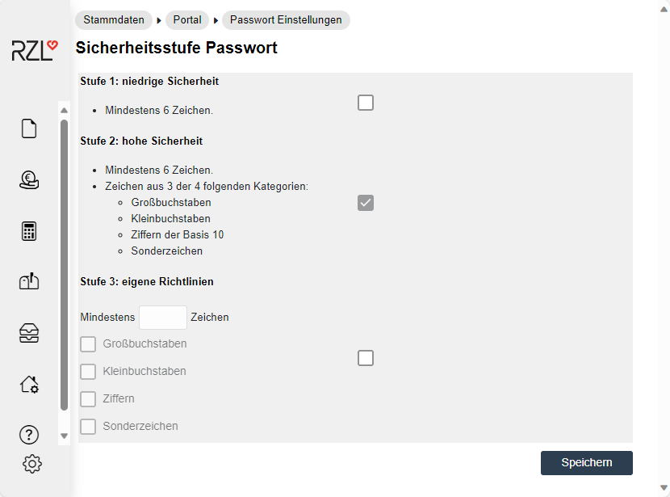{width="6.417322834645669in"
height="4.838582677165355in"}

### Farben[]{.indexref entry="Farben"}

Am RZL Klientenportal können Sie die Farben der Menüpunkte, des
Hintergrundes usw. ändern. Diese Möglichkeiten finden Sie im
Programmteil *Stammdaten / Portal / Farben*.

{width="6.381889763779528in"
height="2.4173228346456694in"}

**2**

**1**

Das Farbschema *Standard* (**1**) ist das voreingestellte Farbschema.
Sie können dieses Farbschema weder löschen noch bearbeiten. Wenn Sie ein
neues Schema anlegen wollen, vergeben Sie im Feld *Name* (**2**) eine
Bezeichnung und wählen die Schaltfläche *Erstellen* an.

{width="6.503937007874016in"
height="2.5236220472440944in"}

**3**

**4**

Nach Anwahl des Eintrags *Editieren* (**3**) können Sie das neue
Farbschema bearbeiten. Das neu angelegte Farbschema können Sie durch
Anwahl des Icons *auswählen* (**4**) aktivieren.

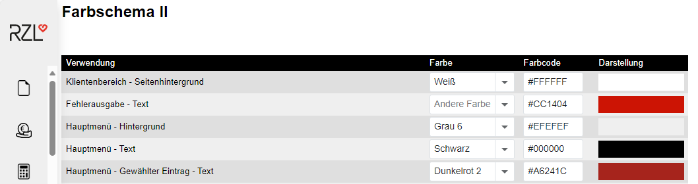{width="6.169291338582677in"
height="1.6338582677165354in"}

Für den jeweiligen Bereich des RZL Klientenportals werden die Farbe, der
Farbcode und die Darstellung angezeigt. Die gewünschte Farbe kann aus
der Liste -- durch einen Klick auf das Pfeil-Symbol -- ausgewählt
werden. Durch Anklicken der Schaltfläche *Speichern* -- ganz unten im
Dialog -- werden die vorgenommenen Änderungen gespeichert.

### Logo[]{.indexref entry="Logo"}

Im Programmteil *Stammdaten / Portal / Logo* können Sie ein
individuelles Logo für das RZL Klientenportal hochladen.

{width="6.255905511811024in"
height="2.645669291338583in"}

Nach Anwahl der Schaltfläche *Datei auswählen* öffnet sich ein Dialog
zur Auswahl einer Bilddatei auf ihrem Computer. Hier ist das gewünschte
Logo auszuwählen.

Das Logo sollte maximal 500 Pixel breit und 500 Pixel hoch sowie 1024kB
groß sein. Durch Anwahl der Schaltfläche *Hochladen* wird das Logo im
Klientenportal hochgeladen. Die Schaltfläche *Zurücksetzen* entfernt das
neu hinterlegte Logo wieder.

### Sonstige Einstellungen

#### Externe Login-Seite definieren 

Über das Menü *Stammdaten / Portal / Sonstige Einstellungen* können Sie
eine Externe Login-Seite definieren.

{width="6.488188976377953in"
height="2.405511811023622in"}

Wenn Sie auf Ihrer Kanzlei-Homepage ein Login zum RZL Klientenportal
eingerichtet haben, können Sie hier durch Eintragung der Adresse Ihrer
Homepage bewirken, dass der Klient nach dem Ausstieg aus dem RZL
Klientenportal zurück auf Ihre Login-Seite fällt (Kapitel 1.3, Seite
[7](#login-formular-auf-ihre-kanzlei-homepage)).

!!! warning "Hinweis"
    Bitte stellen Sie zuvor sicher, dass das Login-Formular auf Ihrer Kanzlei-Homepage korrekt funktioniert, da beim Aufruf der Klientenportal URL -- welchen Sie von uns erhalten haben -- nicht mehr das Login-Formular des Klientenportals angezeigt wird, sondern Ihre hier eingetragene Adresse.

#### Service-Account Passwort 

Hier ist das Service-Account Passwort für die Belegsynchronisation
einzutragen.

!!! info "Tipp"
    Eine genaue Beschreibung der Belegsynchronisation finden Sie im Board im Programmteil *Hilfe / Kurzanleitungen* im Bereich *RZL Belegverarbeitung*.

## Mein Profil

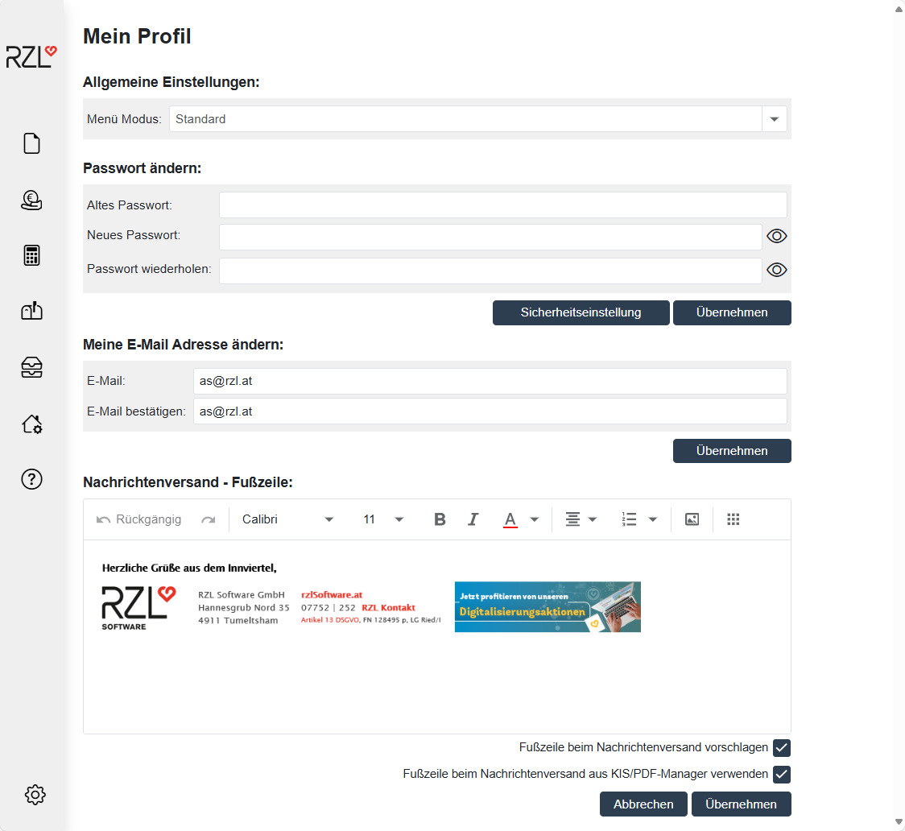{width="5.937007874015748in"
height="5.933070866141732in"}

**4**

**2**

**3**

**1**

Sie können innerhalb des eigenen Profils im Bereich *Allgemeine
Einstellungen* zwischen 4 verschiedenen Darstellungen des Menüs (**1**)
auswählen. Der Menü Modus *Standard* zeigt links zunächst nur die
Symbole für die einzelnen Programmteile an. Wenn Sie mit der Maus auf
die Leiste fahren, werden die Symbole und der Text der einzelnen
Programmteile angezeigt. Der Menü Modus *Fixiert groß* blendet die
Symbole und den Text dauerhaft ein. *Fixiert klein* zeigt auf der ersten
Ebene nur mehr die Symbole ohne Text für die Programmteile, *Fixiert
Klein mit Text* zeigt die Symbole mit dem Text der Programmteile in
kleiner Schrift unterhalb des Symbols.

Im Bereich *Passwort ändern* können Sie ihr aktuelles Passwort abändern.
Mit dem Button *Sicherheitseinstellung* kommen Sie in die Einstellungen
für das Passwort. Weitere Informationen finden Sie unter 2.4.3 Passwort
Einstellungen.

Die E-Mail Adresse, die bei Ihrem Kanzlei-Benutzer hinterlegt ist,
können Sie im Bereich *Meine E-Mail Adresse* (**3**) ändern.

Im Bereich *Nachrichtenversand -- Fußzeile* (**4**) kann eine Fußzeile
gestaltet werden. Die Fußzeile kann beim Nachrichtenversand verwendet
werden, sowohl aus dem Klientenportal als auch aus dem KIS und dem RZL
PDF-Manager.

# Informationsaustausch

Das RZL Basismodul inkludiert einen sicheren und schnellen Austausch von
Dokumenten und Nachrichten zwischen Wirtschaftstreuhänder, Klienten und
Dienstnehmern.

## Allgemeine Listenfunktionen

Am Beginn dieses Kapitels 3 *Informationsaustausch* werden die
allgemeinen Listenfunktionen anhand des Programmteils
*Informationsaustausch / Dokumentenlisten / An Klienten übermittelte
Dokumente* erläutert. Diese Funktionen finden sich auch in den Listen
des Programmteils *Belegbox*.

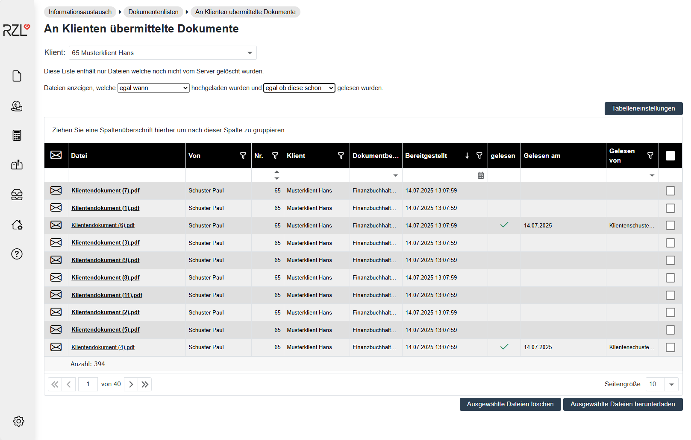{width="6.377952755905512in"
height="4.066929133858268in"}

**7**

**1**

**4**

**8**

**6**

**5**

**3**

**2**

1.  Durch Anwahl der Spaltenbezeichnung wird die Liste auf- oder
    absteigend sortiert.

2.  Das kleine Symbol neben der Spaltenbezeichnung zeigt an, dass die
    Liste nach dieser Eigenschaft sortiert ist (hier die Spalte
    *Bereitgestellt*).

3.  In den Textfeldern können Suchbegriffe eintragen werden. Die Liste
    wird nach dem eingetragenen Suchbegriff gefiltert.

4.  Nach Anwahl des kleinen Filtersymbols können Sie im oberen Bereich
    ebenfalls durch Texteingabe - filtern. Zusätzlich werden die in der
    Spalte verwendeten Eigenschaften angezeigt, nach denen Sie - durch
    Setzen von Hackerln und Anwahl der Schaltfläche *Anwenden* - filtern
    können.

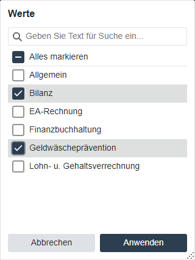{width="1.6653543307086613in"
height="2.2283464566929134in"}

5.  Eine Gruppierung nach Spalten ist möglich, indem Sie mit der Maus
    die gewünschte Spalte in den Bereich links oben ziehen.

6.  Nach Anwahl der Schaltfläche *Tabelleneinstellungen* können zwischen
    nachfolgenden Einträgen auswählen.

{width="1.4448818897637796in"
height="1.5393700787401574in"}

> *Ansicht zurücksetzen* macht Änderungen innerhalb der Tabelle
> rückgängig. *Gruppierungen aufheben* beseitigt bestehende
> Gruppierungen. Nach Anwahl des Eintrags *Ansicht anpassen* können Sie
> Spalten aus- und einblenden. Bestehende Filter werden nach Anwahl des
> Eintrags *Filter deaktivieren* entfernt. Im unteren Bereich können Sie
> den Bereich *Gruppierungen*, die *Filter*- und die *Fußzeile* aus- und
> einblenden.

7.  Im rechten unteren Bereich legen Sie fest, wie viele Einträge pro
    Seite angezeigt werden sollen.

8.  Im linken Bereich sehen die Anzahl der Seiten und die Anzahl der
    Elemente. Mit Direktanwahl mit der Maus können Sie zwischen den
    Seiten navigieren.

## Dokumente bereitstellen

Innerhalb des Kanzleibereichs des RZL Klientenportals können Sie
Dokumente für die Klienten oder die Dienstnehmer Ihrer Klienten über
eine gesicherte Verbindung bereitstellen. Diese Funktion ist auch über
das RZL KIS bzw. im RZL PDF-Drucker/PDF-Manager Premium aufrufbar.

### Dokumente für einzelne Klienten bereitstellen

Der Programmteil *Informationsaustausch / Dokumente an einen Klienten
übermitteln* ermöglicht Ihnen das Hochladen von Dokumenten für einzelne
im RZL Klientenportal angelegte Klienten.

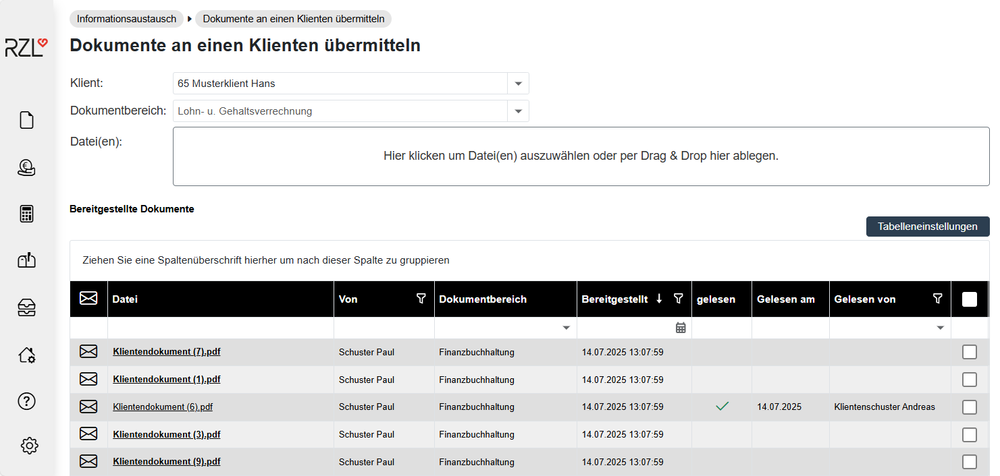{width="6.433070866141732in"
height="3.0669291338582676in"}

**1**

Wählen Sie zunächst den gewünschten Klienten und Dokumentbereich aus.
Nachfolgend können Sie entweder in das große Rechteck (**1**) mit der
Maus klicken und die Datei(en) durch Anwahl in der Explorer Struktur
hochladen oder per Drag & Drop ablegen und ebenfalls hochladen.

{width="5.456692913385827in"
height="1.9724409448818898in"}

Im Dialogfenster können Sie ein bestimmtes Dokument suchen und
auswählen. Durch einen Doppelklick auf das Dokument oder nach Anwahl der
Schaltfläche *Öffnen* wechselt das Programm in den Ausgangsbildschirm
zurück und die angewählten Dokumente werden ins Klientenportal
hochgeladen.

!!! info "Tipp"
    Sie können auch mehrere Dokumente gleichzeitig übermitteln. Halten Sie hierfür die STRG-Taste gedrückt und wählen Sie die gewünschten Dokumente aus.

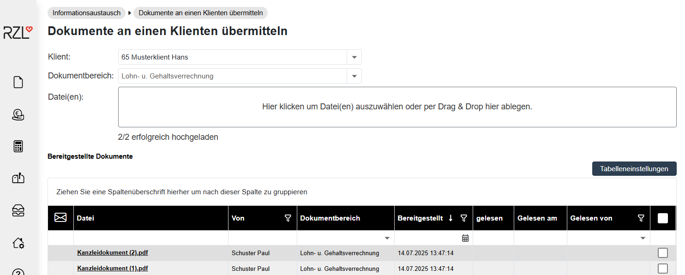{width="6.125984251968504in"
height="2.4606299212598426in"}

> Im unteren Bereich des Programmteils sehen Sie die Dokumente, die
> bereits hochgeladen wurden. Angezeigt werden der jeweilige
> Dokumentbereich und wann das Dokument bereitgestellt und gelesen
> wurde.

### Informationen an alle Klienten übermitteln

Unter *Informationsaustausch / Informationen an alle Klienten
übermitteln* können Sie Informationen (Dokumente) allen im
Klientenportal angelegten Klienten zur Verfügung stellen.

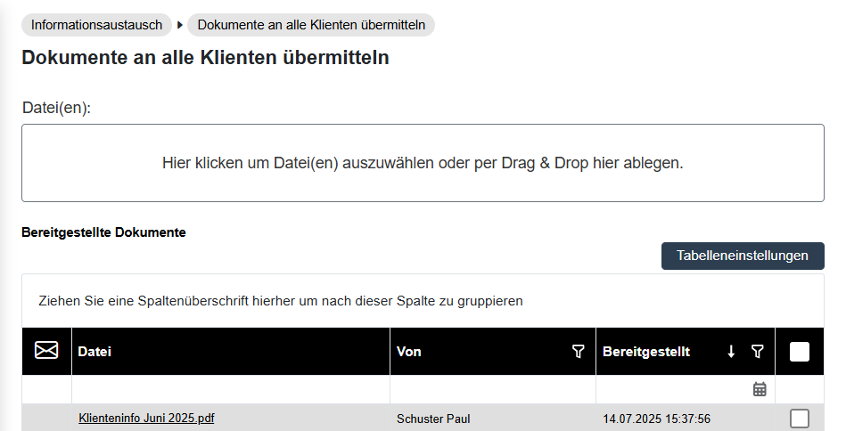{width="6.153543307086614in"
height="3.1377952755905514in"}

Die Vorgehensweise entspricht der Versendung von Dokumenten an einen
Klienten (Kapitel 3.2.1, Seite
[31](#dokumente-für-einzelne-klienten-bereitstellen)).

### Dokumente an einen Dienstnehmer übermitteln 

Die notwendigen Schritte zur Anlage der Dienstnehmer für das
Bereitstellen der Daten werden im Kapitel 6, Seite
[65](#dienstnehmerbereich) beschrieben.

Zur Übermittlung von Dokumenten wählen Sie den Menüpunkt
*Informationsaustausch / Dokumente an einen Dienstnehmer übermitteln*
aus.

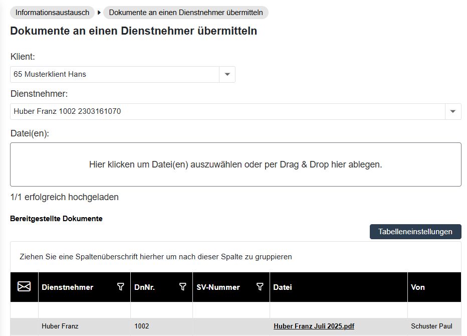{width="5.791338582677166in"
height="4.165354330708661in"}

Hier können Sie nach Anwahl des Klienten aus den im RZL Klientenportal
angelegten Dienstnehmern auswählen. Nachfolgend können Sie entweder in
das große Rechteck (**1**) mit der Maus klicken und die Datei(en) durch
Anwahl in der Explorer Struktur hochladen oder per Drag & Drop ablegen
und ebenfalls hochladen.

Anschließend wird dem Dienstnehmer das Dokument im Klientenportal zur
Verfügung gestellt. Bereitgestellte Dokumente werden im unteren Bereich
des Bildschirms angezeigt.

### Dokumentenübermittlung aus dem RZL KIS

Im KIS gespeicherte Dokument können im Header oder in der
Dokumentenliste mit der rechten Maustaste und den Optionen *Zum
Klientenportal hochladen* oder *Zum Klientenportal mit Nachricht
hochladen* sofort dem Klienten zur Verfügung gestellt werden. Abb. ‑
Dokumente aus dem RZL KIS übermitteln

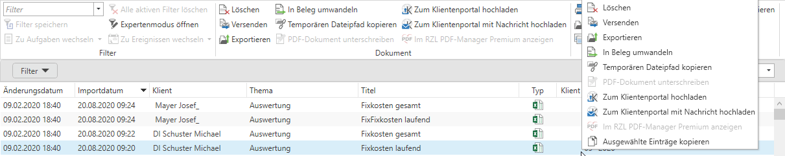{width="6.330708661417323in"
height="1.2598425196850394in"}

### Dokumentenübermittlung aus dem RZL PDF-Manager Premium

Ein im RZL PDF-Manager-Premium erstelltes Dokument kann in der
Dokumentenansicht über die Schaltfläche *Klientenportal* dem Klienten
zur Verfügung gestellt werden. Gleichzeitig ist die Ablage im RZL KIS
(Postausgang) und die Übermittlung einer Nachricht möglich.

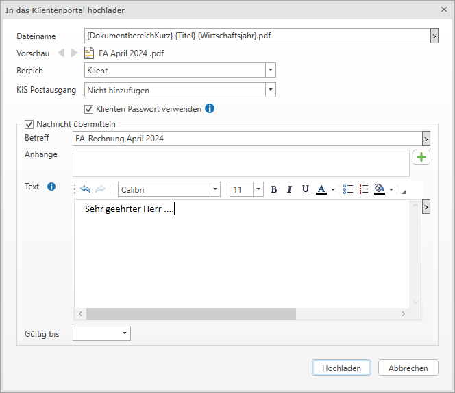{width="3.8031496062992125in"
height="3.283464566929134in"}

Eine detaillierte Beschreibung des Programmteils finden Sie im Handbuch
RZL PDF-Manager Premium.

### Dokumentenübermittlung aus dem RZL PDF Drucker

Im RZL PDF-Drucker erstellte Dokumente können über die Schaltfläche
*Export* ins RZL Klientenportal hochgeladen werden.

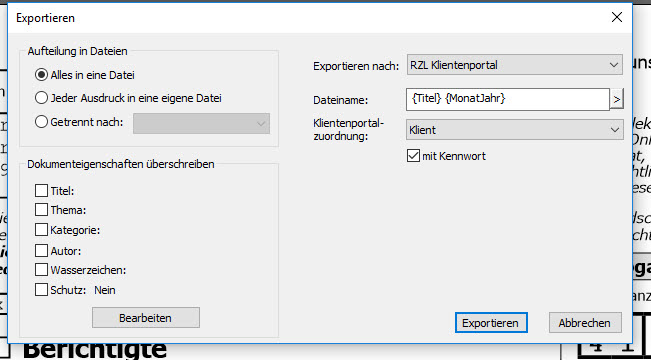{width="4.268657042869641in"
height="2.302899168853893in"}

Wählen Sie dazu die Option *Exportieren nach: RZL Klientenportal* an.
Nach Eingabe des gewünschten Dateinamens und der Zuordnung im
Klientenportal können Sie optional noch das Passwort des Klienten
zuordnen. Nach Anwahl der Schaltfläche *Exportieren* wird das Dokument
hochgeladen.

### Dokumentenlisten

#### Empfangene Dokumente 

Der Programmteil *Informationsaustausch / Dokumentenlisten /Empfangene
Dokumente* zeigt die Dokumente, die von den Klienten zur Verfügung
gestellt worden sind. Sie können zwischen den Registerblättern
*Klientendokumente* und *Dienstnehmerdokumente* auswählen. Durch einen
Doppelklick auf den Dateinamen wird das Dokument aufgerufen.

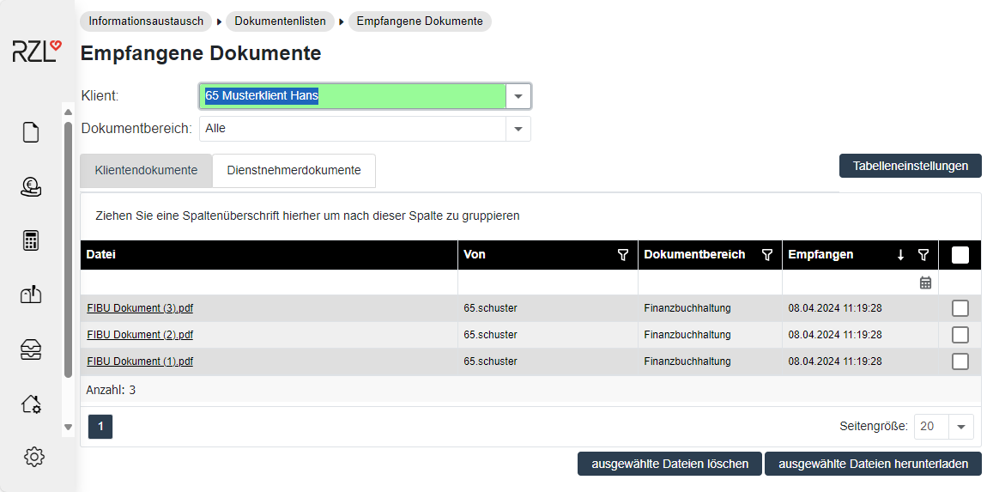{width="6.322834645669292in"
height="3.1102362204724407in"}

Sie können die Ansicht auf einzelne Klienten einschränken oder die
Dokumente aller Klienten auflisten.

#### An Klienten übermittelte Dokumente

Im Programmteil *Informationsaustausch / Dokumentenlisten / An Klienten
übermittelte Dokumente finden Sie* die an die Klienten übermittelten
Dokumente. Durch einen Doppelklick auf den Dateinamen wird das Dokument
aufgerufen.

{width="6.377952755905512in"
height="4.066929133858268in"}

#### An Dienstnehmer übermittelte Dokumente 

Im Programmteil *Informationsaustausch /* *Dokumentenlisten / An
Dienstnehmer übermittelte Dokumente* werden an Dienstnehmer übermittelte
Informationen angezeigt.

#### Gelöschte Dokumente 

Im Programmteil *Informationsaustausch* / *Dokumentenlisten / Gelöschte
Dokumente* sehen Sie eine Liste mit den bereits gelöschten Dokumenten.

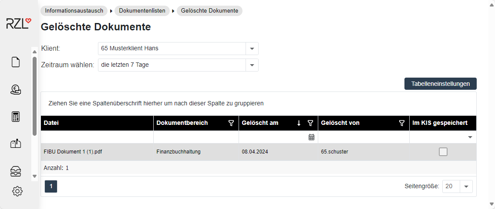{width="6.464566929133858in"
height="2.7401574803149606in"}

In dieser Liste können die Dokumente nicht mehr aufgerufen werden.
Sichtbar sind der Name der Datei und der Benutzer, der die Datei
gelöscht hat sowie das Datum der Löschung. Ins KIS gespeicherte
Dokumente werden automatisch gelöscht und erhalten in der Spalte *Im KIS
gespeichert* ein Hakerl.

## Nachrichtenübermittlung

Die Nachrichtenübermittlung im RZL Klientenportal bietet Ihnen die
Möglichkeit, Nachrichten an Ihre Klienten verschlüsselt über die
https-gesicherte Verbindung zu senden bzw. von Ihrem Klienten zu
empfangen. Dieses Feature steht Ihnen auch im Zuge des Hochladens von
Dokumenten aus dem Kanzleiinformationssystem bzw. PDF-Manager Premium
zur Verfügung. Sie können dabei einzelne/individuelle Nachrichten
erstellen bzw. erhalten oder ganze Newsletter an alle im Klientenportal
angelegten Klienten übermitteln.

### Nachrichten an einen Klienten übermitteln

Im Programmteil *Informationsaustausch / Nachricht an einen Klienten
übermitteln* können Sie Nachrichten mit Anhängen an den gewünschten
Klienten versenden. Nach Auswahl des Klienten gelangen Sie in folgende
Ansicht.

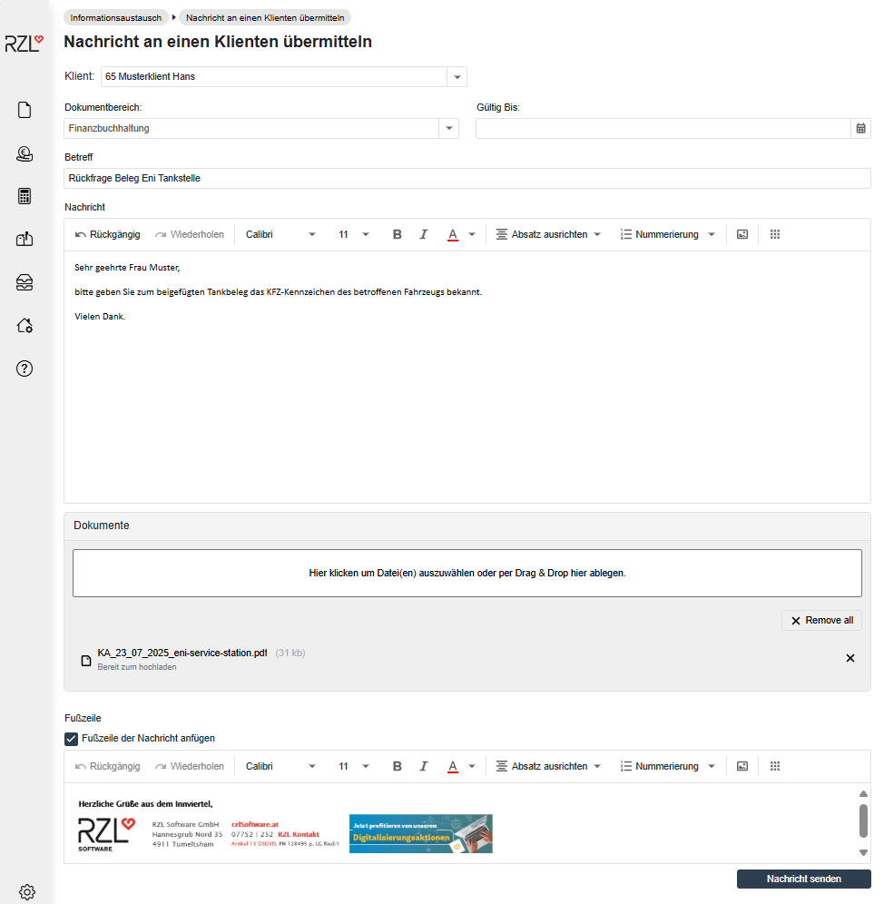{width="6.1299212598425195in"
height="6.267716535433071in"}

#### Dokumentbereich

Wählen Sie den benötigten Dokumentbereich im Drop-Down Menü an. Nur
Klientenbenutzer, die in den Stammdaten diesem Dokumentbereich
zugeordnet sind, können diese Nachricht lesen (Kapitel 2.2.4, Seite
[16](#benutzerdaten-und-berechtigungen)).

#### Gültig Bis 

Nach Auswahl des Dokumentbereichs können Sie im Feld *Gültig Bis* ein
Enddatum der Nachricht hinterlegen. Die Nachricht wird nach diesem Datum
automatisch vom Portal gelöscht.

#### Betreff 

Geben Sie hier einen kurzen Nachrichtenbetreff ein.

#### Nachricht 

Hier geben Sie die gewünschte Nachricht an Ihren Klienten ein. Die
Tastenkombination STRG+RETURN fügt einen Zeilenumbruch ein.

#### Dokumente 

Sie können optional ein Dokument an die Nachricht anhängen. Diese werden
dann nicht nur in der Nachricht, sondern auch in der Dokumentenansicht
angezeigt.

Wählen Sie über die Schaltfläche *Durchsuchen* das gewünschte Dokument
aus.

Mit der Schaltfläche *Nachricht* *senden* wird die Nachricht an den
Klienten übermittelt. Der Klient erhält bei korrekter Einstellung in den
Benutzerstammdaten eine automatische E-Mail Benachrichtigung über den
Nachrichteneingang. Nach dem Einstieg ins Klientenportal ist die
Benachrichtigung auch im Protokoll ersichtlich.

Die versendeten Nachrichten können jederzeit über *Informationsaustausch
/ Nachrichtenlisten / Gesendete Nachrichten* eingesehen werden (Kapitel
3.3.6, Seite [39](#gesendete-nachrichten)).

#### Fußzeile 

Im Benutzerprofil kann eine Fußzeile hinterlegt werden, die beim Versand
von Nachrichten verwendet wird. Sie können die Fußzeile beim Versenden
einer Nachricht optional einfügen oder ausblenden. Die im Profil
gespeicherte Fußzeile bleibt dabei unverändert erhalten.

### Nachrichten an alle Klienten übermitteln

Als Kanzleisachbearbeiter können Sie im Programmteil
*Informationsaustausch / Nachricht an alle Klienten übermitteln*
Mitteilungen an alle Klienten im Klientenportal zustellen:

Auch hier kann die Gültigkeitsdauer der Nachricht eingeschränkt werden.
Nach der Eingabe eines Betreffes und der Nachricht ist es zudem möglich,
ein Dokument hochzuladen (vgl. Kapitel 3.3.1, Seite
[37](#nachrichten-an-einen-klienten-übermitteln)). Mit *Nachricht
senden* wird die Nachricht an alle aktiven Klienten am Klientenportal
übermittelt.

### Nachrichten an einen Dienstnehmer übermitteln

Als Klientensachbearbeiter können Sie im Programmteil
*Informationsaustausch / Nachricht an einen Dienstnehmer übermitteln*
auch Nachrichten mit Dokumentenanhang an einen gewünschten Dienstnehmer
übermitteln. Nach Anwahl des Klienten können Sie ebenfalls den
gewünschten Dienstnehmer anwählen und die Nachricht erstellen. Dieser
erhält wiederum ein E-Mail als Information über den Nachrichteneingang.

### Nachrichten über das RZL KIS bei Dokumentenübermittlung senden

Eines beim Klienten abgelegte Dokument im RZL KIS kann durch Anwahl in
der Dokumentenliste mit der rechten Maustaste und der Option *zum
Klientenportal mit Nachricht hochladen* sofort inklusive Nachricht an
den Klienten übermittelt werden.

### Nachrichten über den RZL PDF-Manager Premium senden

Im RZL PDF-Manager Premium kann im Zuge einer Dokumentenübermittlung
auch gleichzeitig eine Nachricht angehängt werden. Die Beschreibung dazu
finden Sie im Kapitel 3.2.4, Seite
[34](#dokumentenübermittlung-aus-dem-rzl-kis).

### Gesendete Nachrichten

Im Programmteil *Informationsaustausch / Nachrichtenlisten / Gesendete
Nachrichten* kann der eingeloggte Kanzleisachbearbeiter die versendeten
Nachrichten einsehen.

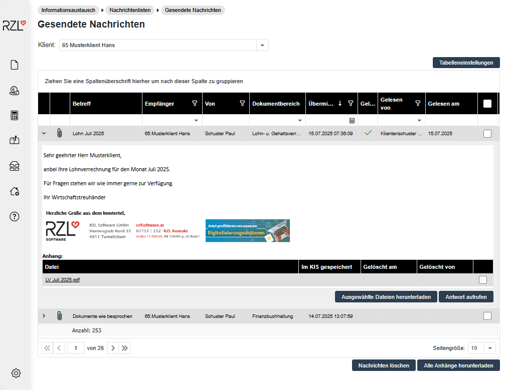{width="6.102362204724409in"
height="4.692913385826771in"}

Durch Anklicken des \>-Symbols in der ersten Spalte öffnet sich die
Detailansicht der Nachricht. Zur besseren Übersicht und Sortierung
stehen Ihnen verschiedene Filtermöglichkeiten zur Verfügung. In den
Spalten *Gelesen, Gelesen von und Gelesen am* sehen Sie, ob und wann der
Klient die Nachricht gelesen hat.

#### Tabelleneinstellungen 

Vgl. Kap. 3.1 Allgemeine Listenfunktionen

**Verlauf der Nachricht / Antwort aufrufen**

Gibt es in der geöffneten Nachricht dazugehörige frühere Nachrichten,
können diese über die Schaltfläche *Verlauf der Nachricht* aufgerufen
werden. Wurde die geöffnete Nachricht bereits beantwortet, kann die
Antwort durch Anwahl der Schaltfläche *Antwort aufrufen* geöffnet
werden. Diese Schaltflächen finden Sie im unteren Teil der Nachricht.

**Anhänge herunterladen**

Beinhaltet die Nachricht einen Anhang kann dieser über den *Menüpunkt
Anhänge herunterladen* geöffnet und gespeichert werden.

#### Nachrichten löschen 

Wählen Sie dazu die gewünschte Nachricht in der letzten Spalte durch
Setzen des Häkchens an. Mit *Nachricht löschen* werden die markierten
Nachrichten nicht nur in der Kanzleisachbearbeiter-Ansicht, sondern auch
bei den betroffenen Klienten gelöscht.

### Empfangene Nachrichten

Wenn der Klient eine Nachricht an den Kanzleisachbearbeiter übermittelt,
erscheint diese beim nächsten Login des Kanzleisachbearbeiters am
Klientenportal in der Protokollansicht. Diese kann auch jederzeit im
Menü *Informationsaustausch / Nachrichtenlisten / Empfangene
Nachrichte*n aufgerufen werden.

## Datenverbrauch

Der Programmpunkts *Informationsaustausch / Sonstiges* bietet die
Möglichkeit, Ihren Datenverbrauch aufzurufen. Die Aktualisierung des
Datenverbrauchs erfolgt einmal pro Tag. Die Darstellung des
Datenverbrauchs erfolgt monatlich getrennt nach Klienten.

{width="5.47244094488189in"
height="4.362204724409449in"}

## Benutzerdefinierte Dokumentbereiche ohne RZL KIS/ BOARD

Im Programmpunkt *Informationsaustausch / Sonstiges* können unter dem
gleichnamigen Menüpunkt *benutzerdefinierte Dokumentbereiche* angelegt
werden. Diese stehen dann ebenfalls im Auswahldialog neben den Standard-
Dokumentbereichen (entspricht den lizensierten Programmen) zur
Verfügung.

Tragen Sie im Bereich *Neuer Name* die Bezeichnung des Dokumentbereichs
ein und klicken Sie nachfolgend auf den Punkt *Erstellen*. Im oberen
Bereich werden alle Dokumentbereiche, die benutzerdefiniert angelegt
wurden, angezeigt. Noch nicht verwendete benutzerdefinierte
Dokumentbereiche können gelöscht werden.

{width="6.216982720909886in"
height="2.1692913385826773in"}

Nach Anlegen eines Dokumentbereichs können Sie die neue Berechtigung den
Klienten und Kanzleibenutzern zuweisen. Im nachfolgenden Bildschirm ist
die Zuweisung zu einem Kanzlei-Mitarbeiter abgebildet.

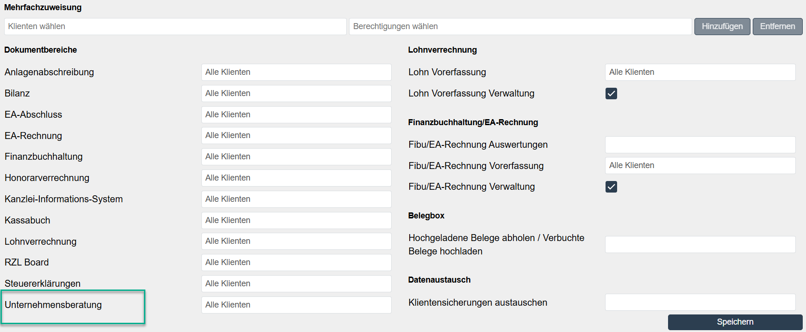{width="6.318897637795276in"
height="2.6102362204724407in"}

Wählen Sie hier den neu angelegten Dokumentbereich und die gewünschten
Klienten aus und bestätigen Sie die Eingabe mit *Speichern*. Durch diese
Auswahl können Sie nun, wenn Sie Dokumente an einen Klienten
übermitteln, den neu angelegten Dokumentbereich verwenden.

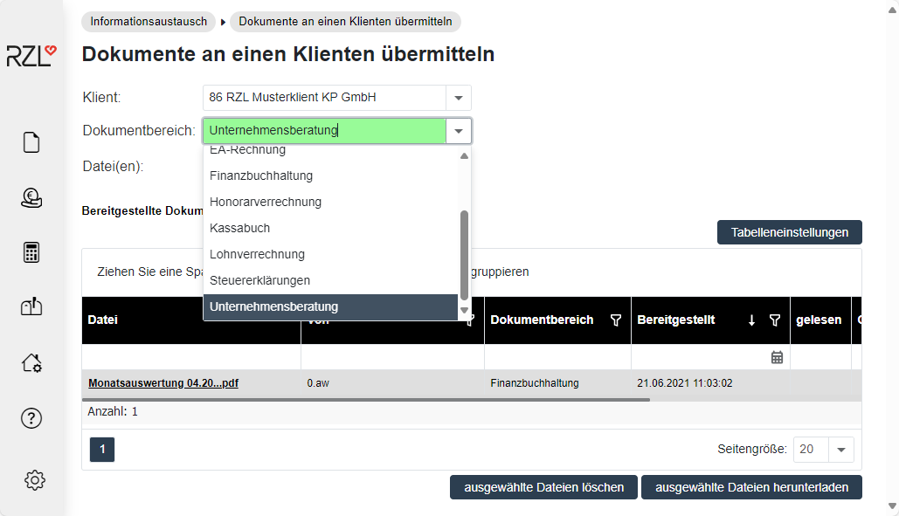{width="5.874015748031496in"
height="3.374015748031496in"}

Damit Ihr Klient auch diesen neuen Dokumentbereich verwenden kann, ist
dieser in den Benutzerstammdaten des Klienten zu aktivieren. Gehen Sie
hierfür unter *Stammdaten / Klienten / Klientenstammdaten* und wählen
Sie die betreffenden Klienten aus. Anschließend sind bei den
Berechtigungen die Dokumentbereiche beim gewünschten Benutzer anzuwählen
und mit *Speichern* zu bestätigen.

{width="6.15748031496063in"
height="4.440944881889764in"}

## Benutzerdefinierte Dokumentbereiche mit RZL KIS/ BOARD

Wird das KIS/ Board verwendet, können die benutzerdefinierten
Dokumentbereiche im Kanzlei-Informations-System unter
*Verwaltung/Dokumentbereich* angelegt und bearbeitet werden.

In der Übersicht werden alle vom Anwender lizensierten Programme als RZL
Standard Dokumentbereich mit einem Hackerl versehen angeführt. Diese
Dokumentbereiche können vom Anwender nicht verändert oder gelöscht
werden.

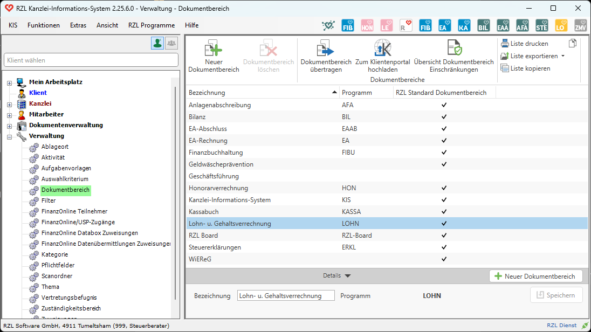{width="6.248031496062992in"
height="3.5118110236220472in"}

> Unter gleichnamigen Menüpunkt kann ein *neuer Dokumentbereich*
> angelegt werden. Dafür ist im Feld *Bezeichnung* der gewünschte Name
> einzugeben und mit *Speichern* zu bestätigen.
>
> Sollen bestehende Dokumentbereiche zusammengelegt werden, kann das
> unter dem Menüpunkt *Dokumentbereich übertragen* vorgenommen werden.
> Mit dieser Funktion werden die mit diesem Dokumentbereich verknüpften
> Nachrichten und Dokumente dem neuen Dokumentbereich zugeordnet.
>
> Benutzerdefinierte Dokumentbereiche, die nicht verwendet werden,
> können über *Dokumentbereich löschen* gelöscht werden.
>
> Im KIS/ BOARD vorgenommene Änderungen werden automatisch zum
> Klientenportal hochgeladen und stehen da zur Verfügung. Über den
> Menüpunkt *Zum Klientenportal* *hochladen* kann der Datenaustausch mit
> dem Klientenportal manuell angestoßen werden.
>
> Anschließend sind bei dem Kanzleibenutzer und Klientenbenutzer die
> Berechtigung für den neu angelegten Dokumentbereich zu hinterlegen.
> (vgl. Kapitel 3.5 Benutzerdefinierte Dokumentbereiche ohne KIS / BOARD
> Abb. 3.18 und 3.20 Berechtigung für benutzerdefinierten
> Dokumentbereich erteilen)

# Lohnverrechnung

> Das Modul Lohn Vorerfassung ermöglicht die Vorerfassung von
> lohnverrechnungsbezogenen Daten durch den Klienten und anschließenden
> Direktimport in die RZL Lohnverrechnung. ÖGK Meldungen können direkt
> am Portal erstellt und übermittelt werden.

## Klientendaten aus der RZL Lohnverrechnung exportieren

!!! warning "Hinweis"
    Stellen Sie vor dem Export der Lohnverrechnungsdaten Ihres Klienten sicher, dass das Klientenportal korrekt eingerichtet und die notwendigen Einstellungen in den Klientenstammdaten vorgenommen wurden (Kapitel 2.2,Seite [9](#klientenstammdaten)).

Öffnen Sie den gewünschten Klienten in der RZL Lohnverrechnung. Unter
dem Programmpunkt *Bearbeiten / RZL Klientenportal / Daten
bereitstellen* können Sie die Dienstnehmerstammdaten aus der RZL
Lohnverrechnung auf das RZL Klientenportal exportieren.

## Eingabemasken für Klienten konfigurieren

Im Klientenbereich des Portals können die Benutzer Daten für die
Lohnverrechnung vorerfassen und der Lohnverrechnung zur Verfügung
stellen. Die Felder (Lohnarten, Überstunden, Homeoffice-Tage, usw.)
werden im Kanzleibereich festgelegt.

### Eingabemasken (Vorerfassungen gesamt)

Die in diesem Kapitel beschriebenen Eingabemasken werden für die
Vorerfassungen *laufende Änderungen*, *Eintritte* und *Austritte*
verwendet. Die Eingabemasken können bei mehreren Benutzern gleichzeitig
verwendet werden. Sie können die passende Eingabemaske in den Stammdaten
des Klienten (*Stammdaten / Klienten*) pro Benutzer zuordnen.

!!! warning "Hinweis"
    Beachten Sie, dass die Eingabemasken nur von Kanzleibenutzern mit der Berechtigung *Lohnvorerfassung* erstellt und verändert werden können.Diese Änderungen gelten für den gesamten Kanzleibereich.

Wählen Sie das Menü *Lohnverrechnung / Eingabemasken verwalten* aus.

{width="5.988188976377953in"
height="2.220472440944882in"}

Sie können hier für *Eintritte*, *Austritte* und *Laufende Änderungen*
Eingabemasken bearbeiten bzw. neue Eingabemasken erstellen. Drei
Vorschläge „Maximal", „Minimal" und „Standard" stehen im RZL
Klientenportal bereits zur Verfügung. Diese Vorschläge können jederzeit
abgeändert und angepasst werden.

#### Bestehende Eingabemaske ändern 

Wählen Sie dazu im jeweiligen Set die gewünschte Maske durch Anwahl der
Maskenbezeichnung aus. Sie gelangen anschließend in den
Bearbeitungsdialog.

#### Neue Eingabemaske anlegen 

Wenn Sie die Schaltfläche *Neue Maske erstellen* (**1**) anwählen, wird
nachfolgender Dialog geöffnet.

{width="6.196850393700787in"
height="2.220472440944882in"}

**4**

**3**

**2**

**1**

Im Feld Maske (**2**) wählen Sie den gewünschten Eintrag aus. Vergeben
Sie einen Namen (**3**) für die neue Eingabemaske und klicken Sie auf
die Schaltfläche *Erstellen* (**4**).

Sie können jetzt die neue Eingabemaske bearbeiten und innerhalb der
Klientenbenutzer zuordnen.

#### Bearbeiten der Eingabemasken 

Im Änderungsmodus sind die Eingabefelder zunächst zu Gruppen
zusammengefasst.

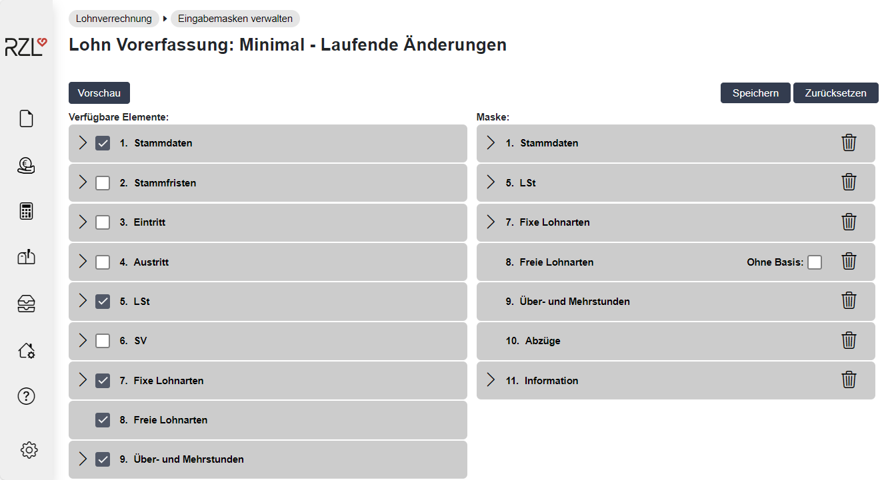{width="6.484251968503937in"
height="3.4803149606299213in"}

**3**

**4**

**2**

**1**

**5**

Im rechten Bereich werden die verfügbaren Elemente (**1**) als
Überschriften angezeigt. Diese Bereiche entsprechen den
Abrechnungsbildschirmen im Lohnverrechnungsprogramm. Im linken Bereich
sehen Sie die Elemente (**2**), die der Klientenbenutzer in der
Eingabemaske verwenden kann. Die Elemente im linken Bereich können durch
Drag & Drop nach oben oder unten verschoben werden.\
In dem Sie ein Hackerl (**3**) vor die Überschrift setzen, können Sie
eine Gruppe aktivieren. Sie können eine Gruppe auch durch Drag & Drop
nach rechts verschieben.\
Die Gruppen können durch Entfernen des Hackerls bei der Überschrift
(**3**), durch Anwahl des Papierkorb-Symbols (**4**) und durch Drag &
Drop wieder deaktiviert und nach rechts verschoben werden.\
Sie erhalten einen genauen Überblick über die verwendeten Felder durch
Anwahl der Schaltfläche *Vorschau* (**5**) rechts oben.

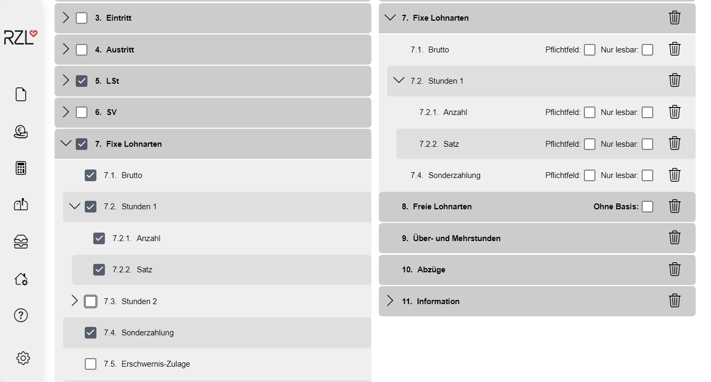{width="6.34251968503937in"
height="3.409448818897638in"}

**7**

**6**

Innerhalb der Gruppen können die Felder wie die Überschriften aktiviert
und deaktiviert werden. Im linken Bereich können die Felder mit Drag &
Drop nach oben oder unten verschoben werden.\
Einzelne Datenfelder können als *Pflichtfelder* (**6**) oder als *Nur
lesbar* (**7**) definiert werden. Ein Pflichtfeld muss zwingend
ausgefüllt werden. Nur lesbar bedeutet, dass das Feld angezeigt aber
nicht bearbeitet werden kann.

#### Zuteilung der Eingabemasken zu den Klientenbenutzern 

Die gewünschten Eingabemasken werden in den Klientenstammdaten in den
Berechtigungen der Benutzer mit der Option *Lohn Vorerfassung* zugeteilt
(Kapitel 2.2.4, Seite [16](#benutzerdaten-und-berechtigungen)).

### Eingabemasken für die Tabellenerfassung (laufende Änderungen)

Im Klientenbereich besteht die Möglichkeit laufende Änderungen nur für
bestimmte Lohnarten (Fixe Lohnarten, freie Lohnarten, Über- und
Mehrstunden, Abzüge, Lohnsteuertage) in Tabellenform zu erfassen.

Innerhalb dieser Form der Vorerfassung werden die freien Lohnarten
direkt in der Eingabemaske zugeordnet. Die Eingabemaske für die
Tabellenerfassung wird für jeden Klienten einzeln angelegt.

Die Erstellung und Bearbeitung von Eingabemasken für die
Tabellenerfassung ist nur mit der Berechtigung *Lohnvorerfassung in
Tabellenform* möglich.

Wählen Sie das Menü *Lohnverrechnung / Eingabemasken für
Tabellenerfassung verwalten* aus.

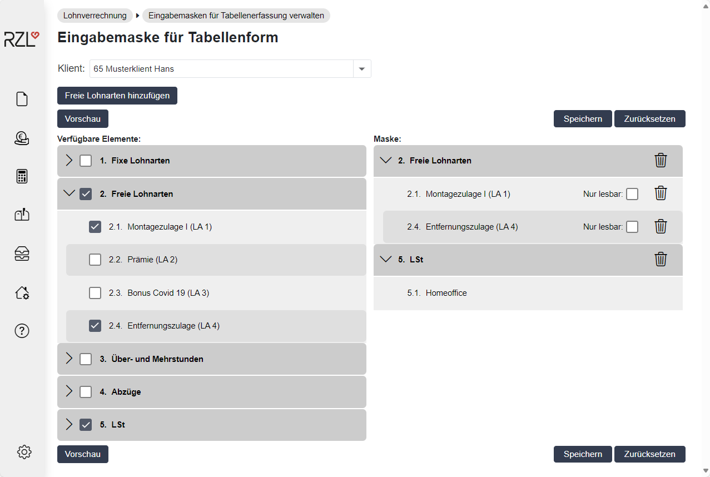{width="5.881889763779528in"
height="4.019685039370079in"}

**2**

**1**

Die allgemeine Bedienung dieser Eingabemaske entspricht der Beschreibung
im vorhergehenden Kapitel mit zwei Ausnahmen:

1.  Eingabemasken für die Tabellenerfassung werden für jeden Klienten
    (**1**) einzeln angelegt. Ist der Klient nicht in der Liste
    enthalten -- aber im Klientenportal angelegt, fehlt Ihnen als
    Kanzleibenutzer vermutlich die Berechtigung *Lohnvorerfassung in
    Tabellenform* (vgl. Kap 1 Einstellungen in den Stammdaten eines
    Kanzleimitarbeiters). „Normale" Eingabemasken können bei
    verschiedenen Klienten verwendet werden.

2.  Die freien Lohnarten können nach Anwahl der Schaltfläche *Freie
    Lohnarten hinzufügen* (**2**) durch ein Hackerl ins Kästchen und
    *Hinzufügen* in die Eingabemaske übernommen werden.

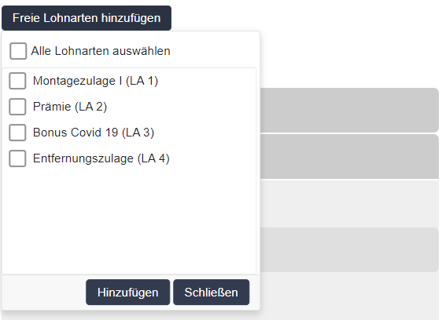{width="2.925196850393701in"
height="2.122047244094488in"}

## Vom Klienten freigegebene Daten der Vorerfassung

Im Klientenbereich werden vom Klientenbenutzer Daten für die
Lohnverrechnung vorerfasst. Je nach Einstellung in den
Klientenstammdaten des Klientenportals können
Mindestangaben-Anmeldungen/Versichertenmeldungen reduziert als Eintritte
an den Wirtschaftstreuhänder übermittelt werden. Ebenfalls ist die
Erfassung von Austritten, laufenden Änderungen, Urlauben, Krankenständen
und Zeitausgleich durch den Klienten im Portal möglich.

### Import in die RZL Lohnverrechnung

Der in den Stammdaten hinterlegte Klientensachbearbeiter erhält nach der
Freigabe durch den Klienten zunächst eine E-Mail-Benachrichtigung.
Voraussetzung für die E-Mail-Benachrichtigung ist die Aktivierung im
Programmteil *Stammdaten/Portal/E-Mail Einstellungen* Wird der Klient
anschließend in der RZL Lohnverrechnung geöffnet, können die
Vorerfassungen automatisch übernommen werden. Eine detaillierte
Beschreibung dazu finden Sie im Handbuch RZL Lohn-/Gehaltsverrechnung.

### Abruf am RZL Klientenportal

Beim nächsten Login in das Klientenportal werden die Erfassungen auch im
Startbildschirm (Protokoll) des Kanzleisachbearbeiters angedruckt. Die
Vorerfassungen können auch jederzeit im Programmteil *Lohnverrechnung /
Vom Klienten freigegebene Daten* abgerufen werden.

{width="5.952755905511811in"
height="2.783464566929134in"}

Wählen Sie im Drop-Down Menü den gewünschten Klienten aus. Im Bereich
*Zeitraum wählen* können Sie einzelne Monate auswählen oder nach dem Typ
der Meldung (Eintritt, Laufende Änderung, usw.) filtern. Wenn Sie den
Eintrag *Alle Erfassungen* anwählen, erhalten Sie eine vollständige
Liste der freigegebenen Daten. Durch Klick auf eine Vorerfassung werden
die Details angezeigt.

## Vom Klienten nicht freigegebene Daten

Der Programmteil *Lohnverrechnung/Vom Klienten nicht freigegebene Daten*
bietet eine Übersicht über bereits erfasste, aber noch nicht
freigegebene Daten aus den Erfassungen der Lohnverrechnung. Die
Auflistung beinhaltet die nicht freigegebenen Lohnvorerfassungen, die
nicht freigegebenen Zeiterfassungen, nicht freigegebene Daten von
bereits übermittelten Versicherungsmeldungen und noch nicht übermittelte
Versicherungsmeldungen.

## ÖGK-Anmeldungen / Stornomeldungen

Nachdem der Klient die ÖGK-Meldungen übermittelt hat, können Sie als
Kanzleisachbearbeiter diese Meldungen über den Menüpunkt
*Lohnverrechnung / Übermittelte Anmeldungen* prüfen.

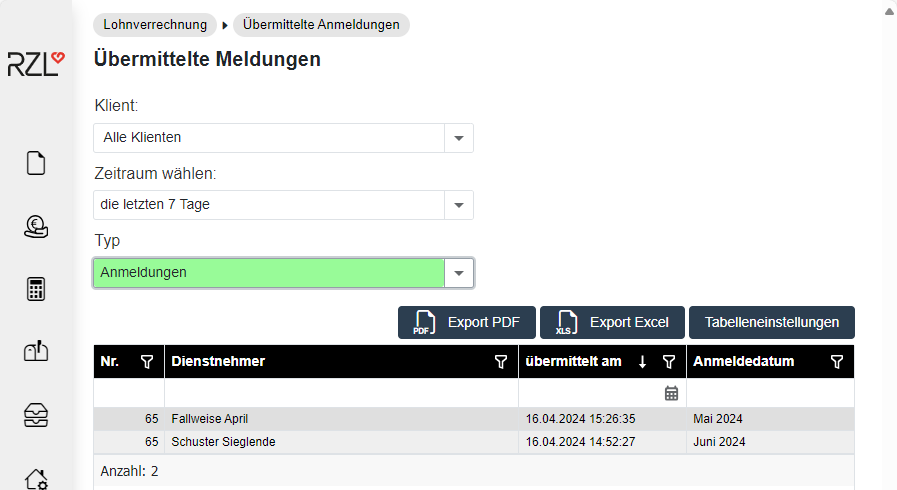{width="5.940944881889764in"
height="3.338582677165354in"}

Wählen Sie dazu den gewünschten Klienten, Zeitraum und Typ in den
Drop-Down Menüs aus. Durch Anwahl in der folgenden Auflistung werden die
Details aufgerufen.

**ÖGK-Protokolle aufrufen und ausgeben**

Der Programmteil *Lohnverrechnung / Protokolle der Anmeldungen* bietet
Ihnen die Möglichkeit die ÖGK-Protokolle der Meldungen aufzurufen und
auszudrucken.

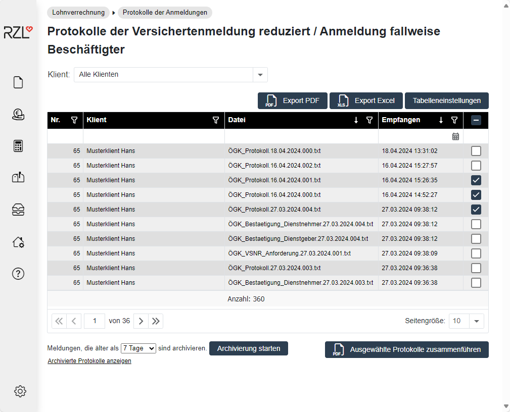{width="6.437007874015748in"
height="5.358267716535433in"}

In der Spalte Datei können Sie durch Anwahl des Dateinamens die
ÖGK-Protokolle aufrufen und mit der Schaltfläche *Druckvorschau*
ausdrucken.

**ÖGK-Protokolle archivieren**

Die Eintragungen in dieser Liste können archiviert werden. Sie können
die Archivierung für Meldungen die älter als sieben bzw. 30 Tage sind
durchführen, in dem Sie die Schaltfläche *Archivierung starten*
anwählen. Die archivierten Protokolle lassen sich jederzeit durch Anwahl
des Eintrags *Archivierte Protokolle* anzeigen aufrufen.

**Ausgewählte Protokolle zusammenführen**

Nach Anwahl der Schaltfläche *Ausgewählte Protokolle zusammenführen*
werden die Protokolle - die mit einem Hackerl gekennzeichnet sind - in
eine PDF-Datei ausgegeben.

## Anbindung zur rota-Schnittstelle

Mit dem Klientenportal **Modul rota Schnittstelle** können Sie die von
Ihrem Klienten erfassten Daten in der rota-Software direkt in das RZL
Lohn-Programm importieren.

Legen Sie zunächst den Klienten am Klientenportal an und stellen Sie die
Stammdaten aus der Lohnverrechnung am RZL Klientenportal bereit (Kapitel
2.2, Seite [9](#klientenstammdaten)).

Zur Nutzung der Schnittstelle müssen Sie im RZL Klientenportal in den
Klientenstammdaten unter *Stammdaten / Klienten / Klientenstammdaten*
die Option *Daten für Lohnvorerfassung aktivieren* anwählen. Legen Sie
anschließend einen separaten Benutzer mit der Berechtigung *Lohn
Vorerfassung* an und stellen Sie sicher, dass der angelegte
Klientenzugang funktioniert, indem Sie den Login kurz testen. Leiten Sie
diese Benutzerdaten mit Passwort an die Firma rota zur weiteren
Einrichtung weiter.

> 

# Finanzbuchhaltung

Im RZL Klientenportal können im Klientenbereich Buchungen wahlweise mit
oder ohne Vorkontierung vorerfasst werden. In den Klientenstammdaten
wird festgelegt, ob eine Vorkontierung möglich ist. Die Vorerfassungen
können in die Finanzbuchhaltung bzw. EA-Rechnung der Kanzlei übernommen
werden.

## Bereitstellen des Kontenplans in der Fibu/EA-Rechnung Klassik

Bei der Anlage der Kassa/Bankbücher und der Verbuchungsregeln wird im
RZL Klientenportal auf den Kontenplan der Fibu bzw. EA-Rechnung
zugegriffen. Deshalb müssen Sie vorab in der Fibu bzw. EA-Rechnung den
Programmteil *Bearbeiten / Klientenportal / Daten bereitstellen*
anwählen und über diesen Menüpunkt den Kontenplan bereitstellen.

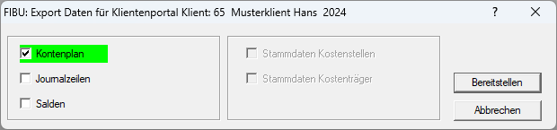{width="4.196850393700787in"
height="0.9803149606299213in"}

## Bereitstellen des Kontenplans in der Fibu Next

In der FIBU-Next werden die Daten im Programmteil *Datenimport/-export /
Zum Klientenportal hochladen* (**1**) bereitgestellt.

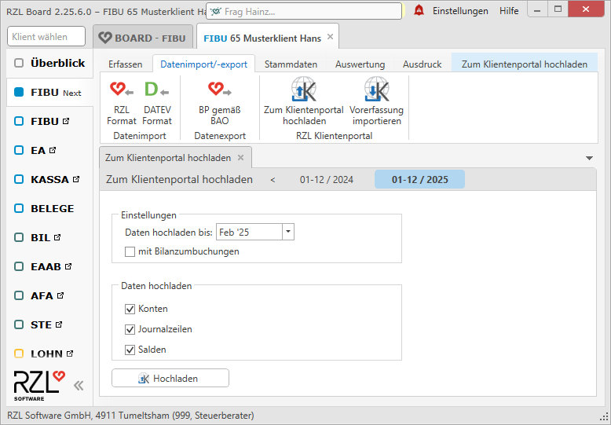{width="5.2637795275590555in"
height="3.661417322834646in"}

**3**

**2**

**1**

Für die Fibuvorerfassung müssen die Konten (**2**) aktiviert und die
Schaltfläche Hochladen (**3**) angewählt werden.

## Anlage von Kassa/Bankbüchern am RZL Klientenportal

Kassa/Bankbücher werden im Programmteil *Finanzbuchhaltung / Stammdaten
Kassa/Bankbuch* für die einzelnen Klienten angelegt.

Im Bereich *Klient wählen* klicken Sie auf die kleine Pfeiltaste und
wählen den gewünschten Klienten aus.

Nach der Auswahl der Klienten können Sie in den unten angeführten
Feldern die Kassa/Bankbücher anlegen.

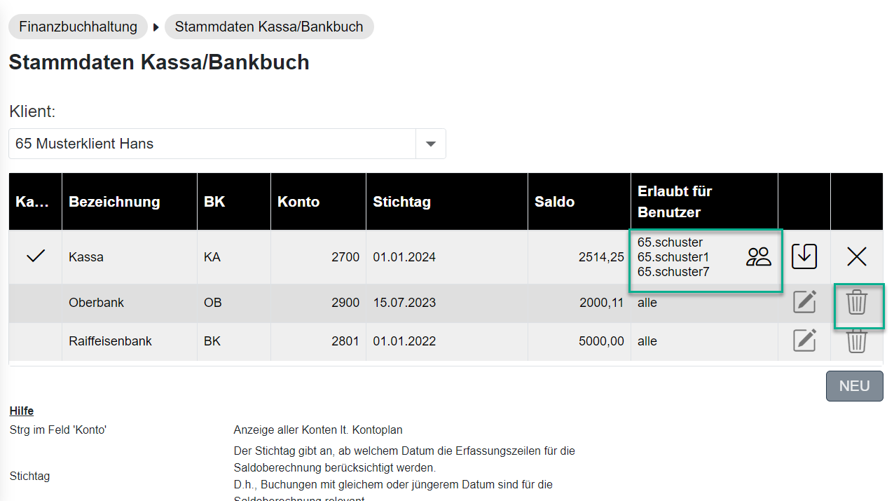{width="6.649606299212598in"
height="3.7283464566929134in"}

**1**

Durch Anwahl der Schaltfläche NEU können Sie ein neues Kassa/Bankbuch
anlegen.

Im Feld *Bezeichnung* wird ein Name für das Kassa/Bankbuch vergeben.

Im Feld *Belegkreis* tragen Sie bitte den Belegkreis ein, der in der
Buchhaltung bzw. EA-Rechnung für das Kassa/Bankbuch verwendet wird.

Wenn Sie im Feld *Konto* die STRG-Taste anwählen, wird der Kontenplan
der Fibu bzw. EA-Rechnung aufgerufen und Sie können das Kassa oder
Bankkonto auswählen. Auf diese Kontonummer werden die Vorerfassungen in
der Fibu bzw. EA-Rechnung gebucht.

Damit der Benutzer im Klientenbereich beim Vorerfassen die richtigen
Anfangs- und Endsalden angezeigt bekommt, erfassen Sie den *Saldo* des
eingetragenen Kontos zu einem bestimmten *Stichtag.*

Beim Kassabuch müssen Sie darüber hinaus noch den Merker setzten
(**1**), dass es sich um ein Kassabuch handelt. Ein Kassabuch mit einem
negativen Kassasaldo (Kassaminus) kann nicht freigegeben werden.

#### Einschränken auf bestimmte Benutzer 

Im rechten Bereich des Dialogs unterhalb der Bezeichnung *Erlaubt für
Benutzer* steht zunächst der Eintrag *alle*. Somit können alle beim
Klienten angelegten Benutzer das Kassa- oder Bankbuch bearbeiten.

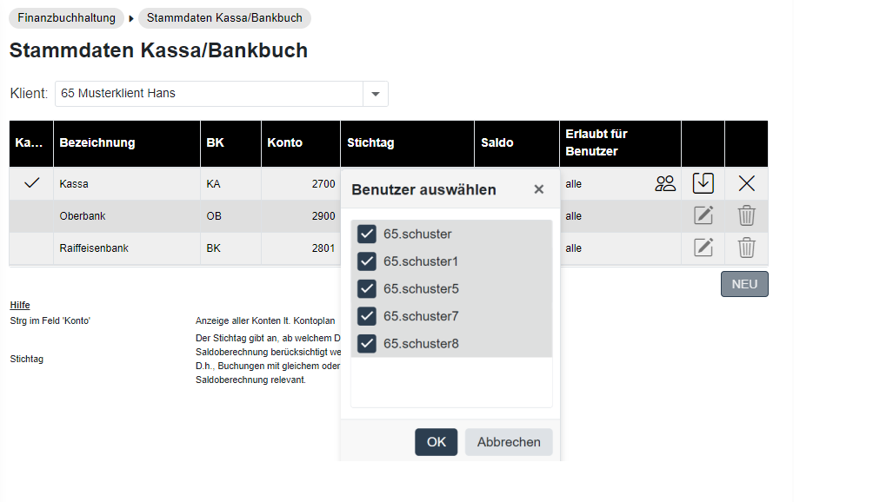{width="6.239583333333333in"
height="3.9659722222222222in"}

Wenn Sie rechts das Bearbeiten- Symbol anwählen, können die berechtigen
Benutzer ausgewählt werden.

Im oben angezeigten Dialog werden die berechtigen Benutzer durch ein
Hackerl ins Kästchen ausgewählt und durch Anwahl der Schaltfläche
*Übernehmen* gespeichert.

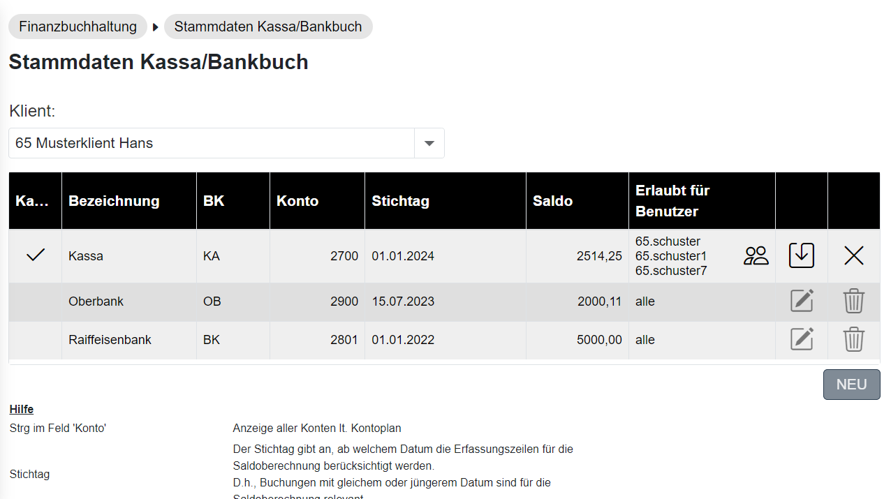{width="5.984251968503937in"
height="3.3503937007874014in"}

Im abgebildeten Beispiel darf das Kassabuch von den Benutzern
65.schuster, 65.schuster1 und 65.schuster7 bearbeitet werden.

#### Löschen von Kassa/Bankbüchern 

Angelegte Kassa/Bankbücher können durch Anwahl des Papierkorbes ganz
rechts im Dialog gelöscht werden.

Nach Anwahl des Papierkorbsymbols erhalten Sie nachfolgende Abfrage.

{width="3.937007874015748in"
height="1.065721784776903in"}

Wenn Sie die oben angezeigte Abfrage mit OK beantworten, wird das
jeweilige Kassa/Bankbuch gelöscht. Sind bereits Vorerfassungen vorhanden
ist ein Löschen nicht möglich.

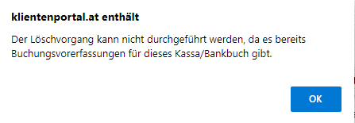{width="3.937007874015748in"
height="1.3651804461942256in"}

## Vorerfassung Kostenstellen

Wenn im Buchhaltungsklienten eine Kostenstellen und/oder eine
Kostenträgerrechnung gebucht wird, kann im RZL Klientenportal im
Programmteil *Finanzbuchhaltung / Stammdaten KORE* den Benutzern eine
Kostenstelle und ein Kostenträger zugeordnet werden.

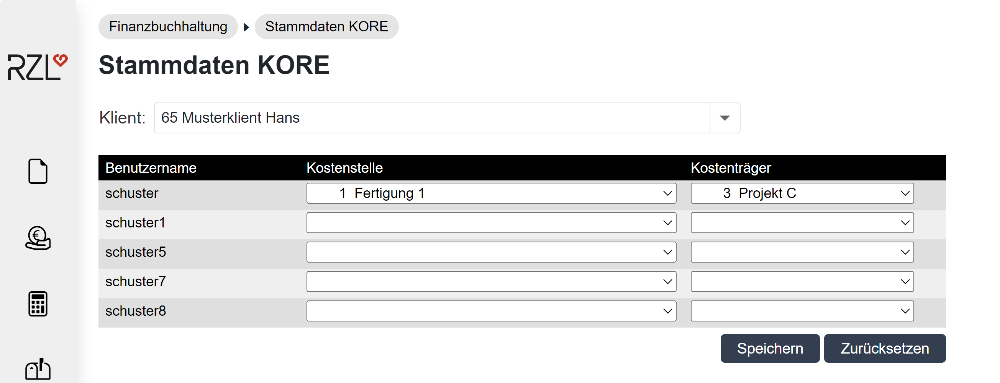{width="6.503937007874016in"
height="2.4960629921259843in"}

Die Anwendung der in diesem Bereich definierten Werte hängt von der
Einstellung ab, ob für diesen Klienten die Erfassung der Kostenstelle /
Kostenträger bei der Buchungsvorerfassung aktiviert ist (siehe
Klientenstammdaten).\
\
Ist die Erfassung der Kostenstelle / Kostenträger bei der
Buchungsvorerfassung nicht aktiviert, so gilt:\
Die für einen Benutzer festgelegte Kostenstelle / Kostenträger werden
bei der Freigabe der Vorerfassungen für die Buchungszeilen automatisch
gesetzt. Somit sind die in diesem Abschnitt definierten Werte erst zum
Zeitpunkt der Freigabe relevant - nicht zum Zeitpunkt der Erfassung.

Ist die Erfassung der Kostenstelle / Kostenträger bei der
Buchungsvorerfassung aktiviert, so gilt:\
Die für einen Benutzer festgelegte Kostenstelle / Kostenträger werden
bei der Vorerfassung der Buchungszeilen automatisch vorgeschlagen.

## Anlage der Registrierkassen

Nach Anlage der Kassa/Bankbücher (*Finanzbuchhaltung / Stammdaten
Kassa/Bankbuch*; siehe Kapitel 5.2) sind über den Menüpunkt
*Finanzbuchhaltung / Stammdaten Registrierkassen* die Einstellungen zu
den Registrierkassen durchzuführen.

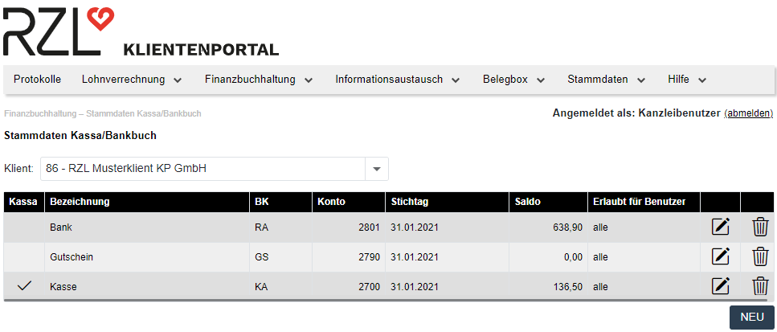{width="6.100659448818898in"
height="1.6368055555555556in"}

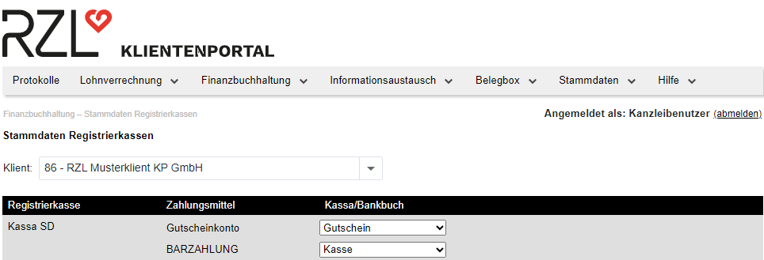{width="6.081975065616798in"
height="1.0965277777777778in"}

Unter *Finanzbuchhaltung / Stammdaten Registrierkassen* können Sie
anschließend die Einstellungen zu den Registrierkassen durchführen. Das
RZL Klientenportal greift dabei auf die unter *my.kassandro.at*
hinterlegten Daten zu. Ordnen Sie hier das jeweilige Zahlungsmittel dem
jeweiligen Kassa/Bankbuch zu. Mit *Speichern* werden die Einstellungen
gesichert.

Somit sind alle erforderlichen Stammdaten für die Registrierkassa
angelegt und der Klient kann dem Steuerberater die Daten der
Registrierkassen über die FIBU-Vorerfassung am RZL Klientenportal zur
Verfügung stellen.

## Anlage von Buchungsregeln

### Buchungsregeln - Individuell beim Klienten

Im Programmteil *Finanzbuchhaltung / Stammdaten
Buchungsregeln*[]{.indexref entry="Buchungsregeln"} können Buchungsregel
für bestimmte Klienten erfasst werden. Ganz oben im Programmteil wird
der Klient ausgewählt.

In dieser Ansicht können Sie unterhalb der Klientenauswahl erkennen, ob
für diesen Klienten bereits eine allgemeine Vorlage (**1**) für
Buchungsregeln[]{.indexref entry="Buchungsregeln"} verankert wurde.
Buchungsregeln-Vorlagen (kanzleiweit) werden im Programmteil
*Finanzbuchhaltung / Vorlagen Buchungsregeln (kanzleiweit)* (vgl. Kap.
5.6.2 *Vorlagen Buchungsregeln kanzleiweit*) angelegt und werden in den
Klientenstammdaten zugeordnet. Im zweiten Bereich kann eine allgemeine
Vorlage (**2**), zum Kopieren (**3**) von einzelnen Buchungsregeln,
verankert werden.

Wenn der Benutzer im Klientenbereich bei der Vorerfassung bestimmte
(Erfassungs)-Texte verwendet, werden die Erfassungen automatisch
vorkontiert. Die *Erfassungstexte* (**4**) werden in diesem Programmteil
eingetragen und dem gewünschten *Konto* und *Steuersatz* zugeordnet.
Nach der Eintragung des Erfassungstextes können Sie im Feld *Konto* mit
der STRG-Taste den Kontenplan aus der Fibu bzw. EA-Rechnung aufrufen und
die gewünschten Konten übernehmen.

{width="6.157132545931758in"
height="4.346456692913386in"}

**4**

**5**

**6**

**3**

**2**

**1**

Das Feld *fix* (**5**) enthält zwingend ein Hackerl, wenn der Steuersatz
nicht geändert werden kann (Umsatzsteuerkonten, ig. Erwerbe, keine
Steuerverankerung). Auch für Konten mit Vorsteuerverankerung (z.B.
Wareneinsatz), kann durch Setzen des Häkchens der Steuersatz fix
verankert werden.

Sie können Buchungsregeln auch aus allgemeinen Vorlagen (**2**) durch
Anwahl des plus-Symbols (**3**) in den Klientenbereich kopieren. Die
beim Klienten gespeicherten bzw. zugeordneten Buchungsregeln können im
**PDF** oder **Excel**-Format (**6**) ausgegeben werden.

Wenn der Benutzer im **Klientenbereich** im Rahmen der Vorerfassung die
ersten Buchstaben des (Erfassungs)-Textes einträgt, werden die möglichen
Buchungsregeln[]{.indexref entry="Buchungsregeln"} angezeigt (siehe
Abbildung 5.14).

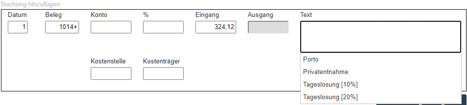{width="6.291666666666667in"
height="1.4177482502187226in"}

Der Dialog oberhalb zeigt einen Teil der Erfassung im Klientenbereich.
Wenn der Benutzer einen Text eingibt, der als Buchungsregel hinterlegt
ist, werden die möglichen Buchungsregeln[]{.indexref
entry="Buchungsregeln"} aufgelistet.

#### Verdeckte Erfassungstexte 

Wenn Sie betimmte Texte z.B. 10%, in eine eckige Klammer setzen \[10%\],
wird dieser Teil des Textes bei der Vorerfassung im Klientenbereich
angezeigt. Dieser Text wird allerdings nicht in die Fibu bzw.
EA-Rechnung übernommen.

Mit diesen eckigen Klammern können Sie somit für die Vorerfassung des
Benutzers im Klientenbereich mehr Text für die Auswahl der richtigen
Buchungsregel zur Verfügung stellen, als in das Textfeld der Fibu bzw.
EA-Rechnung übernommen wird.

#### Benutzerverwaltung Buchungsregeln

Die Buchungsregeln[]{.indexref entry="Buchungsregeln"} können auf
einzelne beim Klienten angelegte Benutzer eingeschränkt werden.

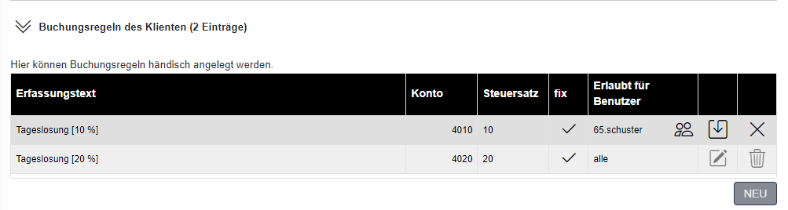{width="6.267716535433071in"
height="1.6732283464566928in"}

Die Bearbeitung der Benutzer ist bereits im Kap. 5.3 *Anlage des
Kassa/Bankbuchs im RZL Klientenportal* beschrieben. Nach Auswahl des
Benutzers muss die Hinterlegung mit dem Speichersymbol gesichert werden.

### Vorlagen Buchungsregeln (kanzleiweit)

Damit Sie Buchungsregeln[]{.indexref entry="Buchungsregeln"}, die für
mehrere Klienten verwendet werden können, nicht bei jedem Klienten
einzeln anlegen müssen, können Sie im Programmteil *Finanzbuchhaltung /
Vorlagen Buchungsregeln (kanzleiweit)* allgemeine Vorlagen anlegen. Die
Kontonummer und Kontostammdaten, die in der Vorlage verwendet werden,
müssen bei den Klienten - die diese Vorlage gemeinsam verwenden -
übereinstimmen.

{width="6.251968503937008in"
height="1.921259842519685in"}

**1**

Nach Anwahl der Schaltfläche NEU vergeben Sie eine Bezeichnung für die
Vorlage, ordnen einen Referenzklienten zu und speichern (**1**) die
Vorlage ab.

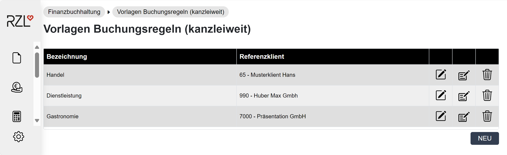{width="6.251968503937008in"
height="1.9173228346456692in"}

**3**

**2**

Nach Anwahl des Bearbeiten-Symbols (**2**) öffnet sich der Dialog für
die Anlage und Bearbeitung der Verbuchungsregeln. Vorlagen können durch
Anwahl des Papierkorb-Symbols (**3**) gelöscht werden.

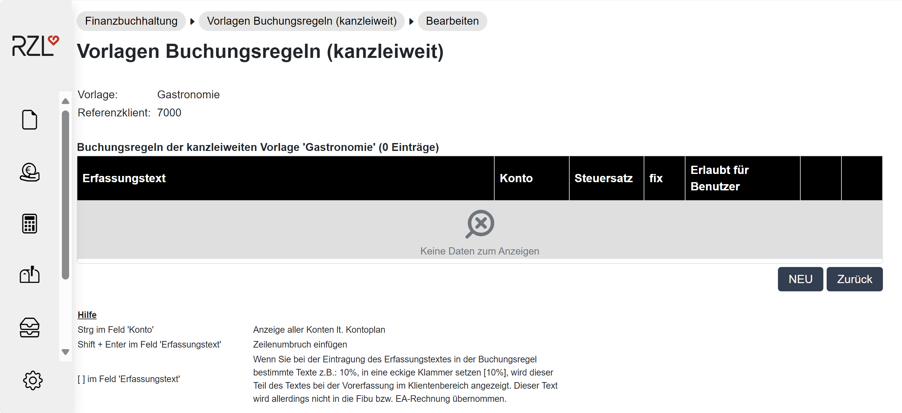{width="6.251968503937008in"
height="2.8661417322834644in"}

Die Anlage von Buchungsregeln ist im Kap. 5.6.1 *Buchungsregeln --
Individuell beim Klienten* beschrieben.

## Vom Klienten freigegebene Daten

Sie haben im Kanzleibereich des RZL Klientenportal im Programmteil
*Finanzbuchhaltung / Vom Klienten freigegebene Daten* eine Übersicht
über die Daten des Klienten.

Im Bereich *Klient wählen* tragen Sie zunächst den gewünschten Klienten
ein. Anschließend erhalten Sie vier verschiedene Bereiche angezeigt.

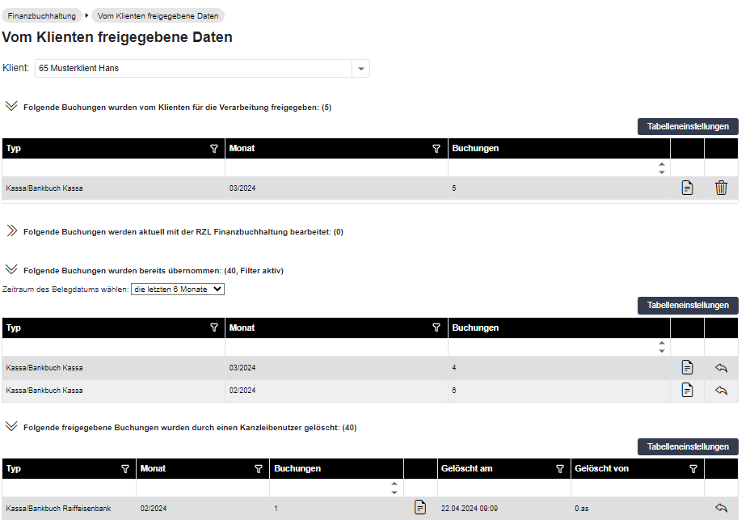{width="6.275590551181103in"
height="4.322834645669292in"}

Durch Anwahl des Ansichtssymbols rechts können Sie die Buchungen im
Detail aufrufen.

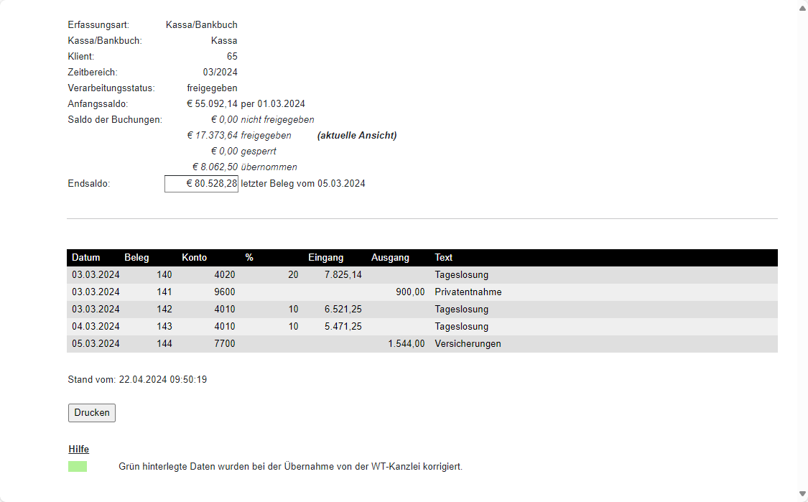{width="6.303149606299213in"
height="4.015748031496063in"}

#### Saldo der Buchungen 

Durch den Saldo der Buchungen wird die Differenz zwischen Anfangssaldo
und Endsaldo des betreffenden Zeitraums detailliert dargestellt. Die
Darstellung erfolgt nach dem jeweiligen Status der Buchungen:

- *nicht freigegeben:* dies ist der Saldo der Buchungen, die vom
  Klienten noch nicht freigegeben wurden

- *freigegeben:* dies ist der Saldo der Buchungen, welche der Klient
  bereits freigegeben hat, von Ihnen jedoch noch nicht bearbeitet wurden

- *gesperrt:* dies ist der Saldo der Buchungen, die von Ihnen bereits
  bearbeitet werden

- *übernommen:* dies ist der Saldo der Buchungen, die von Ihnen bereits
  übernommen (verbucht) wurden

Nach Anwahl der Schaltfläche *Drucken* können Sie den gewünschten
Drucker auswählen und die Ansicht ausdrucken.

#### Folgende Buchungen wurden vom Klienten für die Verarbeitung freigegeben 

Hier erhalten Sie eine Ansicht jener Buchungen, die der Klient im
Klientenbereich erfasst und bereits freigegen hat. Durch Anwahl des
Papierkorb-Symbols kann eine Vorerfassung gelöscht werden.

Gelöschte Vorerfassungen werden in den Bereich *Folgende freigegebenen
Buchungen wurden durch einen Kanzleibenutzer gelöscht* verschoben und
können bei Bedarf reaktiviert werden.

#### Folgende Buchungen werden aktuell mit der RZL Finanzbuchhaltung bearbeitet 

Dieser Bereich zeigt jene Buchungen an, die im Moment in die
Buchhaltung/EA-Rechnung übernommen werden (Programmteil in Fibu/EA:
*Bearbeiten / Klientenportal / Buchungen importieren*).

#### Folgende Buchungen wurden bereits übernommen 

In diesem Bereich sehen Sie die Buchungen, die bereits in die
Fibu/EA-Rechnung übernommen worden sind. Hier können Sie - für die
Darstellung der Ansicht - im Bereich *Erfassungszeitraum auswählen* --
verschiedene Filter setzen. Der Standardfilter ist *die letzten 6
Monate*. Mögliche Filter sind noch: *die letzten 12 Monate*, *die
letzten 24 Monate* und *alle*.

In Ausnahmefällen kann eine bereits übernommene Vorerfassung durch
Anwahl des Pfeilsymbols ganz rechts wieder aktiviert werden. Das
bedeutet, dass die Buchungen wieder übernommen werden können.

**Folgende freigegebene Buchungen wurden durch einen Kanzleibenutzer
gelöscht**

Dieser Bereich zeigt, welche freigegebenen Buchungen durch welchen
Kanzleibenutzer gelöscht wurden und zu welchem Zeitpunkt die Löschung
erfolgte. Diese Vorerfassungen können durch Anwahl des Pfeil-Symbols
ganz rechts wieder aktiviert werden.

## Vom Klienten nicht freigegebene Daten

Im Programmteil *Finanzbuchhaltung / Vom Klienten nicht freigegebene
Daten* werden die noch nicht freigegebenen Vorerfassungen des Klienten
aufgelistet und können aufgerufen werden (**1**).

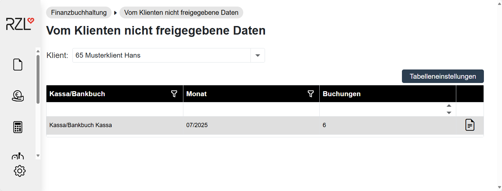{width="5.978996062992126in"
height="2.3149606299212597in"}

**1**

## Bereitstellen von Auswertungen aus der RZL Fibu bzw. EA-Rechnung

Sie können Ihrem Klienten aus der RZL Fibu bzw. EA-Rechnung die
Journalzeilen,[]{.indexref entry="Auswertungen:Journalzeilen"} die
Saldenliste und die Kontenebene[]{.indexref
entry="Auswertungen:Kontensalden"} am RZL Klientenportal zur Verfügung
stellen.

Um Ihrem Klienten den Zugang zu diesen Daten zu ermöglichen, müssen Sie
zunächst in den Klientenstammdaten unter *Stammdaten / Klienten /
Klientenstammdaten* für den jeweiligen Benutzer des Klienten die
Berechtigung *Finanzbuchhaltung Auswertungen* aktivieren.

In der RZL FIBU Klassik können Sie über *Bearbeiten / Klientenportal /
Daten bereitstellen* die Journalzeilen und Salden bereitstellen.

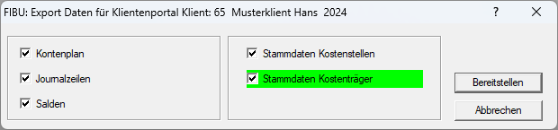{width="6.45752624671916in"
height="1.5102274715660542in"}

Ihr Klient hat am RZL Klientenportal immer nur Zugriff auf den
bereitgestellten Stand der Daten. Um Ihren Klienten einen laufenden
Stand der Journalzeilen und Salden zur Verfügung zu stellen, müssen die
Daten aus der RZL Fibu bzw. EA-Rechnung laufend bereitgestellt werden.

{width="5.2637795275590555in"
height="3.661417322834646in"}

**4**

**2**

**3**

**1**

In der FIBU-Next werden die Auswertungen im Programmteil
*Datenimport/Export / Zum Klientenportal hochladen* (**1**) zur
Verfügung gestellt. Sie können im Bereich *Einstellungen* (**2**) den
Zeitraum einschränken und auswählen ob die Bilanzumbuchungen auch
hochgeladen werden sollen. Beim *Daten hochladen* (**3**) aktivieren Sie
die notwendigen Felder. Durch Anwahl der Schaltfläche *Hochladen*
(**4**) werden die Auswertungen im Klientenportal zur Verfügung
gestellt.

### Auswertungen löschen

Im Kanzleibereich haben Sie die Möglichkeit, die bereitgestellten
Auswertungen je Klient wieder zu löschen. Den Menüteil dazu finden Sie
unter *Finanzbuchhaltung / Auswertungen löschen*.

> 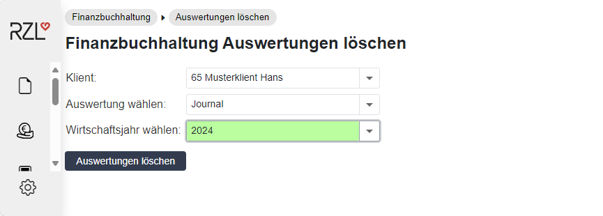{width="5.874015748031496in"
> height="2.106299212598425in"}

**1**

Nach Auswahl des jeweiligen Klienten wählen Sie die Auswertung (**1**)
und das betreffende Wirtschaftsjahr an. Nach Anwahl der Schaltfläche
*Auswertungen löschen* werden die vorher gewählten Daten gelöscht.

# Dienstnehmerbereich

Die monatlichen Abrechnungen können für die Dienstnehmer im RZL
Klientenportal bereitgestellt werden. Es besteht auch die Möglichkeit
beliebige Dokumente -- nicht nur die monatlichen Abrechnungen -- für
einzelne Dienstnehmer auf das RZL Klientenportal hochzuladen.

## Anlage der Dienstnehmer für das RZL Klientenportal im Lohnverrechnungsprogramm

Die Freischaltung der Dienstnehmer erfolgt im RZL
Lohnverrechnungsprogramm im Abrechnungsbildschirm *Stammdaten
Dienstnehmer*.

{width="4.5in" height="3.952755905511811in"}

**2**

**1**

Das Feld *E-Mail Adresse* muss ausgefüllt und die Option *Dienstnehmer
am Klientenportal anlegen* (**1**) muss aktiviert werden.

Wenn die Daten aus der RZL Lohnverrechnung ins RZL Klientenportal
hochgeladen werden, erhalten die Dienstnehmer automatisch eine Mail mit
den automatisch generierten Zugangsdaten. Der Benutzername besteht aus
der Klientennummer, der Dienstnehmernummer und dem Nachnamen des
Dienstnehmers. Das Passwort wird von RZL zufällig generiert.

Die PDF-Dokument kann zusätzlich mit einem Passwort versehen werden
(**2**). Das hier eingetragene Passwort muss vom Dienstnehmer dann beim
Öffnen der Abrechnung am Klientenportal eingegeben werden.

{width="5.783464566929134in"
height="2.263779527559055in"}

## Stammdaten Dienstnehmer im RZL Klientenportal

Wenn die Eintragungen in den Stammdaten im Lohnverrechnungsprogramm
vorgenommen worden sind, werden die Dienstnehmer in das RZL
Klientenportal nach Aktualisierung der Daten über *Bearbeiten /
RZL-Klientenportal / Daten aktualisieren* übernommen.

Im Programmteil *Stammdaten / Klienten / Dienstnehmer* können Sie
bestimmte Dienstnehmer-Stammdaten im RZL Klientenportal jederzeit
bearbeiten.

{width="6.354330708661418in"
height="2.15748031496063in"}

**3**

**2**

**1**

Durch Anwahl der Schaltfläche *Dienstnehmer bearbeiten* (**1**) können
die Datenfelder eines Dienstnehmers bearbeitet werden. Der Status eines
Dienstnehmers (**2**) wird im Lohnverrechnungsprogramm in den Stammdaten
des Dienstnehmers festgelegt und dient hier nur zur Information.

Inaktive Dienstnehmer können durch Anwahl des Papierkorbs innerhalb des
Portals (**3**) endgültig gelöscht werden. Beim Löschen eines
Dienstnehmers werden auch alle am RZL Klientenportal bereitgestellten
Dokumente gelöscht. Wird ein aktiver Dienstnehmer ohne Austrittsdatum
gelöscht, wird dieser mit der nächsten Datenbereitstellung des
Lohnprogramms wieder ins RZL Klientenportal übernommen.

{width="6.275590551181103in"
height="1.468503937007874in"}

Innerhalb der Detaildaten können die E-Mail-Adresse und das Passwort
bearbeitet werden. Wird das Feld *Passwort ändern* angewählt, muss der
Dienstnehmer beim erstmaligen Einstieg in das RZL Klientenportal das
Passwort ändern.

## Nachrichten an Dienstnehmer übermitteln.

Die direkte Nachrichtenübermittlung an einzelne Dienstnehmer über das
RZL Klientenportal finden Sie im Kapitel 3.3.3, Seite
[39](#nachrichten-an-einen-dienstnehmer-übermitteln).

## Bereitstellen der Abrechnungen mittels RZL PDF-Manager Premium

Innerhalb des Lohnverrechnungsprogramms müssen Sie im Programmteil
*Ausdruck / Abrechnungen* die Felder *Einzeldruck* und *Klientenportal*
mit der Option *angelegte DN* aktivieren.

{width="5.503937007874016in"
height="4.688976377952756in"}

Nach Anwahl der übrigen gewünschten Optionen wählen Sie die Schaltfläche
*RZL PDF-Drucker* an. Die Abrechnungen werden im RZL PDF-Manager Premium
geöffnet. Dort können Sie die Abrechnungen über die Schaltfläche
*Klientenportal* hochladen.

{width="4.2952755905511815in"
height="4.2952755905511815in"}

**3**

**2**

**1**

Der Dateiname kann manuell oder mittels Platzhalter definiert werden
(**1**). Wählen Sie im Feld *Bereich* die Option *Dienstnehmer* aus
(**2**). Mit der Option *Dienstnehmer Passwort verwenden* (**3**) wird
das beim Dienstnehmer in der Lohnverrechnung hinterlegte PDF-Passwort
gesetzt. Sie können den Dienstnehmern Nachrichten übermitteln.
Aktivieren Sie dazu die Option *Nachricht übermitteln.*

Durch Anwahl der Schaltfläche *Hochladen* werden die Abrechnungen an die
jeweiligen Dienstnehmer übermittelt.

## Bereitstellen der Abrechnungen mittels RZL PDF-Drucker

Die Abrechnungen werden mit den oberhalb beschriebenen Optionen und
ebenfalls Anwahl der Schaltfläche *RZL PDF-Drucker* in den PDF-Drucker
gestellt.

Die Ausgabe in das RZL Klientenportal im PDF-Drucker erfolgt durch
Anwahl des Programmteils *Datei / Exportieren*, oder des Eintrags
*Export* in der Symbolleiste. Beachten Sie hierbei, dass nur jene
Abrechnungen in das RZL Klientenportal exportiert werden, die im RZL PDF
Drucker markiert sind.

{width="6.102362204724409in"
height="3.3338779527559055in"}

**3**

**5**

**4**

**1**

**2**

Im Bereich *Aufteilung in Dateien* wählen Sie den Eintrag *Jeder
Ausdruck in eine eigene Datei* (**2**) aus. Im Feld *Exportieren nach*
(**3**) muss der Eintrag *RZL Klientenportal* angewählt werden. Der
Dateiname kann händisch eingetragen, oder mittels Platzhalter (kleiner
Pfeil rechts) (**4**) automatisch vergeben werden. Im Feld
*KP-Zuordnung* (**5**) müssen Sie den Eintrag *Dienstnehmer* auswählen.
Wenn das Feld *mit Kennwort* (**1**) aktiviert ist, muss der
Dienstnehmer beim Öffnen des PDF Dokuments das Kennwort eingetragen.

Nach Anwahl der Schaltfläche *Exportieren* werden die Abrechnungen im
RZL Klientenportal bereitgestellt. Die Dienstnehmer bekommen ein E-Mail
mit einem Link auf das Portal und müssen sich mit Benutzername und
Passwort einloggen.

{width="6.228346456692913in"
height="2.5826771653543306in"}

Durch einen Klick auf die Datei öffnet sich die Abrechnung und kann
ausgedruckt werden. Durch Anwahl des Download Symbols kann die Datei
heruntergeladen werden. Mit Betätigen des Papierkorbs wird das Dokument
im RZL Klientenportal gelöscht.

## Hochladen von Dokumenten für den Dienstnehmer

Neben den monatlichen Abrechnungen können auch beliebige Dokumente für
einzelne Dienstnehmer auf das RZL Klientenportal hochgeladen werden.
Diese Möglichkeit finden Sie im Programmteil *Informationsaustausch /
Dokumente an einen Dienstnehmer* *übermitteln*.

{width="5.984251968503937in"
height="2.9488188976377954in"}

Hier können Sie nach Anwahl des Klienten aus den -- im RZL
Klientenportal angelegten -- Dienstnehmern auswählen. Um Dateien
hochzuladen klicken Sie in das große Rechteck hinein und wählen Dateien
in der Explorer Struktur aus oder Sie legen Dateien per Drag & Drop ab.

Eine Übersicht über die an Dienstnehmer übermittelten Dokumente erhalten
Sie im Programmteil Informationsaustausch / *Dokumentenlisten / An
Dienstnehmer übermittelte Dokumente*.

{width="6.169291338582677in"
height="3.2874015748031495in"}

**2**

**3**

**1**

Durch Anwahl des Kästchens (1) und den Schaltflächen unterhalb der
Übersicht kann das Dokument entweder gelöscht (2) oder heruntergeladen
(3) werden.

# Belegbox

## Für Klienten bereitgestellte Belege (Belegarchiv)

Im RZL Board besteht die Möglichkeit Belege aus dem Board -- händisch
oder automatisiert ergänzt um die Buchungsdaten -- in der Belegbox des
Klienten am RZL Klientenportal bereitzustellen. Die Übersicht finden Sie
im Kanzleibereich des Klientenportals im Programmteil *Belegbox / Für
Klienten bereitgestellte Belege*.

{width="6.5236220472440944in"
height="3.12992125984252in"}

**3**

**2**

**1**

Markieren Sie hierfür die Belege im Board (auch Mehrfachauswahl
möglich). Anschließend können Sie mit der rechten Maustaste *zum
Klientenportal hochladen* (**1**) anwählen oder mit dem gleichnamigen
Menüpunkt (**2**) die Belege im Klientenportal zur Verfügung stellen.
Die Schaltfläche *Belege synchronisieren* (**3**) lädt alle Belege in
der Liste hoch. Sie können die Belegsynchronisation in den Stammdaten
des Klienten im Bereich *Belegverarbeitung* automatisieren.

**Listenfunktionen**

In der Belegbox werden die verbuchten Belege in Listenform dargestellt.
Diese Liste kann durch Klick auf die gewünschte Überschrift nach jedem
Kriterium sortiert werden. Sie können im Textfeld unterhalb der
Spaltenüberschriften filtern.

{width="6.463453630796151in"
height="3.3622047244094486in"}

Sie haben die Möglichkeit, die Darstellung der Daten nach bestimmten
Spalten zu gruppieren. Dazu ist die gewünschte Spalte, nach der
gruppiert werden soll, in den oberen Bereich zu ziehen (**1**).

Zieht man beispielsweise die Spalte Lieferant/Kunde in den oberen
Bereich, so wird die Darstellung nach den jeweiligen Lieferanten/Kunden
gruppiert. Durch einen Klick auf das Symbol links scheinen sämtliche
Belege des jeweiligen Lieferanten/Kunden auf.

{width="6.330708661417323in"
height="2.968503937007874in"}

**2**

**1**

Durch einen Klick auf das Belegsymbol kann der Beleg geöffnet werden.

{width="6.2637795275590555in"
height="3.9330708661417324in"}

Im rechten unteren Bereich haben Sie die Möglichkeit, die ausgewählten
Belege zu löschen oder herunterzuladen. Beim Herunterladen wird im
Bereich Downloads ein ZIP-Ordner erstellt, der die ausgewählten Belege
in PDF Format beinhaltet.

#### Belegbox Export

Belege können über die Funktion *ausgewählte Belege herunterladen*
exportiert werden. Wenn Sie mehrere Belege ausgewählt haben, wird Ihnen
ein ZIP-Ordner, der die Belege beinhaltet, erstellt.

Sie haben weiters die Möglichkeit, die Belegbox als Darstellung
sämtlicher Belege in Tabellenform im PDF- oder Excel Format
(Schaltfläche *Export PDF* / *Export Excel*) zu exportieren. Ist ein
Filter aktiviert, werden nur die angezeigten Daten exportiert.

## Von Klienten hochgeladene Belege

Sie können unter diesem Menüpunkt sehen, welche Belege der Klient
hochgeladen hat. Ist im Feld *Heruntergeladen* nichts vermerkt, dann
wurden die Belege noch nicht ins KIS/ Board übertragen.

{width="6.47244094488189in"
height="3.7913385826771653in"}

Die Belege werden im Board durch Anwahl des Schaltfläche *Belege
Klientenportal* (**1**) heruntergeladen und können weiterbearbeitet bzw.
übernommen werden.

{width="6.405511811023622in"
height="3.574803149606299in"}

**1**

## Belegsynchronisation/Belegkreise

In den Stammdaten des Klienten im Board können Sie die automatische
Belegsynchronisation aktivieren und festlegen, welche Belegkreise ihrem
Klienten beim Hochladen der Belege zur Verfügung stehen.

{width="6.0984251968503935in"
height="4.480314960629921in"}

**1**

**2**

Der Bereich *Belegsynchronisation aktivieren* (**1**) bietet die
Möglichkeit die Belege automatisch nach Verbuchung ins Klientenportal in
den Bereich *Verbuchte Belege* hochzuladen. Sie legen fest ob Sie
lediglich die Belege des aktuellen Jahres oder bis zu 5 Vorjahre
hochladen möchten. Die dazu notwendige Datenmenge im Klientenportal wird
unterhalb angezeigt.

Im Bereich Belegkreise (**2**) legen Sie fest, welche Belegkreise dem
Klienten beim Hochladen der Belege angezeigt werden. Die im Board
dargestellten Belegkreise kommen aus dem aktuellen Fibu bzw.
EA-Klienten. In der Fibu bzw. in der EA-Rechnung können Sie im
Programmteil *Stamm / Weitere Stammdaten / Belegkreise* neue Belegkreise
anlegen und bestehende bearbeiten.

