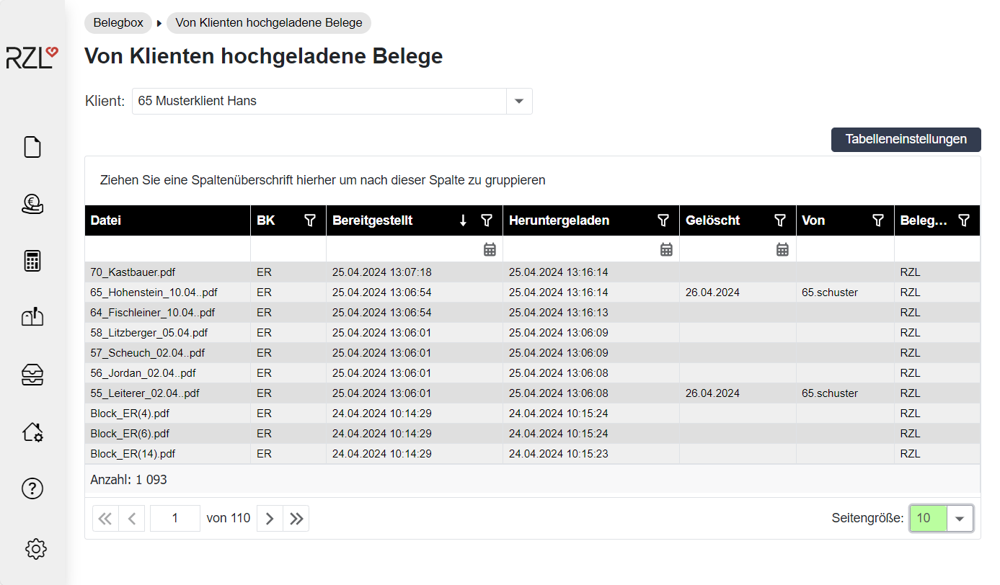

  

# BEGINN
Inhaltsverzeichnis 

# Einrichtung des RZL Klientenportals

## WEB-Service für RZL-Programme einrichten

## Login-Formular auf Ihre Kanzlei-Homepage

# Stammdatenverwaltung

## Stammdaten der Kanzlei

## Klientenstammdaten

## Stammdaten der Kanzleibenutzer

## Stammdaten des Portals

## Mein Profil

# Informationsaustausch

## Allgemeine Listenfunktionen

A

## Dokumente bereitstellen

### Dokumente für einzelne Klienten bereitstellen

### Informationen an alle Klienten übermitteln

### Dokumente an einen Dienstnehmer übermitteln 

### Dokumentenübermittlung aus dem RZL KIS

### Dokumentenübermittlung aus dem RZL PDF-Manager Premium

### Dokumentenübermittlung aus dem RZL PDF Drucker

### Dokumentenlisten

## Nachrichtenübermittlung

### Nachrichten an einen Klienten übermitteln

### Nachrichten an alle Klienten übermitteln

### Nachrichten an einen Dienstnehmer übermitteln

### Nachrichten über das RZL KIS bei Dokumentenübermittlung senden

### Nachrichten über den RZL PDF-Manager Premium senden

## Datenverbrauch

## Benutzerdefinierte Dokumentbereiche ohne RZL KIS/ BOARD

## Benutzerdefinierte Dokumentbereiche mit RZL KIS/ BOARD

# Lohnverrechnung

## Klientendaten aus der RZL Lohnverrechnung exportieren

## Eingabemasken für Klienten konfigurieren

## Vom Klienten freigegebene Daten der Vorerfassung

## Vom Klienten nicht freigegebene Daten

## ÖGK-Anmeldungen / Stornomeldungen

## Anbindung zur rota-Schnittstelle

> 

# Finanzbuchhaltung

## Bereitstellen des Kontenplans in der Fibu/EA-Rechnung Klassik

## Anlage von Kassa/Bankbüchern am RZL Klientenportal

## Vorerfassung Kostenstellen

## Anlage der Registrierkassen

## Anlage von Buchungsregeln

## Vom Klienten freigegebene Daten

## Vom Klienten nicht freigegebene Daten

**1**

## Bereitstellen von Auswertungen aus der RZL Fibu bzw. EA-Rechnung

# Dienstnehmerbereich

Die monatlichen Abrechnungen können für die Dienstnehmer im RZL
Klientenportal bereitgestellt werden. Es besteht auch die Möglichkeit
beliebige Dokumente -- nicht nur die monatlichen Abrechnungen -- für
einzelne Dienstnehmer auf das RZL Klientenportal hochzuladen.

## Anlage der Dienstnehmer für das RZL Klientenportal im Lohnverrechnungsprogramm

Die Freischaltung der Dienstnehmer erfolgt im RZL
Lohnverrechnungsprogramm im Abrechnungsbildschirm *Stammdaten
Dienstnehmer*.

{width="4.5in" height="3.952755905511811in"}

**2**

**1**

Das Feld *E-Mail Adresse* muss ausgefüllt und die Option *Dienstnehmer
am Klientenportal anlegen* (**1**) muss aktiviert werden.

Wenn die Daten aus der RZL Lohnverrechnung ins RZL Klientenportal
hochgeladen werden, erhalten die Dienstnehmer automatisch eine Mail mit
den automatisch generierten Zugangsdaten. Der Benutzername besteht aus
der Klientennummer, der Dienstnehmernummer und dem Nachnamen des
Dienstnehmers. Das Passwort wird von RZL zufällig generiert.

Die PDF-Dokument kann zusätzlich mit einem Passwort versehen werden
(**2**). Das hier eingetragene Passwort muss vom Dienstnehmer dann beim
Öffnen der Abrechnung am Klientenportal eingegeben werden.

{width="5.783464566929134in"
height="2.263779527559055in"}

## Stammdaten Dienstnehmer im RZL Klientenportal

Wenn die Eintragungen in den Stammdaten im Lohnverrechnungsprogramm
vorgenommen worden sind, werden die Dienstnehmer in das RZL
Klientenportal nach Aktualisierung der Daten über *Bearbeiten /
RZL-Klientenportal / Daten aktualisieren* übernommen.

Im Programmteil *Stammdaten / Klienten / Dienstnehmer* können Sie
bestimmte Dienstnehmer-Stammdaten im RZL Klientenportal jederzeit
bearbeiten.

{width="6.354330708661418in"
height="2.15748031496063in"}

**3**

**2**

**1**

Durch Anwahl der Schaltfläche *Dienstnehmer bearbeiten* (**1**) können
die Datenfelder eines Dienstnehmers bearbeitet werden. Der Status eines
Dienstnehmers (**2**) wird im Lohnverrechnungsprogramm in den Stammdaten
des Dienstnehmers festgelegt und dient hier nur zur Information.

Inaktive Dienstnehmer können durch Anwahl des Papierkorbs innerhalb des
Portals (**3**) endgültig gelöscht werden. Beim Löschen eines
Dienstnehmers werden auch alle am RZL Klientenportal bereitgestellten
Dokumente gelöscht. Wird ein aktiver Dienstnehmer ohne Austrittsdatum
gelöscht, wird dieser mit der nächsten Datenbereitstellung des
Lohnprogramms wieder ins RZL Klientenportal übernommen.

{width="6.275590551181103in"
height="1.468503937007874in"}

Innerhalb der Detaildaten können die E-Mail-Adresse und das Passwort
bearbeitet werden. Wird das Feld *Passwort ändern* angewählt, muss der
Dienstnehmer beim erstmaligen Einstieg in das RZL Klientenportal das
Passwort ändern.

## Nachrichten an Dienstnehmer übermitteln.

Die direkte Nachrichtenübermittlung an einzelne Dienstnehmer über das
RZL Klientenportal finden Sie im Kapitel 3.3.3, Seite
[39](#nachrichten-an-einen-dienstnehmer-übermitteln).

## Bereitstellen der Abrechnungen mittels RZL PDF-Manager Premium

Innerhalb des Lohnverrechnungsprogramms müssen Sie im Programmteil
*Ausdruck / Abrechnungen* die Felder *Einzeldruck* und *Klientenportal*
mit der Option *angelegte DN* aktivieren.

{width="5.503937007874016in"
height="4.688976377952756in"}

Nach Anwahl der übrigen gewünschten Optionen wählen Sie die Schaltfläche
*RZL PDF-Drucker* an. Die Abrechnungen werden im RZL PDF-Manager Premium
geöffnet. Dort können Sie die Abrechnungen über die Schaltfläche
*Klientenportal* hochladen.

{width="4.2952755905511815in"
height="4.2952755905511815in"}

**3**

**2**

**1**

Der Dateiname kann manuell oder mittels Platzhalter definiert werden
(**1**). Wählen Sie im Feld *Bereich* die Option *Dienstnehmer* aus
(**2**). Mit der Option *Dienstnehmer Passwort verwenden* (**3**) wird
das beim Dienstnehmer in der Lohnverrechnung hinterlegte PDF-Passwort
gesetzt. Sie können den Dienstnehmern Nachrichten übermitteln.
Aktivieren Sie dazu die Option *Nachricht übermitteln.*

Durch Anwahl der Schaltfläche *Hochladen* werden die Abrechnungen an die
jeweiligen Dienstnehmer übermittelt.

## Bereitstellen der Abrechnungen mittels RZL PDF-Drucker

Die Abrechnungen werden mit den oberhalb beschriebenen Optionen und
ebenfalls Anwahl der Schaltfläche *RZL PDF-Drucker* in den PDF-Drucker
gestellt.

Die Ausgabe in das RZL Klientenportal im PDF-Drucker erfolgt durch
Anwahl des Programmteils *Datei / Exportieren*, oder des Eintrags
*Export* in der Symbolleiste. Beachten Sie hierbei, dass nur jene
Abrechnungen in das RZL Klientenportal exportiert werden, die im RZL PDF
Drucker markiert sind.

{width="6.102362204724409in"
height="3.3338779527559055in"}

**3**

**5**

**4**

**1**

**2**

Im Bereich *Aufteilung in Dateien* wählen Sie den Eintrag *Jeder
Ausdruck in eine eigene Datei* (**2**) aus. Im Feld *Exportieren nach*
(**3**) muss der Eintrag *RZL Klientenportal* angewählt werden. Der
Dateiname kann händisch eingetragen, oder mittels Platzhalter (kleiner
Pfeil rechts) (**4**) automatisch vergeben werden. Im Feld
*KP-Zuordnung* (**5**) müssen Sie den Eintrag *Dienstnehmer* auswählen.
Wenn das Feld *mit Kennwort* (**1**) aktiviert ist, muss der
Dienstnehmer beim Öffnen des PDF Dokuments das Kennwort eingetragen.

Nach Anwahl der Schaltfläche *Exportieren* werden die Abrechnungen im
RZL Klientenportal bereitgestellt. Die Dienstnehmer bekommen ein E-Mail
mit einem Link auf das Portal und müssen sich mit Benutzername und
Passwort einloggen.

{width="6.228346456692913in"
height="2.5826771653543306in"}

Durch einen Klick auf die Datei öffnet sich die Abrechnung und kann
ausgedruckt werden. Durch Anwahl des Download Symbols kann die Datei
heruntergeladen werden. Mit Betätigen des Papierkorbs wird das Dokument
im RZL Klientenportal gelöscht.

## Hochladen von Dokumenten für den Dienstnehmer

Neben den monatlichen Abrechnungen können auch beliebige Dokumente für
einzelne Dienstnehmer auf das RZL Klientenportal hochgeladen werden.
Diese Möglichkeit finden Sie im Programmteil *Informationsaustausch /
Dokumente an einen Dienstnehmer* *übermitteln*.

{width="5.984251968503937in"
height="2.9488188976377954in"}

Hier können Sie nach Anwahl des Klienten aus den -- im RZL
Klientenportal angelegten -- Dienstnehmern auswählen. Um Dateien
hochzuladen klicken Sie in das große Rechteck hinein und wählen Dateien
in der Explorer Struktur aus oder Sie legen Dateien per Drag & Drop ab.

Eine Übersicht über die an Dienstnehmer übermittelten Dokumente erhalten
Sie im Programmteil Informationsaustausch / *Dokumentenlisten / An
Dienstnehmer übermittelte Dokumente*.

{width="6.169291338582677in"
height="3.2874015748031495in"}

**2**

**3**

**1**

Durch Anwahl des Kästchens (1) und den Schaltflächen unterhalb der
Übersicht kann das Dokument entweder gelöscht (2) oder heruntergeladen
(3) werden.

# Belegbox

## Für Klienten bereitgestellte Belege (Belegarchiv)

Im RZL Board besteht die Möglichkeit Belege aus dem Board -- händisch
oder automatisiert ergänzt um die Buchungsdaten -- in der Belegbox des
Klienten am RZL Klientenportal bereitzustellen. Die Übersicht finden Sie
im Kanzleibereich des Klientenportals im Programmteil *Belegbox / Für
Klienten bereitgestellte Belege*.

{width="6.5236220472440944in"
height="3.12992125984252in"}

**3**

**2**

**1**

Markieren Sie hierfür die Belege im Board (auch Mehrfachauswahl
möglich). Anschließend können Sie mit der rechten Maustaste *zum
Klientenportal hochladen* (**1**) anwählen oder mit dem gleichnamigen
Menüpunkt (**2**) die Belege im Klientenportal zur Verfügung stellen.
Die Schaltfläche *Belege synchronisieren* (**3**) lädt alle Belege in
der Liste hoch. Sie können die Belegsynchronisation in den Stammdaten
des Klienten im Bereich *Belegverarbeitung* automatisieren.

**Listenfunktionen**

In der Belegbox werden die verbuchten Belege in Listenform dargestellt.
Diese Liste kann durch Klick auf die gewünschte Überschrift nach jedem
Kriterium sortiert werden. Sie können im Textfeld unterhalb der
Spaltenüberschriften filtern.

{width="6.463453630796151in"
height="3.3622047244094486in"}

Sie haben die Möglichkeit, die Darstellung der Daten nach bestimmten
Spalten zu gruppieren. Dazu ist die gewünschte Spalte, nach der
gruppiert werden soll, in den oberen Bereich zu ziehen (**1**).

Zieht man beispielsweise die Spalte Lieferant/Kunde in den oberen
Bereich, so wird die Darstellung nach den jeweiligen Lieferanten/Kunden
gruppiert. Durch einen Klick auf das Symbol links scheinen sämtliche
Belege des jeweiligen Lieferanten/Kunden auf.

{width="6.330708661417323in"
height="2.968503937007874in"}

**2**

**1**

Durch einen Klick auf das Belegsymbol kann der Beleg geöffnet werden.

{width="6.2637795275590555in"
height="3.9330708661417324in"}

Im rechten unteren Bereich haben Sie die Möglichkeit, die ausgewählten
Belege zu löschen oder herunterzuladen. Beim Herunterladen wird im
Bereich Downloads ein ZIP-Ordner erstellt, der die ausgewählten Belege
in PDF Format beinhaltet.

#### Belegbox Export

Belege können über die Funktion *ausgewählte Belege herunterladen*
exportiert werden. Wenn Sie mehrere Belege ausgewählt haben, wird Ihnen
ein ZIP-Ordner, der die Belege beinhaltet, erstellt.

Sie haben weiters die Möglichkeit, die Belegbox als Darstellung
sämtlicher Belege in Tabellenform im PDF- oder Excel Format
(Schaltfläche *Export PDF* / *Export Excel*) zu exportieren. Ist ein
Filter aktiviert, werden nur die angezeigten Daten exportiert.

## Von Klienten hochgeladene Belege

Sie können unter diesem Menüpunkt sehen, welche Belege der Klient
hochgeladen hat. Ist im Feld *Heruntergeladen* nichts vermerkt, dann
wurden die Belege noch nicht ins KIS/ Board übertragen.

{width="6.47244094488189in"
height="3.7913385826771653in"}

Die Belege werden im Board durch Anwahl des Schaltfläche *Belege
Klientenportal* (**1**) heruntergeladen und können weiterbearbeitet bzw.
übernommen werden.

{width="6.405511811023622in"
height="3.574803149606299in"}

**1**

## Belegsynchronisation/Belegkreise

In den Stammdaten des Klienten im Board können Sie die automatische
Belegsynchronisation aktivieren und festlegen, welche Belegkreise ihrem
Klienten beim Hochladen der Belege zur Verfügung stehen.

{width="6.0984251968503935in"
height="4.480314960629921in"}

**1**

**2**

Der Bereich *Belegsynchronisation aktivieren* (**1**) bietet die
Möglichkeit die Belege automatisch nach Verbuchung ins Klientenportal in
den Bereich *Verbuchte Belege* hochzuladen. Sie legen fest ob Sie
lediglich die Belege des aktuellen Jahres oder bis zu 5 Vorjahre
hochladen möchten. Die dazu notwendige Datenmenge im Klientenportal wird
unterhalb angezeigt.

Im Bereich Belegkreise (**2**) legen Sie fest, welche Belegkreise dem
Klienten beim Hochladen der Belege angezeigt werden. Die im Board
dargestellten Belegkreise kommen aus dem aktuellen Fibu bzw.
EA-Klienten. In der Fibu bzw. in der EA-Rechnung können Sie im
Programmteil *Stamm / Weitere Stammdaten / Belegkreise* neue Belegkreise
anlegen und bestehende bearbeiten.

