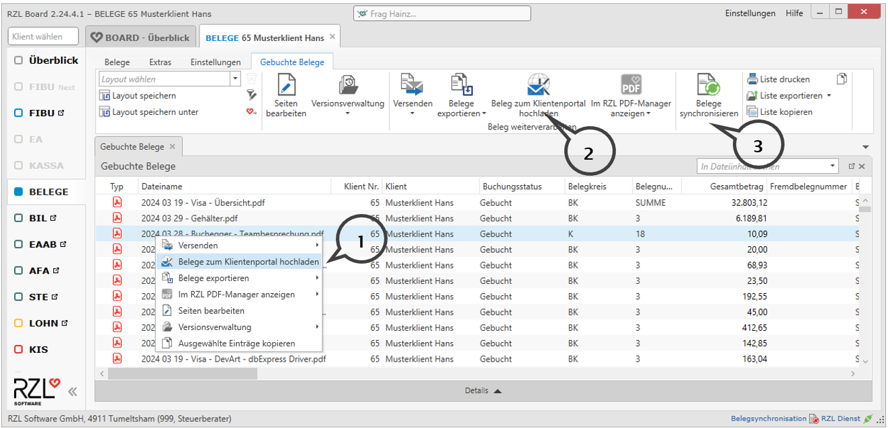
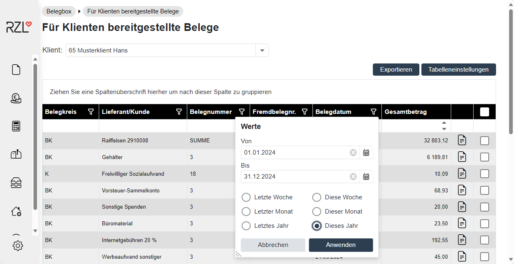
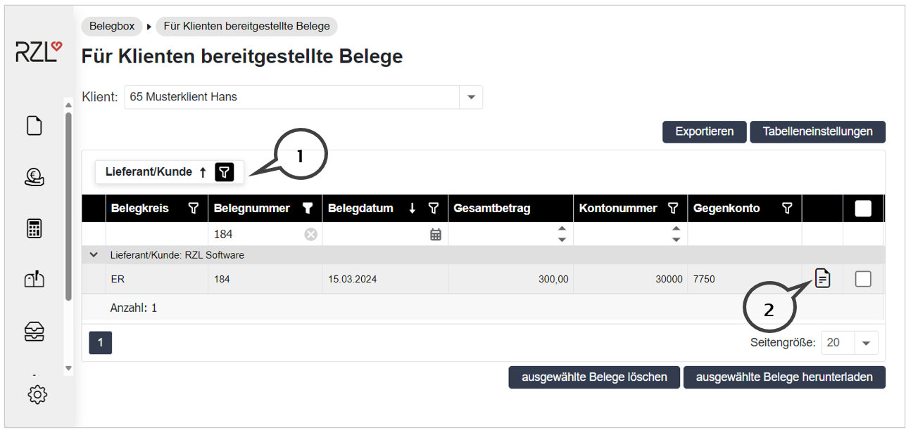
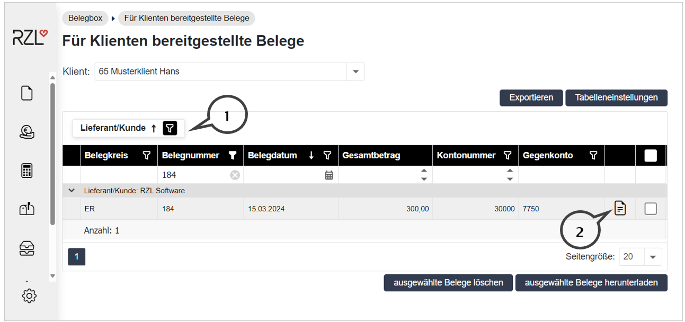

# Für Klienten bereitgestellte Belege (Belegearchiv)

## Im RZL Board
Im RZL Board besteht die Möglichkeit Belege aus dem Board -- händisch oder automatisiert ergänzt um die Buchungsdaten -- in der Belegbox des Klienten am RZL Klientenportal bereitzustellen. Die Übersichtinden Sie im Kanzleibereich des Klientenportals im Programmteil *Belegbox / Für Klienten bereitgestellte Belege*.

Markieren Sie hierfür die Belege im Board (auch Mehrfachauswahl möglich). Anschließend können Sie mit der rechten Maustaste *zum Klientenportal hochladen* (**1**) anwählen oder mit dem gleichnamigen Menüpunkt (**2**) die Belege im Klientenportal zur Verfügung stellen.

Die Schaltfläche *Belege synchronisieren* (**3**) lädt alle Belege in der Liste hoch. Sie können die Belegsynchronisation in den Stammdaten des Klienten im Bereich *Belegverarbeitung* automatisieren.

## Klientenportal Ansicht 

### Listenfunktionen

In der Belegbox werden die verbuchten Belege in Listenform dargestellt. Diese Liste kann durch Klick auf die gewünschte Überschrift nach jedem Kriterium sortiert werden. Sie können im Textfeld unterhalb der Spaltenüberschriften filtern.

Sie haben die Möglichkeit, die Darstellung der Daten nach bestimmten Spalten zu gruppieren. Dazu ist die gewünschte Spalte, nach der gruppiert werden soll, in den oberen Bereich zu ziehen (**1**).

Zieht man beispielsweise die Spalte Lieferant/Kunde in den oberen Bereich, so wird die Darstellung nach den jeweiligen Lieferanten/Kunden gruppiert. Durch einen Klick auf das Symbol links scheinen sämtliche Belege des jeweiligen Lieferanten/Kunden auf.

Durch einen Klick auf das Belegsymbol kann der Beleg geöffnet werden.

Im rechten unteren Bereich haben Sie die Möglichkeit, die ausgewählten Belege zu löschen oder herunterzuladen. Beim Herunterladen wird im Bereich Downloads ein ZIP-Ordner erstellt, der die ausgewählten Belege in PDF Format beinhaltet.

### Belegbox Export

Belege können über die Funktion *ausgewählte Belege herunterladen* exportiert werden. Wenn Sie mehrere Belege ausgewählt haben, wird Ihnen ein ZIP-Ordner, der die Belege beinhaltet, erstellt.

Sie haben weiters die Möglichkeit, die Belegbox als Darstellung sämtlicher Belege in Tabellenform im PDF- oder Excel Format (Schaltfläche *Export PDF* / *Export Excel*) zu exportieren. Ist ein Filter aktiviert, werden nur die angezeigten Daten exportiert.

