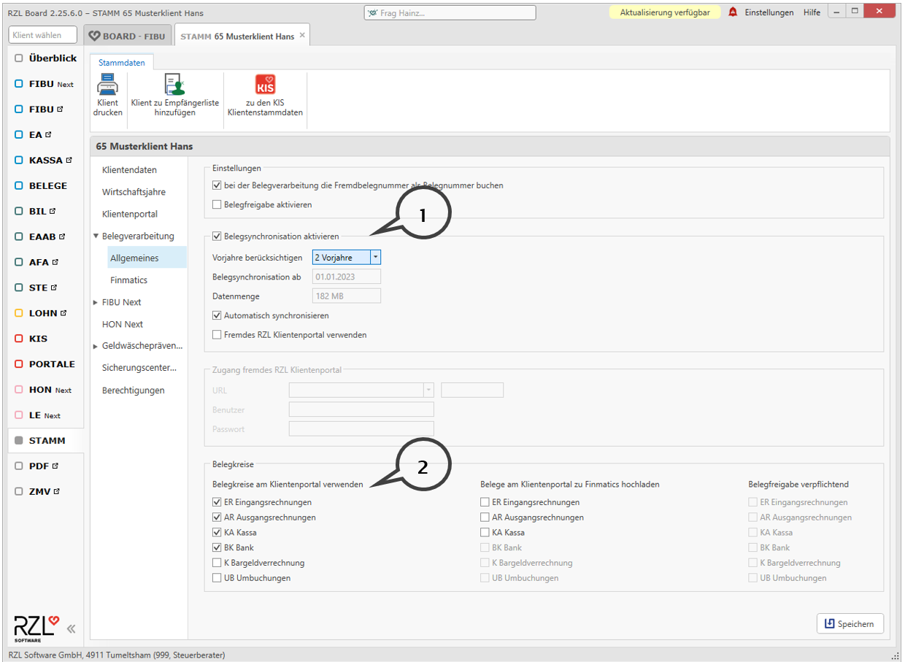

# Belegkreise

In den Stammdaten des Klienten im Board können Sie festlegen, welche Belegkreise ihrem Klienten beim Hochladen der Belege zur Verfügung stehen.

Im Bereich Belegkreise (**2**) legen Sie fest, welche Belegkreise dem Klienten beim Hochladen der Belege angezeigt werden. Die im Board dargestellten Belegkreise kommen aus dem aktuellen Fibu bzw. EA-Klienten. In der Fibu bzw. in der EA-Rechnung können Sie im Programmteil *Stamm / Weitere Stammdaten / Belegkreise* neue Belegkreise anlegen und bestehende bearbeiten.

Detailiertere Schritte finden Sie in unserer [Kurzanleitung individuelle Belegkreise im Klientenportal](https://rzlsoftware.at/fileadmin/user_upload/PDF_Kurzanleitungen/KP/KLIENTENPORTAL_Belegbox_individuelle_Belegkreise_.pdf).