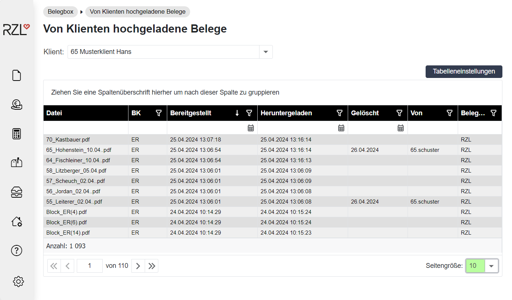
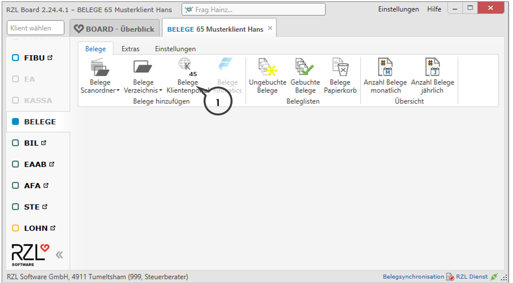

# Von Klienten hochgeladene Belege

## Klientenportal Ansicht
Sie können unter diesem Menüpunkt sehen, welche Belege der Klient hochgeladen hat. Ist im Feld *Heruntergeladen* nichts vermerkt, dann wurden die Belege noch nicht ins KIS/ Board übertragen.

## Board herunterladen
Die Belege werden im Board durch Anwahl des Schaltfläche *Belege Klientenportal* (**1**) heruntergeladen und können weiterbearbeitet bzw. übernommen werden.

