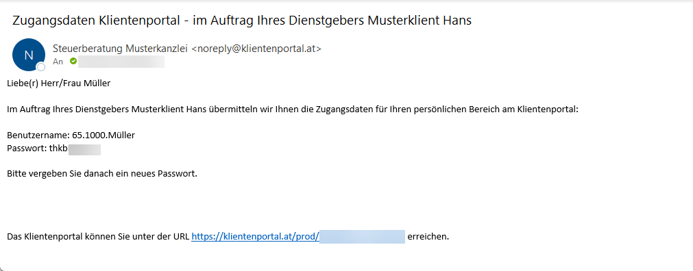

# Einrichtung

## Anlage der Dienstnehmer für das RZL Klientenportal im Lohnverrechnungsprogramm

Die Freischaltung der Dienstnehmer erfolgt im RZL Lohnverrechnungsprogramm im Abrechnungsbildschirm *Stammdaten Dienstnehmer*.

{width="600"}

Das Feld *E-Mail Adresse* muss ausgefüllt und die Option *Dienstnehmer am Klientenportal anlegen* (**1**) muss aktiviert werden.

Wenn die Eintragungen in den Stammdaten im Lohnverrechnungsprogramm vorgenommen worden sind, werden die Dienstnehmer in das RZL Klientenportal nach Aktualisierung der Daten über *Bearbeiten / RZL-Klientenportal / Daten aktualisieren* übernommen.

Falls das Klientenportal bei diesem Lohnklienten noch nicht verwendet wurde, muss ist dieser Programmpunkt *Bearbeiten / RZL Klientenportal / Daten bereitstellen* durchzugeführen.

Wenn die Daten aus der RZL Lohnverrechnung ins RZL Klientenportal hochgeladen werden, erhalten die Dienstnehmer automatisch eine Mail mit den automatisch generierten Zugangsdaten. Der Benutzername besteht aus der Klientennummer, der Dienstnehmernummer und dem Nachnamen des Dienstnehmers. Das Passwort wird von RZL zufällig generiert.

Die PDF-Dokument kann zusätzlich mit einem Passwort versehen werden (**2**). Das hier eingetragene Passwort muss vom Dienstnehmer dann beim Öffnen der Abrechnung am Klientenportal eingegeben werden.

## Stammdaten Dienstnehmer im RZL Klientenportal

Im Programmteil *Stammdaten / Klienten / Dienstnehmer* können Sie bestimmte Dienstnehmer-Stammdaten im RZL Klientenportal jederzeit bearbeiten.

Durch Anwahl der Schaltfläche *Dienstnehmer bearbeiten* (**1**) können die Datenfelder eines Dienstnehmers bearbeitet werden. Der Status eines Dienstnehmers (**2**) wird im Lohnverrechnungsprogramm in den Stammdaten des Dienstnehmers festgelegt und dient hier nur zur Information.

Inaktive Dienstnehmer können durch Anwahl des Papierkorbs innerhalb des Portals (**3**) endgültig gelöscht werden. Beim Löschen eines Dienstnehmers werden auch alle am RZL Klientenportal bereitgestellten Dokumente gelöscht. Wird ein aktiver Dienstnehmer ohne Austrittsdatum gelöscht, wird dieser mit der nächsten Datenbereitstellung des
Lohnprogramms wieder ins RZL Klientenportal übernommen.

Innerhalb der Detaildaten können die E-Mail-Adresse und das Passwort bearbeitet werden. Wird das Feld *Passwort ändern* angewählt, wird ein Email mit dem neuen Passwort an den Dienstnehmer gesendet und es muss der Dienstnehmer beim nächsten Einstieg in das RZL Klientenportal das Passwort ändern.
