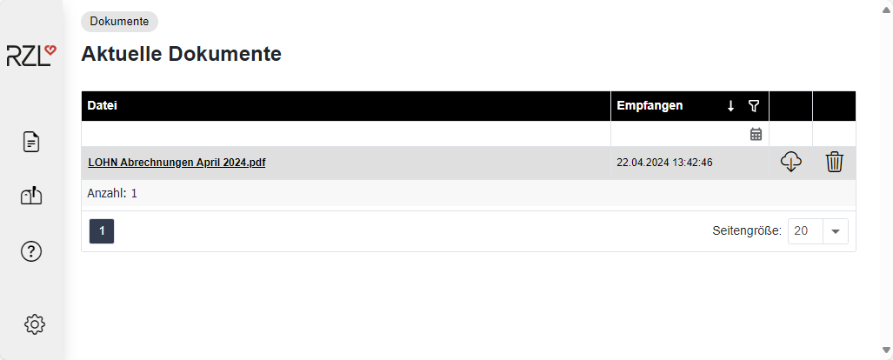

# Senden an Dienstnehmer

## Nachrichten an Dienstnehmer übermitteln.

Die direkte Nachrichtenübermittlung an einzelne Dienstnehmer über das RZL Klientenportal finden Sie im Kapitel 3.3.3, Seite
[39](#nachrichten-an-einen-dienstnehmer-übermitteln).

## Bereitstellen der Abrechnung

### Bereitstellen der Abrechnungen mittels RZL PDF-Manager Premium

Innerhalb des Lohnverrechnungsprogramms müssen Sie im Programmteil *Ausdruck / Abrechnungen* die Felder *Einzeldruck* und *Klientenportal* mit der Option *angelegte DN* aktivieren.

{width="600"}

Nach Anwahl der übrigen gewünschten Optionen wählen Sie die Schaltfläche *RZL PDF-Drucker* an. Die Abrechnungen werden im RZL PDF-Manager Premium geöffnet. Dort können Sie die Abrechnungen über die Schaltfläche *Klientenportal* hochladen.

Der Dateiname kann manuell oder mittels Platzhalter definiert werden (**1**). 

Wählen Sie im Feld *Bereich* die Option *Dienstnehmer* aus (**2**). 

Mit der Option *Dienstnehmer Passwort verwenden* (**3**) wird das beim Dienstnehmer in der Lohnverrechnung hinterlegte PDF-Passwort gesetzt. Sie können den Dienstnehmern Nachrichten übermitteln. Aktivieren Sie dazu die Option *Nachricht übermitteln.*

Durch Anwahl der Schaltfläche *Hochladen* werden die Abrechnungen an die jeweiligen Dienstnehmer übermittelt.

### Bereitstellen der Abrechnungen mittels RZL PDF-Drucker

Die Abrechnungen werden mit den oberhalb beschriebenen Optionen und ebenfalls Anwahl der Schaltfläche *RZL PDF-Drucker* in den PDF-Drucker gestellt.

Die Ausgabe in das RZL Klientenportal im PDF-Drucker erfolgt durch Anwahl des Programmteils *Datei / Exportieren*, oder des Eintrags *Export* in der Symbolleiste. Beachten Sie hierbei, dass nur jene Abrechnungen in das RZL Klientenportal exportiert werden, die im RZL PDF Drucker markiert sind.

Im Bereich *Aufteilung in Dateien* wählen Sie den Eintrag *Jeder Ausdruck in eine eigene Datei* (**2**) aus. 

Im Feld *Exportieren nach* (**3**) muss der Eintrag *RZL Klientenportal* angewählt werden. 

Der Dateiname kann händisch eingetragen, oder mittels Platzhalter (kleiner Pfeil rechts) (**4**) automatisch vergeben werden. 

Im Feld *KP-Zuordnung* (**5**) müssen Sie den Eintrag *Dienstnehmer* auswählen.

Wenn das Feld *mit Kennwort* (**1**) aktiviert ist, muss der Dienstnehmer beim Öffnen des PDF Dokuments das Kennwort eingetragen.

Nach Anwahl der Schaltfläche *Exportieren* werden die Abrechnungen im RZL Klientenportal bereitgestellt. Die Dienstnehmer bekommen ein E-Mail mit einem Link auf das Portal und müssen sich mit Benutzername und Passwort einloggen.

Durch einen Klick auf die Datei öffnet sich die Abrechnung und kann ausgedruckt werden. Durch Anwahl des Download Symbols kann die Datei heruntergeladen werden. Mit Betätigen des Papierkorbs wird das Dokument im RZL Klientenportal gelöscht.

## Hochladen von Dokumenten für den Dienstnehmer

Neben den monatlichen Abrechnungen können auch beliebige Dokumente für einzelne Dienstnehmer auf das RZL Klientenportal hochgeladen werden. Diese Möglichkeit finden Sie im Programmteil *Informationsaustausch / Dokumente an einen Dienstnehmer* *übermitteln*.

Hier können Sie nach Anwahl des Klienten aus den -- im RZL Klientenportal angelegten -- Dienstnehmern auswählen. Um Dateien hochzuladen klicken Sie in das große Rechteck hinein und wählen Dateien in der Explorer Struktur aus oder Sie legen Dateien per Drag & Drop ab.

Eine Übersicht über die an Dienstnehmer übermittelten Dokumente erhalten Sie im Programmteil Informationsaustausch / *Dokumentenlisten / An Dienstnehmer übermittelte Dokumente*.

Durch Anwahl des Kästchens (**1**) und den Schaltflächen unterhalb der Übersicht kann das Dokument entweder gelöscht (**2**) oder heruntergeladen (**3**) werden.