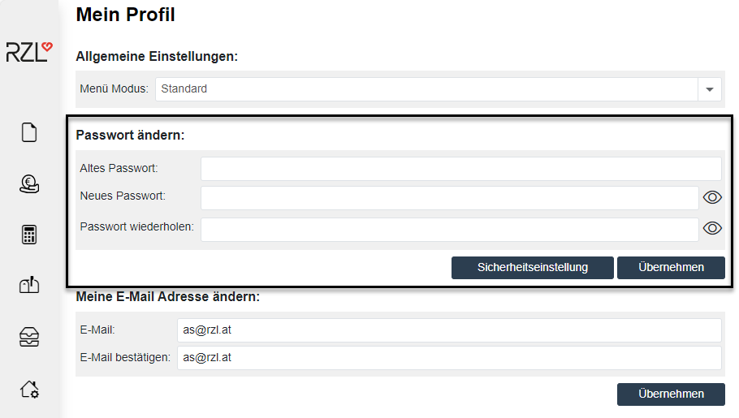

# Anmeldung am RZL Klientenportal

## Internet Start-Adresse

Geben Sie im Internet Browser Ihre Internet Start-Adresse 
(anfangend mit **https://klientenportal.at/**) ein. 

!!! warning "Hinweis"
    Diese Adresse finden Sie in einem separaten RZL Schreiben mit Ihren individuellen Zugangsdaten.

Falls Ihnen dieses Schreiben nicht vorliegt, kontaktieren Sie RZL:

[**vertrieb@rzl.at**](mailto:vertrieb@rzl.at) oder Tel. 07752/252-65

## Anmeldung als Administrator

Zum erstmaligen Einstieg in das RZL Klientenportal geben Sie bitte folgende von RZL vorgegebenen Daten (Benutzername und Passwort) ein.

Klicken Sie auf *Anmelden*.

Daten zum **erstmaligen Einstieg** in das RZL Klientenportal:

- Benutzername: admin

- Passwort: admin

{width="400"}

## Änderung des Passworts

Im nächsten Fenster vergeben Sie Ihr *individuelles* Passwort. Tragen Sie zunächst bei *Altes Passwort* das vorgegebene RZL Passwort *admin* ein. Anschließend vergeben Sie Ihr individuelles Passwort. Um eventuelle Schreibfehler auszuschließen, geben Sie Ihr Passwort im untersten Feld erneut ein.

Klicken Sie anschließend auf *Speichern*.

!!! info "Tipp"
    Verwahren Sie Ihr Passwort bitte sorgfältig. Sollte Ihnen Ihr Passwort nicht mehr bekannt sein, senden Sie bitte ein E-Mail an <klientenportal@rzl.at>. Wir setzten Ihr Passwort nach telefonischer Rücksprache wieder auf admin zurück. Anschließend ist erneut ein individuelles Passwort zu vergeben.
