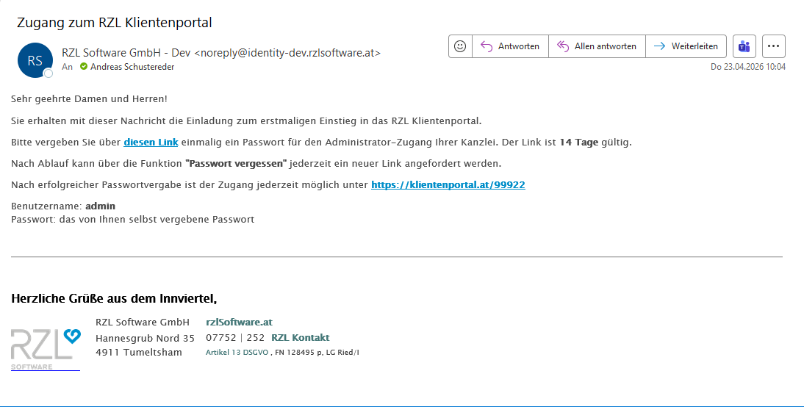
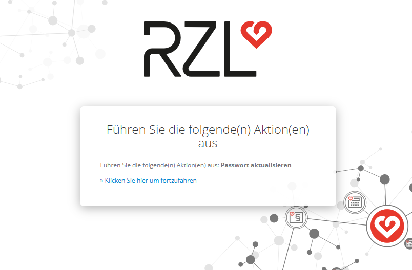
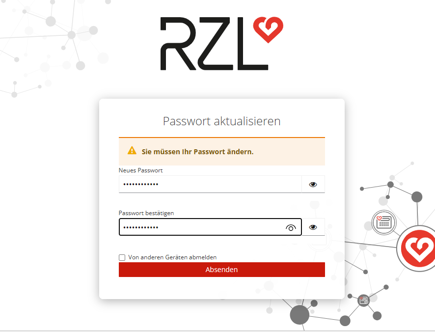
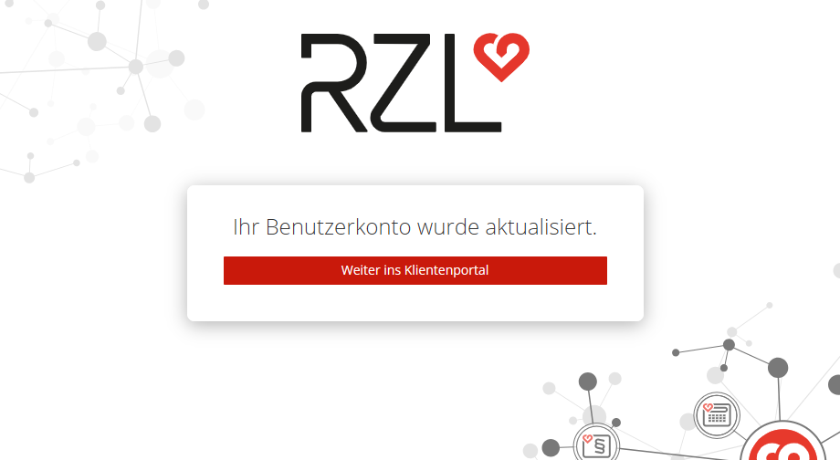
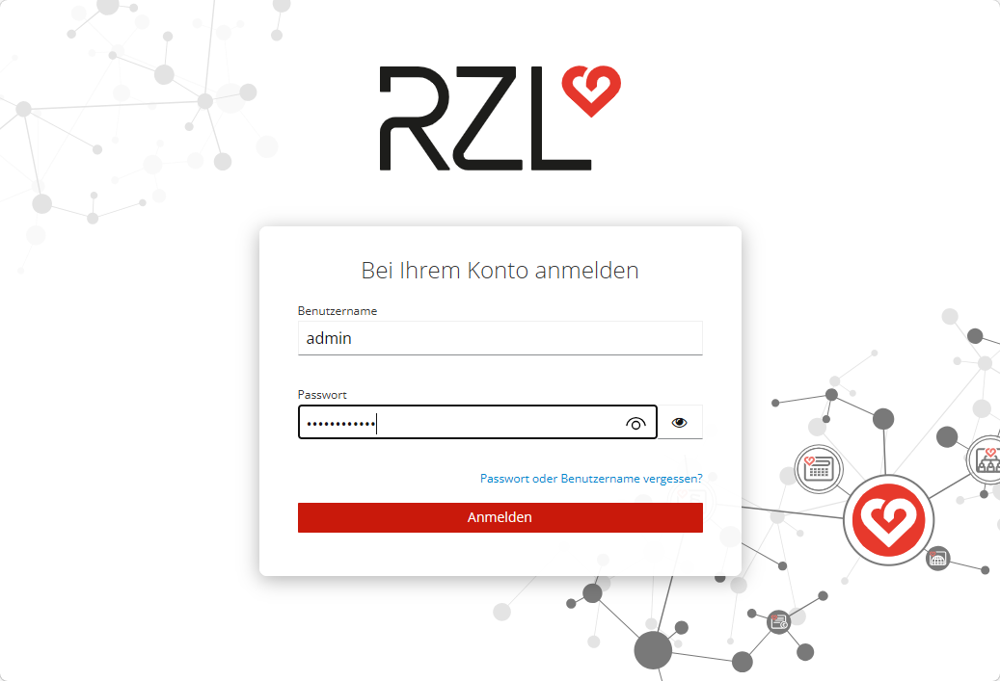
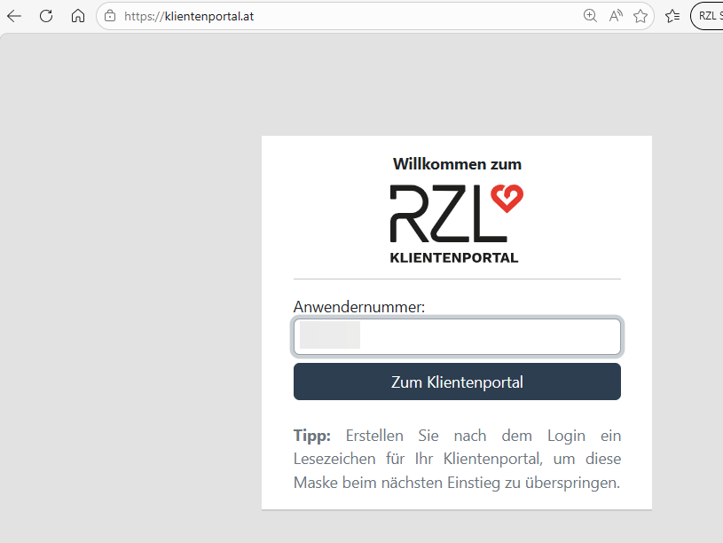
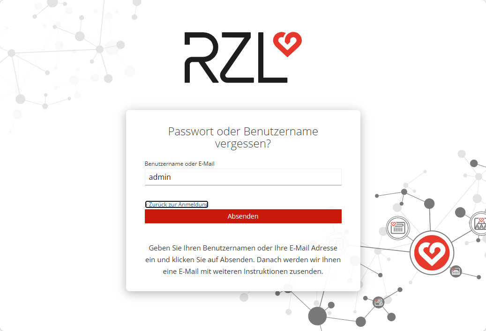

# Erstmalige Anmeldung am RZL Klientenportal

## Zugang zum RZL Klientenportal

Sie erhalten von RZL Software eine E-Mail mit einem Link für die Anlage des Administrator-Zugangs für Ihre Kanzlei.

Der Link ist 14 Tage gültig. Über die Funktion *Passwort vergessen* kann jederzeit ein neuer Link angefordert werden. 

Nach Anwahl des Links erhalten Sie den nachfolgenden Bildschirm angezeigt.

Wählen Sie den Eintrag *Klicken Sie hier um fortzufahren* an.

Vergeben Sie das Administratoren-Passwort und Bestätigen Sie dieses. Nach Anwahl der Schaltfläche *Absenden* wird das Passwort gespeichert und Ihr Benutzerkonto aktualisiert.

Nach Anwahl der Schaltfläche *Weiter ins Klientenportal* können Sie sich erstmals ins Klientenportal einloggen.

Der Benutzername lautet: **admin**

## Passwort vergessen oder der Link ist abgelaufen

Tragen Sie *klientenportal.at* in die Adressleiste Ihres Browsers ein.

Nach Eingabe der Anwendernummer der Kanzlei bei RZL Software ist die Schaltfläche *Zum Klientenportal* anzuwählen.

Der Benutzername ist **admin** und nach Anwahl des Eintrags *Passwort oder Benutzername vergessen?* werden Sie aufgefordert den Benutzer bzw. die zum Benutzer gespeicherte E-Mail Adresse einzutragen.

Nach Anwahl der Schaltfläche *Absenden* erhalten Sie eine E-Mail mit weiteren Instruktionen und einem Link das Passwort zurückzusetzen.

