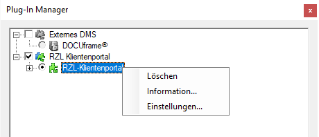
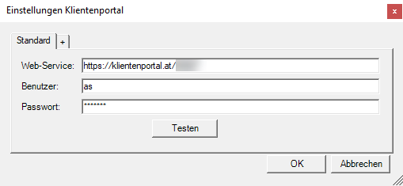

# Web-Service für RZL-Programme

Auf den Arbeitsplatzrechnern (PC jedes Mitarnbeiters), auf denen das RZL Klientenportal genutzt werden soll, ist der WEB-Service je Benutzer zu konfigurieren.

Um aus den RZL-Win-Programmen Zugriff auf das RZL Klientenportal zu erhalten, werden je Benutzer die Kanzleibenutzer-Anmeldedaten (Kapitel
2.3, Seite [20](#stammdaten-der-kanzleibenutzer)) für das RZL Klientenportal benötigt. Entsprechend der dem Kanzleibenutzer zugewiesenen Berechtigungen können aus den RZL-Programmen bestimmte, das RZL Klientenportal betreffende, Funktionen aufgerufen werden.

Öffnen Sie zunächst das Kanzlei-informations-System KIS (bzw. die Zentrale Mandantenverwaltung ZMV). Anschließend können Sie im KIS unter *Extras / RZL Plugin-Manager* (bzw. in der ZMV unter *Hilfsmittel / Plug-Ins*) das RZL Klientenportal anwählen und mit einem Doppelklick auf die Auswahl die Einstellungen öffnen.

{width="400"}

Tragen Sie anstelle der dargestellten XXX Ihre RZL-Anwendernummer ein. 
Als Benutzer wird der separat angelegte Kanzleibenutzer mit dem entsprechenden Passwort hinterlegt. Die Anlage ist im Kapitel 2.3, Seite
[20](#stammdaten-der-kanzleibenutzer) beschrieben.

!!! info "Tipp"
    Wenn die Schaltfläche *Testen* angewählt wird, sollte eine positive Rückmeldung erfolgen.

!!! warning "Hinweis"
    Hinweis für den EDV-Verantwortlichen: Wenn trotz korrekter Eingaben eine Fehlermeldung angezeigt wird, sind die Proxy- und Firewall-Einstellungen des Systems zu prüfen.
