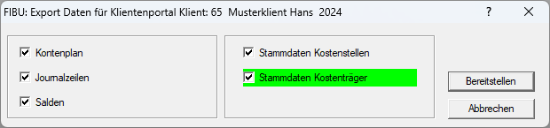
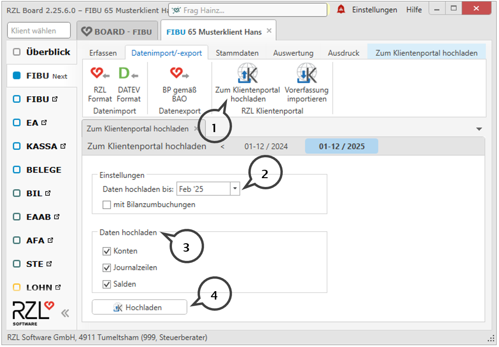

# Fibu Auswertung

Sie können Ihrem Klienten aus der RZL Fibu bzw. EA-Rechnung die Journalzeilen,die Saldenliste und die Kontenebeneam RZL Klientenportal zur Verfügung stellen.

## Einrichtung

### Klientenbenutzer - Berechtigung

Um Ihrem Klienten den Zugang zu diesen Daten zu ermöglichen, müssen Sie zunächst in den Klientenstammdaten unter *Stammdaten / Klienten / Klientenstammdaten* für den jeweiligen Benutzer des Klienten die Berechtigung *Finanzbuchhaltung Auswertungen* aktivieren.

## Bereitstellen von Auswertungen aus der RZL Fibu bzw. EA-Rechnung

In der RZL FIBU Klassik können Sie über *Bearbeiten / Klientenportal /Daten bereitstellen* die Journalzeilen und Salden bereitstellen.

{width="600"}

Ihr Klient hat am RZL Klientenportal immer nur Zugriff auf den bereitgestellten Stand der Daten. Um Ihren Klienten einen laufenden Stand der Journalzeilen und Salden zur Verfügung zu stellen, müssen die Daten aus der RZL Fibu bzw. EA-Rechnung laufend bereitgestellt werden.

## Bereitstellen von Auswertungen aus der RZL Fibu Next

In der FIBU-Next werden die Auswertungen im Programmteil *Datenimport/Export / Zum Klientenportal hochladen* (**1**) zur Verfügung gestellt. Sie können im Bereich *Einstellungen* (**2**) den Zeitraum einschränken und auswählen ob die Bilanzumbuchungen auch hochgeladen werden sollen. Beim *Daten hochladen* (**3**) aktivieren Sie
die notwendigen Felder. Durch Anwahl der Schaltfläche *Hochladen* (**4**) werden die Auswertungen im Klientenportal zur Verfügung gestellt.

## Auswertungen löschen

Im Kanzleibereich haben Sie die Möglichkeit, die bereitgestellten Auswertungen je Klient wieder zu löschen. Den Menüteil dazu finden Sie unter *Finanzbuchhaltung / Auswertungen löschen*.

Nach Auswahl des jeweiligen Klienten wählen Sie die Auswertung und das betreffende Wirtschaftsjahr an. Nach Anwahl der Schaltfläche *Auswertungen löschen* werden die vorher gewählten Daten gelöscht.