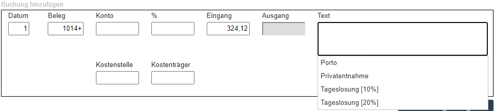
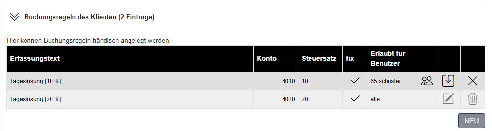

# Stammdaten Buchungsregeln 

## Buchungsregeln - Individuell beim Klienten

Im Programmteil *Finanzbuchhaltung / Stammdaten Buchungsregeln* können Buchungsregel für bestimmte Klienten erfasst werden. Ganz oben im Programmteil wird der Klient ausgewählt.

In dieser Ansicht können Sie unterhalb der Klientenauswahl erkennen, ob für diesen Klienten bereits eine allgemeine Vorlage (**1**) für Buchungsregeln verankert wurde. Buchungsregeln-Vorlagen (kanzleiweit) werden im Programmteil *Finanzbuchhaltung / Vorlagen Buchungsregeln (kanzleiweit)* (vgl. Kap.5.6.2 *Vorlagen Buchungsregeln kanzleiweit*) angelegt und werden in den Klientenstammdaten zugeordnet. 

Im zweiten Bereich kann eine allgemeine Vorlage (**2**), zum Kopieren (**3**) von einzelnen Buchungsregeln, verankert werden.

Wenn der Benutzer im Klientenbereich bei der Vorerfassung bestimmte (Erfassungs)-Texte verwendet, werden die Erfassungen automatisch vorkontiert. Die *Erfassungstexte* (**4**) werden in diesem Programmteil eingetragen und dem gewünschten *Konto* und *Steuersatz* zugeordnet. Nach der Eintragung des Erfassungstextes können Sie im Feld *Konto* mit
der STRG-Taste den Kontenplan aus der Fibu bzw. EA-Rechnung aufrufen und die gewünschten Konten übernehmen.

Das Feld *fix* (**5**) enthält zwingend ein Hackerl, wenn der Steuersatz nicht geändert werden kann (Umsatzsteuerkonten, ig. Erwerbe, keine Steuerverankerung). Auch für Konten mit Vorsteuerverankerung (z.B. Wareneinsatz), kann durch Setzen des Häkchens der Steuersatz fix verankert werden.

Sie können Buchungsregeln auch aus allgemeinen Vorlagen (**2**) durch Anwahl des plus-Symbols (**3**) in den Klientenbereich kopieren. Die beim Klienten gespeicherten bzw. zugeordneten Buchungsregeln können im **PDF** oder **Excel**-Format (**6**) ausgegeben werden.

Wenn der Benutzer im **Klientenbereich** im Rahmen der Vorerfassung die ersten Buchstaben des (Erfassungs)-Textes einträgt, werden die möglichen Buchungsregeln[]{.indexref entry="Buchungsregeln"} angezeigt (siehe Abbildung 5.14).

Der Dialog oberhalb zeigt einen Teil der Erfassung im Klientenbereich. Wenn der Benutzer einen Text eingibt, der als Buchungsregel hinterlegt ist, werden die möglichen Buchungsregeln aufgelistet.

### Verdeckte Erfassungstexte 

Wenn Sie betimmte Texte z.B. 10%, in eine eckige Klammer setzen \[10%\], wird dieser Teil des Textes bei der Vorerfassung im Klientenbereich angezeigt. Dieser Text wird allerdings nicht in die Fibu bzw. EA-Rechnung übernommen.

Mit diesen eckigen Klammern können Sie somit für die Vorerfassung des Benutzers im Klientenbereich mehr Text für die Auswahl der richtigen Buchungsregel zur Verfügung stellen, als in das Textfeld der Fibu bzw. EA-Rechnung übernommen wird.

### Benutzerverwaltung Buchungsregeln

Die Buchungsregeln können auf einzelne beim Klienten angelegte Benutzer eingeschränkt werden.

Die Bearbeitung der Benutzer ist bereits im Kap. 5.3 *Anlage des Kassa/Bankbuchs im RZL Klientenportal* beschrieben. Nach Auswahl des Benutzers muss die Hinterlegung mit dem Speichersymbol gesichert werden.

## Vorlagen Buchungsregeln (kanzleiweit)

Damit Sie Buchungsregeln, die für mehrere Klienten verwendet werden können, nicht bei jedem Klienten einzeln anlegen müssen, können Sie im Programmteil *Finanzbuchhaltung / Vorlagen Buchungsregeln (kanzleiweit)* allgemeine Vorlagen anlegen. Die Kontonummer und Kontostammdaten, die in der Vorlage verwendet werden,
müssen bei den Klienten - die diese Vorlage gemeinsam verwenden - übereinstimmen.

Nach Anwahl der Schaltfläche NEU vergeben Sie eine Bezeichnung für die Vorlage, ordnen einen Referenzklienten zu und speichern (**1**) die Vorlage ab.

Nach Anwahl des Bearbeiten-Symbols (**2**) öffnet sich der Dialog für die Anlage und Bearbeitung der Verbuchungsregeln. Vorlagen können durch Anwahl des Papierkorb-Symbols (**3**) gelöscht werden.

Die Anlage von Buchungsregeln ist im Kap. 5.6.1 *Buchungsregeln -- Individuell beim Klienten* beschrieben.
