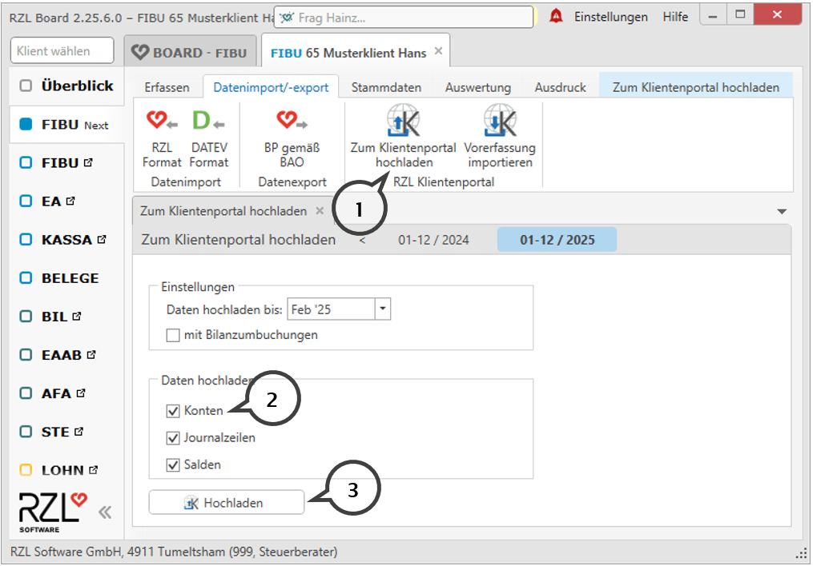

# Stammdaten Kassa/Bankbuch

## Anlage von Kassa/Bankbuch

Kassa/Bankbücher werden im Programmteil *Finanzbuchhaltung / Stammdaten Kassa/Bankbuch* für die einzelnen Klienten angelegt.

Im Bereich *Klient wählen* klicken Sie auf die kleine Pfeiltaste und wählen den gewünschten Klienten aus.

Nach der Auswahl der Klienten können Sie in den unten angeführten Feldern die Kassa/Bankbücher anlegen.

Durch Anwahl der Schaltfläche NEU können Sie ein neues Kassa/Bankbuch anlegen.

Im Feld *Bezeichnung* wird ein Name für das Kassa/Bankbuch vergeben.

Im Feld *Belegkreis* tragen Sie bitte den Belegkreis ein, der in der Buchhaltung bzw. EA-Rechnung für das Kassa/Bankbuch verwendet wird.

Wenn Sie im Feld *Konto* die STRG-Taste anwählen, wird der Kontenplan der Fibu bzw. EA-Rechnung aufgerufen und Sie können das Kassa oder Bankkonto auswählen. Auf diese Kontonummer werden die Vorerfassungen in der Fibu bzw. EA-Rechnung gebucht.

Damit der Benutzer im Klientenbereich beim Vorerfassen die richtigen Anfangs- und Endsalden angezeigt bekommt, erfassen Sie den *Saldo* des eingetragenen Kontos zu einem bestimmten *Stichtag.*

Beim Kassabuch müssen Sie darüber hinaus noch den Merker setzten (**1**), dass es sich um ein Kassabuch handelt. Ein Kassabuch mit einem negativen Kassasaldo (Kassaminus) kann nicht freigegeben werden.

## Einschränken auf bestimmte Benutzer 

Im rechten Bereich des Dialogs unterhalb der Bezeichnung *Erlaubt für Benutzer* steht zunächst der Eintrag *alle*. Somit können alle beim Klienten angelegten Benutzer das Kassa- oder Bankbuch bearbeiten.

Wenn Sie rechts das Bearbeiten- Symbol anwählen, können die berechtigen Benutzer ausgewählt werden.

Im oben angezeigten Dialog werden die berechtigen Benutzer durch ein Hackerl ins Kästchen ausgewählt und durch Anwahl der Schaltfläche *Übernehmen* gespeichert.

Im abgebildeten Beispiel darf das Kassabuch von den Benutzern 65.schuster, 65.schuster1 und 65.schuster7 bearbeitet werden.

## Löschen von Kassa/Bankbüchern 

Angelegte Kassa/Bankbücher können durch Anwahl des Papierkorbes ganz rechts im Dialog gelöscht werden.

Nach Anwahl des Papierkorbsymbols erhalten Sie nachfolgende Abfrage.

{width="400"}

Wenn Sie die oben angezeigte Abfrage mit OK beantworten, wird das jeweilige Kassa/Bankbuch gelöscht. Sind bereits Vorerfassungen vorhanden ist ein Löschen nicht möglich.

{width="400"}