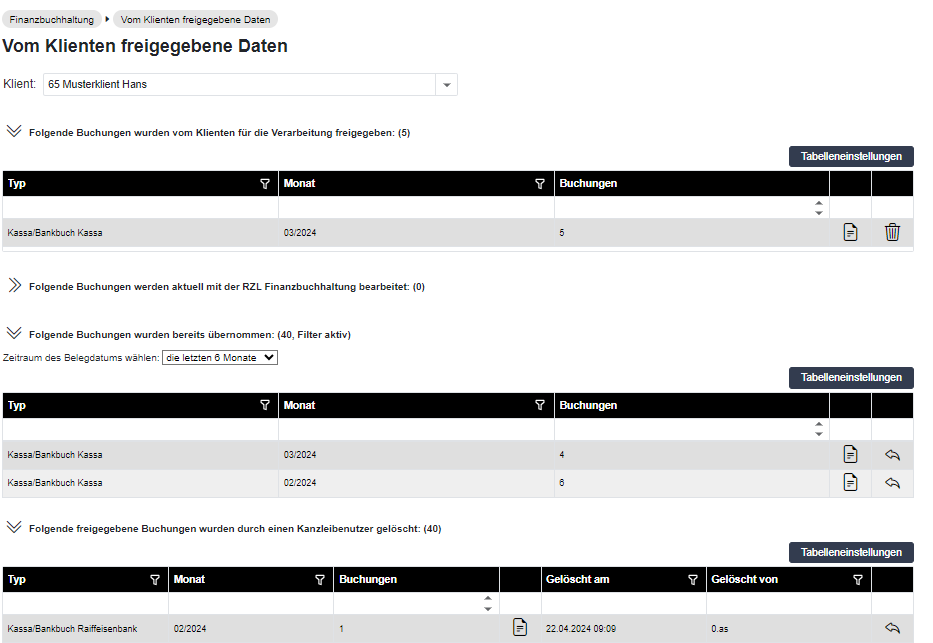

# Vom Klienten freigegebene Daten

Sie haben im Kanzleibereich des RZL Klientenportal im Programmteil *Finanzbuchhaltung / Vom Klienten freigegebene Daten* eine Übersicht über die Daten des Klienten.

Im Bereich *Klient wählen* tragen Sie zunächst den gewünschten Klienten ein. Anschließend erhalten Sie vier verschiedene Bereiche angezeigt.

## Detailansicht
Durch Anwahl des Ansichtssymbols rechts können Sie die Buchungen im Detail aufrufen.

### Saldo der Buchungen 

Durch den Saldo der Buchungen wird die Differenz zwischen Anfangssaldo und Endsaldo des betreffenden Zeitraums detailliert dargestellt. Die Darstellung erfolgt nach dem jeweiligen Status der Buchungen:

- *nicht freigegeben:* dies ist der Saldo der Buchungen, die vom   Klienten noch nicht freigegeben wurden

- *freigegeben:* dies ist der Saldo der Buchungen, welche der Klient bereits freigegeben hat, von Ihnen jedoch noch nicht bearbeitet wurden

- *gesperrt:* dies ist der Saldo der Buchungen, die von Ihnen bereits bearbeitet werden

- *übernommen:* dies ist der Saldo der Buchungen, die von Ihnen bereits übernommen (verbucht) wurden

Nach Anwahl der Schaltfläche *Drucken* können Sie den gewünschten Drucker auswählen und die Ansicht ausdrucken.

## Folgende Buchungen wurden vom Klienten für die Verarbeitung freigegeben 

Hier erhalten Sie eine Ansicht jener Buchungen, die der Klient im Klientenbereich erfasst und bereits freigegen hat. Durch Anwahl des Papierkorb-Symbols kann eine Vorerfassung gelöscht werden.

Gelöschte Vorerfassungen werden in den Bereich *Folgende freigegebenen Buchungen wurden durch einen Kanzleibenutzer gelöscht* verschoben und können bei Bedarf reaktiviert werden.

## Folgende Buchungen werden aktuell mit der RZL Finanzbuchhaltung bearbeitet 

Dieser Bereich zeigt jene Buchungen an, die im Moment in die Buchhaltung/EA-Rechnung übernommen werden (Programmteil in Fibu/EA: *Bearbeiten / Klientenportal / Buchungen importieren*).

## Folgende Buchungen wurden bereits übernommen 

In diesem Bereich sehen Sie die Buchungen, die bereits in die Fibu/EA-Rechnung übernommen worden sind. Hier können Sie - für die Darstellung der Ansicht - im Bereich *Erfassungszeitraum auswählen* -- verschiedene Filter setzen. Der Standardfilter ist *die letzten 6 Monate*. Mögliche Filter sind noch: *die letzten 12 Monate*, *die
letzten 24 Monate* und *alle*.

In Ausnahmefällen kann eine bereits übernommene Vorerfassung durch Anwahl des Pfeilsymbols ganz rechts wieder aktiviert werden. Das bedeutet, dass die Buchungen wieder übernommen werden können.

## Folgende freigegebene Buchungen wurden durch einen Kanzleibenutzer gelöscht

Dieser Bereich zeigt, welche freigegebenen Buchungen durch welchen Kanzleibenutzer gelöscht wurden und zu welchem Zeitpunkt die Löschung erfolgte. Diese Vorerfassungen können durch Anwahl des Pfeil-Symbols ganz rechts wieder aktiviert werden.