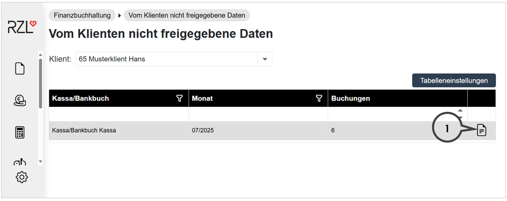

# Vom Klienten nicht freigegebene Daten

Im Programmteil *Finanzbuchhaltung / Vom Klienten nicht freigegebene Daten* werden die noch nicht freigegebenen Vorerfassungen des Klienten
aufgelistet und können aufgerufen werden (**1**).

