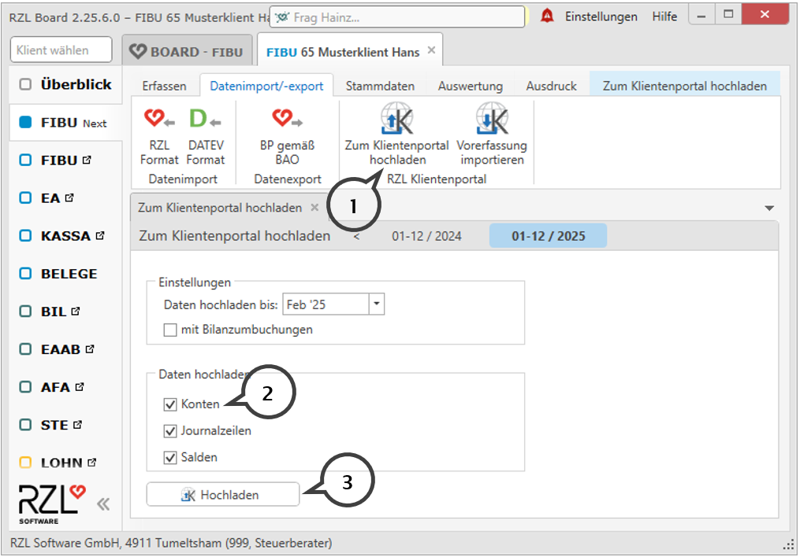

# Bereitstellen des Kontenplans

## Bereitstellen des Kontenplans in der Fibu/EA-Rechnng Klassik

Bei der Anlage der Kassa/Bankbücher und der Verbuchungsregeln wird im RZL Klientenportal auf den Kontenplan der Fibu bzw. EA-Rechnung zugegriffen. Deshalb müssen Sie vorab in der Fibu bzw. EA-Rechnung den Programmteil *Bearbeiten / Klientenportal / Daten bereitstellen* anwählen und über diesen Menüpunkt den Kontenplan bereitstellen.

{width="600"}

## Bereitstellen des Kontenplans in der Fibu Next

In der FIBU-Next werden die Daten im Programmteil *Datenimport/-export /
Zum Klientenportal hochladen* (**1**) bereitgestellt.

Für die Fibuvorerfassung müssen die Konten (**2**) aktiviert und die
Schaltfläche Hochladen (**3**) angewählt werden.