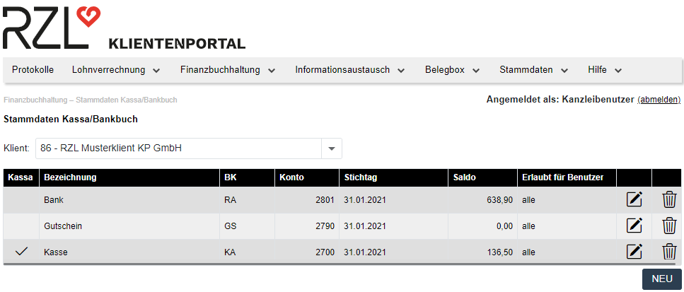
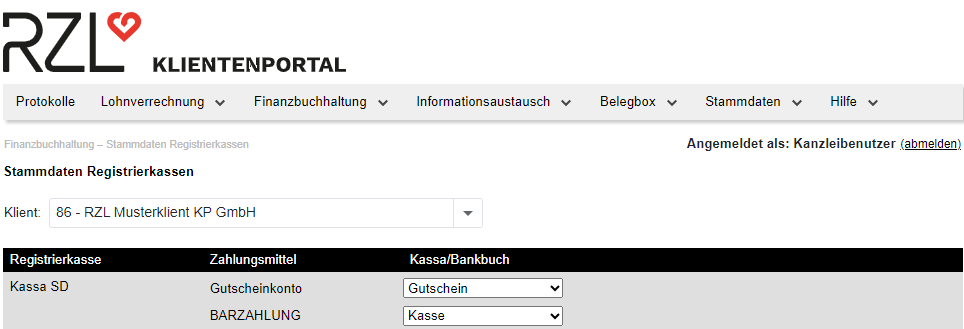

# Stammdaten Registrierkasse

Nach Anlage der Kassa/Bankbücher (*Finanzbuchhaltung / Stammdaten Kassa/Bankbuch*; siehe Kapitel 5.2) sind über den Menüpunkt *Finanzbuchhaltung / Stammdaten Registrierkassen* die Einstellungen zu den Registrierkassen durchzuführen.

Unter *Finanzbuchhaltung / Stammdaten Registrierkassen* können Sie anschließend die Einstellungen zu den Registrierkassen durchführen. Das RZL Klientenportal greift dabei auf die unter *my.kassandro.at* hinterlegten Daten zu. Ordnen Sie hier das jeweilige Zahlungsmittel dem jeweiligen Kassa/Bankbuch zu. Mit *Speichern* werden die Einstellungen gesichert.

Somit sind alle erforderlichen Stammdaten für die Registrierkassa angelegt und der Klient kann dem Steuerberater die Daten der Registrierkassen über die FIBU-Vorerfassung am RZL Klientenportal zur Verfügung stellen.