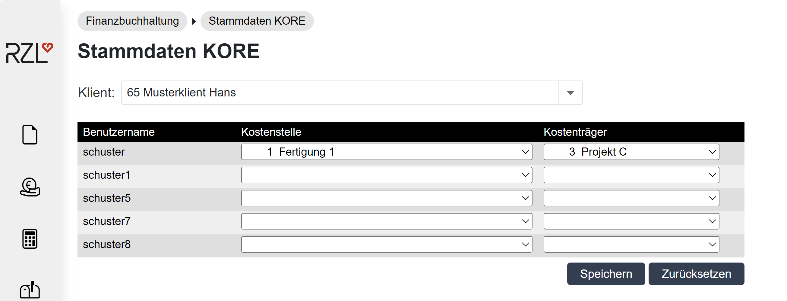

# Stammdaten Kostenrechnung

Wenn im Buchhaltungsklienten eine Kostenstellen und/oder eine Kostenträgerrechnung gebucht wird, kann im RZL Klientenportal im Programmteil *Finanzbuchhaltung / Stammdaten KORE* den Benutzern eine Kostenstelle und ein Kostenträger zugeordnet werden.

Die Anwendung der in diesem Bereich definierten Werte hängt von der Einstellung ab, ob für diesen Klienten die Erfassung der Kostenstelle / Kostenträger bei der Buchungsvorerfassung aktiviert ist (siehe Klientenstammdaten).

**nicht aktiv**

Ist die Erfassung der Kostenstelle / Kostenträger bei der Buchungsvorerfassung nicht aktiviert, so gilt: Die für einen Benutzer festgelegte Kostenstelle / Kostenträger werden
bei der Freigabe der Vorerfassungen für die Buchungszeilen automatisch gesetzt. Somit sind die in diesem Abschnitt definierten Werte erst zum Zeitpunkt der Freigabe relevant - nicht zum Zeitpunkt der Erfassung.

**aktiv**

Ist die Erfassung der Kostenstelle / Kostenträger bei der Buchungsvorerfassung aktiviert, so gilt: Die für einen Benutzer festgelegte Kostenstelle / Kostenträger werden
bei der Vorerfassung der Buchungszeilen automatisch vorgeschlagen.