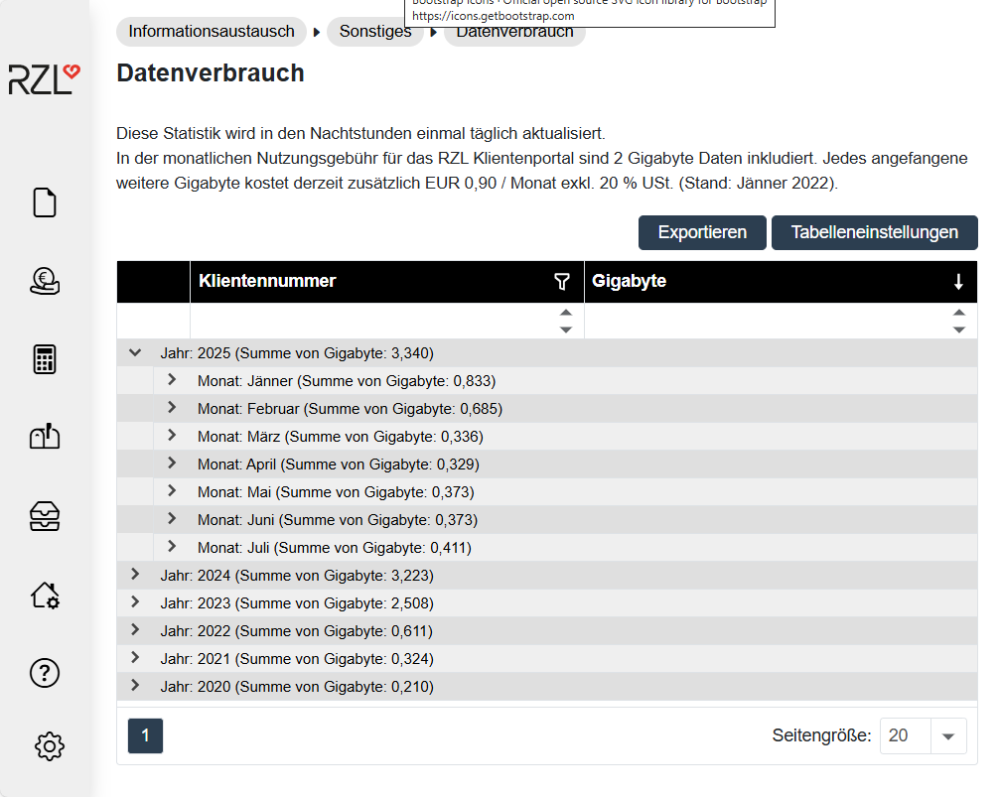

# Datenverbrauch

Der Programmpunkts *Informationsaustausch / Sonstiges* bietet die Möglichkeit, Ihren Datenverbrauch aufzurufen. Die Aktualisierung des Datenverbrauchs erfolgt einmal pro Tag. Die Darstellung des Datenverbrauchs erfolgt monatlich getrennt nach Klienten.

