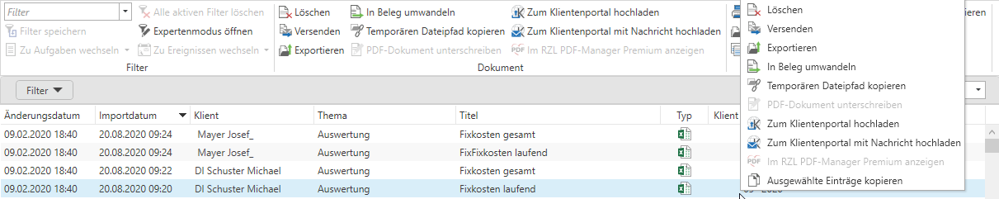

# Dokumentenübermittlung aus RZL KIS

Im KIS gespeicherte Dokument können im Header oder in der Dokumentenliste mit der rechten Maustaste und den Optionen *Zum Klientenportal hochladen* oder *Zum Klientenportal mit Nachricht hochladen* sofort dem Klienten zur Verfügung gestellt werden.

