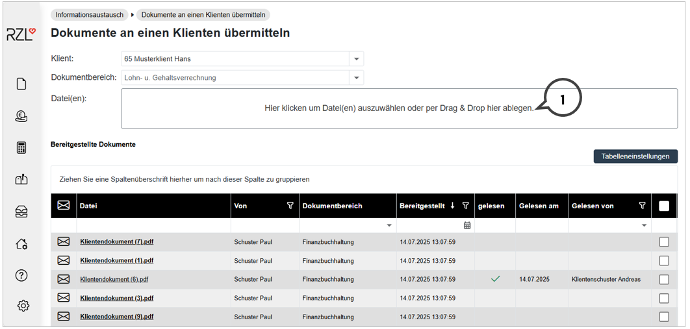
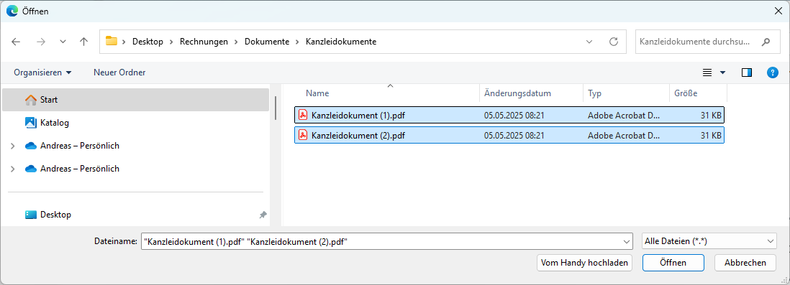
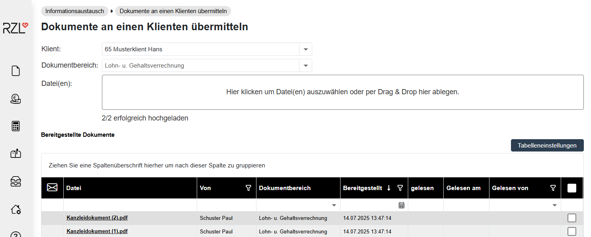
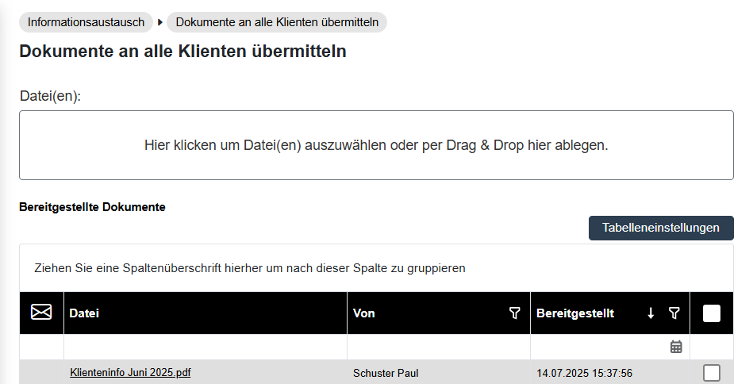
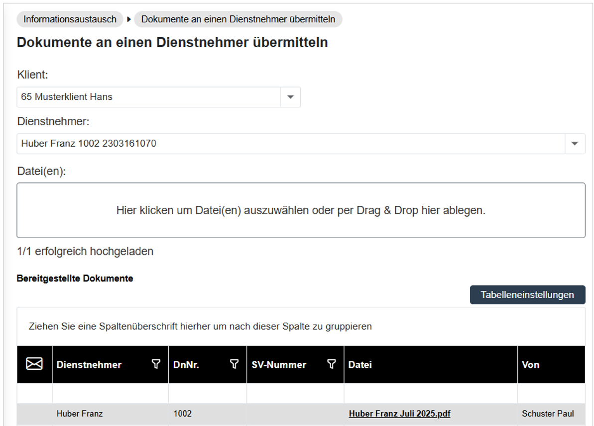

# Dokumentenübermittlung im Klientenportal

## Dokumente für einzelne Klienten bereitstellen

Der Programmteil *Informationsaustausch / Dokumente an einen Klienten übermitteln* ermöglicht Ihnen das Hochladen von Dokumenten für einzelne im RZL Klientenportal angelegte Klienten.

Wählen Sie zunächst den gewünschten Klienten und Dokumentbereich aus. Nachfolgend können Sie entweder in das große Rechteck (**1**) mit der Maus klicken und die Datei(en) durch Anwahl in der Explorer Struktur hochladen oder per Drag & Drop ablegen und ebenfalls hochladen.

Im Dialogfenster können Sie ein bestimmtes Dokument suchen und auswählen. Durch einen Doppelklick auf das Dokument oder nach Anwahl der Schaltfläche *Öffnen* wechselt das Programm in den Ausgangsbildschirm zurück und die angewählten Dokumente werden ins Klientenportal hochgeladen.

!!! info "Tipp"
    Sie können auch mehrere Dokumente gleichzeitig übermitteln. Halten Sie hierfür die STRG-Taste gedrückt und wählen Sie die gewünschten Dokumente aus.

Im unteren Bereich des Programmteils sehen Sie die Dokumente, die bereits hochgeladen wurden. Angezeigt werden der jeweilige Dokumentbereich und wann das Dokument bereitgestellt und gelesen wurde.

## Informationen an alle Klienten übermitteln

Unter *Informationsaustausch / Informationen an alle Klienten übermitteln* können Sie Informationen (Dokumente) allen im Klientenportal angelegten Klienten zur Verfügung stellen.

Die Vorgehensweise entspricht der Versendung von Dokumenten an einen Klienten. 

## Dokumente an einen Dienstnehmer übermitteln

Die notwendigen Schritte zur Anlage der Dienstnehmer für das Bereitstellen der Daten werden [hier](../../Dienstnehmerbereich/Einrichtung.md) beschrieben.

Zur Übermittlung von Dokumenten wählen Sie den Menüpunkt *Informationsaustausch / Dokumente an einen Dienstnehmer übermitteln* aus.

Hier können Sie nach Anwahl des Klienten aus den im RZL Klientenportal angelegten Dienstnehmern auswählen. Nachfolgend können Sie entweder in das große Rechteck (**1**) mit der Maus klicken und die Datei(en) durch Anwahl in der Explorer Struktur hochladen oder per Drag & Drop ablegen und ebenfalls hochladen.

Anschließend wird dem Dienstnehmer das Dokument im Klientenportal zur Verfügung gestellt. Bereitgestellte Dokumente werden im unteren Bereich des Bildschirms angezeigt.