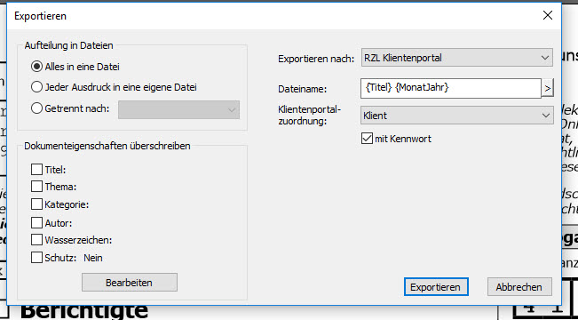

# Dokumentenübermittlung aus dem RZL PDF Drucker

Im RZL PDF-Drucker erstellte Dokumente können über die Schaltfläche *Export* ins RZL Klientenportal hochgeladen werden.

Wählen Sie dazu die Option *Exportieren nach: RZL Klientenportal* an. Nach Eingabe des gewünschten Dateinamens und der Zuordnung im Klientenportal können Sie optional noch das Passwort des Klienten zuordnen. Nach Anwahl der Schaltfläche *Exportieren* wird das Dokument hochgeladen.