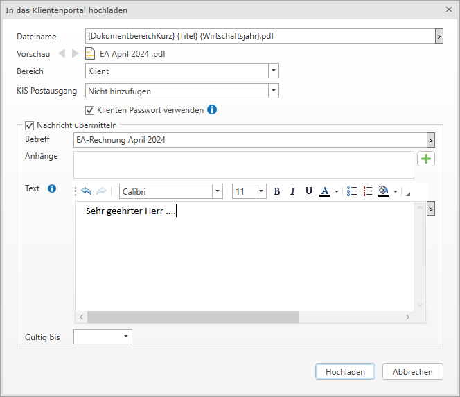

# Dokumentenübermittlung aus dem RZL PDF-Manager Premium

Ein im RZL PDF-Manager-Premium erstelltes Dokument kann in der Dokumentenansicht über die Schaltfläche *Klientenportal* dem Klienten zur Verfügung gestellt werden. Gleichzeitig ist die Ablage im RZL KIS (Postausgang) und die Übermittlung einer Nachricht möglich.

Eine detaillierte Beschreibung des Programmteils finden Sie im Handbuch [RZL PDF-Manager Premium](/PDFManager).