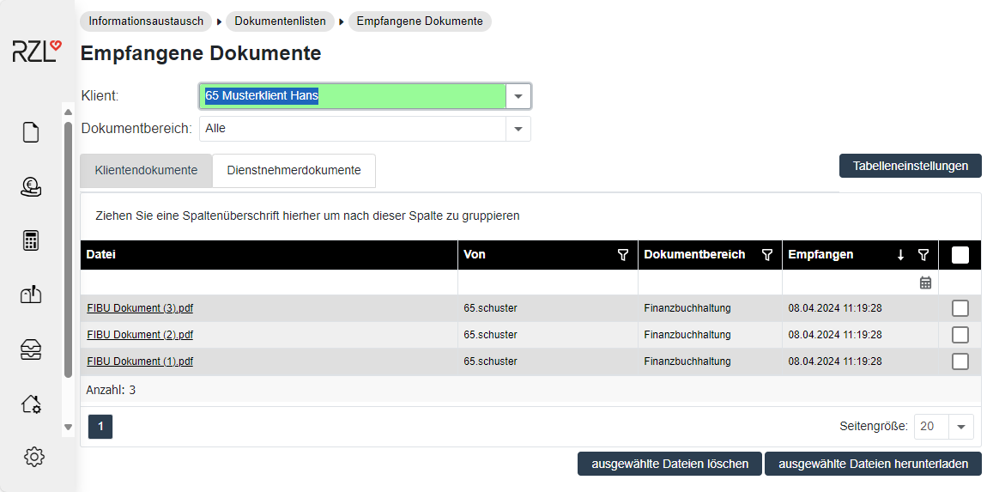
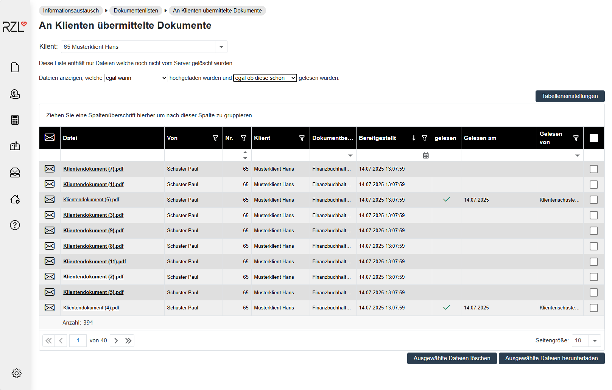

# Dokumentenliste

## Empfangene Dokumente 

Der Programmteil *Informationsaustausch / Dokumentenlisten /Empfangene Dokumente* zeigt die Dokumente, die von den Klienten zur Verfügung gestellt worden sind. Sie können zwischen den Registerblättern *Klientendokumente* und *Dienstnehmerdokumente* auswählen. Durch einen Doppelklick auf den Dateinamen wird das Dokument aufgerufen.

Sie können die Ansicht auf einzelne Klienten einschränken oder die Dokumente aller Klienten auflisten.

## An Klienten übermittelte Dokumente

Im Programmteil *Informationsaustausch / Dokumentenlisten / An Klienten übermittelte Dokumente finden Sie* die an die Klienten übermittelten Dokumente. Durch einen Doppelklick auf den Dateinamen wird das Dokument aufgerufen.

## An Dienstnehmer übermittelte Dokumente 

Im Programmteil *Informationsaustausch /* *Dokumentenlisten / An Dienstnehmer übermittelte Dokumente* werden an Dienstnehmer übermittelte Informationen angezeigt.

## Gelöschte Dokumente 

Im Programmteil *Informationsaustausch* / *Dokumentenlisten / Gelöschte Dokumente* sehen Sie eine Liste mit den bereits gelöschten Dokumenten.

In dieser Liste können die Dokumente nicht mehr aufgerufen werden. Sichtbar sind der Name der Datei und der Benutzer, der die Datei gelöscht hat sowie das Datum der Löschung. Ins KIS gespeicherte Dokumente werden automatisch gelöscht und erhalten in der Spalte *Im KIS gespeichert* ein Hakerl.