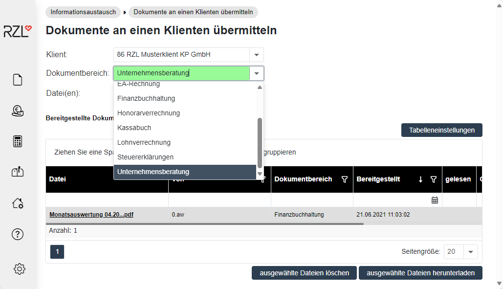

# Dokumentenbereiche

## Benutzerdefinierte Dokumentenbereiche mit RZL KIS/Board

Wird das KIS/ Board verwendet, können die benutzerdefinierten Dokumentbereiche im Kanzlei-Informations-System unter *Verwaltung/Dokumentbereich* angelegt und bearbeitet werden.

In der Übersicht werden alle vom Anwender lizensierten Programme als RZL Standard Dokumentbereich mit einem Hackerl versehen angeführt. Diese Dokumentbereiche können vom Anwender nicht verändert oder gelöscht werden.

Unter gleichnamigen Menüpunkt kann ein *neuer Dokumentbereich* angelegt werden. Dafür ist im Feld *Bezeichnung* der gewünschte Name einzugeben und mit *Speichern* zu bestätigen.

Sollen bestehende Dokumentbereiche zusammengelegt werden, kann das unter dem Menüpunkt *Dokumentbereich übertragen* vorgenommen werden. Mit dieser Funktion werden die mit diesem Dokumentbereich verknüpften Nachrichten und Dokumente dem neuen Dokumentbereich zugeordnet.

Benutzerdefinierte Dokumentbereiche, die nicht verwendet werden, können über *Dokumentbereich löschen* gelöscht werden.

Im KIS/ BOARD vorgenommene Änderungen werden automatisch zum Klientenportal hochgeladen und stehen da zur Verfügung. Über den Menüpunkt *Zum Klientenportal* *hochladen* kann der Datenaustausch mit dem Klientenportal manuell angestoßen werden.

Anschließend sind bei dem Kanzleibenutzer und Klientenbenutzer die Berechtigung für den neu angelegten Dokumentbereich zu hinterlegen. 

## Benutzerdefinierte Dokumentenbereiche ohne RZL KIS/Board
Im Programmpunkt *Informationsaustausch / Sonstiges* können unter dem gleichnamigen Menüpunkt *benutzerdefinierte Dokumentbereiche* angelegt werden. Diese stehen dann ebenfalls im Auswahldialog neben den Standard-Dokumentbereichen (entspricht den lizensierten Programmen) zur Verfügung.

Tragen Sie im Bereich *Neuer Name* die Bezeichnung des Dokumentbereichsein und klicken Sie nachfolgend auf den Punkt *Erstellen*. Im oberen Bereich werden alle Dokumentbereiche, die benutzerdefiniert angelegt wurden, angezeigt. Noch nicht verwendete benutzerdefinierte Dokumentbereiche können gelöscht werden.

Nach Anlegen eines Dokumentbereichs können Sie die neue Berechtigung den Klienten und Kanzleibenutzern zuweisen. Im nachfolgenden Bildschirm ist die Zuweisung zu einem Kanzlei-Mitarbeiter abgebildet.

Wählen Sie hier den neu angelegten Dokumentbereich und die gewünschten Klienten aus und bestätigen Sie die Eingabe mit *Speichern*. Durch diese Auswahl können Sie nun, wenn Sie Dokumente an einen Klienten übermitteln, den neu angelegten Dokumentbereich verwenden.

Damit Ihr Klient auch diesen neuen Dokumentbereich verwenden kann, ist dieser in den Benutzerstammdaten des Klienten zu aktivieren. Gehen Sie hierfür unter *Stammdaten / Klienten / Klientenstammdaten* und wählen Sie die betreffenden Klienten aus. Anschließend sind bei den Berechtigungen die Dokumentbereiche beim gewünschten Benutzer anzuwählen
und mit *Speichern* zu bestätigen.

