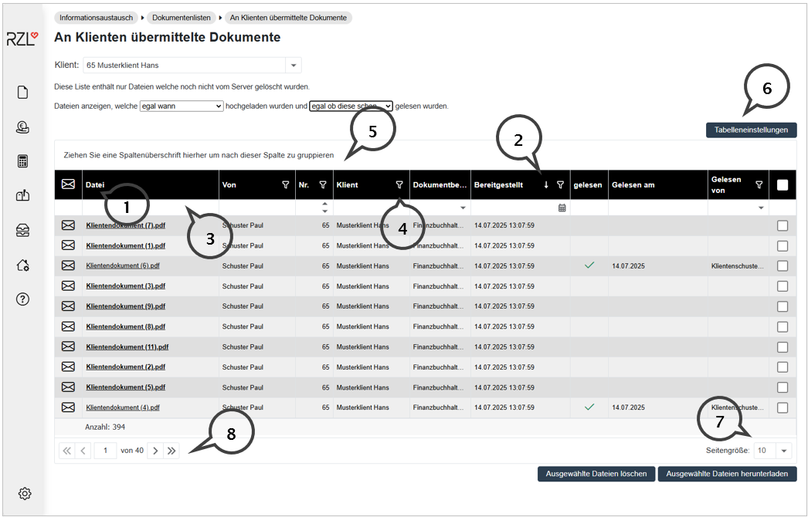
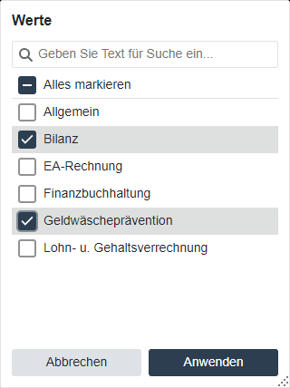
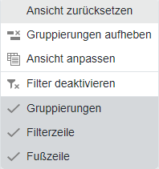

# Allgemeine Listenfunktion

Am Beginn dieses Kapitels 3 *Informationsaustausch* werden die allgemeinen Listenfunktionen anhand des Programmteils *Informationsaustausch / Dokumentenlisten / An Klienten übermittelte Dokumente* erläutert. Diese Funktionen finden sich auch in den Listen des Programmteils *Belegbox*.

(**1**) Durch Anwahl der Spaltenbezeichnung wird die Liste auf- oder absteigend sortiert.

(**2**)  Das kleine Symbol neben der Spaltenbezeichnung zeigt an, dass die Liste nach dieser Eigenschaft sortiert ist (hier die Spalte *Bereitgestellt*).

(**3**)  In den Textfeldern können Suchbegriffe eintragen werden. Die Liste wird nach dem eingetragenen Suchbegriff gefiltert.

(**4**)  Nach Anwahl des kleinen Filtersymbols können Sie im oberen Bereich ebenfalls durch Texteingabe - filtern. Zusätzlich werden die in der Spalte verwendeten Eigenschaften angezeigt, nach denen Sie - durch Setzen von Hackerln und Anwahl der Schaltfläche *Anwenden* - filtern können.

{width="300"}

(**5**)  Eine Gruppierung nach Spalten ist möglich, indem Sie mit der Maus die gewünschte Spalte in den Bereich links oben ziehen.

(**6**)  Nach Anwahl der Schaltfläche *Tabelleneinstellungen* können zwischen nachfolgenden Einträgen auswählen.

{width="300"}

*Ansicht zurücksetzen* macht Änderungen innerhalb der Tabelle > rückgängig.

*Gruppierungen aufheben* beseitigt bestehende Gruppierungen. 

Nach Anwahl des Eintrags *Ansicht anpassen* können Sie Spalten aus- und einblenden.

Bestehende Filter werden nach Anwahl des Eintrags *Filter deaktivieren* entfernt. 

Im unteren Bereich können Sie den Bereich *Gruppierungen*, die *Filter*- und die *Fußzeile* aus- und einblenden.

(**7**)  Im rechten unteren Bereich legen Sie fest, wie viele Einträge pro Seite angezeigt werden sollen.

(**8**)  Im linken Bereich sehen die Anzahl der Seiten und die Anzahl der Elemente. Mit Direktanwahl mit der Maus können Sie zwischen den Seiten navigieren.
