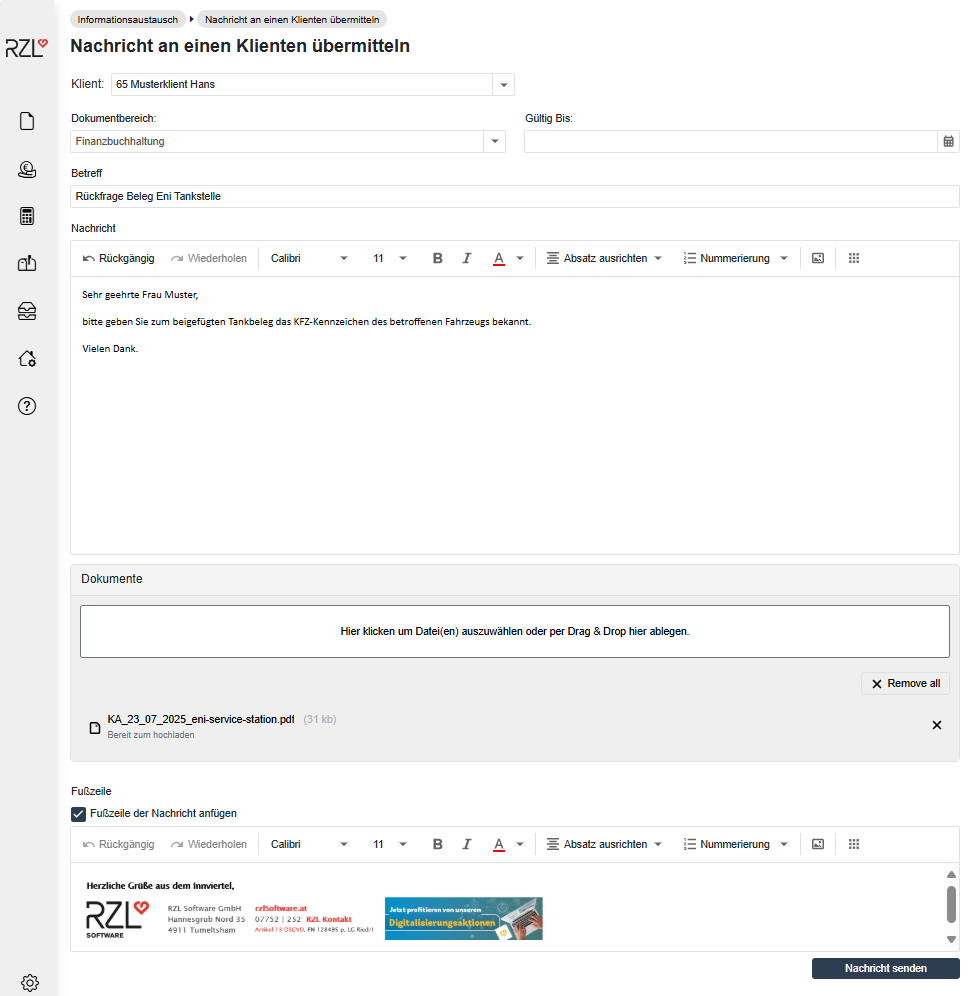

# Nachrichten über das Klientenportal senden 

## Nachrichten an einen Klienten übermitteln

Im Programmteil *Informationsaustausch / Nachricht an einen Klienten übermitteln* können Sie Nachrichten mit Anhängen an den gewünschten Klienten versenden. Nach Auswahl des Klienten gelangen Sie in folgende Ansicht.

### Dokumentbereich

Wählen Sie den benötigten Dokumentbereich im Drop-Down Menü an. Nur Klientenbenutzer, die in den Stammdaten diesem Dokumentbereich zugeordnet sind, können diese Nachricht lesen. [siehe Klientenbenutzer](../../Stammdaten/KlientStammdaten/Klientenbenutzer.md)

### Gültig Bis 

Nach Auswahl des Dokumentbereichs können Sie im Feld *Gültig Bis* ein Enddatum der Nachricht hinterlegen. Die Nachricht wird nach diesem Datum automatisch vom Portal gelöscht.

### Betreff 

Geben Sie hier einen kurzen Nachrichtenbetreff ein.

### Nachricht 

Hier geben Sie die gewünschte Nachricht an Ihren Klienten ein. Die Tastenkombination STRG+RETURN fügt einen Zeilenumbruch ein.

### Dokumente 

Sie können optional ein Dokument an die Nachricht anhängen. Diese werden dann nicht nur in der Nachricht, sondern auch in der Dokumentenansicht
angezeigt.

Wählen Sie über die Schaltfläche *Durchsuchen* das gewünschte Dokument aus.

Mit der Schaltfläche *Nachricht* *senden* wird die Nachricht an den Klienten übermittelt. Der Klient erhält bei korrekter Einstellung in den Benutzerstammdaten eine automatische E-Mail Benachrichtigung über den Nachrichteneingang. Nach dem Einstieg ins Klientenportal ist die Benachrichtigung auch im Protokoll ersichtlich.

Die versendeten Nachrichten können jederzeit über *Informationsaustausch / Nachrichtenlisten / Gesendete Nachrichten* eingesehen werden. [siehe Nachrichtenliste](./Nachrichtenliste.md)

### Fußzeile 

Im Benutzerprofil kann eine Fußzeile hinterlegt werden, die beim Versand von Nachrichten verwendet wird. Sie können die Fußzeile beim Versenden einer Nachricht optional einfügen oder ausblenden. Die im Profil gespeicherte Fußzeile bleibt dabei unverändert erhalten.

## Nachrichten an alle Klienten übermitteln

Als Kanzleisachbearbeiter können Sie im Programmteil *Informationsaustausch / Nachricht an alle Klienten übermitteln* Mitteilungen an alle Klienten im Klientenportal zustellen:

Auch hier kann die Gültigkeitsdauer der Nachricht eingeschränkt werden. Nach der Eingabe eines Betreffes und der Nachricht ist es zudem möglich, ein Dokument hochzuladen. Mit *Nachricht senden* wird die Nachricht an alle aktiven Klienten am Klientenportal übermittelt.

## Nachrichten an einen Dienstnehmer übermitteln

Als Klientensachbearbeiter können Sie im Programmteil *Informationsaustausch / Nachricht an einen Dienstnehmer übermitteln* auch Nachrichten mit Dokumentenanhang an einen gewünschten Dienstnehmer übermitteln. Nach Anwahl des Klienten können Sie ebenfalls den gewünschten Dienstnehmer anwählen und die Nachricht erstellen. Dieser erhält wiederum ein E-Mail als Information über den Nachrichteneingang.