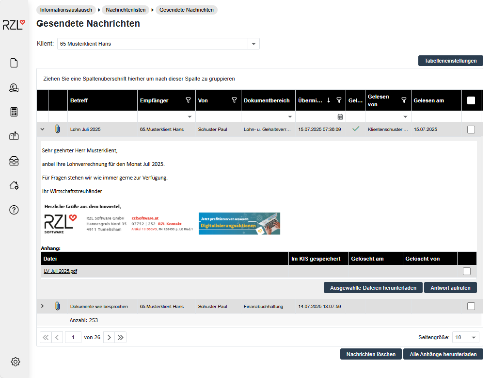

# Nachrichtenliste

## Gesendete Nachrichten

Im Programmteil *Informationsaustausch / Nachrichtenlisten / Gesendete Nachrichten* kann der eingeloggte Kanzleisachbearbeiter die versendeten Nachrichten einsehen.

Durch Anklicken des \> Symbols in der ersten Spalte öffnet sich die Detailansicht der Nachricht. Zur besseren Übersicht und Sortierung stehen Ihnen verschiedene Filtermöglichkeiten zur Verfügung. In den Spalten *Gelesen, Gelesen von und Gelesen am* sehen Sie, ob und wann der Klient die Nachricht gelesen hat.

### Tabelleneinstellungen 

Vgl. Kapitel [Allgemeine Listenfunktionen](/Klientenportal/Klientenportal-Kanzlei/Informationsaustausch/Listenfunktion/)

**Verlauf der Nachricht / Antwort aufrufen**

Gibt es in der geöffneten Nachricht dazugehörige frühere Nachrichten, können diese über die Schaltfläche *Verlauf der Nachricht* aufgerufen werden. Wurde die geöffnete Nachricht bereits beantwortet, kann die Antwort durch Anwahl der Schaltfläche *Antwort aufrufen* geöffnet werden. Diese Schaltflächen finden Sie im unteren Teil der Nachricht.

**Anhänge herunterladen**

Beinhaltet die Nachricht einen Anhang kann dieser über den *Menüpunkt Anhänge herunterladen* geöffnet und gespeichert werden.

### Nachrichten löschen 

Wählen Sie dazu die gewünschte Nachricht in der letzten Spalte durch Setzen des Häkchens an. Mit *Nachricht löschen* werden die markierten Nachrichten nicht nur in der Kanzleisachbearbeiter-Ansicht, sondern auch bei den betroffenen Klienten gelöscht.

## Empfangene Nachrichten

Wenn der Klient eine Nachricht an den Kanzleisachbearbeiter übermittelt, erscheint diese beim nächsten Login des Kanzleisachbearbeiters am Klientenportal in der Protokollansicht. Diese kann auch jederzeit im Menü *Informationsaustausch / Nachrichtenlisten / Empfangene Nachrichte*n aufgerufen werden.
